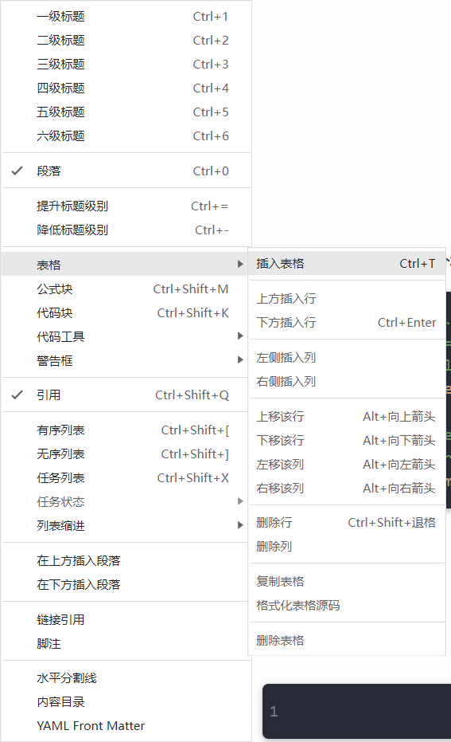
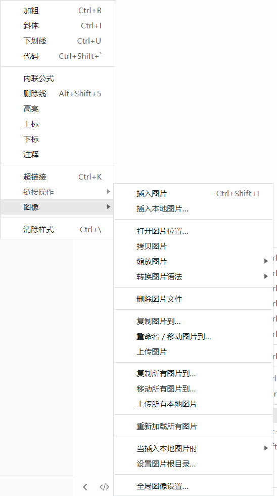
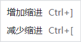

# `SynyLearn`
同步学习笔记和学习资料

**今日**

- webpack-dev-server  HotModuleReplacement

**实践**

- 命令行输出模板文件

**项目**

- 配置  [脚手架](https://auth0.com/blog/how-to-configure-create-react-app/) --> 博客 部署 --> 组件库
- 谷歌插件 双语字幕

**复习路径**

- 看推荐文章——学习
- 看面试题——补充
- 看自检清单——查缺


  



  

**粗体** *斜体* <u>下划线</u> `代码` ~~删除线~~ ==高亮== H~O~2 X^2^ <!--注释--> [超链接]() $内联公式$

1. 有序列表

- 无序列表

- [ ] 任务列表

  
> [!NOTE]
>
> 提醒内容

> [!TIP]
>
> 建议内容

> [!IMPORTANT]
>
> 重要内容

> [!WARNING]
>
> 警告内容

> [!CAUTION]
>
> 注意内容

> 引用

```
代码块
```

$$
公式块
$$

表格

|      |      |
| ---- | ---- |
|      |      |

分割线

------

目录

[TOC]
