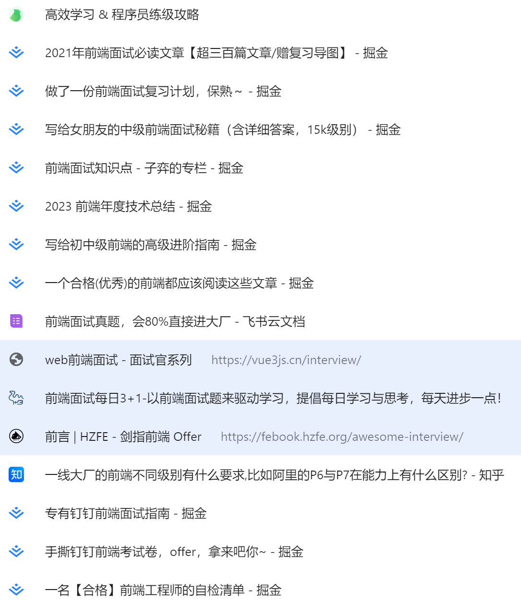

# `SynyLearn`
同步学习笔记和学习资料

**今日**

- webpack-dev-server  HotModuleReplacement

**实践**

- 命令行输出模板文件

**项目**

- 配置  [脚手架](https://auth0.com/blog/how-to-configure-create-react-app/)--> 博客 部署 --> 组件库
- 谷歌插件 双语字幕

**复习路径**

- 看推荐文章——学习
- 看面试题——补充
- 看自检清单——查缺

  

  

