# 1、归因论证

**题目形式：**一般由**对比实验和原因分析（对策建议）或不同平常或过往的既成事实和原因分析**两部分组成，有些题目会省略原因分析的过程，直接给出结论或建议。**前者可称为对比实验归因，后者可称为一般归因。**

## 1.1 另外他因

正确答案：==可以说实验者他因导致结果，也可以对照组他因导致偏差==

错误选项：==分组不正确（说到实验组没说结果，说到结果没说是实验者）、两者都有、一些有的个例==

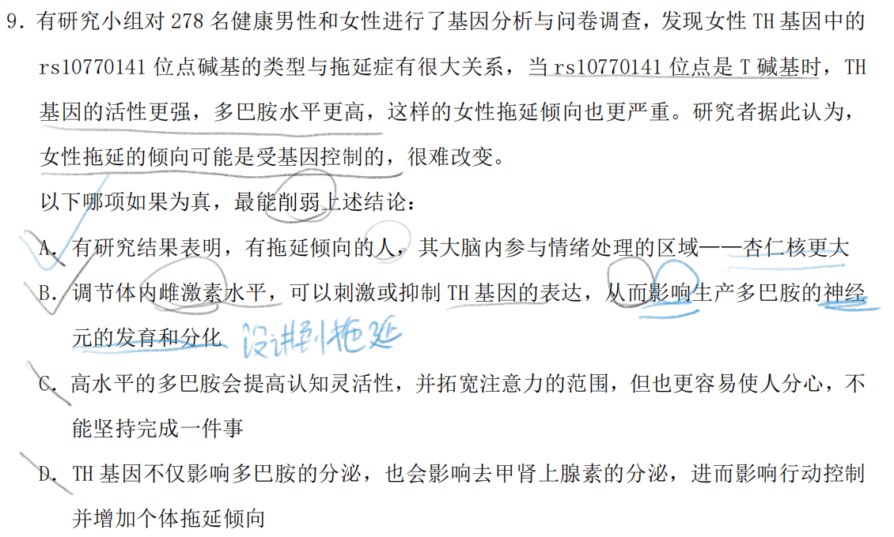

## 1.2 因果倒置

## 1.3 否定此因

正确答案：==要有论据的说明结论不行，如果仅仅只是把结论反着说是抬杠==

## 1.4 反常情况归因

正确答案：==选项反着说是不是会改变现状==

## 1.5 构成对比试验

35题目没有说安装前后情况，答案补充了前提，且说别的小区装了不行是质疑不是支持

36题目已经说了创卫前后空气情况，再说创卫前不好就是重复题干

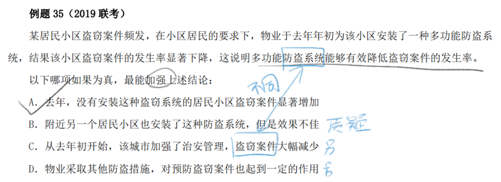

# 2、数量论证

**数量论证**：一种**“数学+逻辑”**的综合题目，题干中存在的逻辑漏洞和数学知识有关，可针对常见逻辑漏洞攻击

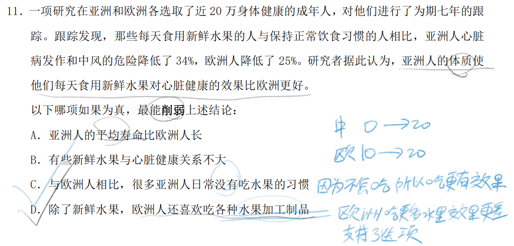

# 3、逻辑论证之严谨逻辑关系

**严谨逻辑关系**：一种**“形式逻辑+论证”**的综合题目，题干中存在逻辑关联词，可先翻译再解题。

## （1）A且非B质疑

# 4、逻辑论证之一般质疑

**无论据有结论**：此类问题较简单，题干常由“背景、分析和结论”，常用**提出反向论据**的方式反驳论点

**有论据有结论**：质疑论据、增加反向论据

## （1）注意主体一致

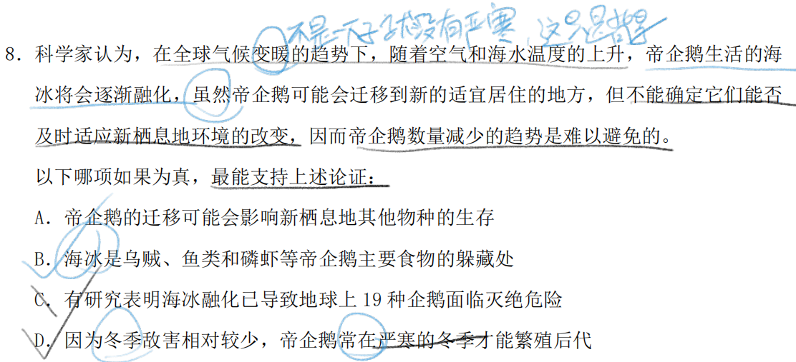

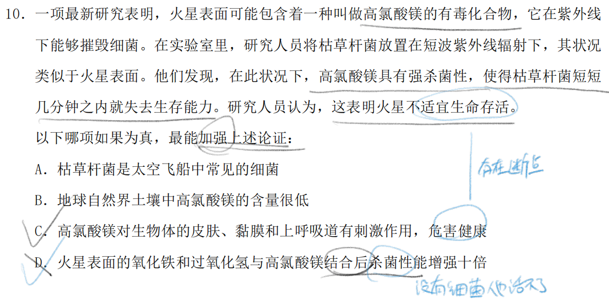

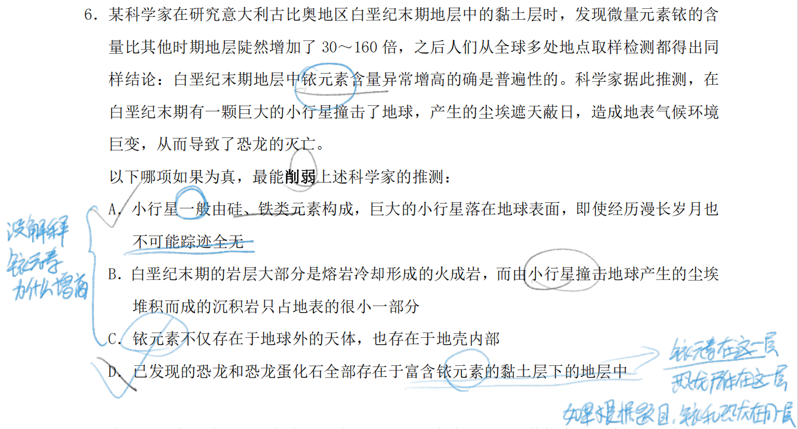

==认知水平不等于阅读和思考能力，选项主体和结论不一致==

==雇佣中层管理不等于对发展有作用==

## （2）注意题目中出现新东西

## （3）注意选项的词语

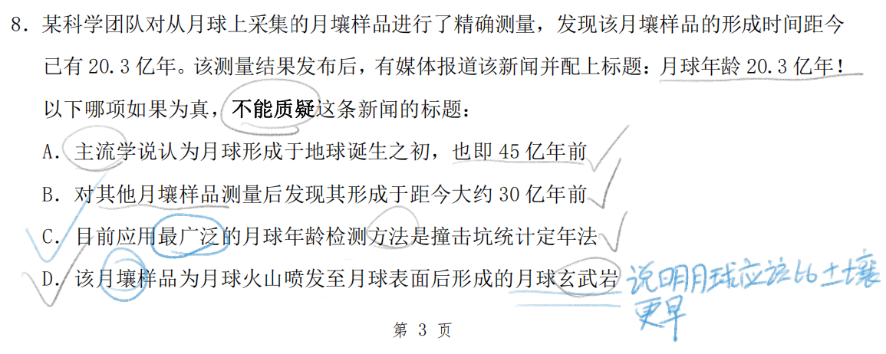

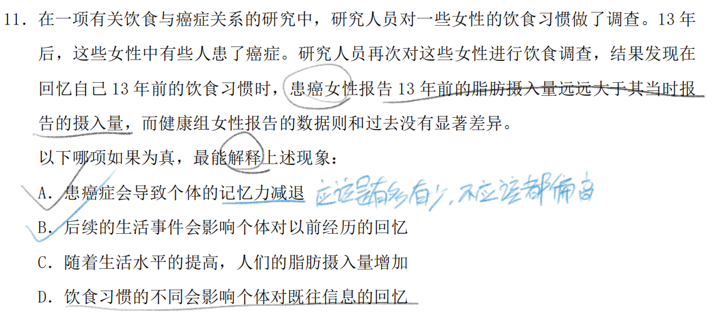

## （4）个例在严禁逻辑中很强

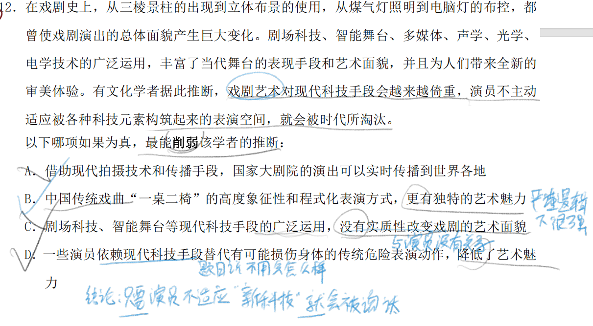

## （5）三段论

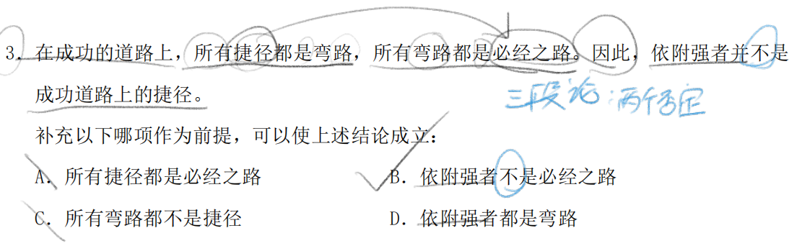

# 5、逻辑论证之支持、前提 、解释

**支持论证类**：

- “以下哪项如果为真，最能加强上述论证”、“以下哪项如果为真，最能支持上述发现”
- **支持类常见支持方式：**解释说明、断点搭桥、增加正向论据、必要条件、举例支持等

**前提假设类**：

- “如果上述结论为真，需要补充的前提是”、“上述推测还需要隐含哪一项假设”
- **前提假设类常见选项形式：**断点搭桥（同支持类）、补充漏洞（类似增加正向论据）、必要条件（同支持类）
- **支持和前提 关系：**前提假设可看作“特殊支持类”，解法相对固定，重点考虑上述三类选项，但逻辑本质也是支持，属于补充论证过程缺少内容的支持

**解释说明类**：

- “以下最能解释这一现象的是”、“以下哪项为真，最能解释这一情况”

- **解释说明类：**此类问题题干中存在一个“让人费解”的现象，此现象看似“不寻常”实则“正常”，需要我们为其找到一个合理的理由，这个理由不能像借口，越能让人接受越好；此类问题的正确选项往往是出题人故意未提及且大家也容易忽略的合理事实，只要加上此事实，就可让人疑惑顿消
- **支持和解释关系：**解释也可看作“特殊支持类”，通过解释说明支持题干现象的合理性，类似支持类的解释说明支持

## （1）重复论据/类比无法支持

## （2）增加必要条件

## （3）审题

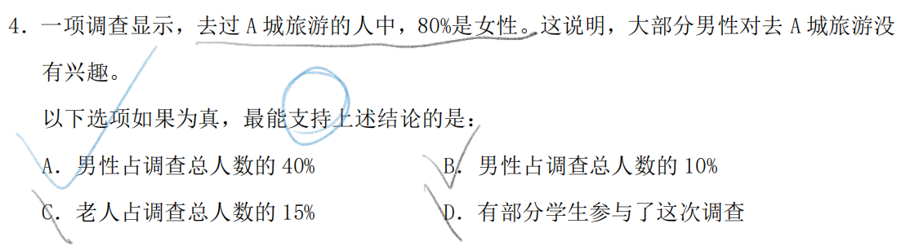

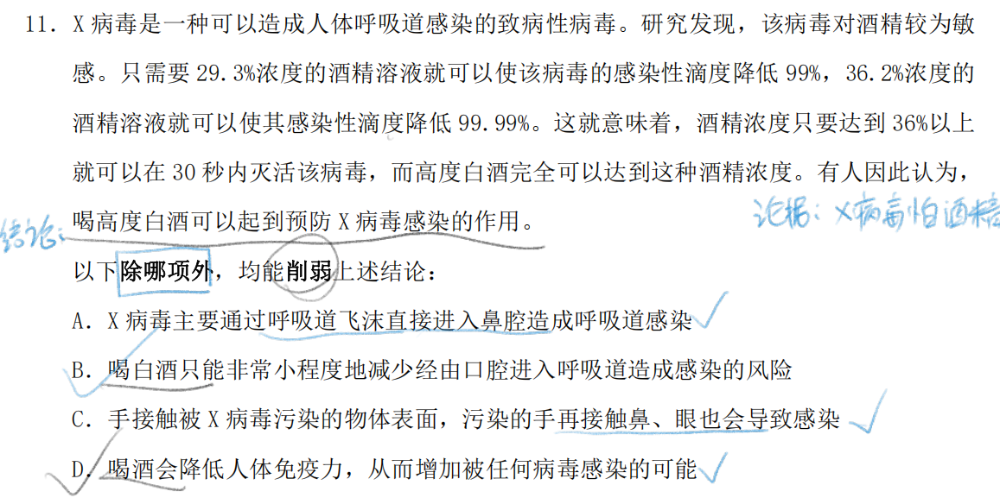

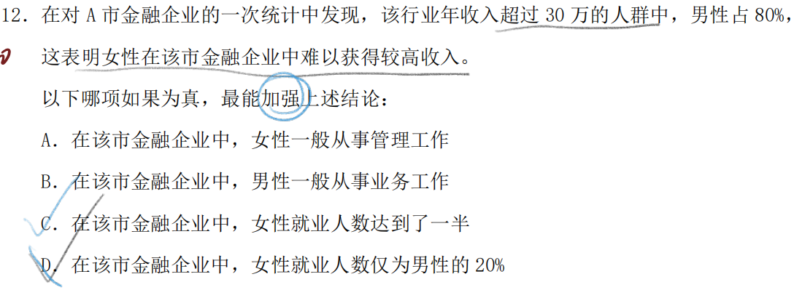

# 6、翻译推理

**范畴推理**指的是根据直言命题（所有、有些、特指）之间关系和性质进行推理的题目，也包括判定各集合之间包含、交叉等关系的题目。

## 6.1 等价推出

## （1）A且B的矛盾

在p中：A且B可以说一边

在q中：A且B的矛盾不能只说一边

既要锻炼又要吃保健品 的矛盾 非(既要锻炼又要吃保健品) 即 不锻炼或者不吃保健品

不锻炼或者不吃保健品 等价于 锻炼-->不吃保健品  or  吃保健品-->不锻炼

## （2）必要条件没有识别

## 6.2 正推逆推

## 6.3 **推出信息**

根据所给命题的真假，判定选项命题或事实的真假

## 6.4 范畴推理

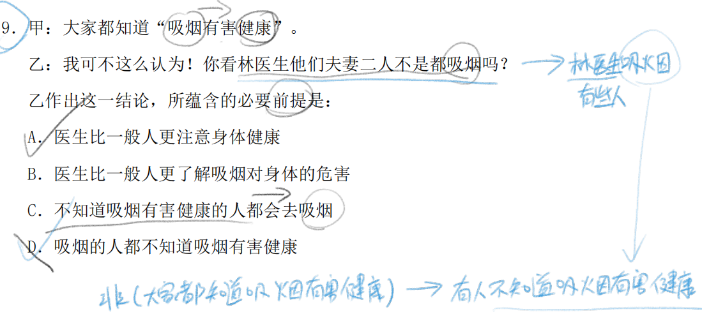

## （3）确定真假

==矛盾关系可以确定真假==

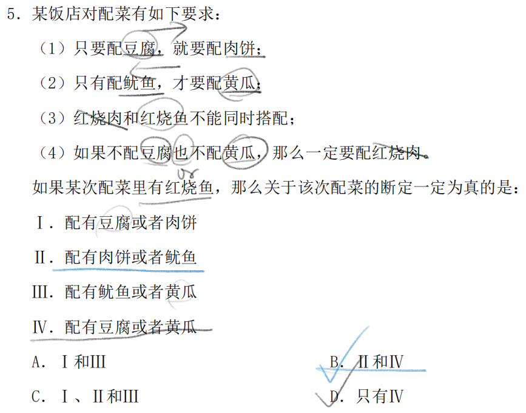

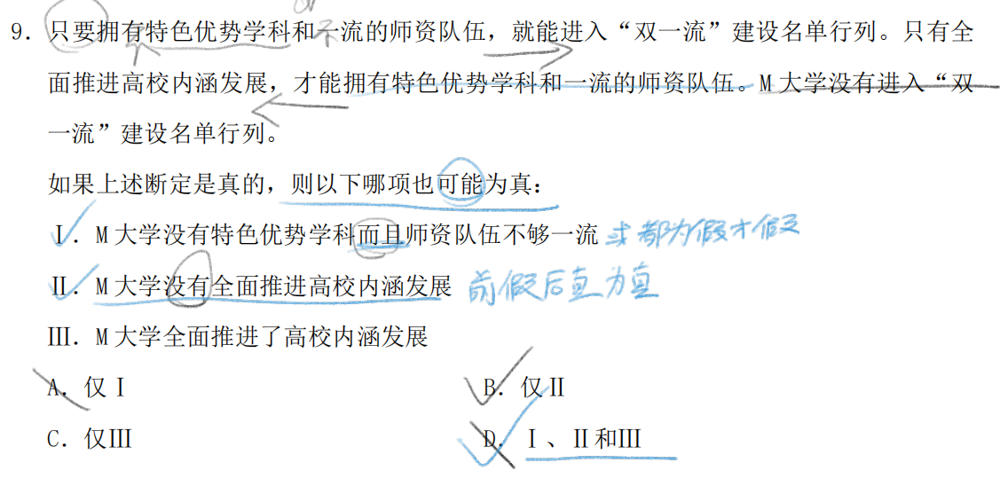

# 7、分析推理

## 7.1 真假分析

## （1）矛盾入手

## （2）假设法

## （3）选项入手

## 7.2 日常分析

# 8、推理方式与论证结构

