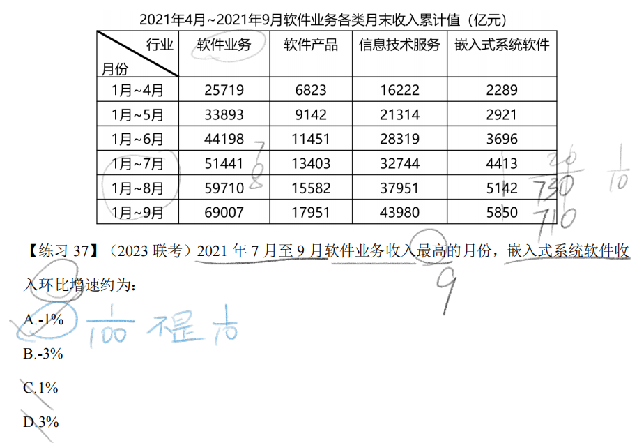
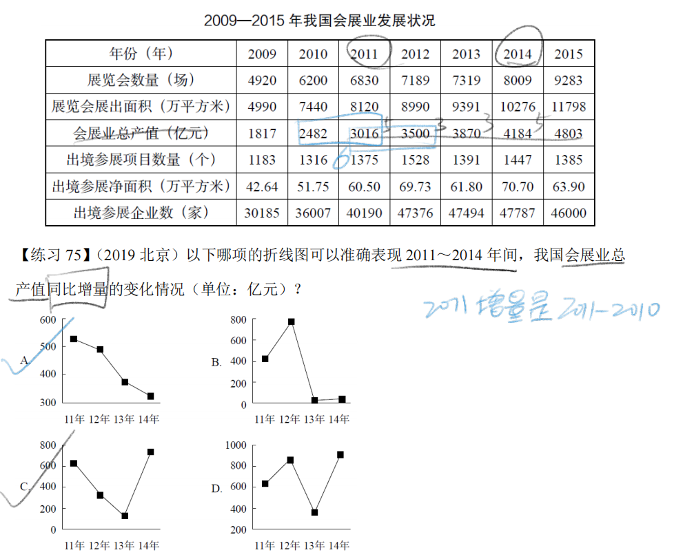

# 1、审题

==同比环比弄混==

==基期现期==

# 2、找数

==增量题目有给出不用计算==

==注意范围==

# 3、计算

==增加减少弄混==

==公式用错==

==注意单位==

==计算结果在临界值，要精算==

==按照增速变化，每年的增量是不同的==

==分子在里面，分母在外面==

==分子分母搞错==

==分数和百分数转化==

==估算==

# 4、其他

==计算技巧==

==百分数加1做分母==

==计算前记得观察选项==

