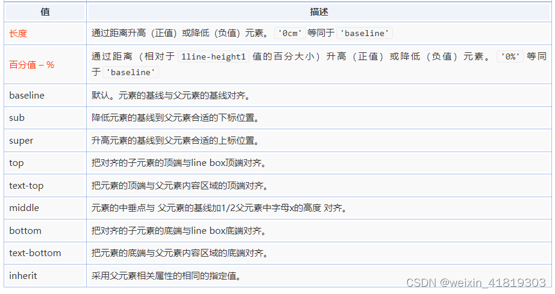

1、流、元素与基本尺寸
1.1 “流”
`CSS` 世界中的一种基本的定位和布局机制
 - 块级元素自动铺满容器，就像在一个容器里倒入足量的水时，水一定会均匀铺满整个容器
 - 行内元素依次排列不足则换行

每个元素都两个盒子
 - 内在盒子（容器盒子）负责宽高、内容呈现什么的，由 `content box`、`padding box`、`border box` 和 `margin box` 组成
 - 外在盒子负责元素是可以一行显示，还是只能换行显示 

尺寸也分“内部尺寸”和“外部尺寸”
 - 内部尺寸 `Intrinsic Sizing`，表示尺寸由内部元素决定；
 - 外部尺寸 `Extrinsic Sizing`，宽度由外部元素决定。

1.2 `width` 作用的具体细节
块级元素的流体特性主要体现在水平方向上
`width` 的默认值是 `auto`，包含了以下 4 种不同的宽度表现
（1）充分利用可用空间 `fill-available`：`<div>`、`<p>`元素的宽度默认是100%于父级容器的，==外部尺寸==
（2）收缩与包裹 `fit-content`：浮动、绝对定位、`inline-block` 元素或 `table` 元素
（3）收缩到最小 `min-content`：`table-layout` 为 `auto` 的表格，英文单词不能断
（4）超出容器限制 `max-content`：内联元素被设置了 `white-space:nowrap`

**外部尺寸与流体特性**
（1）正常流宽度
（2）==格式化宽度==
元素 `position` 属性值为 `absolute` 或 `fixed`，且 `left/top` 或 `top/bottom` 对立方位的属性值同时存在的时候，元素的宽度表现为“格式化宽度”，其宽度大小相对于最近的具有定位特性（`position` 属性值不是 `static`）的祖先元素计算

**内部尺寸与流体特性**
（1）包裹性
按钮 `inline-block`，按钮文字越多宽度越宽（内部尺寸特性），但如果文字足够多，则会在容器的宽度处自动换行（自适应特性）
（2）首选最小宽度
外部容器的宽度是0，里面的 `inline-block` 元素的宽度是最小宽度，中文最小宽度为每个汉字的宽度14
（3）最大宽度
“最大宽度”实际等同于“包裹性”元素设置 white-space:nowrap 声明后的宽度。
如果内部没有块级元素或者块级元素没有设定宽度值，则“最大宽度”实际上是最大的连续内联盒子的宽度。
连续数字和英文是一个整体

1.3 `height:auto` `height:100% `
宽度是稀缺的，高度是无限的
元素高度计算：有几个元素盒子，每个多高，然后一加，就是最终的高度值了

普通文档流中的元素，**百分比高度值要想起作用**，其父级必须有一个可以生效的**高度值或者使用绝对定位**，绝对定位的宽高百分比计算是相对于 `padding box` 的，非绝对定位元素则是相对于 `content box` 计算的

**无论内联元素还是块级元素，`height: auto` 都是呈现出包裹性，即元素高度由子元素的高度决定。**

1.4 `min-width/max-width和min-height/max-height`
`max-width/max-height` 的初始值是 `none`，`min-width/min-height` 的初始值都是 `auto`
`max-width` 会覆盖 `width`，即使 `width` 使用 `!important`
`min-width` 和 `max-width` 冲突的时候，`min-width` 覆盖 `max-width`

```css
// 强制 height 为 auto 可以确保宽度不超出的同时使图片保持原来的比例
img { 
 max-width: 100%; 
 height: auto!important; 
}

// 任意高度元素的展开收起动画技术
.element { 
 max-height: 0; 
 overflow: hidden; 
 transition: max-height .25s; 
} 
.element.active { 
 max-height: 666px; /* 一个足够大的最大高度值 */ 
}
```

1.5 内联元素
从作用上来讲，块级负责结构，内联负责内容
**浮动元素已经在文档流之外了，浮动元素会生成“块盒子”**

**内联盒模型**
```html
<p>这是一行普通的文字，这里有个 <em>em</em> 标签。</p>
```
（1）内容区域（content area）：文本选中区，是一种围绕文字看不见的盒子。内容区域的大小与字号(font-size)以及字体(font-size)大小相关，Ascender + Descender = conent-area的高度。
（2）内联盒子（inline box）：如果外部含内联标签（<span>等），属于“内联盒子”；如果只有文字，属于“匿名内联盒子”
（3）行框盒子（line box）：每一行就是一个“行框盒子”，每个“行框盒子”又是由一个一个“内联盒子”组成的
（4）包含盒子（containing box）：由一行一行的“行框盒子”组成

1.6 幽灵空白节点
**`line box` 高度**
 1. The line box height is the distance between the uppermost box top and the lowermost box bottom. (This includes the strut, as explained under ‘line-height’ below.)
`line box` 高度由最顶部内联盒子到最底部内联盒子（包括`strut`）
 2. The height of each inline-level box in the line box is calculated. For replaced elements, inline-block elements, and inline-table elements, this is the height of their margin box; for inline boxes, this is their ‘line-height’. (See “Calculating heights and margins” and the height of inline boxes in “Leading and half-leading”.) Line boxes are created as needed to hold inline-level content within an inline formatting context.  
替换元素、`inline-block`、`inline-table` 高度由它们 `margin box` 决定。
如果一个标签没有定义height属性(包括百分比高度)，那么其最终表现的高度一定是由line-height起作用。
内联元素高度由 `line-height` 决定。虽然 `line-height` 为 `0` 时行内元素盒子高度是 `0` 但是字体还是有的。
没有文字等内容的 `line-boxes` 模型被看作是零高的模型，视为不存在。所以也就不会影响父级的高度了。
 3. 每行开始都有一个继承父级元素字体和行高属性的零宽内联框。正是这个假想的内联框，父元素的高度因此而来。

示例：
没有文字等内容：`<div></div>`，如果没有设置高度height值时，该`div`的高度就是0
如果该div里面打入了一个空格或是文字，则此div就会有一个高度。line-height行高怎么就产生了高度。
一个没有设置height属性的div的高度就是由一个一个line boxes的高度堆积而成的。
line boxes高度有内部inline boxes决定

`font-size`
- 一款字体首先会定义一个 `em-square`， `em-square`  一般被设定为宽高均为 `1000` 相对单位
- 每个字体会定义 `5` 条度量线来控制字符的位置，这些度量的刻度是基于 `1000` 这个相对单位
- 在浏览器中，上面的 `1000` 相对单位会按照你需要的 `font-size` 缩放
- 不同字体的字体度量是不一样的，Catamaran 字体占据了 `1100 + 540` 个相对单位，尽管它的 em-square 只有 1000 个相对单位，所以当我们设置 font-size:100px 时，这个字体里的文字高度是 1640*100/1000 = 164px

`line-height` 
- 指的是两行文字基线之间的距离，也可以称为这行文字所占的高度
- 内容区域高度(content area)+行间距(vertical spacing)=行高(line-height)
- 在simsun字体(即宋体)下，内容区域高度等于文字大小值。所以，在simsun字体下，font-size+行间距=line-height。行间距上下拆分，就有了半行间距；例如在simsun字体下，font-size=240px，line-height=360px，则半行间距是：（360-240）/2 = 60px
- **如果line-height 小于font-size**，inline box会优先于行高，以保证inline box的高度正好等于行高。例：font-size: 16px; line-height: 12px; inline box高度为12px。content area会溢出，inline box的顶部和底部半行高会折叠起来，以保证inline box的高度。

`line-height` 决定子元素的间距
- `<span style="line-height: 20px">hello</span>` 子元素就是匿名内联盒子 `hello`
- `<div class="container">
    <div>left</div><span>hello</span>
  </div>` 子元素就是 `div` 和 `span`，对块级元素起作用是对块级元素里面的行内元素，例子中就是匿名内联盒子 `left`
- `line-height` 可以被继承
- `line-height` 可以被选中，但是 `background-color` 不起作用
- line-height属性是不作用于padding

`vertical-align`
- vertical-align 可以改变父元素高度 ？todo
- line boxes高度先统计所有行内盒子在基线上对齐后的高度，确定好父元素高度，然后根据父元素高度确定 vertical-align 的位置
- vertical-align的本质上是个独立的个体，与后面的inline水平的元素是不存在直接的关系的
- a line-box’s height is computed based on its children’s line-height and vertical-align properties
- 不同大小字体，基线对齐，会让line-box高度大于line-height


**幽灵空白节点**
内联元素的所有解析和渲染表现就如同每个行框盒子的前面有一个“空白节点”一样，该元素的字体和行高属性的 0 宽度的内联盒。
内联元素的垂直 `padding` 会让“幽灵空白节点”显现。

```css
div { 
 background-color: #cd0000; 
} 
span { 
 display: inline-block; // 如果没有这行不会撑起父元素，因为文字等内容的 line-boxes 模型被看作是零高的模型
} 
<div><span></span></div>
```

2、盒尺寸四大家族
2.1 `content`
替换元素：`、<object>、<video>、<iframe>、<textarea>、<input>` 等
特点：
 - 内容可替换，例如设置 `multiple` 属性，下拉直接变成了展开的直选多选模式； 
 - 基本样式外部 `CSS` 很难改变；
 - 它有自己的尺寸，基线是下边缘等。

替换元素和非替换元素之间只隔了一个 `src` 属性
替换元素和非替换元素之间只隔了一个 `CSS content` 属性，`content` 属性生成的内容都是替换元素

伪元素before，就是在正常流布局下，在元素前面占用位置，会把元素往后挤
伪元素after，就是在正常流布局下，在元素后面新增元素，会改变元素高度

```css
/* :before 伪元素用于辅助实现底对齐 :after伪元素用于辅助实现两端对齐 */
.box { 
 width: 256px; height: 256px; 
 /* 两端对齐关键 */ 
 text-align: justify; 
} 
.box:before { 
 content: ""; 
 display: inline-block; 
 height: 100%; 
} 
.box:after { 
 content: ""; 
 display: inline-block; 
 width: 100%; 
} 
.bar { 
 display: inline-block; 
 width: 20px; 
} 

/* 对应的 HTML 代码如下：*/
<div class="box"><i class="bar"></i> 
 <i class="bar"></i> 
 <i class="bar"></i> 
 <i class="bar"></i> 
</div>
```

2.2 `padding`
如果 `padding` 值足够大，那么 `width` 也无能为力了，最终宽度为 120 像素（60px×2），而里面的内容则表现为“首选最小宽度”

```css
.box { 
 width: 80px; 
 padding: 20px 60px; 
 box-sizing: border-box; 
}
```

**内联元素的 `padding`** 
 - 内联元素没有可视宽度和可视高度的说法（`clientHeight` 和 `clientWidth` 永远是0），**垂直方向的行为表现完全受 `line-height` 和 `vertical-align` 的影响**，视觉上 `padding` 并没有改变和上一行下一行内容的间距，因此，给我们的感觉就会是垂直 `padding` 没有起作用，但是**垂直方向发生了层叠**。 
- 不影响其他元素布局而是出现层叠效果的现象。比如，`relative` 元素的定位、盒阴影
-  `box-shadow` 以及 `outline` 等 内联元素 `padding` 会**断行**

**属性值**
`margin` 属性不同，`padding` 属性是**不支持负值**的
`padding` **百分比值**无论是水平方向还是垂直方向均是相对于**宽度**计算的

2.3 `margin `
**尺寸命名和对应的盒子类型**
- 元素内部尺寸：包括 `padding`，`clientWidth` 和 `clientHeight`，元素可视尺寸
- 元素尺寸：包括 `padding` 和 `border`，`offsetWidth` 和 `offsetHeight`，元素偏移尺寸
- 元素外部尺寸：包括 `padding`、`border`、`margin`

**margin 可以改变元素的可视尺寸**
- 对于 `padding`，元素设定了 `width` 或者保持“包裹性”的时候，会改变元素可视尺寸。
- 对于 `margin` 则相反，元素设定了 `width` 值或者保持“包裹性”的时候，`margin` 对尺寸没有影响，只有元素是“充分利用可用空间”(没有设置宽度)状态的时候，`margin` 才可以改变元素的可视尺寸(水平)。
- 垂直方向 `margin` 无法改变元素的内部尺寸，但却能改变外部尺寸。
- 内联元素垂直方向的 `margin` 是没有任何影响的，既不会影响外部尺寸。对于水平方向，由于内联元素宽度表现为“包裹性”，也不会影响内部尺寸。

但是这种情况只会发生在元素是流布局的时候，即元素width是默认的auto并且可以撑满一行的时候。如果元素设定了宽度，或者元素设置了float: left / position: absolute这样的属性改变了流体布局，那么margin为负也无法改变元素的宽度了。

```css
<div class="father"> 
 <div class="son"></div> 
</div> 
.father { width: 300px; margin: 0 -20px; } // father 元素的宽度就是 300 像素
.son { margin: 0 -20px; } // son 元素的宽度就是 340 像素

// 如果图片左侧定位，自适应的部分是文字
.box { overflow: hidden; } 
.box > img { float: left; } 
.box > p { margin-left: 140px; } 

<div class="box"> 
  
<p>文字内容...</p>
</div>

// <ul>的宽度就相当于 100%+20px，第 3n 的<li>标签的 margin-right: 20px 就多了 20 像素的使用空间
// 列表的右边缘就是父级<ul>容器 100%宽度位置，两端对齐效果就此实现了
ul { 
 margin-right: -20px; 
} 
ul > li { 
 float: left; 
 width: 100px; 
 margin-right: 20px; 
}

// 无论内容多少，两栏背景色都和容器一样高
// margin元素的外部尺寸在垂直方向上小了 9999px，后面所有元素和上面元素的空间距离变成了-9999px，也就是后面元素都往上移动了 9999px
// padding增加元素高度，这正负一抵消，对布局层并无影响
.column-box { 
 overflow: hidden; 
} 
.column-left, 
.column-right { 
 margin-bottom: -9999px; 
 padding-bottom: 9999px; 
}
```

**margin 合并**
（1）块级元素，但不包括浮动和绝对定位元素，尽管浮动和绝对定位可以让元素块状化。
（2）只发生在垂直方向，需要注意的是，这种说法在不考虑 writing-mode 的情况下才是正确的，严格来讲，应该是只发生在和当前文档流方向的相垂直的方向上。由于默认文档流是水平流，因此发生 margin 合并的就是垂直方向。
`margin` 合并有以下 3 种场景：
（1）相邻兄弟元素 `margin` 合并。
（2）父级和第一个/最后一个子元素。
（3）空块级元素的 `margin` 合并。
`margin` 合并的计算规则总结为“正正取大值”“正负值相加”“负负最负值”

对于 margin-top 合并，可以进行如下操作（满足一个条件即可）：
• 父元素设置为块状格式化上下文元素；
• 父元素设置 border-top 值；
• 父元素设置 padding-top 值；
• 父元素和第一个子元素之间添加内联元素进行分隔。
对于 margin-bottom 合并，可以进行如下操作（满足一个条件即可）：
• 父元素设置为块状格式化上下文元素；
• 父元素设置 border-bottom 值；
• 父元素设置 padding-bottom 值；
• 父元素和最后一个子元素之间添加内联元素进行分隔；
• 父元素设置 height、min-height 或 max-height。
如果有人不希望空<div>元素有 margin 合并，可以进行如下操作：
• 设置垂直方向的 border；
• 设置垂直方向的 padding；
• 里面添加内联元素（直接 Space 键空格是没用的）；
• 设置 height 或者 min-height。

**margin 属性值**
`margin` 的百分比值无论是水平方向还是垂直方向都是相对于宽度计算的
`margin` 的初始值大小是 `0`
`margin:auto` 的填充规则
（1）如果一侧定值，一侧 `auto`，则 `auto` 为剩余空间大小。
（2）如果两侧均是 `auto`，则平分剩余空间。

让某个块状元素右对齐，脑子里不要就一个 `float:right`，很多时候，`margin-left:auto` 才是最佳的实践
`margin` 属性的 `auto` 计算就是为块级元素左中右对齐而设计的，和内联元素使用 `text-align` 控制左中右对齐正好遥相呼应
因为竖直方向不会自动填充，`margin:auto` 居中在竖直方向不起作用
如果里面元素尺寸大，说明剩余可用空间都没有了，`margin` 会被当作 `0` 来处理

```css
// 把.son 元素的 height:100px 去掉，.son 的高度不会自动和父元素等高变成 200px
// 无法触发 margin:auto计算，故而无法垂直居中
.father { 
 height: 200px; 
} 
.son { 
 height: 100px; 
 margin: auto; 
}

// 水平垂直同时居中
// 此时.son 这个元素的尺寸表现为“格式化宽度和格式化高度”，和<div>的“正常流宽度”一样，同属于外部尺寸，也就是尺寸自动填充父级元素的可用尺寸
.father { 
 width: 300px; height:150px; 
 position: relative; 
} 
.son { 
 position: absolute; 
 top: 0; right: 0; bottom: 0; left: 0; 
 width: 200px; height: 100px; 
 margin: auto; 
}
```

2.4 `border`
`border-width` 不支持百分比
```css
// 增加点击区域大小
.icon-clear { 
 width: 16px; 
 height: 16px; 
 border: 11px solid transparent; 
 ... 
}

// 朝下的等腰直角三角形
div { 
 width: 0; 
 border: 10px solid; 
border-color: #f30 transparent transparent; 
}
```

3、内联元素与流
3.1 字母 `x` 与 `CSS` 世界的基线
`vertical-align:middle`，`middle` 指的是基线往上 `1/2 x-height` 高度。可以近似理解为字母 `x` 交叉点那个位置。

3.2 `line-height`
对于非替换元素的**纯内联元素**，其可视高度完全由 `line-height` 决定，`line-height - font-size = 行距`，`行距 / 2` 平分在字体上下

设置 `<span>` 元素 `display:inline-block`，创建一个独立的“行框盒子”，这样 `<span>` 元素设置的 `line-height: 20px` 就可以生效了
`inline-block` 高度由自己本身 `margin-box` 决定

```css
// div没有高度 文字在
<div class="test1">我的高度是？</div> 
.test1 { 
 font-size: 16px; 
 line-height: 0; 
 border: 1px solid #ccc; 
 background: #eee; 
} 

// div有高度 文字不在
<div class="test2">我的高度是？</div> 
.test2 { 
 font-size: 0; 
 line-height: 16px; 
 border: 1px solid #ccc; 
 background: #eee; 
}
```

`line-height` 不影响**替换元素**（如图片的高度）
图片为内联元素，会构成一个“行框盒子”，而在 `HTML5` 文档模式下，每一个“行框盒子”的前面都有一个宽度为 0 的“幽灵空白节点”，其内联特性表现和普通字符一模一样，所以这里的容器高度会等于 `line-height` 设置的属性值 `256px`
`line-height` 在这个混合元素的“行框盒子”中扮演的角色是决定这个行盒的最小高度
```css
.box { 
 line-height: 256px; 
} 
<div class="box"> 
  
</div>
```

对于**块级元素**，`line-height` 对其本身是没有任何作用的，我们平时改变 `line-height`，块级元素的高度跟着变化实际上是通过改变块级元素里面内联级别元素占据的高度实现的

**line-height 的各类属性值**
`line-height:1.5`、`line-height:150%` 和 `line-height:1.5em` 最终的行高大小都是和 `font-size` 计算值，但是 `%` 和 `em` 会把具体数值继承给子代

**内联元素 `line-height` 的“大值特性”**
`<span>`元素 `display:inline-block`，此时高度计算不再是 `line-height` 决定而是 `margin-box` 决定，`height` 不是 `auto` 而是 `20px`
```css
// 全都是 96px 高
<div class="box"> 
 <span>内容...</span> 
</div> 

.box { 
 line-height: 96px; 
} 
.box span { 
 line-height: 20px; 
} 

.box { 
 line-height: 20px; 
} 
.box span { 
 line-height: 96px; 
}
```

3.3 `vertical-align`
行内元素的对齐方式，`line-height` 决定行内元素高度，布局时行内元素高度依赖 `line-height` 而不是 `font-size`
**`vertical-align` 属性只能作用在 `display` 计算值为 `inline`、`inline-block`，`inline-table` 或 `table-cell` 的元素上**
`vertical-align` 不会被继承

3.3.1 `vertical-align` 属性值
`vertical-align` 属性值分为以下 4 类：
• 线类，如 `baseline`（默认值）、`top`、`middle`、`bottom`；
• 文本类，如 `text-top`、`text-bottom`；
• 上标下标类，如 `sub`、`super`；
• 数值百分比类，如 `20px`、`2em`、`20%`等。

`top` 与 `bottom` 是使元素相对于行内元素垂直对齐外，其他属性值都是相对于父元素
`top` 是元素 `line-height` 顶部对齐，当前行最高的顶部
`text-top` 是和父元素字体、`line-height` 一样的元素，`line-height` 顶部对齐该元素 `line-height` 顶部

`vertical-align:baseline` 等同于 `vertical-align:0`
**数值大小全部都是相对于基线位置计算的**，负值全部都是往下偏移，正值全部都是往上偏移
`vertical-align` 属性的百分比值则是相对于 `line-height` 的计算值计算的

```css
.box { 
 height: 128px; 
 /* 设置一个足够大的行高让“幽灵空白节点”高度足够，就会看到 vertical-align:middle 起作用 */
 line-height: 128px; /* 关键 CSS 属性 */
} 
.box > img { 
 height: 96px; 
 vertical-align: middle; 
} 
<div class="box"> 
  
</div>
```

3.3.2 `vertical-align` 和 `line-height` 之间的关系
文字默认全部都是基线对齐，所以当字号大小不一样的两个文字在一起的时候，彼此就会发生上下位移，如果位移距离足够大，就会超过行高的限制，而导致出现意料之外的高度

```css
.box { line-height: 32px; } 
.box > span { font-size: 24px; } 
<div class="box"> 
 <span>文字</span> 
</div>
/* 让“幽灵空白节点”和后面<span>元素字号一样大，.box { font-size: 24px; } */
/* 改变垂直对齐方式，如顶部对齐，.box > span { vertical-align: top; } */
```

当前 `line-height` 计算值是 `20px`，而 `font-size` 只有 `14px`，因此，字母 `x` 往下一定有至少 `3px` 的半行间距，让人以为是图片产生的间隙
（1）图片块状化。
（2）容器 `line-height` 足够小。只要半行间距小到字母 x 的下边缘位置或者再往上，自然就没有了撑开底部间隙高度空间了。比方说，容器设置 `line-height: 0`。
（3）图片设置其他 `vertical-align` 属性值。

```css
.box { 
 width: 280px; 
 outline: 1px solid #aaa; 
 text-align: center; 
} 
.box > img { 
 height: 96px; 
 /* 非主动触发位移的内联元素是不可能跑到计算容器外面的，导致图片的位置被“幽灵空白节点”的 vertical-align:baseline 给限死了，margin失效 */
 margin-top: -200px;
} 
<div class="box"> 
  
</div>
```

3.3.3 `inline-block` 与 `baseline`
`vertical-align` 属性的默认值 `baseline` 在文本之类的**内联元素**那里就是字符 `x` 的下边缘，对于**替换元素**则是替换元素的下边缘。
如果是 **`inline-block` 元素**，如果里面没有内联元素，或者 `overflow` 不是 `visible`，则该元素的基线就是其 `margin` 底边缘；否则其基线就是元素里面最后一行内联元素的基线。

当 `line-height` 变成 `0` 的时候，字符占据的高度也是 `0`，由于 `CSS` 世界中的行间距是上下等分的，因此，此时字符 `x-baseline` 的对齐点就是当前内容区域的垂直中心位置。

`20px` 图标对齐的处理技巧
（1）图标高度和当前行高都是 `20px`
（2）图标标签里面永远有字符
（3）图标 `CSS` 不使用 `overflow:hidden` 保证基线为里面字符的基线，但是要让里面潜在的字符不可见
行高一样，`inline-block` 元素有字符，基于基线排列，图标和字体就会对齐

```css
.icon { 
 display: inline-block; 
 width: 20px; height: 20px;  // 图标高度和当前行高都是 20px
 background: url(sprite.png) no-repeat; 
 white-space: nowrap; 
 letter-spacing: -1em; 
 text-indent: -999em; 
} 
.icon:before { 
 content: '\3000';  // 图标标签里面永远有字符
} 
```
4.流的破坏与保护——float
4.1 `float` 特性
`float` 特性：
- 包裹性：宽度取决于里面的元素；
- 块状化并格式化上下文：`display: block`；
- 破坏文档流；
- 没有任何 `margin` 合并；

父元素高度塌陷
文字环绕效果”是由两个特性（即“父级高度塌陷”和“行框盒子区域限制”）共同作用的结果
- “高度塌陷”只是让跟随的内容可以和浮动元素在一个水平线上。
- “行框盒子和浮动元素的不可重叠性”，也就是“行框盒子如果和浮动元素的垂直高度有重叠，则行框盒子在正常定位状态下只会跟随浮动元素，而不会发生重叠”。
- “行框盒子”是每行内联元素所在的那个盒子，而非外部的块状盒子。给 `<p>` 元素设置个背景色，同时把图片搞透明，背景色会覆盖图片，文字是“行框盒子”则不会覆盖图片。
```html
<!-- img设置float，父元素div高度塌陷，p的文字才能环绕图片 -->
<div class="father"> 
  
</div> 
<p class="animal">小猫 1，小猫 2，...</p>
```

4.2 `float`  实现自适应布局
1. 一侧定宽一侧自适应
```html
<div class="father"> 
  
 <p class="animal">小猫 1，小猫 2，...</p> 
</div> 

.father { 
 overflow: hidden; 
} 
.father > img { 
 width: 60px; height: 64px; 
 float: left; 
} 
// .animal 元素没有浮动，也没有设置宽度，因此，流动性保持得很好
// 设置 margin-left、border-left 或者 padding-left 都可以自动改变 content box 的尺寸
.animal { 
 margin-left: 70px; 
}
```
2. 宽度不固定
```css
.left { 
 float: left; 
 width: 50%; 
} 
.right { 
 margin-left: 50%; 
}
```
3. 多栏布局，两侧固定中间自适应
```html
<div class="box"> 
 <a href class="prev">&laquo; 上一章</a> 
 <a href class="next">下一章 &raquo;</a> 
 <h3 class="title">第 112 章 动物环绕</h3> 
</div> 

.prev { 
 float: left; 
} 
.next { 
 float: right; 
} 
.title { 
 margin: 0 70px; 
 text-align: center; 
}
```

4.3 清除 `float` 
元素盒子的边不能和前面的浮动元素相邻。`clear` 属性是让自身不能和**前面**的浮动元素相邻。
**`clear` 属性只有块级元素才有效的**，而 `::after` 等伪元素默认都是内联水平，借助伪元素清除浮动影响时需要设置 `display` 。
- `none`：默认值，左右浮动来就来。
- `left`：左侧抗浮动。
- `right`：右侧抗浮动。
- `both`：两侧抗浮动。

清除浮动只是让应用改属性值的应用前面不出现浮动，取消文字环绕效果。
如果是父元素高度塌陷，其实是另一个浮动造成的问题，因为浮动元素脱离文档流，父元素高度计算排除浮动元素，解决方案
- 父元素结束标签之前插入块级元素， 块级元素设置清除浮动，这样统计高度是统计最后插入块级元素
- 利用伪元素（clearfix），原理同上
- 利用overflow清除浮动，利用 `BFC`， `BFC`不影响其他元素布局，如果浮动元素不包含进来就会影响其他元素

4.4 `BFC` 块级格式化上下文 
`IFC` 内联格式化上下

如果一个元素具有 `BFC`，内部子元素不会受外部元素影响，也不会影响外部元素。
- 不可能发生 `margin` 重叠的，`margin` 重叠是会影响外面的元素的；
- 可以用来清除浮动的影响，因为如果不清除，子元素浮动则父元素高度塌陷，必然会影响后面元素布局和定位。
- 
触发 `BFC` 情况：
• `<html>` 根元素；
• `float` 的值不为 `none`；
• `overflow` 的值为 `auto`、`scroll` 或 `hidden`；
• `display` 的值为 `table-cell`、`table-caption` 和 `inline-block` 中的任何一个；
• `position` 的值不为 `relative` 和 `static`。

`BFC` 可以实现更健壮、更智能的自适应布局
- `.animal` 元素为了不和浮动元素产生任何交集，顺着图片右侧边缘形成自己的封闭上下文。
- 普通流体元素在设置了 `overflow:hidden` 后，会自动填满容器中除了浮动元素以外的剩余空间，形成自适应布局效果，而且这种自适应布局要比纯流体自适应更加智能。
- 比方说，让图片的尺寸变小或变大，右侧自适应内容无须更改任何样式代码，都可以自动填满剩余的空间。
- 
```html
<div class="father"> 
  
 <p class="animal">小猫 1，小猫 2，...</p> 
</div> 

img { float: left; }
.animal { overflow: hidden; }
```

兼顾流体特性和 `BFC` 特性来实现无敌自适应布局的属性并不多
 1. `float:left`：浮动元素有破坏性和包裹性，失去了元素本身的流体自适应性。
 2. `position:absolute`：脱离文档流有些严重。
 3. `overflow:hidden`：不会影响元素原先的流体特性或宽度表现。要想彻底清除浮动的影响，最适合的属性不是 `clear` 而是 `overflow`。
 4. `display:inline-block`：会让元素尺寸包裹收缩。

4.5 `overflow`
则当子元素内容超出容器宽度高度限制的时候，剪裁的边界是 `border box` 的内边缘。
如果想实现元素剪裁同时四周留有间隙的效果的话，可以试试使用透明边框。

`overflow` 属性值
• `visible`：默认值。
• `hidden`：剪裁。
• `scroll`：滚动条区域一直在。
• `auto`：不足以滚动时没有滚动条，可以滚动时滚动条出现。

除非 `overflow-x` 和 `overflow-y` 的属性值都是 `visible`，否则 `visible` 会当成 `auto` 来解析。永远不可能实现一个方向溢出剪裁或滚动，另一方向内容溢出显示的效果。`scroll`、`auto` 和 `hidden` 这 3 个属性值是可以共存的。

`overflow` 与滚动条
- 默认滚动条均来自 `<html>`，而不是 `<body>` 标签
- 滚动条会占用容器的可用宽度或高度

依赖 overflow 的样式表现
实现单行文字溢出点点点效果必需的 3 个声明如下：
```css
.ell { 
 text-overflow: ellipsis; 
 white-space: nowrap; 
 overflow: hidden; 
}
```

5、`position`
5.1 `absolute`
`position:absolute`
- 块状化
- 包裹性
- 破坏性：虽然 `absolute` 破坏正常的流来实现自己的特性表现，但本身还是受普通的流体元素布局、位置甚至一些内联相关的 `CSS` 属性影响的

**包含块（containing block）**
元素用来计算和定位的一个框。
比方说，`width:50%`，元素的百分比宽度是相对于父元素的 `content box` 宽度计算的，父元素就是包含块
（1）根元素（很多场景下可以看成是 `<html>`）被称为“初始包含块”，其尺寸等同于浏览器可视窗口的大小。
（2）对于其他元素，如果该元素的 `position` 是 `relative` 或者 `static`，则“包含块”由其最近的块容器祖先盒的 `content box` 边界形成。
（3）如果元素 `position:fixed`，则“包含块”是“初始包含块”。
（4）如果元素 `position:absolute`，则“包含块”由最近的 `position` 不为 `static`。如果没有符合条件的祖先元素，则“包含块”是“初始包含块”。
	- 如果该祖先元素是纯 inline 元素，则规则略复杂： 
		- 假设给内联元素的前后各生成一个宽度为 0 的内联盒子（inline box），则这两个内联盒子的 padding box 外面的包围盒就是内联元素的“包含块”；
		- 如果该内联元素被跨行分割了，那么“包含块”是未定义的，也就是 CSS2.1规范并没有明确定义，浏览器自行发挥。
	- 否则，“包含块”由该祖先的 padding box 边界形成。

**具有相对特性的无依赖 `absolute` 绝对定位**
一个绝对定位元素，没有任何 `left/top/right/bottom` 属性设置，并且其祖先元素全部都是非定位元素，其位置在当前位置。
`absolute` 是非常独立的 `CSS` 属性值，其样式和行为表现不依赖其他任何 `CSS` 属性就可以完成。
1．各类图标定位
在导航右上方增加一个 `NEW` 或者 `HOT` 这样的小图标
父元素设置 `padding-left: 20px;`  图标和文字距离左侧边缘隔开 `20px`，`icon` 设置 `absolute` 脱离文档流，文字会顶替 `icon` 位置，靠近父元素左边缘，图标没有用来定位的包含块，还是在原来位置上布局，既父元素左边缘，设置 `padding-left: -20px;`  往右移动，占据父元素 `padding-left: 20px;` 。
与 `inline-block` 对齐相比的好处在于
- `inline-block` 对齐最终行框高度并不是 `20px`，因为中文下沉，图标居中，要想视觉上水平，图标 `vertical-align` 对齐要比实际低一点儿，这就会导致最终整个行框的高度不是预期的 `20px`，而是 `21px` 或者更大。
- 使用“无依赖绝对定位”实现，则完全不要担心这一问题，因为绝对定位元素不会改变正常流的尺寸空间，就算我们的图标有 `30px` 大小，行框高度依然是纯文本所在的 `20px` 高度。

```css
<span class="icon-x"> 
 <i class="icon-warn"></i>邮箱格式不准确
</span> 
.icon-x { 
 line-height: 20px; 
 padding-left: 20px; 
} 
.icon-warn { 
 position: absolute; 
 margin-left: -20px; 
 width: 20px; height: 20px; 
 background: url(warn.png) no-repeat center; 
}
```

**absolute 与 text-align**
text-align 居然可以改变absolute 元素的位置。
本质上是“幽灵空白节点”和“无依赖绝对定位”共同作用的结果。
```html
<p></p> 

p { 
 text-align: center; 
} 
img { 
 position: absolute; 
}
```

`absolute` 与 `overflow`
如果 `overflow` 不是定位元素，同时绝对定位元素和 `overflow` 容器之间也没有定位元素，则`overflow` 无法对 `absolute` 元素进行剪裁。
如果 `overflow` 的属性值不是 `hidden` 而是 `auto` 或者 `scroll`，即使绝对定位元素高宽比 `overflow` 元素高宽还要大，也都不会出现滚动条。
实际开发的时候，绝对定位元素和非绝对定位元素往往可能混杂在一起，即当容器滚动的时候，绝对定位元素微丝不动，不跟着滚动，表现类似 `fixed` 固定定位。

```html
<div class="box"> 
  
</div> 
.box { 
 width: 300px; height: 100px; 
 background-color: #f0f3f9; 
 overflow: auto; 
} 
.box > img { 
 width: 256px; height: 192px; 
 position: absolute; 
}
```

`absolute` 的流体特性
当一个绝对定位元素，其对立定位方向属性同时有具体定位数值的时候，流体特性就发生了。
`left` 和 `right` 同时存在，所以宽度就不是 0，而是表现为“格式化宽度”，宽度大小自适应于 `.box` 包含块的 `padding box`，也就是说，如果包含块 `padding box` 宽度发生变化，.box 的宽度也会跟着一起变。
使用流体特性，让绝对定位元素宽高自适应于包含块，普通元素流体特性只有一个方向，默认是水平方向，但是绝对定位元素可以让垂直方向和水平方向同时保持流动性。
```html
<div class="box"></div> 
.box { 
 position: absolute; 
 left: 0; right: 0; 
}
```

`absolute` 的 `margin:auto` 居中
绝对定位元素的 `margin:auto` 的填充规则和普通流体元素的一模一样：
- 如果一侧定值，一侧 `auto`，`auto` 为剩余空间大小；
- 如果两侧均是 `auto`，则平分剩余空间。

是利用绝对定位元素的流体特性和 `margin:auto` 的自动分配特性实现**基于包含块居中**，例如：
```css
.element { 
 width: 300px; height: 200px; 
 position: absolute; 
 left: 0; right: 0; top: 0; bottom: 0; 
 margin: auto; 
}
```

5.2 `relative`
相对定位元素的 `left/top/right/bottom` 的百分比值是相对于包含块计算的，而不是自身。
`top` 和 `bottom` 这两个垂直方向的百分比值计算跟 height 的百分比值是一样的，都是相对高度计算的。同时，如果包含块的高度是 `auto`，那么计算值是 0，偏移无效。
当相对定位元素同时应用对立方向定位值的时候，也就是 `top/bottom` 和 `left/right` 同时使用的时候，只有一个方向的定位属性会起作用。
与文档流的顺序有关的，默认的文档流是自上而下、从左往右，因此 `top/bottom` 同时使用的时候，`bottom` 被干掉；`left/right` 同时使用的时候，`right` 毙命。

`relative` 的最小化影响原则
（1）尽量不使用 `relative`，如果想定位某些元素，看看能否使用“无依赖的绝对定位”；
（2）如果场景受限，一定要使用 `relative`，则该 `relative` 务必最小化。

```html
<div> 
 <div style="position:relative;"> 
  
 </div> 
<p>内容 1</p>
<p>内容 2</p>
<p>内容 3</p>
<p>内容 4</p>
...
</div>
```

5.3 `fixed`
唯一可以限制固定定位元素的就是 `<html>` 根元素