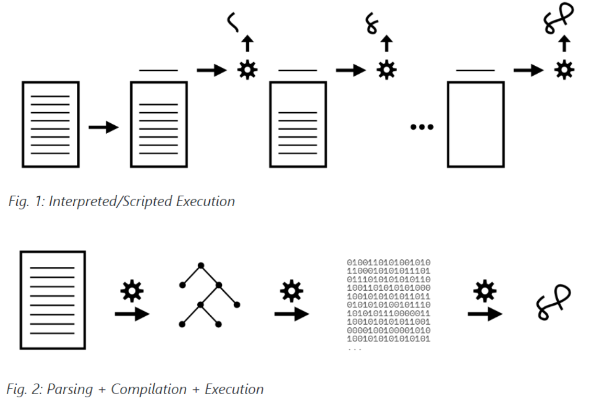
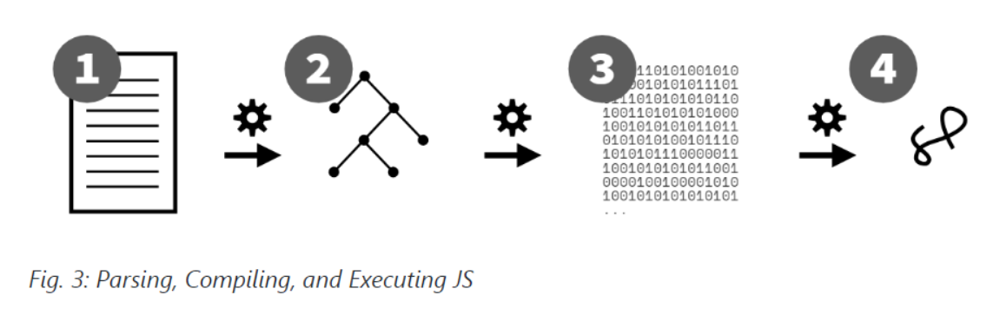

## Chapter 1: What Is JavaScript?

Don't use terms like `"JS6"` or `"ES8"` to refer to the language. Some do, but those terms only serve to perpetuate confusion. `"ES20xx"` or just `"JS"` are what you should stick to.

js三大支柱

- scope/closures

- prototypes/objects

- types/coercion

总结

- `JS` is an implementation of the `ECMAScript` standard (version `ES2019` as of this writing), which is guided by the `TC39` committee and hosted by `ECMA`. It runs in browsers and other `JS` environments such as `Node.js`.

- `JS` is a multi-paradigm language, meaning the syntax and capabilities allow a developer to mix and match (and bend and reshape!) concepts from various major paradigms, such as procedural, object-oriented (`OO`/classes), and functional (`FP`).

- `JS` is a compiled language, meaning the tools (including the `JS` engine) process and verify a program (reporting any errors!) before it executes.

### 1.1 JS is it an interpreted script or a compiled program?



JS is a parsed language, but is it compiled



1. After a program leaves a developer's editor, it gets transpiled by Babel, then packed by `Webpack` (and perhaps half a dozen other build processes), then it gets delivered in that very different form to a `JS` engine.
2. The `JS` engine parses the code to an `AST`.
3. Then the engine converts that `AST` to a kind-of byte code, a binary intermediate representation (IR), which is then refined/converted even further by the optimizing `JIT` compiler.
4. Finally, the `JS VM` executes the program.

## Chapter 2: Surveying `JS`

### 2.1 数据类型

如果在模板字符串里没有用到 `${}` ，最好使用 `"" ` or ` ''`

`typeof null` unfortunately returns `"object"` instead of the expected `"null"`.  `typeof` returns the specific `"function"` for functions, but not the expected `"array"` for arrays.

### 2.2 Declaring and Using Variables

`const`声明的值最好不要是对象，因为对象可以被改变，并不会报错

```js
const myBirthday = true;
let age = 39;
if (myBirthday) {
    age = age + 1;    // OK!
    myBirthday = false;  // Error!
}

const actors = [
    "Morgan Freeman", "Jennifer Aniston"
];
actors[2] = "Tom Cruise";   // OK :(
actors = [];                // Error!
```

error对象的作用域在catch内

```js
try {
    someError();
}
catch (err) {
    console.log(err);
}
```

### 2.3 Equal

`==`支持类型转换

```js
NaN === NaN;            // false，Number.isNaN(..)代替
0 === -0;               // true
```

### 2.4 class and module

**class**

- class用来管理数据和方法
- 继承可以帮助类更好的管理数据和方法，B继承A，A重写B同名方法就是多态

- The `class` mechanism allows packaging data (`text` and `pages`) to be organized together with their behaviors (e.g., `addPage(..)` and `print()`). 

- The fact that both the inherited and overridden methods can have the same name and co-exist is called polymorphism. Inheritance is a powerful tool for organizing data/behavior in separate logical units (classes), but allowing the child class to cooperate with the parent by accessing/using its behavior and data.

**module**

- 在`ES6`之前，函数是实现模块化（工厂模式）的关键

- The key hallmarks of a *classic module* are an outer function (that runs at least once), which returns an "instance" of the module with one or more functions exposed that can operate on the module instance's internal (hidden) data.

两者区别

- class通过new把数据和方法存储在新建的实例上，类通过this构建联系；module通过作用域，构建闭包，返回实例

- The `class` form stores methods and data on an object instance, which must be accessed with the `this.` prefix. With modules, the methods and data are accessed as identifier variables in scope, without any `this.` prefix.
- class的数据和方法是共用的，module的数据和方法独立的

- With `class`, the `"API"` of an instance is implicit in the class definition—also, all data and methods are public. With the module factory function, you explicitly create and return an object with any publicly exposed methods, and any data or other unreferenced methods remain private inside the factory function.

**ES Modules（`ES6`模块）**

基于文件而不是函数，通过导入创建实例

Consider the file `publication.js`:

```js
function printDetails(title,author,pubDate) {
    console.log(`
        Title: ${ title }
        By: ${ author }
        ${ pubDate }
    `);
}

export function create(title,author,pubDate) {
    var publicAPI = {
        print() {
            printDetails(title,author,pubDate);
        }
    };

    return publicAPI;
}
```

To import and use this module, from another ES module like `blogpost.js`:

```js
import { create as createPub } from "publication.js";

function printDetails(pub,URL) {
    pub.print();
    console.log(URL);
}

export function create(title,author,pubDate,URL) {
    var pub = createPub(title,author,pubDate);

    var publicAPI = {
        print() {
            printDetails(pub,URL);
        }
    };

    return publicAPI;
}
```

And finally, to use this module, we import into another ES module like `main.js`:

```js
import { create as newBlogPost } from "blogpost.js";

var forAgainstLet = newBlogPost(
    "For and against let",
    "Kyle Simpson",
    "October 27, 2014",
    "https://davidwalsh.name/for-and-against-let"
);

forAgainstLet.print();
// Title: For and against let
// By: Kyle Simpson
// October 27, 2014
// https://davidwalsh.name/for-and-against-let
```

## Chapter 3: Digging to the Roots of JS

### 3.1 Iteration

for..of：遍历对象

```js
// given two DOM elements, `btn1` and `btn2`
var buttonNames = new Map();
buttonNames.set(btn1,"Button 1");
buttonNames.set(btn2,"Button 2");
for (let [btn,btnName] of buttonNames) {
    btn.addEventListener("click",function onClick(){
        console.log(`Clicked ${ btnName }`);
    });
}
for (let btnName of buttonNames.values()) { // 只遍历值
    console.log(btnName);
}

var arr = [ 10, 20, 30 ];
for (let [idx,val] of arr.entries()) { // 数组也是对象
    console.log(`[${ idx }]: ${ val }`);
} // [0]: 10

```

 `...` 

```js
// spread an iterator into an array, with each iterated value occupying
var vals = [ ...it ];

// spread an iterator into a function, call with each iterated value, occupying an argument position.
doSomethingUseful( ...it );

var greeting = "Hello world!"; 
var chars = [ ...greeting ]; // 字符串结构成数组
chars; // [ "H", "e", "l", "l", "o", " ", "w", "o", "r", "l", "d", "!" ]
```

`JS`迭代器遍历都有三种类型：遍历值，遍历key，遍历值和key

For the most part, all built-in `iterables` in `JS` have three iterator forms available: keys-only (`keys()`), values-only (`values()`), and entries (`entries()`).

### 3.2 Closure

产生于函数作用域

Closure is when a function remembers and continues to access variables from outside its scope, even when the function is executed in a different scope.

```js
function counter(step = 1) {
    var count = 0;
    return function increaseCount(){
        count = count + step;
        return count;
    };
}
var incBy1 = counter(1);
incBy1(); // 1
incBy1(); // 2

// 异步中闭包很常见
function getSomeData(url) {
    ajax(url,function onResponse(resp){
        console.log(
            `Response (from ${ url }): ${ resp }`
        );
    });
}
getSomeData("https://some.url/wherever"); // Response (from https://some.url/wherever): ...

// 外部作用域不一定是函数
// Because this loop is using let declarations, each iteration gets new block-scoped (aka, local) idx and btn variables，this closure is not over the value (like 1 or 3), but over the variable idx itself.
for (let [idx,btn] of buttons.entries()) {
    btn.addEventListener("click",function onClick(){
       console.log(`Clicked on button (${ idx })!`);
    });
}
```

### 3.3 `this` Keyword

函数通过闭包依附在**声明**所在的作用域，作用域是变量查找规则；函数还可以通过`this`读取到**执行**上下文（函数执行时的作用域）

As discussed previously, when a function is defined, it is *attached* to its enclosing scope via closure. Scope is the set of rules that controls how references to variables are resolved. But functions also have another characteristic besides their scope that influences what they can access. This characteristic is best described as an *execution context*, and it's exposed to the function via its `this` keyword.

`this` is not a fixed characteristic of a function based on the function's definition, but rather a dynamic characteristic that's determined each time the function is called.

```js
function classroom(teacher) {
    return function study() {
        console.log(
            `${ teacher } says to study ${ this.topic }`
        );
    };
}
var assignment = classroom("Kyle");

// 默认执行上下文
assignment(); // Kyle says to study undefined  -- Oops :(

// object
var homework = {
    topic: "JS",
    assignment: assignment
};
homework.assignment(); // Kyle says to study JS

// call
var otherHomework = {
    topic: "Math"
};
assignment.call(otherHomework); // Kyle says to study Math
```

### 3.4 Prototypes

`this`是函数的特性，`prototype`是对象的特性。

`prototype`连接两个对象，对象被创建时产生`prototype`，连接另外一个已经存在的对象。B的`prototype`是A，B可以使用A的数据和方法。

```js
var homework = {
    topic: "JS"
};

// default prototype linkage connects to the Object.prototype object
// toString是homework的prototype——object的方法
homework.toString();    // [object Object]

var homework = {
    topic: "JS"
};
var otherHomework = Object.create(homework);
otherHomework.topic;   // "JS"

homework.topic; // "JS"
otherHomework.topic; // "JS"
otherHomework.topic = "Math"; // 创建一个新属性
otherHomework.topic; // "Math"
homework.topic; // "JS" -- not "Math"
```

`Object.create(null)` creates an object that is not prototype linked anywhere, so it's purely just a standalone object.

## Appendix A: Exploring Further

### So Many Function Forms

```js
var awesomeFunction = function(coolThings) {
    // ..
    return amazingStuff;
};
awesomeFunction.name; // "awesomeFunction"

// let awesomeFunction = ..
// const awesomeFunction = ..
var awesomeFunction = function someName(coolThings) {
    // ..
    return amazingStuff;
};
awesomeFunction.name; // "someName"

// generator function declaration
function *two() { .. }
// async function declaration
async function three() { .. }
// async generator function declaration
async function *four() { .. }
// named function export declaration (ES6 modules)
export function five() { .. }

// IIFE
(function(){ .. })();
(function namedIIFE(){ .. })();
// asynchronous IIFE
(async function(){ .. })();
(async function namedAIIFE(){ .. })();

// arrow function expressions
var f;
f = () => 42;
f = x => x * 2;
f = (x) => x * 2;
f = (x,y) => x * y;
f = x => ({ x: x * 2 });
f = x => { return x * 2; };
f = async x => {
    var y = await doSomethingAsync(x);
    return y * 2;
};
someOperation( x => x * 2 );

class SomethingKindaGreat {
    // class methods
    coolMethod() { .. }   // no commas!
    boringMethod() { .. }
}
var EntirelyDifferent = {
    // object methods
    coolMethod() { .. },   // commas!
    boringMethod() { .. },

    // (anonymous) function expression property
    oldSchool: function() { .. }
};
```

### `Prototypal` "Classes"

```js
// create
var Classroom = {
    welcome() {
        console.log("Welcome, students!");
    }
};
var mathClass = Object.create(Classroom);
mathClass.welcome(); // Welcome, students!

// new
function Classroom() {
    // ..
}
// the prototype object to link to when other objects are created by calling the function with new.
Classroom.prototype.welcome = function hello() {
    console.log("Welcome, students!");
};
var mathClass = new Classroom();
mathClass.welcome(); // Welcome, students!

// class
class Classroom {
    constructor() {
        // ..
    }
    welcome() {
        console.log("Welcome, students!");
    }
}
var mathClass = new Classroom();
mathClass.welcome();
// Welcome, students!
```

