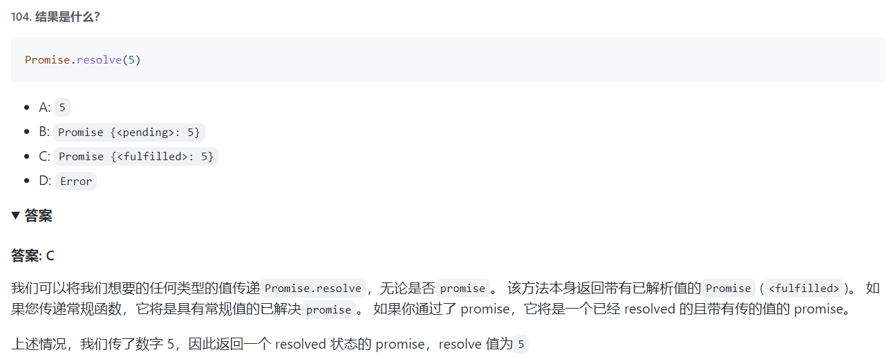
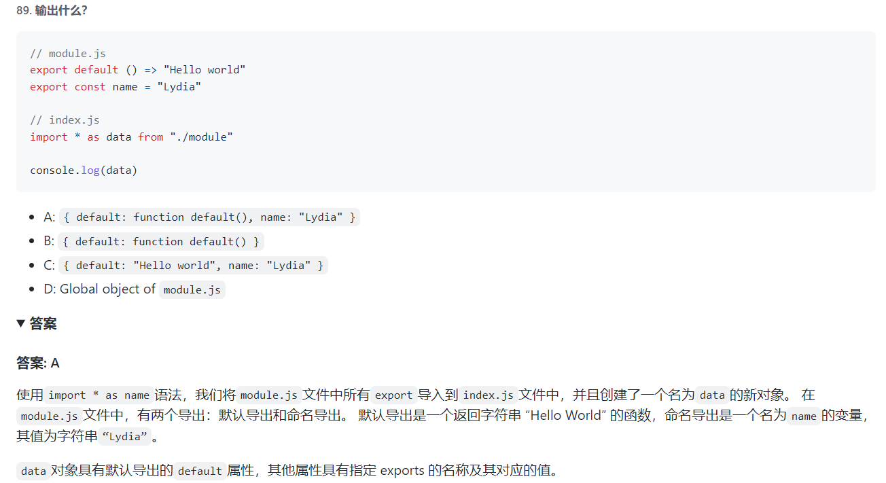
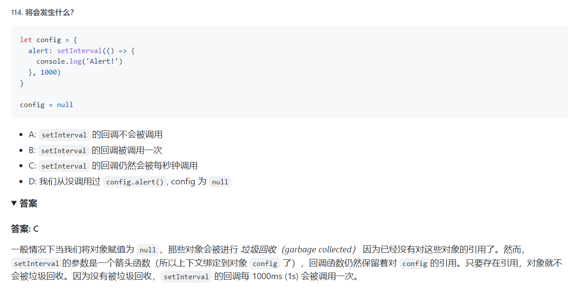

```js
const shape = {
  radius: 10,
  diameter() {
    return this.radius * 2;
  },
  perimeter: () => 2 * Math.PI * this.radius, // 箭头函数this不会变，指向shape = {this-->window}
};

console.log(shape.diameter()); // 是直接取出shape.diameter地址
console.log(shape.perimeter());
// 20 and NaN
```

参考

```js
var obj ={
  foo: function () {
    console.log(this);
  }
};

// obj和obj.foo储存在两个内存地址，称为地址一和地址二
// obj.foo()这样调用时，是从地址一调用地址二，因此地址二的运行环境是地址一，this指向obj
obj.foo() // obj
// 直接取出地址二进行调用
(obj.foo = obj.foo)() // window
(false || obj.foo)() // window
(1, obj.foo)() // window
```

this指向

（1）全局环境：函数在全局环境下运行

（2）构造函数：指向实例对象

（3）对象的方法

箭头函数

对于普通函数来说，内部的`this`指向函数运行时所在的对象，但是这一点对箭头函数不成立。它没有自己的`this`对象，内部的`this`就是定义时上层作用域中的`this`。也就是说，箭头函数内部的`this`指向是固定的，相比之下，普通函数的`this`指向是可变的。

```js
function foo() {
  setTimeout(() => {
    console.log('id:', this.id);
  }, 100);
}
var id = 21;
foo.call({ id: 42 }); // id: 42 此时才生成箭头函数
// 如果是普通函数，执行时this应该指向全局对象window，这时应该输出21
// 箭头函数导致this总是指向函数定义生效时所在的对象（本例是{id: 42}），所以打印出来的是42
```

4

```js
+true;
!'Lydia';
```

7

```js
let a = 3;
let b = new Number(3);
let c = 3;

console.log(a == b);
console.log(a === b);
console.log(b === c);
```


==todo 类型转换==

6

```js
let greeting;
greetign = {}; // Typo! const声明才必须初始化
console.log(greetign);
```


==事件==


`The base object is Object.prototype`


==todo 模板字符串==


==扩展运算符==


==缓存==


==try-catch==


==字符串 数组 方法==


==JSON.stringify==


```
reduce((previousValue, currentValue, currentIndex, array) => { /* … */ }, initialValue)
```


```js
var a = new Number('123'); // a === 123 is false
var b = Number('123'); // b === 123 is true
a instanceof Number; // is true
b instanceof Number; // is false
console.log(typeof a) // object
console.log(typeof b) // number
```











