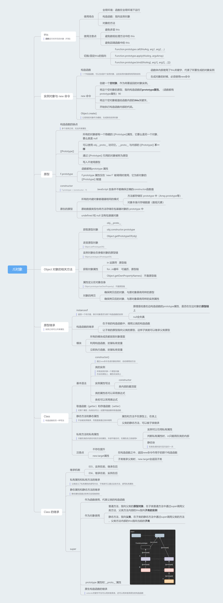
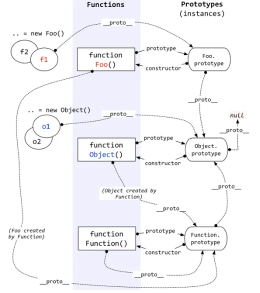
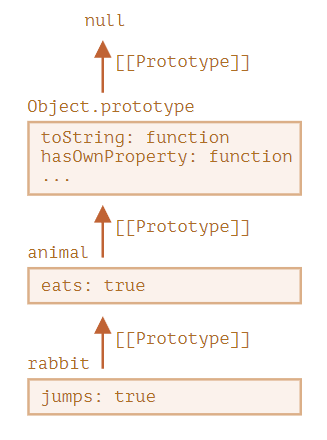
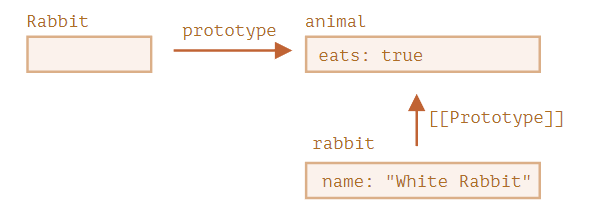
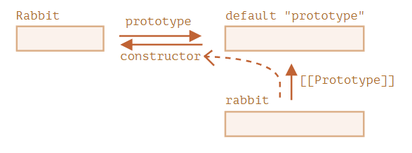
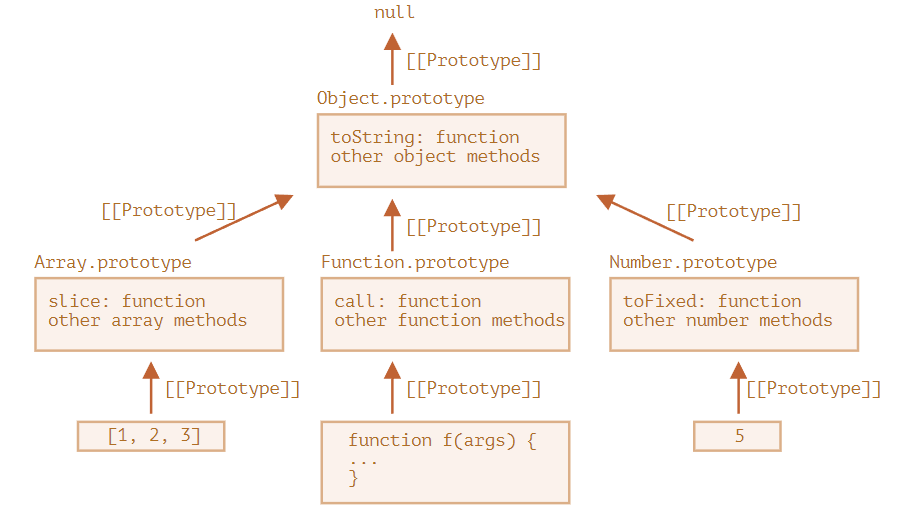
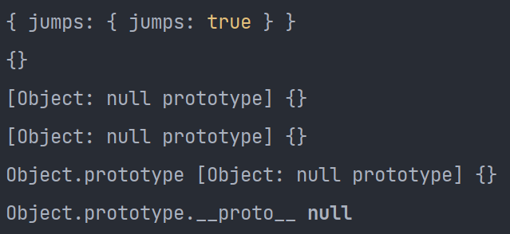
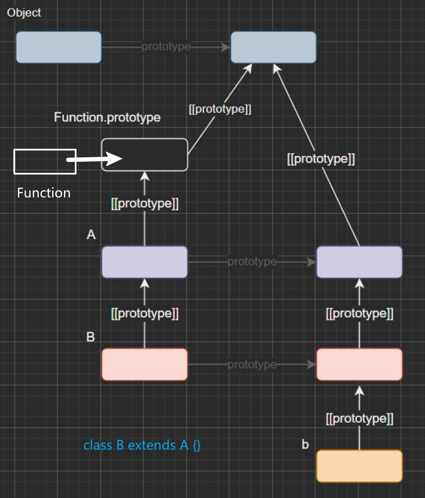

## 1、this 关键字

JavaScript 语言之中，一切皆对象，运行环境也是对象，所以函数都是在某个对象之中运行，**`this`就是函数运行时所在的对象（环境）**

```js
var obj = { foo:  5 }; // obj是一个地址（reference）
// 如果要读取obj.foo，引擎先从obj拿到内存地址，然后再从该地址读出原始的对象，返回它的foo属性
{
  foo: {
    [[value]]: 5
    [[writable]]: true
    [[enumerable]]: true
    [[configurable]]: true
  }
}

// foo属性是函数，将函数的地址赋值给foo属性的value属性
var obj = { foo: function () {} };
{
  foo: {
    [[value]]: 函数的地址
    ...
  }
}
    
// 函数是一个单独的值，所以它可以在不同的环境（上下文）执行
f() // 顶层对象环境中执行
obj.f() // obj 环境执行

// JavaScript 允许在函数体内部，引用当前环境的其他变量，利用 this指向函数运行时所在的对象（环境）
var f = function () {
  console.log(this.x);
}

// 示例
var f = function () {
  console.log(this.x);
}
var x = 1;
var obj = {
  f: f,
  x: 2,
};
f() // 1
obj.f() // 2
```

**使用场合**

（1）全局环境：函数在全局环境下运行

（2）构造函数：指向实例对象

（3）对象的方法

```js
var obj ={
  foo: function () {
    console.log(this);
  }
};

// obj和obj.foo储存在两个内存地址，称为地址一和地址二
// obj.foo()这样调用时，是从地址一调用地址二，因此地址二的运行环境是地址一，this指向obj
obj.foo() // obj
// 直接取出地址二进行调用
(obj.foo = obj.foo)() // window
(false || obj.foo)() // window
(1, obj.foo)() // window
```

如果`this`所在的方法不在对象的第一层，这时`this`只是指向当前一层的对象，而不会继承更上面的层

```js
var a = {
  p: 'Hello',
  b: {
    m: function() {
      console.log(this.p);
    }
  }
};
a.b.m() // undefined   此时m运行的环境是a.b，没有属性p，a才有

// 要达到预期效果
var a = {
  b: {
    m: function() {
      console.log(this.p);
    },
    p: 'Hello' // a.b添加属性p
  }
};
```

**使用注意点**

- 避免**多层 this**

  ```js
  var o = {
    f1: function () {
      console.log(this); // Object
      var f2 = function () {
        console.log(this); // 内层的this不指向外部，而指向顶层对象Window
      }();
      // 使用一个变量固定this的值，然后内层函数调用这个变量
      /*var that = this;
      var f2 = function() {
        console.log(that); // Object
      }();*/
    }
  }
  
  o.f1()
  ```

- 避免**数组处理方法**中的 this

  ```js
  var o = {
    v: 'hello',
    p: [ 'a1', 'a2' ],
    f: function f() {
      this.p.forEach(function (item) {
        console.log(this.v + ' ' + item); // window
      });
      // 可以给方法指定this参数
      /*this.p.forEach(function (item) {
        console.log(this.v + ' ' + item);
      }, this);*/
      /*this.p.forEach(function (item) {
        console.log(this.v + ' ' + item);
      }).bind(this));*/
    }
  }
  
  o.f()
  ```

- 避免**回调函数**中的 this

**绑定 this 的方法**

切换/固定this的指向

`thisArg`是一个对象，如果参数为空、`null`和`undefined`，则默认传入全局对象

`Function.prototype.call(thisArg, arg1, arg2, ...)`

```js
function f(x, y){
  console.log(x + y);
}
f.call(null, 1, 1) // 2
f.apply(null, [1, 1]) // 2

// 保证调用对象的原生方法
var obj = {};
obj.hasOwnProperty('toString') // false
obj.hasOwnProperty = function () { // 覆盖掉继承的 hasOwnProperty 方法
  return true;
};
obj.hasOwnProperty('toString') // true
Object.prototype.hasOwnProperty.call(obj, 'toString') // false
```

`Function.prototype.apply(thisArg, argsArray)`

```js
// 找出数组最大元素
Math.max(1, 3, 2)
var a = [10, 2, 4, 15, 9];
Math.max.apply(null, a) // 15

// 将数组的空元素变为undefinedy
// 空元素与undefined的差别在于，数组的forEach方法会跳过空元素，但是不会跳过undefined
var a = ['a', , 'b'];
function print(i) {
  console.log(i);
}
a.forEach(print) // a b
Array.apply(null, a).forEach(print) // a undefined b

// 转换类似数组的对象  有length属性，以及相对应的数字键属性名
// slice(start, end) start默认为0 end默认末尾
['Banana', 'Orange', 'Lemon', 'Apple'].slice(1, 3); // ['Orange','Lemon']
Array.prototype.slice.apply({0: 1, length: 2}) // [1, undefined]
```

`Function.prototype.bind(thisArg[, arg1[, arg2[, ...]]])`

```js
var d = new Date();
d.getTime() // 1481869925657 getTime()方法内部的this，绑定Date对象的实例
var print = d.getTime;
// var print = d.getTime.bind(d); // 将getTime()方法内部的this绑定到d对象
print() // Uncaught TypeError: this is not a Date object.

// 接受更多的参数
var add = function (x, y) {
  return x * this.m + y * this.n;
}
var obj = {
  m: 2,
  n: 2
};
var newAdd = add.bind(obj, 5);
newAdd(5) // 20

// 每一次返回一个新函数
element.addEventListener('click', o.m.bind(o)); // click事件绑定bind()方法生成的一个匿名函数，导致无法取消绑定
element.removeEventListener('click', o.m.bind(o));

var listener = o.m.bind(o);
element.addEventListener('click', listener);
element.removeEventListener('click', listener);

// 结合回调函数使用
var counter = {
  count: 0,
  inc: function () {
    'use strict';
    this.count++;
  }
};
function callIt(callback) {
  callback();
}
callIt(counter.inc.bind(counter)); // 不指定指向全局对象
counter.count // 1

// 改写一些 JavaScript 原生方法的使用形式
[1, 2, 3].slice(0, 1) // [1]
// 等同于
Array.prototype.slice.call([1, 2, 3], 0, 1) // [1]
// 将Array.prototype.slice变成Function.prototype.call方法所在的对象，调用时就变成了Array.prototype.slice.call
var slice = Function.prototype.call.bind(Array.prototype.slice);
slice([1, 2, 3], 0, 1) // [1]
// 将Function.prototype.bind方法绑定在Function.prototype.call上面，所以bind方法就可以直接使用，不需要在函数实例上使用
function f() {
  console.log(this.v);
}
var o = { v: 123 };
var bind = Function.prototype.call.bind(Function.prototype.bind);
bind(f, o)() // 123
```

## 2、面向对象编程 

### 2.1 实例对象与 new 命令

对象是一个容器，封装了属性（property）和方法（method）

JavaScript 语言的对象体系，不是基于“类”的，而是基于构造函数（constructor）和原型链（prototype）

**构造函数**

JavaScript 语言使用构造函数（constructor）作为对象的模板。一个构造函数，可以生成多个实例对象，这些实例对象都有相同的结构。

特点：

- 函数体内部使用了`this`关键字，代表了所要生成的对象实例
- 生成对象的时候，必须使用`new`命令

**new 命令**

使用`new`命令时，它后面的函数依次执行下面的步骤：

1. 创建一个**空对象**，作为将要返回的对象实例。
2. 将这个空对象的原型，指向构造函数的**`prototype`属性**。（函数都有`prototype`属性）90
3. 将这个空对象赋值给函数内部的**`this`**关键字。
4. 开始执行构造函数内部的代码。如果构造函数内部有`return`语句，而且`return`后面跟着一个对象，`new`命令会返回`return`语句指定的对象；否则，就会不管`return`语句，返回`this`对象。

```js
var Vehicle = function (p) {
  // 没有使用new命令，直接调用Vehicle就会报错，因为严格模式中，函数内部的this不能指向全局对象，默认等于undefined
  'use strict'; 
  // 另一种方式判断构造函数是否使用new
  // if (!(this instanceof Fubar)) { // new.target === Vehicle
    // return new Fubar(foo, bar);
  // }
  this.price = p; // this指向新生成的实例对象，给对象添加price属性
};

var v = new Vehicle(1000); // 通过new命令，让构造函数Vehicle生成一个实例对象，保存在变量v中
v.price // 1000

// 没有使用new命令，构造函数就变成了普通函数
var v = Vehicle();
v // undefined
price // 1000  此时this指向全局对象

// new命令简化的内部流程，可以用下面的代码表示
function _new(/* 构造函数 */ constructor, /* 构造函数参数 */ params) {
  // 将 arguments 对象转为数组
  var args = [].slice.call(arguments);
  // 取出构造函数
  var constructor = args.shift();
  // 创建一个空对象，继承构造函数的 prototype 属性
  var context = Object.create(constructor.prototype);
  // 执行构造函数
  var result = constructor.apply(context, args);
  // 如果返回结果是对象，就直接返回，否则返回 context 对象
  return (typeof result === 'object' && result != null) ? result : context;
}

// 实例
var actor = _new(Person, '张三', 28);
```

**`Object.create()`**

以现有的对象作为模板，生成新的实例对象

```js
var person1 = {
  name: '张三',
  age: 38,
  greeting: function() {
    console.log('Hi! I\'m ' + this.name + '.');
  }
};

var person2 = Object.create(person1);

person2.name // 张三
person2.greeting() // Hi! I'm 张三.
```

### 2.2 原型

#### 2.2.1 构造函数的缺点

多个实例之间，无法共享属性

```js
function Cat(name, color) {
  this.name = name;
  this.color = color;
  this.meow = function () {
    console.log('喵喵');
  };
}

var cat1 = new Cat('大毛', '白色');
var cat2 = new Cat('二毛', '黑色');

cat1.meow === cat2.meow
// false
```

#### 2.2.2 [[Prototype]]

- 在 JavaScript 中，**所有的对象都有一个隐藏的 `[[Prototype]]` 属性**，它要么是另一个对象，要么就是 `null`。
- 可以使用 `obj.__proto__` 访问它。`__proto__` 与内部的 `[[Prototype]]` **不一样**。`__proto__` 是 `[[Prototype]]` 的 getter/setter。
- 通过 `[[Prototype]]` 引用的对象被称为“原型”。

PS: `obj.__proto__` 来自于 `Object.prototype` ，与其说是一个属性，不如说是一个 `getter/setter`，当使用 `obj.__proto__` 时，可以理解成返回了 `Object.getPrototypeOf(obj)`。

```js
let animal = {
  eats: true
};

let rabbit = {
  jumps: true,
  __proto__: animal // 设置rabbit原型为animal
};
```



**写入不使用原型**

- 如果我们想要读取 `obj` 的一个属性或者调用一个方法，并且它不存在，那么 JavaScript 就会尝试在原型中查找它。
- 写/删除操作直接在对象上进行，它们不使用原型（假设它是数据属性，不是 setter）。
- 如果我们调用 `obj.method()`，而且 `method` 是从原型中获取的，`this` 仍然会引用 `obj`。因此，方法始终与当前对象一起使用，即使方法是继承的。

```js
let user = {
  name: "John",
  surname: "Smith",
  set fullName(value) {
    [this.name, this.surname] = value.split(" ");
  },
  get fullName() {
    return `${this.name} ${this.surname}`;
  }
};

let admin = {
  __proto__: user,
  isAdmin: true
};

// admin调用set/get fullName内部this指向admin
alert(admin.fullName); // John Smith 
admin.fullName = "Alice Cooper"; // 在admin创建name和surname属性
alert(admin.fullName); // Alice Cooper，admin 的内容被修改了

// user调用set/get fullName内部this指向user
alert(user.fullName);  // John Smith，user 的内容被保护了
```

#### 2.2.3 `Fn.prototype`

- **函数都有`prototype` 属性（不要把它与 `[[Prototype]]` 弄混了**，`Fn.prototype` 的值要么是一个对象，要么就是 `null`：其他值都不起作用。
- `Fn.prototype` 属性仅在 `new F` 被调用时使用，它为新对象的 `[[Prototype]]` 赋值。

```js
let animal = {
  eats: true
};
function Rabbit(name) {
  this.name = name;
}
Rabbit.prototype = animal;

let rabbit = new Rabbit("White Rabbit"); //  rabbit.__proto__ == animal
alert( rabbit.eats ); // true
```



**`"prototype"` 是一个水平箭头，表示一个常规属性，`[[Prototype]]` 是垂直的，表示 `rabbit` 继承自 `animal`。**

- 在常规对象上，`prototype` 没什么特别的：

```javascript
let user = {
  name: "John",
  prototype: "Bla-bla" // 这里只是普通的属性
};
```

**constructor** 

默认情况下，所有函数都有 `F.prototype = {constructor：F}`，所以我们可以通过访问它的 `"constructor"` 属性来获取一个对象的构造器。

```js
function Rabbit() {} // 默认： Rabbit.prototype = { constructor: Rabbit }
let rabbit = new Rabbit(); // 继承自 {constructor: Rabbit}
alert(rabbit.constructor == Rabbit); // true (from prototype)

// 使用 constructor 属性来创建一个新对象
let rabbit2 = new rabbit.constructor("Black Rabbit");
```



JavaScript 自身并不能确保正确的 "constructor" 函数值

```js
function Rabbit() {}
Rabbit.prototype.jumps = {
  jumps: true
};

let rabbit = new Rabbit();

Rabbit.prototype.hello = {
  hello: true
};
let rabbit1 = new Rabbit();

alert(rabbit.constructor === Rabbit); // true rabbit可以访问jumps，不可以访问hello
alert(rabbit1.constructor === Rabbit); // false rabbit1可以访问hello，不可以访问jumps

// 不要将 Rabbit.prototype 整个覆盖，可以向其中添加内容
Rabbit.prototype.jumps = true
// 也可以手动重新创建 constructor 属性
Rabbit.prototype = {
  jumps: true,
  constructor: Rabbit
}
```

#### 2.2.4 原生的原型

`"prototype"` 属性在 JavaScript 自身的核心部分中被广泛地应用。所有的内建构造函数都用到了它。

- 所有的内建对象都遵循相同的模式（pattern）：
  - 方法都存储在 prototype 中（`Array.prototype`、`Object.prototype`、`Date.prototype` 等）。
  - 对象本身只存储数据（数组元素、对象属性、日期）。
- 原始数据类型也将方法存储在包装器对象的 prototype 中：`Number.prototype`、`String.prototype` 和 `Boolean.prototype`。只有 `undefined` 和 `null` 没有包装器对象。
- 内建原型可以被修改或被用新的方法填充。但是不建议更改它们。唯一允许的情况可能是，当我们添加一个还没有被 JavaScript 引擎支持，但已经被加入 JavaScript 规范的新标准时，才可能允许这样做。



```js
function Rabbit(name) {
    this.name = name;
}
Rabbit.prototype.jumps = {
    jumps: true
};
let rabbit = new Rabbit("White Rabbit");
console.log(rabbit.__proto__)
console.log(Rabbit.__proto__)
console.log(Rabbit.__proto__.__proto__)
console.log(Rabbit.prototype.__proto__)
console.log('Object.prototype', Object.prototype)
console.log('Object.prototype.__proto__', Object.prototype.__proto__)
```



### 2.3 Object 对象的相关方法

#### 2.3.1 `Object.create()`

接受一个对象作为参数，然后以它为原型，返回一个实例对象。该实例完全继承原型对象的属性。

```js
// 可以用下面的代码代替，实质是新建一个空的构造函数F，然后让F.prototype属性指向参数对象obj，最后返回一个F的实例，从而实现让该实例继承obj的属性
if (typeof Object.create !== 'function') {
  Object.create = function (obj) {
    function F() {}
    F.prototype = obj;
    return new F();
  };
}

// 三种方式生成的新对象是等价
var obj1 = Object.create({});
var obj2 = Object.create(Object.prototype);
var obj3 = new Object();

// 不继承任何属性（比如没有toString()和valueOf()方法）的对象
var obj = Object.create(null);

// 接受第二个参数属性描述对象
var obj = Object.create({}, {
  p1: {
    value: 123,
    enumerable: true,
    configurable: true,
    writable: true,
  }
});
// 等同于
var obj = Object.create({});
obj.p1 = 123;
```

#### 2.3.2 `getPrototypeOf` / `setPrototypeOf`

**`Object.getPrototypeOf()`**

返回参数对象的原型

```js
var F = function () {};
var f = new F();
Object.getPrototypeOf(f) === F.prototype // true

// 函数的原型是 Function.prototype
function f() {}
Object.getPrototypeOf(f) === Function.prototype // true
```

**`Object.setPrototypeOf()`**

为参数对象设置原型，返回该参数对象。它接受两个参数，第一个是现有对象，第二个是原型对象

```js
var F = function () {
  this.foo = 'bar';
};

var f = new F();
// 等同于
var f = Object.setPrototypeOf({}, F.prototype); // 将一个空对象的原型设为构造函数的prototype属性（上例是F.prototype）
F.call(f); // 将构造函数内部的this绑定这个空对象，然后执行构造函数，使得定义在this上面的方法和属性（上例是this.foo），都转移到这个空对象上
```

#### 2.3.3 获取原型对象

**`Object.prototype.isPrototypeOf()`**

只要实例对象处在参数对象的原型链上，`isPrototypeOf`方法都返回`true`

```JS
var o1 = {};
var o2 = Object.create(o1);
var o3 = Object.create(o2);
o2.isPrototypeOf(o3) // true
o1.isPrototypeOf(o3) // true

Object.prototype.isPrototypeOf(/xyz/) // true
Object.prototype.isPrototypeOf(Object.create(null)) // false
```

**`Object.prototype.__proto__`**

实例对象的`__proto__`属性（前后各两个下划线），返回该对象的原型。该属性可读写

只有浏览器才需要部署，其他环境可以没有这个属性。它前后的两根下划线，表明它本质是一个内部属性，不应该对使用者暴露。因此，应该尽量少用这个属性，而是用`Object.getPrototypeOf()`和`Object.setPrototypeOf()`，进行原型对象的读写操作

```JS
// 通过__proto__属性，将p对象设为obj对象的原型
var obj = {};
var p = {};
obj.__proto__ = p;
Object.getPrototypeOf(obj) === p // true
```

**获取原型对象方法的比较**

- `obj.__proto__`
- `obj.constructor.prototype`
- `Object.getPrototypeOf(obj)`

#### 2.3.4 `hasOwnProperty` /`getOwnPropertyNames` 

**`Object.getOwnPropertyNames()`**

返回一个数组，成员是参数对象**本身**的所有属性的键名（包括**不可以遍历**），不包含继承的属性键名

```JS
Object.getOwnPropertyNames(Date)
// ["parse", "arguments", "UTC", "caller", "name", "prototype", "now", "length"]

// 只获取那些可以遍历的属性，使用Object.keys方法
Object.keys(Date) // []
```

**`Object.prototype.hasOwnProperty()`**

对象实例的`hasOwnProperty`方法返回一个布尔值，用于判断某个属性定义在对象自身，还是定义在原型链上

唯一一个**处理对象属性**时，不会遍历原型链的方法

```js
Date.hasOwnProperty('length') // true
Date.hasOwnProperty('toString') // false
```

#### 2.3.5 in 运算符和 `for...in` 循环

`in`运算符返回一个布尔值，表示一个对象是否具有某个属性(遍历原型链)

获得对象的所有**可遍历**属性（不管是自身的还是继承的），可以使用`for...in`循环

```js
'length' in Date // true
'toString' in Date // true

var o1 = { p1: 123 };
var o2 = Object.create(o1, {
  p2: { value: "abc", enumerable: true }
});

for (p in o2) {
  console.info(p);
}
// p2 p1 toString不可以遍历

// 获得对象的所有属性（不管是自身的还是继承的，也不管是否可枚举）
function inheritedPropertyNames(obj) {
  var props = {};
  while(obj) {
    // 遍历自身所有属性，包括不可以遍历
    Object.getOwnPropertyNames(obj).forEach(function(p) {
      props[p] = true;
    });
    obj = Object.getPrototypeOf(obj); // 返回对象原型
  }
  return Object.getOwnPropertyNames(props);
}
```

#### 2.3.6 对象的拷贝

- 确保拷贝后的对象，与原对象具有同样的原型。
- 确保拷贝后的对象，与原对象具有同样的实例属性。

```js
function copyObject(orig) {
    // 获取orig原型，确保拷贝后的对象，与原对象具有同样的原型
    var copy = Object.create(Object.getPrototypeOf(orig)); 
    copyOwnPropertiesFrom(copy, orig);
    return copy;
}

function copyOwnPropertiesFrom(target, source) {
    // 拷贝对象所有属性
    Object
        .getOwnPropertyNames(source)
        .forEach(function (propKey) {
            var desc = Object.getOwnPropertyDescriptor(source, propKey);
            Object.defineProperty(target, propKey, desc);
        });
    return target;
}

//  ES2017引入标准的Object.getOwnPropertyDescriptors方法
function copyObject(orig) {
  return Object.create(
    Object.getPrototypeOf(orig),
    Object.getOwnPropertyDescriptors(orig)
  );
}
```

### 2.4 对象的继承

继承意味着复制操作，然而 JavaScript 默认并不会复制对象的属性，相反，JavaScript 只是在两个对象之间创建一个关联，这样，一个对象就可以通过委托访问另一个对象的属性和函数，所以与其叫继承，委托的说法反而更准确些。

**通过“原型对象”（prototype）实现继承**

#### 2.4.1 `instanceof` 运算符

返回一个布尔值，表示对象是否为某个构造函数的实例

`instanceof`的原理是检查右边构造函数的`prototype`属性，是否在左边对象的原型链上

```js
var v = new Vehicle();
v instanceof Vehicle
// 等同于
Vehicle.prototype.isPrototypeOf(v) // isPrototypeOf是Object.prototype的方法

// instanceof检查整个原型链
v instanceof Object // true

// 失真
null instanceof Object // false
var obj = Object.create(null);
typeof obj // "object"
obj instanceof Object // false
```

#### 2.4.2 构造函数的继承

让一个构造函数继承另一个构造函数

- 在子类的构造函数中，调用父类的构造函数
- 让子类的原型指向父类的原型，这样子类就可以继承父类原型

```js
function Sub(value) {
  Super.call(this);
  this.prop = value;
}

Sub.prototype = Object.create(Super.prototype); // Sub.prototype = Super.prototype 后面两行对Sub.prototype的操作，会连父类的原型Super.prototype一起修改掉
Sub.prototype.constructor = Sub;
Sub.prototype.method = '...';
```

**实例**

```js
function Shape() {
  this.x = 0;
  this.y = 0;
}

Shape.prototype.move = function (x, y) {
  this.x += x;
  this.y += y;
  console.info('Shape moved.');
};

// 第一步，子类继承父类的实例
function Rectangle() {
  Shape.call(this); // 调用父类构造函数
}
// 另一种写法
function Rectangle() {
  this.base = Shape;
  this.base();
}

// 第二步，子类继承父类的原型
Rectangle.prototype = Object.create(Shape.prototype);
Rectangle.prototype.constructor = Rectangle;

var rect = new Rectangle();
rect instanceof Rectangle  // true
rect instanceof Shape  // true
```

**只需要单个方法的继承**

```js
ClassB.prototype.print = function() {
  ClassA.prototype.print.call(this);
  // some code
}
```

**多重继承**

JavaScript 不提供多重继承功能，即不允许一个对象同时继承多个对象。但是，可以通过变通方法，实现这个功能。

```js
// 子类S同时继承了父类M1和M2。这种模式又称为 Mixin（混入）
function M1() {
  this.hello = 'hello';
}

function M2() {
  this.world = 'world';
}

function S() {
  M1.call(this);
  M2.call(this);
}

// 继承 M1
S.prototype = Object.create(M1.prototype);
// 继承链上加入 M2
Object.assign(S.prototype, M2.prototype);
/* const target = { a: 1, b: 2 };
const source = { b: 4, c: 5 };
Object.assign(target, source); // { a: 1, b: 4, c: 5 }*/

// 指定构造函数
S.prototype.constructor = S;

var s = new S();
s.hello // 'hello'
s.world // 'world'
```

#### 2.4.3 模块

**基本的实现方法**

所有的模块成员都放到这个对象里面

缺点：会暴露所有模块成员，内部状态可以被外部改写

```js
var module1 = new Object({
　_count : 0,
　m1 : function (){
　　//...
　},
　m2 : function (){
  　//...
　}
});
```

**封装私有变量：构造函数的写法**

利用构造函数，封装私有变量

缺点：构造函数有双重作用，既用来塑造实例对象，又用来保存实例对象的数据，违背了构造函数与实例对象在数据上相分离的原则（即实例对象的数据，不应该保存在实例对象以外）

```js
function StringBuilder() {
  var buffer = []; // 私有变量，实例对象无法直接访问

  this.add = function (str) {
     buffer.push(str);
  };

  this.toString = function () {
    return buffer.join('');
  };

}
```

**封装私有变量：立即执行函数的写法**

```js
var module1 = (function () {
　var _count = 0; // 外部代码无法读取内部的_count变量
　var m1 = function () {
　  //...
　};
　var m2 = function () {
　　//...
　};
　return {
　　m1 : m1,
　　m2 : m2
　};
})();

// 如果一个模块很大，必须分成几个部分，或者一个模块需要继承另一个模块，这时就有必要采用“放大模式”（augmentation）
var module1 = (function (mod){
　mod.m3 = function () {
　　//...
　};
　return mod;
})(module1);
```

## 3、Class 的基本语法

### 3.1 类的由来

**与构造函数联系**

`ES6` 的类，完全可以看作构造函数的另一种写法

```js
function Point(x, y) {
    this.x = x;
    this.y = y;
} // 构造函数
Point.prototype.toString = function () {
    return '(' + this.x + ', ' + this.y + ')';
}; // 给原型添加方法
var p = new Point(1, 2); 
// 1创建空对象 2对象的原型指向函数prototype属性，prototype上有toString方法，所有实例都可以共享
// 3构造函数内部this指向空对象，执行构造函数，给空对象添加x和y属性 4返回对象

// class改写
class Point1 {
  constructor(x, y) { // 构造方法，与构造函数是一致的
    this.x = x; // this关键字则代表实例对象
    this.y = y;
  }
  toString() { // 不需要加上function这个关键字
    return '(' + this.x + ', ' + this.y + ')';
  }
}
// Point()可以运行，普通函数  Point1()会报错
const p1 = new Point1();
// 类的所有方法都定义在类的prototype属性上面，toString也是
p1.constructor === Point1.prototype.constructor // true 

// 类可以理解成是构造函数语法糖
typeof Point // "function"
Point === Point.prototype.constructor // true
typeof Point1 // "function"
Point1 === Point1.prototype.constructor // true

// 类的方法不可枚举，F.prototype定义方法可枚举
Object.keys(Point.prototype) // ["toString"]
Object.keys(Point1.prototype) // []
```

**constructor() 方法**

通过`new`命令生成对象实例时，自动调用该方法

没有显式定义，一个空的`constructor()`方法会被默认添加

```javascript
class Point {}

// 等同于
class Point {
  constructor() {}
}
```

**类的实例**

类的实例和构造函数的实例一样都有原型，所有实例共享一个原型对象，可以通过`setPrototypeOf`/`getPrototypeOf`设置和读取原型对象

```js
var p1 = new Point(2,3);
var p2 = new Point(3,2);

p1.__proto__.printName = function () { return 'Oops' };

p1.printName() // "Oops"
p2.printName() // "Oops"

var p3 = new Point(4,2);
p3.printName() // "Oops"
```

**类的方法在原型上，类的变量在实例上**

类内部访问变量和方法要带this，`obj.functin`  `obj.var`，this指向obj

```js
class Foo {
    hello = 42;
    getHello() {
        console.log(this.hello)
    }
    setHello(hh) {
        this.hello = hh;
    }
}

// Foo.getPrivateValue(new Foo()); // 42
const foo = new Foo();
const foo1 = new Foo();

console.log(foo.hello) // 42
console.log(foo1.hello) // 42
console.log(foo.__proto__.hello) // undefined

foo.setHello(1)
foo1.setHello(2)
foo.__proto__.setHello(3)

foo.getHello() // 1
foo1.getHello() // 2
foo.__proto__.getHello() // 3
```

**实例属性的新写法**

实例属性现在除了可以定义在`constructor()`方法里面的`this`上面，也可以定义在类内部的最顶层

```js
// 原来的写法
class foo {
  constructor() {
      this.bar = 'hello';
  	  this.baz = 'world';
      // ...
  }
  increment() { }
}


// 新的写法
class foo {
  bar = 'hello';
  baz = 'world';
  constructor() {
    // ...
  }
  increment() { }
}
```

**属性表达式**

类的属性名，可以采用表达式

```js
let methodName = 'getArea';

class Square {
  constructor(length) {
    // ...
  }

  [methodName]() {
    // ...
  }
}
```

**Class 表达式**

与函数一样，类也可以使用表达式的形式定义

类的名字是`Me`，但是`Me`只在 Class 的内部可用，指代当前类。在 Class 外部，这个类只能用`MyClass`引用  ==todo==

```js
const MyClass = class Me {
  getClassName() {
    console.log(MyClass.name) // Me
    return Me.name;
  }
};

let inst = new MyClass();
inst.getClassName() // Me
Me.name // ReferenceError: Me is not defined

// 立即执行的 Class
let person = new class {
  constructor(name) {
    this.name = name;
  }
  sayName() {
    console.log(this.name);
  }
}('张三');
person.sayName(); // "张三"
```

### 3.2 取值函数（getter）和存值函数（setter）

在“类”的内部可以使用`get`和`set`关键字，对某个属性设置存值函数和取值函数，拦截该属性的存取行为。

```js
class CustomHTMLElement {
  constructor(element) {
    this.element = element;
  }
  get html() {
    return this.element.innerHTML;
  }
  set html(value) {
    this.element.innerHTML = value;
  }
}
// 存值函数和取值函数是定义在html属性的描述对象上面
var descriptor = Object.getOwnPropertyDescriptor(
  CustomHTMLElement.prototype, "html"
);
"get" in descriptor  // true
"set" in descriptor  // true
```

### 3.3 静态方法和静态属性

**静态方法**

类相当于实例的原型，所有在类中定义的方法，都会被实例继承。如果在一个方法前，加上`static`关键字，就表示该方法**不会被实例继承**，而是直接**通过类来调用**，这就称为“静态方法”。

```js
class Foo {
  static bar() {
    this.baz(); // this指的是类，而不是实例，因为foo.bar()会报错，只能Foo.bar()调用
  }
  static baz() {
    console.log('hello');
  } 
  baz() { // 静态方法可以与非静态方法重名
    console.log('world');
  }
}

Foo.bar() // 'hello'
var foo = new Foo();
foo.bar() // TypeError: foo.classMethod is not a function
```

**父类的静态方法，可以被子类继承**

```js
class Foo {
  static classMethod() {
    return 'hello';
  }
}

class Bar extends Foo {}
Bar.classMethod() // 'hello'

// 静态方法也是可以从super对象上调用的
class Bar extends Foo {
  static classMethod() {
    return super.classMethod() + ', too';
  }
}
Bar.classMethod() // "hello, too"

```

**静态属性**

Class 本身的属性，即`Class.propName`，而不是定义在实例对象上的属性。

```js
class MyClass {
  static myStaticProp = 42;

  constructor() {
    console.log(MyClass.myStaticProp); // 42
    // console.log(this.myStaticProp); // undefind 创建实例时this指向实例
  }
    
  hello() {
    console.log(MyClass.myStaticProp) // 42
    console.log(this.myStaticProp) // undefined
  }
}

const mClass = new MyClass();
mClass.hello();
```

总结：静态方法和静态属性不在原型上，在`MyClass`。因为只能`MyClass.functing` `MyClass.var`，所以this只能指向 `MyClass`

### 3.4 私有方法和私有属性

不再原型上。

**`#`**

只能在类的内部访问的方法和属性，外部不能访问，在属性名之前使用`#`，`#`是属性名的一部分，私有属性也可以设置 getter 和 setter 方法。

```js
class IncreasingCounter {
  #count = 0; // 私有属性
  get value() {
    console.log('Getting the current value!');
    return this.#count; // 需要this
  }
  #increment() { // 私有方法
    this.#count++;
  }
}
// 在类的外部，读取或写入私有属性#count，读取一个不存在的私有属性，都会报错
const counter = new IncreasingCounter();
counter.#count // 报错
counter.#count = 42 // 报错
counter.#myCount // 报错  如果读取一个不存在的公开属性，不会报错，只会返回undefined
IncreasingCounter.#count // 报错
```

**实例也可以引用私有属性**

私有属性和私有方法前面，也可以加上`static`关键字，表示这是一个静态的私有属性或私有方法

```js
class Foo {
  #privateValue = 42;
  static getPrivateValue(foo) {
    return foo.#privateValue;
  }
}

Foo.getPrivateValue(new Foo()); // 42
```

**in 运算符**

判断私有属性时，`in`只能用在类的内部

对于`Object.create()`、`Object.setPrototypeOf`形成的继承，是无效的

```js
class C {
  #brand;
  static isC(obj) {
    if (#brand in obj) {
      return true; // 私有属性 #brand 存在
    } else {
      return false; // 私有属性 #foo 不存在
    }
  }
}

class A {
  #foo = 0;
  static test(obj) {
    console.log(#foo in obj);
  }
}

class SubA extends A {};
A.test(new SubA()) // true

const a = new A();
const o1 = Object.create(a);
A.test(o1) // false
A.test(o1.__proto__) // true
const o2 = {};
Object.setPrototypeOf(o2, a);
A.test(o2) // false
A.test(o2.__proto__) // true
```

**静态块**

允许在类的内部设置一个代码块，在类生成时运行且只运行一次，主要作用是对静态属性进行初始化。以后，新建类的实例时，这个块就不运行了。

每个类允许有多个静态块，每个静态块中只能访问之前声明的静态属性。另外，静态块的内部不能有`return`语句。

```js
// 静态属性y和z的初始化逻辑，写入了类的内部，而且只运行一次
class C {
  static x = ...;
  static y;
  static z;

  static {
    try {
      const obj = doSomethingWith(this.x);
      this.y = obj.y;
      this.z = obj.z;
    }
    catch {
      this.y = ...;
      this.z = ...;
    }
  }
}

// 将私有属性与类的外部代码分享
let getX;
export class C {
  #x = 1;
  static {
    getX = obj => obj.#x;
  }
}
console.log(getX(new C())); // 1
```

总结：私有属性和私有变量不在原型上，只能在Class内部使用，this和传入obj相关

### 3.5 类的注意点

**不存在提升**

```js
new Foo(); // ReferenceError
class Foo {}
```

**name 属性**

`name`属性总是返回紧跟在`class`关键字后面的类名

**Generator 方法**

某个方法之前加上星号（`*`），就表示该方法是一个 Generator 函数

```js
class Foo {
  constructor(...args) {
    this.args = args;
  }
  * [Symbol.iterator]() { // Generator 函数
    for (let arg of this.args) {
      yield arg;
    }
  }
}

for (let x of new Foo('hello', 'world')) {
  console.log(x);
} // hello world
```

**this 的指向**

class 内部是严格模式==todo==

```js
class Logger {
  printName(name = 'there') {
    this.print(`Hello ${name}`);
  }
  print(text) {
    console.log(text);
  }
}
const logger = new Logger();
const { printName } = logger;
printName(); // TypeError: Cannot read property 'print' of undefined
```

**`new.target` 属性**

一般用在构造函数之中，返回`new`命令作用于的那个构造函数

子类继承父类时，`new.target`会返回子类

在函数外部，使用`new.target`会报错

```js
class Rectangle {
  constructor(length, width) {
    console.log(new.target === Rectangle);
    this.length = length;
    this.width = width;
  }
}
var obj = new Rectangle(3, 4); // 输出 true

// 不能独立使用、必须继承后才能使用的类
class Shape { // Shape类不能被实例化，只能用于继承
  constructor() {
    if (new.target === Shape) {
      throw new Error('本类不能实例化');
    }
  }
}
class Rectangle extends Shape {
  constructor(length, width) {
    super();
    // ...
  }
}
var x = new Shape();  // 报错
var y = new Rectangle(3, 4);  // 正确
```

## 4、Class 的继承

### 4.1 基本语法

子类必须在`constructor()`方法中调用`super()`，只有调用`super()`之后，才可以使用`this`关键字，否则会报错。

- `ES5` 的继承机制，是先创造一个独立的子类的实例对象，然后再将父类的方法添加到这个对象上面，即**“实例在前，继承在后”**。
- `ES6` 的继承机制，则是先将父类的属性和方法，加到一个空的对象上面，然后再将该对象作为子类的实例，即**“继承在前，实例在后”**。

如果子类没有定义`constructor()`方法，这个方法会默认添加，并且里面会调用`super()`。也就是说，不管有没有显式定义，任何一个子类都有`constructor()`方法。

```js
class Point {
  constructor(x, y) {
    this.x = x;
    this.y = y;
  }
}

class ColorPoint extends Point {
  constructor(x, y, color) {
    this.color = color; // ReferenceError
    super(x, y);
    this.color = color; // 正确
  }
}
```

### 4.2 静态和私有的继承

**私有属性和私有方法的继承**

父类所有的属性和方法，都会被子类继承，除了私有的属性和方法。

父类定义了私有属性的读写方法，子类就可以通过这些方法，读写私有属性。

```js
class Foo {
  #p = 1;
  getP() {
    return this.#p;
  }
}

class Bar extends Foo {
  constructor() {
    super();
    console.log(this.getP()); // 1
  }
}
```

**静态属性和静态方法的继承**

静态属性是通过软拷贝实现继承的

```js
class A { static foo = 100; static bar = { n: 100 };}
class B extends A {
  constructor() {
    super();
    B.foo--;
    B.bar.n--;
  }
}
const b = new B();

B.foo // 99
A.foo // 100
B.bar.n // 99
A.bar.n // 99
```

**`Object.getPrototypeOf()`**

可以用来从子类上获取父类，判断一个类是否继承了另一个类

```js
class Point { /*...*/ }
class ColorPoint extends Point { /*...*/ }
Object.getPrototypeOf(ColorPoint) === Point // true
```

### 4.3 super 关键字

**作为函数使用**

代表父类的构造函数

```js
class A {
  constructor() {
    console.log(new.target.name);
  }
}
class B extends A {
  constructor() {
    super(); // super()内部的this指向的是B
  }
  m() {
    super(); // 报错 只能用在子类的构造函数之中
  }
}
new A() // A
new B() // B
```

**作为对象使用**

在普通方法中，指向父类的**原型对象**，在子类普通方法中通过`super`调用父类方法，父类方法内部的`this`指向**子类的实例**

在静态方法中，指向**父类**，在子类的静态方法中通过`super`调用父类的方法时，父类方法内部的`this`指向当前的**子类**

```js
class A {
    constructor() {
        this.p = 2; // this指向实例
    }
    print() {
        console.log(this.p); // 2 b.m this指向实例b
        console.log(this.a); // 3 a在原型上所以可以读到属性
    }
}
A.prototype.a = 3;
class B extends A {
    get m() {
        // 普通方法调用super指向父类原型
        // 访问父类属性
        console.log(super.a) // 3 前面有给原型添加a属性
        console.log(super.p) // undefined A.constructor 是给实例加上p属性
        // 调用父类方法
        super.print();
    }
}
let b = new B();
b.m

// 静态方法
class Parent {
    static myMethod(msg) {
        console.log('static', msg);
    }
    myMethod(msg) {
        console.log('instance', msg);
    }
    static print() {
        console.log(this.x);
    }
}

class Child extends Parent {
    static myMethod(msg) { // Child.myMethod 调用
        super.myMethod(msg); // 静态方法，super指向父类，调用 static myMethod
    }
    myMethod(msg) { // child.myMethod 调用
        super.myMethod(msg); // 普通方法，super指向父类原型，调用 myMethod
    }
    static m() {
        super.print();
    }
}

Child.myMethod(1); // static 1
var child = new Child();
child.myMethod(2); // instance 2

Child.x = 3;
Child.m() // 3
```

由于this指向子类实例，所以如果通过super对某个属性赋值，这时super就是this，赋值的属性会变成子类实例的属性。

```js
class A {
  constructor() {
    this.x = 1;
  }
}

class B extends A {
  constructor() {
    super();
    this.x = 2;
    super.x = 3; // 等同于对this.x赋值为3
    console.log(super.x); // undefined  读的是A.prototype.x
    console.log(this.x); // 3
    console.log(super.valueOf() instanceof B); // true
  }
}

let b = new B();
```

对象总是继承其他对象的，所以可以在任意一个对象中，使用`super`关键字

```js
var obj = {
  toString() {
    return "MyObject: " + super.toString();
  }
};

obj.toString(); // MyObject: [object Object]
```

### 4.4 类的 prototype 属性和`__proto__`属性

大多数浏览器的 `ES5` 实现之中，每一个对象都有`__proto__`属性，指向对应的构造函数的`prototype`属性。Class 作为构造函数的语法糖，同时有`prototype`属性和`__proto__`属性，因此同时存在两条继承链。

（1）对象`__proto__`属性，表示**构造函数的继承**，总是指向父类。**下图横向**

（2）函数`prototype`属性的`__proto__`属性，表示**方法的继承**，总是指向父类的`prototype`属性。**下图竖向——原型链**

```js
class A {
}
class B extends A {
}
// 类的继承是按照下面的模式实现的
Object.setPrototypeOf(B.prototype, A.prototype); // B 的原型继承 A 的原型
Object.setPrototypeOf(B, A); // B 继承 A 的静态属性

// B
B.__proto__ === A // true B这个构造函数的原型
B.prototype.__proto__ === A.prototype // true B.prototype B的prototype属性是一个对象，指向A的prototype

// A
A.__proto__ === Function.prototype // true
A.prototype.__proto__ === Object.prototype // true

// 实例 
var a = new A();
var b = new B();
b.__proto__.__proto__ === a.__proto__ // true 
// b.__proto__ === B.prototype --> a.__proto__ === A.prototype --> B.prototype.__proto__ === A.prototype

// 子类继承Object类
class C extends Object {
}
C.__proto__ === Object // true 此时Object可以看成上面的A
C.prototype.__proto__ === Object.prototype // true
```



**原生构造函数的继承**

- Boolean()
- Number()
- String()
- Array()
- Date()
- Function()
- RegExp()
- Error()
- Object()

`extends`关键字不仅可以用来继承类，还可以用来继承原生的构造函数

```js
class MyArray extends Array {
  constructor(...args) {
    super(...args);
  }
}

var arr = new MyArray();
arr[0] = 12;
arr.length // 1
```

无法通过`super`方法向父类`Object`传参。这是因为 `ES6` 改变了`Object`构造函数的行为，一旦发现`Object`方法不是通过`new Object()`这种形式调用，`ES6` 规定`Object`构造函数会忽略参数

```js
class NewObj extends Object{
  constructor(){
    super(...arguments);
  }
}
var o = new NewObj({attr: true});
o.attr === true  // false
```

### 4.5 `Mixin` 模式的实现

多个对象合成一个新的对象，新对象具有各个组成成员的接口

```js
function mix(...mixins) {
    class Mix {
        constructor() {
            for (let mixin of mixins) { // 遍历父类
                console.log(this) // DistributedEdit
                copyProperties(this, new mixin()); // 拷贝父类属性
            }
        }
    }

    for (let mixin of mixins) {
        copyProperties(Mix, mixin); // 拷贝静态属性
        copyProperties(Mix.prototype, mixin.prototype); // 拷贝原型属性
    }
    return Mix; // 返回一个类
}

function copyProperties(target, source) { // target：子类原型  source：父类实例
    for (let key of Reflect.ownKeys(source)) { // 遍历父类实例所有属性
        if ( key !== 'constructor'
            && key !== 'prototype'
            && key !== 'name'
        ) {
            let desc = Object.getOwnPropertyDescriptor(source, key); // 获取父类实例属性描述符
            Object.defineProperty(target, key, desc); // 给子类原型添加父类属性
        }
    }
}
class Loggable {
    loggable() {
        return 'loggable';
    }
}
class Serializable {
    serializable() {
        return 'serializable';
    }
}
class DistributedEdit extends mix(Loggable, Serializable) {
    distributedEdit() {
        return 'distributedEdit';
    }
}

const d = new DistributedEdit();
console.log(d.__proto__.distributedEdit())
console.log(d.__proto__.serializable())
console.log(d.__proto__.loggable())
```
