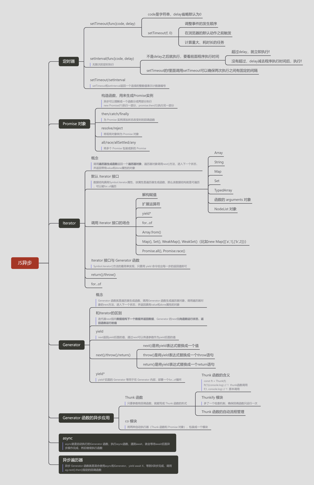
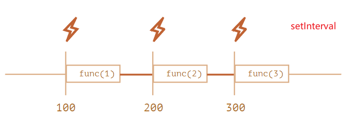
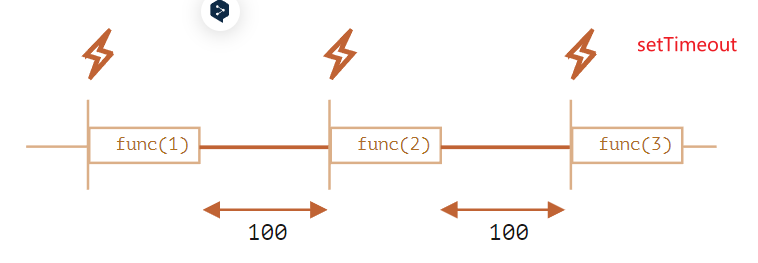

## 1、异步操作

所谓"异步"，简单说就是一个任务不是连续完成的，可以理解成该任务被人为分成两段，先执行第一段，然后转而执行其他任务，等做好了准备，再回过头执行第二段。`JS`是单线程（浏览器是多进程多线程），异步任务可以防止阻塞。

异步操作的模式：

- 回调函数：**JavaScript对异步编程的实现，就是回调函数**。所谓回调函数，就是把任务的第二段单独写在一个函数里面，等到重新执行这个任务的时候，就直接调用这个函数
- 事件监听
- 发布/订阅
- Promise 对象
- Generator 函数

```js
// 回调函数
// 第一个参数，必须是错误对象err，执行分成两段，第一段执行完以后，任务所在的上下文环境就已经结束了。在这以后抛出的错误，原来的上下文环境已经无法捕捉，只能当作参数，传入第二段。
fs.readFile('/etc/passwd', 'utf-8', function (err, data) {
  if (err) throw err;
  console.log(data);
});

// 事件监听
f1.on('done', f2);
function f1() {
  setTimeout(function () {
    // ...
    f1.trigger('done');
  }, 1000);
}

// 发布/订阅
jQuery.subscribe('done', f2);
function f1() {
  setTimeout(function () {
    // ...
    jQuery.publish('done');
  }, 1000);
}
jQuery.unsubscribe('done', f2);
```

## 2、定时器

### 2.1 `setTimeout(func|code, delay)`

code是字符串，delay省略默认为0

```js
// delay后可以接受参数
setTimeout(function (a,b) {
  console.log(a + b);
}, 1000, 1, 1);

// setTimeout内回调函数this指向全局
var x = 1;
var obj = {
  x: 2,
  y: function () {
    console.log(this.x);
  }
};wo
obj.y() // 2
setTimeout(obj.y, 1000) // 1

// 可以显示指定this指向
setTimeout(function () {
  obj.y();
}, 1000); // 2
setTimeout(obj.y.bind(obj), 1000) // 2
```

**`setTimeout(f, 0)`**

不会真的在0毫秒之后运行，不同的浏览器有不同的实现。以 Edge 浏览器为例，会等到4毫秒之后运行。如果电脑正在使用电池供电，会等到16毫秒之后运行；如果网页不在当前 Tab 页，会推迟到1000毫秒（1秒）之后运行。这样是为了节省系统资源。

应用：

- 可以调整事件的发生顺序
- 用户自定义的回调函数，通常在**浏览器的默认动作之前触发**
- 计算量大、耗时长的任务，常常会被放到几个小部分，分别放到`setTimeout(f, 0)`里面执行。

```js
// 在用户每次输入文本后，立即将字符转为大写
// HTML 代码如下
// <input type="text" id="input-box">
document.getElementById('input-box').onkeypress = function (event) {
  this.value = this.value.toUpperCase(); // 浏览器此时还没接收到新的文本
}

document.getElementById('input-box').onkeypress = function() {
  var self = this;
  setTimeout(function() {
    self.value = self.value.toUpperCase();
  }, 0);
}

// 改变一个网页元素的背景色
var div = document.getElementsByTagName('div')[0];
// 写法一
for (var i = 0xA00000; i < 0xFFFFFF; i++) {
  div.style.backgroundColor = '#' + i.toString(16);
}
// 写法二
var timer;
var i=0x100000;
function func() {
  timer = setTimeout(func, 0);
  div.style.backgroundColor = '#' + i.toString(16);
  if (i++ == 0xFFFFFF) clearTimeout(timer);
}
timer = setTimeout(func, 0);
```

### 2.2 `setInterval(func|code, delay)`

无限次的定时执行

`setInterval`指定每 100 ms 执行一次，每次执行需要 5 ms，那么第一次执行结束后95毫秒，第二次执行就会开始。如果某次执行耗时特别长，比如需要105毫秒，那么它结束后，下一次执行就会立即开始。

为了确保两次执行之间有固定的间隔，可以不用`setInterval`，而是每次执行结束后，使用`setTimeout`指定下一次执行的具体时间。

```js
var i = 1;
var timer = setTimeout(function f() {
  // ...
  timer = setTimeout(f, 2000);
}, 2000);

// 生效后setInterval不会产生累积效应，即不会一下子输出三个2，而是只会输出一个2
let num = 0;
const time = setInterval(function () {
    if (num < 4) {
        console.log(num++);
        sleep(2000);
    } else {
        clearInterval(time);
    }
}, 1000);
sleep(3000);
function sleep(ms) {
    var start = Date.now();
    while ((Date.now() - start) < ms) {
    }
}
// (3s) 0 (2s) 1 (2s) 2 (2s) 3
// setInterval(f,1000)进入循环，休息3s
// 判断1000《3000，立即执行f，把setInterval(f,1000)进入循环，2s后f执行完成
// 判断1000《2000，立即执行f
// ...
```

hao



总结：在进入`setInterval`后才会开启下一论`setInterval`，如果前一个`setInterval`或者主程序运行时间超过`setInterval`设定的delay，则会立即执行f；如果小于，在delay减去程序执行时间后，执行f。

### 2.3 `clearTimeout()`，`clearInterval()`

`setTimeout`和`setInterval`函数，都返回一个整数值，表示计数器编号。将该整数传入`clearTimeout`和`clearInterval`函数，就可以取消对应的定时器。

**返回的整数值是连续的**，也就是说，第二个`setTimeout`方法返回的整数值，将比第一个的整数值大1。

```js
// 取消当前所有的setTimeout定时器
(function() {
  // 每轮事件循环检查一次
  var gid = setInterval(clearAllTimeouts, 0);
  function clearAllTimeouts() {
    var id = setTimeout(function() {}, 0);
    while (id > 0) {
      if (id !== gid) {
        clearTimeout(id);
      }
      id--;
    }
  }
})();
```

## 3、Promise 对象

- 只有**异步操作的结果**，可以决定当前是哪一种状态，任何其他操作都无法改变这个状态。
- 一旦状态改变，就**不会再变**，任何时候都可以得到这个结果。
- 无法**取消**`Promise`，一旦新建它就会立即执行，无法中途取消
- 如果不设置回调函数，`Promise`内部抛出的**错误**，不会反应到外部。

### 3.1 基本用法

`Promise`对象是一个构造函数，用来生成`Promise`实例

```JS
// Promise构造函数接受一个函数作为参数，该函数的两个参数分别是resolve和reject
const promise = new Promise(function(resolve, reject) {
  // ... some code
  if (/* 异步操作成功 */){
    // resolve函数的作用是将Promise对象的状态从“未完成”变为“成功”（从 pending变为resolved），在异步操作成功时调用，
    // 并将异步操作的结果，作为参数传递出去
    resolve(value); 
  } else {
   // reject函数的作用是将Promise对象的状态从“未完成”变为“失败”（从 pending 变为 rejected），在异步操作失败时调用，
   // 并将异步操作报出的错误，作为参数传递出去
    reject(error);
  }
});

// Promise实例生成以后，可以用then方法分别指定resolved状态和rejected状态的回调函数
promise.then(function(value) { // Promise从 pending变为resolved调用
  // success
}, function(error) {  // Promise从 pending变为rejected调用
  // failure
});

// 实例
let promise = new Promise(function(resolve, reject) {
  console.log('Promise');
  resolve();
});
promise.then(function() {
  console.log('resolved.');
});
console.log('Hi!');
// Promise Hi! resolved
```

总结：异步可以简单理解成一个函数分成两部分执行，`new Promise(f1)`执行一部分，`promise.then(f2)`执行另一部分

**用`Promise`对象实现的 Ajax 操作的例子**

```js
const getJSON = function(url) {
  const promise = new Promise(function(resolve, reject){
    const handler = function() {
      if (this.readyState !== 4) {
        return;
      }
      if (this.status === 200) {
        resolve(this.response);
      } else {
        reject(new Error(this.statusText));
      }
    };
    const client = new XMLHttpRequest();
    client.open("GET", url);
    client.onreadystatechange = handler;
    client.responseType = "json";
    client.setRequestHeader("Accept", "application/json");
    client.send();
  });
  return promise;
};

getJSON("/posts.json").then(function(json) {
  console.log('Contents: ' + json);
}, function(error) {
  console.error('出错了', error);
});
```

**reject()方法的作用，等同于抛出错误**

```js
// 三种写法是等价的
const promise = new Promise(function(resolve, reject) {
  throw new Error('test');
});
const promise = new Promise(function(resolve, reject) {
  try {
    throw new Error('test');
  } catch(e) {
    reject(e);
  }
});
const promise = new Promise(function(resolve, reject) {
  reject(new Error('test'));
});

promise.catch(function(error) {
  console.log(error);
}); // Error: test
```

**Promise 的状态一旦改变，就永久保持该状态，不会再变了**

```js
const promise = new Promise(function(resolve, reject) {
  resolve('ok');
  throw new Error('test');
});
promise
  .then(function(value) { console.log(value) })
  .catch(function(error) { console.log(error) });
// ok
```

**`p1`的状态就会传递给`p2`**

resolve/reject参数是Promise，状态会传递，状态由参数决定

```js
const p1 = new Promise(function (resolve, reject) {
  setTimeout(() => reject(new Error('fail')), 3000)
})

const p2 = new Promise(function (resolve, reject) {
  setTimeout(() => resolve(p1), 1000)
})

p2
  .then(result => console.log(result))
  .catch(error => console.log(error))
// Error: fail
```

### 3.2 then/catch/finally

**为 Promise 实例添加状态改变时的回调函数**

**`Promise.prototype.then()`**

then方法返回的是一个新的Promise实例

**`Promise.prototype.catch()`**

`.then(null, rejection)或.then(undefined, rejection)`的别名，用于指定发生错误时的回调函数，返回的还是一个 Promise 对象

`then()`方法指定的回调函数，如果运行中抛出错误，也会被catch()方法捕获

```js
p.then((val) => console.log('fulfilled:', val))
  .catch((err) => console.log('rejected', err));
// 等同于
p.then((val) => console.log('fulfilled:', val))
  .then(null, (err) => console.log("rejected:", err));

getJSON('/posts.json').then(function(posts) {
  throw new Error('fail') // 被下面catch捕获
  console.log(result) // 不会运行
}).catch(function(error) {
  // 处理 getJSON 和 .then(resolve)运行时发生的错误
  console.log('发生错误！', error);
}).catch(function(error) {
  console.log('carry on', error); // 可以捕获上一个catch运行的错误，但如果此时发生错误，则没有办法捕抓，因为后面没有catch
});
```

Promise 对象的错误具有**“冒泡”性质**，会一直向后传递，直到被捕获为止。也就是说，错误总是会被下一个`catch`语句捕获。

如果没有使用`catch()`方法指定错误处理的回调函数，Promise 对象抛出的错误**不会传递到外层代码**，即不会有任何反应。

```js
const someAsyncThing = function() {
  return new Promise(function(resolve, reject) {
    // 下面一行会报错，因为x没有声明，浏览器会打印出错误提示，但是不会退出进程、终止脚本执行
    resolve(x + 2);
  });
};
// 只要抛出错误后续的then指定的成功回调函数都不会被执行
someAsyncThing().then(function() {
  console.log('everything is great11'); // 如果顺利执行到这里，这里抛出错误，下面的成功回调函数不会被执行
}).then(function() {
  console.log('everything is great22');
});

setTimeout(() => { console.log(123) }, 2000);
// Uncaught (in promise) ReferenceError: x is not defined
// 123
```

**`Promise.prototype.finally()`**

用于指定不管 Promise 对象最后状态如何，都会执行的操作，在执行完then/catch后执行finally

```js
promise = new Promise(function(resolve, reject) {
    resolve('app');
})
promise
    .then(result => {console.log(result)})
    .catch(error => {console.log(error)})
    .finally(() => {console.log('finally')}); // 不能接收参数
// app finally

// 实现
Promise.prototype.finally = function (callback) {
  let P = this.constructor;
  return this.then(
    value  => P.resolve(callback()).then(() => value),
    reason => P.resolve(callback()).then(() => { throw reason })
  );
};
```

### 3.3 resolve/reject

**将现有对象转为 Promise 对象**

**`Promise.resolve()`**

```js
Promise.resolve('foo')
// 等价于
new Promise(resolve => resolve('foo'))
```

（1）参数是一个 Promise 实例：不做任何修改、原封不动地返回这个实例

（2）参数是一个`thenable`对象：**`thenable`对象指的是具有`then`方法的对象**，会将这个对象转为 Promise 对象，在**主程序结束后**执行`thenable`对象的`then()`方法。==todo==

```js
let thenable = {
    then: function(resolve, reject) {
        console.log('then')
        resolve(42);
    }
};

let p1 = Promise.resolve(thenable); // main then 42
/*let p1 = new Promise((resolve, reject) => {
    console.log('then')
    resolve(42);
});*/ // then main 42

p1.then(function (value) {
    console.log(value);  // 42
});

console.log('main')
```

（3）参数不是具有then()方法的对象，或根本就不是对象：返回一个新的 Promise 对象，状态为`resolved`，`Promise.resolve()`方法的参数，会同时传给then指定的成功回调函数。

**`Promise.reject()`**

`Promise.reject()`方法的参数，会原封不动地作为`reject`的理由，变成后续方法的参数。参数是`thenable`对象也不会执行里面的then方法。

```js
const p = Promise.reject('出错了');
// 等同于
const p = new Promise((resolve, reject) => reject('出错了'))
p.then(null, function (s) {
  console.log(s)
}); // 出错了
```

### 3.4 `all/race/allSettled/any`

**将多个 Promise 包装成新的 Promise**

**`Promise.all()`**

`const p = Promise.all([p1, p2, p3]);`

（1）只有`p1`、`p2`、`p3`的状态**都变成`fulfilled`**，`p`的状态才会变成`fulfilled`，此时`p1`、`p2`、`p3`的**返回值组成一个数组，传递给`p`的回调函数**。

（2）只要`p1`、`p2`、`p3`之中有**一个被`rejected`**，`p`的状态就变成`rejected`，此时第一个**被`reject`的实例的返回值**，会传递给`p`的回调函数。

实例：`booksPromise`和`userPromise`是两个异步操作，只有等到它们的结果都返回了，才会触发`pickTopRecommendations`这个回调函数

```js
const databasePromise = connectDatabase();
const booksPromise = databasePromise.then(findAllBooks);
const userPromise = databasePromise.then(getCurrentUser);

Promise.all([booksPromise,userPromise])
.then(([books, user]) => pickTopRecommendations(books, user));
```

Promise 实例定义了`catch`方法或者`then`中指定`reject`函数，那么它一旦被`rejected`，并不会触发`Promise.all()`的`catch`方法

```js
const p1 = new Promise((resolve, reject) => {
    resolve('hello');
})
    .then(result => {return 'world'}, reject => reject); 
// 如果后面还有then，会继续执行，把最终的状态和参数传递到Promise.all

const p2 = new Promise((resolve, reject) => {
    throw new Error('报错了');
})
    .then(result => result)
    .catch(e => e); // 处理throw new Error并返回新的promise，状态为resolved

Promise.all([p1, p2])
    .then(result => console.log(result))
    .catch(e => console.log(e)); // 如果p2没有catch，就会执行到这里
// ["world", Error: 报错了]
```

**`Promise.race()`**

只要`p1`、`p2`、`p3`之中有一个实例**率先改变状态**，`p`的状态就跟着改变。那个率先改变的 Promise 实例的返回值，就传递给`p`的回调函数。

实例：如果 5 秒之内`fetch`方法无法返回结果，变量`p`的状态就会变为`rejected`，从而触发`catch`方法指定的回调函数。

```js
const p = Promise.race([
  fetch('/resource-that-may-take-a-while'),
  new Promise(function (resolve, reject) {
    setTimeout(() => reject(new Error('request timeout')), 5000)
  })
]);

p
.then(console.log)
.catch(console.error);
```

**`Promise.allSettled()`**

只有等到参数数组的所有 Promise 对象**都发生状态变更**（不管是`fulfilled`还是`rejected`），返回的 Promise 对象才会发生状态变更。

该方法返回的新的 Promise 实例，一旦发生状态变更，**状态总是`fulfilled`**，不会变成`rejected`。

```js
const resolved = Promise.resolve(42);
const rejected = Promise.reject(-1);
const allSettledPromise = Promise.allSettled([resolved, rejected]);
allSettledPromise.then(function (results) {
  console.log(results);
});
// [
//    { status: 'fulfilled', value: 42 },
//    { status: 'rejected', reason: -1 }
// ]

// 过滤出成功/失败的请求
const promises = [ fetch('index.html'), fetch('https://does-not-exist/') ];
const results = await Promise.allSettled(promises);
const successfulPromises = results.filter(p => p.status === 'fulfilled');
const errors = results
  .filter(p => p.status === 'rejected')
  .map(p => p.reason);
```

**`Promise.any()`**

只要参数实例有一个变成`fulfilled`状态，包装实例就会变成`fulfilled`状态；如果所有参数实例都变成`rejected`状态，包装实例就会变成`rejected`状态。

```js
var resolved = Promise.resolve(42);
var rejected = Promise.reject(-1);
var alsoRejected = Promise.reject(Infinity);

Promise.any([resolved, rejected, alsoRejected]).then(function (result) {
  console.log(result); // 42
});

Promise.any([rejected, alsoRejected]).catch(function (results) {
  console.log(results instanceof AggregateError); // true
  console.log(results.errors); // [-1, Infinity] 返回错误对象数组
});
```

### 3.5 Generator 函数与 Promise 的结合

使用 Generator 函数管理流程，遇到异步操作的时候，通常返回一个`Promise`对象。

Generator 函数`g`之中，有一个异步操作`getFoo`，它返回的就是一个`Promise`对象。函数`run`用来处理这个`Promise`对象，并调用下一个`next`方法。

## 4、Iterator 和 for...of 循环

### 4.1 Iterator（遍历器）的概念

 Iterator是一种接口，为各种不同的数据结构提供统一的访问机制。任何数据结构只要部署 Iterator 接口，就可以完成遍历操作（即依次处理该数据结构的所有成员）。

`ES6` 创造了一种新的遍历命令`for...of`循环，Iterator 接口主要供`for...of`消费。

Iterator 的遍历过程是这样的。

（1）创建一个指针**对象**，指向当前数据结构的起始位置。也就是说，遍历器对象本质上，就是一个指针对象。

（2）第一次调用指针对象的`next`方法，可以将指针指向数据结构的第一个成员，并返回一个包含`value`和`done`两个属性的对象。其中，`value`属性是当前成员的值，`done`属性是一个布尔值，表示遍历是否结束。

（3）第二次调用指针对象的`next`方法，指针就指向数据结构的第二个成员。

（4）不断调用指针对象的`next`方法，直到它指向数据结构的结束位置。

```js
function makeIterator(array) { // 遍历器生成函数，作用就是返回一个遍历器对象
  var nextIndex = 0;
  return {
    next: function() {
      return nextIndex < array.length ?
        {value: array[nextIndex++], done: false} :
        {value: undefined, done: true};
    }
  };
}

var it = makeIterator(['a', 'b']); // it就是调用遍历器生成函数生成的遍历器对象
// next方法，用来移动指针，并返回一个对象，表示当前数据成员的信息。
console.log(it.next()) // { value: "a", done: false }
console.log(it.next()) // { value: "b", done: false }
console.log(it.next()) // { value: undefined, done: true }
```

总结：调用**遍历器生成函数**返回一个**遍历器对象**，遍历器对象调用next()方法，进入下一个状态，并返回带有value和done属性的对象

### 4.2 默认 Iterator 接口

一种数据结构只要部署了 Iterator 接口，我们就称这种数据结构是“可遍历的”（`iterable`）。 Iterator 接口部署在数据结构的`Symbol.iterator`属性，或者说，**一个数据结构只要具有`Symbol.iterator`属性，就可以认为是“可遍历的”（`iterable`）**。

`Symbol.iterator`属性本身是一个函数，就是当前数据结构默认的遍历器生成函数。执行这个函数，就会返回一个遍历器对象。类似上面的`makeIterator`。

```js
const obj = {
  // 属性名Symbol.iterator，它是一个表达式，是一个预定义好的、类型为 Symbol 的特殊值，所以要放在方括号内
  [Symbol.iterator] : function () {
    return {
      next: function () {
        return {
          value: 1,
          done: true
        };
      }
    };
  }
};
// 该对象Symbol.iterator是一个遍历器生成函数，这个对象是可遍历的（iterable）
```

总结：数据结构具有`Symbol.iterator`属性，该属性是**遍历器生成函数**，那么该数据结构就是可遍历，可以被`for..of`遍历

**Iterator 接口与 Generator 函数**

`Symbol.iterator()`方法的最简单实现，几乎不用部署任何代码，只要用 yield 命令给出每一步的返回值即可。

```js
let myIterable = {
  [Symbol.iterator]: function* () {
    yield 1;
    yield 2;
    yield 3;
  }
};
[...myIterable] // [1, 2, 3]

// 或者采用下面的简洁写法
let obj = {
  * [Symbol.iterator]() {
    yield 'hello';
    yield 'world';
  }
};

for (let x of obj) {
  console.log(x);
} // "hello" "world"
```

总结：Generator 函数通过yield 给出每一步的返回值轻松实现`Symbol.iterator`

**原生具备 Iterator 接口的数据结构**

- Array
- String
- Map
- Set
- `TypedArray`
- 函数的 arguments 对象
- `NodeList` 对象

```js
let arr = ['a', 'b', 'c'];
let iter = arr[Symbol.iterator](); // 执行Symbol.iterator函数，得到遍历器对象

iter.next() // { value: 'a', done: false }
iter.next() // { value: 'b', done: false }
iter.next() // { value: 'c', done: false }
iter.next() // { value: undefined, done: true }
```

**对象**

`for...in`循环可以遍历键名，`for...of`循环会报错。

一个对象如果要具备可被`for...of`循环调用的 Iterator 接口，就必须在`Symbol.iterator`的属性上部署遍历器生成方法（原型链上的对象具有该方法也可）。

```js
// 方法一：给对象增加Symbol.iterator属性
class RangeIterator {
  constructor(start, stop) {
    this.value = start;
    this.stop = stop;
  }
    
  [Symbol.iterator]() { return this; } // 返回当前对象
    
  next() {
    var value = this.value;
    if (value < this.stop) {
      this.value++;
      return {done: false, value: value};
    }
    return {done: true, value: undefined};
  }
}

function range(start, stop) {
  return new RangeIterator(start, stop);
}

for (var value of range(0, 3)) {
  console.log(value); // 0, 1, 2
}

// 方法二：使用Object.keys方法将对象的键名生成一个数组，然后遍历这个数组
for (var key of Object.keys(someObject)) {
  console.log(key + ': ' + someObject[key]);
}

// 方法三：使用 Generator 函数将对象重新包装一下
const obj = { a: 1, b: 2, c: 3 }
function* entries(obj) {
  for (let key of Object.keys(obj)) {
    yield [key, obj[key]];
  }
}
for (let [key, value] of entries(obj)) {
  console.log(key, '->', value);
}
// a -> 1
// b -> 2
// c -> 3
```

**类似数组的对象**

对于类似数组的对象（存在**数值键名和`length`**属性），部署 Iterator 接口，有一个简便方法，就是`Symbol.iterator`方法直接引用数组的 Iterator 接口。

```js
// 普通对象部署数组的`Symbol.iterator`方法，并无效果，iterable没有数值键名
/*let iterable = {
    a: 'a',
    b: 'b',
    c: 'c',
    length: 3,
    [Symbol.iterator]: Array.prototype[Symbol.iterator]
};*/

let iterable = {
    0: 'a',
    1: 'b',
    2: 'c',
    length: 3,
    [Symbol.iterator]: Array.prototype[Symbol.iterator]
};
for (let item of iterable) {
    console.log(item); // 'a', 'b', 'c'
}

// 空对象obj部署了数组arr的Symbol.iterator属性，结果obj的for...of循环，产生了与arr完全一样的结果。
const arr = ['red', 'green', 'blue'];
const obj = {};
obj[Symbol.iterator] = arr[Symbol.iterator].bind(arr); // 通过bind绑定了arr
for(let v of obj) { // for(let v of arr) {
  console.log(v); // red green blue
}

// 方法二：使用Array.from方法将其转为数组。
let arrayLike = { length: 2, 0: 'a', 1: 'b' };
for (let x of Array.from(arrayLike)) {
  console.log(x);
}
```

**调用 Iterator 接口的场合** ==todo==

（1）**解构赋值**：对数组和 Set 结构进行解构赋值时，会默认调用`Symbol.iterator`方法。

（2）**扩展运算符**：只要某个数据结构部署了 Iterator 接口，就可以对它使用扩展运算符，将其转为数组。`let arr = [...iterable];`

```js
// 例一
var str = 'hello';
const hello = [...str] //  ['h','e','l','l','o']
const hello1 = {...str} //  { '0': 'h', '1': 'e', '2': 'l', '3': 'l', '4': 'o' }

// 例二
let arr = ['b', 'c'];
const world = ['a', ...arr, 'd'] // ['a', 'b', 'c', 'd']
const world1 = {...arr} // { '0': 'b', '1': 'c' }
```

（3）**yield***：后面跟的是一个可遍历的结构，它会调用该结构的遍历器接口

```js
let generator = function* () {
  yield 1;
  yield* [2,3,4];
  yield 5;
};

var iterator = generator();

iterator.next() // { value: 1, done: false }
iterator.next() // { value: 2, done: false }
iterator.next() // { value: 3, done: false }
iterator.next() // { value: 4, done: false }
iterator.next() // { value: 5, done: false }
iterator.next() // { value: undefined, done: true }
```

（4）其他场合 todo

- `for...of`
- `Array.from()`
- `Map()`, `Set()`, `WeakMap()`, `WeakSet()`（比如`new Map([['a',1],['b',2]])`）
- `Promise.all()`
- `Promise.race()`

```js
function* numbers () { // Generator函数可以实现遍历器生成函数
  yield 1
  yield 2
  return 3
  yield 4
} // 下面场景会自动调用 Iterator 接口，对numbers进行遍历

// 扩展运算符
[...numbers()] // [1, 2] 只要某个数据结构部署了 Iterator 接口，就可以对它使用扩展运算符，将其转为数组
const b = {...numbers()} // {}

// Array.from 方法
Array.from(numbers()) // [1, 2]

// 解构赋值
let [x, y] = numbers(); // x=1 y=2

// for...of 循环
for (let n of numbers()) {
  console.log(n)
} // 1 2
```

### 4.3 遍历器对象的 return()，throw()

遍历器对象除了具有`next()`方法，还可以具有`return()`方法和`throw()`方法。

- `return()`方法的使用场合是，如果`for...of`循环提前退出（通常是因为出错，或者有`break`语句），就会调用`return()`方法。如果一个对象在完成遍历前，需要清理或释放资源，就可以部署`return()`方法。
- `throw()`方法主要是配合 Generator 函数使用

### 4.4 for...of 循环

`for...of`循环内部调用的是数据结构的`Symbol.iterator`方法

```js
// 循环调用next
var $iterator = ITERABLE[Symbol.iterator]();
var $result = $iterator.next();
while (!$result.done) {
  var x = $result.value;
  // ...
  $result = $iterator.next();
}
```

**数组**

`for...in`循环，只能获得对象的**键名**，不能直接获取键值。`ES6` 提供`for...of`循环，允许遍历获得**键值**。

`for...in`循环主要是为遍历对象而设计的，不适用于遍历数组。

- 数组的键名是数字，但是`for...in`循环是以字符串作为键名“0”、“1”、“2”等等。
- `for...in`循环不仅遍历数字键名，还会遍历手动添加的其他键，甚至包括原型链上的键。
- 某些情况下，`for...in`循环会以任意顺序遍历键名。

```js
let arr = [3, 5, 7];
arr.foo = 'hello';

for (let i in arr) {
  console.log(i); // "0", "1", "2", "foo"
}
// for...of循环不会返回数组arr的foo属性
for (let i of arr) {
  console.log(i); //  "3", "5", "7"
}

// for...of不同于forEach方法，它可以与break、continue和return配合使用
for (var n of fibonacci) {
  if (n > 1000)
    break;
  console.log(n);
}
```

**Set 和 Map 结构**

Set 结构遍历时，返回的是一个值；而 Map 结构遍历时，返回的是一个数组，该数组的两个成员分别为当前 Map 成员的键名和键值。

```js
var engines = new Set(["Gecko", "Trident", "Webkit", "Webkit"]);
for (var e of engines) {
  console.log(e);
} // Gecko Trident Webkit

let map = new Map().set('a', 1).set('b', 2);
for (let pair of map) {
  console.log(pair);
}
// ['a', 1]    ['b', 2]
for (let [key, value] of map) {
  console.log(key + ' : ' + value);
}
// a : 1    b : 2
```

**计算生成的数据结构**

有些数据结构是在现有数据结构的基础上，计算生成的。比如，ES6 的数组、Set、Map 都部署了以下三个方法，调用后都返回遍历器对象。

- `entries()` 返回一个遍历器对象，用来遍历**`[键名, 键值]`组成的数组**。对于数组，键名就是索引值；对于 Set，键名与键值相同。Map 结构的 Iterator 接口，默认就是调用`entries`方法。
- `keys()` 返回一个遍历器对象，用来遍历所有的**键名**。
- `values()` 返回一个遍历器对象，用来遍历所有的**键值**。

```js
let arr = ['a', 'b', 'c'];
for (let pair of arr.entries()) { // 调用后生成的遍历器对象，所遍历的都是计算生成的数据结构
  console.log(pair);
}
// [0, 'a']    [1, 'b']    [2, 'c']
```

**字符串**

会正确识别 32 位 `UTF-16 `字符

```js
for (let x of 'a\uD83D\uDC0A') {
  console.log(x);
}
// 'a'
// '\uD83D\uDC0A'
```

**通过遍历器实现“链表”结构**

```js
function Obj(value) {
    this.value = value;
    this.next = null;
}

Obj.prototype[Symbol.iterator] = function() { // 在对象上部署
    var iterator = { next: next };
    var current = this;
    function next() {
        if (current) {
            var value = current.value;
            // 给current添加next方法，用来移动指针，指向下一个对象
            // one = {value: 1, next: two} --> one.next = two --> current从one指向two
            current = current.next; 
            return { done: false, value: value }; // 并返回一个对象，表示当前数据成员的信息
        }
        return { done: true };
    }
    return iterator; // 返回迭代器对象（包含next方法）
}

var one = new Obj(1);
var two = new Obj(2);
var three = new Obj(3);
one.next = two;
two.next = three;

for (var i of one){
    console.log(i); // 1, 2, 3
}
```

## 5、Generator 函数的语法

### 5.1 简介

语法上，首先可以把它理解成，Generator 函数是一个**状态机**，封装了多个内部状态。还是一个遍历器对象生成函数，执行 Generator 函数会返回一个遍历器对象。返回的遍历器对象，可以依次遍历 Generator 函数内部的每一个状态。

形式上，Generator 函数是一个普通函数，但是有两个特征。一是，`function`关键字与函数名之间有一个星号；二是，函数体内部使用`yield`表达式，定义不同的内部状态（`yield`在英语里的意思就是“产出”）。

```js
function* helloWorldGenerator() {
  yield 'hello';
  yield 'world';
  return 'ending';
}

// 调用 Generator 函数后，该函数并不执行，返回的也不是函数运行结果
// 而是一个指向内部状态的指针对象，也就是遍历器对象（Iterator Object）
var hw = helloWorldGenerator();

// 调用遍历器对象的next方法，使得指针移向下一个状态，从函数头部或上一次停下来的地方开始执行，直到遇到下一个yield表达式（或return语句）为止
// 并返回一个对象，value属性表示当前的内部状态的值，是yield表达式后面那个表达式的值；done属性是一个布尔值，表示是否遍历结束
hw.next() // { value: 'hello', done: false }
hw.next() // { value: 'world', done: false }
hw.next() // { value: 'ending', done: true }
hw.next() // { value: undefined, done: true }
```

总结：Generator 函数就是遍历器生成函数，调用Generator 函数生成遍历器对象，调用遍历器对象的next方法，进入下一个状态，并返回具有value和done属性的对象。和迭代器的区别是，迭代器next指向**数据结构下一个数据并返回数据**，Generator 的next指**向函数运行状态，返回函数运行的值**。

**yield 表达式**

`yield`表达式只能用在 Generator 函数里面，用在其他地方都会报错。

遍历器对象的`next`方法的运行逻辑如下。

（1）遇到`yield`表达式，并将紧跟在`yield`后面的那个表达式的值，作为返回的对象的`value`属性值，就暂停执行后面的操作。

（2）下一次调用`next`方法时，如果next有传参数，该参数作为yield后面的值，再继续往下执行，直到遇到下一个`yield`表达式。

（3）如果没有再遇到新的`yield`表达式，就一直运行到函数结束，直到`return`语句为止，并将`return`语句后面的表达式的值，作为返回的对象的`value`属性值，后面的语句不在执行。

（4）如果该函数没有`return`语句，则返回的对象的`value`属性值为`undefined`。

正常函数只能返回一个值，因为只能执行一次`return`；Generator 函数可以返回一系列的值，因为可以有任意多个`yield`。从另一个角度看，也可以说 **Generator 生成了一系列的值**，这也就是它的名称的来历（英语中，generator 这个词是“生成器”的意思）。

```JS
function hello(req) {
   return req;
}
function* helloWorldGenerator() {
    const a = yield hello('hello');
    const b = yield hello('world');
    console.log(a + ' ' + b);
}
var hw = helloWorldGenerator();

console.log(hw.next()) // { value: 'hello', done: false }
console.log(hw.next('11')) // { value: 'world', done: false }
// 11 22
console.log(hw.next('22'))  // { value: undefined, done: true }

// yield表达式如果用在另一个表达式之中，必须放在圆括号里面
function* demo() {
  console.log('Hello' + yield); // SyntaxError
  console.log('Hello' + yield 123); // SyntaxError

  console.log('Hello' + (yield)); // OK
  console.log('Hello' + (yield 123)); // OK
}

// 作函数参数或放在赋值表达式的右边，可以不加括号
function* demo() {
  foo(yield 'a', yield 'b'); // OK
  let input = yield; // OK
}
```

总结：next返回yield后面的值，通过next可以传递参数作为yield后面的值。

**与 Iterator 接口的关系** 

任意一个对象的`Symbol.iterator`方法，等于该对象的遍历器生成函数，调用该函数会返回该对象的一个遍历器对象。

由于 Generator 函数就是遍历器生成函数，因此可以把 Generator 赋值给对象的`Symbol.iterator`属性，从而使得该对象具有 Iterator 接口。

```js
var myIterable = {};
myIterable[Symbol.iterator] = function* () {
  yield 1;
  yield 2;
  yield 3;
};
[...myIterable] // [1, 2, 3]

// gen是一个 Generator 函数，调用它会生成一个遍历器对象g。它的Symbol.iterator属性，也是一个遍历器对象生成函数，执行后返回它自己。也就是说gen函数执行生成实例g，g的属性Symbol.iterator指向gen函数
function* gen(){
  // some code
}
var g = gen();
g[Symbol.iterator]() === g // true

// for...of循环可以自动遍历 Generator 函数运行时生成的Iterator对象，且此时不再需要调用next方法。
function* foo() {
  yield 1;
  yield 2;
  return 3; // 一旦next方法的返回对象的done属性为true，for...of循环就会中止，且不包含该返回对象，所以上面代码的return语句返回的3，不包括在for...of循环之中
}
for (let v of foo()) {
  console.log(v);
} // 1 2
```

总结：执行生成器函数生成遍历器对象（生成器函数实例），实例的属性`Symbol.iterator`指向生成器函数，`Symbol.iterator`可以通过Generator 实现

**作为对象属性的 Generator 函数**

```js
let obj = {
  * myGeneratorMethod() { // myGeneratorMethod: function* () {
    ···
  }
};
```

### 5.2 next 方法的参数

**`next`方法的作用是分阶段执行`Generator`函数**。每次调用`next`方法，会返回一个对象，表示当前阶段的信息（`value`属性和`done`属性）

`next`方法可以带一个参数，该参数就会被当作上一个`yield`表达式的返回值。如果没有传递参数，上一个`yield`表达式就是undefined。

```js
// 可以在 Generator 函数运行的不同阶段，从外部向内部注入不同的值，从而调整函数行为
function* f() {
  for(var i = 0; true; i++) {
    var reset = yield i;
    if(reset) { i = -1; }
  }
}
var g = f();
g.next() // { value: 0, done: false }
g.next() // { value: 1, done: false } 不断叠加
g.next(true) // { value: 0, done: false } 重置参数
```

如果需要第一次调用`next`方法时，就能够输入值，可以在 Generator 函数外面再包一层

```js
function wrapper(generatorFunction) {
    return function (...args) {
        let generatorObject = generatorFunction(...args);
        generatorObject.next();
        return generatorObject;
    };
}

const wrapped = wrapper(function* () {
    console.log(`First input: ${yield}`);
    return 'DONE';
});

wrapped().next('hello!')
// First input: hello!
```

### 5.3 throw() return()

**throw()** 

- Generator 函数返回的遍历器对象，都有一个`throw`方法，可以**在函数体外抛出错误，然后在 Generator 函数体内捕获**。

- `throw`方法抛出的错误要被内部捕获，前提是**必须至少执行过一次`next`方法**。如果没有执行next就throw，错误直接在外部抛出。

- `throw`方法被捕获以后，会附带**执行下一条`yield`表达式**。也就是说，会附带执行一次`next`方法。

- 一旦 Generator 执行过程中抛出错误，且没有被内部捕获，就不会再执行下去了。如果此后还调用`next`方法，将返回一个`value`属性等于`undefined`、`done`属性等于`true`的对象，即 **JavaScript 引擎认为这个 Generator 已经运行结束了**。

```js
var g = function* () {
  // 内部没有部署try...catch代码块，那么throw方法抛出的错误，将被外部try...catch代码块捕获，内外都没有部署程序就会报错
  try {
    yield;
  } catch (e) { 
    console.log('内部捕获', e);
  }
};

var i = g();
i.next();

try {
  throw new Error('a'); // 只能被函数体外的catch语句捕获
  i.throw('a');
  i.throw('b'); // i第二次抛出错误，由于 Generator 函数内部的catch语句已经执行过了，不会再捕捉到这个错误了，所以这个错误就被抛出了 Generator 函数体，被函数体外的catch语句捕获
} catch (e) {
  console.log('外部捕获', e);
}
// 内部捕获 a
// 外部捕获 b

// 遍历器的throw方法抛出的错误，不影响下一次遍历
var gen = function* gen(){
  try {
    yield console.log('a');
  } catch (e) {
    // ...
  }
  yield console.log('b');
  yield console.log('c');
}
var g = gen();
g.next() // a
g.throw() // b 附带执行一次next方法
g.next() // c
```

**return()**

可以返回给定的值，并且**终结遍历 Generator 函数**

不提供参数，则返回值的`value`属性为`undefined`

如果 Generator 函数内部有`try...finally`代码块，且正在执行`try`代码块，那么`return()`方法会导致立刻进入`finally`代码块，执行完以后，整个函数才会结束。

```javascript
function* gen() {
  yield 1;
  yield 2;
  yield 3;
}

var g = gen();

g.next() // { value: 1, done: false }
g.return('foo') // { value: "foo", done: true }
g.next() // { value: undefined, done: true } 再调用next()方法，done属性总是返回true

// finally
function* numbers () {
  yield 1;
  try {
    yield 2;
    yield 3;
  } finally { // 即使外部.return()也会被执行
    yield 4;
    yield 5;
  }
  yield 6;
}
var g = numbers();
g.next() // { value: 1, done: false }
g.next() // { value: 2, done: false }
g.return(7) // { value: 4, done: false }
g.next() // { value: 5, done: false }
g.next() // { value: 7, done: true } 7在这里捕获
```

==next()、throw()、return() 的共同点==

让 Generator 函数恢复执行，并且使用不同的语句替换`yield`表达式

- `next()`是将`yield`表达式替换成一个值

- `throw()`是将`yield`表达式替换成一个`throw`语句

- `return()`是将`yield`表达式替换成一个`return`语句

```js
const g = function* (x, y) {
  let result = yield x + y;
  return result;
};
const gen = g(1, 2);
gen.next(); // Object {value: 3, done: false}

// 相当于将 let result = yield x + y替换成 let result = 1;
gen.next(1); // Object {value: 1, done: true}

// 相当于将 let result...替换成 let result = throw(new Error('出错了'));
gen.throw(new Error('出错了')); // Uncaught Error: 出错了

// 相当于将 let result...替换成 let result = return 2;
gen.return(2); // Object {value: 2, done: true}
```

### 5.4 yield* 表达式

用来在一个 Generator 函数里面执行另一个 Generator 函数

```js
function* foo() {
  yield 'a';
  yield 'b';
}
function* bar() {
  yield 'x';
  yield* foo();
  yield 'y';
}

// 等同于
function* bar() {
  yield 'x';
  yield 'a';
  yield 'b';
  yield 'y';
}

// 等同于 
function* bar() {
  yield 'x';
  for (let v of foo()) {
    yield v;
  }
  yield 'y';
}

// 使用for..of遍历bar
for (let v of bar()){
  console.log(v);
} // "x" "a" "b" "y"
```

`yield*`后面的 Generator 函数（没有`return`语句时），等同于在 Generator 函数内部，部署一个`for...of`循环

```js
function* foo() {
  yield 2;
  yield 3;
  return "foo";
}

function* bar() {
  yield 1;
  var v = yield* foo();
  console.log("v: " + v);
  yield 4;
}

var it = bar();

it.next() // {value: 1, done: false}
it.next() // {value: 2, done: false}
it.next() // {value: 3, done: false}
it.next() // {value: 4, done: false}  "v: foo"    
it.next() // {value: undefined, done: true}
```

如果`yield*`后面跟着一个数组，由于数组原生支持遍历器，因此就会遍历数组成员。实际上，任何数据结构只要有 Iterator 接口，就可以被`yield*`遍历。

```js
function* gen(){
  yield* ["a", "b", "c"];
}
gen().next() // { value:"a", done:false }

// 第一次是扩展运算符遍历函数logReturned返回的遍历器对象
// 第二次是yield*语句遍历函数genFuncWithReturn返回的遍历器对象
function* genFuncWithReturn() {
  yield 'a';
  yield 'b';
  return 'The result';
}
function* logReturned(genObj) {
  let result = yield* genObj;
  console.log(result);
}

[...logReturned(genFuncWithReturn())]
// The result
// 值为 [ 'a', 'b' ]
```

**扁平化**

`yield*`命令可以很方便地取出嵌套数组的所有成员

```js
const tree = [ 'a', ['b', ['c']], ['d', 'e'] ];
function* iterTree(tree) {
    if (Array.isArray(tree)) {
        for(let i=0; i < tree.length; i++) {
            yield* iterTree(tree[i]);
        }
    } else {
        yield tree;
    }
}
// 扩展运算符...默认调用 Iterator 接口
const hello = [...iterTree(tree)] // ["a", "b", "c", "d", "e"]
```

**遍历完全二叉树**

```js
// 下面是二叉树的构造函数，三个参数分别是左树、当前节点和右树
function Tree(left, label, right) {
    this.left = left;
    this.label = label;
    this.right = right;
}

// 下面生成二叉树
function make(array) {
    // 判断是否为叶节点
    if (array.length == 1) return new Tree(null, array[0], null);
    return new Tree(make(array[0]), array[1], make(array[2]));
}
let tree = make([[['a'], 'b', ['c']], 'd', [['e'], 'f', ['g']]]);  
//       d
//   b       f
// a   c    e  g

// 下面是中序（inorder）遍历函数。
// 由于返回的是一个遍历器，所以要用generator函数。函数体内采用递归算法，所以左树和右树要用yield*遍历
function* inorder(t) {
    if (t) {
        yield* inorder(t.left);
        yield t.label;
        yield* inorder(t.right);
    }
}

// 遍历二叉树
var result = [];
for (let node of inorder(tree)) {
    result.push(node);
}

result // ['a', 'b', 'c', 'd', 'e', 'f', 'g']
```

### 5.5 Generator 函数的this

Generator 函数总是返回一个遍历器，`ES6` 规定这个遍历器是 Generator 函数的**实例，也继承了 Generator 函数的`prototype`对象上的方法**。

普通构造对象返回`this`对象，Generator 函数返回遍历器对象。

```js
function* g() {}
g.prototype.hello = function () {
  return 'hi!';
};
let obj = g(); // Generator 函数g返回的遍历器obj，是g的实例，而且继承了g.prototype
obj instanceof g // true
obj.hello() // 'hi!'

// Generator 函数的this指向全局对象
function* g() {
  this.a = 11; // global
}
let obj = g();
obj.next();
obj.a // undefined
```

Generator 函数返回一个正常的对象实例，既可以用`next`方法，又可以获得正常的`this`

```js
function* F() {
  this.a = 1;
  yield this.b = 2;
  yield this.c = 3;
}

var obj = {};
var f = F.call(obj); // 执行的是遍历器对象f，但是F函数内部绑定的this是obj
f.next();  // Object {value: 2, done: false}
f.next();  // Object {value: 3, done: false}
f.next();  // Object {value: undefined, done: true}
console.log(obj) // { a: 1, b: 2, c: 3 }

// 统一两个对象
// var f = F.call(F.prototype); // F函数内部绑定的this是F.prototype，f就可以通过原型链访问abc
// f.a // 1
// f.b // 2
// f.c // 3

// 将F改成构造函数，就可以对它执行new命令了 Generator 函数不能使用new命令
function* gen() {
  this.a = 1;
  yield this.b = 2;
  yield this.c = 3;
}

function F() {
  return gen.call(gen.prototype);
}

var f = new F();
```

==todo== new

### 5.6 应用

**Generator 与状态机**

```js
var ticking = true;
var clock = function() {
  if (ticking)
    console.log('Tick!');
  else
    console.log('Tock!');
  ticking = !ticking;
}

// Generator 实现，少了用来保存状态的外部变量ticking，更简洁，更安全（状态不会被非法篡改）
// 之所以可以不用外部变量保存状态，是因为它本身就包含了一个状态信息，即目前是否处于暂停态
var clock = function* () {
  while (true) {
    console.log('Tick!');
    yield;
    console.log('Tock!');
    yield;
  }
};
```

**Generator 与协程**

进程是资源分配的最小单位，线程是CPU调度的最小单位

**进程=火车，线程=车厢，线程在进程下行进（单纯的车厢无法运行）**

浏览器主要进程：

- Browser 进程：浏览器的主进程，只有一个。
  - 负责浏览器界面的显示与交互；
  - 各个页面的管理，创建和销毁其他进程；
  - 网络的资源管理、下载等。
- Renderer 进程：也称为浏览器渲染进程或浏览器内核，**内部是多线程的**。主要负责页面渲染，**脚本执行（`JS`是单线程）**，事件处理等。
- 第三方插件进程：每种类型的插件对应一个进程，仅当使用该插件时才创建。
- `GPU` 进程：最多一个，用于 `3D` 绘制等。

由于 JavaScript 是单线程语言，只能保持一个调用栈。引入协程以后，每个任务可以保持自己的调用栈。这样做的最大好处，就是抛出错误的时候，可以找到原始的调用栈。不至于像异步操作的回调函数那样，一旦出错，原始的调用栈早就结束。

==Generator 函数是 ES6 对协程的实现==，但属于不完全实现。Generator 函数被称为“半协程”（semi-coroutine），意思是只有 Generator 函数的调用者，才能将程序的执行权还给 Generator 函数。如果是完全执行的协程，任何函数都可以让暂停的协程继续执行。

```js
// asyncJob是一个协程
function* asyncJob() {
  // ...其他代码
  var f = yield readFile(fileA); // 协程遇到yield命令就暂停，等到执行权返回，再从暂停的地方继续往后执行
  // ...其他代码
}
```

总结：浏览器是多进程多线程，js执行是在Renderer 进程的一个线程中

**Generator 与上下文** 

Generator 函数不是这样，它执行产生的上下文环境，一旦遇到`yield`命令，就会暂时退出堆栈，但是并不消失，里面的所有变量和对象会冻结在当前状态。等到对它执行`next`命令时，这个**上下文环境又会重新加入调用栈**，冻结的变量和对象恢复执行。

**异步操作的同步化表达** 

Generator 函数的暂停执行的效果，意味着可以把异步操作写在`yield`表达式里面，等到调用`next`方法时再往后执行。

```js
function* main() {
  var result = yield request("http://some.url");
  var resp = JSON.parse(result);
    console.log(resp.value);
}

function request(url) {
  makeAjaxCall(url, function(response){
    it.next(response); // 异步操作结束后会调用
  });
}

var it = main();
it.next();

// 通过 Generator 函数逐行读取文本文件，使用yield表达式可以手动逐行读取文件
function* numbers() {
  let file = new FileReader("numbers.txt");
  try {
    while(!file.eof) {
      yield parseInt(file.readLine(), 10);
    }
  } finally {
    file.close();
  }
}
```

**部署 Iterator 接口**

利用 Generator 函数，可以在任意对象上部署 Iterator 接口

```js
function* iterEntries(obj) {
  let keys = Object.keys(obj);
  for (let i=0; i < keys.length; i++) {
    let key = keys[i];
    yield [key, obj[key]];
  }
}

let myObj = { foo: 3, bar: 7 };

for (let [key, value] of iterEntries(myObj)) {
  console.log(key, value);
}
// foo 3  bar 7
```

**作为数据结构** ==todo==

```js
function* doStuff() {
  yield fs.readFile.bind(null, 'hello.txt');
  yield fs.readFile.bind(null, 'world.txt');
  yield fs.readFile.bind(null, 'and-such.txt');
}

for (task of doStuff()) {
  // task是一个函数，可以像回调函数那样使用它
}
```

## 6、Generator 函数的异步应用

### 6.1 基本概念

Generator 函数封装异步原因

- 可以暂停执行和恢复执行
- 函数体内外的数据交换，`next`返回值的 value 属性，是 Generator 函数向外输出数据；`next`方法还可以接受参数，向 Generator 函数体内输入数据
- 错误处理机制，函数内部可以部署错误处理代码，捕获函数体外抛出的错误

**异步任务的封装**

```js
var fetch = require('node-fetch');

function* gen(){
  var url = 'https://api.github.com/users/github';
  var result = yield fetch(url); // Fetch模块返回的是一个 Promise 对象
  console.log(result.bio);
}

var g = gen();
var result = g.next();

result.value.then(function(data){ // fetch状态确定后会回调then方法
  return data.json();
}).then(function(data){
  g.next(data);
});
```

### 6.2 Thunk 函数

自动执行 Generator 函数的一种方法，Promise 和 Thunk 本质都是对回调函数的包装

**参数的求值策略**

```js
var x = 1;

function f(m) {
  return m * 2;
}

f(x + 5)
```

- 传值调用（call by value）：进入函数体之前，就计算`x + 5`的值（等于 6），再将这个值传入函数`f`
- 传名调用（call by name）：直接将表达式`x + 5`传入函数体，只在用到它的时候求值

**Thunk 函数的含义**

编译器的**传名调用**实现，往往是将参数放到一个临时函数之中，再将这个临时函数传入函数体。这个临时函数就叫做 Thunk 函数。

```js
// f(x + 5); 等同于
var thunk = function () {
  return x + 5;
};

function f(thunk) {
  return thunk() * 2;
}
```

**JavaScript 语言的 Thunk 函数**

在 JavaScript 语言中，Thunk 函数替换的不是表达式，而是多参数函数，将其替换成一个只接受回调函数作为参数的单参数函数。

任何函数，**只要参数有回调函数，就能写成 Thunk 函数的形式**。

```js
// ES5版本
var Thunk = function(fn){
  return function (){
    var args = Array.prototype.slice.call(arguments);
    return function (callback){
      args.push(callback);
      return fn.apply(this, args);
    }
  };
};

const Thunk = function(fn) {
    return function (...args) { // 扩展运算符
        return function (callback) {
            // 运行 f(...args, callback) --> callback(...args) --> console.log(1)
            return fn.call(this, ...args, callback); // function.call(thisArg, arg1, arg2, ...)
        }
    };
};

function f(a, cb) {
    cb(a);
}
const ft = Thunk(f);
ft(1)(console.log) // 1  thunk函数调用
f(1, console.log) // 1  原本调用
```

**Thunkify 模块**

生产环境的转换器，建议使用 `Thunkify` 模块

源码主要多了一个检查机制，变量`called`确保回调函数只运行一次

```js
function thunkify(fn) {
  return function() {
    var args = new Array(arguments.length);
    var ctx = this;

    for (var i = 0; i < args.length; ++i) {
      args[i] = arguments[i];
    }

    return function (done) {
      var called;

      args.push(function () {
        if (called) return;
        called = true;
        done.apply(null, arguments);
      });

      try {
        fn.apply(ctx, args);
      } catch (err) {
        done(err);
      }
    }
  }
};
```

**Generator 函数的流程管理**

将同一个回调函数，反复传入`next`方法的`value`属性

```js
/*正常版本的readFile（多参数版本）
fs.readFile(fileName, callback);

// thunkify改造后
var readFileThunk = Thunk(fs.readFile);
readFileThunk(fileName)(callback);
*/

var fs = require('fs');
var thunkify = require('thunkify');
var readFileThunk = thunkify(fs.readFile);

var gen = function* (){
    var r1 = yield readFileThunk('/etc/fstab');
    console.log(r1.toString());
    var r2 = yield readFileThunk('/etc/shells');
    console.log(r2.toString());
};

var g = gen();
var r1 = g.next();
// r1.value-->readFileThunk('/etc/fstab')
// (function (err, data) { ... }) 就是 (callback)
r1.value(function (err, data) {
    if (err) throw err;
    var r2 = g.next(data);
    r2.value(function (err, data) {
        if (err) throw err;
        g.next(data);
    });
});
```

总结：`readFile(fileName, callback)`改造成`readFile(fileName)(callback)`在callback中调用next()，让Generator 自动执行下去。callback是读取成功后异步回调事件，也就是上一个异步操作结束后，调用callback，在callback中调用next()进行下一个异步操作。

**Thunk 函数的自动流程管理**

不管内部有多少个异步操作，直接把 Generator 函数传入`run`函数即可。当然，前提是每一个异步操作，都要是 Thunk 函数，也就是说，跟在`yield`命令后面的必须是 Thunk 函数。

```js
function run(fn) { // Generator 函数的自动执行器
  var gen = fn();

  function next(err, data) { // Thunk 的回调函数
    var result = gen.next(data);
    if (result.done) return;
    result.value(next); // 将next函数再传入 Thunk 函数（result.value属性）next就是callback，异步任务结束后会自动回调
  }
  next();
}

var g = function* (){ // 封装了n个异步的读取文件操作
  var f1 = yield readFileThunk('fileA');
  var f2 = yield readFileThunk('fileB');
  // ...
  var fn = yield readFileThunk('fileN');
};

run(g);
```

总结：执行run函数内部next，next作用就是将next函数异步操作作为回调函数，异步结束，调用run函数内部next....不断循环，把Generator执行完

### 6.3 co 模块

**co 模块的原理**

Generator 就是一个异步操作的容器。它的自动执行需要一种机制，**当异步操作有了结果，能够自动交回执行权**。两种方法可以做：

（1）回调函数。将异步操作包装成 Thunk 函数，在回调函数里面交回执行权。

（2）Promise 对象。将异步操作包装成 Promise 对象，用`then`方法交回执行权。

**co 模块其实就是将两种自动执行器（Thunk 函数和 Promise 对象），包装成一个模块。**使用 co 的前提条件是，Generator 函数的`yield`命令后面，只能是 Thunk 函数或 Promise 对象。

```js
var gen = function* () {
  var f1 = yield readFile('/etc/fstab');
  var f2 = yield readFile('/etc/shells');
  console.log(f1.toString());
  console.log(f2.toString());
};

var co = require('co');
// co函数返回一个Promise对象，等到 Generator 函数执行结束，就会输出一行提示
co(gen).then(function (){
  console.log('Generator 函数执行完成');
});
```

**基于 Promise 对象的自动执行**

```js
var fs = require('fs');

var readFile = function (fileName){
    return new Promise(function (resolve, reject){
        fs.readFile(fileName, function(error, data){
            if (error) return reject(error);
            resolve(data);
        });
    });
};

var gen = function* (){
    var f1 = yield readFile('/etc/fstab');
    // 执行fs.readFile，然后返回Promise对象，读取完文件后会调用callback
    // 成功调用resolve，失败调用reject，gen函数的迭代器实例通过then指定resolve和reject
    // function(error, data) {if (error) return reject(error);resolve(data);}
    var f2 = yield readFile('/etc/shells');
    console.log(f1.toString());
    console.log(f2.toString());
};

var g = gen();
g.next().value.then(function(data){ // 读写成功时调用
    g.next(data).value.then(function(data){ // 开启下一轮异步
        g.next(data);
    });
});

// 自动执行
function run(gen){
  var g = gen();
  function next(data){
    var result = g.next(data);
    if (result.done) return result.value;
    result.value.then(function(data){
      next(data);
    });
  }
  next();
}
run(gen);
```

**co 模块的源码**

```js
function co(gen) {
    var ctx = this;

    return new Promise(function(resolve, reject) { // 返回一个 Promise 对象
        // 检查参数gen是否为 Generator 函数。如果是，就执行该函数，得到一个内部指针对象
        if (typeof gen === 'function') gen = gen.call(ctx);
        // 如果不是就返回，并将 Promise 对象的状态改为resolved
        if (!gen || typeof gen.next !== 'function') return resolve(gen);
        // 将 Generator 函数的内部指针对象的next方法，包装成onFulfilled函数，主要是为了能够捕捉抛出的错误
        onFulfilled();
        function onFulfilled(res) {
            var ret;
            try {
                ret = gen.next(res); // 得到迭代器对象
            } catch (e) {
                return reject(e);
            }
            next(ret); 
            // 往Generator yield后返回的promise添加then(onFulfilled, onRejected)
            // 等异步结束后调用onFulfilled，执行到上面ret = gen.next(res);又开启新一轮异步
        }
    });
}

function next(ret) {
    // 检查当前是否为 Generator 函数的最后一步，如果是就返回
    if (ret.done) return resolve(ret.value);
    // 确保每一步的返回值，是 Promise 对象
    var value = toPromise.call(ctx, ret.value);
    // 使用then方法，为返回值加上回调函数，然后通过onFulfilled函数再次调用next函数
    if (value && isPromise(value)) return value.then(onFulfilled, onRejected);
    // 在参数不符合要求的情况下（非 Thunk 函数和 Promise 对象），将 Promise 对象的状态改为rejected，终止执行
    return onRejected(
        new TypeError(
            'You may only yield a function, promise, generator, array, or object, '
            + 'but the following object was passed: "'
            + String(ret.value)
            + '"'
        )
    );
}
```

**处理并发的异步操作** 

```js
// 数组的写法
co(function* () {
  var res = yield [
    Promise.resolve(1),
    Promise.resolve(2)
  ];
  console.log(res);
}).catch(onerror);

// 对象的写法
co(function* () {
  var res = yield {
    1: Promise.resolve(1),
    2: Promise.resolve(2),
  };
  console.log(res);
}).catch(onerror);

// 允许并发三个somethingAsync异步操作，等到它们全部完成，才会进行下一步
co(function* () {
  var values = [n1, n2, n3];
  yield values.map(somethingAsync);
});
function* somethingAsync(x) {
  // do something async
  return y
}
```

**实例：处理 Stream**

- `data`事件：下一块数据块已经准备好了。
- `end`事件：整个“数据流”处理完了。
- `error`事件：发生错误。

使用`Promise.race()`函数，可以判断这三个事件之中哪一个最先发生，只有当`data`事件最先发生时，才进入下一个数据块的处理。从而，我们可以通过一个`while`循环，完成所有数据的读取。

```JS
const co = require('co');
const fs = require('fs');

const stream = fs.createReadStream('./les_miserables.txt');
let valjeanCount = 0;

co(function*() {
  while(true) {
    const res = yield Promise.race([
      new Promise(resolve => stream.once('data', resolve)),
      new Promise(resolve => stream.once('end', resolve)),
      new Promise((resolve, reject) => stream.once('error', reject))
    ]);
    if (!res) {
      break;
    }
    stream.removeAllListeners('data');
    stream.removeAllListeners('end');
    stream.removeAllListeners('error');
    valjeanCount += (res.toString().match(/valjean/ig) || []).length;
  }
  console.log('count:', valjeanCount); // count: 1120
});
```

## 7、`async` 函数

### 7.1 基本概念

**含义**

Generator 函数的语法糖，`async`函数就是将 Generator 函数的星号。（`*`）替换成`async`，将`yield`替换成`await`。`async`函数完全可以看作多个异步操作，包装成的一个 Promise 对象。

（1）**内置执行器**：`async`函数自带执行器。也就是说，`async`函数的执行，与普通函数一模一样，只要一行 `asyncReadFile();`。

（2）**更好的语义**：`async`表示函数里有异步操作，`await`表示紧跟在后面的表达式需要等待结果。

（3）**更广的适用性**：`co`模块约定，`yield`命令后面只能是 Thunk 函数或 Promise 对象，而`async`函数的`await`命令后面，可以是 Promise 对象和原始类型的值（数值、字符串和布尔值，但这时会**自动转成**立即 resolved 的 Promise 对象）

（4）**返回值是 Promise**：`async`函数的返回值是 Promise 对象，这比 Generator 函数的返回值是 Iterator 对象方便多了。可以用`then`方法指定下一步的操作。

**基本用法**

当函数执行的时候，一旦遇到await就会先返回，等到异步操作完成，再接着执行函数体内后面的语句。

```js
function timeout(ms) {
  return new Promise((resolve) => {
    setTimeout(resolve, ms);
  });
}
// 由于async函数返回的是 Promise 对象，上面也可以写成
// await 操作符用于等待一个 Promise 兑现并获取它兑现之后的值
async function timeout(ms) {
  await new Promise((resolve) => {
    setTimeout(resolve, ms);
  });
}

async function asyncPrint(value, ms) {
  await timeout(ms);
  console.log(value);
}

asyncPrint('hello world', 50);
```

async 函数有多种使用形式

```js
// 函数声明
async function foo() {}

// 函数表达式
const foo = async function () {};

// 对象的方法
let obj = { async foo() {} };
obj.foo().then(...)

// Class 的方法
class Storage {
  constructor() {
    this.cachePromise = caches.open('avatars');
  }

  async getAvatar(name) {
    const cache = await this.cachePromise;
    return cache.match(`/avatars/${name}.jpg`);
  }
}

const storage = new Storage();
storage.getAvatar('jake').then(…);

// 箭头函数
const foo = async () => {};
```

总结：`async`就是自动执行的Generator 函数，执行`async`函数，遇到await，就会等待await后面异步操作完成，然后继续执行函数。

### 7.2 语法

**返回 Promise 对象** 

**`async`函数返回一个 Promise 对象。`async`函数内部`return`语句返回的值，会成为`then`方法回调函数的参数。**只有`async`函数内部的异步操作执行完，才会执行`then`方法指定的回调函数。

```js
async function f() {
  // return 'hello world';
  // return await 123; 相当于 return 123;
  throw new Error('出错了');
  // return await Promise.reject('出错了'); 有没有return效果一样
}

f().then(
  v => console.log('resolve', v), // "hello world"
  e => console.log('reject', e) //reject Error: 出错了
)
```

**await 命令**

任何一个`await`语句后面的 Promise 对象变为`reject`状态，那么整个`async`函数都会中断执行。

```js
async function f() {
  await Promise.reject('出错了');
  // 只要处理错误不会中断后面的操作
  try {
    await Promise.reject('出错了');
    const val1 = await firstStep(); // 可以统多个await命令
  } catch(e) {
  }
  await Promise.reject('出错了').catch(e => console.log(e));
  await Promise.resolve('hello world'); // 不会执行
}
```

**错误处理**

使用try...catch结构，实现多次重复尝试

```js
const superagent = require('superagent');
const NUM_RETRIES = 3;

async function test() {
  let i;
  for (i = 0; i < NUM_RETRIES; ++i) {
    try {
      await superagent.get('http://google.com/this-throws-an-error');
      break;
    } catch(err) {}
  }
  console.log(i); // 3
}
test();
```

**同时触发**

```js
// 继发执行
let foo = await getFoo();
let bar = await getBar();

// 并发执行 写法一
let [foo, bar] = await Promise.all([getFoo(), getBar()]);
// 写法二
let fooPromise = getFoo();
let barPromise = getBar();
let foo = await fooPromise;
let bar = await barPromise;

// 继发执行
async function dbFuc(db) {
  let docs = [{}, {}, {}];
  for (let doc of docs) {
    await db.post(doc);
  }
}

async function dbFuc(db) {
  let docs = [{}, {}, {}];
  await docs.reduce(async (_, doc) => {
    await _;
    await db.post(doc);
  }, undefined);
}

// 并发执行
function dbFuc(db) { //这里不需要 async
  let docs = [{}, {}, {}];
  docs.forEach(async function (doc) {
    await db.post(doc);
  });
}

async function dbFuc(db) {
  let docs = [{}, {}, {}];
  let promises = docs.map((doc) => db.post(doc)); // [promise1, promise2, ...]
  let results = await Promise.all(promises);
  console.log(results);
}

async function dbFuc(db) {
  let docs = [{}, {}, {}];
  let promises = docs.map((doc) => db.post(doc)); // [promise1, promise2, ...]
  let results = [];
  for (let promise of promises) {
    results.push(await promise);
  }
  console.log(results);
}
```

### 7.3 `async` 函数的实现原理

```js
function spawn(genF) {
  return new Promise(function(resolve, reject) {
    const gen = genF();
    function step(nextF) {
      let next;
      try {
        next = nextF();
      } catch(e) {
        return reject(e);
      }
      if(next.done) {
        return resolve(next.value);
      }
      Promise.resolve(next.value).then(function(v) {
        step(function() { return gen.next(v); });
      }, function(e) {
        step(function() { return gen.throw(e); });
      });
    }
    step(function() { return gen.next(undefined); });
  });
}

async function fn(args) {
  // ...
}
// 等同于
function fn(args) {
  return spawn(function* () {
    // ...
  });
}
```

**与其他异步处理方法的比较**

假定某个 DOM 元素上面，部署了一系列的动画，前一个动画结束，才能开始后一个。如果当中有一个动画出错，就不再往下执行，返回上一个成功执行的动画的返回值。

```js
// Promise 
function chainAnimationsPromise(elem, animations) {
    // 变量ret用来保存上一个动画的返回值
    let ret = null;
    // 新建一个空的Promise
    let p = Promise.resolve();
    // 使用then方法，添加所有动画
    for(let anim of animations) {
        p = p.then(function(val) {
            ret = val;
            return anim(elem);
        }); // p.then().then().then()
    }
    // 返回一个部署了错误捕捉机制的Promise
    return p.catch(function(e) {
        /* 忽略错误，继续执行 */
    }).then(function() {
        return ret;
    });
}

// Generator 
function chainAnimationsGenerator(elem, animations) {
    return spawn(function*() {
        let ret = null;
        try {
            for(let anim of animations) {
                ret = yield anim(elem);
            }
        } catch(e) {
            /* 忽略错误，继续执行 */
        }
        return ret;
    });

}

// async 
async function chainAnimationsAsync(elem, animations) {
    let ret = null;
    try {
        for(let anim of animations) {
            ret = await anim(elem);
        }
    } catch(e) {
        /* 忽略错误，继续执行 */
    }
    return ret;
}
```

按照顺序完成。比如，依次远程读取一组 URL，然后按照读取的顺序输出结果。

```js
function logInOrder(urls) {
  // 远程读取所有URL
  const textPromises = urls.map(url => {
    return fetch(url).then(response => response.text());
  }); // [promise1, promise2, ...]
  // 按次序输出
  textPromises.reduce((chain, textPromise) => {
    return chain.then(() => textPromise)
      .then(text => console.log(text));
  }, Promise.resolve()); // 给promise数组依次添加then方法
}

async function logInOrder(urls) {
  // 并发读取远程URL
  const textPromises = urls.map(async url => {
    const response = await fetch(url);
    return response.text();
  }); // promise数组
  // 按次序输出
  for (const textPromise of textPromises) { 
    console.log(await textPromise);
  }
}
```

总结：批量处理promise利用for循环或者数组方法，`promise.then(A1).then(A2).then(A3)`可以理解成执行完`A1`后就去执行`A2`，依次执行then里面方法

### 7.4 顶层 await

从 [ES2022](https://github.com/tc39/proposal-top-level-await) 开始，允许在模块的顶层独立使用`await`命令，使得上面那行代码不会报错了。它的主要目的是使用`await`解决模块异步加载的问题。

顶层`await`只能用在 `ES6` 模块，不能用在 `CommonJS` 模块。这是因为 `CommonJS` 模块的`require()`是同步加载，如果有顶层`await`，就没法处理加载了。

```js
// import() 方法加载
const strings = await import(`/i18n/${navigator.language}`);

// 数据库操作
const connection = await dbConnector();

// 依赖回滚
let jQuery;
try {
  jQuery = await import('https://cdn-a.com/jQuery');
} catch {
  jQuery = await import('https://cdn-b.com/jQuery');
}

// 加载命令是同步执行
// x.js
console.log("X1");
await new Promise(r => setTimeout(r, 1000));
console.log("X2");
// y.js
console.log("Y");
// z.js
import "./x.js";
import "./y.js";
console.log("Z");
// X1、Y、X2、Z
```

## 8、异步遍历器

### 8.1 异步遍历的接口

异步遍历器的最大的语法特点，就是调用遍历器的`next`方法，返回的是一个 Promise 对象。异步遍历器接口，部署在`Symbol.asyncIterator`属性上面。

```js
const myAsyncIterable = new Object();
myAsyncIterable[Symbol.asyncIterator] = async function*() {
    yield "hello";
    yield "async";
    yield "iteration!";
};

(async () => {
    for await (const x of myAsyncIterable) {
        console.log(x);
        // expected output:
        //    "hello"
        //    "async"
        //    "iteration!"
    }
})();
```

### 8.2 for await...of

```js
// 迭代异步可迭代对象
var asyncIterable = {
    [Symbol.asyncIterator]() {
        return {
            i: 0,
            next() {
                if (this.i < 3) {
                    return Promise.resolve({ value: this.i++, done: false });
                }

                return Promise.resolve({ done: true });
            }
        };
    }
};

// 迭代异步生成器
(async function() {
    for await (num of asyncIterable) {
        console.log(num);
    }
})();
// 0 1 2

async function* asyncGenerator() {
  var i = 0;
  while (i < 3) {
    yield i++;
  }
}

(async function() {
  for await (num of asyncGenerator()) {
    console.log(num);
  }
})();
// 0 1 2
```

### 8.3 异步 Generator 函数

Generator 函数返回一个同步遍历器对象一样，异步 Generator 函数的作用，是返回一个异步遍历器对象，异步 Generator 函数就是`async`函数与 Generator 函数的结合。

异步 Generator 函数内部，能够同时使用`await`和`yield`命令。可以这样理解，**`await`命令用于将外部操作产生的值输入函数内部，`yield`命令用于将函数内部的值输出**。

`yield`命令后面是一个字符串，会被自动包装成一个 Promise 对象。异步 Generator 函数也可以通过`next`方法的参数，接收外部传入的数据。

```js
async function* gen() { // 异步 Generator 函数
  yield 'hello';
}
const genObj = gen(); // gen执行后返回一个异步 Iterator 对象，对该对象调用next方法，返回一个 Promise 对象
genObj.next().then(x => console.log(x)); // Promise接受具有value和done属性的对象
// { value: 'hello', done: false }
```

**与`async` 函数对比**

`async` 函数和异步 Generator 函数，是封装异步操作的两种方法，都用来达到同一种目的。区别在于，前者自带执行器，后者通过`for await...of`执行，或者自己编写执行器。

如果是一系列按照顺序执行的异步操作（比如读取文件，然后写入新内容，再存入硬盘），可以使用 `async` 函数；如果是一系列产生相同数据结构的异步操作（比如一行一行读取文件），可以使用异步 Generator 函数。

```js
function fetchRandom() {
  const url = 'https://www.random.org/decimal-fractions/'
    + '?num=1&dec=10&col=1&format=plain&rnd=new';
  return fetch(url);
}

async function* asyncGenerator() {
  console.log('Start');
  const result = await fetchRandom(); // (A)
  yield 'Result: ' + await result.text(); // (B)
  console.log('Done');
}

const ag = asyncGenerator(); // ag是asyncGenerator函数返回的异步遍历器对象
ag.next().then(({value, done}) => {
  console.log(value);
})
```

1. `ag.next()`立刻返回一个 Promise 对象。
2. `asyncGenerator`函数开始执行，打印出`Start`。
3. `await`命令返回一个 Promise 对象，`asyncGenerator`函数停在这里。
4. A 处变成 fulfilled 状态，产生的值放入`result`变量，`asyncGenerator`函数继续往下执行。
5. **函数在 B 处的`yield`暂停执行，一旦`yield`命令取到值，`ag.next()`返回的那个 Promise 对象变成 fulfilled 状态。**
6. `ag.next()`后面的`then`方法指定的回调函数开始执行。该回调函数的参数是一个对象`{value, done}`，其中`value`的值是`yield`命令后面的那个表达式的值，`done`的值是`false`。

**异步 Generator 函数的执行器**

```js
async function takeAsync(asyncIterable, count = Infinity) {
    const result = [];
    const iterator = asyncIterable[Symbol.asyncIterator]();
    while (result.length < count) { // 遍历gen
        const {value, done} = await iterator.next();
        if (done) break;
        result.push(value);
    }
    return result; // ['a', 'b', 'c']
}
async function f() {
    async function* gen() {
        yield 'a';
        yield 'b';
        yield 'c';
    }
    return await takeAsync(gen());
}
f().then(function (result) {
    console.log(result); // ['a', 'b', 'c']
})
```

**异步 Generator 函数抛出误**

```js
async function* asyncGenerator() {
  throw new Error('Problem!');
}

asyncGenerator()
.next()
.catch(err => console.log(err)); // Error: Problem!``
```

**yield* 语句**

```js
async function* gen1() {
  yield 'a';
  yield 'b';
  return 2;
}

async function* gen2() {
  // result 最终会等于 2
  const result = yield* gen1();
}
```

总结：异步 Generator 函数就是混合使用`async`和Generator，`yield await X`，等到X异步完成，调用`ag.next().then()`指定的回调函数。
