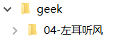

# `todo`

87 | 程序员练级攻略：前端基础和底层原理
88 | 程序员练级攻略：前端性能优化和框架

收集资料——整体了解——重点细节深入——实践

收藏夹--清单

------

程序员修炼之道 The Pragmatic Programmer

代码整洁之道 Clean Code

程序员的职业素养 The Clean Code

领域驱动设计和实践 Domain-Driven Design

测试驱动的面向对象软件开发 Growing Object-Oriented Software, Guided by Tests

持续交付 Continuous Delivery

不要学习微服务框架，学习演进式架构（Evolutionary Architecture）。

不要学习新的编程语言，学习代码整洁之道、设计模式、领域驱动设计（`DDD`）。

不要学习 `LeSS` 和规模化敏捷框架（`SAFe`），学习精益生产原则（Lean manufacturing principles）。

不要学习 `Hystrix`，学习容错模式（Fault Tolerance Patterns）。

不要学习 Docker，学成持续交付。

不要学习 Angular、React 和 `Vue`，学习 Web、HTTP 和 REST。

------

3 浏览器/HTML/`CSS`

[全栈公开课 2022](https://fullstackopen.com/zh/)

[**`CSS`**: *A search engine in `CSS`*](https://stories.algolia.com/a-search-engine-in-css-b5ec4e902e97)

[**`Node.js`**: *Write your own `bittorrent` client*](https://allenkim67.github.io/programming/2016/05/04/how-to-make-your-own-bittorrent-client.html)

[**`Node.js`**: *Build a `DNS` Server in `Node.js`*](https://engineerhead.github.io/dns-server/)

[**`Node.js`**: *Create a `CLI `tool in `Javascript`*](https://citw.dev/tutorial/create-your-own-cli-tool)

[**`Node.js`**: *How to create a real-world Node `CLI app` with Node*](https://medium.freecodecamp.org/how-to-create-a-real-world-node-cli-app-with-node-391b727bbed3)

[响应式布局万圣节网站](https://github.com/bedimcode/responsive-halloween-website) 

[手绘组件库](https://chr15m.github.io/DoodleCSS/) 

4 `JS`

other

- [**JavaScript**: *Build Your Own Module Bundler - `Minipack`*](https://github.com/ronami/minipack)
- [**`TypeScript`**: *Tiny Package Manager: Learns how `npm` or Yarn works*](https://github.com/g-plane/tiny-package-manager)
- [**`Node.js`**: *Build a static site generator in 40 lines with `Node.js`*](https://www.webdevdrops.com/en/build-static-site-generator-nodejs-8969ebe34b22/)
- [Build a Jupyter Notebook Extension](https://link.medium.com/wWUO7TN8SS)
- [**JavaScript**: *Learn JavaScript Promises by Building a Promise from Scratch*](https://levelup.gitconnected.com/understand-javascript-promises-by-building-a-promise-from-scratch-84c0fd855720)
- [**JavaScript**: *Implementing promises from scratch (TDD way)*](https://www.mauriciopoppe.com/notes/computer-science/computation/promises/)
- [**JavaScript**: *Implement your own — call(), apply() and bind() method in JavaScript*](https://blog.usejournal.com/implement-your-own-call-apply-and-bind-method-in-javascript-42cc85dba1b)

Template Engine

- [**JavaScript**: *JavaScript template engine in just 20 lines*](http://krasimirtsonev.com/blog/article/Javascript-template-engine-in-just-20-line)
- [**JavaScript**: *Understanding JavaScript Micro-`Templating`*](https://medium.com/wdstack/understanding-javascript-micro-templating-f37a37b3b40e)

`Regex` Engine

- [**JavaScript**: *Build a `Regex` Engine in Less than 40 Lines of Code*](https://nickdrane.com/build-your-own-regex/)
- [**JavaScript**: *How to implement regular expressions in functional `javascript` using derivatives*](http://dpk.io/dregs/toydregs)
- [**JavaScript**: *Implementing a Regular Expression Engine*](https://deniskyashif.com/2019/02/17/implementing-a-regular-expression-engine/)

other

- Build a Progressive Web Application (`PWA`)
  - [Part 1](https://bitsofco.de/bitsofcode-pwa-part-1-offline-first-with-service-worker/)
  - [Part 2](https://bitsofco.de/bitsofcode-pwa-part-2-instant-loading-with-indexeddb/)
  - [Part 3](https://bitsofco.de/bitsofcode-pwa-part-3-push-notifications/)
- [Build A Native Desktop App with JS](https://medium.freecodecamp.org/build-native-desktop-apps-with-javascript-a49ede90d8e9)
- Build a Powerful API with NodeJs,GraphQL and Hapi
  - [Part I](https://medium.com/@wesharehoodies/how-to-setup-a-powerful-api-with-nodejs-graphql-mongodb-hapi-and-swagger-e251ac189649)

5  `Node` 

`Web Server`

- [**`Node.js`**: *Let's code a web server from scratch with `NodeJS` Streams*](https://www.codementor.io/ziad-saab/let-s-code-a-web-server-from-scratch-with-nodejs-streams-h4uc9utji)
- [**`Node.js`**: *lets-build-express*](https://github.com/antoaravinth/lets-build-express)
- [**`Node.js`**: *Building A Simple Single Sign On(`SSO`) Server And Solution From Scratch In `Node.js`.*](https://codeburst.io/building-a-simple-single-sign-on-sso-server-and-solution-from-scratch-in-node-js-ea6ee5fdf340)

other

- [Build a real-time Markdown Editor with NodeJS](https://scotch.io/tutorials/building-a-real-time-markdown-viewer)
- [Test-Driven Development with Node, Postgres and Knex](http://mherman.org/blog/2016/04/28/test-driven-development-with-node/)
- Write a Twitter Bot in Node.js
  - [Part 1](https://codeburst.io/build-a-simple-twitter-bot-with-node-js-in-just-38-lines-of-code-ed92db9eb078)
  - [Part 2](https://codeburst.io/build-a-simple-twitter-bot-with-node-js-part-2-do-more-2ef1e039715d)
- [Build A Simple Search Bot in 30 minutes](https://medium.freecodecamp.org/how-to-build-a-simple-search-bot-in-30-minutes-eb56fcedcdb1)
- [Build A Job Scraping Web App](https://medium.freecodecamp.org/how-i-built-a-job-scraping-web-app-using-node-js-and-indreed-7fbba124bbdc)
- [Building a GitHub App](https://blog.scottlogic.com/2017/05/22/gifbot-github-integration.html)
- How to build your own Uber-for-X App using JavaScript, Node.JS, MongoDB and Web Sockets
  - [Part 1](https://www.ashwinhariharan.tech/blog/how-to-build-your-own-uber-for-x-app/)
  - [Part 2](https://www.ashwinhariharan.tech/blog/how-to-build-your-own-uber-for-x-app-part-2/)

6 React 

[**JavaScript**: *Build a ride hailing `app` with React Native*](https://pusher.com/tutorials/ride-hailing-react-native)

- [Create Serverless React.js Apps](http://serverless-stack.com/)
- [Create a Trello Clone](http://codeloveandboards.com/blog/2016/01/04/trello-tribute-with-phoenix-and-react-pt-1/)
- [Create a Character Voting App with React, Node, MongoDB and SocketIO](http://sahatyalkabov.com/create-a-character-voting-app-using-react-nodejs-mongodb-and-socketio)
- [React Tutorial: Cloning Yelp](https://www.fullstackreact.com/articles/react-tutorial-cloning-yelp/)
- [Build a Full Stack Movie Voting App with Test-First Development using Mocha, React, Redux and Immutable](https://teropa.info/blog/2015/09/10/full-stack-redux-tutorial.html)
- [Build a Twitter Stream with React and Node](https://scotch.io/tutorials/build-a-real-time-twitter-stream-with-node-and-react-js)
- [Build A Simple Medium Clone using React.js and Node.js](https://medium.com/@kris101/clone-medium-on-node-js-and-react-js-731cdfbb6878)
- [Integrate MailChimp in JS](https://medium.freecodecamp.org/how-to-integrate-mailchimp-in-a-javascript-web-app-2a889fb43f6f)
- [Build A Chrome Extension with React + Parcel](https://medium.freecodecamp.org/building-chrome-extensions-in-react-parcel-79d0240dd58f)
- [Build A ToDo App With React Native](https://blog.hasura.io/tutorial-fullstack-react-native-with-graphql-and-authentication-18183d13373a)
- [Make a Chat Application](https://medium.freecodecamp.org/how-to-build-a-chat-application-using-react-redux-redux-saga-and-web-sockets-47423e4bc21a)
- [Create a News App with React Native](https://medium.freecodecamp.org/create-a-news-app-using-react-native-ced249263627)
- [Learn Webpack For React](https://medium.freecodecamp.org/learn-webpack-for-react-a36d4cac5060)
- [Testing React App With Puppeteer and Jest](https://blog.bitsrc.io/testing-your-react-app-with-puppeteer-and-jest-c72b3dfcde59)
- [Build Your Own React Boilerplate](https://medium.freecodecamp.org/how-to-build-your-own-react-boilerplate-2f8cbbeb9b3f)
- [Code The Game Of Life With React](https://medium.freecodecamp.org/create-gameoflife-with-react-in-one-hour-8e686a410174)
- [A Basic React+Redux Introductory Tutorial](https://hackernoon.com/a-basic-react-redux-introductory-tutorial-adcc681eeb5e)
- [Build an Appointment Scheduler](https://hackernoon.com/build-an-appointment-scheduler-using-react-twilio-and-cosmic-js-95377f6d1040)
- [Build A Chat App with Sentiment Analysis](https://codeburst.io/build-a-chat-app-with-sentiment-analysis-using-next-js-c43ebf3ea643)
- [Build A Full Stack Web Application Setup](https://hackernoon.com/full-stack-web-application-using-react-node-js-express-and-webpack-97dbd5b9d708)
- [Create Todoist clone with React and Firebase](https://www.youtube.com/watch?v=hT3j87FMR6M)
- Build A Random Quote Machine
  - [Part 1](https://www.youtube.com/watch?v=3QngsWA9IEE)
  - [Part 2](https://www.youtube.com/watch?v=XnoTmO06OYo)
  - [Part 3](https://www.youtube.com/watch?v=us51Jne67_I)
  - [Part 4](https://www.youtube.com/watch?v=iZx7hqHb5MU)
  - [Part 5](https://www.youtube.com/watch?v=lpba9vBqXl0)
  - [Part 6](https://www.youtube.com/watch?v=Jvp8j6zrFHE)
  - [Part 7](https://www.youtube.com/watch?v=M_hFfrN8_PQ)
- [React Phone E-Commerce Project(video)](https://www.youtube.com/watch?v=-edmQKcOW8s)

7 `Vue`/Angular 

- [Vue 2 + Firebase: How to build a Vue app with Firebase authentication system in 15 minutes](https://medium.com/@anas.mammeri/vue-2-firebase-how-to-build-a-vue-app-with-firebase-authentication-system-in-15-minutes-fdce6f289c3c)
- [Vue.js Application Tutorial – Creating a Simple Budgeting App with Vue](https://matthiashager.com/complete-vuejs-application-tutorial/)
- [Build a Blog with Vue, GraphQL and Apollo](https://scotch.io/tutorials/build-a-blog-with-vue-graphql-and-apollo-client)
- Build a full stack web application using MEVN (MongoDB, Express, Vue, Node) stack
  - [Part 1](https://medium.com/@anaida07/mevn-stack-application-part-1-3a27b61dcae0)
  - [Part 2](https://medium.com/@anaida07/mevn-stack-application-part-2-2-9ebcf8a22753)
- [Vue.js To-Do List Tutorial (video)](https://www.youtube.com/watch?v=78tNYZUS-ps)
- [Vue 2 + Pub/Sub: Build a peer to peer multi-user platform for games](https://www.ably.io/tutorials/peer-to-peer-vue)

------

## 1 底层基础

- 浏览器

- 网络
- 安全

## 2 三件套

- JavaScript 核心 
- 设计模式  
  - **76 |** **程序员练级攻略：软件设计**
- 函数式编程 
- `CSS`/HTML
  - Canvas（位图）
  - SVG（矢量图） 
  - WebGL（3D 图）

5.熟悉各种Web前端技术，包括HTML/XML/CSS等，有基于Ajax的前端应用开发经验。  

初级：

- HTML方面包括但不限于：语义化标签，history api，storage，ajax2.0等。
- CSS方面包括但不限于：文档流，重绘重排，flex，BFC，IFC，before/after，动画，keyframe，画三角，优先级矩阵等。
- 知道axios或同级别网络请求库，知道axios的核心功能。
- 能口喷xhr用法，知道网络请求相关技术和技术底层，包括但不限于：content-type，不同type的作用；restful设计理念；cors处理方案，以及浏览器和服务端执行流程；口喷文件上传实现；
- 知道如何完成登陆模块，包括但不限于：登陆表单如何实现；cookie登录态维护方案；token base登录态方案；session概念；

0.掌握图形学，webgl或熟练使用threejs框架，熟练canvas相关渲染及动画操作的优先。

初级：

- 学习过图形学相关知识，知道矩阵等数学原理在动画中的作用，知道三维场景需要的最基础的构成，能用threejs搭3d场景，知道webgl和threejs的关系。
- 知道canvas是干嘛的，聊到旋转能说出canvas的api。
- 知道css动画，css动画属性知道关键字和用法(换句话说，电话面试会当场出题要求口喷css动画，至少能说对大概，而不是回答百度一下就会用)。
- 知道js动画，能说出1~2个社区js动画库，知道js动画和css动画优缺点以及适用场景。
- 知道raf和其他达到60fps的方法。

1.熟练掌握JavaScript。

初级：

- JavaScript各种概念都得了解，《JavaScript语言精粹》这本书的目录都得有概念，并且这些核心点都能脱口而出是什么。这里列举一些做参考：
- 知道组合寄生继承，知道class继承。
- 知道怎么创建类function + class。
- 知道闭包在实际场景中怎么用，常见的坑。
- 知道模块是什么，怎么用。
- 知道[event loop](https://www.zhihu.com/search?q=event loop&search_source=Entity&hybrid_search_source=Entity&hybrid_search_extra={"sourceType"%3A"answer"%2C"sourceId"%3A2671717786})是什么，能举例说明event loop怎么影响平时的编码。
- 掌握基础数据结构，比如堆、栈、树，并了解这些数据结构[计算机基础](https://www.zhihu.com/search?q=计算机基础&search_source=Entity&hybrid_search_source=Entity&hybrid_search_extra={"sourceType"%3A"answer"%2C"sourceId"%3A2671717786})中的作用。
- 知道ES6数组相关方法，比如forEach，map，reduce。

3.26

## 3 常用框架

- React  

- `Vue `

- Node
  - [Node.js 最佳实践](https://github.com/goldbergyoni/nodebestpractices/blob/master/README.chinese.md)
  

3.熟练掌握React前端框架，了解技术底层。同时了解vue以及angular等其他框架者优先。

初级：

- 知道react常见优化方案，脱口而出常用生命周期，知道他们是干什么的。
- 知道react大致实现思路，能对比react和js控制原生dom的差异，能口喷一个简化版的react。
- 知道[diff算法](https://www.zhihu.com/search?q=diff算法&search_source=Entity&hybrid_search_source=Entity&hybrid_search_extra={"sourceType"%3A"answer"%2C"sourceId"%3A2671717786})大致实现思路。
- 对state和props有自己的使用心得，结合受控组件、hoc等特性描述，需要说明各种方案的适用场景。
- 以上几点react替换为vue或angular同样适用。

4.熟练掌握[react生态](https://www.zhihu.com/search?q=react生态&search_source=Entity&hybrid_search_source=Entity&hybrid_search_extra={"sourceType"%3A"answer"%2C"sourceId"%3A2671717786})常用工具，redux/react-router等。

初级：

- 知道react-router，redux，redux-thunk，react-redux，immutable，antd或同级别社区组件库。
- 知道vue和angular对应全家桶分别有哪些。
- 知道浏览器react相关插件有什么，怎么用。
- 知道react-router v3/v4的差异。
- 知道antd组件化设计思路。
- 知道thunk干嘛用的，怎么实现的。

## 4 构建工具链

2.熟悉常用工程化工具，掌握模块化思想和技术实现方案。

初级：

- 知道[webpack](https://www.zhihu.com/search?q=webpack&search_source=Entity&hybrid_search_source=Entity&hybrid_search_extra={"sourceType"%3A"answer"%2C"sourceId"%3A2671717786})，rollup以及他们适用的场景。
- 知道webpack v4和v3的区别。
- 脱口而出webpack基础配置。
- 知道webpack打包结果的代码结构和执行流程，知道index.js，runtime.js是干嘛的。
- 知道amd，cmd，commonjs，es module分别是什么。
- 知道所有模块化标准定义一个模块怎么写。给出2个文件，能口喷一段代码完成模块打包和执行的核心逻辑。

[带你入门前端工程](https://woai3c.github.io/introduction-to-front-end-engineering/)

[系统设计入门](https://github.com/xitu/system-design-primer/blob/translation/README-zh-Hans.md)

- 项目构建
- `nginx`
- 开发提速
- 版本控制
- 持续集成
- 测试
  - [JUnit User Guide](https://junit.org/junit5/docs/current/user-guide/)
  - [You Still Don’t Know How to Do Unit Testing](https://stackify.com/unit-testing-basics-best-practices/)
  - [Unit Testing Best Practices: JUnit Reference Guide](https://dzone.com/articles/unit-testing-best-practices)
  - [JUnit Best Practices](http://www.kyleblaney.com/junit-best-practices/)

- 性能优化
  - 骨架屏（按需）、图片懒加载、图片预加载、防抖节流、长列表*滚动*到可视区域动态加载

  - 小程序代码瘦身

  - 图片、字体等静态资源压缩

- 添加埋点：曝光上报、点击上报、呼吸上报
- 监控上报、测试上报、badjs上报
- 容灾演习
- Git 版本管理
  - https://backlog.com/git-tutorial/cn/
  - https://www.jianshu.com/p/1b65ed31da97

- 代码规范
- 包管理
- 编译构建
- 小程序工程化
  - https://mp.weixin.qq.com/s/tJN3Yz6usSt9LG37_pN7dw
  - https://mp.weixin.qq.com/s/_NSJTQ-4-8gTnwTVK-tn0A

- Code Review 
  - [Code Review Best Practices](https://blog.palantir.com/code-review-best-practices-19e02780015f?gi=cfb2fccae145)
  - [How Google Does Code Review](https://dzone.com/articles/how-google-does-code-review)
  - [LinkedIn’s Tips for Highly Effective Code Review](https://thenewstack.io/linkedin-code-review/)

## 5 框架和类库

- `TypeScript`
- 多端开发  多端自适应布局 屏幕适配
- 数据流管理
- 实用库
- 开发和调试
- Web Components
- SPA单页应用
- Progressive Web `Apps`
- Server-side rendering
- Static Site Generators
- `Graphql`
- Mobile applications
- Desktop Applications in JavaScript

1、页面开发框架：

（1）多端页面：（小程序原生页面、H5）

- [Taro 框架](https://taro-docs.jd.com/)（基于 React技术栈）

注2：有些业务，一开始只做H5，后来迭代时，要求做小程序原生页面。这一点也要纳入需求评估。

（2）H5页面：[Vue.js](https://v3.cn.vuejs.org/guide/introduction.html) 框架、React 框架

（3）App端：

- Android端开发语言：Kotlin（新）、Java（老）
- iOS端开发语言：Swift（新）、Objective-C（老）

（4）B端开发，UI框架：

- React 技术栈：[Ant Design](https://ant.design/index-cn)（简称Antd）
- Vue 技术栈：[Element](https://element.eleme.cn/#/zh-CN)、[Ant Design Vue](https://antdv.com/components/overview-cn)
- 较简单的CSS响应式框架：[Bootstrap](https://www.bootcss.com/)

（5）Node.js后端开发框架：

- Koa：新一代 Node.js 框架。
- [Egg.js](https://eggjs.github.io/zh/)：Egg 是在Koa基础上进一步封装的企业级Web开发框架。
- Express：比较老的Node.js 框架。

2、CSS预处理器：SASS

3、复杂图形、动画的实现难度和实现方式，技术评估：

- gif 动图：尽量不用。因为文件太大，且效果模糊。
- CSS3 动画：适合简单的、有规律的动画。举例：[摆动的鱼](https://www.cnblogs.com/qianguyihao/p/8435182.html)、[京喜工厂](https://mp.weixin.qq.com/s/u5GHsA0vHz8A_MmGslRw2g)
- [Canvas](https://www.liaoxuefeng.com/wiki/1022910821149312/1023022423592576)：Canvas 动画、小程序分享图采用 Canvas 绘制
- 3D动画：[WebGL](https://www.zoo.team/article/webglabout)（[Three.js](http://www.webgl3d.cn/Three.js/) 是 WebGL 的综合库）常见案例：太阳系
- 游戏框架：Cocos 引擎

## 6 综合

- 业务-项目和代发知识

- 面试技巧

- 个人项目

**系统底层相关**。 主要是以 Linux 系统为主，其中有大量的文章可以让你学习到 Linux 内核，以及内存、网络、异步 I/O 模型、Lock-free 的无锁编程，还有其它和系统底层相关的东西。注意，系统底层要是深下去是可以完全不见底的。而且内存方面的知识也是比较多的，所以，这里还是主要给出一些非常有价值的基础性的知识和技术。学好这些东西，你会对系统有很深的理解，而且可以把这些知识反哺到架构设计上来。

**数据库相关**。数据库方面主要是 MySQL 和各种开源 NoSQL 的一些相关的有价值的文章和导读，主要是让你对这些数据库的内在有一定的了解，但又不会太深。真正的深入是需要扎入到源代码中的。需要说明的是，这块技术不是我的长项，但又是每个架构师需要知道的，所以，我在这里给的学习资源可能会比较浅，这点还希望你来补充和指正。

**分布式架构**。这一部分是最长最多的。其中有架构入门、分布式理论中各种非常有价值的经典论文，然后是一些分布式工程设计方面的文章，其中包括设计模式和工程应用，最后还有各大公司的架构供参考。

**微服务**。有了分布式架构理论和工程的基础，接下来是对微服务的学习。在这部分内容中，我会罗列几个介绍微服务架构非常系统的文章，然后比较一下微服务和 SOA 的差别，最后则是一些工程实践和最佳实践。

**容器化和自动化运维**。在容器化和自动化运维中，主要是学习 Docker 和 Kubernetes 这两个自动化运维的杀手型技术。而不是 Salt、Puppet、Chef 和 Ansible 这样比较传统的工具。原因很简单，因为自动化部署根本不够，还需要对环境和运行时的管理和运维才

够，而只有 Docker 和 Kubernetes 才是未来。所以，这里重点让你学习这两个技术，其中有很多文章需要一些系统底层的知识。

**机器学习和人工智能**。机器学习和人工智能，也不是我的长项，我也只是一个入门者。这里，我主要给了一些基础性的知识，其中包括基本原理、图书、课程、文章和相关的算法。你顺着我画的这路走，不能说能成为一个人工智能专家，但成为一个机器学习的高级工程师甚至准专家还是可能的。

**前端开发**。这里的前端主要是 HTML 5 的前端了，这一节会带你学习一下前端开发所需要知道的基础知识，尤其是对前端开发语言 JavaScript 的学习，我花费了相当的篇幅列出了很多很经典的学习资料，必定会让你成为一个 JavaScript 高手。然后你还需要了解浏览器是怎样工作的，还有相关的网络协议和一些性能优化的技巧。最后则是JavaScript 框架的学习，这里我只给了 React.js 和 Vue.js，并通过 React.js 带出来**函数式编程**的学习。

**信息源**。最后，则是一些信息源，其中包括各大公司的技术 Blog，还有相关的论文集散地。

**JavaScript 的核心原理**。这里我会给出好些网上很不错的讲 JavaScript 的原理的文章或图书，你一定要学好语言的特性，并且详细了解其中的各种坑。

**浏览器的工作原理**。这也是一块硬骨头，我觉得这是前端程序员需要了解和明白的关键知识点，不然，你将无法深入下去。

**网络协议 HTTP**。也是要着重了解的，尤其是 HTTP/2，还有 HTTP 的几种请求方式：短连接、长连接、Stream 连接、WebSocket 连接。

**前端性能调优**。有了以上的这些基础后，你就可以进入前端性能调优的主题了，我相信你可以很容易上手各种性能调优技术的。

**框架学习**。我只给了 React 和 Vue 两个框架。就这两个框架来说，Virtual DOM 技术是其底层技术，组件化是其思想，管理组件的状态是其重点。而对于 React 来说，函数式编程又是其编程思想，所以，这些基础技术都是你需要好好研究和学习的。

**UI 设计**。设计也是前端需要做的一个事，比如像 Google 的 Material UI，或是比较流行的 Atomic Design 等应该是前端工程师需要学习的。

