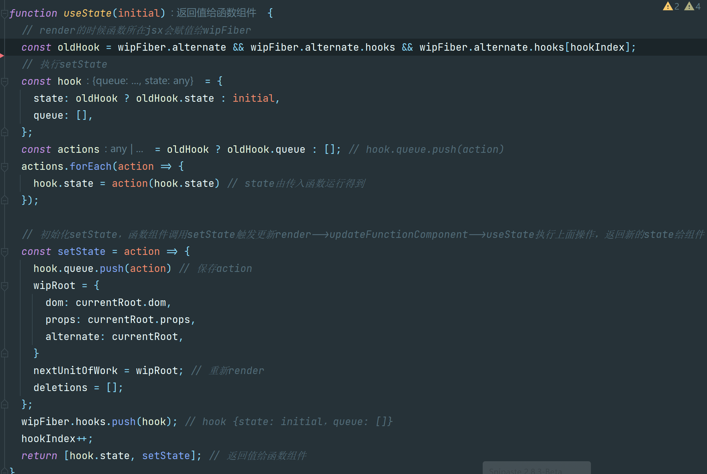
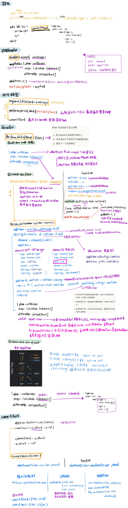

`setState` 更新流程

`setState` 改变 `state`，把传入 `setState` 的函数保存在当前 `fiber` 节点的 `hooks` 属性，从头开始重新 `render`，到函数组件，重新调用 `useState`，返回最新值，函数组件返回的 `JSX` 也更新到最新值，`commit`，渲染到页面



## 零: 概览

渲染 `JSX` 通过构建工具 `Babel` 转换成 `JS`，将标签中的代码替换成调用 `createElement`，把标签名、属性和子节点作为参数传入 `React.createElement` 验证入参并生成了一个对象。c

```jsx
// jsx
const element = <h1 title="foo">Hello</h1>
const container = document.getElementById("root")
ReactDOM.render(element, container)

//  Babel 转换成 JS，浏览器可以处理JS
const element = React.createElement(
  "h1",
  { title: "foo" },
  "Hello"
)
const element = {
  type: "h1",
  props: {
    title: "foo",
    children: "Hello", // 一般情况下，是一个由元素组成的数组。由此 element 的结构形成了一个树
  },
}

// 上面的jsx效果和下面一样，浏览器执行代码生成真实DOM
const container = document.getElementById("root")

const node = document.createElement(element.type)
node["title"] = element.props.title

const text = document.createTextNode("")
text["nodeValue"] = element.props.children

node.appendChild(text)
container.appendChild(node)
```

## Step I: The `createElement` Function

```jsx
// 这样注释一下，babel 会将 JSX 编译成我们需要的函数
/** @jsx Didact.createElement */
const element = (
  <div id="foo">
    <a>bar</a>
    <b />
  </div>
)
const container = document.getElementById("root")
ReactDOM.render(element, container)

// 上面等价于
const element = Didact.createElement(
  "div",
  { id: "foo" },
  Didact.createElement("a", null, "bar"),
  Didact.createElement("b")
)

// createElement实现
function createElement(type, props, ...children) {
  return {
    type,
    props: {
      ...props,
      // children 数组中也可能有像 strings、numbers 这样的基本值
      children: children.map(child =>
        typeof child === "object"
          ? child
          : createTextElement(child)
      ),
    },
  }
}
function createTextElement(text) {
  return {
    type: "TEXT_ELEMENT",
    props: {
      nodeValue: text,
      children: [],
    },
  }
}

// Didact 作为我们自己写的库名.
const Didact = {
  createElement,
}
```

## Step II: The render Function

暂时只关心如何在 `DOM` 上添加东西，之后再考虑 更新 和 删除，递归调用每个子组件

```jsx
function render(element, container) {
  // 当 element 类型是 TEXT_ELEMENT 的时候我们创建一个 text 节点而不是普通的节点
  const dom =
    element.type == "TEXT_ELEMENT"
      ? document.createTextNode("")
      : document.createElement(element.type)
  // 把 element 的属性赋值给 node
  const isProperty = key => key !== "children"
  Object.keys(element.props)
    .filter(isProperty)
    .forEach(name => {
      dom[name] = element.props[name]
    })
  // 对每一个子节点递归地做相同的处理
  element.props.children.forEach(child =>
    render(child, dom)
  )
  container.appendChild(dom)
}

const Didact = {
  createElement,
  render,
}
```

## Step III: Concurrent Mode——改造render递归

改造递归构建整颗 `DOM`树，**将渲染工作分成几个小部分，在完成每个单元后，如果需要执行其他操作，浏览器可以中断渲染。**

```js
// 通过fiber改造递归 —— fiber保存dom节点信息和操作信息
function render(element, container) {
  // 初次执行 performUnitOfWork 传入的 nextUnitOfWork
  nextUnitOfWork = {
    dom: container,
    props: {
      children: [element],
    },
  }
}

// requestIdleCallback可以类比成 setTimeout，浏览器来决定什么时候运行回调函数，而不是 settimeout 里通过我们指定的一个时间
requestIdleCallback(workLoop);

function workLoop(deadline) {
  let shouldYield = false
  while (nextUnitOfWork && !shouldYield) { // 当前帧还有剩余时间
    // 完成传入的任务并返回下一个任务，下一个任务在下一次执行，这样就可以不断遍历任务 
    nextUnitOfWork = performUnitOfWork(
      nextUnitOfWork
    )
    // timeRemaining获取到当前帧剩余时间
    shouldYield = deadline.timeRemaining() < 1
  }
  requestIdleCallback(workLoop)
}
```

`render` 创建`nextUnitOfWork`(根 `fiber`)，将其设为 `performUnitOfWork` 第一个任务单元，剩下的任务单元会通过 `performUnitOfWork` 函数完成并返回。

`performUnitOfWork `在 `workLoop` 内，`requestIdleCallback(workLoop)`，当浏览器有空闲时，会调用 `workLoop`。

## Step IV: Fibers——`performUnitOfWork`

为了组织各个工作单元，我们需要一个数据结构：`fiber tree`。

我们将为每一个 `element` (`JSX` 生成的对象)分配一个 `fiber`，而每个 `element` 将成为一个工作单元。

- 之前：`JSX` `Babel` `element` 递归调用生成 `DOM`

- 现在：`JSX` `Babel` `element`  `fiber`  浏览器根据`fiber` 生成 `DOM`

在 `render` 函数中我们将会创建 `root fiber`，将其设置为 `nextUnitOfWork`。剩下的工作将在 `performUnitOfWork` 中进行，在那里我们将为每个 `fiber` 做三件事：

1. 将 `element` 添加至 `DOM`
2. 为 `element` 的 `children` 创建 `fiber`
3. 选出下一个工作单元
   - 有 `child` ， `child` 是下一个工作单元。
   - 没有 `child` ，把这个 ``element` ` 的兄弟姐妹节点当作是下一个工作单元。
   - 如果该 fiber 既没有 `child` 也没有 `sibling` ，寻找它的「叔叔节点」：其`parent`的 `sibling` 。就像这个例子中的 `a` 和 `h2` 。


```jsx
Didact.render(
  <div>
    <h1>
      <p />
      <a />
    </h1>
    <h2 />
  </div>,
  container
)

function performUnitOfWork(fiber) {
  /*element（通过 createElement创建的 react element）
  DOM node（最终生成对应的 DOM 节点）
  fiber node（从element 到 DOM 节点的中间产物，用于时间切片）*/

  // 1 add dom node
  if (!fiber.dom) {
    fiber.dom = createDom(fiber);
  }
  if (fiber.parent) {
    fiber.parent.dom.appendChild(fiber.dom);
  }

  // 2 create new fibers 为每一个chid创建一个新的 fiber
  const elements = fiber.props.children
  let index = 0
  let prevSibling = null

  while (index < elements.length) {
    const element = elements[index]
    const newFiber = {
      type: element.type,
      props: element.props,
      parent: fiber,
      dom: null,
    }
    // 根据是否是第一个子节点，来设置父节点的 child 属性的指向，或者上一个节点的 sibling 属性的指向
    if (index === 0) {
      fiber.child = newFiber
    } else {
      prevSibling.sibling = newFiber
    }
    prevSibling = newFiber
    index++
  }

  // 3 return next unit of work
  // 找到下一个工作单元。 先试试 child 节点，再试试 sibling 节点，再试试 uncle 节点
  if (fiber.child) {
    return fiber.child
  }
  let nextFiber = fiber
  while (nextFiber) {
    if (nextFiber.sibling) {
      return nextFiber.sibling
    }
    nextFiber = nextFiber.parent
  }
}
```

## Step V: Render and Commit Phases

每当我们在处理一个 React element 时，我们都会添加一个新的节点到 DOM 中，而浏览器在渲染完成整个树之前可能会中断我们的工作。在这种情况下，用户将会看不到完整的 UI。

```js
// 在完成整棵树的渲染前，浏览器还要中途阻断这个过程。 那么用户就有可能看到渲染未完全的 UI
function performUnitOfWork(fiber) {
  if (fiber.parent) {
    fiber.parent.dom.appendChild(fiber.dom)
  }
}
```

把修改 `DOM` 这部分内容记录在 `fiber tree` 上，通过追踪这颗树来收集所有 `DOM` 节点的修改。

`commit`：根据 `Fiber` 添加节点到 `DOM`。

```js
function render(element, container) {
  wipRoot = {
    dom: container,
    props: {
      children: [element],
    },
  }
  nextUnitOfWork = wipRoot
}

let nextUnitOfWork = null
let wipRoot = null

function workLoop(deadline) {
 // next unit of work 为 undefined，把整颗树的变更提交（commit）到实际的 DOM 上
  if (!nextUnitOfWork && wipRoot) {
    commitRoot()
  }
}

function commitRoot() {
  commitWork(wipRoot.child)
  wipRoot = null
}

function commitWork(fiber) {
  if (!fiber) {
    return
  }
  const domParent = fiber.parent.dom
  domParent.appendChild(fiber.dom)
  commitWork(fiber.child)
  commitWork(fiber.sibling)
}
```

## Step VI: Reconciliation

将在 `render` 函数上接收到的 `elements` 与我们提交给 `DOM` 的最后一棵 `Fiber Tree` 进行比较。

**保存当前渲染的 `Fiber Tree`**

```js
let currentRoot = null

function commitRoot() {
  commitWork(wipRoot.child)
  currentRoot = wipRoot // 渲染染完，渲染树变成当下页面展示的树
  wipRoot = null
}

function render(element, container) {
  wipRoot = {
    dom: container,
    props: {
      children: [element],
    },
    alternate: currentRoot, // 用于记录旧 fiber 节点（上一个 commit 阶段使用的 fiber 节点）的引用
  }
  nextUnitOfWork = wipRoot
}

```

**把 `performUnitOfWork` 中用来创建新 Fiber 的部分代码抽离成一个新的 `reconcileChildren` 函数。**

使用 `type` 属性对它们进行比较：

- 如果老的 `Fiber` 和新的 `element` 拥有相同的 `type`，我们可以保留 `DOM` 节点并仅使用新的 `Props` 进行更新。这里我们会创建一个新的 `Fiber` 来使 `DOM` 节点与旧的 `Fiber` 保持一致，而 `props` 与新的 `element` 保持一致。

   - 我们还向 `Fiber` 中添加了一个新的属性 `effectTag` ，这里的值为 `UPDATE` 。为稍后我们将在 `commit` 阶段使用这个属性。

- 如果两者的 `type` 不一样并且有一个新的 `element`，这意味着我们需要创建一个新的 `DOM` 节点。

   - 在这种情况下，我们会用 `PLACEMENT` 来标记新的 `Fiber`。

- 如果两者的 `type` 不一样，并且有一个旧的 `Fiber`，我们需要删除旧节点。

   - 在这种情况下，我们没有新的 `Fiber`，所以我们会把 `DELETION` 添加到旧 `Fiber` 中。

```js
// 对于新旧 element 的处理
const sameType = oldFiber && element && element.type == oldFiber.type

if (sameType) {
    newFiber = {
        type: oldFiber.type,
        props: element.props,
        dom: oldFiber.dom,
        parent: wipFiber,
        alternate: oldFiber,
        effectTag: "UPDATE",
    };
}
if (element && !sameType) {
    newFiber = {
        type: element.type,
        props: element.props,
        dom: null,
        parent: wipFiber,
        alternate: null,
        effectTag: "PLACEMENT",
    }
}
if (oldFiber && !sameType) {
    oldFiber.effectTag = "DELETION"
    deletions.push(oldFiber) // 这里使用了一个数组来追踪我们想要删除的 node
}
```

**变更 `commitWork` 以处理不同类型的变化**

- `PLACEMENT` ：这个 `DOM` 节点添加到父 `Fiber`  的节点上

- `DELETION`：删除这个 `child`

- `UPDATE` ：使用最新的 `props` 来更新现有的 `DOM` 节点
- 这部分动作将有 `updateDOM` 函数来完成：我们将旧 `Fiber` 的 `props`  与 新 `Fiber` 的 `props` 可进行比较，删除旧的 `props`，并设置新的或者变更之后的 `props`。
   - 针对 `event listener` 这种特殊的 `prop`，我们将以不同的方式处理：如果 `event listener` 发生了变更我们会把它从 `node` 中移除，然后设置一个新的 `event listener`。

```js
function commitWork(fiber) {
if (!fiber) {
    return
  }
  const domParent = fiber.parent.dom
  if (
    fiber.effectTag === "PLACEMENT" &&
    fiber.dom != null
  ) {
    domParent.appendChild(fiber.dom)
  } else if (
    fiber.effectTag === "UPDATE" &&
    fiber.dom != null
  ) {
    updateDom(
      fiber.dom,
      fiber.alternate.props,
      fiber.props
    )
  } else if (fiber.effectTag === "DELETION") {
    domParent.removeChild(fiber.dom)
  }

  commitWork(fiber.child)
  commitWork(fiber.sibling)
}
```

## Step VII: Function Components

支持函数组件，函数组件的不同点在于：

- 函数组件的 `fiber` 没有 `DOM` 节点
- 并且子节点由函数运行得来而不是直接从 `props` 属性中获取

```jsx
/** @jsx Didact.createElement */
function App(props) {
  return <h1>Hi {props.name}</h1>
}
const element = <App name="foo" />
const container = document.getElementById("root")
Didact.render(element, container)

function App(props) {
  return Didact.createElement(
    "h1",
    null,
    "Hi ",
    props.name
  )
}
const element = Didact.createElement(App, {
  name: "foo",
})
```

检查 `fiber.type` 是否是 `function` ，根据不同的结果来使用不同的更新函数。

```js
function performUnitOfWork(fiber) {
  const isFunctionComponent =
    fiber.type instanceof Function
  if (isFunctionComponent) {
    updateFunctionComponent(fiber)
  } else {
    updateHostComponent(fiber)
  }
}

function updateFunctionComponent(fiber) {
  const children = [fiber.type(fiber.props)]
  reconcileChildren(fiber, children)
}
```

需要修改 `commitWork` 函数， `fiber` 没有 `DOM` 

1. 修改寻找 `DOM` 父节点的逻辑：顺着 `Fiber Tree` 向上找直到找到有 `DOM node` 的 `Fiber`。

2. 当删除节点是，我们也需要向下寻找知道找到有  `child` 的 `DOM node`。

```js
function commitWork(fiber) {
  let domParentFiber = fiber.parent
  while (!domParentFiber.dom) {
    domParentFiber = domParentFiber.parent
  }
  const domParent = domParentFiber.dom
}

function commitDeletion(fiber, domParent) {
  if (fiber.dom) {
    domParent.removeChild(fiber.dom)
  } else {
    commitDeletion(fiber.child, domParent)
  }
}
```

## Step VIII: Hooks

```jsx
/** @jsx Didact.createElement */
function Counter() {
  const [state, setState] = Didact.useState(1)
  return (
    <h1 onClick={() => setState(c => c + 1)}>
      Count: {state}
    </h1>
  )
}
const element = <Counter />
const container = document.getElementById("root")
Didact.render(element, container)
```

在对应的 fiber 上加上 `hooks` 数组以支持我们在同一个函数组件中多次调用 `useState`

```js
let wipFiber = null
let hookIndex = null

function updateFunctionComponent(fiber) {
  wipFiber = fiber
  hookIndex = 0 // 重置hookIndex
  wipFiber.hooks = []
  const children = [fiber.type(fiber.props)]
  reconcileChildren(fiber, children)
}


```

`useState` 内部逻辑

每当 `Function Component` 调用 `useState` 时，会检查是否有旧的 `hook`。我们使用 `hook` 的索引在 `fiber` 的 `alternate` 属性中进行查询。

如果存在旧的 `hook`，那么我们将 `state` 从旧 `hook` 中复制到新的 `hook`；否则我们将初始化 `state`。

然后我们将向 `Fiber` 添加新的 `hook`，同时索引也递增加1，并返回状态。

`useState` 还应该返回一个用于更新 state 的函数。因此我们定义了一个 `setState` 函数，该函数接受变更 `state` 的动作。

我们将这些动作添加添加至我们给 `hook` 对应的队列中。

接下来的操作与我们在 `render` 函数中所做的类似，将新的工作进行中的 `root` 设置为下一个工作单元，以便 `work loop` 可以开始新的渲染阶段。

对于存储在 `hook.queue` 中的 `actions`，我们将在下一次渲染该组件时进行执行。

首先从旧 `hook` 中拿到所有 `actions`，并将它们逐个应用到新 `hook` 中的 `state` 中。所以当我们返回 `state` 时，该 `state` 已经被更新了。

```js
function useState(initial) {
  const oldHook = wipFiber.alternate && wipFiber.alternate.hooks && wipFiber.alternate.hooks[hookIndex];

  const hook = {
    state: oldHook ? oldHook.state : initial,
    queue: [],
  };
  const actions = oldHook ? oldHook.queue : [];
  actions.forEach(action => {
    hook.state = action(hook.state)
  });
  const setState = action => {
    hook.queue.push(action)
    wipRoot = {
      dom: currentRoot.dom,
      props: currentRoot.props,
      alternate: currentRoot,
    }
    nextUnitOfWork = wipRoot;
    deletions = [];
  };

  wipFiber.hooks.push(hook);
  hookIndex++;
  return [hook.state, setState];
}
```


