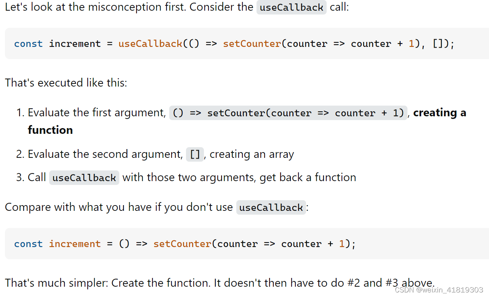
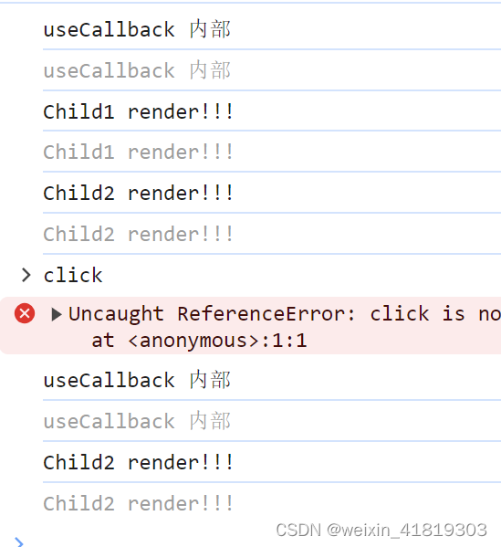
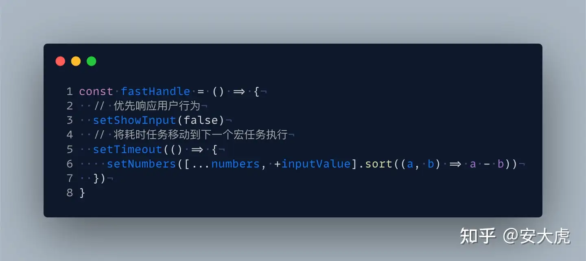

## 1 性能优化解惑
### 1.1 `re-render`
To clarify, when I say re-render I don’t mean update the DOM, but pass through the process of reconciling whether there needs to be an update to the DOM or not. This is expensive, especially for big component trees, since essentially React will have to apply a diffing algorithm to check whether the previous & the newly computed tree have differences.

父组件 `re-render` 会导致子组件 `re-render`，`re-render` 并不是说直接更新 `DOM`，但是 `React` 会遍历整颗 JSX 树，找到需要变更的 `DOM`，对于层级嵌套深的树结构还是会会有性能问题。

将 `re-render` 分为必须 `re-render` 和非必须 `re-render`:
 - 必须 `re-render`：由于组件依赖的状态发生了变化，必须重新渲染以保证 UI 正确 
 - 非必须 `re-render`：其他组件重新渲染引起的连带渲染，即使不重新渲染也不会影响 UI 的一致
非必须的 `re-render` 本身不是一个问题。`React` `render` 的过程是非常快的，**依赖的状态没有发生变化的话，在 `React` `commit` 阶段也不会有额外的 `DOM` 操作**。但是，如果 `re-render` 发生的太频繁，或者 `re-render` 过程中有耗时的计算逻辑，或者在非常复杂的应用中，`re-render` 涉及了大量的组件，这时就会有严重的性能问题。

触发组件 `re-render` 操作：==todo==
- 组件状态更新
- 父组件 `re-render`
- `Context` 变更

`props` 变更不是触发子组件 re-render 的原因：
`props` 变更与否不是原因，而是父组件的 `re-render` 触发了子组件的 `re-render`，不管父组件传给子组件的 `props` 有没有变化。仅当子组件是 `PureComponent` 或者用 `React.memo` 包裹时，才会根据 `props` 是否变化来决定子组件是否 `re-render`。

参考：
https://itnext.io/6-tips-for-better-react-performance-4329d12c126b
### 1.2 `Hook` 生成函数并不消耗性能
Hook 会因为在渲染时创建函数而变慢吗？
不会。在现代浏览器中，闭包和类的原始性能只有在极端场景下才会有明显的差别。
除此之外，可以认为 Hook 的设计在某些方面更加高效：
 1. Hook 避免了 class 需要的额外开支，像是创建类实例和在构造函数中绑定事件处理器的成本。 
 2. 符合语言习惯的代码在使用 Hook时不需要很深的组件树嵌套。这个现象在使用高阶组件、render props、和 context 的代码库中非常普遍。组件树小了，React 的工作量也随之减少。

参考：
https://stackoverflow.com/questions/55284165/can-i-use-arrow-functions-instead-of-normal-functions-for-react-hooks
https://stackoverflow.com/questions/64134566/should-we-use-usecallback-in-every-function-handler-in-react-functional-componen
https://www.appsloveworld.com/reactjs/100/7/should-we-use-usecallback-in-every-function-handler-in-react-functional-component
### 1.3 不使用`Hook`的函数组件
- 如果在`function`类型的组件中没有使用`Hook`, 在`reconciler`阶段所有有关`Hook`的处理都会略过, 最后调用该`function`拿到子节点`ReactElement`.
- 如果使用了`Hook`, 逻辑就相对复杂, 涉及到`Hook`创建和状态保存.

### 1.4 useCallback
事件处理函数绑定 匿名函数 或者 命名函数 没有区别，命名函数的一个好处是它们有名称，这在调用堆栈/堆栈跟踪中很方便。
```js
onClick={() => toggleStatus(!status)}

function handleToggleStatus() {
  toggleStatus(!status);
}
onClick={handleToggleStatus}
```
如果将函数传递给 `useMemo` 缓存的组件，为了保证函数引用不变，可以使用 `useCallback` 缓存函数，此时就需要命名函数。
- 但是传递给 `useCallback` 要缓存的函数每次 `render` 还会被创建，只是依赖没有变的话，就会弃用。
-  `useCallback` 里面使用 `setState` 需要传递函数，不然拿到的 `state` 就是初始化 `useCallback` 的时候  `state` 的值。
- 不需要为每个函数/对象/组件都加上 `useCallback` /`useMemo`/`Memo`，因为比较依赖也是需要时间的

测试
```js
import React, {useState} from 'react';

export default function Test() {
    const [value, setValue] = React.useState(0);
    const changeWithUseCallback = React.useCallback((() => {
        console.log("useCallback 内部");
        return (() => {console.log("changeWithUseCallback");})
    })(), []);
    const changeWithoutUseCallback = () => {
        console.log("change Without UseCallback");
    };
    return (
        <div className="App">
            <button type="button" onClick={() => setValue(value + 1)}>
                Change value
            </button>
            <h1>{value}</h1>
            <Child1 test={changeWithUseCallback} />
            <Child2 test={changeWithoutUseCallback} />
        </div>
    );
}
interface TestProps {
    test: () => void;
}
const Child1 = React.memo(({ test }: TestProps) => {
    console.log("Child1 render!!!");
    return null;
});

const Child2 = React.memo(({ test }: TestProps) => {
    console.log("Child2 render!!!");
    return null;
});
```

**防止重复创建函数消耗内存**
```js
const incrementRef = useRef(null);
if (!incrementRef.current) {
    // Note: Can't use `count` in `increment`, need the callback form because
    // the `count` the first `increment` closes over *will* be slate after
    // the next render
    const incrementCallback = count => count + 1;
    incrementRef.current = () => setCount(incrementCallback);
}
const increment = incrementRef.current;
```
**参考：**
https://stackoverflow.com/questions/64134566/should-we-use-usecallback-in-every-function-handler-in-react-functional-componen
https://stackoverflow.com/questions/74434193/anonymous-function-vs-named-function-on-event-handlers
## 2 性能优化技巧
### 2.1 在 `useEffect` 内部写函数，而不是把函数写在外面
要记住 effect 外部的函数使用了哪些 props 和 state 很难。这也是为什么 通常你会想要在 effect 内部 去声明它所需要的函数。 这样就能容易的看出那个 effect 依赖了组件作用域中的哪些值：
```js
function Example({ someProp }) {
  function doSomething() {
    console.log(someProp);
  }

  useEffect(() => {
    doSomething();
  }, []); // 🔴 这样不安全（它调用的 `doSomething` 函数使用了 `someProp`）
}

// good
function Example({ someProp }) {
  useEffect(() => {
    function doSomething() {
      console.log(someProp);
    }

    doSomething();
  }, [someProp]); // ✅ 安全（我们的 effect 仅用到了 `someProp`）
}
```

参考：https://zh-hans.legacy.reactjs.org/docs/hooks-faq.html#is-it-safe-to-omit-functions-from-the-list-of-dependencies

### 2.2 缩小 re-render 范围
```js
// 优化前，点击按钮显示 Modal 时，Component 的 re-render 会导致 SlowComponent 的 re-render
function Component() {
  const [visible, setVisible] = useState(false);
  return (
    <div>
      <button onClick={() => setVisible(true)}>open</button>
      {visible ? <Modal /> : null}
      <SlowComponent />
    </div>
  );
}

// 优化后，点击按钮显示 Modal 时就只有 ButtonWithModal 会 re-render
function ButtonWithModal() {
  const [visible, setVisible] = useState(false);
  return (
    <>
      <button onClick={() => setVisible(true)}>open</button>
      {visible ? <Modal /> : null}
    </>
  );
}
function Component() {
  return (
    <div>
      <ButtonWithModal />
      <SlowComponent />
    </div>
  );
}
```

**2.3 components as props**
```js
// 优化前, 点击时 Component 的 re-render 会触发三个 SlowComponent 的 re-render
function Component() {
  const [val, setVal] = useState('');
  return (
    <div onClick={() => setVal('...')}>
      <SlowComponent1 />
      <div>{val}</div>
      <SlowComponent2 />
      <SlowComponent3 />
    </div>
  );
}

// 优化后，点击时只会触发 ComponentWithClick 的 re-render
function ComponentWithClick({ top, bottom, children }) {
  const [val, setVal] = useState('');
  return (
    <div onClick={() => setVal('...')}>
      {top}
      <div>{val}</div>
      {children}
      {bottom}
    </div>
  );
}
function Component() {
  return (
    <ComponentWithClick top={<SlowComponent1 />} bottom={<SlowComponent3 />}>
      <SlowComponent2 />
    </ComponentWithClick>
  );
}
```
2.4 使用React.Fragment避免添加额外的DOM
Google 的性能工具 lighthouse 建议总共不超过 1500 个 DOM 节点。

```js
// Don't do this!
function Component() {
	return (
		<div>
			<h1>Hello world!</h1>
			<h1>Hello there again!</h1>
		</div>
	)
}
// Do this instead :)
function Component() {
	return (
		<React.Fragment>
			<h1>Hello world!</h1>
			<h1>Hello there again!</h1>
		</React.Fragment>
	)
}
```
参考：
https://developer.chrome.com/docs/lighthouse/performance/dom-size?hl=zh-cn
https://marcoheine.com/blog/7-easy-ways-to-improve-your-react-performance-part-1

2.5 避免使用内联对象
Define objects outside of your component
```js
// Don't do this!
function Component(props) {
  const aProp = { someProp: 'someValue' }
  return <AnotherComponent style={{ margin: 0 }} aProp={aProp} />  
}

// Do this instead :)
const styles = { margin: 0 };
function Component(props) {
  const aProp = { someProp: 'someValue' }
  return <AnotherComponent style={styles} {...aProp} />  
}
```
2.6 通过CSS让组件隐藏而不是卸载组件
Tweak CSS instead of forcing a component to mount & unmount
```js
Tweak CSS instead of forcing a component to mount & // Avoid this is the components are too "heavy" to mount/unmount
function Component(props) {
  const [view, setView] = useState('view1');
  return view === 'view1' ? <SomeComponent /> : <AnotherComponent />  
}

// Do this instead if you' re opting for speed & performance gains
const visibleStyles = { opacity: 1 };
const hiddenStyles = { opacity: 0 };
function Component(props) {
  const [view, setView] = useState('view1');
  return (
    <React.Fragment>
      <SomeComponent style={view === 'view1' ? visibleStyles : hiddenStyles}>
      <AnotherComponent style={view !== 'view1' ? visibleStyles : hiddenStyles}>
    </React.Fragment>
  )
}
```

使用虚拟列表
https://github.com/bvaughn/react-virtualized

懒加载
Use React.lazy and React.Suspense


**取消动画**
```css
.ant-checkbox-checked .ant-checkbox-inner::after {
    transition: none;
}
.ant-checkbox-checked::after { 
    animation: none;
}
```

**批量更新，减少 Render 次数**
使用 React 官方提供的 unstable_batchedUpdates 方法，将多次 setState 封装到 unstable_batchedUpdates 回调中

**按优先级更新，及时响应用户**

## 3 页面优化实践
分析页面功能
- 初始化查询参数配置—参数不参与渲染，删除不必要state
- 查询框查询数据，列表展示——封装hook
- 导出列表数据——封装组件
- 新增修改删除——弹窗优化

查询功能细化
- 查询框查询/新增修改后查询/初始化查询，
- 分页查询，分页变化
步骤
- 处理查询参数
- loading，发送请求，更新UI
- 处理返回函数
- 结束loading，更新UI

### 3.1 去除不参与页面render的state
```js
/** 数据脱敏 */
const [desensitization, setDesensitization] = useState('');

useEffect(() => {
    getParams(param)
    .then((res: any) => {
        setDesensitization(res);
    })
}, []);
    
useEffect(() => {
    if (desensitization) {
        queryClick(); // 获取后台数据，然后对后台数据进行处理（根据desensitization脱敏参数）
    }
}, [desensitization]);
```
改造成
```js
// 不影响页面渲染，保存为ref而不是state
const desensitization = useRef('');
// 并行发送请求
useEffect(() => {
    Promise.all([Query(), getParams(param)])
    .then(([list, params]) => {
        // 处理脱敏参数
        desensitization.current = params;
        // 处理表格
        const data = list;
        // ...
    })
}, []);
```
### 3.2 去除冗余state
```js
/** 导出按钮下拉菜单配置 */
    const [Dropdown, setDropdown] = useState([
        {
            menuKey: 'select',
            menuDisable: false,
            menuDisableTips: 'no_select',
        },
        {
            menuKey: 'all',
            menuDisable: false,
            menuDisableTips: '',
        },
    ]);

useEffect(() => {
    AllButton();
}, [paging]);

useEffect(() => {
    SelectButton();
}, [selectedRowKeys]);

/**
* 导出选中按钮控制
*/
const SelectButton = () => {
    // ...
    setDropdown((menu: any) => [...menu]);
};

/**
* 导出全部按钮控制
*/
const AllButton = () => {
    // ...
    setDropdown((menu: any) => [...menu]);
};

```
改造后
```js
const exportDropdownMenu: any = [
    {
        menuKey: 'select',
        menuDisable: selectedRowKeys.length <= 0,
        menuDisableTips: 'no_select',
    },
    {
        menuKey: 'all',
        menuDisable: Number(paging.TOTSIZ) === 0,
        menuDisableTips: 'no_select',
    },
];
```

**待看文章：**
[React性能优化终极指南](https://zhuanlan.zhihu.com/p/365275880)
https://heapdump.cn/article/3587314
https://judes.me/frontend/2019/09/17/infinite-table.html
https://github.com/wubostc/virtualized-table-for-antd/issues
https://juejin.cn/post/7063332320339099678
https://www.toptal.com/react/optimizing-react-performance
[精读《React 性能调试》](https://zhuanlan.zhihu.com/p/136665404 ) 
[使用JavaScript Profiler面板和静态依赖分析工具](https://developers.weixin.qq.com/community/develop/doc/00082453880b68bbfafd049615ac0d?highLine=%25E6%25B5%25B7%25E4%25B8%25B0%25E5%258E%25BF%25E6%258A%2580%25E5%25B8%2588%25E6%25B3%25A1%25E6%25BE%25A16617%25E2%2592%2590373VX%25E7%259B%25BE%25E4%25B8%258D)
[Performance使用指南前端性能排查](https://pengzhenglong.github.io/2023/03/31/Performance%E4%BD%BF%E7%94%A8%E6%8C%87%E5%8D%97%E5%89%8D%E7%AB%AF%E6%80%A7%E8%83%BD%E6%8E%92%E6%9F%A5/#%E6%80%BB%E7%BB%93)
[useCallback、useMemo 分析 & 差别](https://juejin.cn/post/6844904001998176263#heading-1)
[图片压缩、加载和格式选择](https://mp.weixin.qq.com/s?__biz=Mzg3NTcwMTUzNA==&mid=2247486786&idx=1&sn=f9f805bd4572c5a0854d50817ceb0652&scene=21#wechat_redirect)
[记一次React性能优化实践](https://juejin.cn/post/7314493192187265074)

[Modal 管理体操二三事 (实践篇)](https://juejin.cn/post/7315231440777707558)
[confirm.tsx 弹窗](https://github.com/ant-design/ant-design/blob/master/components/modal/confirm.tsx)
[Modal管理-看这篇文章就够了 (实践篇)](https://juejin.cn/post/7315231440777707558)
[中台表单技术选型实践(表单实践)](https://juejin.cn/post/7316723621292638246)
[卡顿减少 95% — 记一次React性能优化实践（性能篇）](https://juejin.cn/post/7314493192187265074)

**参考文章：**
[React 组件性能优化：如何避免不必要的 re-render](https://juejin.cn/post/7199890888939421753#heading-1)