## 1、React理念

### 1.1 快速响应

React 是用 JavaScript 构建**快速响应**的大型 Web 应用程序的首选方式。

浏览网页时，有两类场景会制约`快速响应`：

- 当遇到大计算量的操作或者设备性能不足使页面掉帧，导致卡顿。（CPU的瓶颈）
- 发送网络请求后，由于需要等待数据返回才能进一步操作导致不能快速响应。（IO的瓶颈）

React解决问题

- 解决`CPU瓶颈`的关键是实现`时间切片`（将长任务分拆到每一帧中，一次执行一小段任务的操作），而`时间切片`的关键是：将**同步的更新**变为**可中断的异步更新**。

- 在`网络延迟`客观存在的情况下，通过将人机交互研究的结果整合到真实的 UI 中，减少用户对`网络延迟`的感知。为此，`React`实现了[Suspense](https://zh-hans.reactjs.org/docs/concurrent-mode-suspense.html)功能及配套的`hook`——[useDeferredValue](https://zh-hans.reactjs.org/docs/concurrent-mode-reference.html#usedeferredvalue)。而在源码内部，为了支持这些特性，同样需要将**同步的更新**变为**可中断的异步更新**。


**todo**

[React理念 (opens new window)](https://zh-hans.reactjs.org/docs/thinking-in-react.html)

[将人机交互研究的结果整合到真实的 UI 中 (opens new window)](https://zh-hans.reactjs.org/docs/concurrent-mode-intro.html#putting-research-into-production)

[「英文」尤雨溪论JavaScript框架设计哲学：平衡](https://www.bilibili.com/video/BV134411c7Sk?from=search&seid=17404881291635824595)

[「英文 外网」Building a Custom React Renderer | React前经理Sophie Alpert](https://www.youtube.com/watch?v=CGpMlWVcHok&list=PLPxbbTqCLbGHPxZpw4xj_Wwg8-fdNxJRh&index=7)

最早的`Fiber`官方解释来源于[2016年React团队成员Acdlite的一篇介绍 (opens new window)](https://github.com/acdlite/react-fiber-architecture)。

[Lin Clark - A Cartoon Intro to Fiber - React Conf 2017](https://www.bilibili.com/video/BV1it411p7v6?from=search&seid=3508901752524570226)

[贡献流程](https://zh-hans.react.dev/blog/2023/03/16/introducing-react-dev)

在React17中，已经不需要显式导入React了。详见[介绍全新的 JSX 转换](https://zh-hans.reactjs.org/blog/2020/09/22/introducing-the-new-jsx-transform.html)

- [如何干掉知乎的全部DIV -- 通过这篇文章在运行时修改`React.createElement`达到消除页面所有`div`元素的效果(opens new window)](https://mp.weixin.qq.com/s/ICjOlJL-fUGRb2S_xqBT7Q)
- [React官网Blog，关于React Component, Element, Instance, Reconciliation的简介](https://reactjs.org/blog/2015/12/18/react-components-elements-and-instances.html)

摘录自`React`文档[effect 的执行时机 (opens new window)](https://zh-hans.reactjs.org/docs/hooks-reference.html#timing-of-effects)：

### 1.2  React15架构

React15架构可以分为两层：

- Reconciler（协调器）—— 负责找出变化的组件

  每当有更新发生时，**Reconciler**会做如下工作：

  - 调用函数组件、或class组件的`render`方法，将返回的JSX转化为虚拟DOM
  - 将虚拟DOM和上次更新时的虚拟DOM对比
  - 通过对比找出本次更新中变化的虚拟DOM
  - 通知**Renderer**将变化的虚拟DOM渲染到页面上

- Renderer（渲染器）—— 负责将变化的组件渲染到页面上

  `React`支持跨平台，不同平台有不同的**Renderer**：

  - [ReactDOM (opens new window)](https://www.npmjs.com/package/react-dom)渲染器，渲染浏览器

  - [ReactNative (opens new window)](https://www.npmjs.com/package/react-native)渲染器，渲染App原生组件
  - [ReactTest (opens new window)](https://www.npmjs.com/package/react-test-renderer)渲染器，渲染出纯Js对象用于测试
  - [ReactArt (opens new window)](https://www.npmjs.com/package/react-art)渲染器，渲染到Canvas, SVG 或 VML (IE8)

在**Reconciler**中，`mount`的组件会调用[mountComponent (opens new window)](https://github.com/facebook/react/blob/15-stable/src/renderers/dom/shared/ReactDOMComponent.js#L498)，`update`的组件会调用[updateComponent (opens new window)](https://github.com/facebook/react/blob/15-stable/src/renderers/dom/shared/ReactDOMComponent.js#L877)，两个方法都会**递归**更新子组件。递归更新不能中途终止，也就是更新不支持异步，就会影响性能。

```js
import React from "react";

export default class App extends React.Component {
  constructor(...props) {
    super(...props);
    this.state = {
      count: 1
    };
  }
  onClick() {
    this.setState({
      count: this.state.count + 1
    });
  }
  render() {
    return (
      <ul>
        <button onClick={() => this.onClick()}>乘以{this.state.count}</button>
        <li>{1 * this.state.count}</li>
        <li>{2 * this.state.count}</li>
        <li>{3 * this.state.count}</li>
      </ul>
    );
  }
}
```

Reconciler和Renderer是交替工作，整个过程都是同步的


如果中途中断更新


### 1.3 React16架构

React16架构可以分为三层：

- Scheduler（调度器）—— 调度任务的优先级，高优任务优先进入**Reconciler**

- Reconciler（协调器）—— 负责找出变化的组件

  更新工作从递归变成了可以中断的循环过程，`Reconciler`内部采用了`Fiber`的架构

- Renderer（渲染器）—— 负责将变化的组件渲染到页面上

红框中的工作都在内存中进行，不会更新页面上的DOM，所以即使反复中断，用户也不会看见更新不完全的DOM

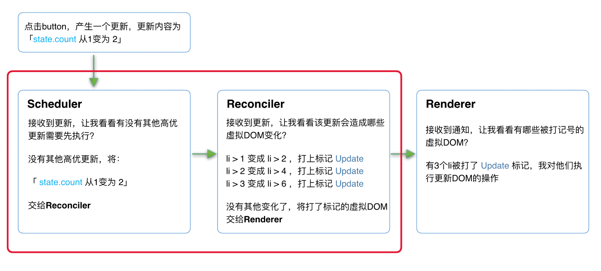

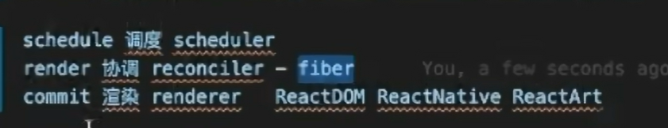

### 1.4 `Fiber`

#### 1.4.1 代数效应

**基本概念**

代数：把数字代进去参与公式计算

代数效应：将程序执行的操作像代数一样，代入到另一块操作中

以实际代码为例，首先设定如下：

- 我们规定用 `perform` 关键词表示此处需要代入效应。代码执行到此处，将程序中断，告诉另一处需要传一个效应回来；
- 另一处接收到请求后，执行所需的逻辑，通过 `resume` 将效应执行的结果返回到中断处，再恢复程序；
- 为了便于捕获 `perform` 请求，我们令代数效应有形似 `try… catch` 的结构，令其为 `try… handle`。这样只要在 `try` 里包裹的代入效应请求，都能被外层接收并处理。

- 实际代数效应比 `try / catch`更复杂，这里只是举例，algebraic effects are much more flexible than `try / catch`, and recoverable errors are just one of many possible use cases

- algebraic effects can be a very powerful instrument to separate the *what* from the *how* in the code


```js
function getName(user) {
  let name = user.name;
  if (name === null) {
  	throw new Error('A girl has no name');
  }
  return name;
}

function makeFriends(user1, user2) {
  user1.friendNames.add(getName(user2));
  user2.friendNames.add(getName(user1));
}

const arya = { name: null };
const gendry = { name: 'Gendry' };
try {
  makeFriends(arya, gendry);
} catch (err) {
  console.log("Oops, that didn't work out: ", err);
}
```

应用代数效应

```js
function getName(user) {
  let name = user.name;
  if (name === null) {
  	// 1. 我们在这里执行效应
  	name = perform 'ask_name';
  	// 4. ...最后回到这里（现在 name 是 'Arya Stark'）了
  }
  return name;
}

// ...

try {
  makeFriends(arya, gendry);
} handle (effect) {
  // 2. 我们进入处理程序（类似 try/catch）
  if (effect === 'ask_name') {
  	// 3. 但是这里我们可以带一个值继续执行（与 try/catch 不同!）
  	resume with 'Arya Stark';
  }
}
```

**代数效应的作用**

```js
// 假设有这样一个需求，从数据库中读取 userName，基本代码如下：
const getUserName = (userId) => doSthToGetUserName(userId);
const main = () => {
  const userName = getUserName(123);
  console.log(userName);
};
```

避免由内而外的层层污染

```js
// 如果是异步环境，即 userName 从网络请求获取，就得用上 async/await：
const getUserName = async (userId) => (await axios.get(`/db/${userId}`)).data;
// async/await 具有传染性。既然 getUserName 是异步函数，调用它的 main 函数也要写成异步的
const main = async () => {
  const userName = await getUserName(123);
  console.log(userName);
};

// 用代数效应改写上面逻辑如下：
const getUserName = (userId) => {
  try {
    perform ({ userId }); // 中断，等待获取 userId
  } handle (effect) {
    // -- 对于同步 ------
    resume localStorage.get(effect.userId); // 立刻恢复

    // -- 对于异步 ------
    axios.get(`/db/${effect.userId}`).then(resp=>{
      resume resp.data; // 请求完成后恢复
    })
  }
};

// main 仍保持原来写法
const main = () => {
  const userName = getUserName(123);
  console.log(userName);
};
```

避免由外而内的层层传递

```js
// 为了灵活性，将 getUserName 作为依赖注入到程序中，从而在不同场景下实现不同的逻辑。
const implGetUserName = (userId) => localStorage.get(userId); // 同步环境将注入的依赖
const implGetUserNameAsync = (userId) => axios.get(`/db/${userId}`); // 异步环境将注入的依赖
// 内层接受注入的依赖
const getUserName = (userId, implGetUserName) => implGetUserName(userId);
// 外层接受注入的依赖，并传递给内层
const main = (implGetUserName) => {
  const userName = getUserName(userId, implGetUserName);
  console.log(userName);
};

// 可以用代数效应改写如下：
const getUserName = (userId) => {
  const userName = perform ({ userId }); // 等待外层的注入依赖执行完回传
  return userName;
};

const main = () => {
  const userName = getUserName(123);
  console.log(userName);
};

// 由于代数效应类似 try…catch 的特性，只要在调用 main 的地方的外层包裹 try…handle 就行
try {
  main();
} handle (effect) {
  // -- 同步时注入的依赖 ------
  resume localStorage.get(effect.userId);

  // -- 异步时注入的依赖 ------
  axios.get(`/db/${effect.userId}`).then(resp=>{
    resume resp.data;
  })
}
```

**React 与代数效应**

- Fiber：代数效应一个特点就是代码的可中断性，React内部实现的一套状态更新机制。支持任务不同优先级，可中断与恢复，并且恢复后可以复用之前的中间状态
-  [`<Suspense />`](https://codesandbox.io/s/frosty-hermann-bztrp?file=/src/index.js:152-160)：当内层任一组件处于 loading 状态，都能触发最外层 `Suspense` 进入 fallback 状态

- hooks
  - useState：函数组件本身并没有能力保存 state 的状态，但每次使用时都能拿到一个 stateful 的值，这就是因为在调用 useState 时进行了中断，将效应抛出给 React，由它获取到 state 值后，代入回组件函数。
  - useContext：从内层组件可以随时获取到最外层的 context value，而无需层层传递。

[参考](https://mongkii.com/blog/2021-05-08-talk-about-algebraic-effects)

#### 1.4.2 Fiber架构的实现原理

`Fiber`包含三层含义：

1. 作为架构来说，之前`React15`的`Reconciler`采用递归的方式执行，数据保存在递归调用栈中，所以被称为`stack Reconciler`。`React16`的`Reconciler`基于`Fiber节点`实现，被称为`Fiber Reconciler`。`Fiber` 代替`React15`不可中断的`虚拟DOM`。

   ```jsx
   function App() {
     return (
       <div>
         i am
         <span>KaSong</span>
       </div>
     )
   }
   ```

   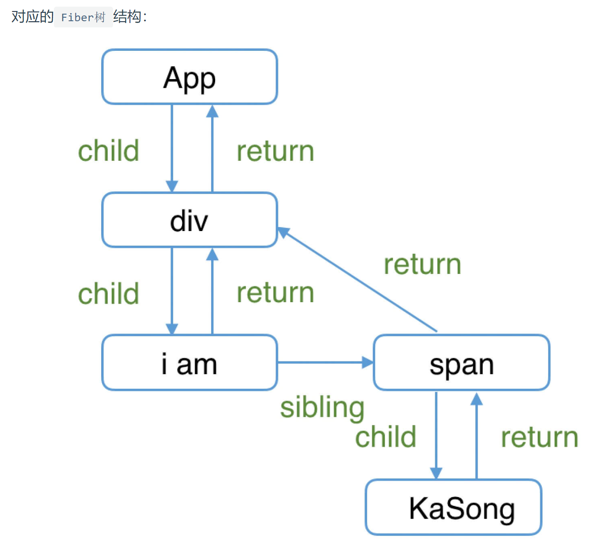

2. 作为静态的数据结构来说，保存了组件相关的信息，**每个`Fiber节点`对应一个`React element`**，保存了该组件的类型（函数组件/类组件/原生组件...）、对应的DOM节点等信息。

3. 作为动态的工作单元来说，每个`Fiber节点`保存了本次更新中该组件改变的状态、要执行的工作（需要被删除/被插入页面中/被更新...）。

#### 1.4.3 Fiber架构的工作原理

**“双缓存”**

- 用`canvas`绘制动画，每一帧绘制前都会调用`ctx.clearRect`清除上一帧的画面。如果当前帧画面计算量比较大，导致清除上一帧画面到绘制当前帧画面之间有较长间隙，就会出现白屏。

- 为了解决这个问题，可以在内存中绘制当前帧动画，绘制完毕后直接用当前帧替换上一帧画面，由于省去了两帧替换间的计算时间，不会出现从白屏到出现画面的闪烁情况。

**双缓存Fiber树**

`React`使用“双缓存”来完成`Fiber树`的构建与替换——对应着`DOM树`的创建与更新。

在`React`中最多会同时存在两棵`Fiber树`：

- 当前屏幕上显示内容对应的`Fiber树`称为`current Fiber树`，其中的`Fiber节点`被称为`current fiber`

- 正在内存中构建的`Fiber树`称为`workInProgress Fiber树`，其中的`Fiber节点`被称为`workInProgress fiber`

- 两棵树通过`alternate`属性连接

  ```js
  currentFiber.alternate === workInProgressFiber;
  workInProgressFiber.alternate === currentFiber;
  ```

`React`应用的根节点通过使`current`指针在不同`Fiber树`的`rootFiber`间切换来完成`current Fiber`树指向的切换

```jsx
function App() {
  const [num, add] = useState(0);
  return (
    <p onClick={() => add(num + 1)}>{num}</p>
  )
}

ReactDOM.render(<App/>, document.getElementById('root'));
```

**mount**

- 首次执行`ReactDOM.render`会创建`fiberRootNode`（源码中叫`fiberRoot`）和`rootFiber`
  - `fiberRootNode`是整个应用的根节点
  - `rootFiber`是`<App/>`所在组件树的根节点
  - `fiberRootNode`的`current`会指向当前页面上已渲染内容对应`Fiber`树，即`current Fiber`树
- 在构建`workInProgress Fiber树`时会尝试复用`current Fiber树`中已有的`Fiber节点`内的属性

<center>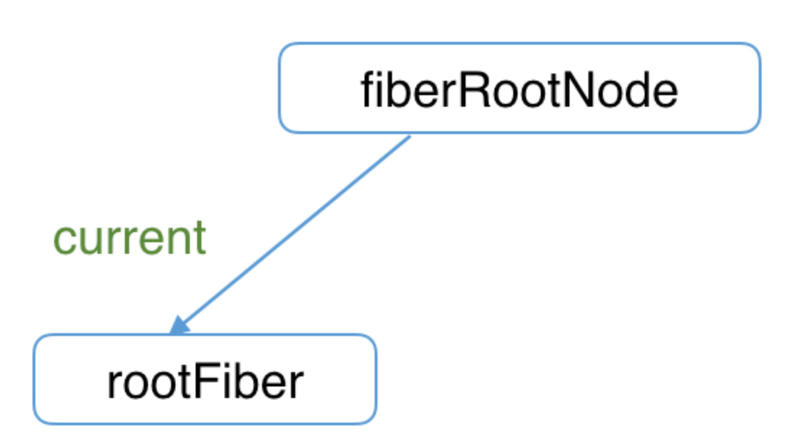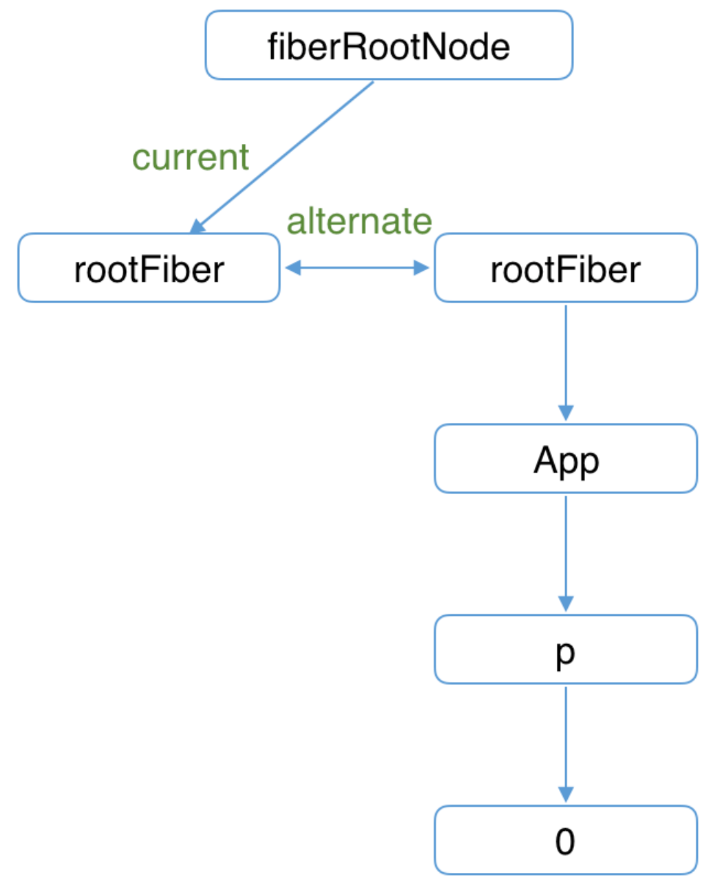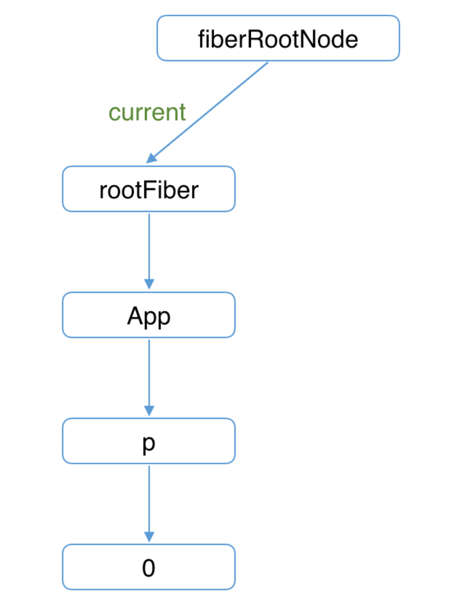</center>

**update**

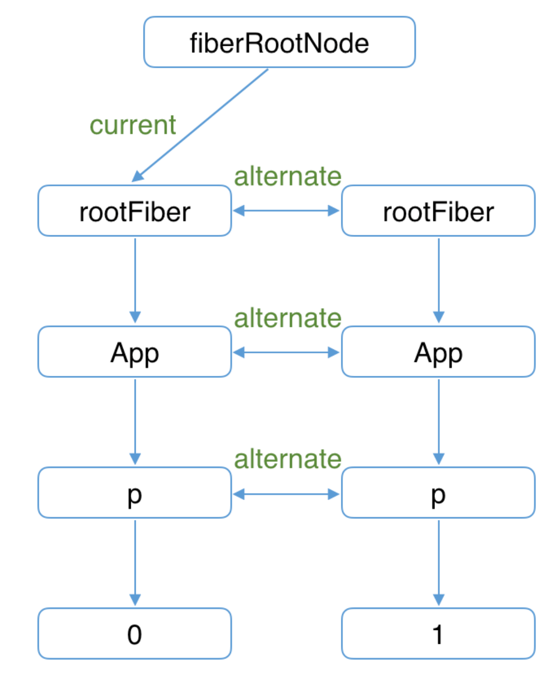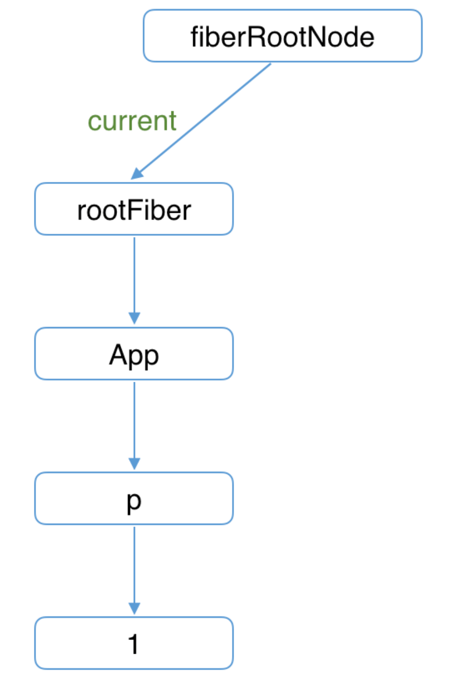

### 1.5 深入理解JSX

`JSX`在编译时会被Babel编译为`React.createElement`方法，这也是为什么在每个使用`JSX`的`JS`文件中，你必须显式的声明，否则在运行时该模块内就会报`未定义变量 React`的错误。

```js
import React from 'react';
```

所有`JSX`在运行时的返回结果（即`React.createElement()`的返回值）都是`React Element`

React通过`ClassComponent`实例原型上的`isReactComponent`变量判断是否是`ClassComponent`

```JSx
class AppClass extends React.Component {
  render() {
    return <p>KaSong</p>
  }
}
console.log('这是ClassComponent：', AppClass);
console.log('这是Element：', <AppClass/>);


function AppFunc() {
  return <p>KaSong</p>;
}
console.log('这是FunctionComponent：', AppFunc);
console.log('这是Element：', <AppFunc/>);
            
AppClass instanceof Function === true;
AppFunc instanceof Function === true;
```

**JSX与Fiber节点**

`JSX`是一种描述当前组件内容的数据结构，不包含组件**schedule**、**reconcile**、**render**所需的相关信息。比如如下信息就不包括在`JSX`中，这些内容都包含在`Fiber节点`中：

- 组件在更新中的`优先级`
- 组件的`state`
- 组件被打上的用于**Renderer**的`标记`

组件`mount`时，`Reconciler`根据`JSX`描述的组件内容生成组件对应的`Fiber节点`。

在`update`时，`Reconciler`将`JSX`与`Fiber节点`保存的数据对比，生成组件对应的`Fiber节点`，并根据对比结果为`Fiber节点`打上`标记`。

## 2、架构篇——render阶段 

`Fiber节点`是如何被创建并构建`Fiber树`

### 2.1 流程概览

`render阶段`开始于`performSyncWorkOnRoot`或`performConcurrentWorkOnRoot`方法的调用。这取决于本次更新是同步更新还是异步更新。

```js
// performSyncWorkOnRoot会调用该方法
function workLoopSync() {
  while (workInProgress !== null) {
    // workInProgress代表当前已创建的workInProgress fiber
    // performUnitOfWork方法会创建下一个Fiber节点并赋值给workInProgress
    // 并将workInProgress与已创建的Fiber节点连接起来构成Fiber树
    performUnitOfWork(workInProgress);
  }
}

// performConcurrentWorkOnRoot会调用该方法
function workLoopConcurrent() {
  // 如果当前浏览器帧没有剩余时间，shouldYield会中止循环，直到浏览器有空闲时间后再继续遍历
  while (workInProgress !== null && !shouldYield()) {
    performUnitOfWork(workInProgress);
  }
}
```

如果将`performUnitOfWork`转化为递归版本（React15），大体代码如下：

```js
function performUnitOfWork(fiber) {
  // 执行beginWork
  if (fiber.child) {
    performUnitOfWork(fiber.child);
  }

  // 执行completeWork
  if (fiber.sibling) {
    performUnitOfWork(fiber.sibling);
  }
}
```

`Fiber Reconciler`是从`Stack Reconciler`重构而来，通过遍历的方式实现可中断的递归，所以`performUnitOfWork`的工作可以分为两部分：“递”和“归”。

- “递”阶段

  1. 首先从`rootFiber`开始向下深度优先遍历。为遍历到的每个`Fiber节点`调用[beginWork方法](https://github.com/facebook/react/blob/970fa122d8188bafa600e9b5214833487fbf1092/packages/react-reconciler/src/ReactFiberBeginWork.new.js#L3058)

  2. 该方法会**根据传入的`Fiber节点`创建`子Fiber节点`，并将这两个`Fiber节点`连接起来**

  3. 当遍历到叶子节点（即没有子组件的组件）时就会进入“归”阶段

- “归”阶段

  1. 在“归”阶段会调用[completeWork](https://github.com/facebook/react/blob/970fa122d8188bafa600e9b5214833487fbf1092/packages/react-reconciler/src/ReactFiberCompleteWork.new.js#L652)处理`Fiber节点`

  2. 当某个`Fiber节点`执行完`completeWork`，如果其存在`兄弟Fiber节点`（即`fiber.sibling !== null`），会进入其`兄弟Fiber`的“递”阶段

  3. 如果不存在`兄弟Fiber`，会进入`父级Fiber`的“归”阶段

- “递”和“归”阶段会交错执行直到“归”到`rootFiber`。至此，`render阶段`的工作就结束了

```jsx
function App() {
  return (
    <div>
      i am
      <span>KaSong</span>
    </div>
  )
}

ReactDOM.render(<App />, document.getElementById("root"));
```

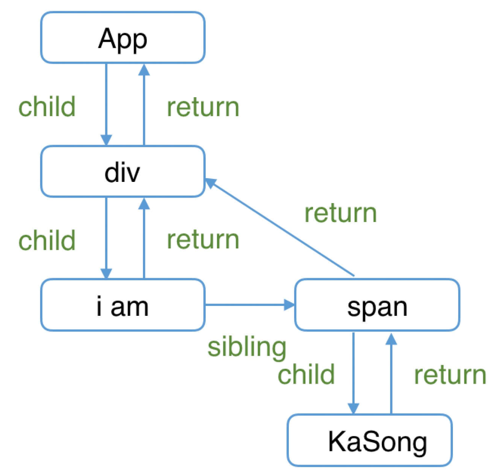

```
// render阶段会依次执行：
1. rootFiber beginWork
2. App Fiber beginWork
3. div Fiber beginWork
4. "i am" Fiber beginWork
5. "i am" Fiber completeWork
6. span Fiber beginWork
7. span Fiber completeWork
8. div Fiber completeWork
9. App Fiber completeWork
10. rootFiber completeWork
```

### 2.2  beginWork
`beginWork`的工作是传入当前`Fiber`节点，**创建子`Fiber`节点**

`beginWork`的工作可以分为两部分：

- `update`时：`oldProps === newProps && workInProgress.type === current.type`，**即`props`与`fiber.type`不变时，可以复用`current`节点**，克隆`current.child`作为`workInProgress.child`，而不需要新建`workInProgress.child`。
- `mount`时：除`fiberRootNode`以外，`current === null`。会根据`fiber.tag`不同，创建不同类型的`子Fiber节点`

**reconcileChildren**——创建新的`子Fiber节点`

- 对于`mount`的组件，创建新的`子Fiber节点`
- 对于`update`的组件，会将当前组件与该组件在上次更新时对应的`Fiber节点`比较（`Diff`算法），将比较的结果生成新`Fiber节点`
- 最终会生成新的子`Fiber节点`并赋值给`workInProgress.child`，作为本次`beginWork`[返回值 ](https://github.com/facebook/react/blob/1fb18e22ae66fdb1dc127347e169e73948778e5a/packages/react-reconciler/src/ReactFiberBeginWork.new.js#L1158)，并作为下次`performUnitOfWork`执行时`workInProgress`的[传参](https://github.com/facebook/react/blob/1fb18e22ae66fdb1dc127347e169e73948778e5a/packages/react-reconciler/src/ReactFiberWorkLoop.new.js#L1702)

```js
export function reconcileChildren(
  current: Fiber | null,
  workInProgress: Fiber,
  nextChildren: any,
  renderLanes: Lanes
) {
  if (current === null) {
    // 对于mount的组件，只有rootFiber（<App/>）会赋值’Placement‘的effectTag，在commit阶段只会执行一次插入操作
    workInProgress.child = mountChildFibers(
      workInProgress,
      null,
      nextChildren,
      renderLanes,
    );
  } else {
    // 对于update的组件，为生成的Fiber节点带上effectTag属性
    workInProgress.child = reconcileChildFibers(
      workInProgress,
      current.child,
      nextChildren,
      renderLanes,
    );
  }
}
```

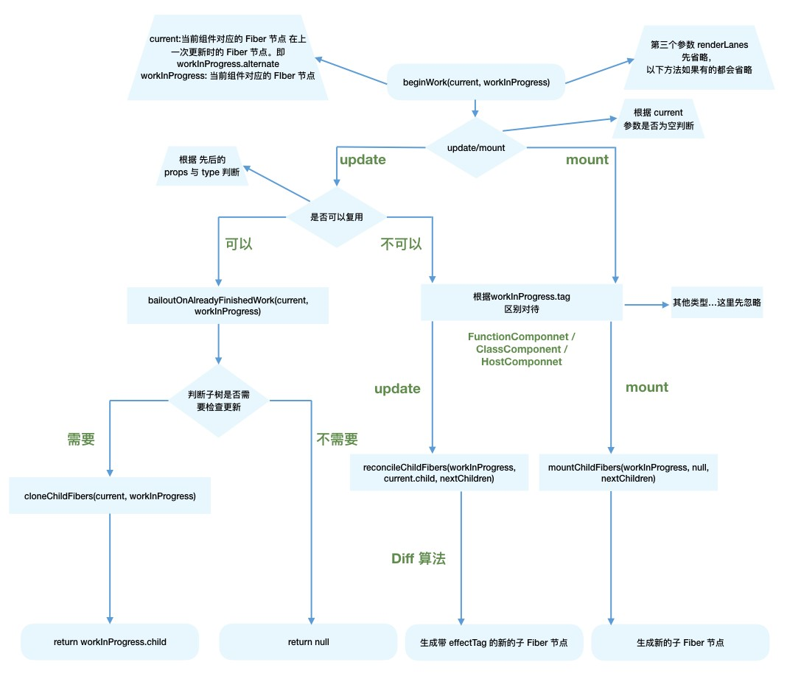

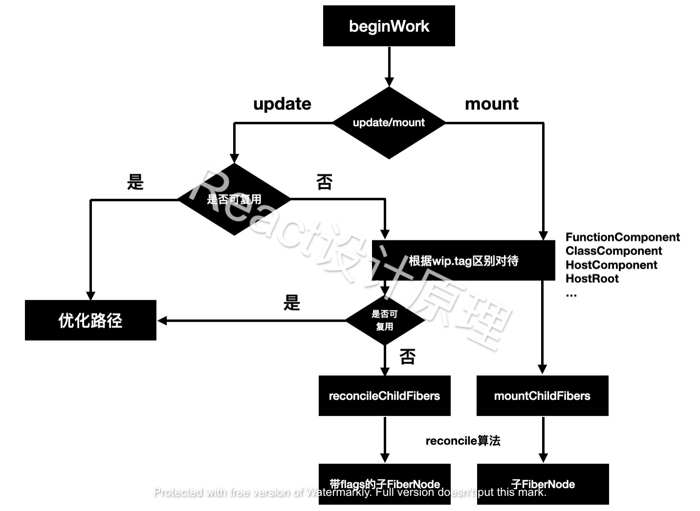

###  2.3 completeWork

**update**

`Fiber节点`已经存在对应`DOM节点`，所以不需要生成`DOM节点`。需要做的主要是处理`props`：

- `onClick`、`onChange`等回调函数的注册
- 处理`style prop`
- 处理`DANGEROUSLY_SET_INNER_HTML prop`
- 处理`children prop`
- 被处理完的`props`会被赋值给`workInProgress.updateQueue`，并最终会在`commit阶段`被渲染在页面上。其中`updatePayload`为数组形式，他的偶数索引的值为变化的`prop key`，奇数索引的值为变化的`prop value`。

**mount**

- 为`Fiber节点`生成对应的`DOM节点`
- 将子孙`DOM节点`插入刚生成的`DOM节点`中（当“归”到`rootFiber`时，已经有一个构建好的离屏`DOM树`，`commit阶段`可以通过一次插入`DOM`操作）
- 与`update`逻辑中类似的处理`props`的过程

在`completeWork`的上层函数`completeUnitOfWork`中，每个执行完`completeWork`且存在`effectTag`的`Fiber节点`会被保存在一条被称为`effectList`的单向链表中。在`commit阶段`只需要遍历`effectList`就能执行所有`effect`。


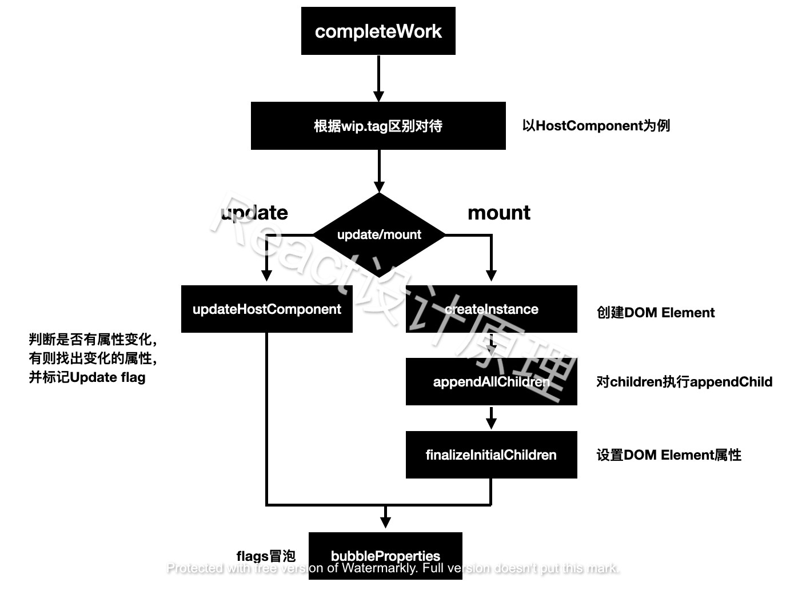

## 3、架构篇——commit阶段 

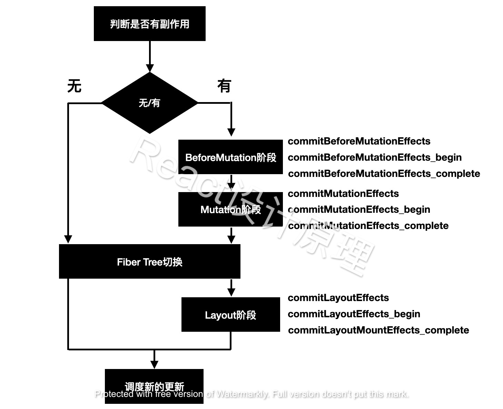

### 3.1 流程概览

`commit`阶段的主要工作（即`Renderer`的工作流程）分为三部分：

- before mutation阶段（执行`DOM`操作前）：变量赋值，状态重置
- mutation阶段（执行`DOM`操作）
- layout阶段（执行`DOM`操作后）：`useEffect`的触发、`优先级相关`的重置、`ref`的绑定/解绑

`before mutation`之前主要做一些变量赋值，状态重置的工作

`layout`阶段执行完后的代码

1. `useEffect`相关的处理。

2. 性能追踪相关。

3. 在`commit`阶段会触发一些生命周期钩子（如 `componentDidXXX`）和`hook`（如`useLayoutEffect`、`useEffect`）。

### 3.2 before mutation阶段

遍历`effectList`并调用`commitBeforeMutationEffects`函数处理

```js
// 保存之前的优先级，以同步优先级执行，执行完毕后恢复之前优先级
const previousLanePriority = getCurrentUpdateLanePriority();
setCurrentUpdateLanePriority(SyncLanePriority);

// 将当前上下文标记为CommitContext，作为commit阶段的标志
const prevExecutionContext = executionContext;
executionContext |= CommitContext;

// 处理focus状态
focusedInstanceHandle = prepareForCommit(root.containerInfo);
shouldFireAfterActiveInstanceBlur = false;

// beforeMutation阶段的主函数
commitBeforeMutationEffects(finishedWork);

focusedInstanceHandle = null;
```

**commitBeforeMutationEffects**

整体可以分为三部分：

1. 处理`DOM节点`渲染/删除后的 `autoFocus`、`blur` 逻辑
2. 调用==getSnapshotBeforeUpdate==生命周期钩子，由于`commit阶段`是同步的，所以不会遇到多次调用的问题
3. **调度**（异步调用）`useEffect`，防止同步执行时阻塞浏览器渲染
- `before mutation阶段`在`scheduleCallback`中调度`flushPassiveEffects`
   - `layout阶段`之后将`effectList`赋值给`rootWithPendingPassiveEffects`
- `scheduleCallback`触发`flushPassiveEffects`，`flushPassiveEffects`内部遍历`rootWithPendingPassiveEffects``

### 3.3 mutation阶段

`mutation阶段`会遍历`effectList`，依次执行`commitMutationEffects`。该方法的主要工作为“根据`effectTag`调用不同的处理函数处理`Fiber`。

```js
nextEffect = firstEffect;
do {
  try {
      commitMutationEffects(root, renderPriorityLevel);
    } catch (error) {
      invariant(nextEffect !== null, 'Should be working on an effect.');
      captureCommitPhaseError(nextEffect, error);
      nextEffect = nextEffect.nextEffect;
    }
} while (nextEffect !== null);
```

**commitMutationEffects**

1. 根据`ContentReset effectTag`重置文字节点
2. 更新`ref`
3. 根据`effectTag`分别处理，其中`effectTag`包括(`Placement` | `Update` | `Deletion` | `Hydrating`)

**Placement effect**

该`Fiber节点`对应的`DOM节点`需要插入到页面中，调用的方法为`commitPlacement`

1. 获取父级`DOM节点`。其中`finishedWork`为传入的`Fiber节点`。

```js
const parentFiber = getHostParentFiber(finishedWork);
// 父级DOM节点
const parentStateNode = parentFiber.stateNode;
```

2. 获取`Fiber节点`的`DOM`兄弟节点

   - `getHostSibling`（获取兄弟`DOM节点`）的执行很耗时，当在同一个父`Fiber节点`下依次执行多个插入操作，`getHostSibling`算法的复杂度为指数级
   
   - 由于`Fiber节点`不只包括`HostComponent`，所以`Fiber树`和渲染的`DOM树`节点并不是一一对应的。要从`Fiber节点`找到`DOM节点`很可能跨层级遍历
   
   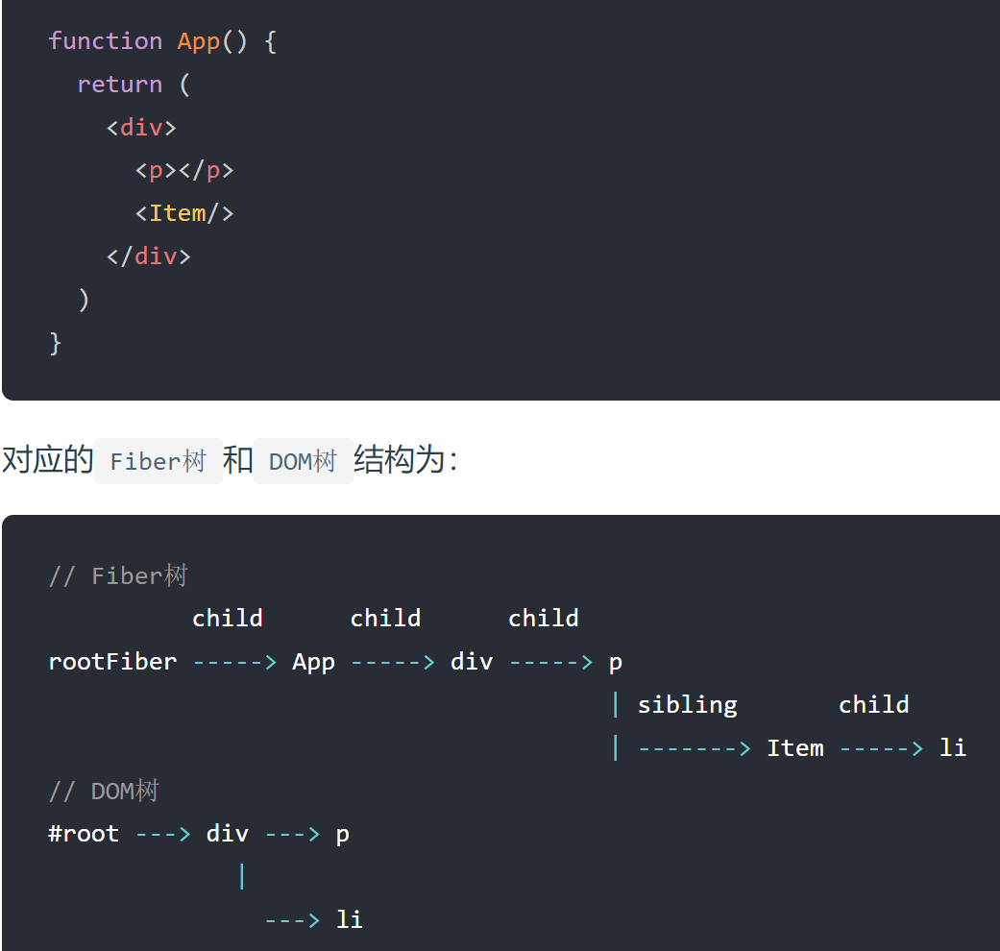

```js
const before = getHostSibling(finishedWork);
```

3. 根据`DOM`兄弟节点是否存在决定调用`parentNode.insertBefore`或`parentNode.appendChild`执行`DOM`插入操作。

```js
// parentStateNode是否是rootFiber
if (isContainer) {
  insertOrAppendPlacementNodeIntoContainer(finishedWork, before, parent);
} else {
  insertOrAppendPlacementNode(finishedWork, before, parent);
}
```

**Update effect**

`Fiber节点`需要更新，主要关注`FunctionComponent`和`HostComponent`

- 当`fiber.tag`为`FunctionComponent`，会调用`commitHookEffectListUnmount`。该方法会遍历`effectList`，**执行所有`useLayoutEffect hook`的销毁函数**（同步）。

- 当`fiber.tag`为`HostComponent`，会调用`commitUpdate`，最终会在[`updateDOMProperties`](https://github.com/facebook/react/blob/970fa122d8188bafa600e9b5214833487fbf1092/packages/react-dom/src/client/ReactDOMComponent.js#L378)中将[`render阶段 completeWork`](https://github.com/facebook/react/blob/970fa122d8188bafa600e9b5214833487fbf1092/packages/react-reconciler/src/ReactFiberCompleteWork.new.js#L229)中为`Fiber节点`赋值的`updateQueue`对应的内容渲染在页面上

**Deletion effect**

`Fiber节点`对应的`DOM节点`需要从页面中删除，调用的方法为`commitDeletion`

1. 递归调用`Fiber节点`及其子孙`Fiber节点`中`fiber.tag`为`ClassComponent`的[`componentWillUnmount`](https://github.com/facebook/react/blob/970fa122d8188bafa600e9b5214833487fbf1092/packages/react-reconciler/src/ReactFiberCommitWork.new.js#L920)生命周期钩子，从页面移除`Fiber节点`对应`DOM节点`
2. 解绑`ref`
3. 调度`useEffect`的销毁函数

### 3.4 layout阶段

该阶段的代码都是在`DOM`渲染完成（`mutation阶段`完成）后执行的，该阶段触发的生命周期钩子和`hook`可以直接访问到已经改变后的`DOM`，即该阶段是可以参与`DOM layout`的阶段。

执行`commitLayoutEffects`。该方法的主要工作为“根据`effectTag`调用不同的处理函数处理`Fiber`并更新`ref`。

**commitLayoutEffects**

1. commitLayoutEffectOnFiber（调用`生命周期钩子`和`hook`相关操作）
2. commitAttachRef（赋值 ref）

**commitLayoutEffectOnFiber**

据`fiber.tag`对不同类型的节点分别处理

- 对于`ClassComponent`，调用[`componentDidMount` ](https://github.com/facebook/react/blob/970fa122d8188bafa600e9b5214833487fbf1092/packages/react-reconciler/src/ReactFiberCommitWork.new.js#L538)或[`componentDidUpdate` ](https://github.com/facebook/react/blob/970fa122d8188bafa600e9b5214833487fbf1092/packages/react-reconciler/src/ReactFiberCommitWork.new.js#L592)，触发`状态更新`的`this.setState`如果赋值了第二个参数`回调函数`，也会在此时调用

- 对于`FunctionComponent`及相关类型，调用`useLayoutEffect hook`的`回调函数`，调度`useEffect`的`销毁`与`回调`函数

- 对于`HostRoot`，即`rootFiber`，如果赋值了第三个参数`回调函数`，也会在此时调用

  ```jsx
  ReactDOM.render(<App />, document.querySelector("#root"), function() {
    console.log("i am mount~");
  });
  ```

**commitAttachRef**

获取`DOM`实例，更新`ref`。

**current Fiber树切换**

`componentDidMount`和`componentDidUpdate`会在`layout阶段`执行。此时`current Fiber树`已经指向更新后的`Fiber树`，在生命周期钩子内获取的`DOM`就是更新后的

## 4、Diff算法 

### 4.1 概览

一个`DOM节点`在某一时刻最多会有4个节点和他相关，`Diff算法`的本质是对比1和4，生成2

1. `current Fiber`。如果该`DOM节点`已在页面中，`current Fiber`代表该`DOM节点`对应的`Fiber节点`
2. `workInProgress Fiber`。如果该`DOM节点`将在本次更新中渲染到页面中，`workInProgress Fiber`代表该`DOM节点`对应的`Fiber节点`
3. `DOM节点`本身
4. `JSX对象`。即`ClassComponent`的`render`方法的返回结果，或`FunctionComponent`的调用结果。`JSX对象`中包含描述`DOM节点`的信息

**Diff的瓶颈以及React如何应对**

将前后两棵树完全比对的算法的复杂程度为 O(n 3 )，其中`n`是树中元素的数量

为了降低算法复杂度，`React`的`diff`会预设三个限制：

1. 只对同级元素进行`Diff`。如果一个`DOM节点`在前后两次更新中跨越了层级，那么`React`不会尝试复用
2. 两个不同类型的元素会产生出不同的树。如果元素由`div`变为`p`，React会销毁`div`及其子孙节点，并新建`p`及其子孙节点
3. 开发者可以通过 `key prop`来暗示哪些子元素在不同的渲染下能保持稳定

**Diff是如何实现的**

`Diff`的入口函数[`reconcileChildFibers`](https://github.com/facebook/react/blob/1fb18e22ae66fdb1dc127347e169e73948778e5a/packages/react-reconciler/src/ReactChildFiber.new.js#L1280)，该函数会根据`newChild`（即`JSX对象`）类型调用不同的处理函数

1. 当`newChild`类型为`object`、`number`、`string`，代表同级只有一个节点，进入[`reconcileSingleElement`](https://github.com/facebook/react/blob/1fb18e22ae66fdb1dc127347e169e73948778e5a/packages/react-reconciler/src/ReactChildFiber.new.js#L1141)
2. 当`newChild`类型为`Array`，同级有多个节点

### 4.2 单节点Diff


判断DOM节点是否可以复用：`key`相同，`type`相同

- 当`child !== null`且`key相同`且`type不同`时执行`deleteRemainingChildren`将`child`及其兄弟`fiber`都标记删除。
- 当`child !== null`且`key不同`时仅将`child`标记删除。

### 4.3 多节点Diff

**需要处理的情况**

- 节点更新

- 节点新增或减少

- 节点位置变化

**Diff的思路**

1. 判断当前节点的更新属于哪种情况
2. 如果是`新增`，执行新增逻辑
3. 如果是`删除`，执行删除逻辑
4. 如果是`更新`，执行更新逻辑
5. 相较于`新增`和`删除`，`更新`组件发生的频率更高，`Diff`会优先判断当前节点是否属于`更新`

`Diff算法`的整体逻辑会经历两轮遍历：

**第一轮遍历：处理`更新`的节点**

1. `let i = 0`，遍历`newChildren`，将`newChildren[i]`与`oldFiber`比较，判断`DOM节点`是否可复用。
2. 如果可复用，`i++`，继续比较`newChildren[i]`与`oldFiber.sibling`，可以复用则继续遍历。
3. 如果不可复用，分两种情况：

   - `key`不同导致不可复用，立即跳出整个遍历，**第一轮遍历结束。**

   - `key`相同`type`不同导致不可复用，会将`oldFiber`标记为`DELETION`，并继续遍历

     ```jsx
     // 之前
     <li key="0">0</li>
     <li key="1">1</li>
     <li key="2">2</li>
                 
     // 之后
     <li key="0">0</li>
     <li key="2">1</li>
     <li key="1">2</li>
     ```


4. 如果`newChildren`遍历完（即`i === newChildren.length - 1`）或者`oldFiber`遍历完（即`oldFiber.sibling === null`），跳出遍历，**第一轮遍历结束。**

   ```jsx
   // 之前
   <li key="0" className="a">0</li>
   <li key="1" className="b">1</li>
               
   // 之后 情况1 —— newChildren与oldFiber都遍历完
   <li key="0" className="aa">0</li>
   <li key="1" className="bb">1</li>
               
   // 之后 情况2 —— newChildren没遍历完，oldFiber遍历完
   // newChildren剩下 key==="2" 未遍历
   <li key="0" className="aa">0</li>
   <li key="1" className="bb">1</li>
   <li key="2" className="cc">2</li>
               
   // 之后 情况3 —— newChildren遍历完，oldFiber没遍历完
   // oldFiber剩下 key==="1" 未遍历
   <li key="0" className="aa">0</li>
   ```

**第二轮遍历：处理剩下的不属于`更新`的节点**

- `newchildren`与`oldfiber`同时遍历完：只需在第一轮遍历进行组件[`更新`](https://github.com/facebook/react/blob/1fb18e22ae66fdb1dc127347e169e73948778e5a/packages/react-reconciler/src/ReactChildFiber.new.js#L825)，**`Diff`结束**

- `newChildren`没遍历完，`oldFiber`遍历完：已有的`DOM节点`都复用了，这时还有**新加入的节点**，意味着本次更新有新节点插入，我们只需要遍历剩下的`newChildren`为生成的`workInProgress fiber`依次标记`Placement`

- `newChildren`遍历完，`oldFiber`没遍历完：本次更新比之前的节点数量少，有**节点被删除**了。所以需要遍历剩下的`oldFiber`，依次标记`Deletion`

- `newChildren`与`oldFiber`都没遍历完：有节点在这次更新中**改变了位置**

**处理移动的节点**

- 将所有还未处理的`oldFiber`存入以`key`为key，`oldFiber`为value的`Map`中
- 遍历剩余的`newChildren`，通过`newChildren[i].key`就能在`existingChildren`中找到`key`相同的`oldFiber`

## 5、状态更新 

### 5.1 流程概览

在`React`中，有如下方法可以触发**状态更新**（排除`SSR`相关）：

- ReactDOM.render
- this.setState
- this.forceUpdate
- useState
- useReducer

每次`状态更新`都会创建一个保存**更新状态相关内容**的对象`Update`。在`render阶段`的`beginWork`中会根据`Update`计算新的`state`。

**从fiber到root**

从`触发状态更新的fiber`得到`rootFiber`，调用[`markUpdateLaneFromFiberToRoot`](https://github.com/facebook/react/blob/1fb18e22ae66fdb1dc127347e169e73948778e5a/packages/react-reconciler/src/ReactFiberWorkLoop.new.js#L636)方法，从`触发状态更新的fiber`一直向上遍历到`rootFiber`，并返回`rootFiber`，`render阶段`是从`rootFiber`开始向下遍历

**调度更新**

```shell
触发状态更新（根据场景调用不同方法）
    |
    v
创建Update对象
    |
    v
从fiber到root（`markUpdateLaneFromFiberToRoot`）
    |
    v
调度更新（`ensureRootIsScheduled`）
    |
    v
render阶段（`performSyncWorkOnRoot` 或 `performConcurrentWorkOnRoot`）
    |
    v
commit阶段（`commitRoot`）
```

**心智模型**

`高优更新`（红色节点）中断正在进行中的`低优更新`（蓝色节点），先完成`render - commit流程`。待`高优更新`完成后，`低优更新`基于`高优更新`的结果`重新更新`。

### 5.2 Update

将可以触发更新的方法所隶属的组件分类：

- ReactDOM.render —— HostRoot
- this.setState —— ClassComponent
- this.forceUpdate —— ClassComponent
- useState —— FunctionComponent
- useReducer —— FunctionComponent

`ClassComponent`与`HostRoot`共用一套`Update`结构，`FunctionComponent`单独使用一种`Update`结构

**Update的结构**

`Update`由[`createUpdate`](https://github.com/facebook/react/blob/1fb18e22ae66fdb1dc127347e169e73948778e5a/packages/react-reconciler/src/ReactUpdateQueue.old.js#L189)方法返回

```js
const update: Update<*> = {
  eventTime,
  lane,
  suspenseConfig,
  tag: UpdateState,
  payload: null,
  callback: null,
  next: null,
};
```

- lane：优先级相关字段。不同`Update`优先级是不同的。

- tag：更新的类型，包括`UpdateState` | `ReplaceState` | `ForceUpdate` | `CaptureUpdate`
- payload：更新挂载的数据，不同类型组件挂载的数据不同。对于`ClassComponent`，`payload`为`this.setState`的第一个传参。对于`HostRoot`，`payload`为`ReactDOM.render`的第一个传参
- callback：更新的回调函数。即在[commit 阶段的 layout 子阶段一节](https://react.iamkasong.com/renderer/layout.html#commitlayouteffectonfiber)中提到的`回调函数`
- next：与其他`Update`连接形成链表

**Update与Fiber的联系**

类似`Fiber节点`组成`Fiber树`，`Fiber节点`上的多个`Update`会组成链表并被包含在`fiber.updateQueue`中

`Fiber节点`最多同时存在两个`updateQueue`：

- `current fiber`保存的`updateQueue`即`current updateQueue`
- `workInProgress fiber`保存的`updateQueue`即`workInProgress updateQueue`

**updateQueue**

```js
const queue: UpdateQueue<State> = {
    baseState: fiber.memoizedState,
    firstBaseUpdate: null,
    lastBaseUpdate: null,
    shared: {
      pending: null,
    },
    effects: null,
};
```

- baseState：本次更新前该`Fiber节点`的`state`，`Update`基于该`state`计算更新后的`state`。

- `firstBaseUpdate`与`lastBaseUpdate`：本次更新前该`Fiber节点`已保存的==Update==。以链表形式存在，链表头为`firstBaseUpdate`，链表尾为`lastBaseUpdate`。之所以在更新产生前该`Fiber节点`内就存在`Update`，是由于某些`Update`优先级较低所以在上次`render阶段`由`Update`计算`state`时被跳过。

- `shared.pending`：触发更新时，产生的`Update`会保存在`shared.pending`中形成单向环状链表。当由`Update`计算`state`时这个环会被剪开并连接在`lastBaseUpdate`后面。

- effects：数组。保存`update.callback !== null`的`Update`。

### 5.4 深入理解优先级

`React`根据`人机交互研究的结果`中用户对`交互`的预期顺序为`交互`产生的`状态更新`赋予不同优先级。具体如下：

- 生命周期方法：同步执行。
- 受控的用户输入：比如输入框内输入文字，同步执行。
- 交互事件：比如动画，高优先级执行。
- 其他：比如数据请求，低优先级执行。

**调度优先级**

`React`通过`Scheduler`调度任务。每当需要调度任务时，`React`会调用`Scheduler`提供的方法[`runWithPriority`](https://github.com/facebook/react/blob/970fa122d8188bafa600e9b5214833487fbf1092/packages/scheduler/src/Scheduler.js#L217)。

该方法接收一个[优先级常量](https://github.com/facebook/react/blob/970fa122d8188bafa600e9b5214833487fbf1092/packages/scheduler/src/SchedulerPriorities.js)与一个`回调函数`作为参数。`回调函数`会以`优先级`高低为顺序排列在一个`定时器`中并在合适的时间触发。

对于更新来讲，传递的`回调函数`一般为[状态更新流程概览一节](https://react.iamkasong.com/state/prepare.html#render阶段的开始)讲到的`render阶段的入口函数`。


### 5.5 ReactDOM.render


### 5.6 this.setState


## 6、Hooks 

Hooks理念

极简Hooks实现

Hooks数据结构

useState与useReducer

useEffect

useRef

useMemo与useCallback