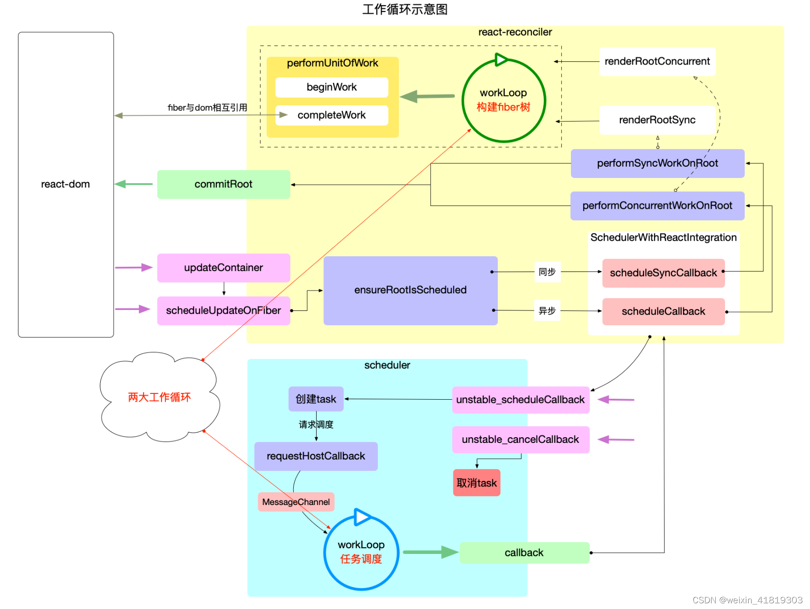
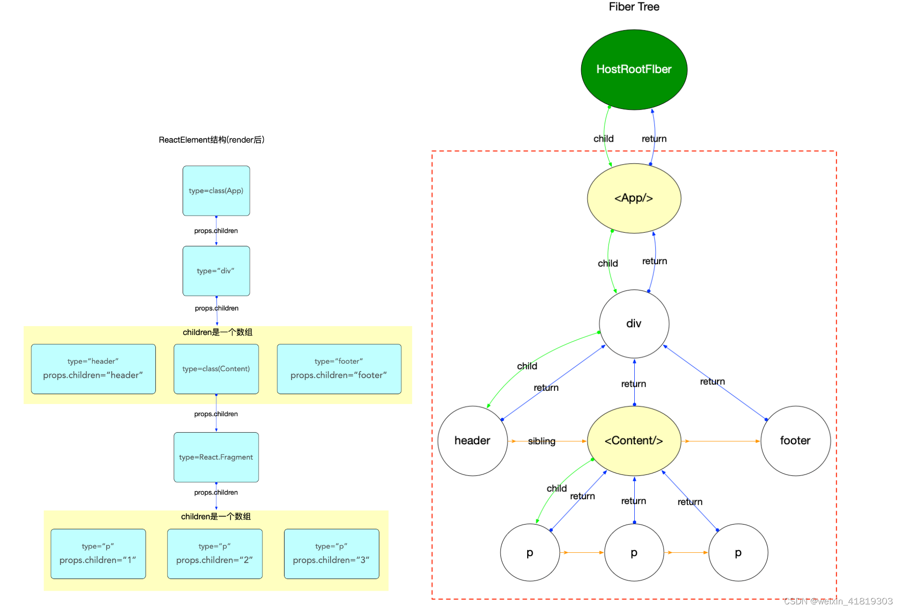
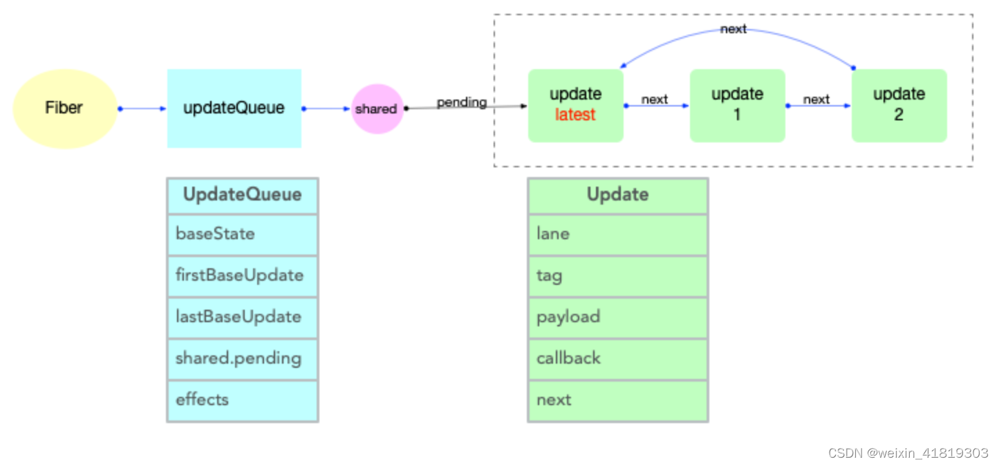
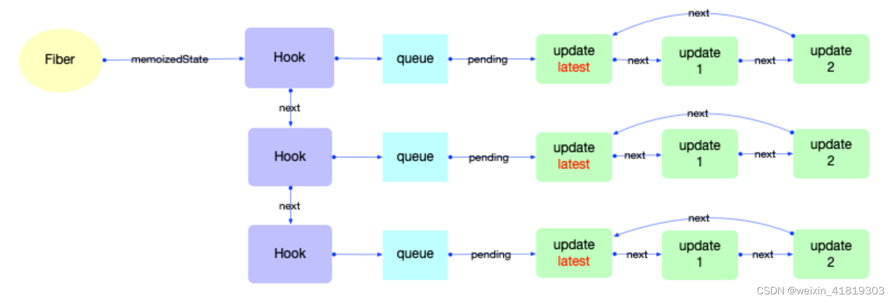
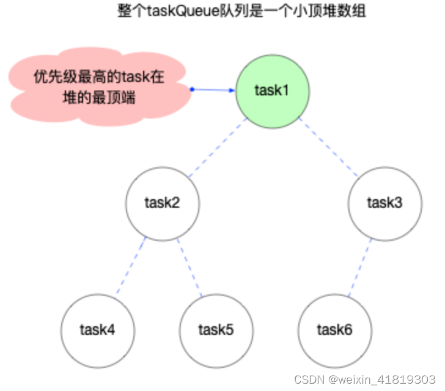
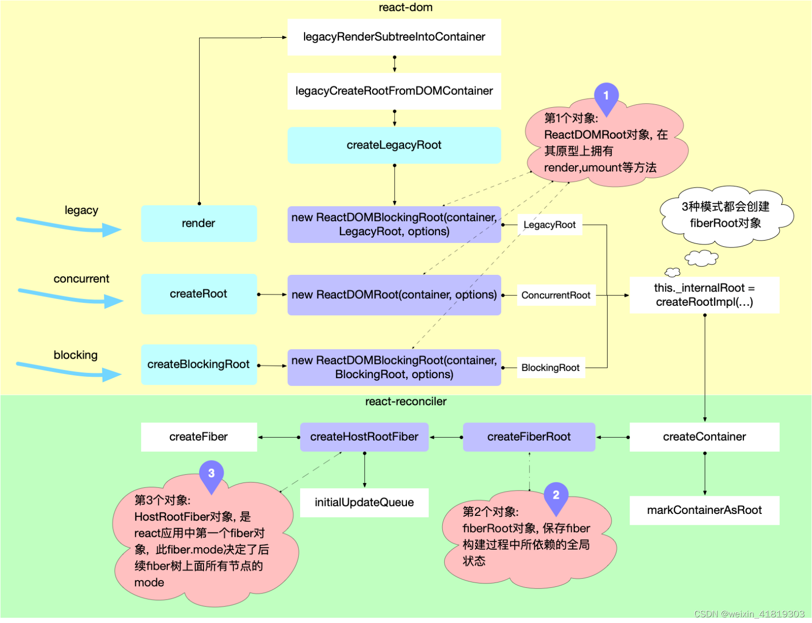
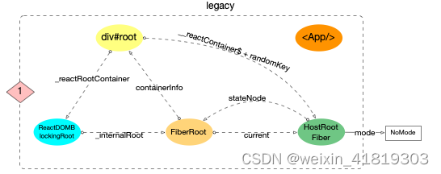
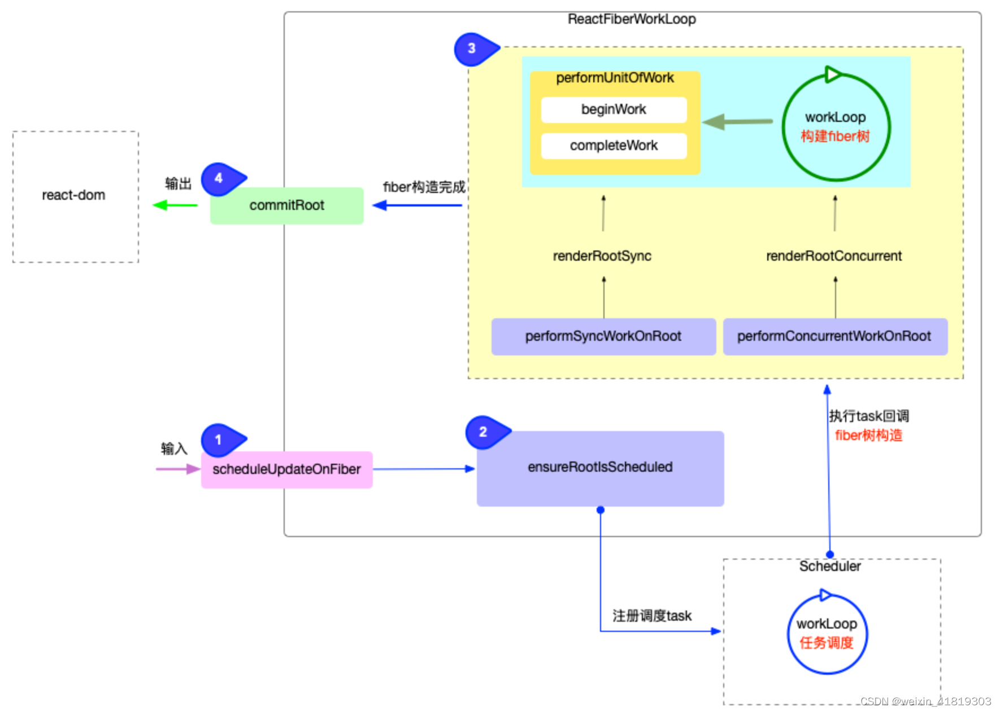
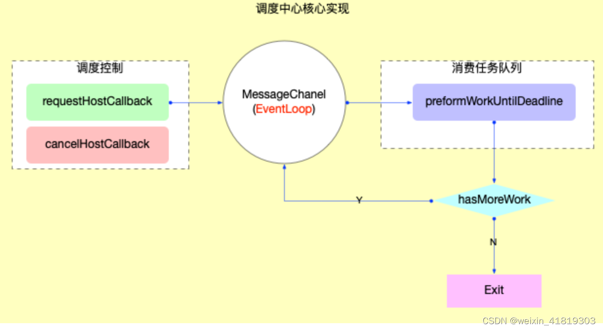

# 1、基本概念
## 1.1 宏观包结构 macro-structure
为了便于理解, 可将 react 应用整体结构分为接口层(`api`)和内核层(`core`)2 个部分
1. 接口层(api)
   **`react`包**, 平时在开发过程中使用的绝大部分`api`均来自此包(不是所有). 在`react`启动之后, 正常可以改变渲染的基本操作有 3 个.
   - class 组件中使用`setState`
   - function 组件里面使用 hook,并发起`dispatchAction`去改变 hook 对象
   - 改变 context(其实也需要`setState`或`dispatchAction`的辅助才能改变)

2. 内核层(core)

	i. 调度器  **`scheduler`包**, 执行回调.
	- 把`react-reconciler`提供的回调函数, 包装到一个任务对象中.
	- 在内部维护一个任务队列, 优先级高的排在最前面.
	- 循环消费任务队列, 直到队列清空.
	
	ii. 构造器，**`react-reconciler`包**
	- 装载渲染器, 渲染器必须实现[`HostConfig`协议](https://github.com/facebook/react/blob/v17.0.2/packages/react-reconciler/README.md#practical-examples)(如: `react-dom`), 保证在需要的时候, 能够正确调用渲染器的 api, 生成实际节点(如: `dom`节点).
	- 接收`react-dom`包(初次`render`)和`react`包(后续更新`setState`)发起的更新请求.
	- 将`fiber`树的构造过程包装在一个回调函数中, 并将此回调函数传入到`scheduler`包等待调度.

	iii. 渲染器， **`react-dom`包**
	- 引导`react`应用的启动(通过`ReactDOM.render`).
	- 实现[`HostConfig`协议](https://github.com/facebook/react/blob/v17.0.2/packages/react-reconciler/README.md#practical-examples)([源码在 ReactDOMHostConfig.js 中](https://github.com/facebook/react/blob/v17.0.2/packages/react-dom/src/client/ReactDOMHostConfig.js)), 能够将`react-reconciler`包构造出来的`fiber`树表现出来, 生成 dom 节点(浏览器中), 生成字符串(ssr).
## 1.2 两大工作循环 workLoop
1. `任务调度循环`
源码位于[`Scheduler.js`](https://github.com/facebook/react/blob/v17.0.2/packages/scheduler/src/Scheduler.js), 它是`react`应用得以运行的保证, 它需要循环调用, 控制所有任务(`task`)的调度.

2. `fiber构造循环`
源码位于[`ReactFiberWorkLoop.js`](https://github.com/facebook/react/blob/v17.0.2/packages/react-reconciler/src/ReactFiberWorkLoop.old.js), 控制 fiber 树的构造, 整个过程是一个[深度优先遍历](../algorithm/dfs.md).

两大循环的分工可以总结为: 大循环(任务调度循环)负责调度`task`, 小循环(fiber 构造循环)负责实现`task` .
1. 输入: 将每一次更新(如: 新增, 删除, 修改节点之后)视为一次`更新需求`(目的是要更新`DOM`节点).
2. 注册调度任务: `react-reconciler`收到`更新需求`之后, 并不会立即构造`fiber树`, 而是去调度中心`scheduler`注册一个新任务`task`, 即把`更新需求`转换成一个`task`.
3. 执行调度任务(输出): 调度中心`scheduler`通过任务调度循环来执行`task`(`task`的执行过程又回到了`react-reconciler`包中).
   - `fiber构造循环`是`task`的实现环节之一, 循环完成之后会构造出最新的 fiber 树.
   - `commitRoot`是`task`的实现环节之二, 把最新的 fiber 树最终渲染到页面上, `task`完成.
## 1.3 高频对象
**react 包**
[ReactElement 对象](https://github.com/facebook/react/blob/v17.0.2/packages/react/src/ReactElement.js#L126-L146)
所有采用`jsx`语法书写的节点, 都会被编译器转换, 最终会以`React.createElement(...)`的方式, 创建出来一个与之对应的`ReactElement`对象.
- [ReactComponent](https://github.com/facebook/react/blob/v17.0.2/packages/react/src/ReactBaseClasses.js#L20-L30)对象 (class类型的组件)
- 其他ReactElement
	- 如果在`function`类型的组件中没有使用`Hook`, 在`reconciler`阶段所有有关`Hook`的处理都会略过, 最后调用该`function`拿到子节点`ReactElement`.
	- 如果使用了`Hook`, 逻辑就相对复杂, 涉及到`Hook`创建和状态保存.

注意:
- 父级对象和子级对象之间是通过`props.children`属性进行关联的(与 fiber 树不同).
- `ReactElement`树(暂且用树来表述)和`fiber`树是以`props.children`为单位`先后交替`生成的(在 fiber 树构建章节详细解读), 当`ReactElement`树构造完毕, fiber 树也随后构造完毕.
- `reconciler`阶段会根据`ReactElement`的类型生成对应的`fiber`节点(不是一一对应, 比如`Fragment`类型的组件在生成`fiber`节点的时候会略过).

**react-reconciler 包**
[Fiber 对象](https://github.com/facebook/react/blob/v17.0.2/packages/react-reconciler/src/ReactInternalTypes.js#L47-L174)
属性解释:
- `fiber.tag`: 表示 fiber 类型, 根据`ReactElement`组件的 type 进行生成, 在 react 内部共定义了[25 种 tag](https://github.com/facebook/react/blob/v17.0.2/packages/react-reconciler/src/ReactWorkTags.js#L10-L35).
- `fiber.key`: 和`ReactElement`组件的 key 一致.
- `fiber.elementType`: 一般来讲和`ReactElement`组件的 type 一致
- `fiber.type`: 一般来讲和`fiber.elementType`一致. 一些特殊情形下, 比如在开发环境下为了兼容热更新(`HotReloading`), 会对`function, class, ForwardRef`类型的`ReactElement`做一定的处理, 这种情况会区别于`fiber.elementType`, 具体赋值关系可以查看[源文件](https://github.com/facebook/react/blob/v17.0.2/packages/react-reconciler/src/ReactFiber.old.js#L571-L574).
- `fiber.stateNode`: 与`fiber`关联的局部状态节点(比如: `HostComponent`类型指向与`fiber`节点对应的 dom 节点; 根节点`fiber.stateNode`指向的是`FiberRoot`; class 类型节点其`stateNode`指向的是 class 实例).
- `fiber.return`: 指向父节点.
- `fiber.child`: 指向第一个子节点.
- `fiber.sibling`: 指向下一个兄弟节点.
- `fiber.index`: fiber 在兄弟节点中的索引, 如果是单节点默认为 0.
- `fiber.ref`: 指向在`ReactElement`组件上设置的 ref(`string`类型的`ref`除外, 这种类型的`ref`已经不推荐使用, `reconciler`阶段会将`string`类型的`ref`转换成一个`function`类型).
- `fiber.pendingProps`: 输入属性, 从`ReactElement`对象传入的 props. 用于和`fiber.memoizedProps`比较可以得出属性是否变动.
- `fiber.memoizedProps`: 上一次生成子节点时用到的属性, 生成子节点之后保持在内存中. 向下生成子节点之前叫做`pendingProps`, 生成子节点之后会把`pendingProps`赋值给`memoizedProps`用于下一次比较.`pendingProps`和`memoizedProps`比较可以得出属性是否变动.
- `fiber.updateQueue`: 存储`update更新对象`的队列, 每一次发起更新, 都需要在该队列上创建一个`update对象`.
- `fiber.memoizedState`: 上一次生成子节点之后保持在内存中的局部状态.
- `fiber.dependencies`: 该 fiber 节点所依赖的(contexts, events)等, 在`context`机制章节详细说明.
- `fiber.mode`: 二进制位 Bitfield,继承至父节点,影响本 fiber 节点及其子树中所有节点. 与 react 应用的运行模式有关(有 ConcurrentMode, BlockingMode, NoMode 等选项).
- `fiber.flags`: 标志位, 副作用标记(在 16.x 版本中叫做`effectTag`, 相应[pr](https://github.com/facebook/react/pull/19755)), 在[`ReactFiberFlags.js`](https://github.com/facebook/react/blob/v17.0.2/packages/react-reconciler/src/ReactFiberFlags.js#L10-L41)中定义了所有的标志位. `reconciler`阶段会将所有拥有`flags`标记的节点添加到副作用链表中, 等待 commit 阶段的处理.
- `fiber.subtreeFlags`: 替代 16.x 版本中的 firstEffect, nextEffect. 默认未开启, 当设置了[enableNewReconciler=true](https://github.com/facebook/react/blob/v17.0.2/packages/shared/ReactFeatureFlags.js#L93) 才会启用, 本系列只跟踪稳定版的代码, 未来版本不会深入解读, [使用示例见源码](https://github.com/facebook/react/blob/v17.0.2/packages/react-reconciler/src/ReactFiberCompleteWork.new.js#L690-L714).
- `fiber.deletions`: 存储将要被删除的子节点. 默认未开启, 当设置了[enableNewReconciler=true](https://github.com/facebook/react/blob/v17.0.2/packages/shared/ReactFeatureFlags.js#L93) 才会启用, 本系列只跟踪稳定版的代码, 未来版本不会深入解读, [使用示例见源码](https://github.com/facebook/react/blob/v17.0.2/packages/react-reconciler/src/ReactChildFiber.new.js#L275-L287).
- `fiber.nextEffect`: 单向链表, 指向下一个有副作用的 fiber 节点.
- `fiber.firstEffect`: 指向副作用链表中的第一个 fiber 节点.
- `fiber.lastEffect`: 指向副作用链表中的最后一个 fiber 节点.
- `fiber.lanes`: 本 fiber 节点所属的优先级, 创建 fiber 的时候设置.
- `fiber.childLanes`: 子节点所属的优先级.
- `fiber.alternate`: 指向内存中的另一个 fiber, 每个被更新过 fiber 节点在内存中都是成对出现(current 和 workInProgress)

注意:
- 这里的 `fiber` 树只是为了和上文中的 `ReactElement` 树对照, 所以只用观察**红色虚线框内的节点**

Update 与 UpdateQueue 对象

Hook 对象

**scheduler 包**
Task 对象

# 2、运行核心
## 2.1 启动过程
本章节主要讲解`react`应用程序的启动过程, 位于`react-dom`包, 衔接`reconciler 运作流程`中的[`输入`](./reconciler-workflow.md#输入)步骤.

在调用入口函数之前,`reactElement(<App/>)`和 DOM 对象`div#root`之间没有关联

无论`Legacy, Concurrent或Blocking`模式, react 在初始化时, 都会创建 3 个全局对象
1. [`ReactDOM(Blocking)Root`对象](https://github.com/facebook/react/blob/v17.0.2/packages/react-dom/src/client/ReactDOMRoot.js#L62-L72)
- 属于`react-dom`包, 该对象[暴露有`render,unmount`方法](https://github.com/facebook/react/blob/v17.0.2/packages/react-dom/src/client/ReactDOMRoot.js#L62-L104), 通过调用该实例的`render`方法, 可以引导 react 应用的启动.
2. [`fiberRoot`对象](https://github.com/facebook/react/blob/v17.0.2/packages/react-reconciler/src/ReactFiberRoot.old.js#L83-L103)
   - 属于`react-reconciler`包, 作为`react-reconciler`在运行过程中的全局上下文, 保存 fiber 构建过程中所依赖的全局状态.
   - 其大部分实例变量用来存储`fiber 构造循环`(详见[`两大工作循环`](./workloop.md))过程的各种状态.react 应用内部, 可以根据这些实例变量的值, 控制执行逻辑.
3. [`HostRootFiber`对象](https://github.com/facebook/react/blob/v17.0.2/packages/react-reconciler/src/ReactFiber.old.js#L431-L449)
   - 属于`react-reconciler`包, 这是 react 应用中的第一个 Fiber 对象, 是 Fiber 树的根节点, 节点的类型是`HostRoot`.
   
   
## 2.2 reconciler 运作流程
`react-reconciler`包的主要作用, 将主要功能分为 4 个方面:
1. 输入: 暴露`api`函数(如: `scheduleUpdateOnFiber`), 供给其他包(如`react`包)调用.
2. 注册调度任务: 与调度中心(`scheduler`包)交互, 注册调度任务`task`, 等待任务回调.
3. 执行任务回调: 在内存中构造出`fiber树`, 同时与与渲染器(`react-dom`)交互, 在内存中创建出与`fiber`对应的`DOM`节点.
4. 输出: 与渲染器(`react-dom`)交互, 渲染`DOM`节点.

## 2.3 优先级管理 
`React`内部对于`优先级`的管理, 可以分为 3 种类型:
1. `fiber`优先级(`LanePriority`): 位于`react-reconciler`包, 也就是[`Lane(车道模型)`](https://github.com/facebook/react/pull/18796).
2. 调度优先级(`SchedulerPriority`): 位于`scheduler`包.
3. 优先级等级(`ReactPriorityLevel`) : 位于`react-reconciler`包中的[`SchedulerWithReactIntegration.js`](https://github.com/facebook/react/blob/v17.0.2/packages/react-reconciler/src/SchedulerWithReactIntegration.old.js), 负责上述 2 套优先级体系的转换.
4. 正是通过`优先级`的灵活运用, `React`实现了`可中断渲染`,`时间切片(time slicing)`,`异步渲染(suspense)`等特性.

注意:
- `LanePriority`和`SchedulerPriority`从命名上看, 它们代表的是`优先级`
- `ReactPriorityLevel`从命名上看, 它代表的是`等级`而不是优先级, 它用于衡量`LanePriority`和`SchedulerPriority`的等级.

转换关系：
为了能协同调度中心(`scheduler`包)和 fiber 树构造(`react-reconciler`包)中对优先级的使用, 则需要转换`SchedulerPriority`和`LanePriority`, 转换的桥梁正是`ReactPriorityLevel`.
- 在[`SchedulerWithReactIntegration.js`中](https://github.com/facebook/react/blob/v17.0.2/packages/react-reconciler/src/SchedulerWithReactIntegration.old.js#L93-L125), 可以互转`SchedulerPriority` 和 `ReactPriorityLevel`
- 在[`ReactFiberLane.js`中](https://github.com/facebook/react/blob/v17.0.2/packages/react-reconciler/src/ReactFiberLane.js#L196-L247), 可以互转`LanePriority` 和 `ReactPriorityLevel`
## 2.4 scheduler 调度原理
`调度中心`最核心的代码, 在[SchedulerHostConfig.default.js](https://github.com/facebook/react/blob/v17.0.2/packages/scheduler/src/forks/SchedulerHostConfig.default.js)中.

**内部函数：**

1. 调度相关: 请求或取消调度
- [requestHostCallback](https://github.com/facebook/react/blob/v17.0.2/packages/scheduler/src/forks/SchedulerHostConfig.default.js#L224-L230) 请求及时回调: port.postMessage
- [cancelHostCallback](https://github.com/facebook/react/blob/v17.0.2/packages/scheduler/src/forks/SchedulerHostConfig.default.js#L232-L234) 取消及时回调: scheduledHostCallback = null
- [requestHostTimeout](https://github.com/facebook/react/blob/v17.0.2/packages/scheduler/src/forks/SchedulerHostConfig.default.js#L236-L240) 请求延时回调: setTimeout
- [cancelHostTimeout](https://github.com/facebook/react/blob/v17.0.2/packages/scheduler/src/forks/SchedulerHostConfig.default.js#L242-L245) 取消延时回调: cancelTimeout

2. 时间切片(`time slicing`)相关: 执行时间分割, 让出主线程(把控制权归还浏览器, 浏览器可以处理用户输入, UI 绘制等紧急任务).
- [getCurrentTime](https://github.com/facebook/react/blob/v17.0.2/packages/scheduler/src/forks/SchedulerHostConfig.default.js#L22-L24): 获取当前时间
- [shouldYieldToHost](https://github.com/facebook/react/blob/v17.0.2/packages/scheduler/src/forks/SchedulerHostConfig.default.js#L129-L152): 是否让出主线程 判定条件:

	- `currentTime >= deadline`: 只有时间超过`deadline`之后才会让出主线程(其中`deadline = currentTime + yieldInterval`).
	- `yieldInterval`默认是`5ms`, 只能通过`forceFrameRate`函数来修改(事实上在 v17.0.2 源码中, 并没有使用到该函数).
	- 如果一个`task`运行时间超过`5ms`, 下一个`task`执行之前, 会把控制权归还浏览器.
	- `navigator.scheduling.isInputPending()`: 这 facebook 官方贡献给 Chromium 的 api, 现在已经列入 W3C 标准([具体解释](https://engineering.fb.com/2019/04/22/developer-tools/isinputpending-api/)), 用于判断是否有输入事件(包括: input 框输入事件, 点击事件等).
```js
// 是否让出主线程
shouldYieldToHost = function () {
  const currentTime = getCurrentTime();
  if (currentTime >= deadline) {
    if (needsPaint || scheduling.isInputPending()) {
      // There is either a pending paint or a pending input.
      return true;
    }
    // There's no pending input. Only yield if we've reached the max
    // yield interval.
    return currentTime >= maxYieldInterval; // 在持续运行的react应用中, currentTime肯定大于300ms, 这个判断只在初始化过程中才有可能返回false
  } else {
    // There's still time left in the frame.
    return false;
  }
};
```
- [requestPaint](https://github.com/facebook/react/blob/v17.0.2/packages/scheduler/src/forks/SchedulerHostConfig.default.js#L154-L156): 请求绘制
- [forceFrameRate](https://github.com/facebook/react/blob/v17.0.2/packages/scheduler/src/forks/SchedulerHostConfig.default.js#L168-L183): 强制设置 `yieldInterval`(从源码中的引用来看, 算一个保留函数, 其他地方没有用到)

完整回调的实现[performWorkUntilDeadline](https://github.com/facebook/react/blob/v17.0.2/packages/scheduler/src/forks/SchedulerHostConfig.default.js#L185-L218):

**任务队列管理：**

在[Scheduler.js](https://github.com/facebook/react/blob/v17.0.2/packages/scheduler/src/Scheduler.js)中, 维护了一个[taskQueue](https://github.com/facebook/react/blob/v17.0.2/packages/scheduler/src/Scheduler.js#L62), 任务队列管理就是围绕这个`taskQueue`展开.

1. 创建任务
在`unstable_scheduleCallback`函数中([源码链接](https://github.com/facebook/react/blob/v17.0.2/packages/scheduler/src/Scheduler.js#L279-L359))

2. 消费任务
创建任务之后, 最后请求调度`requestHostCallback(flushWork)`(`创建任务`源码中的第 5 步), `flushWork`函数作为参数被传入调度中心内核等待回调. `requestHostCallback`函数在上文调度内核中已经介绍过了, 在调度中心中, 只需下一个事件循环就会执行回调, 最终执行`flushWork`.
`flushWork`中调用了`workLoop`. 队列消费的主要逻辑是在`workLoop`函数中, 这就是React 工作循环一文中提到的`任务调度循环`.

3. `workLoop`
每一次`while`循环的退出就是一个时间切片, 深入分析`while`循环的退出条件:
- 队列被完全清空: 这种情况就是很正常的情况, 一气呵成, 没有遇到任何阻碍.
- 执行超时: 在消费`taskQueue`时, 在执行`task.callback`之前, 都会检测是否超时, 所以超时检测是以`task`为单位.
   - 如果某个`task.callback`执行时间太长(如: `fiber树`很大, 或逻辑很重)也会造成超时
   - 所以在执行`task.callback`过程中, 也需要一种机制检测是否超时, 如果超时了就立刻暂停`task.callback`的执行.

**节流防抖**
正常情况下, `ensureRootIsScheduled`函数会与`scheduler`包通信, 最后注册一个`task`并等待回调.
1. 在`task`注册完成之后, 会设置`fiberRoot`对象上的属性(`fiberRoot`是 react 运行时中的重要全局对象, 可参考React 应用的启动过程), 代表现在已经处于调度进行中
2. 再次进入`ensureRootIsScheduled`时(比如连续 2 次`setState`, 第 2 次`setState`同样会触发`reconciler运作流程`中的调度阶段), 如果发现处于调度中, 则需要一些节流和防抖措施, 进而保证调度性能.
   - 节流(判断条件: `existingCallbackPriority === newCallbackPriority`, 新旧更新的优先级相同, 如连续多次执行`setState`), 则无需注册新`task`(继续沿用上一个优先级相同的`task`), 直接退出调用.
   - 防抖(判断条件: `existingCallbackPriority !== newCallbackPriority`, 新旧更新的优先级不同), 则取消旧`task`, 重新注册新`task`.

```js
// ... 省略部分无关代码
function ensureRootIsScheduled(root: FiberRoot, currentTime: number) {
  // 前半部分: 判断是否需要注册新的调度
  const existingCallbackNode = root.callbackNode;
  const nextLanes = getNextLanes(
    root,
    root === workInProgressRoot ? workInProgressRootRenderLanes : NoLanes,
  );
  const newCallbackPriority = returnNextLanesPriority();
  if (nextLanes === NoLanes) {
    return;
  }
  // 节流防抖
  if (existingCallbackNode !== null) {
    const existingCallbackPriority = root.callbackPriority;
    if (existingCallbackPriority === newCallbackPriority) {
      return;
    }
    cancelCallback(existingCallbackNode);
  }
  // 后半部分: 注册调度任务 省略代码...

  // 更新标记
  root.callbackPriority = newCallbackPriority;
  root.callbackNode = newCallbackNode;
}
```
## 2.5 fiber 树构造(基础准备)
**1 `ReactElement, Fiber, DOM`**

开发人员通过编程只能控制`ReactElement`树的结构, `ReactElement树`驱动`fiber树`, `fiber树`再驱动`DOM树`, 最后展现到页面上. 所以`fiber树`的构造过程, 实际上就是`ReactElement`对象到`fiber`对象的转换过程.

1. [ReactElement 对象](https://github.com/facebook/react/blob/v17.0.2/packages/react/src/ReactElement.js#L126-L146)(type 定义在[shared 包中](https://github.com/facebook/react/blob/v17.0.2/packages/shared/ReactElementType.js#L15))

   - 所有采用`jsx`语法书写的节点, 都会被编译器转换, 最终会以`React.createElement(...)`的方式, 创建出来一个与之对应的`ReactElement`对象

2. [fiber 对象](https://github.com/facebook/react/blob/v17.0.2/packages/react-reconciler/src/ReactFiber.old.js#L116-L155)(type 类型的定义在[ReactInternalTypes.js](https://github.com/facebook/react/blob/v17.0.2/packages/react-reconciler/src/ReactInternalTypes.js#L47-L174)中)

   - `fiber对象`是通过`ReactElement`对象进行创建的, 多个`fiber对象`构成了一棵`fiber树`, `fiber树`是构造`DOM树`的数据模型, `fiber树`的任何改动, 最后都体现到`DOM树`.

3. [DOM 对象](https://developer.mozilla.org/zh-CN/docs/Web/API/Document_Object_Model): 文档对象模型
   - `DOM`将文档解析为一个由节点和对象（包含属性和方法的对象）组成的结构集合, 也就是常说的`DOM树`.
   - `JavaScript`可以访问和操作存储在 DOM 中的内容, 也就是操作`DOM对象`, 进而触发 UI 渲染.

它们之间的关系反映了我们书写的 JSX 代码到 DOM 节点的转换过程:

**2 全局变量**
在`React`运行时, `ReactFiberWorkLoop.js`闭包中的`全局变量`会随着`fiber树构造循环`的进行而变化, 其中重要的全局变量([源码链接](https://github.com/facebook/react/blob/v17.0.2/packages/react-reconciler/src/ReactFiberWorkLoop.old.js#L247-L367)):

```js
// 当前React的执行栈(执行上下文)
let executionContext: ExecutionContext = NoContext;

// 当前root节点
let workInProgressRoot: FiberRoot | null = null;
// 正在处理中的fiber节点
let workInProgress: Fiber | null = null;
// 正在渲染的车道(复数)
let workInProgressRootRenderLanes: Lanes = NoLanes;

// 包含所有子节点的优先级, 是workInProgressRootRenderLanes的超集
// 大多数情况下: 在工作循环整体层面会使用workInProgressRootRenderLanes, 在begin/complete阶段层面会使用 subtreeRenderLanes
let subtreeRenderLanes: Lanes = NoLanes;
// 一个栈结构: 专门存储当前节点的 subtreeRenderLanes
const subtreeRenderLanesCursor: StackCursor<Lanes> = createCursor(NoLanes);

// fiber构造完后, root节点的状态: completed, errored, suspended等
let workInProgressRootExitStatus: RootExitStatus = RootIncomplete;
// 重大错误
let workInProgressRootFatalError: mixed = null;
// 整个render期间所使用到的所有lanes
let workInProgressRootIncludedLanes: Lanes = NoLanes;
// 在render期间被跳过(由于优先级不够)的lanes: 只包括未处理的updates, 不包括被复用的fiber节点
let workInProgressRootSkippedLanes: Lanes = NoLanes;
// 在render期间被修改过的lanes
let workInProgressRootUpdatedLanes: Lanes = NoLanes;

// 防止无限循环和嵌套更新
const NESTED_UPDATE_LIMIT = 50;
let nestedUpdateCount: number = 0;
let rootWithNestedUpdates: FiberRoot | null = null;

const NESTED_PASSIVE_UPDATE_LIMIT = 50;
let nestedPassiveUpdateCount: number = 0;

// 发起更新的时间
let currentEventTime: number = NoTimestamp;
let currentEventWipLanes: Lanes = NoLanes;
let currentEventPendingLanes: Lanes = NoLanes;
```

**3 双缓冲技术(double buffering)**
 `fiber树`的构造过程, 就是把`ReactElement`转换成`fiber树`的过程. 在这个过程中, 内存里会同时存在 2 棵`fiber树`:

- 其一: 代表当前界面的`fiber`树(`HostRootFiber`，已经被展示出来, 挂载到`fiberRoot.current`上). 如果是初次构造(`初始化渲染`), 页面还没有渲染, 此时界面对应的 fiber 树为空(`fiberRoot.current = null`).
- 其二: 正在构造的`fiber`树(即将展示出来, 挂载到`HostRootFiber.alternate`上, 正在构造的节点称为`workInProgress`). 当构造完成之后, 重新渲染页面, 最后切换`fiberRoot.current = workInProgress`, 使得`fiberRoot.current`重新指向代表当前界面的`fiber`树.

## 2.6 fiber 树构造(初次创建)
**1 启动阶段**
进入`react-reconciler`包调用[updateContainer 函数](https://github.com/facebook/react/blob/v17.0.2/packages/react-reconciler/src/ReactFiberReconciler.old.js#L250-L321):

可以在控制台中打出当前页面对应的`fiber`树(用于观察其结构):

```js
document.getElementById('root')._reactRootContainer._internalRoot.current;
```

最初的`ReactElement`对象`<App/>`被挂载到`HostRootFiber.updateQueue.shared.pending.payload.element`中, 后文`fiber树构造`过程中会再次变动.

**2 构造阶段**
updateContainer --> [scheduleUpdateOnFiber 函数](https://github.com/facebook/react/blob/v17.0.2/packages/react-reconciler/src/ReactFiberWorkLoop.old.js#L517-L619)  --> performSyncWorkOnRoot --> [renderRootSync](https://github.com/facebook/react/blob/v17.0.2/packages/react-reconciler/src/ReactFiberWorkLoop.old.js#L1490-L1553)

在`renderRootSync`中, 在执行`fiber树构造`前(`workLoopSync`)会先刷新栈帧`prepareFreshStack`(参考[fiber 树构造(基础准备)](./fibertree-prepare.md#栈帧管理)).在这里创建了`HostRootFiber.alternate`, 重置全局变量`workInProgress`和`workInProgressRoot`等.

**3 循环构造**
renderRootSync --> workLoopSync -->  [performUnitOfWork](https://github.com/facebook/react/blob/v17.0.2/packages/react-reconciler/src/ReactFiberWorkLoop.old.js#L1642-L1668)
```js
function workLoopSync() {
  while (workInProgress !== null) {
    performUnitOfWork(workInProgress);
  }
}

function performUnitOfWork(unitOfWork: Fiber): void {
  // unitOfWork就是被传入的workInProgress
  const current = unitOfWork.alternate;
  let next;
  next = beginWork(current, unitOfWork, subtreeRenderLanes);
  unitOfWork.memoizedProps = unitOfWork.pendingProps;
  if (next === null) {
    // 如果没有派生出新的节点, 则进入completeWork阶段, 传入的是当前unitOfWork
    completeUnitOfWork(unitOfWork);
  } else {
    workInProgress = next;
  }
}
```
整个`fiber树构造`是一个深度优先遍历, 其中有 2 个重要的变量`workInProgress`和`current`:
- `workInProgress`和`current`都视为指针
- `workInProgress`指向当前正在构造的`fiber`节点
- `current = workInProgress.alternate`(即`fiber.alternate`), 指向当前页面正在使用的`fiber`节点. 初次构造时, 页面还未渲染, 此时`current = null`.

在深度优先遍历中, 每个`fiber`节点都会经历 2 个阶段:
1. 探寻阶段 `beginWork`
2. 回溯阶段 `completeWork`


**4 探寻阶段 `beginWork`**

`beginWork(current, unitOfWork, subtreeRenderLanes)`([源码地址](https://github.com/facebook/react/blob/v17.0.2/packages/react-reconciler/src/ReactFiberBeginWork.old.js#L3083-L3494))针对所有的 Fiber 类型, 其中的每一个 case 处理一种 Fiber 类型. `updateXXX`函数(如: `updateHostRoot`, `updateClassComponent` 等)的主要逻辑:

- 根据 `ReactElement`对象创建所有的`fiber`节点, 最终构造出`fiber树形结构`(设置`return`和`sibling`指针)
- 设置`fiber.flags`(二进制形式变量, 用来标记 `fiber`节点 的`增,删,改`状态, 等待`completeWork阶段处理`)
- 设置`fiber.stateNode`局部状态(如`Class类型`节点: `fiber.stateNode=new Class()`)

`updateXXX`函数(如: updateHostRoot, updateClassComponent 等)虽然 case 较多, 但是主要逻辑可以概括为 3 个步骤:

不同的`updateXXX`函数处理的`fiber`节点类型不同, 总的目的是为了向下生成子节点. 在这个过程中把一些需要持久化的数据挂载到`fiber`节点上(如`fiber.stateNode`,`fiber.memoizedState`等); 把`fiber`节点的特殊操作设置到`fiber.flags`(如:`节点ref`,`class组件的生命周期`,`function组件的hook`,`节点删除`等).

1. 根据`fiber.pendingProps, fiber.updateQueue`等`输入数据`状态, 计算`fiber.memoizedState`作为`输出状态`
2. 获取下级`ReactElement`对象
   i. class 类型的 `fiber` 节点
      - 构建`React.Component`实例
      - 把新实例挂载到`fiber.stateNode`上
      - 执行`render`之前的生命周期函数
      - 执行`render`方法, 获取下级`reactElement`
      - 根据实际情况, 设置`fiber.flags`

   ii. function 类型的 `fiber` 节点
      - 执行 function, 获取下级`reactElement`
      - 根据实际情况, 设置`fiber.flags`

   iii. HostComponent 类型(如: `div, span, button` 等)的 `fiber` 节点
      - `pendingProps.children`作为下级`reactElement`
      - 如果下级节点是文本节点,则设置下级节点为 null. 准备进入`completeUnitOfWork`阶段
      - 根据实际情况, 设置`fiber.flags`
   iiii. 其他类型...
3. 根据`ReactElement`对象, 调用`reconcileChildren`生成`Fiber`子节点(只生成`次级子节点`)
   - 根据实际情况, 设置`fiber.flags`


```js
function beginWork(
  current: Fiber | null,
  workInProgress: Fiber,
  renderLanes: Lanes,
): Fiber | null {
  const updateLanes = workInProgress.lanes;
  if (current !== null) {
    // update逻辑, 首次render不会进入
  } else {
    didReceiveUpdate = false;
  }
  // 1. 设置workInProgress优先级为NoLanes(最高优先级)
  workInProgress.lanes = NoLanes;
  // 2. 根据workInProgress节点的类型, 用不同的方法派生出子节点
  switch (
    workInProgress.tag // 只保留了本例使用到的case
  ) {
    case HostRoot:
      return updateHostRoot(current, workInProgress, renderLanes);
    case HostComponent:
      return updateHostComponent(current, workInProgress, renderLanes);
    case HostText:
      return updateHostText(current, workInProgress);
    case Fragment:
      return updateFragment(current, workInProgress, renderLanes);
    ...
  }
}

function updateHostComponent(
  current: Fiber | null,
  workInProgress: Fiber,
  renderLanes: Lanes,
) {
  // 1. 状态计算, 由于HostComponent是无状态组件, 所以只需要收集 nextProps即可, 它没有 memoizedState
  const type = workInProgress.type;
  const nextProps = workInProgress.pendingProps;
  const prevProps = current !== null ? current.memoizedProps : null;
  // 2. 获取下级`ReactElement`对象
  let nextChildren = nextProps.children;
  const isDirectTextChild = shouldSetTextContent(type, nextProps);

  if (isDirectTextChild) {
    // 如果子节点只有一个文本节点, 不用再创建一个HostText类型的fiber
    nextChildren = null;
  } else if (prevProps !== null && shouldSetTextContent(type, prevProps)) {
    // 特殊操作需要设置fiber.flags
    workInProgress.flags |= ContentReset;
  }
  // 特殊操作需要设置fiber.flags
  markRef(current, workInProgress);
  // 3. 根据`ReactElement`对象, 调用`reconcileChildren`生成`Fiber`子节点(只生成`次级子节点`)
  reconcileChildren(current, workInProgress, nextChildren, renderLanes);
  return workInProgress.child;
}
```

**5 回溯阶段 `completeWork`**

`completeUnitOfWork(unitOfWork)`([源码地址](https://github.com/facebook/react/blob/v17.0.2/packages/react-reconciler/src/ReactFiberWorkLoop.old.js#L1670-L1802)), 处理 `beginWork` 阶段已经创建出来的 `fiber` 节点, 核心逻辑:
1. 调用`completeWork`
	- 给`fiber`节点(tag=HostComponent, HostText)创建 DOM 实例,设置`fiber.stateNode`局部状态(如`tag=HostComponent, HostText`节点: fiber.stateNode 指向这个 DOM 实例). 		
	- 为 DOM 节点设置属性, 绑定事件(这里先说明有这个步骤,详细的事件处理流程, 在`合成事件原理`中详细说明). 		
	- 设置`fiber.flags`标记
2. 把当前 `fiber` 对象的副作用队列(`firstEffect`和`lastEffect`)添加到父节点的副作用队列之后, 更新父节点的`firstEffect`和`lastEffect`指针.
3. 识别`beginWork`阶段设置的`fiber.flags`, 判断当前 `fiber` 是否有副作用(增,删,改), 如果有, 需要将当前 `fiber` 加入到父节点的`effects`队列, 等待`commit`阶段处理.
```js
function completeWork(
  current: Fiber | null,
  workInProgress: Fiber,
  renderLanes: Lanes,
): Fiber | null {
  const newProps = workInProgress.pendingProps;
  switch (workInProgress.tag) {
    case ClassComponent: {
      // Class类型不做处理
      return null;
    }
    case HostRoot: {
      const fiberRoot = (workInProgress.stateNode: FiberRoot);
      if (fiberRoot.pendingContext) {
        fiberRoot.context = fiberRoot.pendingContext;
        fiberRoot.pendingContext = null;
      }
      if (current === null || current.child === null) {
         // 设置fiber.flags标记
         workInProgress.flags |= Snapshot;
      }
      return null;
    }
    case HostComponent: {
      popHostContext(workInProgress);
      const rootContainerInstance = getRootHostContainer();
      const type = workInProgress.type;
      if (current !== null && workInProgress.stateNode != null) {
        // update逻辑, 初次render不会进入
      } else {
        const currentHostContext = getHostContext();
        // 1. 创建DOM对象
        const instance = createInstance(
          type,
          newProps,
          rootContainerInstance,
          currentHostContext,
          workInProgress,
        );
        // 2. 把子树中的DOM对象append到本节点的DOM对象之后
        appendAllChildren(instance, workInProgress, false, false);
        // 设置stateNode属性, 指向DOM对象
        workInProgress.stateNode = instance;
        if (
          // 3. 设置DOM对象的属性, 绑定事件等
          finalizeInitialChildren(
            instance,
            type,
            newProps,
            rootContainerInstance,
            currentHostContext,
          )
        ) {
          // 设置fiber.flags标记(Update)
          markUpdate(workInProgress);
        }
        if (workInProgress.ref !== null) {
          // 设置fiber.flags标记(Ref)
          markRef(workInProgress);
        }
        return null;
    }
  }
}
```
## 2.7 fiber 树构造(对比更新)
逻辑来到[scheduleUpdateOnFiber](https://github.com/facebook/react/blob/v17.0.2/packages/react-reconciler/src/ReactFiberWorkLoop.old.js#L517-L619)函数:

```js
// ...省略部分代码
export function scheduleUpdateOnFiber(
  fiber: Fiber, // fiber表示被更新的节点
  lane: Lane, // lane表示update优先级
  eventTime: number,
) {
  const root = markUpdateLaneFromFiberToRoot(fiber, lane);
  if (lane === SyncLane) {
    if (
      (executionContext & LegacyUnbatchedContext) !== NoContext &&
      (executionContext & (RenderContext | CommitContext)) === NoContext
    ) {
      // 初次渲染
      performSyncWorkOnRoot(root);
    } else {
      // 对比更新
      ensureRootIsScheduled(root, eventTime);
    }
  }
  mostRecentlyUpdatedRoot = root;
}
```
1. [markUpdateLaneFromFiberToRoot](https://github.com/facebook/react/blob/v17.0.2/packages/react-reconciler/src/ReactFiberWorkLoop.old.js#L625-L667)函数, 只在`对比更新`阶段才发挥出它的作用, 它找出了`fiber树`中受到本次`update`影响的所有节点, 并设置这些节点的`fiber.lanes`或`fiber.childLanes`以备`fiber树构造`阶段使用.
- 以`sourceFiber`为起点, 设置起点的`fiber.lanes`
- 从起点开始, 直到`HostRootFiber`, 设置父路径上所有节点(也包括`fiber.alternate`)的`fiber.childLanes`.
- 通过设置`fiber.lanes`和`fiber.childLanes`就可以辅助判断子树是否需要更新(在下文`循环构造`中详细说明).

2. `对比更新`没有直接调用`performSyncWorkOnRoot`, 而是通过调度中心来处理, 由于本示例是在`Legacy`模式下进行, 最后会同步执行`performSyncWorkOnRoot`.(详细原理可以参考[React 调度原理(scheduler)](./scheduler.md)). 所以其调用链路`performSyncWorkOnRoot--->renderRootSync--->workLoopSync`与`初次构造`中的一致.

在[renderRootSync](https://github.com/facebook/react/blob/v17.0.2/packages/react-reconciler/src/ReactFiberWorkLoop.old.js#L1490-L1553)中:
- `fiberRoot.current`指向与当前页面对应的`fiber树`, `workInProgress`指向正在构造的`fiber树`.
- 刷新栈帧会调用`createWorkInProgress()`, 使得`workInProgress.flags和workInProgress.effects`都已经被重置. 且`workInProgress.child = current.child`. 所以在进入`循环构造`之前, `HostRootFiber`与`HostRootFiber.alternate`共用一个`child`(这里是`fiber(<App/>)`).

**循环构造**
在深度优先遍历中, 每个`fiber`节点都会经历 2 个阶段:

1. 探寻阶段 `beginWork`
与`初次创建`不同, 在`对比更新`过程中, 如果是`老节点`, 那么`current !== null`, 需要进行对比, 然后决定是否复用老节点及其子树(即`bailout`逻辑).

1. `!includesSomeLane(renderLanes, updateLanes)`这个判断分支, 包含了`渲染优先级`和`update优先级`的比较(详情可以回顾[fiber 树构造(基础准备)](./fibertree-prepare.md#优先级)中`优先级`相关解读), 如果当前节点无需更新, 则会进入`bailout`逻辑.
2. 最后会调用`bailoutOnAlreadyFinishedWork`:
   - 如果同时满足`!includesSomeLane(renderLanes, workInProgress.childLanes)`, 表明该 fiber 节点及其子树都无需更新, 可直接进入回溯阶段(`completeUnitOfWork`)
   - 如果不满足`!includesSomeLane(renderLanes, workInProgress.childLanes)`, 意味着子节点需要更新, `clone`并返回子节点.
```js
// 省略部分无关代码
function bailoutOnAlreadyFinishedWork(
  current: Fiber | null,
  workInProgress: Fiber,
  renderLanes: Lanes,
): Fiber | null {
  if (!includesSomeLane(renderLanes, workInProgress.childLanes)) {
    // 渲染优先级不包括 workInProgress.childLanes, 表明子节点也无需更新. 返回null, 直接进入回溯阶段.
    return null;
  } else {
    // 本fiber虽然不用更新, 但是子节点需要更新. clone并返回子节点
    cloneChildFibers(current, workInProgress);
    return workInProgress.child;
  }
}
```

2. 回溯阶段 `completeWork`

## 2.8 fiber 树渲染
## 2.9 异常处理
# 3、数据管理
## 3.1 状态与副作用
## 3.2 hook 原理(概览)
## 3.3 hook 原理(状态 Hook)
## 3.4 hook 原理(副作用 Hook)
## 3.5 context 原理
# 4、交互
## 4.1 合成事件原理
# 5、高频算法
## 5.1 位运算
## 5.2 堆排序
## 5.3 深度优先遍历
## 5.4 链表操作
## 5.5 栈操作
## 5.6 diff 算法


参考：
[Render阶段中Fiber树的初始化与对比更新](https://juejin.cn/post/7202085514400038969#heading-10)
7km：7kms.github.io/react-illus…
卡颂：react.iamkasong.com/preparation…

`React`是一个声明式, 高效且灵活的用于构建用户界面的 JavaScript 库. React 团队一直致力于实现高效渲染, 其中有 2 个十分有名的演讲:
1. [2017 年 Lin Clark 的演讲](http://conf2017.reactjs.org/speakers/lin)中介绍了`fiber`架构和`可中断渲染`.
2. [2018 年 Dan 在 JSConf 冰岛的演讲](https://zh-hans.reactjs.org/blog/2018/03/01/sneak-peek-beyond-react-16.html)进一步介绍了时间切片(`time slicing`)和异步渲染(`suspense`)等特性.