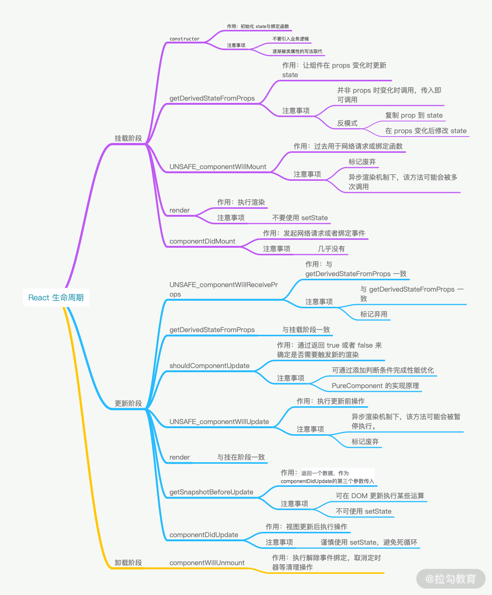
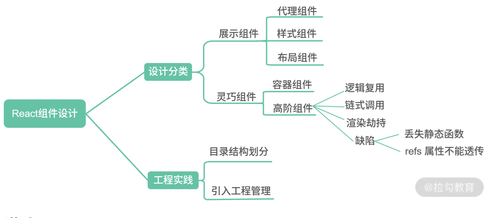
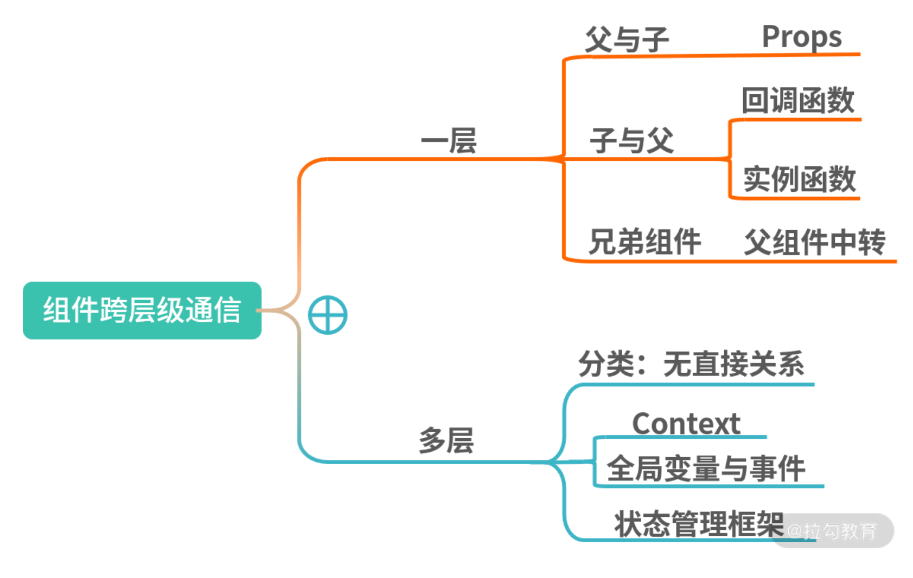
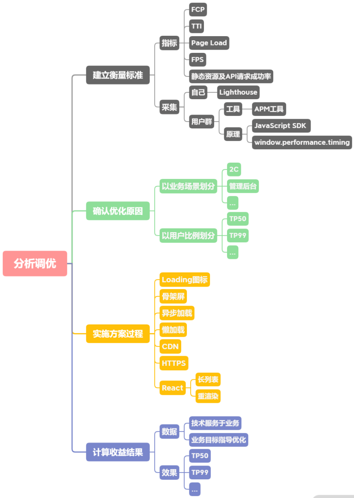

## 1、组件基础

（ 01 ~ 05 ）：从经典面试问题入手带你梳理组件的设计原理与思路，帮助你掌握分析和解决问题的技巧。

### 1.1 谈一谈对 React 的理解

   对待**概念题**，四字口诀“讲说理列”，**非线性**的结构化模式阐述答案

   - 讲概念：用简洁的话说清楚该技术是什么。最好能用一句话描述。

   - 说用途：描述该技术的用途。能够具体结合适合场景，拓展性的描述。

   - 理思路：梳理该技术的核心思路或运作流程。这个地方可深可浅，如果对其有足够深入的了解，建议详细地展开说明。

   - 优缺点，列一遍：对该技术栈的优缺点进行列举。列举优缺点肯定有与其他技术方案横向对比的过程，那么在这个过程中，切忌刻意地踩一捧一，容易引发面试官的反感。

   

   回答

   - React 是一个网页 UI 框架，通过组件化的方式解决视图层开发复用的问题，本质是一个组件化框架。

   - 它的核心设计思路有三点，分别是声明式、组件化与 通用性。
     - 声明式的优势在于直观与组合。
     - 组件化的优势在于视图的拆分与模块复用，可以更容易做到高内聚低耦合。
     - 通用性在于一次学习，随处编写。比如 React Native，React 360 等， 这里主要靠虚拟 DOM 来保证实现。
   - 这使得 React 的适用范围变得足够广，无论是 Web、Native、VR，甚至 Shell 应用都可以进行开发。这也是 React 的优势。
     但作为一个视图层的框架，React 的劣势也十分明显。它并没有提供完整的一揽子解决方 案，在开发大型前端应用时，需要向社区寻找并整合解决方案。虽然一定程度上促进了社区的繁荣，但也为开发者在技术选型和学习适用上造成了一定的成本。

### 1.2 为什么 React 要用` JSX`

“**为什么采用该技术方案**”这一类问题考察你的两个方面：

- 技术广度，深挖知识面涉猎广度，对流行框架的模板方案是否知悉了解；

- 技术方案调研能力。

**三步走技巧**

- 一句话解释 ` JSX`。首先能一句话说清楚 ` JSX`到底是什么。

- 
  核心概念。` JSX`用于解决什么问题？如何使用？

- 
  方案对比。与其他的方案对比，说明 React 选用 ` JSX`的必要性。


**回答**

- ` JSX`是一个 JavaScript 的语法扩展，结构类似 XML。` JSX`主要用于声明 React 元素，但 React 中并不强制使用 ` JSX`。即使使用了 ` JSX`，也会在构建过程中，通过 `Babel` 插件编译为 `React.createElement`。所以 ` JSX`更像是 `React.createElement` 的一种语法糖。
- 所以从这里可以看出，`React` 团队并不想引入` JavaScript` 本身以外的开发体系。而是希望通过合理的关注点分离保持组件开发的纯粹性。
- 接下来与 ` JSX`以外的三种技术方案进行对比。
  - 首先是模板，React 团队认为模板不应该是开发过程中的关注点，因为引入了模板语法、模板指令等概念，是一种不佳的实现方案。
  - 其次是模板字符串，模板字符串编写的结构会造成多次内部嵌套，使整个结构变得复杂，并且优化代码提示也会变得困难重重。
  - 最后是 `JXON`，同样因为代码提示困难的原因而被放弃。
- 所以 `React` 最后选用了 ` JSX`，因为 ` JSX`与其设计思想贴合，不需要引入过多新的概念，对编辑器的代码提示也极为友好。

**Babel 插件如何实现 `JSX` 到 `JS` 的编译？** 

Babel 读取代码并解析，生成 `AST`，再将 `AST` 传入插件层进行转换，在转换时就可以将 `JSX` 的结构转换为 `React.createElement` 的函数。如下代码所示：

```js
module.exports = function (babel) {
  var t = babel.types;
  return {
    name: "custom-jsx-plugin",
    visitor: {
      JSXElement(path) {
        var openingElement = path.node.openingElement;
        var tagName = openingElement.name.name;
        var args = []; 
        args.push(t.stringLiteral(tagName)); 
        var attribs = t.nullLiteral(); 
        args.push(attribs); 
        var reactIdentifier = t.identifier("React"); //object
        var createElementIdentifier = t.identifier("createElement"); 
        var callee = t.memberExpression(reactIdentifier, createElementIdentifier)
        var callExpression = t.callExpression(callee, args);
        callExpression.arguments = callExpression.arguments.concat(path.node.children);
        path.replaceWith(callExpression, path.node); 
      },
    },
  };
};
```

### 1.3 如何避免生命周期中的坑

“如何避免坑？”更深层的意思是“你蹚过多少坑？不仅需要对知识概念有体系化的认知——“讲概念，说用途，理思路，优缺点，来一遍”，还需要对你长期开发过程中的思考，有经验层面的方法总结

“如何避免坑？”换种思维思考也就是“为什么会有坑？”在代码编写中，遇到的坑往往会有两种：

- 在不恰当的时机调用了不合适的代码；
- 在需要调用时，却忘记了调用。

根据破题的思路，我们需要确立讨论的范围：

- 基于**周期**的梳理，确认生命周期函数的使用方式；

- 基于**职责**的梳理，确认生命周期函数的适用范围。

**答案**

避免生命周期中的坑需要做好两件事：

 -  不在恰当的时候调用了不该调用的代码；
 -  在需要调用时，不要忘了调用。

那么主要有这么 7 种情况容易造成生命周期的坑。

- `getDerivedStateFromProps` 容易编写反模式代码，使受控组件与非受控组件区分模糊。
- `componentWillMount` 在 React 中已被标记弃用，不推荐使用，主要原因是新的异步渲染架构会导致它被多次调用。所以网络请求及事件绑定代码应移至 `componentDidMount` 中。
- `componentWillReceiveProps` 同样被标记弃用，被 `getDerivedStateFromProps` 所取代，主要原因是性能问题。
- `shouldComponentUpdate` 通过返回 true 或者 false 来确定是否需要触发新的渲染。主要用于性能优化。
- `componentWillUpdate` 同样是由于新的异步渲染机制，而被标记废弃，不推荐使用，原先的逻辑可结合 `getSnapshotBeforeUpdate` 与 `componentDidUpdate` 改造使用。
- 如果在 `componentWillUnmount` 函数中忘记解除事件绑定，取消定时器等清理操作，容易引发 bug。
- 如果没有添加错误边界处理，当渲染发生异常时，用户将会看到一个无法操作的白屏，所以一定要添加。




### 1.4 类组件与函数组件有什么区别

**描述区别，就是求同存异的过程**：

- 在确认共性的基础上，才能找到它独特的个性；—— 你对组件的两种编写模式是否了解；
- 再通过具体的场景逐个阐述它的个性。—— 你是否具备在合适的场景下选用合适技术栈的能力。

基于以上的分析，我们可以整理出如下的答题思路：

- 从组件的使用方式和表达效果来总结**相同点**；
- 从代码实现、独有特性、具体场景等细分领域描述**不同点**。
- 如此多的不同点，本质上的原因是什么？为什么会设计两种不同的方式来完成同一件事

**答案**

- 作为组件而言，类组件与函数组件在使用与呈现上没有任何不同，性能上在现代浏览器中也不会有明显差异。
- 它们在开发时的心智模型上却存在巨大的差异。类组件是基于**面向对象编程**的，它主打的是继承、生命周期等核心概念；而函数组件内核是**函数式编程**，主打的是 immutable、没有副作用、引用透明等特点。
- 之前，在使用场景上，如果存在需要使用生命周期的组件，那么主推类组件；设计模式上，如果需要使用继承，那么主推类组件。
- 但现在由于 React Hooks 的推出，生命周期概念的淡出，函数组件可以完全取代类组件。
- 其次继承并不是组件最佳的设计模式，官方更推崇“**组合优于继承**”的设计概念，所以类组件在这方面的优势也在淡出。
- 性能优化上，类组件主要依靠 `shouldComponentUpdate` 阻断渲染来提升性能，而函数组件依靠`React.memo` 缓存渲染结果来提升性能。
- 从上手程度而言，类组件更容易上手，从未来趋势上看，由于React Hooks 的推出，函数组件成了社区未来主推的方案。
- 类组件在未来时间切片与并发模式中，由于生命周期带来的复杂度，并不易于优化。而函数组件本身轻量简单，且在 Hooks 的基础上提供了比原先更细粒度的逻辑组织与复用，更能适应 React 的未来发展。


### 1.5 如何设计 React 组件

考察你是否了解 React 组件的设计模式

React 社区中非常经典的分类模式：

- 把只作展示、独立运行、不额外增加功能的组件，称为**哑组件**，或**无状态组件**，还有一种叫法是**展示组件**；
- 把处理业务逻辑与数据状态的组件称为有**状态组件**，或**灵巧组件**，灵巧组件一定包含至少一个灵巧组件或者展示组件。

**答案**

- React 组件应从设计与工程实践两个方向进行探讨。从设计上而言，社区主流分类的方案是展示组件与灵巧组件。

- 展示组件内部没有状态管理，仅仅用于最简单的展示表达。展示组件中最基础的一类组件称作代理组件。代理组件常用于封装常用属性、减少重复代码。很经典的场景就是引入 Antd 的 Button时，你再自己封一层。如果未来需要替换掉 Antd 或者需要在所有的 Button 上添加一个属性，都会非常方便。基于代理组件的思想还可以继续分类，分为样式组件与布局组件两种，分别是将样式与布局内聚在自己组件内部。

- 灵巧组件由于面向业务，其功能更为丰富，复杂性更高，复用度低于展示组件。最经典的灵巧组件是容器组件。在开发中，我们经常会将网络请求与事件处理放在容器组件中进行。容器组件也为组合其他组件预留了一个恰当的空间。还有一类灵巧组件是高阶组件。高阶组件被 React 官方称为React 中复用组件逻辑的高级技术，它常用于抽取公共业务逻辑或者提供某些公用能力。常用的场景包括检查登录态，或者为埋点提供封装，减少样板代码量。高阶组件可以组合完成链式调用，如果基于装饰器使用，就更为方便了。高阶组件中还有一个经典用法就是反向劫持，通过重写渲染函数的方式实现某些功能，比如场景的页面加载圈等。但高阶组件也有两个缺陷，第一个是静态方法不能被外部直接调用，需要通过向上层组件复制的方式调用，社区有提供解决方案，使用 `hoistnon-react-statics` 可以解决；第二个是 refs 不能透传，使用 `React.forwardRef API` 可以解决。

- 从工程实践而言，通过文件夹划分的方式切分代码。我初步常用的分割方式是将页面单独建立一个目录，将复用性略高的 components 建立一个目录，在下面分别建立 basic、container 和 hoc 三类。这样可以保证无法复用的业务逻辑代码尽量留在 Page 中，而可以抽象复用的部分放入components 中。其中 basic 文件夹放展示组件，由于展示组件本身与业务关联性较低，所以可以使用 Storybook 进行组件的开发管理，提升项目的工程化管理能力。



## 2、状态管理

（ 06 ~ 08 ）：从状态的理解、运用与工程化实践入手，帮助你真正理解 React 的状态管理。

### 1.6 `setState` 是同步更新还是异步更新

**回答**

- `setState` 并非真异步，只是看上去像异步。在源码中，通过 `isBatchingUpdates` 来判断。

- `setState` 是先存进 `state` 队列还是直接更新，如果值为 true 则执行异步操作，为 false 则直接更新。

- 在 React 可以控制的地方，就为 true，比如在React 生命周期事件和合成事件中，都会走合并操作，延迟更新的策略。

- 但在 React 无法控制的地方，比如原生事件，具体就是在 `addEventListener` 、`setTimeout`、`setInterval` 等事件中，就只能同步更新。

- 一般认为，做异步设计是为了性能优化、减少渲染次数，React 团队还补充了两点。
  - 保持内部一致性。如果将 state 改为同步更新，那尽管 state 的更新是同步的，但是 props不是。
  - 启用并发更新，完成异步渲染。


### 1.7 React 如何面向组件跨层级通信

组件与组件之间的关系，大致可分为 4种。

- 父与子：父组件包裹子组件，父组件向子组件传递数据。
- 子与父：子组件存在于父组件之中，子组件需要向父组件传递数据。
- 兄弟：两个组件并列存在于父组件中，需要金属数据进行相互传递。
- 无直接关系：两个组件并没有直接的关联关系，处在一棵树中相距甚远的位置，但需要共享、传递数据。



**回答**

- 在跨层级通信中，主要分为一层或多层的情况。
- 如果只有一层，那么按照 React 的树形结构进行分类的话，主要有以下三种情况：父组件向子组件通信，子组件向父组件通信以及平级的兄弟组件间互相通信。
- 在父与子的情况下，因为 React 的设计实际上就是传递 Props 即可。那么场景体现在容器组件与展示组件之间，通过 `Props` 传递 `state`，让展示组件受控。
- 在子与父的情况下，有两种方式，分别是回调函数与实例函数。回调函数，比如输入框向父级组件返回输入内容，按钮向父级组件传递点击事件等。实例函数的情况有些特别，主要是在父组件中通过 React 的 ref API 获取子组件的实例，然后是通过实例调用子组件的实例函数。这种方式在过去常见于 `Modal` 框的显示与隐藏。这样的代码风格有着明显的 `jQuery` 时代特征，在现在的 React 社区中已经很少见了，因为流行的做法是希望组件的所有能力都可以通过 Props 控制。
- 多层级间的数据通信，有两种情况。第一种是一个容器中包含了多层子组件，需要最底部的子组件与顶部组件进行通信。在这种情况下，如果不断透传 `Props` 或回调函数，不仅代码层级太深，后续也很不好维护。第二种是两个组件不相关，在整个 React 的组件树的两侧，完全不相交。那么基于多层级间的通信一般有三个方案。
  - 第一个是使用 React 的 `Context API`，最常见的用途是做语言包国际化。
  - 第二个是使用全局变量与事件。全局变量通过在 `Windows` 上挂载新对象的方式实现，这种方式一般用于临时存储值，这种值用于计算或者上报，缺点是渲染显示时容易引发错误。全局事件就是使用 `document` 的自定义事件，因为绑定事件的操作一般会放在组件的 `componentDidMount` 中，所以一般要求两个组件都已经在页面中加载显示，这就导致了一定的时序依赖。如果加载时机存在差异，那么很有可能导致两者都没能对应响应事件。
  - 第三个是使用状态管理框架，比如 `Flux`、`Redux` 及 `Mobx`。优点是由于引入了状态管理，使得项目的开发模式与代码结构得以约束，缺点是学习成本相对较高。

### 1.8 列举一种 React 状态管理框架


**答题**

- 首先介绍 Flux，Flux 是一种使用**单向数据流**的形式来组合 React 组件的应用架构。Flux 包含了 4 个部分，分别是 Dispatcher、 Store、View、Action。Store 存储了视图层所有的数据，当 Store 变化后会引起 View 层的更新。如果在视图层触发一个 Action，就会使当前的页面数据值发生变化。Action 会被 Dispatcher 进行统一的收发处理，传递给 Store 层，Store 层已经注册过相关 Action 的处理逻辑，处理对应的内部状态变化后，触发 View 层更新。
- Flux 的优点是单向数据流，解决了 `MVC` 中数据流向不清的问题，使开发者可以快速了解应用行为。从项目结构上简化了视图层设计，明确了分工，数据与业务逻辑也统一存放管理，使在大型架构的项目中更容易管理、维护代码。
- 其次是 `Redux`，`Redux`本身是一个 JavaScript 状态容器，提供可预测化状态的管理。社区通常认为 `Redux` 是 Flux 的一个简化设计版本，但它吸收了 Elm 的架构思想，更像一个混合产物。它提供的状态管理，简化了一些高级特性的实现成本，比如撤销、重做、实时编辑、时间旅行、服务端同构等。`Redux`的核心设计包含了三大原则：单一数据源、纯函数 Reducer、State 是只读的。`Redux`中整个数据流的方案与 Flux 大同小异。`Redux`中的另一大核心点是处理“副作用”，AJAX 请求等异步工作，或不是纯函数产生的第三方的交互都被认为是 “副作用”。这就造成在纯函数设计的 `Redux`中，处理副作用变成了一件至关重要的事情。社区通常有两种解决方案：
  - 第一类是在 Dispatch 的时候会有一个 `middleware` 中间件层，拦截分发的 Action 并添加额外的复杂行为，还可以添加副作用。第一类方案的流行框架有 Redux-thunk、Redux-Promise、ReduxObservable、Redux-Saga 等。
  - 第二类是允许 Reducer 层中直接处理副作用，采取该方案的有 React Loop，React Loop 在实现中采用了 Elm 中分形的思想，使代码具备更强的组合能力。
  - 除此以外，社区还提供了更为工程化的方案，比如 rematch 或 dva，提供了更详细的模块架构能力，提供了拓展插件以支持更多功能。
- `Redux` 的优点很多：结果可预测；代码结构严格易维护；模块分离清晰且小函数结构容易编写单元测试；Action 触发的方式，可以在调试器中使用时间回溯，定位问题更简单快捷；单一数据源使服务端同构变得更为容易；社区方案多，生态也更为繁荣。
- 最后是 `Mobx`，`Mobx` 通过监听数据的属性变化，可以直接在数据上更改触发UI 的渲染。在使用上更接近 Vue，比起 Flux 与 Redux 的手动挡的体验，更像开自动挡的汽车。`Mobx` 的响应式实现原理与 `Vue` 相同，以 `Mobx 5` 为分界点，5 以前采用 `Object.defineProperty` 的方案，5 及以后使用Proxy 的方案。它的优点是样板代码少、简单粗暴、用户学习快、响应式自动更新数据让开发者的心智负担更低。

在实现 `Redux` 的时候，需要注意两个地方。

- **`createStore`**。即通过 `createStore`，注入 `Reducer` 与 `middleware`，生成 Store 对象。
- **Store 对象的`getState`、`subscribe`与`dispatch` 函数**。`getState` 获取当前状态树，subscribe 函数订阅状态树变更，dispatch 发送 Action。

## 3、渲染流程

（ 09 ~ 12 ）：只有理解渲染流程，才能做出正确的性能优化。该模块可以加强你对 React 工作模式的理解程度。

### 1.9 Virtual DOM 的工作原理是什么


**答题**

- 虚拟  `DOM` 的**工作原理**是通过 `JS` 对象模拟 `DOM` 的节点。在 `Facebook` 构建 `React` 初期时，考虑到要提升代码抽象能力、避免人为的  `DOM` 操作、降低代码整体风险等因素，所以引入了虚拟 `DOM` 。
- 虚拟  `DOM` 在**实现上**通常是 `Plain Object`，以 `React` 为例，在 `render` 函数中写的 `JSX` 会在 Babel插件的作用下，编译为 `React.createElement` 执行 `JSX` 中的属性参数。
- `React.createElement` 执行后会返回一个 `Plain Object`，它会描述自己的 `tag` 类型、`props` 属性以及 `children` 情况等。这些 `Plain Object` 通过树形结构组成一棵虚拟 `DOM` 树。当状态发生变更时，将变更前后的虚拟  `DOM` 树进行差异比较，这个过程称为 `diff`，生成的结果称为 `patch`。计算之后，会渲染 `Patch` 完成对真实  `DOM` 的操作。
- 虚拟  `DOM` 的**优点**主要有三点：改善大规模 `DOM` 操作的性能、规避 `XSS` 风险、能以较低的成本实现跨平台开发。
- 虚拟  `DOM` 的**缺点**在社区中主要有两点。
  - 内存占用较高，因为需要模拟整个网页的真实 `DOM`。
  - 高性能应用场景存在难以优化的情况，类似像 `Google Earth` 一类的高性能前端应用在技术选型上往往不会选择 `React`。

### 1.10 与其他框架相比，React 的 `diff` 算法有何不同

原理题需要按照“**讲概念**，**说用途**，**理思路**，**优缺点**，**列一遍**”的思路来答题。


**答题**

- `diff` 算法是指生成更新补丁的方式，主要应用于虚拟 DOM 树变化后，更新真实 DOM。所以 `diff`算法一定存在这样一个过程：触发更新 → 生成补丁 → 应用补丁。
- React 的 `diff` 算法，触发更新的时机主要在 state 变化与 hooks 调用之后。此时触发虚拟 DOM 树变更遍历，采用了深度优先遍历算法。但传统的遍历方式，效率较低。为了优化效率，使用了分治的方式。将单一节点比对转化为了 3 种类型节点的比对，分别是树、组件及元素，以此提升效率。
  - 树比对：由于网页视图中较少有跨层级节点移动，两株虚拟 DOM 树只对同一层次的节点进行比较。
  - 组件比对：如果组件是同一类型，则进行树比对，如果不是，则直接放入到补丁中。
  - 元素比对：主要发生在同层级中，通过标记节点操作生成补丁，节点操作对应真实的 DOM 剪裁操作。
- 以上是经典的 `React diff` 算法内容。自 React 16 起，引入了 Fiber 架构。为了使整个更新过程可随时暂停恢复，节点与树分别采用了 `FiberNode` 与 `FiberTree` 进行重构。`fiberNode` 使用了双链表的结构，可以直接找到兄弟节点与子节点。整个更新过程由 `current` 与 `workInProgress` 两株树双缓冲完成。`workInProgress` 更新完成后，再通过修改 current 相关指针指向新节点。
- `Preact` 的 `Diff` 算法相较于 `React`，整体设计思路相似，但最底层的元素采用了真实 `DOM` 对比操作，也没有采用 `Fiber` 设计。
- `Vue` 的 `Diff` 算法整体也与 `React` 相似，同样未实现 `Fiber` 设计。然后进行横向比较，`React` 拥有完整的 `Diff` 算法策略，且拥有随时中断更新的时间切片能力，在大批量节点更新的极端情况下，拥有更友好的交互体验。
- `Preact` 可以在一些对性能要求不高，仅需要渲染框架的简单场景下应用。`Vue` 的整体 `diff` 策略与 `React` 对齐，虽然缺乏时间切片能力，但这并不意味着 `Vue` 的性能更差，因为在 `Vue 3` 初期引入过，后期因为收益不高移除掉了。除了高帧率动画，在 `Vue` 中其他的场景几乎都可以使用防抖和节流去提高响应性能。

### 1.11  如何解释 React 的渲染流程


**回答**

- React 的渲染过程大致一致，但协调并不相同，以 React 16 为分界线，分为 `Stack Reconciler` 和 `Fiber Reconciler`。这里的协调从狭义上来讲，特指 React 的 `diff` 算法，广义上来讲，有时候也指 React 的 reconciler 模块，它通常包含了 `diff` 算法和一些公共逻辑。
- 回到 Stack Reconciler 中，Stack Reconciler 的核心调度方式是**递归**。调度的基本处理单位是事务，它的事务基类是 Transaction，这里的事务是 React 团队从后端开发中加入的概念。在 `React16` 以前，挂载主要通过 `ReactMount` 模块完成，更新通过 `ReactUpdate` 模块完成，模块之间相互分离，落脚执行点也是事务。
- 在 React 16 及以后，协调改为了 Fiber Reconciler。它的调度方式主要有两个特点，第一个是协作式多任务模式，在这个模式下，线程会定时放弃自己的运行权利，交还给主线程，通过`requestIdleCallback` 实现。第二个特点是策略优先级，调度任务通过标记 tag 的方式分优先级执行，比如动画，或者标记为 high 的任务可以优先执行。Fiber Reconciler的基本单位是 Fiber，Fiber 基于过去的 React Element 提供了二次封装，提供了指向父、子、兄弟节点的引用，为 diff工作的双链表实现提供了基础。
- 在新的架构下，整个生命周期被划分为 Render 和 Commit 两个阶段。Render 阶段的执行特点是可中断、可停止、无副作用，主要是**通过构造 `workInProgress` 树计算出 `diff`**。以 current 树为基础，将每个 Fiber 作为一个基本单位，自下而上逐个节点检查并构造 `workInProgress` 树。这个过程不再是递归，而是基于循环来完成。
- 在执行上通过 `requestIdleCallback` 来调度执行每组任务，每组中的每个计算任务被称为 work，每个 work 完成后确认是否有优先级更高的 work 需要插入，如果有就让位，没有就继续。优先级通常是标记为动画或者 high 的会先处理。每完成一组后，将调度权交回主线程，直到下一次requestIdleCallback 调用，再继续构建 workInProgress 树。
- 在 commit 阶段需要处理 effect 列表，这里的 effect 列表包含了根据 `diff `更新 DOM 树、回调生命周期、响应 ref 等。但一定要注意，这个阶段是同步执行的，不可中断暂停，所以不要在 `componentDidMount`、`componentDidUpdate`、`componentWiilUnmount` 中去执行重度消耗算力的任务。
- 如果只是一般的应用场景，比如管理后台、`H5` 展示页等，两者性能差距并不大，但在动画、画布及手势等场景下，Stack Reconciler 的设计会占用占主线程，造成卡顿，而 fiber reconciler 的设计则能带来高性能的表现。

### 1.12  React 的渲染异常会造成什么后果


**答题**

- React 渲染异常的时候，在没有做任何拦截的情况下，会出现整个页面白屏的现象。它的成型原因是在渲染层出现了 JavaScript 的错误，导致整个应用崩溃。这种错误通常是**在 render 中没有控制好空安全，使值取到了空值**。
- 所以在治理上，我的方案是这样的，从预防与兜底两个角度去处理。
  - 在预防策略上，引入空安全相关的方案，在做技术选型时，我主要考虑了三个方案：第一个是引入外部函数，比如 `Facebook` 的 `idx` 或者 `Lodash.get`；第二个是引入 `Babel` 插件，使用 ES 2020 的标准——可选链操作符；第三个是 `TypeScript`，它在 3.7 版本以后可以直接使用可选链操作符。最后我选择了引入 Babel 插件的方案，因为这个方案外部依赖少，侵入性小，而且团队内没有 TS 的项目。
  - 在兜底策略上，因为考虑到团队内部和我存在一样的问题，就抽取了兜底的公共高阶组件，封装成了 `NPM` 包供团队内部使用。
- 从最终的数据来看，预防与治理方案覆盖了团队内 100% 的 React 项目，头三个月兜底组件统计到了日均 10 次的报警信息，其中有 10% 是公司关键业务。那么经过分析与统计，首先是为关键的`UI` 组件添加兜底组件进行拦截，然后就是做内部培训，对易错点的代码进行指导，加强 `CodeReview`。后续到现在，线上只收到过 1 次报警。

## 4、性能优化

（ 13 ~ 15 ）：从工程化的视角阐述性能优化问题，带你掌握中高级职位必杀技。

### 1.13  如何分析和调优性能瓶颈

答题流程：

- **建立衡量标准**，这样可以为优化后计算收益提供指标。衡量标准应该是可量化的，所以要制定可量化的指标。在确认指标之后，还需要有**量化基础**，有**数据积累**，那么就需要考虑如何进行数据采集。
- **确认优化原因**：有了数据基础后，还需要根据实际场景分析优化能转化多少价值，确认是否需要优化。
- **实施方案**：在有了优化点以后，需要制定具体的提升方案并实施。
- **计算收益**：在优化方案实施后，需要通过数据描述收益效果。

**RAIL** 指响应（Response）、动画（Animation）、浏览器空闲时间（Idle）、加载（Load）四个方面：

- 响应：应在 50 毫秒内完成事件处理并反馈给用户；
- 动画：10 毫秒内生成一帧；
- 浏览器空闲时间：最大化利用浏览器空闲时间；
- 加载：在 5 秒内完成页面资源加载且使页面可交互。

**Lighthouse** 

- Lighthouse 并不能真实地反映出每个用户的设备的实际性能数据；
- Lighthouse 的分数反应的是业界的标准，而非项目实际需求的标准。(对于管理后台而言，并不需要对标 C 端的加载速度)

自行完成性能指标的采集，可以考虑使用网页 `APM` 工具：

- 其中国际上比较老牌的就是 New Relic，做了很多年，实力十分强悍；
- 国内的话可以直接考虑使用阿里云的 ARMS，建议你可以看下它的开发文档，有个基本概念，或者用开源项目自建。

**指标采集工作**

- **`FCP`**（`First Contentful Paint`），**首次绘制内容的耗时**。首屏统计的方式一直在变，起初是通过记录 `window.performance.timing` 中的 `domComplete` 与 `domLoading` 的时间差来完成，但这并不具备交互意义，现在通常是记录**初次加载**并**绘制内容**的时间。
  - **`SSR`**，也就是走服务端渲染路线，常用的方案有 `next.js` 等。
  - **骨架屏**，在内容还没有就绪的时候，先通过渲染骨架填充页面，给予用户反馈。
- **`TTI`**（`Time to Interact`），**是页面可交互的时间**。通常通过记录 `window.performance.timing` 中的 `domInteractive` 与 `fetchStart` 的时间差来完成。
  - **核心内容**在 React 中同步加载；
  - **非核心内容**采取异步加载的方式延迟加载
  - **内容中的图片**采用懒加载的方式避免占用网络资源。
- **Page Load**，**页面完全加载时间**。通常通过记录 `window.performance.timing` 中的`loadEventStart` 与 `fetchStart` 的时间差来完成
  - 异步加载主要由 `Webpack` 打包 `common chunk`与异步组件的方式完成。
- **FPS**，**前端页面帧率**。通常是在主线程打点完成记录。其原理是 `requestAnimationFrame` 会在页面重绘前被调用，而 FPS 就是计算两次之间的时间差。
  - 在 React 中引起卡顿的主要原因有**长列表**与**重渲染**。
  - 长列表直接使用 `react-virtualized` 或者 `react-window` 就可以。
- **静态资源**及**`API`** **请求成功率**。通常是通过 `window.performance.getEntries( )` 来获取相关信息。
  - 对于静态资源而言，能用 `CDN` 就用 `CDN`，可以大幅提升静态资源的成功率。
  - 如果域名解析失败，就可以采取静态资源域名自动切换的方案；还有一个简单的方案是直接寻求`SRE` 的协助。
  - 如果有运营商对内容做了篡改，我推荐使用 `HTTPS`。

优化最难的地方在于**定目标**

- 在性能监控中有一个概念叫**`TP`**（Top Percentile），比如 `TP50`、`TP90`、`TP99` 和 `TP999` 等指标，指高于50%、90%、99% 等百分线的情况。如 `TP50` 就意味着，50% 的用户打开页面绘制内容的时间不超过 6秒，90%的用户不超过 8 秒。如果要提升 `FCP`，那么就需要提升 `TP 50`、`TP90`、`TP999` 下的数据，这才是有正确方向的目标。
- 其次就是场景，如果是 `2C` 的页面，那么 `FCP`、`TTI`、`FPS`、`Page Load`、静态资源及 `API` 请求成功率等几个指标都很重要，会直接影响**关键业务的转化率**，而管理后台，更关注的是使用起来功能是否完整，运行是否流畅，对加载速度并没有很高的要求，所以通常只对 `FPS` 、静态资源及 `API` 请求成功率这三个指标更为关注。显然，指标的选择取决于你的业务形态。
- 如果一个移动端页面加载时长超过 3 秒，用户就会放弃而离开。”那么将 `TP999` 从 5 秒优化到 3 秒以内，就可以得出具体的用户转化率数据。这样的技术优化才是对公司有帮助的。

**回答**

- 我负责的业务是 `CRM` 管理后台，用户付费进入操作使用，有一套非常标准的业务流程。在我做完性能优化后，整个付费率一下提升了 17%，效果还可以。
- 前期管理后台的基础性能数据是没有的，我接手后接入了一套 `APM` 工具，才有了基础的性能数据。然后我对指标观察了一周多，思考了业务形态，发现其实用户对后台系统的加载速度要求并不高，但对系统的稳定性要求比较高。我也发现静态资源的加载成功率并不高，`TP99` 的成功率大约在 91%，这是因为静态资源直接从服务器拉取，服务器带宽形成了瓶颈，导致加载失败。我对Webpack 的构建工作流做了改造，支持发布到 `CDN`，改造后 `TP99` 提升到了 `99.9%`。



### 1.14  如何避免重复渲染

**答题方式**

- **优化时机**，说明应该在什么时候做优化，这样做的理由是什么；
- **定位方式**，用什么方式可以快速地定位相关问题；
- **常见的坑**，明确哪些常见的问题会被我们忽略，从而导致重渲染；
- **处理方案**，有哪些方案可以帮助我们解决这个问题。

**业务标准**

- 一般 50 ~ 60 FPS，就相当流畅了；
- 在 30 ~ 50 FPS 之间就因人而异了，通常属于尚可接受的范畴；
- 在 30 FPS 以下属于有明显卡顿，会令人不适。

**客观运行环境**

- 如果该用户将页面运行在 IE 中，而你的业务不需要支持 IE，低帧率需要优化吗？显然也是不需要的。
- 如果该用户的手机是 5 年前的旧机型，配置相当低，运行内存只有 512 MB，那还需要优化吗？你的业务如果需要兼容这部分用户的机型，那就要去做。

**复现**

- 首要采取的行动就是寻找运行该页面的**设备机型**与**浏览器版本**，确保能在相同环境下复现。
- 如果还是不能，就需要确认影响范围，是否只是在特定的设备或者特定的浏览器版本才会出现该问题，这样就需要转入长期作战，增加埋点日志，采集更多的数据进行复现方式的分析。

工具：

- 通过 Chrome 自带的 Performance 分析，主要用于查询 JavaScript 执行栈中的耗时，确认函数卡顿点，由于和重复渲染关联度不高，你可以自行查阅使用文档；
- 通过 React Developer Tools 中的 Profiler 分析组件渲染次数、开始时间及耗时。

### 1.15  如何提升 React 代码可维护性


## 5、React Hooks

（ 16 ~ 18 ）：解析 Hooks 的原理，`API` 的区别及最佳的设计模式，帮助你完美胜任组件模式向 Hooks 转移的工作。

### 1.16  React Hook 的使用限制有哪些


### 1.17  `ueEffect` 与 `ueLayoutEffect` 区别在哪里


### 1.18  谈谈 React Hook 的设计模式


## 6、React 生态

（ 19 ~ 20 ）：讲解面试必考的 React-Router 以及常用的工具库，带你探索 React 生态圈，帮助你掌握经过时间和大型项目验证的 React 工具。


## 1、react事件系统
### 1.1 JS事件处理机制

**添加事件方式**

```js
// 方式1 函数带有括号 只有一个 onclick 属性，所以无法分配更多事件处理程序
<input value="Click me" onclick="alert('Click!')" type="button">

// 方式2 方式1的另外一种写法
<button id="elem">Click me</button>
<script>
  elem.onclick = function() {
    alert(this.innerHTML); // Click me，this指向button 
  };
</script>

// 点击 <body> 将产生 error，因为特性总是字符串的，函数变成了一个字符串
document.body.setAttribute('onclick', function() { alert(1) });
<input id="elem" type="button" value="Click me"/>

// 方式3 addEventListener允许添加多个处理程序，当事件发生时，浏览器会创建一个 event 对象，将其作为参数传递给处理程序
<form id="form">FORM
    <div>DIV
      <p>P</p>
    </div>
</form>

<script>
  function handler1(event) {
    // currentTarget返回事件当前所在的节点，也就是当前正在执行（绑定）的监听函数所在的那个节点。随着事件的传播，这个属性的值会变。
    // target返回原始触发事件的那个节点，即事件最初发生的节点（点击p，target是p；点击div，target是div）。这个属性不会随着事件的传播而改变。
    // this指向addEventListener绑定的元素form
    alert('this', this, 'event', event);
  };

  function handler2() {
    alert("Coordinates: " + event.clientX + ":" + event.clientY);
  }
  
  form.addEventListener("click", handler1); // Thanks!
  form.addEventListener("click", handler2); // Thanks again!
</script>
```

每个处理程序都可以访问 event 对象的属性：

- event.target —— 引发事件的层级最深的元素。
- event.currentTarget（=this<addEventListener的处理函数非箭头函数>）—— 处理事件的当前元素（具有处理程序的元素）
- event.eventPhase —— 当前阶段（capturing=1，target=2，bubbling=3）。

**冒泡和捕获**

`addEventListener(type, listener, useCapture);`，useCapture选项有两个可能的值：
- 如果为 false（默认值），则在冒泡阶段设置处理程序。
- 如果为 true，则在捕获阶段设置处理程序。

```js
<form>FORM
  <div>DIV
    <p>P</p>
  </div>
</form>

<script>
  const BubblingClick = function (event) {
    console.log('Capturing this', this, 'event', event)
  }

  for(let elem of document.querySelectorAll('*')) {
  	// 因为是箭头函数，this指向window，currentTarget指向绑定addEventListener的elem
    elem.addEventListener("click", event => console.log('Capturing this', this, 'event', event), true);
    // this/currentTarget, 指向addEventListener绑定的元素elem，冒泡到div则是div，冒泡到form则是form
    elem.addEventListener("click", BubblingClick);
  }
</script>
```

- HTML → BODY → FORM → DIV（捕获阶段第一个监听器）：
- P（目标阶段，触发两次，因为我们设置了两个监听器：捕获和冒泡）
- DIV → FORM → BODY → HTML（冒泡阶段，第二个监听器）。

**停止冒泡/捕获**

如果一个元素在一个事件上有多个处理程序，即使其中一个停止冒泡，其他处理程序仍会执行，也会执行当前处理函数。

`event.stopImmediatePropagation()` 方法，可以用于停止冒泡，并阻止当前元素上的处理程序运行。

如果addEventListener的处理函数是加在捕获阶段，则事件不会往下传播。

```js
<body onclick="alert(`the bubbling doesn't reach here`)">
  <button onclick="event.stopPropagation()">Click me</button>
</body>
```

**事件取消**

移除需要相同的函数，移除处理程序需要在同一阶段

```js
// 不起作用
elem.addEventListener( "click" , () => alert('Thanks!'));
elem.removeEventListener( "click", () => alert('Thanks!'));

// 有用
function handler() {
  alert( 'Thanks!' );
}
input.addEventListener("click", handler);
input.removeEventListener("click", handler);

// 移除处理程序需要同一阶段
addEventListener(..., true)
removeEventListener(..., true)
```
## 1.2 React事件处理机制

原生事件 `SyntheticEvent`：使用原生事件合成一个 React 事件， 例如使用原生click事件合成了onClick事件，以此抹平不同浏览器的差异。

**合成事件对原生事件的优化：**

- 对原生事件的封装
给一个元素添加click事件的回调方法，方法中的参数e，其实不是原生事件对象而是react包装过的对象，同时原生事件对象被放在了属性 e.nativeEvent内。
react会根据当前的事件类型来使用不同的合成事件对象，比如鼠标单机事件 - SyntheticMouseEvent，焦点事件-SyntheticFocusEvent等，但是都是继承自SyntheticEvent。

- 对某些原生事件的升级和改造
原生只注册一个onchange的话，需要在失去焦点的时候才能触发这个事件，react不只是注册了一个onchange事件，还注册了很多其他事件，依赖了`['change','click','focusin','focusout','input','keydown','keyup','selectionchange']`。

- 不同浏览器事件兼容的处理

- 减少内存消耗，提升性能，不需要注册那么多的事件了，一种事件类型只在 document 上注册一次

**A.事件收集**

React 对在 React 中使用的事件进行了分类，具体通过各个类型的事件处理插件分别处理：

- SimpleEventPlugin简单事件，代表事件onClick
- BeforeInputEventPlugin输入前事件，代表事件onBeforeInput
- ChangeEventPlugin表单修改事件，代表事件onChange
- EnterLeaveEnventPlugin鼠标进出事件，代表事件onMouseEnter
- SelectEventPlugin选择事件，代表事件onSelect

在页面加载时，会执行各个插件的registerEvents，将所有依赖的原生事件都注册到allNativeEvents中去，并且在registrationNameDependencies中存储映射关系。

```js
// React代码加载时就会执行以下js代码
SimpleEventPlugin.registerEvents();
EnterLeaveEventPlugin.registerEvents();
ChangeEventPlugin.registerEvents();
SelectEventPlugin.registerEvents();
BeforeInputEventPlugin.registerEvents();

// 上述代码执行完后allNativeEvents集合中就会有cancel、click等80种事件
allNativeEvents = ['cancel','click', ...]

// nonDelegatedEvents有cancel、close等29种事件
// 非代理事件，其他的事件称为代理事件，区别在于原生事件是否支持冒泡
nonDelegatedEvents = ['cancel','close'，...]

// registrationNameDependencies保存react事件和其依赖的事件的映射
registrationNameDependencies = {
  onClick: ['click'],
  onClickCapture: ['click'],
  onChange: ['change','click','focusin','focusout','input','keydown','keyup','selectionchange'],
  ...
}
```

**B.事件代理**

**`listenToAllSupportedEvents` 进行事件的绑定委托**

在`ReactDOM.render`的实现中，在创建了`fiberRoot`后，**在开始构造`fiber`树前**，会调用`listenToAllSupportedEvents`进行事件的绑定委托，将事件委托代理到根。

首先会判断**根节点**上的事件监听器相关的字段**是否已标记完成过监听**，如果没有完成，则将根标记为已监听过，并遍历`allNativeEvents`进行事件的委托绑定。避免多次调用`ReactDOM.render(element, container)`是对同一个`container`重复委托事件。

对于不存在冒泡阶段的事件，React 只委托了捕获阶段的监听器，而对于其他的事件，则对于捕获阶段和冒泡阶段都委托了监听器。

```js
export function listenToAllSupportedEvents(rootContainerElement: EventTarget) {
  if (enableEagerRootListeners) {
    if ((rootContainerElement: any)[listeningMarker]) {
      // 避免重复初始化
      return;
    }
    // 将该根元素标记为已初始化事件监听
    (rootContainerElement: any)[listeningMarker] = true;
    allNativeEvents.forEach(domEventName => {
      if (!nonDelegatedEvents.has(domEventName)) {
        // 第二个参数的含义是是否将监听器绑定在捕获阶段
        listenToNativeEvent(
          domEventName,
          false,
          ((rootContainerElement: any): Element),
          null,
        );
      }
      listenToNativeEvent(
        domEventName,
        true,
        ((rootContainerElement: any): Element),
        null,
      );
    });
  }
}
```

**`listenToNativeEvent` 对元素进行事件绑定的方法**

在根节点添加事件，绑定事件触发处理函数 `dispatchEvent`

```js
export function dispatchEvent(
  domEventName: DOMEventName, // 原生事件名
  eventSystemFlags: EventSystemFlags, // 事件标记，如是否捕获阶段
  targetContainer: EventTarget, // 绑定事件的根
  nativeEvent: AnyNativeEvent, // 实际触发时传入的真实事件对象
): void {
    //... 前三个参数在绑定到根上时已传入
}
// 提前绑定入参
const listener = dispatchEvent.bind(
  null,
  targetContainer,
  domEventName,
  eventSystemFlags,
)
if(isCapturePhaseListener){
    addEventCaptureListener(targetContainer,domEventName,listener)
}else{
    addEventBubbleListener(targetContainer,domEventName,listener)
}

// 添加冒泡事件监听器
export function addEventBubbleListener(
  target: EventTarget,
  eventType: string,
  listener: Function,
): Function {
  target.addEventListener(eventType, listener, false);
  return listener;
}
// 添加捕获事件监听器
export function addEventCaptureListener(
  target: EventTarget,
  eventType: string,
  listener: Function,
): Function {
  target.addEventListener(eventType, listener, true);
  return listener;
}
```

**没有冒泡的原生事件处理**

由于非代理事件的原生事件不会冒泡，就不会触发绑定在根节点上的react原生事件，所以需要对这些不可冒泡的事件都进行了冒泡模拟。

实际上这些事件的代理发生在 DOM 实例的创建阶段，也就是render阶段的completeWork阶段。通过调用finalizeInitialChildren为 DOM 实例设置属性时，判断 DOM 节点类型来添加响应的冒泡阶段监听器。 如为和<link />标签对应的 DOM 实例添加error和load的监听器。

**C.事件触发**

**合成事件的实例**

由于不同的类型的事件其字段有所不同，所以 React 实现了针对事件接口的合成事件构造函数的工厂函数。 通过传入不一样的事件接口返回对应事件的合成事件构造函数，然后在事件触发回调时根据触发的事件类型判断使用哪种类型的合成事件构造函数来实例化合成事件。

createSyntheticEvent会添加些公共属性，并且根据传入的Interface给合成事件event 对象添加属性

Object.assign覆盖原生stopPropagation和preventDefault方法，处理isPropagationStopped和isDefaultPrevented的值，后续合成事件调用时用来判断是否阻止冒泡和默认行为

**事件触发**

当页面上触发了特定的事件时，如点击事件 `click`，就会触发绑定在根元素上的事件回调函数`dispatchEvent`，而`dispatchEvent`在内部最终会调用`dispatchEventsForPlugins`。

```js
function dispatchEventsForPlugins(
  domEventName: DOMEventName, // dispatchEvent中绑定的事件名
  eventSystemFlags: EventSystemFlags, // dispatchEvent绑定的事件标记
  nativeEvent: AnyNativeEvent, // 事件触发时回调传入的原生事件对象
  targetInst: null | Fiber, // 事件触发目标元素对应的fiber
  targetContainer: EventTarget, // 绑定事件的根元素
): void {
  // 磨平浏览器差异，拿到真正的target
  const nativeEventTarget = getEventTarget(nativeEvent);
  // 要处理事件回调的队列
  const dispatchQueue: DispatchQueue = [];
  // 将fiber树上的回调收集
  extractEvents(
    dispatchQueue,
    domEventName,
    targetInst,
    nativeEvent,
    nativeEventTarget,
    eventSystemFlags,
    targetContainer,
  );
  // 根据收集到的回调及事件标记处理事件
  processDispatchQueue(dispatchQueue, eventSystemFlags);
}
```

**事件对应回调的收集**

回调的收集也是根据事件的类型分别处理的，将`extractEvents`的入参分别给各个事件处理插件的`extractEvents`进行分别处理。例如：`SimpleEventPlugin.extractEvents`。

可以看到`SimpleEventPlugin.extractEvents`的主要处理逻辑：

 1. 根据原生事件名，得到对应的 React 事件名。 
 2. 根据原生事件名，判断需要使用的合成事件构造函数。
 3. 根据绑定的事件标记得出事件是否捕获阶段。 
 4. 判断事件名是否为 scoll 且不是捕获阶段，如果是则只收集事件触发节点。
 5. 从触发事件的DOM 实例对应的 fiber 节点开始，向上遍历 fiber 树，判断遍历到的 fiber 是否宿主类型 fiber节点，是的话判断在其 props 上是否存在 React 事件名同名属性，如果存在，则 push到数组中，遍历结束即可收集由叶子节点到根节点的回调函数。
 6. 如果收集的回调数组不为空，则实例化对应的合成事件，并与收集的回调函数一同收集到dispatchQueue中。

**处理回调**

根据收集到的回调数组，判断事件的触发是处于捕获阶段还是冒泡阶段来决定是顺序执行还是倒序执行回调数组。并且通过`event.isPropagationStopped()`来判断事件是否执行过`event.stopPropagation()`以决定是否继续执行。

**D.React17 与 React16 事件系统的差别**

在 React16 中，对 document 的事件委托都委托在冒泡阶段，当事件冒泡到 document 之后触发绑定的回调函数，在回调函数中重新模拟一次 捕获-冒泡 的行为，所以 React 事件中的e.stopPropagation()无法阻止原生事件的捕获和冒泡，因为原生事件的捕获和冒泡已经执行完了。

在 React17 中，对 React 应用根 DOM 容器的事件委托分别在捕获阶段和冒泡阶段。即：

- 当根容器接收到捕获事件时，先触发一次 React 事件的捕获阶段，然后再执行原生事件的捕获传播。所以 React 事件的捕获阶段调用e.stopPropagation()能阻止原生事件的传播。
- 当根容器接受到冒泡事件时，会触发一次 React 事件的冒泡阶段，此时原生事件的冒泡传播已经传播到根了，所以 React 事件的冒泡阶段调用e.stopPropagation()不能阻止原生事件向根容器的传播，但是能阻止根容器到页面顶层的传播。

参考：https://zhuanlan.zhihu.com/p/583059579
## 2、对函数式编程的理解

学习函数式编程真正的意义在于：让你意识到在指令式编程，面向对象编程之外，还有一种全新的编程思路，一种用函数的角度去抽象问题的思路。

函数式编程有两个核心概念。

 - 数据不可变（无副作用）：它要求你所有的数据都是不可变的，这意味着如果你想修改一个对象，那你应该创建一个新的对象用来修改，而不是修改已有的对象。 
 - 无状态：主要是强调对于一个函数，不管你何时运行，它都应该像第一次运行一样，给定相同的输入，给出相同的输出，完全不依赖外部状态的变化。

借鉴函数式编程中的思路，例如：

 - 多使用纯函数减少副作用的影响。
 - 使用柯里化增加函数适用率。 

函数式编程的优点：

 - 代码简洁，开发快速：函数式编程大量使用函数的组合，函数的复用率很高，减少了代码的重复，因此程序比较短，开发速度较快。
 - 接近自然语言，易于理解：函数式编程大量使用声明式代码，基本都是接近自然语言的，加上它没有乱七八糟的循环，判断的嵌套，因此特别易于理解。
 - 易于"并发编程"：函数式编程没有副作用，所以函数式编程不需要考虑“死锁”（Deadlock），所以根本不存在“锁”线程的问题。
 - 更少的出错概率：因为每个函数都很小，而且相同输入永远可以得到相同的输出，因此测试很简单，同时函数式编程强调使用纯函数，没有副作用，因此也很少出现奇怪的Bug。

缺陷：

 - 性能：函数式编程往往会对一个方法进行过度包装，从而产生上下文切换的性能开销。同时，在 JS这种非函数式语言中，函数式的方式必然会比直接写语句指令慢（引擎会针对很多指令做特别优化）。就拿原生方法 map来说，它就要比纯循环语句实现迭代慢 8 倍。
   
 - 资源占用：在 JS 中为了实现对象状态的不可变，往往会创建新的对象，因此，它对垃圾回收（Garbage Collection）所产生的压力远远超过其他编程方式。
   
 - 递归陷阱：在函数式编程中，为了实现迭代，通常会采用递归操作，为了减少递归的性能开销，我们往往会把递归写成尾递归形式，以便让解析器进行优化。但是众所周知，JS是不支持尾递归优化的（虽然 ES6 中将尾递归优化作为了一个规范，但是真正实现的少之又少，[传送门](https://link.juejin.cn/?target=http://kangax.github.io/compat-table/es6/)）

参考：https://juejin.cn/post/6844903936378273799#heading-32
## 3、对 React Fiber 的理解
### 3.1 引入 Fiber 原因
在浏览器中，页面是一帧一帧绘制出来的。一般情况下，设备的屏幕刷新率为1s 60次，当每秒内绘制的帧数（`FPS`）超过60时，页面渲染是流畅的；而当 `FPS` 小于60时，会出现一定程度的卡顿现象。完整的一帧中，浏览器做了：
 1. 首先需要处理输入事件，能够让用户得到最早的反馈 
 2. 接下来是处理定时器，需要检查定时器是否到时间，并执行对应的回调 
 3. 接下来处理 `Begin Frame`（开始帧），即每一帧的事件，包括 `window.resize`、`scroll`、`media query change` 等
 4. 接下来执行请求动画帧 `requestAnimationFrame`（`rAF`），即在每次绘制之前，会执行 `rAF` 回调 
 5. 紧接着进行 `Layout` 操作，包括计算布局和更新布局，即这个元素的样式是怎样的，它应该在页面如何展示 
 6. 接着进行 `Paint` 操作，得到树中每个节点的尺寸与位置等信息，浏览器针对每个元素进行内容填充 
 7. 以上的六个阶段都已经完成了，接下来处于空闲阶段（`Idle Peroid`），可以在这时执行 `requestIdleCallback` 里注册的任务

**为什么需要Fiber：**
- 在 react16 引入 Fiber 架构之前，react 会采用递归对比虚拟DOM树，找出需要变动的节点，然后同步更新它们，这个过程 react 称为reconcilation（协调）。在reconcilation期间，react 会一直占用浏览器资源，会导致用户触发的事件得不到响应。
- 通过Fiber架构，让reconcilation过程变得可被中断。适时地让出CPU执行权，可以让浏览器及时地响应用户的交互。

**Vue 是没有 Fiber 的原因是二者的优化思路不一样：**
 - Vue 是基于 template 和 watcher 的组件级更新，把每个更新任务分割得足够小，不需要使用到 Fiber
   架构，将任务进行更细粒度的拆分  
- React 是不管在哪里调用 setState，都是从根节点开始更新的，更新任务还是很大，需要使用到 Fiber 将大任务分割为多个小任务，可以中断和恢复，不阻塞主进程执行高优先级的任务

参考：https://juejin.cn/post/6943896410987659277

## 3.2 什么是Fiber
**一个执行单元**
JSX 经过 bebal 之后生成的 elmrnt 是树形结构，react 遍历 elment 生成 Fiber树，每一个 elment 就是一个执行单元

**一种数据结构**
React Fiber 用链表实现。每个 Virtual DOM 都可以表示为一个 fiber，fiber 是指数据结构中的每一个节点，如下图所示的A1、B1都是一个 fiber。

## 4、React dom diff 算法

参考：
[让虚拟DOM和DOM-diff不再成为你的绊脚石](https://juejin.cn/post/6844903806132568072)
[15张图，20分钟吃透Diff算法核心原理](https://juejin.cn/post/6994959998283907102)
[图解 React 的 diff 算法](https://juejin.cn/post/7131741751152214030?searchId=2023122615320448423064621951278452)


**参考：**
[React进阶](https://juejin.cn/column/6961274930306482206)
[React 组件设计的相关实践和规范](https://juejin.cn/post/6844903842392309768)
