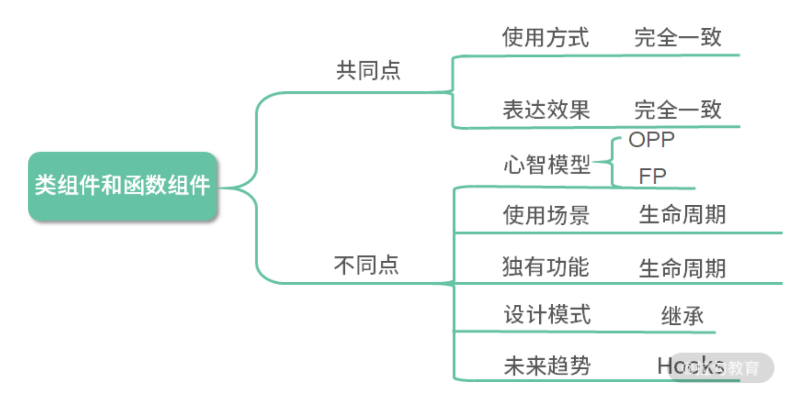
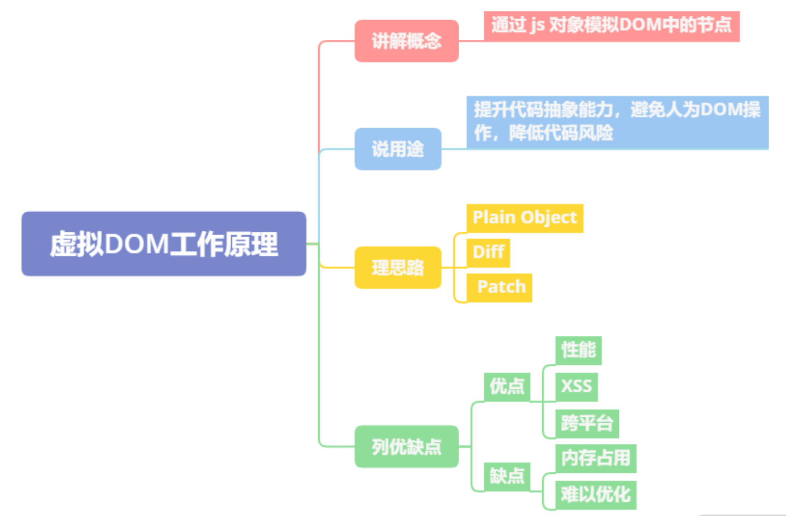
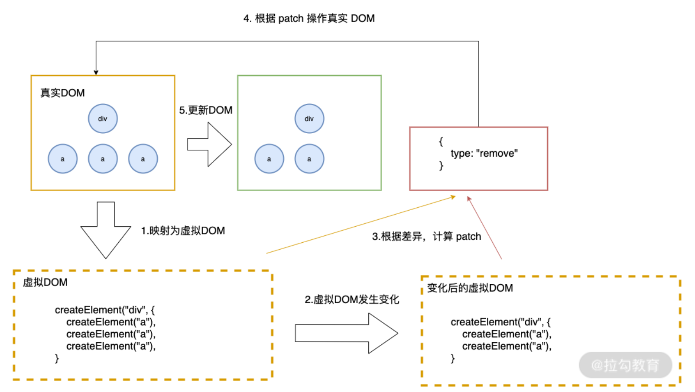
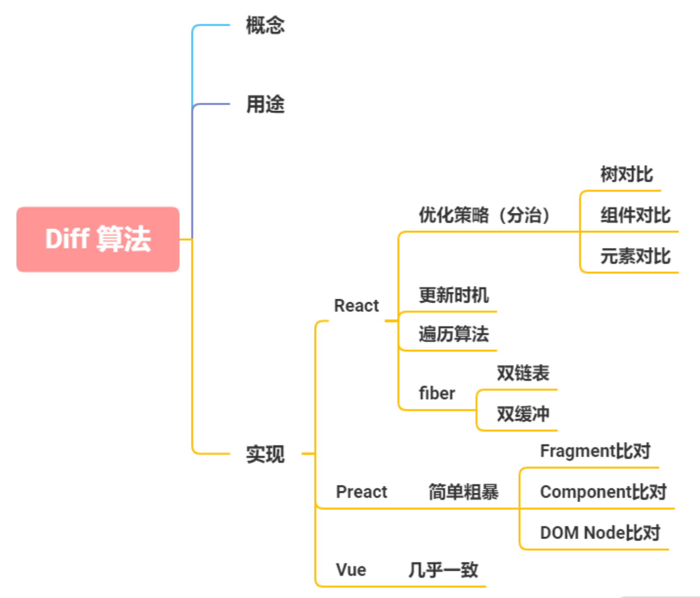
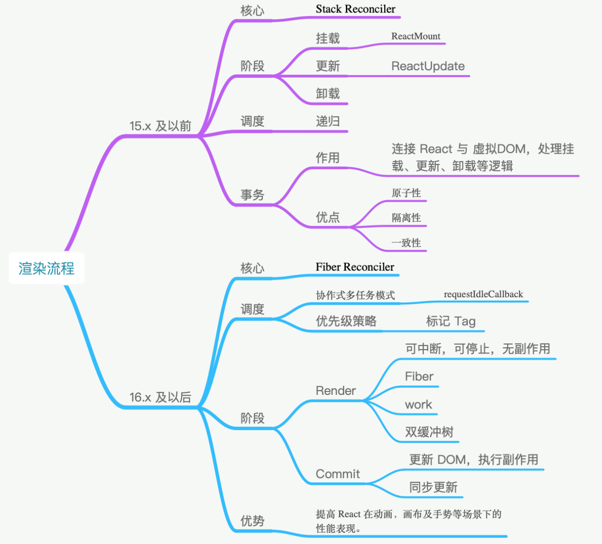

## 1、组件基础

（ 01 ~ 05 ）：从经典面试问题入手带你梳理组件的设计原理与思路，帮助你掌握分析和解决问题的技巧。

### 1.1 谈一谈对 React 的理解

   对待**概念题**，四字口诀“讲说理列”，**非线性**的结构化模式阐述答案

   - 讲概念：用简洁的话说清楚该技术是什么。最好能用一句话描述。

   - 说用途：描述该技术的用途。能够具体结合适合场景，拓展性的描述。

   - 理思路：梳理该技术的核心思路或运作流程。这个地方可深可浅，如果对其有足够深入的了解，建议详细地展开说明。

   - 优缺点，列一遍：对该技术栈的优缺点进行列举。列举优缺点肯定有与其他技术方案横向对比的过程，那么在这个过程中，切忌刻意地踩一捧一，容易引发面试官的反感。

   

   回答

   - React 是一个网页 UI 框架，通过组件化的方式解决视图层开发复用的问题，本质是一个组件化框架。

   - 它的核心设计思路有三点，分别是声明式、组件化与 通用性。
     - 声明式的优势在于直观与组合。
     - 组件化的优势在于视图的拆分与模块复用，可以更容易做到高内聚低耦合。
     - 通用性在于一次学习，随处编写。比如 React Native，React 360 等， 这里主要靠虚拟 DOM 来保证实现。
   - 这使得 React 的适用范围变得足够广，无论是 Web、Native、VR，甚至 Shell 应用都可以进行开发。这也是 React 的优势。
     但作为一个视图层的框架，React 的劣势也十分明显。它并没有提供完整的一揽子解决方 案，在开发大型前端应用时，需要向社区寻找并整合解决方案。虽然一定程度上促进了社区的繁荣，但也为开发者在技术选型和学习适用上造成了一定的成本。

### 1.2 为什么 React 要用` JSX`

“**为什么采用该技术方案**”这一类问题考察你的两个方面：

- 技术广度，深挖知识面涉猎广度，对流行框架的模板方案是否知悉了解；

- 技术方案调研能力。

**三步走技巧**

- 一句话解释 ` JSX`。首先能一句话说清楚 ` JSX`到底是什么。

- 
  核心概念。` JSX`用于解决什么问题？如何使用？

- 
  方案对比。与其他的方案对比，说明 React 选用 ` JSX`的必要性。


**回答**

- ` JSX`是一个 JavaScript 的语法扩展，结构类似 XML。` JSX`主要用于声明 React 元素，但 React 中并不强制使用 ` JSX`。即使使用了 ` JSX`，也会在构建过程中，通过 `Babel` 插件编译为 `React.createElement`。所以 ` JSX`更像是 `React.createElement` 的一种语法糖。
- 所以从这里可以看出，`React` 团队并不想引入` JavaScript` 本身以外的开发体系。而是希望通过合理的关注点分离保持组件开发的纯粹性。
- 接下来与 ` JSX`以外的三种技术方案进行对比。
  - 首先是模板，React 团队认为模板不应该是开发过程中的关注点，因为引入了模板语法、模板指令等概念，是一种不佳的实现方案。
  - 其次是模板字符串，模板字符串编写的结构会造成多次内部嵌套，使整个结构变得复杂，并且优化代码提示也会变得困难重重。
  - 最后是 `JXON`，同样因为代码提示困难的原因而被放弃。
- 所以 `React` 最后选用了 ` JSX`，因为 ` JSX`与其设计思想贴合，不需要引入过多新的概念，对编辑器的代码提示也极为友好。

**Babel 插件如何实现 `JSX` 到 `JS` 的编译？** 

Babel 读取代码并解析，生成 `AST`，再将 `AST` 传入插件层进行转换，在转换时就可以将 `JSX` 的结构转换为 `React.createElement` 的函数。如下代码所示：

```js
module.exports = function (babel) {
  var t = babel.types;
  return {
    name: "custom-jsx-plugin",
    visitor: {
      JSXElement(path) {
        var openingElement = path.node.openingElement;
        var tagName = openingElement.name.name;
        var args = []; 
        args.push(t.stringLiteral(tagName)); 
        var attribs = t.nullLiteral(); 
        args.push(attribs); 
        var reactIdentifier = t.identifier("React"); //object
        var createElementIdentifier = t.identifier("createElement"); 
        var callee = t.memberExpression(reactIdentifier, createElementIdentifier)
        var callExpression = t.callExpression(callee, args);
        callExpression.arguments = callExpression.arguments.concat(path.node.children);
        path.replaceWith(callExpression, path.node); 
      },
    },
  };
};
```

### 1.3 如何避免生命周期中的坑

“如何避免坑？”更深层的意思是“你蹚过多少坑？不仅需要对知识概念有体系化的认知——“讲概念，说用途，理思路，优缺点，来一遍”，还需要对你长期开发过程中的思考，有经验层面的方法总结

“如何避免坑？”换种思维思考也就是“为什么会有坑？”在代码编写中，遇到的坑往往会有两种：

- 在不恰当的时机调用了不合适的代码；
- 在需要调用时，却忘记了调用。

根据破题的思路，我们需要确立讨论的范围：

- 基于**周期**的梳理，确认生命周期函数的使用方式；

- 基于**职责**的梳理，确认生命周期函数的适用范围。

**答案**

避免生命周期中的坑需要做好两件事：

 -  不在恰当的时候调用了不该调用的代码；
 -  在需要调用时，不要忘了调用。

那么主要有这么 7 种情况容易造成生命周期的坑。

- `getDerivedStateFromProps` 容易编写反模式代码，使受控组件与非受控组件区分模糊。
- `componentWillMount` 在 React 中已被标记弃用，不推荐使用，主要原因是新的异步渲染架构会导致它被多次调用。所以网络请求及事件绑定代码应移至 `componentDidMount` 中。
- `componentWillReceiveProps` 同样被标记弃用，被 `getDerivedStateFromProps` 所取代，主要原因是性能问题。
- `shouldComponentUpdate` 通过返回 true 或者 false 来确定是否需要触发新的渲染。主要用于性能优化。
- `componentWillUpdate` 同样是由于新的异步渲染机制，而被标记废弃，不推荐使用，原先的逻辑可结合 `getSnapshotBeforeUpdate` 与 `componentDidUpdate` 改造使用。
- 如果在 `componentWillUnmount` 函数中忘记解除事件绑定，取消定时器等清理操作，容易引发 bug。
- 如果没有添加错误边界处理，当渲染发生异常时，用户将会看到一个无法操作的白屏，所以一定要添加。


### 1.4 类组件与函数组件有什么区别

**描述区别，就是求同存异的过程**：

- 在确认共性的基础上，才能找到它独特的个性；—— 你对组件的两种编写模式是否了解；
- 再通过具体的场景逐个阐述它的个性。—— 你是否具备在合适的场景下选用合适技术栈的能力。

基于以上的分析，我们可以整理出如下的答题思路：

- 从组件的使用方式和表达效果来总结**相同点**；
- 从代码实现、独有特性、具体场景等细分领域描述**不同点**。
- 如此多的不同点，本质上的原因是什么？为什么会设计两种不同的方式来完成同一件事

**答案**

- 作为组件而言，类组件与函数组件在使用与呈现上没有任何不同，性能上在现代浏览器中也不会有明显差异。
- 它们在开发时的心智模型上却存在巨大的差异。类组件是基于**面向对象编程**的，它主打的是继承、生命周期等核心概念；而函数组件内核是**函数式编程**，主打的是 immutable、没有副作用、引用透明等特点。
- 之前，在使用场景上，如果存在需要使用生命周期的组件，那么主推类组件；设计模式上，如果需要使用继承，那么主推类组件。
- 但现在由于 React Hooks 的推出，生命周期概念的淡出，函数组件可以完全取代类组件。
- 其次继承并不是组件最佳的设计模式，官方更推崇“**组合优于继承**”的设计概念，所以类组件在这方面的优势也在淡出。
- 性能优化上，类组件主要依靠 `shouldComponentUpdate` 阻断渲染来提升性能，而函数组件依靠`React.memo` 缓存渲染结果来提升性能。
- 从上手程度而言，类组件更容易上手，从未来趋势上看，由于React Hooks 的推出，函数组件成了社区未来主推的方案。
- 类组件在未来时间切片与并发模式中，由于生命周期带来的复杂度，并不易于优化。而函数组件本身轻量简单，且在 Hooks 的基础上提供了比原先更细粒度的逻辑组织与复用，更能适应 React 的未来发展。



### 1.5 如何设计 React 组件

考察你是否了解 React 组件的设计模式

React 社区中非常经典的分类模式：

- 把只作展示、独立运行、不额外增加功能的组件，称为**哑组件**，或**无状态组件**，还有一种叫法是**展示组件**；
- 把处理业务逻辑与数据状态的组件称为有**状态组件**，或**灵巧组件**，灵巧组件一定包含至少一个灵巧组件或者展示组件。

**答案**

- React 组件应从设计与工程实践两个方向进行探讨。从设计上而言，社区主流分类的方案是展示组件与灵巧组件。

- 展示组件内部没有状态管理，仅仅用于最简单的展示表达。展示组件中最基础的一类组件称作代理组件。代理组件常用于封装常用属性、减少重复代码。很经典的场景就是引入 Antd 的 Button时，你再自己封一层。如果未来需要替换掉 Antd 或者需要在所有的 Button 上添加一个属性，都会非常方便。基于代理组件的思想还可以继续分类，分为样式组件与布局组件两种，分别是将样式与布局内聚在自己组件内部。

- 灵巧组件由于面向业务，其功能更为丰富，复杂性更高，复用度低于展示组件。最经典的灵巧组件是容器组件。在开发中，我们经常会将网络请求与事件处理放在容器组件中进行。容器组件也为组合其他组件预留了一个恰当的空间。还有一类灵巧组件是高阶组件。高阶组件被 React 官方称为React 中复用组件逻辑的高级技术，它常用于抽取公共业务逻辑或者提供某些公用能力。常用的场景包括检查登录态，或者为埋点提供封装，减少样板代码量。高阶组件可以组合完成链式调用，如果基于装饰器使用，就更为方便了。高阶组件中还有一个经典用法就是反向劫持，通过重写渲染函数的方式实现某些功能，比如场景的页面加载圈等。但高阶组件也有两个缺陷，第一个是静态方法不能被外部直接调用，需要通过向上层组件复制的方式调用，社区有提供解决方案，使用 `hoistnon-react-statics` 可以解决；第二个是 refs 不能透传，使用 `React.forwardRef API` 可以解决。

- 从工程实践而言，通过文件夹划分的方式切分代码。我初步常用的分割方式是将页面单独建立一个目录，将复用性略高的 components 建立一个目录，在下面分别建立 basic、container 和 hoc 三类。这样可以保证无法复用的业务逻辑代码尽量留在 Page 中，而可以抽象复用的部分放入components 中。其中 basic 文件夹放展示组件，由于展示组件本身与业务关联性较低，所以可以使用 Storybook 进行组件的开发管理，提升项目的工程化管理能力。


## 2、状态管理

（ 06 ~ 08 ）：从状态的理解、运用与工程化实践入手，帮助你真正理解 React 的状态管理。

### 1.6 `setState` 是同步更新还是异步更新

**回答**

- `setState` 并非真异步，只是看上去像异步。在源码中，通过 `isBatchingUpdates` 来判断。

- `setState` 是先存进 `state` 队列还是直接更新，如果值为 true 则执行异步操作，为 false 则直接更新。

- 在 React 可以控制的地方，就为 true，比如在React 生命周期事件和合成事件中，都会走合并操作，延迟更新的策略。

- 但在 React 无法控制的地方，比如原生事件，具体就是在 `addEventListener` 、`setTimeout`、`setInterval` 等事件中，就只能同步更新。

- 一般认为，做异步设计是为了性能优化、减少渲染次数，React 团队还补充了两点。
  - 保持内部一致性。如果将 state 改为同步更新，那尽管 state 的更新是同步的，但是 props不是。
  - 启用并发更新，完成异步渲染。


### 1.7 React 如何面向组件跨层级通信

组件与组件之间的关系，大致可分为 4种。

- 父与子：父组件包裹子组件，父组件向子组件传递数据。
- 子与父：子组件存在于父组件之中，子组件需要向父组件传递数据。
- 兄弟：两个组件并列存在于父组件中，需要金属数据进行相互传递。
- 无直接关系：两个组件并没有直接的关联关系，处在一棵树中相距甚远的位置，但需要共享、传递数据。


**回答**

- 在跨层级通信中，主要分为一层或多层的情况。
- 如果只有一层，那么按照 React 的树形结构进行分类的话，主要有以下三种情况：父组件向子组件通信，子组件向父组件通信以及平级的兄弟组件间互相通信。
- 在父与子的情况下，因为 React 的设计实际上就是传递 Props 即可。那么场景体现在容器组件与展示组件之间，通过 `Props` 传递 `state`，让展示组件受控。
- 在子与父的情况下，有两种方式，分别是回调函数与实例函数。回调函数，比如输入框向父级组件返回输入内容，按钮向父级组件传递点击事件等。实例函数的情况有些特别，主要是在父组件中通过 React 的 ref API 获取子组件的实例，然后是通过实例调用子组件的实例函数。这种方式在过去常见于 `Modal` 框的显示与隐藏。这样的代码风格有着明显的 `jQuery` 时代特征，在现在的 React 社区中已经很少见了，因为流行的做法是希望组件的所有能力都可以通过 Props 控制。
- 多层级间的数据通信，有两种情况。第一种是一个容器中包含了多层子组件，需要最底部的子组件与顶部组件进行通信。在这种情况下，如果不断透传 `Props` 或回调函数，不仅代码层级太深，后续也很不好维护。第二种是两个组件不相关，在整个 React 的组件树的两侧，完全不相交。那么基于多层级间的通信一般有三个方案。
  - 第一个是使用 React 的 `Context API`，最常见的用途是做语言包国际化。
  - 第二个是使用全局变量与事件。全局变量通过在 `Windows` 上挂载新对象的方式实现，这种方式一般用于临时存储值，这种值用于计算或者上报，缺点是渲染显示时容易引发错误。全局事件就是使用 `document` 的自定义事件，因为绑定事件的操作一般会放在组件的 `componentDidMount` 中，所以一般要求两个组件都已经在页面中加载显示，这就导致了一定的时序依赖。如果加载时机存在差异，那么很有可能导致两者都没能对应响应事件。
  - 第三个是使用状态管理框架，比如 `Flux`、`Redux` 及 `Mobx`。优点是由于引入了状态管理，使得项目的开发模式与代码结构得以约束，缺点是学习成本相对较高。

### 1.8 列举一种 React 状态管理框架


**答题**

- 首先介绍 Flux，Flux 是一种使用**单向数据流**的形式来组合 React 组件的应用架构。Flux 包含了 4 个部分，分别是 Dispatcher、 Store、View、Action。Store 存储了视图层所有的数据，当 Store 变化后会引起 View 层的更新。如果在视图层触发一个 Action，就会使当前的页面数据值发生变化。Action 会被 Dispatcher 进行统一的收发处理，传递给 Store 层，Store 层已经注册过相关 Action 的处理逻辑，处理对应的内部状态变化后，触发 View 层更新。
- Flux 的优点是单向数据流，解决了 `MVC` 中数据流向不清的问题，使开发者可以快速了解应用行为。从项目结构上简化了视图层设计，明确了分工，数据与业务逻辑也统一存放管理，使在大型架构的项目中更容易管理、维护代码。
- 其次是 `Redux`，`Redux`本身是一个 JavaScript 状态容器，提供可预测化状态的管理。社区通常认为 `Redux` 是 Flux 的一个简化设计版本，但它吸收了 Elm 的架构思想，更像一个混合产物。它提供的状态管理，简化了一些高级特性的实现成本，比如撤销、重做、实时编辑、时间旅行、服务端同构等。`Redux`的核心设计包含了三大原则：单一数据源、纯函数 Reducer、State 是只读的。`Redux`中整个数据流的方案与 Flux 大同小异。`Redux`中的另一大核心点是处理“副作用”，AJAX 请求等异步工作，或不是纯函数产生的第三方的交互都被认为是 “副作用”。这就造成在纯函数设计的 `Redux`中，处理副作用变成了一件至关重要的事情。社区通常有两种解决方案：
  - 第一类是在 Dispatch 的时候会有一个 `middleware` 中间件层，拦截分发的 Action 并添加额外的复杂行为，还可以添加副作用。第一类方案的流行框架有 Redux-thunk、Redux-Promise、ReduxObservable、Redux-Saga 等。
  - 第二类是允许 Reducer 层中直接处理副作用，采取该方案的有 React Loop，React Loop 在实现中采用了 Elm 中分形的思想，使代码具备更强的组合能力。
  - 除此以外，社区还提供了更为工程化的方案，比如 rematch 或 dva，提供了更详细的模块架构能力，提供了拓展插件以支持更多功能。
- `Redux` 的优点很多：结果可预测；代码结构严格易维护；模块分离清晰且小函数结构容易编写单元测试；Action 触发的方式，可以在调试器中使用时间回溯，定位问题更简单快捷；单一数据源使服务端同构变得更为容易；社区方案多，生态也更为繁荣。
- 最后是 `Mobx`，`Mobx` 通过监听数据的属性变化，可以直接在数据上更改触发UI 的渲染。在使用上更接近 Vue，比起 Flux 与 Redux 的手动挡的体验，更像开自动挡的汽车。`Mobx` 的响应式实现原理与 `Vue` 相同，以 `Mobx 5` 为分界点，5 以前采用 `Object.defineProperty` 的方案，5 及以后使用Proxy 的方案。它的优点是样板代码少、简单粗暴、用户学习快、响应式自动更新数据让开发者的心智负担更低。

在实现 `Redux` 的时候，需要注意两个地方。

- **`createStore`**。即通过 `createStore`，注入 `Reducer` 与 `middleware`，生成 Store 对象。
- **Store 对象的`getState`、`subscribe`与`dispatch` 函数**。`getState` 获取当前状态树，subscribe 函数订阅状态树变更，dispatch 发送 Action。

## 3、渲染流程

（ 09 ~ 12 ）：只有理解渲染流程，才能做出正确的性能优化。该模块可以加强你对 React 工作模式的理解程度。

### 1.9 Virtual DOM 的工作原理是什么




**答题**

- 虚拟  `DOM` 的**工作原理**是通过 `JS` 对象模拟 `DOM` 的节点。在 `Facebook` 构建 `React` 初期时，考虑到要提升代码抽象能力、避免人为的  `DOM` 操作、降低代码整体风险等因素，所以引入了虚拟 `DOM` 。
- 虚拟  `DOM` 在**实现上**通常是 `Plain Object`，以 `React` 为例，在 `render` 函数中写的 `JSX` 会在 Babel插件的作用下，编译为 `React.createElement` 执行 `JSX` 中的属性参数。
- `React.createElement` 执行后会返回一个 `Plain Object`，它会描述自己的 `tag` 类型、`props` 属性以及 `children` 情况等。这些 `Plain Object` 通过树形结构组成一棵虚拟 `DOM` 树。当状态发生变更时，将变更前后的虚拟  `DOM` 树进行差异比较，这个过程称为 `diff`，生成的结果称为 `patch`。计算之后，会渲染 `Patch` 完成对真实  `DOM` 的操作。
- 虚拟  `DOM` 的**优点**主要有三点：改善大规模 `DOM` 操作的性能、规避 `XSS` 风险、能以较低的成本实现跨平台开发。
- 虚拟  `DOM` 的**缺点**在社区中主要有两点。
  - 内存占用较高，因为需要模拟整个网页的真实 `DOM`。
  - 高性能应用场景存在难以优化的情况，类似像 `Google Earth` 一类的高性能前端应用在技术选型上往往不会选择 `React`。

### 1.10 与其他框架相比，React 的 `diff` 算法有何不同

原理题需要按照“**讲概念**，**说用途**，**理思路**，**优缺点**，**列一遍**”的思路来答题。






**答题**

- `diff` 算法是指生成更新补丁的方式，主要应用于虚拟 DOM 树变化后，更新真实 DOM。所以 `diff`算法一定存在这样一个过程：触发更新 → 生成补丁 → 应用补丁。
- React 的 `diff` 算法，触发更新的时机主要在 state 变化与 hooks 调用之后。此时触发虚拟 DOM 树变更遍历，采用了深度优先遍历算法。但传统的遍历方式，效率较低。为了优化效率，使用了分治的方式。将单一节点比对转化为了 3 种类型节点的比对，分别是树、组件及元素，以此提升效率。
  - 树比对：由于网页视图中较少有跨层级节点移动，两株虚拟 DOM 树只对同一层次的节点进行比较。
  - 组件比对：如果组件是同一类型，则进行树比对，如果不是，则直接放入到补丁中。
  - 元素比对：主要发生在同层级中，通过标记节点操作生成补丁，节点操作对应真实的 DOM 剪裁操作。
- 以上是经典的 `React diff` 算法内容。自 React 16 起，引入了 Fiber 架构。为了使整个更新过程可随时暂停恢复，节点与树分别采用了 `FiberNode` 与 `FiberTree` 进行重构。`fiberNode` 使用了双链表的结构，可以直接找到兄弟节点与子节点。整个更新过程由 `current` 与 `workInProgress` 两株树双缓冲完成。`workInProgress` 更新完成后，再通过修改 current 相关指针指向新节点。
- `Preact` 的 `Diff` 算法相较于 `React`，整体设计思路相似，但最底层的元素采用了真实 `DOM` 对比操作，也没有采用 `Fiber` 设计。
- `Vue` 的 `Diff` 算法整体也与 `React` 相似，同样未实现 `Fiber` 设计。然后进行横向比较，`React` 拥有完整的 `Diff` 算法策略，且拥有随时中断更新的时间切片能力，在大批量节点更新的极端情况下，拥有更友好的交互体验。
- `Preact` 可以在一些对性能要求不高，仅需要渲染框架的简单场景下应用。`Vue` 的整体 `diff` 策略与 `React` 对齐，虽然缺乏时间切片能力，但这并不意味着 `Vue` 的性能更差，因为在 `Vue 3` 初期引入过，后期因为收益不高移除掉了。除了高帧率动画，在 `Vue` 中其他的场景几乎都可以使用防抖和节流去提高响应性能。

### 1.11  如何解释 React 的渲染流程



**回答**

- React 的渲染过程大致一致，但协调并不相同，以 React 16 为分界线，分为 `Stack Reconciler` 和 `Fiber Reconciler`。这里的协调从狭义上来讲，特指 React 的 `diff` 算法，广义上来讲，有时候也指 React 的 reconciler 模块，它通常包含了 `diff` 算法和一些公共逻辑。
- 回到 Stack Reconciler 中，Stack Reconciler 的核心调度方式是**递归**。调度的基本处理单位是事务，它的事务基类是 Transaction，这里的事务是 React 团队从后端开发中加入的概念。在 `React16` 以前，挂载主要通过 `ReactMount` 模块完成，更新通过 `ReactUpdate` 模块完成，模块之间相互分离，落脚执行点也是事务。
- 在 React 16 及以后，协调改为了 Fiber Reconciler。它的调度方式主要有两个特点，第一个是协作式多任务模式，在这个模式下，线程会定时放弃自己的运行权利，交还给主线程，通过`requestIdleCallback` 实现。第二个特点是策略优先级，调度任务通过标记 tag 的方式分优先级执行，比如动画，或者标记为 high 的任务可以优先执行。Fiber Reconciler的基本单位是 Fiber，Fiber 基于过去的 React Element 提供了二次封装，提供了指向父、子、兄弟节点的引用，为 diff工作的双链表实现提供了基础。
- 在新的架构下，整个生命周期被划分为 Render 和 Commit 两个阶段。Render 阶段的执行特点是可中断、可停止、无副作用，主要是**通过构造 `workInProgress` 树计算出 `diff`**。以 current 树为基础，将每个 Fiber 作为一个基本单位，自下而上逐个节点检查并构造 `workInProgress` 树。这个过程不再是递归，而是基于循环来完成。
- 在执行上通过 `requestIdleCallback` 来调度执行每组任务，每组中的每个计算任务被称为 work，每个 work 完成后确认是否有优先级更高的 work 需要插入，如果有就让位，没有就继续。优先级通常是标记为动画或者 high 的会先处理。每完成一组后，将调度权交回主线程，直到下一次requestIdleCallback 调用，再继续构建 workInProgress 树。
- 在 commit 阶段需要处理 effect 列表，这里的 effect 列表包含了根据 `diff `更新 DOM 树、回调生命周期、响应 ref 等。但一定要注意，这个阶段是同步执行的，不可中断暂停，所以不要在 `componentDidMount`、`componentDidUpdate`、`componentWiilUnmount` 中去执行重度消耗算力的任务。
- 如果只是一般的应用场景，比如管理后台、`H5` 展示页等，两者性能差距并不大，但在动画、画布及手势等场景下，Stack Reconciler 的设计会占用占主线程，造成卡顿，而 fiber reconciler 的设计则能带来高性能的表现。

### 1.12  React 的渲染异常会造成什么后果


**答题**

- React 渲染异常的时候，在没有做任何拦截的情况下，会出现整个页面白屏的现象。它的成型原因是在渲染层出现了 JavaScript 的错误，导致整个应用崩溃。这种错误通常是**在 render 中没有控制好空安全，使值取到了空值**。
- 所以在治理上，我的方案是这样的，从预防与兜底两个角度去处理。
  - 在预防策略上，引入空安全相关的方案，在做技术选型时，我主要考虑了三个方案：第一个是引入外部函数，比如 `Facebook` 的 `idx` 或者 `Lodash.get`；第二个是引入 `Babel` 插件，使用 ES 2020 的标准——可选链操作符；第三个是 `TypeScript`，它在 3.7 版本以后可以直接使用可选链操作符。最后我选择了引入 Babel 插件的方案，因为这个方案外部依赖少，侵入性小，而且团队内没有 TS 的项目。
  - 在兜底策略上，因为考虑到团队内部和我存在一样的问题，就抽取了兜底的公共高阶组件，封装成了 `NPM` 包供团队内部使用。
- 从最终的数据来看，预防与治理方案覆盖了团队内 100% 的 React 项目，头三个月兜底组件统计到了日均 10 次的报警信息，其中有 10% 是公司关键业务。那么经过分析与统计，首先是为关键的`UI` 组件添加兜底组件进行拦截，然后就是做内部培训，对易错点的代码进行指导，加强 `CodeReview`。后续到现在，线上只收到过 1 次报警。

## 4、性能优化

（ 13 ~ 15 ）：从工程化的视角阐述性能优化问题，带你掌握中高级职位必杀技。

### 1.13  如何分析和调优性能瓶颈

答题流程：

- **建立衡量标准**，这样可以为优化后计算收益提供指标。衡量标准应该是可量化的，所以要制定可量化的指标。在确认指标之后，还需要有**量化基础**，有**数据积累**，那么就需要考虑如何进行数据采集。
- **确认优化原因**：有了数据基础后，还需要根据实际场景分析优化能转化多少价值，确认是否需要优化。
- **实施方案**：在有了优化点以后，需要制定具体的提升方案并实施。
- **计算收益**：在优化方案实施后，需要通过数据描述收益效果。

**RAIL** 指响应（Response）、动画（Animation）、浏览器空闲时间（Idle）、加载（Load）四个方面：

- 响应：应在 50 毫秒内完成事件处理并反馈给用户；
- 动画：10 毫秒内生成一帧；
- 浏览器空闲时间：最大化利用浏览器空闲时间；
- 加载：在 5 秒内完成页面资源加载且使页面可交互。

**Lighthouse** 

- Lighthouse 并不能真实地反映出每个用户的设备的实际性能数据；
- Lighthouse 的分数反应的是业界的标准，而非项目实际需求的标准。(对于管理后台而言，并不需要对标 C 端的加载速度)

自行完成性能指标的采集，可以考虑使用网页 `APM` 工具：

- 其中国际上比较老牌的就是 New Relic，做了很多年，实力十分强悍；
- 国内的话可以直接考虑使用阿里云的 ARMS，建议你可以看下它的开发文档，有个基本概念，或者用开源项目自建。

**指标采集工作**

- **`FCP`**（`First Contentful Paint`），**首次绘制内容的耗时**。首屏统计的方式一直在变，起初是通过记录 `window.performance.timing` 中的 `domComplete` 与 `domLoading` 的时间差来完成，但这并不具备交互意义，现在通常是记录**初次加载**并**绘制内容**的时间。
  - **`SSR`**，也就是走服务端渲染路线，常用的方案有 `next.js` 等。
  - **骨架屏**，在内容还没有就绪的时候，先通过渲染骨架填充页面，给予用户反馈。
- **`TTI`**（`Time to Interact`），**是页面可交互的时间**。通常通过记录 `window.performance.timing` 中的 `domInteractive` 与 `fetchStart` 的时间差来完成。
  - **核心内容**在 React 中同步加载；
  - **非核心内容**采取异步加载的方式延迟加载
  - **内容中的图片**采用懒加载的方式避免占用网络资源。
- **Page Load**，**页面完全加载时间**。通常通过记录 `window.performance.timing` 中的`loadEventStart` 与 `fetchStart` 的时间差来完成
  - 异步加载主要由 `Webpack` 打包 `common chunk`与异步组件的方式完成。
- **FPS**，**前端页面帧率**。通常是在主线程打点完成记录。其原理是 `requestAnimationFrame` 会在页面重绘前被调用，而 FPS 就是计算两次之间的时间差。
  - 在 React 中引起卡顿的主要原因有**长列表**与**重渲染**。
  - 长列表直接使用 `react-virtualized` 或者 `react-window` 就可以。
- **静态资源**及**`API`** **请求成功率**。通常是通过 `window.performance.getEntries( )` 来获取相关信息。
  - 对于静态资源而言，能用 `CDN` 就用 `CDN`，可以大幅提升静态资源的成功率。
  - 如果域名解析失败，就可以采取静态资源域名自动切换的方案；还有一个简单的方案是直接寻求`SRE` 的协助。
  - 如果有运营商对内容做了篡改，我推荐使用 `HTTPS`。

优化最难的地方在于**定目标**

- 在性能监控中有一个概念叫**`TP`**（Top Percentile），比如 `TP50`、`TP90`、`TP99` 和 `TP999` 等指标，指高于50%、90%、99% 等百分线的情况。如 `TP50` 就意味着，50% 的用户打开页面绘制内容的时间不超过 6秒，90%的用户不超过 8 秒。如果要提升 `FCP`，那么就需要提升 `TP 50`、`TP90`、`TP999` 下的数据，这才是有正确方向的目标。
- 其次就是场景，如果是 `2C` 的页面，那么 `FCP`、`TTI`、`FPS`、`Page Load`、静态资源及 `API` 请求成功率等几个指标都很重要，会直接影响**关键业务的转化率**，而管理后台，更关注的是使用起来功能是否完整，运行是否流畅，对加载速度并没有很高的要求，所以通常只对 `FPS` 、静态资源及 `API` 请求成功率这三个指标更为关注。显然，指标的选择取决于你的业务形态。
- 如果一个移动端页面加载时长超过 3 秒，用户就会放弃而离开。”那么将 `TP999` 从 5 秒优化到 3 秒以内，就可以得出具体的用户转化率数据。这样的技术优化才是对公司有帮助的。

**回答**

- 我负责的业务是 `CRM` 管理后台，用户付费进入操作使用，有一套非常标准的业务流程。在我做完性能优化后，整个付费率一下提升了 17%，效果还可以。
- 前期管理后台的基础性能数据是没有的，我接手后接入了一套 `APM` 工具，才有了基础的性能数据。然后我对指标观察了一周多，思考了业务形态，发现其实用户对后台系统的加载速度要求并不高，但对系统的稳定性要求比较高。我也发现静态资源的加载成功率并不高，`TP99` 的成功率大约在 91%，这是因为静态资源直接从服务器拉取，服务器带宽形成了瓶颈，导致加载失败。我对Webpack 的构建工作流做了改造，支持发布到 `CDN`，改造后 `TP99` 提升到了 `99.9%`。


### 1.14  如何避免重复渲染

**答题方式**

- **优化时机**，说明应该在什么时候做优化，这样做的理由是什么；
- **定位方式**，用什么方式可以快速地定位相关问题；
- **常见的坑**，明确哪些常见的问题会被我们忽略，从而导致重渲染；
- **处理方案**，有哪些方案可以帮助我们解决这个问题。

**业务标准**

- 一般 50 ~ 60 FPS，就相当流畅了；
- 在 30 ~ 50 FPS 之间就因人而异了，通常属于尚可接受的范畴；
- 在 30 FPS 以下属于有明显卡顿，会令人不适。

**客观运行环境**

- 如果该用户将页面运行在 IE 中，而你的业务不需要支持 IE，低帧率需要优化吗？显然也是不需要的。
- 如果该用户的手机是 5 年前的旧机型，配置相当低，运行内存只有 512 MB，那还需要优化吗？你的业务如果需要兼容这部分用户的机型，那就要去做。

**复现**

- 首要采取的行动就是寻找运行该页面的**设备机型**与**浏览器版本**，确保能在相同环境下复现。
- 如果还是不能，就需要确认影响范围，是否只是在特定的设备或者特定的浏览器版本才会出现该问题，这样就需要转入长期作战，增加埋点日志，采集更多的数据进行复现方式的分析。

工具：

- 通过 Chrome 自带的 Performance 分析，主要用于查询 JavaScript 执行栈中的耗时，确认函数卡顿点，由于和重复渲染关联度不高，你可以自行查阅使用文档；
- 通过 React Developer Tools 中的 Profiler 分析组件渲染次数、开始时间及耗时。

### 1.15  如何提升 React 代码可维护性


## 5、React Hooks

（ 16 ~ 18 ）：解析 Hooks 的原理，`API` 的区别及最佳的设计模式，帮助你完美胜任组件模式向 Hooks 转移的工作。

### 1.16  React Hook 的使用限制有哪些


### 1.17  `ueEffect` 与 `ueLayoutEffect` 区别在哪里


### 1.18  谈谈 React Hook 的设计模式


## 6、React 生态

（ 19 ~ 20 ）：讲解面试必考的 React-Router 以及常用的工具库，带你探索 React 生态圈，帮助你掌握经过时间和大型项目验证的 React 工具。

