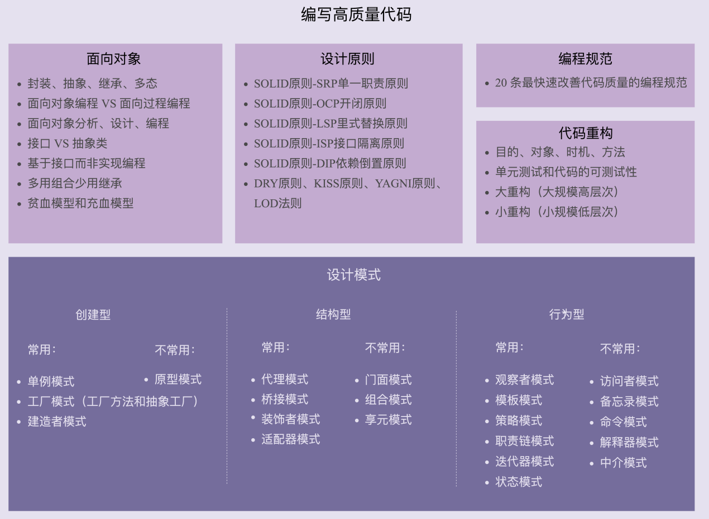
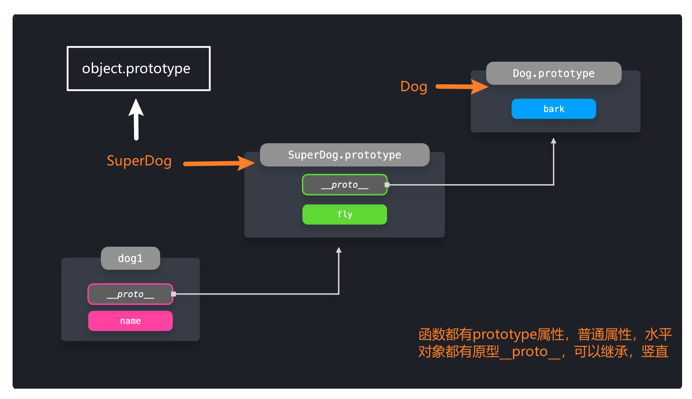

## 1、创建型——对象的创建

主要解决对象的创建问题，封装复杂的创建过程，解耦对象的创建代码和使用代码。

### 1.1 单例模式

- 单例模式用来创建全局唯一的对象 Share a single global instance throughout our application
- `JS`可以直接使用对象，Java这样根据类创建对象的语言比较适用


- 这个单一的实例可以在应用中共享，适合管理应用程序中的**全局状态**。推荐使用 **`Redux`** or **React Context** 管理 `global state` ，因为可以确保全局状态按照我们的意图被改变，组件不能直接更新状态。


```js
let instance;
let counter = 0;
 
class Counter {
  constructor() {
    if (instance) { // 只能有一个实例
      throw new Error("You can only create one instance!");
    }
    instance = this;
  }
 
  getInstance() {
    return this;
  }
 
  getCount() {
    return counter;
  }
 
  increment() {
    return ++counter;
  }
 
  decrement() {
    return --counter;
  }
}
 
const singletonCounter = Object.freeze(new Counter()); // 不允许修改
export default singletonCounter;
```

### 1.2 工厂模式

- 工厂模式用来创建不同但是相关类型的对象（继承同一父类或者接口的一组子类），由给定的参数来决定创建哪种类型的对象。
- Use a factory function in order to create objects


- 工厂模式不使用new关键字而返回一个对象的函数，用来创建可配置对象

```js
const createUser = ({ firstName, lastName, email }) => ({
  firstName,
  lastName,
  email,
  fullName() {
    return `${this.firstName} ${this.lastName}`;
  },
});

// 使用class可以达到同样效果，并且更节约内存
class User {
  constructor(firstName, lastName, email) {
    this.firstName = firstName;
    this.lastName = lastName;
    this.email = email;
  }
 
  fullName() { // new创建实例共享这个方法
    return `${this.firstName} ${this.lastName}`;
  }
}
```

### 1.3 原型模式

- 原型模式针对创建成本比较大的对象，利用对已有对象进行复制的方式进行创建，以达到节省创建时间的目的。
- Share properties among many objects of the same type

```js
class Dog {
  constructor(name) {
    this.name = name;
  }

  bark() {
    console.log("Woof!");
  }
}

class SuperDog extends Dog {
  constructor(name) {
    super(name);
  }

  fly() {
    console.log(`Flying!`);
  }
}

const dog1 = new SuperDog("Daisy");
dog1.bark();
dog1.fly();
```



## 2、结构型——类或对象的组合

主要总结了一些类或对象组合在一起的经典结构，这些经典的结构可以解决特定应用场景的问题。

常用

- 代理模式6
- 桥接模式
- 装饰器模式15
- 适配器模式17

不常用

- 门面模式
- 组合模式10
- 享元模式12

### 2.1 代理模式

代理者处理复杂逻辑，被代理者实现基本功能

```js
/**************** 计算乘积 *****************/ 
var mult = function(){ // 负责纯粹计算
 var a = 1; 
 for ( var i = 0, l = arguments.length; i < l; i++ ){ 
 	a = a * arguments[i]; 
 } 
 return a; 
}; 
/**************** 计算加和 *****************/ 
var plus = function(){ 
 var a = 0; 
 for ( var i = 0, l = arguments.length; i < l; i++ ){ 
	 a = a + arguments[i]; 
 } 
 return a; 
}; 
/**************** 创建缓存代理的工厂 *****************/ 
var createProxyFactory = function( fn ){ // 增加缓存逻辑
 var cache = {}; 
 return function(){ 
 	var args = Array.prototype.join.call( arguments, ',' ); 
 	if ( args in cache ){ 
 		return cache[ args ]; 
 	} 
 	return cache[ args ] = fn.apply( this, arguments ); 
 } 
}; 
var proxyMult = createProxyFactory( mult ), 
proxyPlus = createProxyFactory( plus ); 
alert ( proxyMult( 1, 2, 3, 4 ) ); // 输出：24 
alert ( proxyMult( 1, 2, 3, 4 ) ); // 输出：24 
alert ( proxyPlus( 1, 2, 3, 4 ) ); // 输出：10 
alert ( proxyPlus( 1, 2, 3, 4 ) ); // 输出：10
```

**`JS`中的Proxy**

```js
var target = {};
var obj = new Proxy(target, {
  get: function(target, propKey) {
    return 35;
  }
}); // new Proxy(target, handler) 和 new Object一样会创建对像，只不过对象受第二个参数控制

obj.time // 35 target.time = 35
obj.name // 35
```

**Reflect**

`Reflect`对象与`Proxy`对象一样，也是 `ES6` 为了操作对象而提供的新 `API`。有了`Reflect`对象以后，很多操作会更易读。

```js
var loggedObj = new Proxy(obj, {
  get(target, name) {
    console.log('get', target, name);
    return Reflect.get(target, name);
  },
  deleteProperty(target, name) {
    console.log('delete' + name);
    return Reflect.deleteProperty(target, name);
  },
  has(target, name) {
    console.log('has' + name);
    return Reflect.has(target, name);
  }
});
```

**适用场景**

- it can help with validation, formatting, notifications, or debugging.  被代理者对数据校验、格式化、通知、调试

- 图片懒加载，被代理者实现图片加载功能，代理者实现图片未加载前显示loading，图片未加载完成后显示图片

- 合并处理发送请求，被代理者实现发送请求功能，代理者通过`setTimeout`把规定时间内请求缓存起来，时间到了使用被代理者发送请求

- 过度使用代理对象或在每次处理程序方法调用时执行大量操作很容易对应用程序的性能产生负面影响。对性能要求较高的代码最好不要使用代理。

### 2.2 装饰器模式

- 代理模式强调一种关系（Proxy 与它的实体之间的关系），这种关系可以静态的表达，也就是说，这种关系在一开始就可以被确定。而装饰者模式用于一开始不能确定对象的全部功能时。
- 代理模式通常只有一层代理对本体的引用，而装饰者模式经常会形成一条长长的装饰链。
- 装饰者模式是实实在在的为对象增加新的职责和行为，而代理做的事情还是跟本体一样，最终都是设置`src`。但代理可以加入一些“聪明”的功能，比如在图片真正加载好之前，先使用一张占位的`loading`图片反馈给客户。

```js
// 用AOP验证表单
/*<body>
 用户名：<input id="username" type="text"/>
 密码： <input id="password" type="password"/>
 <input id="submitBtn" type="button" value="提交">
</body>*/
const username = document.getElementById( 'username' ),
    password = document.getElementById( 'password' ),
    submitBtn = document.getElementById( 'submitBtn' );
Function.prototype.before = function( beforefn ){
    const __self = this;
    return function(){
        if ( beforefn.apply( this, arguments ) === false ){
            // beforefn 返回 false 的情况直接 return，不再执行后面的原函数
            return;
        }
        return __self.apply( this, arguments );
    }
}
const validate = function(){
    if ( username.value === '' ){
        alert ( '用户名不能为空' );
        return false;
    }
    if ( password.value === '' ){
        alert ( '密码不能为空' );
        return false;
    }
}
let formSubmit = function(){
    const param = {
        username: username.value,
        password: password.value
    }
    ajax( 'http://xxx.com/login', param );
}
// 把校验规则动态接在 formSubmit 函数之前，validate 成为一个即插即用的函数
formSubmit = formSubmit.before( validate ); // .before返回函数
submitBtn.onclick = function(){
    formSubmit(); // 运行.before函数
}
```

### 2.3 适配器模式

- 如果现有的接口已经能够正常工作，那我们就永远不会用上适配器模式。适配器模式是一种“亡羊补牢”的模式
- 适配器模式主要用来解决两个已有接口之间不匹配的问题，它不考虑这些接口是怎样实现的，也不考虑它们将来可能会如何演化。适配器模式不需要改变已有的接口，就能够使它们协同作用。
- 装饰者模式和代理模式也不会改变原有对象的接口，但装饰者模式的作用是为了给对象增加功能。装饰者模式常常形成一条长的装饰链，而适配器模式通常只包装一次。
- 代理模式是为了控制对对象的访问，通常也只包装一次。

```js
var googleMap = { 
 show: function(){ 
 	console.log( '开始渲染谷歌地图' ); 
 } 
}; 
var baiduMap = { 
 	display: function(){ 
 	console.log( '开始渲染百度地图' ); 
 } 
}; 
var baiduMapAdapter = { 
 show: function(){ 
 	return baiduMap.display();
 } 
}; 
renderMap( googleMap ); // 输出：开始渲染谷歌地图
renderMap( baiduMapAdapter ); // 输出：开始渲染百度地图
```

2.4 组合模式

3.5 享元模式

## 3、行为型——类或对象之间的交互

常用

- 观察者模式8
- 模板模式11
- 策略模式5
- 职责链模式13
- 迭代器模式7
- 状态模式16

不常用

- 访问者模式
- 备忘录模式
- 命令模式9
- 解释器模式
- 中介模式14

## 4、other

### Provider Pattern

