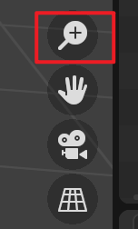
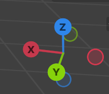
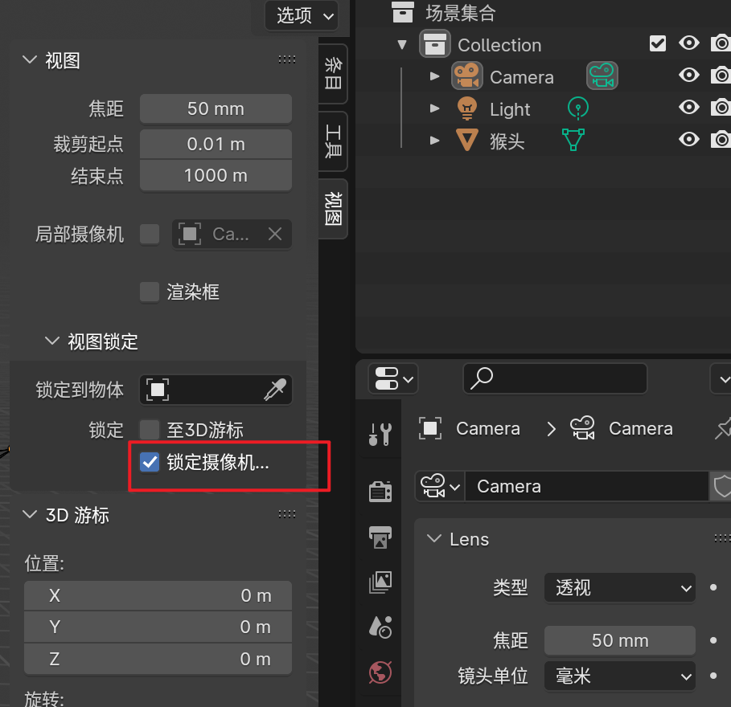
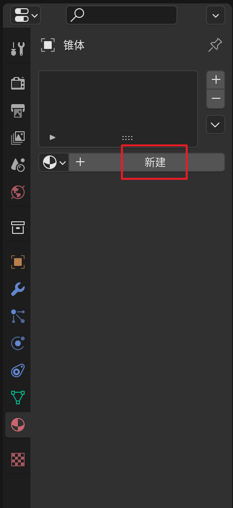
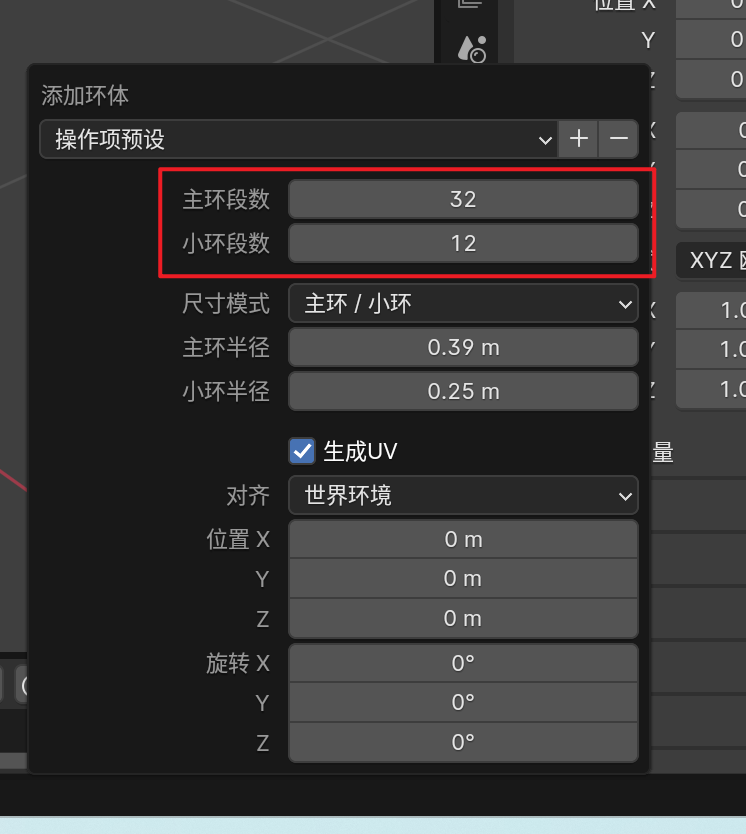
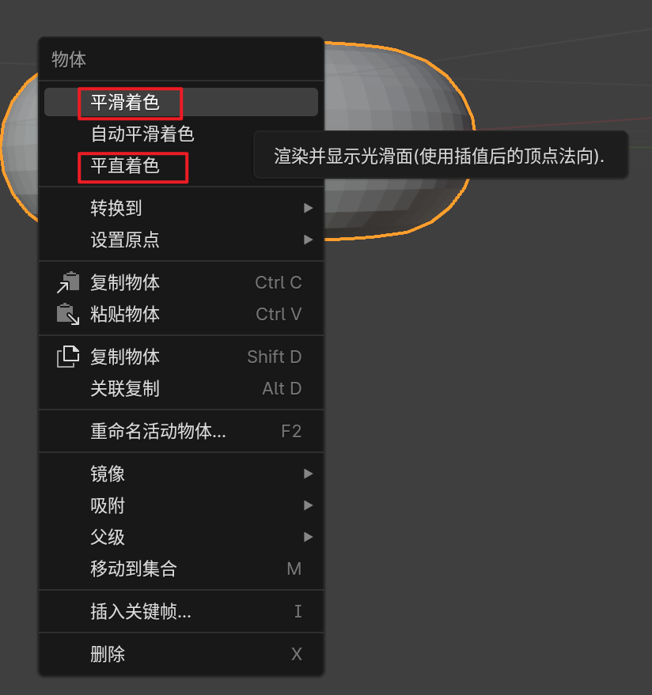
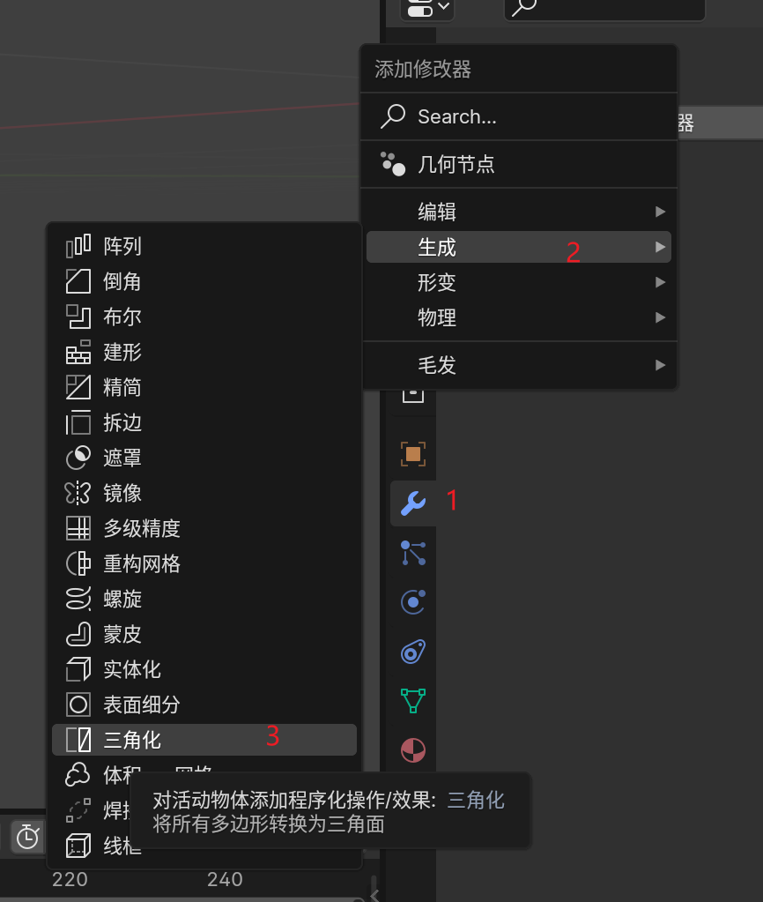
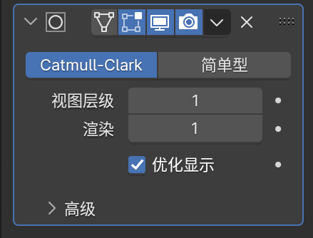
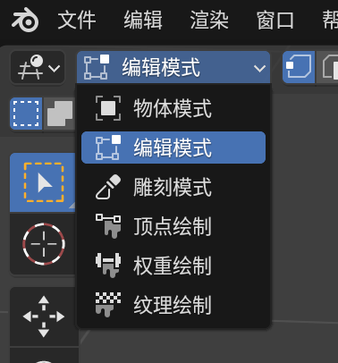

1、基本操作

`4K`屏幕菜单小，可以 编辑--偏好设置--界面--分辨率缩放1.5

**添加物体** shift + A

**放大缩小** 滚动滑轮/平滑缩放 ctrl + 按住鼠标中键 + 前后滑动鼠标/按住放大键滑动鼠标

**旋转** 按住滚轮/按住鼠标左键拖动右上角圆圈/Alt + 按住鼠标左键

**非焦点平移** shift + 按住鼠标中键 + 前后滑动鼠标/左键按住小手滑动图标

**移动物体** 

选中 + G + 移动鼠标

轴移动物体 选中 + G + X/Y/Z/按住鼠标中键 +移动鼠标  

取消移动回到原点 esc / 右键点击

**导出图像** F12 / 渲染--导出图像

**切换摄像机视角** 0

**移动摄像机** 

直接移动/在摄像机视角下移动 G选中，鼠标移动，XYZ按键方向移动，按鼠标中键放大缩小（物体是快速选中XYZ）

N唤出菜单，暂时跟随摄像机视角，此时摄影机是焦点

**缩放** 

普通 S

轴缩放 S + X/X/Z

**旋转**

焦点旋转 R

焦点轴旋转 R + X/X/Z

自由旋转 R + 鼠标中键

**新建材质**

2、面包圈

新建物体后，快速编辑 F9

分辨率太高对新手不友好，而且渲染时间很长

减少锯齿感 右键--平滑着色 不会影响渲染时间但是看起来分辨率很高的样子

恢复原状，平直着色

外形锯齿感修改 表面细分，增加更多平面达到细节优化效果

ctrl + 1

视图层级--blender中看到  渲染--最后的成图

切换到编辑模式 Tab

