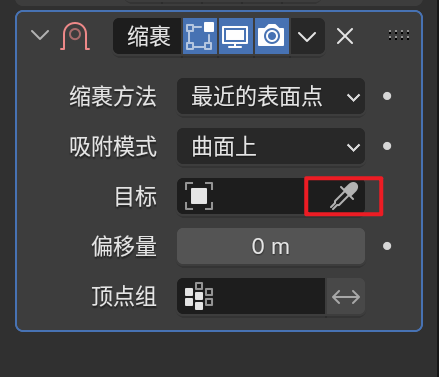

## 1、基本操作

`4K`屏幕菜单小，可以 编辑--偏好设置--界面--分辨率缩放1.5

**添加物体** shift + A

**放大缩小** 

- 滚动滑轮
- 平滑缩放 ctrl + 按住鼠标中键 + 前后滑动鼠标
- 按住放大键滑动鼠标

**旋转** 

- 按住滚轮
- 按住鼠标左键拖动右上角圆圈
- Alt + 按住鼠标左键

**非焦点平移** 

- shift + 按住鼠标中键 + 前后滑动鼠标
- 左键按住小手滑动图标

**移动物体** 

- 选中 + G + 移动鼠标

- 轴移动物体 选中 + G + X/Y/Z/按住鼠标中键 +移动鼠标  

- 取消移动回到原点 esc / 右键点击

**导出图像** F12 / 渲染--导出图像

**切换摄像机视角** 0

**移动摄像机** 

- 直接移动/在摄像机视角下移动 G选中，鼠标移动，XYZ按键方向移动，按鼠标中键放大缩小（物体是快速选中XYZ）

- N唤出菜单，暂时跟随摄像机视角，此时摄影机是焦点

**缩放** 

- 普通 S

- 轴缩放 S + X/X/Z

**旋转**

- 焦点旋转 R

- 焦点轴旋转 R + X/X/Z

- 自由旋转 R + 鼠标中键

**新建材质**

## 2、面包圈

新建物体后，快速编辑 F9

分辨率太高对新手不友好，而且渲染时间很长

**减少锯齿感** 

右键--平滑着色 不会影响渲染时间但是看起来分辨率很高的样子

恢复原状，平直着色

外形锯齿感修改 表面细分，增加更多平面达到细节优化效果

ctrl + 1

视图层级--blender中看到  渲染--最后的成图

太光滑完美 进入编辑模式 Tab

## 3、糖霜

复制物体 shift + D

重命名 双击名字 / F2

删除下半部分 打开透视模式

切换平面 点击 `XYZ` 或 网格

点击delete会有选择菜单

给糖霜增加厚度 0.025 1

实体化修改器挡住视线

关闭编辑模式下的修改器效果

糖霜往下拉，糖霜没有吸附到甜甜圈上面

开启吸附模式

默认吸附到网格平面，要吸附到甜甜圈上面，需要修改配置为吸附到面

拖动过程中糖霜的点穿透甜甜圈，开启面投射

拖动过程中烫糖霜细节不够，应用修改器，增加细节

拖动过程中影响到了其他面，隐藏不需要修改的面

双击选中一圈，ctrl + 数字键盘+/- 扩展选中，点击H隐藏，Alt + H 显示

扩展选区菜单如下

边缘是直角，增加细节，修改器顺序很重要，先增加厚度，然后修改细节

下边缘是尖，修改增加厚度修改器的边数据，折痕内侧修改为1

增加流下水珠

点击一个点，shift+点击第二个点，点击E同时下移两个点，移动鼠标，点击鼠标左键确认位置，创建一个平面，重复点击E，不断创造平面

## 4、雕刻

1、在衰减时部分节点在边缘，容易造成错位，点击G选中点，移动到合适位置

2、有些部分和模型分离，关掉衰减，点击G选中点，就会恢复

3、使用修改器帮助修正

shrink wrap modifier

将网格收缩到物体，目标上面的小吸管可以选择物品

修改器的执行顺序是从上到下，糖霜收缩到甜甜圈应该发生在糖霜突出之前

移动到合适位置后，应用修改器，就不用像1/2两步一样一个个修改

4、糖霜底部边缘比起顶部更厚

进入编辑模式，拖动网格并不会增加厚度，糖霜厚度是修改器生成的，**让这个厚度生成，应用掉这个修改器**

此时就可以拖动外边的节点增加厚度，但是一个个操作很繁琐，编辑模式适合精细调整

organic freehand tool —— sculpting 雕刻可以快速添加很多复杂的形状

点击F后，滑动鼠标可以修改笔刷尺寸

shift + F 修改强度

底部增加厚度后，因为细节不够导致锯齿干，应用网格修改器，视图层级增加网格，1-->4    2-->4*4=16

做出夸张水滴

遮罩，可以取消应用雕刻效果，勾选仅前面的面，不然遮罩会涂抹到后面

仅看到选中物体 / 

反转遮罩选中内容 Ctrl+I，此时选中膨胀笔刷，只会对边缘有影响

如果要对边缘做统一膨胀处理，网格滤镜：将一个统一的值应用到整个模型上

可以改变效果如下，鼠标往右拖动就会膨胀，鼠标往左拖动就会向内压缩（方向效果）

降低强度，方便控制

边缘过度太生硬，使用平滑遮罩

存在虚影，遮罩本身虚化，作用效果不是很准确

关闭遮罩

使用光滑笔刷

## 5、材质

shift + A 增加网格——平面，S拉伸3倍大

糖霜附着到甜甜圈上面，父子级绑定，选定子级，shift选中父级，Ctrl+P进行绑定，移动的时候是选中子级

给平面增加不是纯色的材质

选择图片

右侧菜单不适合做大量材质处理，打开Shading面板

用不到的面板，在两个面板分割线处右键，选择合并区域

将原本右侧菜单的材质面板（简化版本）扩展成下面的节点，改变节点右侧菜单同步修改

两个节点之间 shift + A 可以增加新节点，调节色相饱和度

也可以直接点解要修改的参数旁边的节点

给大理石添加粗糙的信息，防止每一处都是一样的光滑，这个张图片不是普通的图片，需要设置节点颜色信息为no-color，让blender处理时只关注图片数值信息

增加大理石凹凸效果，需要调整法向信息，本质指面的朝向，通过调整法线伪造细节

需要将图像纹理转换成着色器可以识别的信息

ctrl + space可以关闭节点处理面板

N唤出面板，可以直接使用poliigon插件

通过/可以隔离糖霜和甜甜圈，也会隔离灯光，使用材质预览就可以看到有灯光的颜色

甜甜圈中间通常有白边，进入纹理面板，直接在模型上绘制贴图

顶部菜单显示不全，在顶部使用滚轮滑动菜单

需要增加绘制的载体

改变甜甜圈材质

新建纯色材质，如果色盘是黑色，滑动右侧圆点到最上面

右侧面板选择新建好的材质，此时左右两边绘制是同步的，原理是把右侧的`3D`模型展开成左侧平面(UV unwrapping)

选择笔刷颜色，比甜甜圈材质偏白写些，可以使用吸色笔

保存材质

