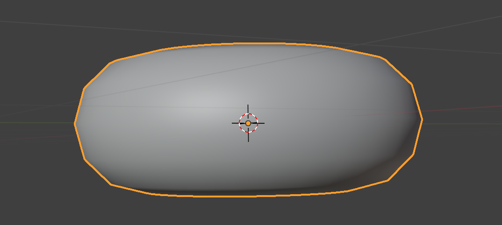

## 1、基本操作

`4K`屏幕菜单小，可以 编辑--偏好设置--界面--分辨率缩放1.5

**添加物体** shift + A

**放大缩小** 

- 滚动滑轮
- 平滑缩放 ctrl + 按住鼠标中键 + 前后滑动鼠标
- 按住放大键滑动鼠标

**旋转** 

- 按住滚轮
- 按住鼠标左键拖动右上角圆圈
- Alt + 按住鼠标左键

**非焦点平移** 

- shift + 按住鼠标中键 + 前后滑动鼠标
- 左键按住小手滑动图标

**移动物体** 

- 选中 + G + 移动鼠标

- 轴移动物体 选中 + G + X/Y/Z/按住鼠标中键 +移动鼠标  

- 取消移动回到原点 esc / 右键点击

**导出图像** F12 / 渲染--导出图像

**切换摄像机视角** 0

**移动摄像机** 

- 直接移动/在摄像机视角下移动 G选中，鼠标移动，XYZ按键方向移动，按鼠标中键放大缩小（物体是快速选中XYZ）

- N唤出菜单，暂时跟随摄像机视角，此时摄影机是焦点

**缩放** 

- 普通 S

- 轴缩放 S + X/X/Z

**旋转**

- 焦点旋转 R

- 焦点轴旋转 R + X/X/Z

- 自由旋转 R + 鼠标中键

**新建材质**

## 2、面包圈

新建物体后，快速编辑 F9

分辨率太高对新手不友好，而且渲染时间很长

**减少锯齿感** 

右键--平滑着色 不会影响渲染时间但是看起来分辨率很高的样子

恢复原状，平直着色

外形锯齿感修改 表面细分，增加更多平面达到细节优化效果

ctrl + 1

视图层级--blender中看到  渲染--最后的成图

太光滑完美 进入编辑模式 Tab

## 3、糖霜

复制物体 shift + D

重命名 双击名字 / F2

删除下半部分 打开透视模式

切换平面 点击 `XYZ` 或 网格

点击delete会有选择菜单

给糖霜增加厚度

实体化修改器挡住视线

关闭编辑模式下的修改器效果

糖霜往下拉，糖霜没有吸附到甜甜圈上面

开启吸附模式

默认吸附到网格平面，要吸附到甜甜圈上面，需要修改配置为吸附到面

拖动过程中糖霜的点穿透甜甜圈，开启面投射

拖动过程中烫糖霜细节不够，应用修改器，增加细节

拖动过程中影响到了其他面，隐藏不需要修改的面

双击选中一圈，ctrl + 数字键盘+/- 扩展选中，点击H隐藏，Alt + H 显示

边缘是直角，增加细节，修改器顺序很重要，先增加厚度，然后修改细节

下边缘是尖，修改增加厚度修改器的边数据

增加流下水珠

点击一个点，shift+点击第二个点，点击E同时下移两个点，移动鼠标，点击鼠标左键确认位置，创建一个平面，重复点击E，不断创造平面

