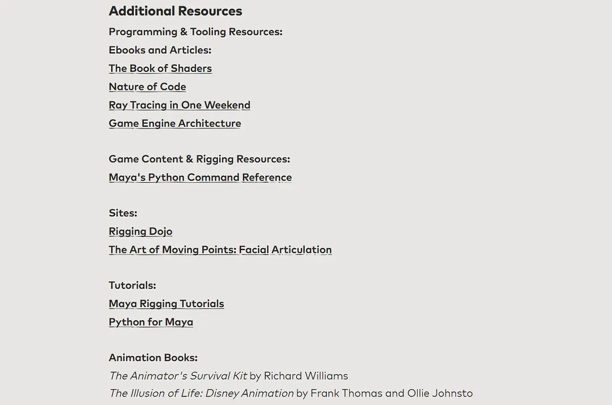

然后是中文区教程up主，直接在b站搜名字就能找到：

M_Studio—内容非常新人友好，视频逻辑清晰，短小但精美，不涉及很复杂的代码。每个系列最后的成品都是一个不错的小游戏，趣味性很强。

BeaverJoe—适合有一定基础的人看，会讲一些学校老师容易忽略但又很重要的功能，比如事件和委托、存储游戏之类的。时长比较长，需要时间消化。

_山城小泥鳅_—搬运了很多unity各个模块的长教程，适合入门后在某一功能上进阶学习，缺点是汉化质量一般。

油管上的：

Brackey—和M_Studio风格相似（好像顺序不对），更偏美术一些。

虚幻4教程的话，只要去官方网站直接看视频就行了，官方教程质量都很高。逻辑清晰、发音标准（适合用来练听力）、画质清晰，甚至学完还有小测试哈哈哈。

Makin' Stuff Look Good

**Blender**

Gleb Alexandrov、BlenderGuru Shift+A是添加，Shift+D是[复制](https://www.zhihu.com/search?q=复制&search_source=Entity&hybrid_search_source=Entity&hybrid_search_extra={"sourceType"%3A"answer"%2C"sourceId"%3A148033777})，G是移动，R是旋转，Delete是删除

## 【Unity】零基础入门教程整理

### 中文教程

**学院派**

[夏村散人韩老师带你打基础](https://space.bilibili.com/508934306?from=search&seid=4765051051836401046)
[刘铁猛《C#语言入门详解》全集，最扎实的C#入门](https://www.bilibili.com/video/BV13b411b7Ht)

**活泼派**
M_Studio作品

[Unity教程 入门第一款游戏制作教程合集](https://space.bilibili.com/370283072/channel/detail?cid=85776)
[用途很广的对话系统教程](https://space.bilibili.com/370283072/channel/detail?cid=99057)
[用途很广的背包系统教程](https://space.bilibili.com/370283072/channel/detail?cid=95883)
[用独立游戏案例学习Unity](https://space.bilibili.com/370283072/channel/detail?cid=91017)

### 英文教程

**Unity各个系统的系列教程**

[UI系统基础](https://www.bilibili.com/video/BV1ub411L7bf)
[UI系统进阶](https://www.bilibili.com/video/BV1K4411v7AZ)
[动画系统](https://www.bilibili.com/video/BV1Jb411K7Uw)
[Cinemation和时间线系统](https://www.bilibili.com/video/BV184411Y7R8)
[导航系统](https://www.bilibili.com/video/BV1Nb411T7yJ)
[灯光系统](https://www.bilibili.com/video/BV1bb411j7Lr?p=4)
[材质系统](https://www.bilibili.com/video/BV1Pb411j7MN)
[音频系统](https://www.bilibili.com/video/BV16b41157ka)
[物理系统](https://www.bilibili.com/video/BV1Wb411K7Y8)

## 【Unity】TA向教程汇总

ui设计

https://space.bilibili.com/1616927/?share_source=copy_link&share_medium=iphone&bbid=e92435e58a95198b8231e787f066a6ea&ts=1600188954

油管原账号：Desigh Doc

2d角色绑骨 + 动画制作

https://b23.tv/p6jomY

shader graph 入门

认识节点

https://b23.tv/74rzP3

示例分析

https://b23.tv/aIOBHq

实战案例

https://b23.tv/njVteg

https://b23.tv/C5pYia

粒子特效

https://b23.tv/PMpbUC

场景切换

https://b23.tv/p0uMDY

## 【UE4】技术美术向教程汇总

材质编辑器
https://b23.tv/kTI5wH

比较难的高级教程，需要完全掌握材质编辑器
https://b23.tv/BV1ZE411v79Z/p1 UVs基本原理
https://b23.tv/eqDGXO 贴图纹理采样
https://b23.tv/Dm6ytb 动态损伤

Niagara特效制作
https://b23.tv/mpRDNg

Cascade粒子系统
https://b23.tv/RP1PGq

官方后处理基础教程
https://b23.tv/UhKZEM
https://b23.tv/UKmwWc

动画编辑器基础
https://b23.tv/Lp8P8W

