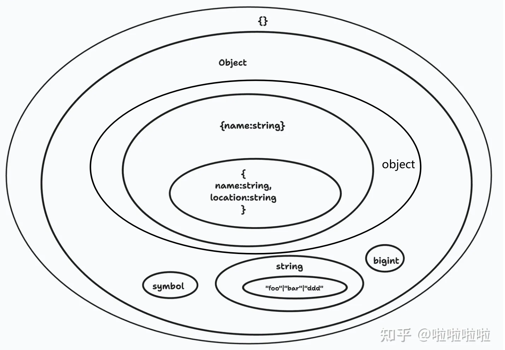

1、`object`、`Object` 和 `{}` 之间的区别

`{}` ：空对象：它描述了一个没有成员的对象。

`Object`：所有 Object 类的实例的类型。

`object`：表示非原始对象，`number`，`string`，`boolean`，`symbol`，`null`或`undefined`在JavaScript中为原始类型。

如果知道数据的具体结构，单独创建一个`type`或者`interface`是最好的。

1. 用于一些复合对象的情况，选`object`
2. 复合对象跟原始类型皆可的情况，选`{}`
3. 如果要包含`null`跟`undefined`的情况，用`unknown`



```js
var o: object;
o = { prop: 0 }; // OK
o = []; // OK
o = 42; // Error
o = "string"; // Error
o = false; // Error
o = null; // Error
o = undefined; // Error
o.a = ''; // Error

var p: {}; // or Object
p = { prop: 0 }; // OK
p = []; // OK
p = 42; // OK
p = "string"; // OK
p = false; // OK
p = null; // Error
p = undefined; // Error

var q: { [key: string]: any };
q = { prop: 0 }; // OK
q = []; // OK
q = 42; // Error
q = "string"; // Error
q = false; // Error
q = null; // Error
q = undefined; // Error
q.a = ''; // Error
```

