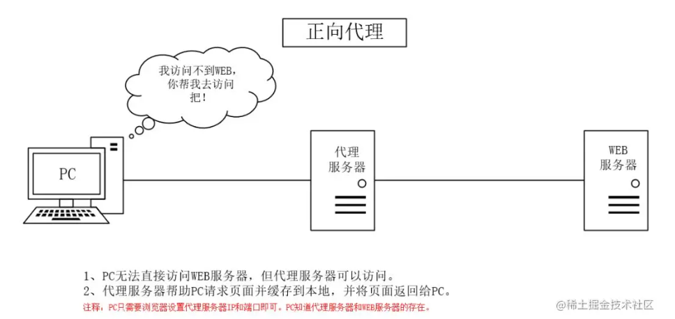
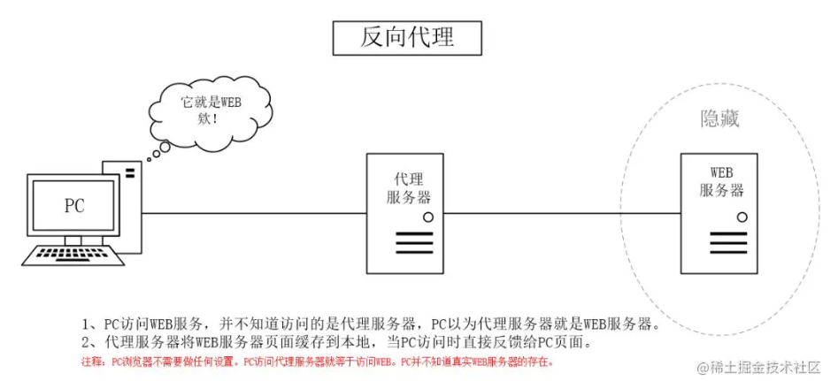
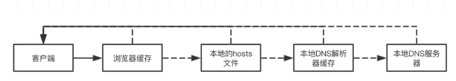
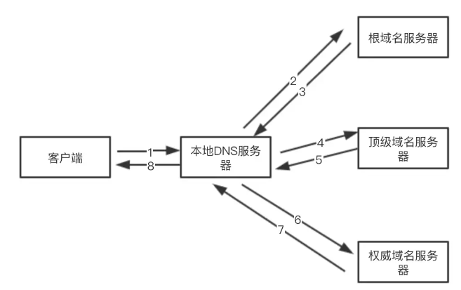
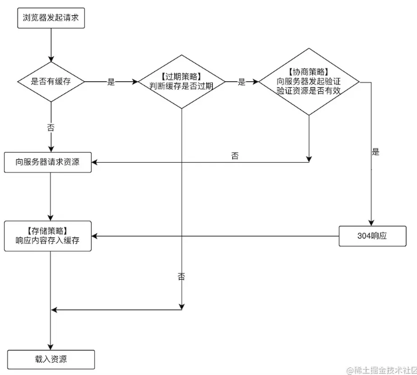
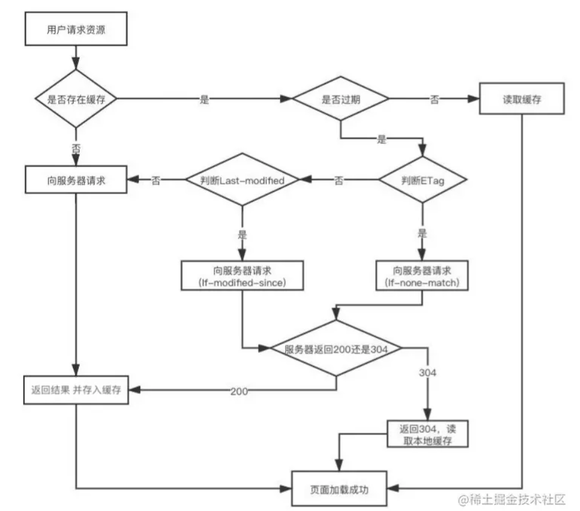

1. CDN 服务如何实现网络加速？

   内容分发网络CDN（Content Delivery Network）将源站内容分发至遍布全球的加速节点，当用户发起网站资源请求时，请求会被调度至离用户最近的加速节点，由加速节点直接响应用户所需内容，提高用户访问网站资源的响应速度。

2. `WebSocket` 使用的是 TCP 还是 `UDP` 协议？

   一种浏览器与服务器进行全双工通讯的网络技术，属于应用层协议。它基于TCP传输协议，并复用HTTP的握手通道。

   todo https://juejin.cn/post/7038491693997359117

3. 什么是**单工、半双工和全双工**通信？

   - 单工数据传输只支持数据在一个方向上传输;

   - 半双工数据传输允许数据在两个方向上传输，但是，在某一时刻，只允许数据在一个方向上传输，它实际上是一种切换方向的单工通信；

   - 全双工数据通信允许数据同时在两个方向上传输，因此，全双工通信是两个单工通信方式的结合，它要求发送设备和接收设备都有独立的接收和发送能力。

4. 简单描述 HTTP 协议发送一个带域名的 URL 请求的协议传输过程？（`DNS`、TCP、`IP`、链路）

   

5. 什么是正向代理？什么是反向代理？

   

   

   

   1、**正向代理其实是客户端的代理**，帮助客户端访问其无法访问的服务器资源。**反向代理则是服务器的代理**，帮助服务器做负载均衡，安全防护等。

   2、**正向代理一般是客户端架设的**，比如在自己的机器上安装一个代理软件。而**反向代理一般是服务器架设的**，比如在自己的机器集群中部署一个反向代理服务器。

   3、**正向代理中，服务器不知道真正的客户端到底是谁**，以为访问自己的就是真实的客户端。而在**反向代理中，客户端不知道真正的服务器是谁**，以为自己访问的就是真实的客户端。

   4、正向代理和反向代理的作用和目的不同。**正向代理主要是用来解决访问限制问题。而反向代理则是提供负载均衡、安全防护等作用。二者均能提高访问速度。**

6. Cookie 可以在服务端生成吗？Cookie 在服务端生成后的工作流程是什么样的？

7. Session、Cookie 的区别和关联？如何进行临时性和永久性的 Session 存储？

8. 设置 Cookie 时候如何防止 `XSS` 攻击？

   网络方面的缓存分为三块：`DNS`缓存、HTTP缓存（浏览器缓存）、`CDN`缓存

   本地的就是：浏览器的`本地存储`（Cookie、`SessionStorage、LocalStorage`、`indexDB`）和`离线存储`(Service Worker)

   **`DNS`缓存**

   

   

   **浏览器缓存**

   

   **强缓存**

   - 过期之后，不管资源有没有变化，都会重新发起请求，重新获取资源

   - Expires：用来指定资源到期绝对时间，服务器响应时，添加在响应头中。`expires: Wed, 22 Nov 2021 08:41:00 GMT`

   - Cache-Control：指定资源过期时间秒，表示在这个请求正确返回后的300秒内，资源可以使用，否则过期`cache-control:max-age=300`

     **Cache-Control`请求头`常见属性**

     | 字段(单位秒)    | 说明                                                         |
     | --------------- | ------------------------------------------------------------ |
     | max-age=300     | 拒绝接受长于300秒的资源，为0时表示获取最新资源               |
     | max-stale=100   | 缓存过期之后的100秒内，依然拿来用                            |
     | min-fresh=50    | 缓存到期时间还剩余50秒开始，就不给拿了，不新鲜了             |
     | no-cache        | 协商缓存验证                                                 |
     | no-store        | 不使用缓存                                                   |
     | only-if-chached | 只使用缓存，没有就报504错误                                  |
     | no-transform    | 不得对资源进行转换或转变。Content-Encoding, Content-Range,  Content-Type等HTTP头不能由代理修改。然并卵 |

     **Cache-Control`响应头`常见属性**

     | 字段(单位秒)     | 说明                                                  |
     | ---------------- | ----------------------------------------------------- |
     | max-age=300      | 缓存有效期300秒                                       |
     | s-maxage=500     | 有效期500秒，优先级高于max-age，适用于共享缓存(如CDN) |
     | public           | 可以被任何终端缓存，包括代理服务器、CDN等             |
     | private          | 只能被用户的浏览器终端缓存(私有缓存)                  |
     | no-cache         | 先和服务端确认资源是否发生变化，没有就使用            |
     | no-store         | 不缓存                                                |
     | no-transform     | 与上面请求指令中的一样                                |
     | must-revalidate  | 客户端缓存过期了就向源服务器验证                      |
     | proxy-revalidate | 代理缓存过期了就去源服务器重新获取                    |

   **协商缓存**

   

   - `Last-Modified`/`If-Modified-Since`

     - 第一次请求资源时，服务器除了会返回给浏览器上面说的过期时间，还会在响应头添加 `Last-Modified` 字段，告诉浏览器该资源的最后修改时间

       `last-modified: Fri, 27 Oct 2021 08:35:57 GMT`

     - 浏览器再次请求的时候就把这个时间再通过另一个字段`If-Modified-Since`，发送给服务器

       `if-modified-since: Fri, 27 Oct 2021 08:35:57 GMT`

     - 服务器再把这两个字段的时间对比，如果是一样的，就说明文件没有被更新过，就返回状态码304和空响应体给浏览器，浏览器直接拿过期了的资源继续使用即可；如果对比不一样说明资源有更新，就返回状态码200和新的资源

   - `ETag/If-None-Match`

     - `Etag`字段，表示当前资源文件的一个唯一标识。
     - 同时使用时，服务器校验优先级 `Etag`/`If-None-Match`
     - `Last-Modified` 性能上要优于 `Etag`，因为 `Etag` 生成过程中需要服务器付出额外开销，会影响服务器端的性能，所以它并不能完全替代 `Last-Modified`，只能作为补充和强化

   **强缓存与协商缓存的区别**

   - 优先查找强缓存，没有命中再查找协商缓存
   - 强缓存不发请求到服务器，所以有时候资源更新了浏览器还不知道，但是协商缓存会发请求到服务器，资源是否有更新，服务器肯定知道
   - 目前项目大多数使用缓存文案
     1. 协商缓存一般存储：`HTML`
     2. 强缓存一般存储：`css`, `image`, `js`，文件名带上 `hash`

   **Cookie**

   - Cookie 是浏览器访问服务器后，服务器传给浏览器的一段数据。

   - 浏览器需要保存这段数据（存储在**本地计算机的硬盘里**，最大储存量一般只有**4K**），不得轻易删除。

   - 此后每次浏览器访问该服务器（**同源的请求**），都必须带上这段数据。

   - 在响应头中设置Set-Cookie即可

     ```shell
     Set-Cookie: <cookie-name>=<cookie-value> 
     ## 普通的cookie，所有参数默认
     
     Set-Cookie: <cookie-name>=<cookie-value>; Expires=<date>
     ## cookie 的最长有效时间，形式为符合 HTTP-date 规范的时间戳。
     
     Set-Cookie: <cookie-name>=<cookie-value>; Max-Age=<non-zero-digit>
     ## 在 cookie 失效之前需要经过的秒数。一位或多位非零（1-9）数字。假如二者 （指 Expires 和Max-Age） 均存在，那么 Max-Age 优先级更高。
     
     Set-Cookie: <cookie-name>=<cookie-value>; Domain=<domain-value>
     ## 指定 cookie 可以送达的主机名。假如没有指定，那么默认值为当前文档访问地址中的主机部分（但是不包含子域名）。与之前的规范不同的是，域名之前的点号会被忽略。假如指定了域名，那么相当于各个子域名也包含在内了。
     
     Set-Cookie: <cookie-name>=<cookie-value>; Path=<path-value>
     ## 指定一个 URL 路径，这个路径必须出现在要请求的资源的路径中才可以发送 Cookie 首部。
     
     Set-Cookie: <cookie-name>=<cookie-value>; Secure
     ## 一个带有安全属性的 cookie 只有在请求使用SSL和HTTPS协议的时候才会被发送到服务器。（注意：非安全站点（http:）已经不能再在 cookie 中设置 secure 指令了）
     
     Set-Cookie: <cookie-name>=<cookie-value>; HttpOnly
     ## 设置了 HttpOnly 属性的 cookie 不能使用 JavaScript 经由  Document.cookie 属性、XMLHttpRequest 和  RequestAPIs 进行访问，以防范跨站脚本攻击（XSS）。
     
     Set-Cookie: <cookie-name>=<cookie-value>; SameSite=Strict
     
     Set-Cookie: <cookie-name>=<cookie-value>; SameSite=Lax
     ## 上面两个允许服务器设定一则 cookie 不随着跨域请求一起发送，这样可以在一定程度上防范跨站请求伪造攻击（CSRF）。
     
     Set-Cookie: id=a3fWa; HttpOnly
     ## 通过JavaScript的 Document.cookie API无法访问带有 HttpOnly 标记的Cookie
     ```

   **session**

   - 存储在服务器上的一个哈希表

     ```js
     let sessions = {}
     let sessionId = Math.random() * 10000 // 设置sessionId 为一个随机数
     sessions[sessionId] = {login_email:email} // 将email 存储在sessions这个对象中
     response.setHeader('Set-Cookie', `sessionId = ${sessionId}`) 
     // cookie中存储的是 sessionId 这个随机数
     ```

   - 还可以通过设置网址的**查询参数** + **localStorage** 实现session

   **`localStorage`**

   - 存储在计算机本地的哈希表

   -  **只能存 string，所以如果想存Object，就需要用`JSON`来存**，举个例子： `localStorage.setItem('jsonObj',JSON.stringify({name:'obj'}))` 然后如果想要解析这个 `JSON` 将其转换成对象可以使用 `JSON.parse()`

   - 只有**相同域名**的页面才能互相读取` localStorage`（遵循同源策略）

   - 每个域名 `localStorage` 最大存储量为 **`5Mb`** 左右（每个浏览器不一样）

   - `localStorage` 理论上**永久有效**，除非用户清理缓存，无法设置过期时间

     ```js
     localStorage.setItem('myCat', 'Tom') // 访问当前域名下的本地 Storage 对象，并增加了一个数据项通过使用
     
     Storage.setItem() // 作为 Storage 接口的方法，接受一个键名和值作为参数，将会把键名添加到存储中，如果键名已存在，则更新其对应的值。
     
     let cat = localStorage.getItem('myCat') // 该语法用于读取 localStorage 项
     
     localStorage.removeItem('myCat') // 该语法用于移除 localStorage 项
     
     localStorage.clear()// 该语法用于移除所有的 localStorage 项
     ```

   **`sessionStorage`**

   - `sessionStorage` 在**用户关闭页面后**（即 session 结束后或者说会话结束后）就失效，而且没办法控制

   **`indexDB`**

   ```js
   // 1 打开数据库
   var request = window.indexedDB.open(databaseName, version);
   
   // 2 新建对象仓库（即新建表）
   request.onupgradeneeded = function(event) {
     db = event.target.result;
     // 新增一张叫做person的表格，主键是id
     var objectStore = db.createObjectStore('person', { keyPath: 'id' });
     // 新建索引(表头) 索引名称、索引所在的属性、配置对象
     objectStore.createIndex('name', 'name', { unique: false });
     objectStore.createIndex('email', 'email', { unique: true });
   }
   
   // 3 向对象仓库写入数据记录
   function add() {
     var request = db.transaction(['person'], 'readwrite')
       .objectStore('person')
       .add({ id: 1, name: '张三', age: 24, email: 'zhangsan@example.com' });
     request.onsuccess = function (event) {console.log('数据写入成功');};
     request.onerror = function (event) {console.log('数据写入失败');}
   }
   add();
   
   // 4 读取数据
   function read() {
      var transaction = db.transaction(['person']);
      var objectStore = transaction.objectStore('person');
      var request = objectStore.get(1);
      request.onerror = function(event) {console.log('事务失败');};
      request.onsuccess = function( event) {
         if (request.result) {
           console.log('Name: ' + request.result.name);
         } else {
           console.log('未获得数据记录');
         }
      };
   }
   read();
   
   // 5 更新数据
   function update() {
     var request = db.transaction(['person'], 'readwrite')
       .objectStore('person')
       .put({ id: 1, name: '李四', age: 35, email: 'lisi@example.com' });
     request.onsuccess = function (event) {console.log('数据更新成功');};
     request.onerror = function (event) {console.log('数据更新失败');}
   }
   
   update();
   
   // 6 删除数据
   function remove() {
     var request = db.transaction(['person'], 'readwrite')
       .objectStore('person')
       .delete(1);
     request.onsuccess = function (event) {console.log('数据删除成功');};
   }
   
   remove();
   ```

   **Service Worker**

   **`Cache`** 接口为缓存的 [`Request`](http://fetch.spec.whatwg.org/#request) / `Response` 对象对提供存储机制，例如，作为[`ServiceWorker`](https://developer.mozilla.org/zh-CN/docs/Web/API/ServiceWorker) 生命周期的一部分。请注意，Cache 接口像 workers 一样，是暴露在 window 作用域下的。尽管它被定义在 service worker 的标准中，但是它不必一定要配合 service worker 使用。

   ```js
   // index.js 注册
   if (navigator.serviceWorker) { 
       navigator.serviceWorker .register('sw.js').then( registration => {
           console.log('service worker 注册成功')
       }).catch((err)=>{
           console.log('servcie worker 注册失败')
       })
   } 
   // sw.js  监听 `install` 事件，回调中缓存所需文件 
   self.addEventListener('install', e => {
       // 打开指定的缓存文件名
       e.waitUntil(caches.open('my-cache').then( cache => {
           // 添加需要缓存的文件
           return cache.addAll(['./index.html', './index.css'])
       }))
   })
   // 拦截所有请求事件 缓存中有请求的数据就直接用缓存，否则去请求数据 
   self.addEventListener('fetch', e => { 
       // 查找request中被缓存命中的response
       e.respondWith(caches.match(e.request).then( response => {
           if (response) {
               return response
           }
           console.log('fetch source')
       }))
   })
   ```

   **缓存存放位置，和读取的优先级**

   - Service Worker

   - Memory Cache(内存)

   - Disk Cache(硬盘)

   - Push Cache

     HTTP/2中的内容，当上面三种缓存都没有命中时才会，被使用。它只会存在于Session中，一旦会话结束就会释放，所以缓存时间很短，而且Push Cache中的缓存只能被使用一次

   **刷新和回车的区别**

   - 使用 `Ctrl+F5` 强制刷新页面时，会对本地缓存文件直接过期，然后跳过强缓存和协商缓存，直接请求服务器
   - 点击刷新或 `F5` 刷新页面时，对本地缓存文件过期，然后带`If-Modifed-Since`和`If-None-Match`发起协商缓存验证新鲜度
   - 浏览器输入URL回车，浏览器查找 `Disk Cache`，有则使用，没有则发送网络请求

9. 简单描述一下用户免登陆的实现过程？可能会出现哪些安全性问题？一般如何对用户登录的密码进行加密？

10. HTTP 中提升传输速率的方式有哪些？常用的内容编码方式有哪些？

11. 传输图片的过程中如果突然中断，如何在恢复后从之前的中断中恢复传输？

12. 什么是代理？什么是网关？代理和网关的作用是什么？

13. HTTPS 相比 HTTP 为什么更加安全可靠？

14. 什么是对称密钥（共享密钥）加密？什么是非对称密钥（公开密钥）加密？哪个更加安全？

15. 你觉得 HTTP 协议目前存在哪些缺点？

16. 跨域

同源：协议相同、域名相同、端口相同(实际上，同一个网域的不同端口，是可以互相读取 Cookie 的)

同源政策

（1） 无法读取非同源网页的 Cookie、`LocalStorage` 和 `IndexedDB`。

（2） 无法接触非同源网页的 DOM。

（3） 无法向非同源地址发送 AJAX 请求（可以发送，但浏览器会拒绝接受响应）。

三个标签是允许跨域加载资源：

- ``
- `<link href=XXX>`
- `<script src=XXX>`

跨域并不是请求发不出去，请求能发出去，服务端能收到请求并正常返回结果，只是结果被浏览器拦截了

原来`WebSocket`根本不附属于同源策略，而且它本身就有意被设计成可以跨域的一个手段。由于历史原因，跨域检测一直是由浏览器端来做，但是`WebSocket`出现以后，对于`WebSocket`的跨域检测工作就交给了服务端，浏览器仍然会带上一个`Origin`跨域请求头，服务端则根据这个请求头判断此次跨域`WebSocket`请求是否合法

17. 计网

- 运行于用户进程：应用层，关注应用程序的细节，不关注底层网络通信细节；

- 运行于内核：传输层、网络层、链路层，在内核中执行，主要处理所有的通信细节。

  

正常的网站请求中，中间肯定会涉及到很多路由器，交换机，光纤等底层的物理设备，中间会产生很多的逐跳（Hop-by-hop），**每个中间系统都会对数据帧进行分用和封装的过程**。


**数据链路层**


- 路由器工作在网络层，属于第三层，所以经常有人称他为三层设备
- 交换机工作在第二层-数据链路层，所以也成为二层设备
- MAC地址就好像是我们的身份证，IP就像是我们的住址

交换机会把电脑A的IP和MAC地址记住，保存到一个`转发表`中，如果`转发表`中暂时找不到目标IP地址的MAC地址，那么首先还是会广播消息，最终转发表会记录所有请求过交换机的电脑IP和MAC


**网络层**


**传输层**


**应用层**