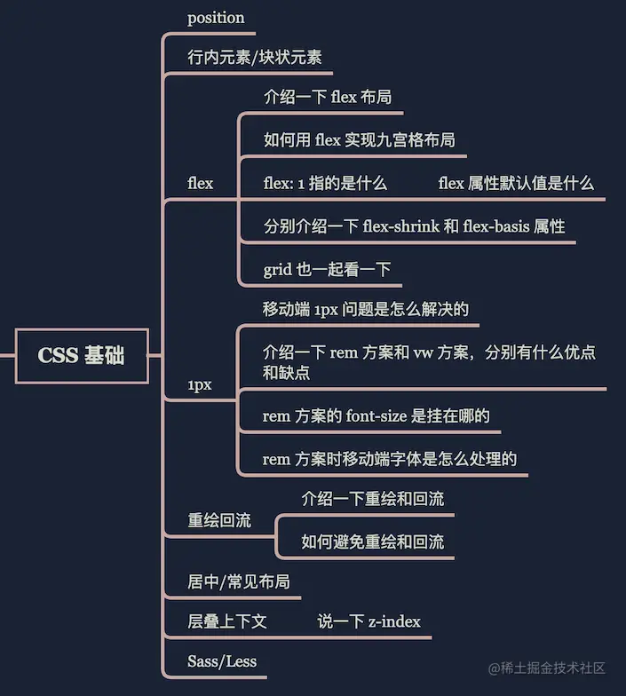

**1、自检清单**

- 1.`CSS`盒模型，在不同浏览器的差异
- 2.`CSS`所有选择器及其优先级、使用场景，哪些可以继承，如何运用`at`规则
- 3.`CSS`伪类和伪元素有哪些，它们的区别和实际应用
- 4.`HTML`文档流的排版规则，`CSS`几种定位的规则、定位参照物、对文档流的影响，如何选择最好的定位方式，雪碧图实现原理
- 5.水平垂直居中的方案、可以实现`6`种以上并对比它们的优缺点
- 6.`BFC`实现原理，可以解决的问题，如何创建`BFC`
- 7.可使用`CSS`函数复用代码，实现特殊效果
- 8.`PostCSS`、`Sass`、`Less`的异同，以及使用配置，至少掌握一种
- 9.`CSS`模块化方案、如何配置按需加载、如何防止`CSS`阻塞渲染
- 10.熟练使用`CSS`实现常见动画，如渐变、移动、旋转、缩放等等
- 11.`CSS`浏览器兼容性写法，了解不同`API`在不同浏览器下的兼容性情况
- 12.掌握一套完整的响应式布局方案

手写

- 1.手写图片瀑布流效果
- 2.使用`CSS`绘制几何图形（圆形、三角形、扇形、菱形等）
- 3.使用纯`CSS`实现曲线运动（贝塞尔曲线）
- 4.实现常用布局（三栏、圣杯、双飞翼、吸顶），可是说出多种方式并理解其优缺点

[参考](https://juejin.cn/post/6844903830887366670#heading-9)

------

**2、技能要求**

初级：

- CSS方面包括但不限于：文档流，重绘重排，flex，BFC，IFC，before/after，动画，keyframe，画三角，优先级矩阵等。

中级：

- css方面能够结合各个概念，说明白网上那些hack方案或优化方案的原理。

0.掌握图形学，webgl或熟练使用threejs框架，熟练canvas相关渲染及动画操作的优先。

初级：

- 学习过图形学相关知识，知道矩阵等数学原理在动画中的作用，知道三维场景需要的最基础的构成，能用threejs搭3d场景，知道webgl和threejs的关系。
- 知道canvas是干嘛的，聊到旋转能说出canvas的api。
- 知道[css动画](https://zhida.zhihu.com/search?content_id=515854147&content_type=Answer&match_order=1&q=css动画&zhida_source=entity)，css动画属性知道关键字和用法(换句话说，电话面试会当场出题要求口喷css动画，至少能说对大概，而不是回答百度一下就会用)。
- 知道js动画，能说出1~2个社区js动画库，知道[js动画](https://zhida.zhihu.com/search?content_id=515854147&content_type=Answer&match_order=3&q=js动画&zhida_source=entity)和css动画优缺点以及适用场景。
- 知道raf和其他达到60fps的方法。

中级：

- 如果没有threejs，你也能基于webgl自己封装一个简单的threejs出来。
- 聊到原理能说出[四元数](https://zhida.zhihu.com/search?content_id=515854147&content_type=Answer&match_order=1&q=四元数&zhida_source=entity)，聊到鼠标操作能提到节流，聊到性能能提到restore，聊到帧说出raf和timeout的区别，以及各自在优化时候的作用。
- 知道怎样在移动端处理加载问题，渲染性能问题。
- 知道如何结合native能力优化性能。
- 知道如何排查性能问题。对chrome动画、3d、传感器调试十分了解。

[参考](https://www.zhihu.com/question/269599686/answer/2671717786?utm_campaign=shareopn&utm_medium=social&utm_oi=733788667625107456&utm_psn=1598662558956621824&utm_source=wechat_session)

------

**3、前端学习路线**

- CSS盒模型、BFC
- 浮动、定位（绝对定位和相对定位）
- flex 布局
- 圣杯布局、双飞翼布局
- 选择器：后代选择器、交集选择器、并集选择器、伪类选择器
- 2D转换：移动translation、旋转rotate、缩放scale
- 3D转换：透视 perspective、3D移动 translate3d、3D旋转 rotate3d、3D呈现 transform-style
- CSS3动画：animation
- CSS hack
- Retina 屏幕的 1px 像素，如何实现

CSS预处理器

- SASS（用得较多）
- Less
- PostCSS

[参考](https://www.cnblogs.com/qianguyihao/p/16370961.html)

------

**4、前端面试知识点**

- 了解 Flex 布局么？平常有使用 Flex 进行布局么？
- CSS 中解决浮动中高度塌陷的方案有哪些？[清除和去除浮动](https://link.juejin.cn/?target=http%3A%2F%2Fwww.ziyi2.cn%2F2017%2F08%2F02%2F%E6%B8%85%E9%99%A4%E5%92%8C%E5%8E%BB%E9%99%A4%E6%B5%AE%E5%8A%A8%2F)
- Flex 如何实现上下两行，上行高度自适应，下行高度 200px？
- 如何设计一个 4 列等宽布局，各列之间的边距是 10px（考虑浏览器的兼容性）？
- CSS 如何实现三列布局，左侧和右侧固定宽度，中间自适应宽度？
- CSS 清除浮动的原理是什么？
- BFF 的作用有哪些？[《面试分享：两年工作经验成功面试阿里 P6 总结》](https://juejin.im/post/6844903928442667015)
- CSS 中的 vertical-align 有哪些值？它在什么情况下才能生效？
- CSS 中选择器有哪些？CSS 选择器优先级是怎么去匹配？
- 伪元素和伪类有什么区别？
- CSS 中的 background 的 background-image 属性可以和 background-color 属性一起生效么？
- 了解 CSS 3 动画的硬件加速么？在重绘和重流方面有什么需要注意的点？
- CSS 可以做哪些优化工作 ?
- 浮动元素和绝对定位元素的区别和应用?
- CSS 中哪些属性可以继承？

[参考](https://juejin.cn/post/6844904093425598471#heading-7)

------

**5、前端真题**

| [盒子模型](https://segmentfault.com/a/1190000013069516)      |
| ------------------------------------------------------------ |
| [CSS选择器](https://segmentfault.com/a/1190000013424772)     |
| [BFC](https://zhuanlan.zhihu.com/p/25321647)、[什么是BFC？什么条件下会触发？应用场景有哪些？](https://link.juejin.cn/?target=http%3A%2F%2F47.98.159.95%2Fmy_blog%2Fcss%2F008.html) |
| [position](https://developer.mozilla.org/zh-CN/docs/Learn/CSS/CSS_layout/定位) |
| [阮一峰的flex系列](https://link.juejin.cn/?target=https%3A%2F%2Fwww.ruanyifeng.com%2Fblog%2F2015%2F07%2Fflex-grammar.html) |
| [css优先级](https://zhuanlan.zhihu.com/p/41604775)           |
| [双飞冀/圣杯布局](https://juejin.cn/post/6844903817104850952) |
| [CSS3新特性](https://segmentfault.com/a/1190000010780991)    |
| [CSS样式隔离](https://juejin.cn/post/6844904034281734151#heading-9) |
| [CSS性能优化](https://blog.csdn.net/weixin_43883485/article/details/103504171) |
| [层叠上下文](https://www.zhangxinxu.com/wordpress/2016/01/understand-css-stacking-context-order-z-index/) |
| [div居中](https://juejin.cn/post/6844903821529841671)        |
| [浮动](https://segmentfault.com/a/1190000012739764)          |

------

**6、必看文章**

[position - CSS: Cascading Style Sheets | MDN](https://link.juejin.cn?target=https%3A%2F%2Fdeveloper.mozilla.org%2Fen-US%2Fdocs%2FWeb%2FCSS%2Fposition)

[position | CSS Tricks](https://link.juejin.cn?target=https%3A%2F%2Fcss-tricks.com%2Falmanac%2Fproperties%2Fp%2Fposition%2F)

[杀了个回马枪，还是说说position:sticky吧](https://link.juejin.cn?target=https%3A%2F%2Fwww.zhangxinxu.com%2Fwordpress%2F2018%2F12%2Fcss-position-sticky%2F)

[30 分钟学会 Flex 布局](https://link.juejin.cn?target=https%3A%2F%2Fzhuanlan.zhihu.com%2Fp%2F25303493)

[css行高line-height的一些深入理解及应用](https://link.juejin.cn?target=https%3A%2F%2Fwww.zhangxinxu.com%2Fwordpress%2F2009%2F11%2Fcss%E8%A1%8C%E9%AB%98line-height%E7%9A%84%E4%B8%80%E4%BA%9B%E6%B7%B1%E5%85%A5%E7%90%86%E8%A7%A3%E5%8F%8A%E5%BA%94%E7%94%A8%2F)

[A Complete Guide to Flexbox](https://link.juejin.cn?target=https%3A%2F%2Fcss-tricks.com%2Fsnippets%2Fcss%2Fa-guide-to-flexbox%2F)

[写给自己看的display: flex布局教程](https://link.juejin.cn?target=https%3A%2F%2Fwww.zhangxinxu.com%2Fwordpress%2F2018%2F10%2Fdisplay-flex-css3-css%2F)

[从网易与淘宝的font-size思考前端设计稿与工作流](https://link.juejin.cn?target=https%3A%2F%2Fwww.cnblogs.com%2Flyzg%2Fp%2F4877277.html)

[细说移动端 经典的REM布局 与 新秀VW布局](https://link.juejin.cn?target=https%3A%2F%2Fcloud.tencent.com%2Fdeveloper%2Farticle%2F1352187)

[移动端1px解决方案](https://juejin.im/post/5d19b729f265da1bb2774865)

[Retina屏的移动设备如何实现真正1px的线？](https://link.juejin.cn?target=https%3A%2F%2Fjinlong.github.io%2F2015%2F05%2F24%2Fcss-retina-hairlines%2F)

[CSS retina hairline, the easy way.](https://link.juejin.cn?target=http%3A%2F%2Fdieulot.net%2Fcss-retina-hairline)

[浏览器的回流与重绘 (Reflow & Repaint)](https://juejin.im/post/5a9923e9518825558251c96a)

[回流与重绘：CSS性能让JavaScript变慢？](https://link.juejin.cn?target=https%3A%2F%2Fwww.zhangxinxu.com%2Fwordpress%2F2010%2F01%2F%E5%9B%9E%E6%B5%81%E4%B8%8E%E9%87%8D%E7%BB%98%EF%BC%9Acss%E6%80%A7%E8%83%BD%E8%AE%A9javascript%E5%8F%98%E6%85%A2%EF%BC%9F%2F)

[CSS实现水平垂直居中的1010种方式（史上最全）](https://juejin.im/post/5b9a4477f265da0ad82bf921)

[干货!各种常见布局实现](https://juejin.im/post/5aa252ac518825558001d5de)

[CSS 常见布局方式](https://juejin.im/post/599970f4518825243a78b9d5)

[彻底搞懂CSS层叠上下文、层叠等级、层叠顺序、z-index](https://juejin.im/post/5b876f86518825431079ddd6)

[深入理解CSS中的层叠上下文和层叠顺序](https://link.juejin.cn?target=https%3A%2F%2Fwww.zhangxinxu.com%2Fwordpress%2F2016%2F01%2Funderstand-css-stacking-context-order-z-index%2F)

[Sass vs. Less](https://link.juejin.cn?target=https%3A%2F%2Fcss-tricks.com%2Fsass-vs-less%2F)

[2019年，你是否可以抛弃 CSS 预处理器？](https://link.juejin.cn?target=https%3A%2F%2Faotu.io%2Fnotes%2F2019%2F10%2F29%2Fcss-preprocessor%2Findex.html)

[浅谈 CSS 预处理器（一）：为什么要使用预处理器？](https://link.juejin.cn?target=https%3A%2F%2Fgithub.com%2Fcssmagic%2Fblog%2Fissues%2F73)

[浏览器将rem转成px时有精度误差怎么办？](https://link.juejin.cn?target=https%3A%2F%2Fwww.zhihu.com%2Fquestion%2F264372456)

[Fighting the Space Between Inline Block Elements](https://link.juejin.cn?target=https%3A%2F%2Fcss-tricks.com%2Ffighting-the-space-between-inline-block-elements%2F)

 [css加载会造成阻塞吗](https://link.juejin.cn?target=https%3A%2F%2Fsegmentfault.com%2Fa%2F1190000018130499)

 [不可思议的纯 CSS 滚动进度条效果](https://juejin.cn/post/6844903758074216462)

 [CSS实现水平垂直居中的1010种方式（史上最全）](https://juejin.cn/post/6844903679242305544)

 [rem布局解析](https://juejin.cn/post/6844903671143088136)

 [布局的下一次革新](https://juejin.cn/post/6844903666374148103)

 [彻底搞懂word-break、word-wrap、white-space](https://juejin.cn/post/6844903667863126030)

 [彻底搞懂CSS层叠上下文、层叠等级、层叠顺序、z-index](https://juejin.cn/post/6844903667175260174)

 [css加载会造成阻塞吗？](https://juejin.cn/post/6844903667733118983?utm_source=gold_browser_extension)

 [从青铜到王者10个css3伪类使用技巧和运用，了解一哈](https://juejin.cn/post/6844903654756089864)

 [CSS性能优化的8个技巧](https://juejin.cn/post/6844903649605320711?utm_source=gold_browser_extension)

 [个人总结（css3新特性）](https://juejin.cn/post/6844903518520901639)

 [CSS设置居中的方案总结-超全](https://juejin.cn/post/6844903560879013901)

 [Web开发者需要知道的CSS Tricks](https://juejin.cn/post/6844903576561516558)

 [CSS 常用技巧](https://juejin.cn/post/6844903619909648398)
