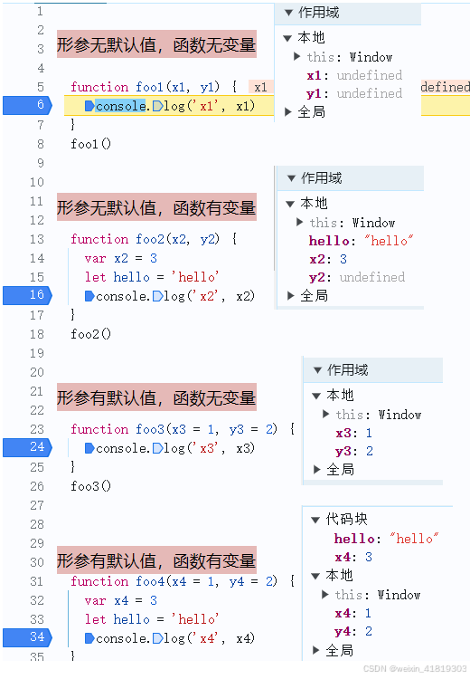
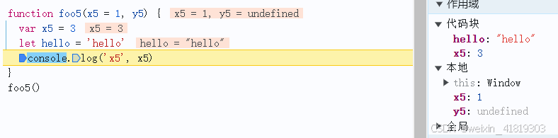
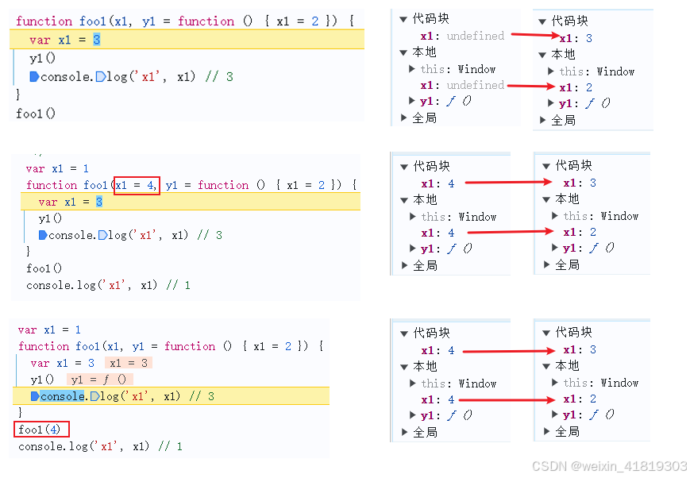
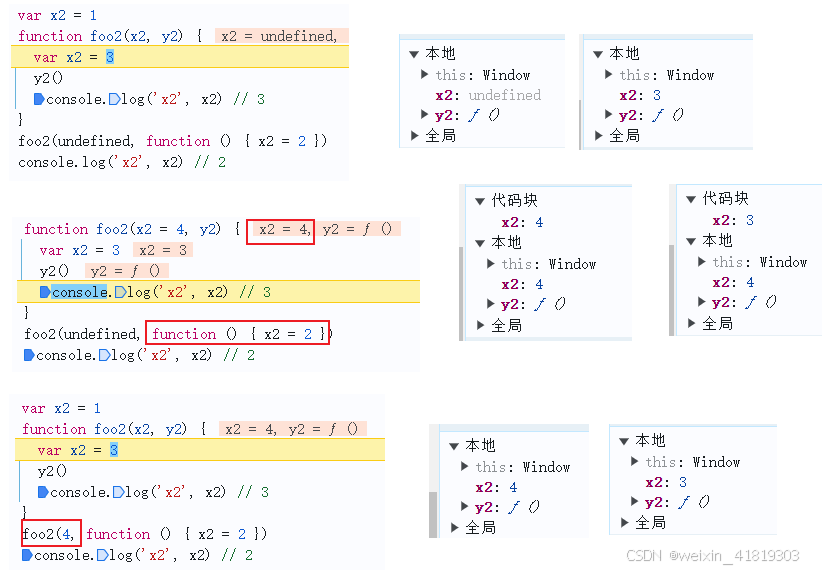
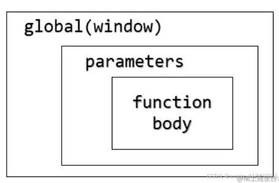

## 1、闭包
块级作用域形成闭包
```js
var hits;
var hello = '11'
{
    let count = 0;
    let hello = '22
    hits = function getCurrent(){
        console.log(this.hello) // 11 在全局作用域
        count = count + 1;
        return count;
    };
}
// count可以被改变
hits();     // 1
hits();     // 2
hits();     // 3
```
## 2、作用域
**类声明**会被保存在词法环境中但处于未初始化的状态，直到执行到变量赋值那一行代码，才会被初始化
形参作用域 [参考](https://juejin.cn/post/6844903782397181965?searchId=20240725170300FEF1A79DEDE61EF09403)
存在默认值且函数有新变量就会存在两个作用域
函数形参没有任何默认值，形参会被添加到函数的作用域中，并且形参不会被重新定义（用var 声明与形参同名的变量会被忽略）
```js
function fun(arg1, arg2) {
  var arg1; // 声明被忽略
  var arg2 = "hello"; // var arg2 声明被忽略，arg2 = "hello" 被执行
  console.log(arg1, arg2);
}
fun(1, 2); // 1 "hello"
```

即使只有一个形参有默认值，另外的形参会作为undefied存在在形参作用域

对于函数内var声明的局部变量名与形参名相同时，**var局部变量初始值与形参值相同**，let/const参数名和函数体内的变量名相同

如果函数在外部传入，根据词法环境，就是指向window

形参的 ER 中的变量只能读取形参 ER 中的变量或者函数外的变量，而函数体内的变量可以读取函数体内、形参以及外部的变量

## 3、`this` 
`this` 提供了函数在运行时的环境，让 `JS` 拥有动态作用域
（1）全局环境：函数在全局环境下运行 
（2）构造函数：指向实例对象
（3）对象的方法
```js
var obj ={
  foo: function () {
    console.log(this);
  }
};
// obj和obj.foo储存在两个内存地址，称为地址一和地址二
// obj.foo()这样调用时，是从地址一调用地址二，因此地址二的运行环境是地址一，this指向obj
obj.foo() // obj
// 直接取出地址二进行调用
(obj.foo = obj.foo)() // window
(false || obj.foo)() // window
(1, obj.foo)() // window
$('#button').on('click', o.f); // f方法是在按钮对象的环境中被调用的

// this只是指向当前一层的对象，而不会继承更上面的层
var a = {
  p: 'Hello',
  b: {
    m: function() {
      console.log(this.p);
    }
  }
};
a.b.m() // undefined   此时m运行的环境是a.b，没有属性p，a才有

// 避免多层this
var o = {
  f1: function () {
    console.log(this); // Object
    var f2 = function () { // f2 使用 =，不是对象方法
      console.log(this); // 内层的this不指向外部，而指向顶层对象Window
    }(); // 立即执行函数
    // 使用一个变量固定this的值，然后内层函数调用这个变量
    /*var that = this;
    var f2 = function() {
      console.log(that); // Object
    }();*/
  }
}
o.f1()
// 实际执行的是下面的代码。
var temp = function () {
  console.log(this);
};
var o = {
  f1: function () {
    console.log(this);
    var f2 = temp();
  }
}

// 避免数组处理方法中的this
var o = {
  v: 'hello',
  p: [ 'a1', 'a2' ],
  f: function f() {
    this.p.forEach(function (item) {
      console.log(this.v + ' ' + item); // window 原因跟上一段的多层this是一样的
    });
    // 可以给方法指定this参数
    /*this.p.forEach(function (item) {
      console.log(this.v + ' ' + item);
    }, this);
    this.p.forEach(function (item) {
      console.log(this.v + ' ' + item);
    }).bind(this));*/
  }
}
o.f()

// 箭头函数内部的this指向是固定的，this就是定义时上层作用域中的this，arguments、super、new.target、prototype不存在
const person = {
  name: "Alice",
  jumps: () => {
    console.log(this); // this-->window 外面包对象
  }
  hello: function () {
    console.log(`hello, ${this.name}!`); 
  },
  greet: function() {
    setTimeout(() => {
      console.log(`Hello, ${this.name}!`); // 使用箭头函数简化代码书写
    }, 1000);
    setTimeout(function () {
      console.log(`Hello1, ${this.name}!`); // this-->window
    }, 1000);
    setTimeout(this.hello, 1000); // this-->window
  }
};
person.greet(); // 输出"Hello, Alice!"
// ES6
function foo() {
  setTimeout(() => {
    console.log('id:', this.id);
  }, 100);
}
// ES5
function foo() {
  var _this = this;
  setTimeout(function () {
    console.log('id:', _this.id);
  }, 100);
}

// setTimeout传递的是函数，只是这个函数在window环境下运行
var status = "window"
setTimeout(() => {
  const status = "setTimeout"
  const data = {
    status: "data",
    getStatus() {
      return this.status
    }
  }
  console.log(data.getStatus()) // data 
  console.log(data.getStatus.call(this)) // window
}, 0)
```
## 4、类型
基本类型包括 boolean, null, undefined, **bigint**, number, string, **symbol**。
**加号运算符（+）**放在变量前是一元操作符加号 `+true === 1`。当一个操作数是字符串时，它会将其他操作数转换为字符串并执行字符串拼接，否则双方都会被转换为数字，执行数字加法。`console.log(3 + 4 + "5"); // 75`

在测试相等性时，基本类型通过它们的值（value）进行比较，而对象通过它们的引用（reference）进行比较。
能使用 `==`（会进行类型转换）和 `===`时就尽量不要使用`Object.is(..)`，前者效率更高、更为通用。
虽然字符串不能修改单个，但是两个字符串内容相等，它们就是全等
```js
null == undefined // true
null === undefined // false
'0' == false // true
NaN == NaN or NaN === NaN // false
{}=={} or {}==={} //false, refer different objects in memory

var d1 = new Date();
var d2 = new Date(d1);
console.log(d1.getTime() === d2.getTime()); // True getTime() 方法返回一个时间的格林威治时间数值。
console.log(d1 === d2); // False
```

Number.isNaN，你可以检测你传递的值是否为 数字值 并且是否等价于 NaN
方法 isNaN，你可以检测你传递的值是否一个 number

显式和隐式强制类型转换结果是一样的，它们之间的差异仅仅体现在代码可读性方面
**toString()**
- null becomes "null"
- undefined becomes "undefined" 
- true/falsebecomes "true"/"false"
- 对象除非自定义否则返回内部属性 [[Class]]

**Number/parseInt()**
- null becomes 0
- undefined becomes NaN
- true/false becomes 1/0
- 对象（包括数组）会首先被转换为相应的基本类型值，如果返回的是非数字的基本类型值，则再遵循以上规则将其强制转换为数字。如果 valueOf() 和 toString() 均不返回基本类型值，会产生 TypeError 错误。

**Boolean()**
- undefined
- null
- false
- +0、-0和 NaN
- ""
- 其他都为true
## 5、对象
所有对象的键（不包括 Symbol）在底层都是字符串，即使你自己没有将其作为字符串输入。
```js
const obj = { 1: 'a', 2: 'b', 3: 'c' }
obj.hasOwnProperty('1') // true
obj.hasOwnProperty(1) // true
```
当我们使用括号语法时（[]），JavaScript 会解释（或者 unboxes）语句。
```js
const a = {}
const b = { key: 'b' }
const c = { key: 'c' }
a[b] = 123 // a["[object Object]"] = 123
a[c] = 456 // a["[object Object]"] = 456 
console.log(a[b]) // 456
```
给对象赋值会修改引用地址
```js
let person = { name: "Lydia" };
const members = [person];
person = null;
console.log(members);
```
map和set是对象
```js
const set = new Set([1, 1, 2, 3, 4]);
console.log(set); // Set(4) { 1, 2, 3, 4 }
const map = new Map()
map.set('key', "value");
console.log(map) // Map(1) { 'key' => 'value' }
```
Object.entries() 静态方法返回一个数组，包含给定对象自有的可枚举字符串键属性的键值对。
```js
const obj = { foo: "bar", baz: 42 };
console.log(Object.entries(obj)); // [ ['foo', 'bar'], ['baz', 42] ]
```
JSON.parse(text, reviver) 指定了 reviver 函数，则解析出的 JavaScript 值（解析值）会经过一次转换后才将被最终返回（返回值）
JSON.stringify(value[, replacer [, space]]) 第二个参数是 替代者 (replacer) 可以是个函数或数组，控制哪些值被转换为字符串

Object.seal() 不能添加新属性、不能删除现有属性或更改其可枚举性和可配置性、不能重新分配其原型。只要现有属性的值是可写的，它们仍然可以更改。
Object.freeze Object.seal上，防止修改 任何 现有属性，仅 对对象进行 浅 冻结，意味着只有 对象中的 直接 属性被冻结。如果属性是另一个 object，仍然可以被修改。
Object.preventExtensionsseal基本可保持一致，唯一的区别就是可以delete属性

通过 ES10 或 TS3.7+可选链操作符 ?.，我们不再需要显式检测更深层的嵌套值是否有效。如果我们尝试获取 undefined 或 null 的值 (nullish)，表达将会短路并返回 undefined.

Object.fromEntries() 静态方法将键值对列表转换为一个对象。
Object.values() 静态方法返回一个给定对象的自有可枚举字符串键属性值组成的数组。
Object.assign(target, ...sources) 静态方法将一个或者多个源对象中所有可枚举的自有属性复制到目标对象，并返回修改后的目标对象。

Object.assign(target, ...sources)
Object.create(proto, propertiesObject)
Object.defineProperties(obj, propertiesObject)
Object.defineProperty(obj, prop, descriptor) 给对象添加了一个属性之后，属性默认为 不可枚举 (not enumerable). 

检测对象key是否存在
```js
"key" in obj; // 指定的属性在指定的对象或其原型链中
obj.hasOwnProperty("key"); // for...in 可枚举字符串属性（除 Symbol 以外），包括继承的可枚举属性，配合hasOwnProperty可以返回自身属性
console.log(user.name !== undefined); // true
```
空对象
```js
Object.entries(obj).length === 0 && obj.constructor === Object; // 返回一个数组，包含给定对象自有的可枚举字符串键属性的键值对。
Object.keys(obj).length === 0 && obj.constructor === Object; // 返回一个由给定对象自身的可枚举的字符串键属性名组成的数组。
function isEmpty(obj) {
  for (var prop in obj) {
    if (obj.hasOwnProperty(prop)) {
      return false;
    }
  }
  return JSON.stringify(obj) === JSON.stringify({});
}
```
## 6、数组
当你为数组设置超过数组长度的值的时候，JavaScript 会创建名为 "empty slots" 的东西。它们的值实际上是 **undefined**。
```js
[1, 2, 3].map(num => {
  if (typeof num === "number") return; // [undefined, undefined, undefined]
  return num * 2;
});
```
Array.prototype.push()方法将指定的元素添加到原数组的末尾，并返回新的**数组长度**。如果需要返回数组，直接返回原数组。
## 7、字符串
padStart(targetLength, padString) 用另一个字符串填充当前字符串，直到达到给定的长度。填充是从当前字符串的开头开始的。
```js
const name = "Lydia Hallie"
console.log(name.padStart(13)) // " Lydia Hallie"
console.log(name.padStart(2)) // "Lydia Hallie"

var today = new Date();
var dd = String(today.getDate()).padStart(2, "0");
var mm = String(today.getMonth() + 1).padStart(2, "0");
var yyyy = today.getFullYear();
today = mm + "/" + dd + "/" + yyyy;
console.log(today); // 08/05/2
```
String.raw函数是用来获取一个模板字符串的原始字符串的，它返回一个字符串，其中忽略了转义符
```js
const path = `C:\Documents\Projects\table.html`
String.raw`${path}` // "C:DocumentsProjects able.html"
String.raw`C:\Documents\Projects\table.html` // 保留转义字符 C:\Documents\Projects\table.html
```
在内部，表情符号是 unicode
```js
console.log('❤️' === '❤️') // true
console.log('❤' === '❤') // true
console.log('1' === '1') // true
```
模板字符串
```js
function getPersonInfo(one, two, three) {
  console.log(one)
  console.log(two)
  console.log(three)
}
const person = 'Lydia'
const age = 21
getPersonInfo`${person} is ${age} years old` // [ '', ' is ', ' years old' ] Lydia 21
```
字符串是否包含字串
```js
var mainString = "hello", subString = "hell", regex = /hell/;
mainString.includes(subString);
mainString.indexOf(subString) !== -1;
regex.test(mainString);
```
## 8、函数
默认情况下，如果不给函数传参，参数的值将为**undefined**。

apply(thisArg, argsArray)
call(thisArg, arg1, arg2, /* …, */ argN)
fn = bind(thisArg, arg1, arg2, /* …, */ argN)

可以将类设置为等于其他类/函数构造函数。类可以理解为构造函数语法糖。
```js
class Person {
  constructor() {
    this.name = "Lydia"
  }
}
Person = class AnotherPerson {
  constructor() {
    this.name = "Sarah"
  }
}
const member = new Person()
console.log(member.name) // "Sarah"
```

如果您想从一个箭头函数返回一个对象，您必须将它写在圆括号之间，否则两个花括号之间的所有内容都将被解释为一个块语句
`const getUser = user => ({ name: user.name, age: user.age })`
## 9、迭代
string 类型是可迭代的。扩展运算符将迭代的每个字符映射成一个元素。
for-in：遍历一个**对象**自有的、继承的、可枚举的、非 Symbol 的**属性名**。在数组中，可枚举属性是数组元素的键，即它们的索引。
for-of：遍历迭代**可迭代对象**（包括 Array，Map，Set，String，arguments等）。迭代数组时，属性的值将被分配给变量item。
```js
const iterable = new Map([["a", 1], ["b", 2], ["c", 3],]);
for (const entry of iterable) {
  console.log(entry);
} // ['a', 1] ['b', 2] ['c', 3]
for (const [key, value] of iterable) {
  console.log(value);
} // 1 2 3
```
Symbol类型是不可枚举的。Object.keys方法返回对象上的所有可枚举的键属性。Symbol类型是不可见的，并返回一个空数组。
```js
const info = {
  [Symbol('a')]: 'b'
}
console.log(info) // {Symbol('a'): 'b'}
console.log(Object.keys(info)) // []
```
## 10、Generator 函数
```js
function* f() {
  for (var i = 0; true; i++) {
    var reset = yield i;
    console.log('reset', reset, i)
    if (reset) {
      i = -1;
    }
  }
}
const g = f(); // 不会执行函数内容
// next执行到遇到yield，返回yield后面数据，
// 下一次执行next，如果next有传参数，则把参数赋值给yield前面的变量
console.log(g.next()) // { value: 0, done: false }
console.log(g.next()) // reset=undefined i=0   { value: 1, done: false }
// 重置i
console.log(g.next(true)) // reset=true i=1   { value: 0, done: false }
```
通过 yield* 关键字，我们可以在一个Generator 函数里面执行（yield表达式）另一个 Generator 函数，或可遍历的对象 (如数组).
```js
function* generatorOne() {
  yield ['a', 'b', 'c'];
}
function* generatorTwo() {
  yield* ['a', 'b', 'c'];
}
const one = generatorOne()
const two = generatorTwo()
console.log(one.next().value) // ['a', 'b', 'c']
console.log(two.next().value) // 'a'
console.log(two.next().value) // 'b'
console.log(two.next().value) // 'c'
console.log(two.next().value) // undefined
```
遍历Generator 函数 ==todo==
```js
async function* range(start, end) {
	for (let i = start; i <= end; i++) {
		yield Promise.resolve(i);
	}
}
(async () => {
	const gen = range(1, 3); // gen Object [AsyncGenerator] {}
	for await (const item of gen) {
		console.log(item); // 1 2 3
	}
})();
```
## 11、异步
setTimeout(functionRef, delay, param1, param2, /* … ,*/ paramN) 可以传递参数
setInterval(func, delay, param1, param2, /* … ,*/ paramN) setInterval不会产生累积效应，执行本次宏任务，把下个setInterval推送到下个宏任务

Promise.resolve在状态立即fulfilled，凡是后面添加then又会返回新的promise，状态未定
```js
const hello = Promise.resolve("I made it!");
console.log(hello) // 1 Promise { 'I made it!' } 状态确定
console.log(hello.then((res) => {
  console.log(res) // 5 I made it!
})) // 2 Promise { <pending> } 初始状态，既没有被兑现，也没有被拒绝
console.log(hello) // 3 Promise { 'I made it!' } 状态确定 hello状态时确定的，后面加then又会返回新的promise，所以上面状态未定
console.log('end') // 4 end
```
sync函数如果返回不是promise，值将自动被包装在一个resolved的promise中，既函数总是返回一个 promise
await 实际上会暂停函数的执行，直到 promise 状态变为 settled，然后以 promise 的结果继续执行
```js
async function getData() {
  const hello = await Promise.resolve("I made it!"); // 在微任务列表中状态才是fulfilled
  console.log(hello) // 3 I made it!
  return hello
}
const data = getData().then(res => console.log(res)); // 4 I made it!
console.log(data); // 1 Promise { <pending> } 初始状态
console.log('hello') // 2 hello
```
## 12、错误处理
```js
(() => {
  let x, y
  try {
    throw new Error()
  } catch (x) {
    (x = 1), (y = 2) // 这个 x 是属于 catch 块级作用域的，没有改变外部
    console.log(x)
  }
  console.log(x)
  console.log(y)
})()

// try-catch语句
try {  
    // 作用域1
}catch (e) { 
    // 表达式e位于作用域2
    // 作用域2
}finally { 
    // 作用域3
}
```
## 13、运算符
一元操作符 ++ 先返回 操作值，再累加 操作值。
```js
let num = 10;
const increaseNumber = () => num++;
const increasePassedNumber = number => number++;
const num1 = increaseNumber();
const num2 = increasePassedNumber(num1);
console.log(num1); // 10
console.log(num2); // 10
```
## 14、模块
引入的模块是 **只读** 的：不能修改引入的模块。只有导出他们的模块才能修改其值。
**import命令是编译阶段执行**的，在代码运行之前。因此这意味着被导入的模块会先运行，而导入模块的文件会后执行。
使用import * as name语法，我们将module.js文件中所有export导入到index.js文件中，并且创建了一个名为data的新对象。data对象具有默认导出的default属性，其他属性具有指定 exports 的名称及其对应的值。
```js
// module.js 
export default () => "Hello world"
export const name = "Lydia"
// index.js 
import * as data from "./module"
console.log(data) // { default: function default(), name: "Lydia" }
```
## 15、other
DOM
默认情况下，事件处理程序在冒泡阶段执行（除非将 useCapture 设置为 true）
日志输出 p div
```html
<div onclick="console.log('div')">
  <p onclick="console.log('p')">
    Click here!
  </p>
</div>
```

event.stopPropagation 阻止捕获和冒泡阶段中当前事件的进一步传播
event.stopImmediatePropagation 阻止监听同一事件的其他事件监听器被调用
event.preventDefault 阻止默认行为的发生
event.returnValue/return false 阻止事件继续执行和传播

Location object
href - The entire URL
protocol - The protocol of the URL
host - The hostname and port of the URL
hostname - The hostname of the URL
port - The port number in the URL
pathname - The path name of the URL
search - The query portion of the URL
hash - The anchor portion of the URL

缓存
关闭 tab 标签页 后，sessionStorage 存储的数据才会删除。
如果使用 localStorage，那么数据将永远在那里，除非调用了 localStorage.clear()。
协商缓存？？

 service worker
 postMessage 
 IndexedDB 
web storage
- Local storage
- Session storage
Server-sent events (SSE) 

rollup依赖于ES6的module，提供Tree-shaking功能。对其直译为树木摇晃，即将树木上面枯死的树叶摇晃下来。对应到编程中则是去除掉无用代码。这对于大型项目能起到一定优化作用。