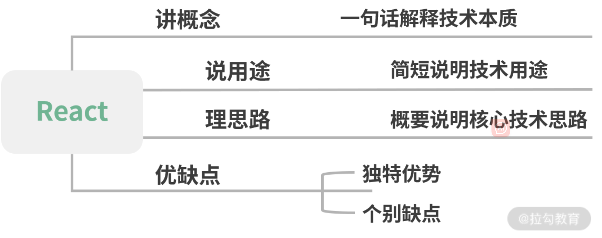

## 1、组件基础

（ 01 ~ 05 ）：从经典面试问题入手带你梳理组件的设计原理与思路，帮助你掌握分析和解决问题的技巧。

### 1.1 谈一谈对 React 的理解

   对待**概念题**，四字口诀“讲说理列”，**非线性**的结构化模式阐述答案

   - 讲概念：用简洁的话说清楚该技术是什么。最好能用一句话描述。

   - 说用途：描述该技术的用途。能够具体结合适合场景，拓展性的描述。

   - 理思路：梳理该技术的核心思路或运作流程。这个地方可深可浅，如果对其有足够深入的了解，建议详细地展开说明。

   - 优缺点，列一遍：对该技术栈的优缺点进行列举。列举优缺点肯定有与其他技术方案横向对比的过程，那么在这个过程中，切忌刻意地踩一捧一，容易引发面试官的反感。

   

   回答

   - React 是一个网页 UI 框架，通过组件化的方式解决视图层开发复用的问题，本质是一个组件化框架。

   - 它的核心设计思路有三点，分别是声明式、组件化与 通用性。
     - 声明式的优势在于直观与组合。
     - 组件化的优势在于视图的拆分与模块复用，可以更容易做到高内聚低耦合。
     - 通用性在于一次学习，随处编写。比如 React Native，React 360 等， 这里主要靠虚拟 DOM 来保证实现。
   - 这使得 React 的适用范围变得足够广，无论是 Web、Native、VR，甚至 Shell 应用都可以进行开发。这也是 React 的优势。
     但作为一个视图层的框架，React 的劣势也十分明显。它并没有提供完整的一揽子解决方 案，在开发大型前端应用时，需要向社区寻找并整合解决方案。虽然一定程度上促进了社区的繁荣，但也为开发者在技术选型和学习适用上造成了一定的成本。

### 1.2 为什么 React 要用` JSX`

“**为什么采用该技术方案**”这一类问题考察你的两个方面：

- 技术广度，深挖知识面涉猎广度，对流行框架的模板方案是否知悉了解；

- 技术方案调研能力。

**三步走技巧**

- 一句话解释 ` JSX`。首先能一句话说清楚 ` JSX`到底是什么。

- 
  核心概念。` JSX`用于解决什么问题？如何使用？

- 
  方案对比。与其他的方案对比，说明 React 选用 ` JSX`的必要性。


**回答**

- ` JSX`是一个 JavaScript 的语法扩展，结构类似 XML。` JSX`主要用于声明 React 元素，但 React 中并不强制使用 ` JSX`。即使使用了 ` JSX`，也会在构建过程中，通过 `Babel` 插件编译为 `React.createElement`。所以 ` JSX`更像是 `React.createElement` 的一种语法糖。
- 所以从这里可以看出，`React` 团队并不想引入` JavaScript` 本身以外的开发体系。而是希望通过合理的关注点分离保持组件开发的纯粹性。
- 接下来与 ` JSX`以外的三种技术方案进行对比。
  - 首先是模板，React 团队认为模板不应该是开发过程中的关注点，因为引入了模板语法、模板指令等概念，是一种不佳的实现方案。
  - 其次是模板字符串，模板字符串编写的结构会造成多次内部嵌套，使整个结构变得复杂，并且优化代码提示也会变得困难重重。
  - 最后是 `JXON`，同样因为代码提示困难的原因而被放弃。
- 所以 `React` 最后选用了 ` JSX`，因为 ` JSX`与其设计思想贴合，不需要引入过多新的概念，对编辑器的代码提示也极为友好。

**Babel 插件如何实现 `JSX` 到 `JS` 的编译？** 

Babel 读取代码并解析，生成 `AST`，再将 `AST` 传入插件层进行转换，在转换时就可以将 `JSX` 的结构转换为 `React.createElement` 的函数。如下代码所示：

```js
module.exports = function (babel) {
  var t = babel.types;
  return {
    name: "custom-jsx-plugin",
    visitor: {
      JSXElement(path) {
        var openingElement = path.node.openingElement;
        var tagName = openingElement.name.name;
        var args = []; 
        args.push(t.stringLiteral(tagName)); 
        var attribs = t.nullLiteral(); 
        args.push(attribs); 
        var reactIdentifier = t.identifier("React"); //object
        var createElementIdentifier = t.identifier("createElement"); 
        var callee = t.memberExpression(reactIdentifier, createElementIdentifier)
        var callExpression = t.callExpression(callee, args);
        callExpression.arguments = callExpression.arguments.concat(path.node.children);
        path.replaceWith(callExpression, path.node); 
      },
    },
  };
};
```

### 1.3 如何避免生命周期中的坑

“如何避免坑？”更深层的意思是“你蹚过多少坑？不仅需要对知识概念有体系化的认知——“讲概念，说用途，理思路，优缺点，来一遍”，还需要对你长期开发过程中的思考，有经验层面的方法总结

“如何避免坑？”换种思维思考也就是“为什么会有坑？”在代码编写中，遇到的坑往往会有两种：

- 在不恰当的时机调用了不合适的代码；
- 在需要调用时，却忘记了调用。

根据破题的思路，我们需要确立讨论的范围：

- 基于**周期**的梳理，确认生命周期函数的使用方式；

- 基于**职责**的梳理，确认生命周期函数的适用范围。

**答案**

避免生命周期中的坑需要做好两件事：

 -  不在恰当的时候调用了不该调用的代码；
 -  在需要调用时，不要忘了调用。

那么主要有这么 7 种情况容易造成生命周期的坑。

- `getDerivedStateFromProps` 容易编写反模式代码，使受控组件与非受控组件区分模糊。
- `componentWillMount` 在 React 中已被标记弃用，不推荐使用，主要原因是新的异步渲染架构会导致它被多次调用。所以网络请求及事件绑定代码应移至 `componentDidMount` 中。
- `componentWillReceiveProps` 同样被标记弃用，被 `getDerivedStateFromProps` 所取代，主要原因是性能问题。
- `shouldComponentUpdate` 通过返回 true 或者 false 来确定是否需要触发新的渲染。主要用于性能优化。
- `componentWillUpdate` 同样是由于新的异步渲染机制，而被标记废弃，不推荐使用，原先的逻辑可结合 `getSnapshotBeforeUpdate` 与 `componentDidUpdate` 改造使用。
- 如果在 `componentWillUnmount` 函数中忘记解除事件绑定，取消定时器等清理操作，容易引发 bug。
- 如果没有添加错误边界处理，当渲染发生异常时，用户将会看到一个无法操作的白屏，所以一定要添加。


### 1.4 类组件与函数组件有什么区别


## 2、状态管理

（ 06 ~ 08 ）：从状态的理解、运用与工程化实践入手，帮助你真正理解 React 的状态管理。


技术方案调研能力。

## 3、渲染流程

（ 09 ~ 12 ）：只有理解渲染流程，才能做出正确的性能优化。该模块可以加强你对 React 工作模式的理解程度。


## 4、性能优化

（ 13 ~ 15 ）：从工程化的视角阐述性能优化问题，带你掌握中高级职位必杀技。


## 5、React Hooks

（ 16 ~ 18 ）：解析 Hooks 的原理，API 的区别及最佳的设计模式，帮助你完美胜任组件模式向 Hooks 转移的工作。


## 6、React 生态

（ 19 ~ 20 ）：讲解面试必考的 React-Router 以及常用的工具库，带你探索 React 生态圈，帮助你掌握经过时间和大型项目验证的 React 工具。

