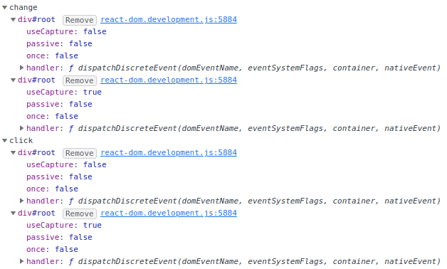
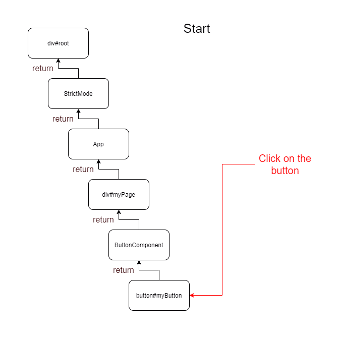
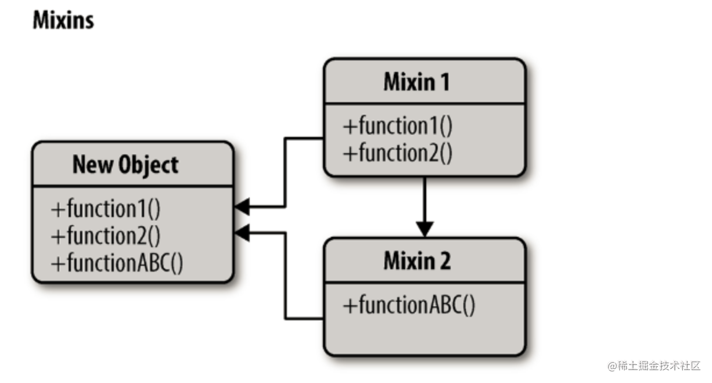
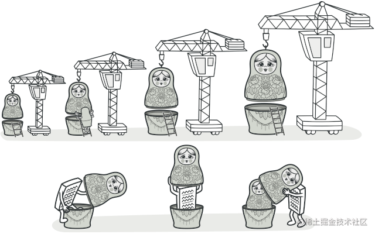
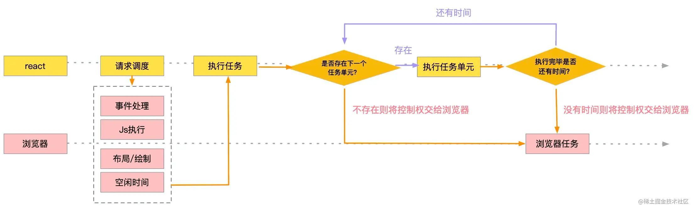
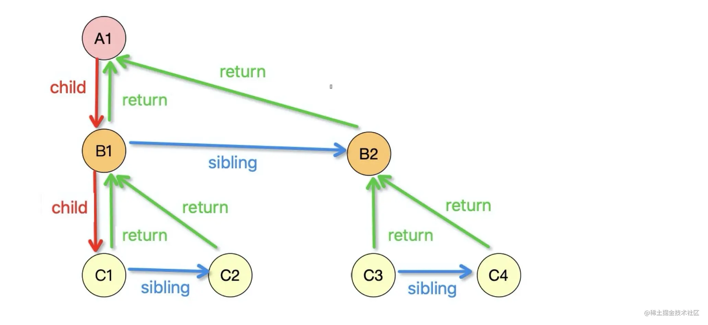
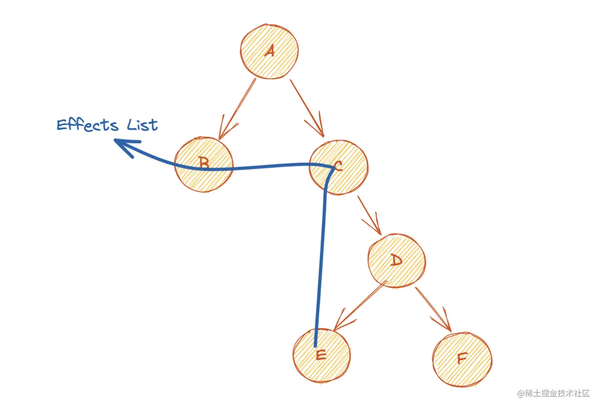

## 组件基础

### 1、React 事件

```jsx
import { StrictMode } from "react";
import ReactDOM from "react-dom";

import App from "./App";

const rootElement = document.getElementById("root");
ReactDOM.render(
  <StrictMode>
    <App />
  </StrictMode>,
  rootElement
);
```

**处理流程**

- “**顶层注册**”，其实是在root元素上绑定一个统一的事件处理函数。而不是在元素本身绑定事件处理函数。

  

- **事件代理**：对于不存在冒泡阶段的事件，React只委托了捕获阶段的监听器，而对于其他的事件，则对于捕获阶段和冒泡阶段都委托了监听器。

- **“事件收集**”指的是事件触发时（实际上是root上的事件处理函数被执行）

- **构造合成事件对象**，按照冒泡或捕获的路径去组件中收集真正的事件处理函数。

- “**统一触发**”发生在收集过程之后，对所收集的事件逐一执行，并共享同一个合成事件对象。这里有一个重点是绑定到root上的事件监听并非我们写在组件中的事件处理函数

  

**区别**

- `React16`中，对`document`的事件委托都委托在冒泡阶段，当事件冒泡到`document`之后触发绑定的回调函数，在回调函数中重新模拟一次 **捕获-冒泡** 的行为，所以React事件中的`e.stopPropagation()`无法阻止原生事件的捕获和冒泡，因为原生事件的捕获和冒泡已经执行完了。

- `React17`中，对React应用根DOM容器的事件委托分别在捕获阶段和冒泡阶段

  - 当根容器接收到捕获事件时，先触发一次React事件的捕获阶段，然后再执行原生事件的捕获传播。所以React事件的捕获阶段调用`e.stopPropagation()`**能**阻止原生事件的传播。

  - 当根容器接受到冒泡事件时，会触发一次React事件的冒泡阶段，**此时原生事件的冒泡传播已经传播到根了**，所以React事件的冒泡阶段调用`e.stopPropagation()`**不能**阻止原生事件向根容器的传播，但是能阻止根容器到页面顶层的传播。

**为什么React实现了自己的事件机制**

- 将事件都代理到了根节点上，减少了事件监听器的创建，节省了内存

- 磨平浏览器差异，开发者无需兼容多种浏览器写法。如想阻止事件传播时需要编写`event.stopPropagation()` 或 `event.cancelBubble = true`，在React中只需编写`event.stopPropagation()`即可。

- 对开发者友好。只需在对应的节点上编写`onClick`、`onClickCapture`等代码即可完成click事件在该节点上冒泡节点、捕获阶段的监听，统一了写法。
- 方便 react 统一管理和事务机制。

**React的事件和普通的HTML事件有什么不同？**

- 对于事件名称命名方式，原生事件为全小写，react 事件采用小驼峰；

- 对于事件函数处理语法，原生事件为字符串，react 事件为函数；
- react 事件不能采用 `return false` 的方式来阻止浏览器的默认行为，而必须要地明确地调用`preventDefault()`来阻止默认行为。

**正确绑定`this`**

- render方法中使用bind

- render方法中使用箭头函数

- constructor中bind

- 定义阶段使用箭头函数绑定

  ```jsx
  handleClick() {
  	console.log('this > ', this);
  }
  
  <div onClick={handleClick.bind(this)}>test</div>
  <div onClick={e => handleClick(e)}>test</div>
  handleClick = () => {
  	console.log('this > ', this);
  }
  ```

  

参考：

[React17事件机制](https://juejin.cn/post/7164582718053810184)

[「react进阶」一文吃透react事件系统原理](https://juejin.cn/post/6955636911214067720?searchId=2023072420425497B8B45C32F441E8ABD4)

[深入React合成事件机制原理](https://segmentfault.com/a/1190000039108951)

### 2、高阶组件、Render props、hooks 区别

**Higher-order components are not commonly used in modern React code**

**2.1 `Mixin`设计模式**



```jsx
// 在每个组件都引入写日志的
var LogMixin = {
  log: function() {
    console.log('log');
  },
  componentDidMount: function() {
    console.log('in');
  },
  componentWillUnmount: function() {
    console.log('out');
  }
};

var User = React.createClass({
  mixins: [LogMixin],
  render: function() {
    return (<div>...</div>)
  }
});

var Goods = React.createClass({
  mixins: [LogMixin],
  render: function() {
    return (<div>...</div>)
  }
});
```

**`Mixin`带来的危害**

- `Mixin`可能会相互依赖，相互耦合，不利于代码维护
- 不同的`Mixin`中的方法可能会相互冲突
- `Mixin`非常多时，组件是可以感知到的，甚至还要为其做相关处理，这样会给代码造成滚雪球式的复杂性

**2.2 高阶组件（HOC）**

可以看作React对装饰模式的一种实现，高阶组件就是一个函数，且该函数接受一个组件作为参数，并返回一个新的组件。



```jsx
function logHoc(WrappedComponent) {
  return class extends Component {
    componentWillMount() {
      this.start = Date.now();
    }
    componentDidMount() {
      this.end = Date.now();
      console.log(`${WrappedComponent.dispalyName} 渲染时间：${this.end - this.start} ms`);
      console.log(`${user}进入${WrappedComponent.dispalyName}`);
    }
    componentWillUnmount() {
      console.log(`${user}退出${WrappedComponent.dispalyName}`);
    }
    render() {
      return <WrappedComponent {...this.props} />
    }
  }
}
```

**`HOC`的出现可以解决 `Mixin` 带来的风险**

- 高阶组件就是一个没有副作用的纯函数，各个高阶组件不会互相依赖耦合
- 高阶组件也有可能造成冲突，但我们可以在遵守约定的情况下避免这些行为
- 高阶组件并不关心数据使用的方式和原因，而被包裹的组件也不关心数据来自何处。高阶组件的增加不会为原组件增加负担


**HOC的缺陷**

- `HOC`需要在原组件上进行包裹或者嵌套，如果大量使用`HOC`，将会产生非常多的嵌套，这让**调试**变得非常困难。
- `HOC`可以劫持`props`，在不遵守约定的情况下也可能造成冲突。

**2.3 使用Hook可以同时解决`Mixin`和HOC带来的问题**

```jsx
const useLogger = (componentName, ...params) => {
  useDidMount(() => {
    console.log(`${componentName}初始化`, ...params);
  });
  useUnMount(() => {
    console.log(`${componentName}卸载`, ...params);
  })
  useDidUpdate(() => {
    console.log(`${componentName}更新`, ...params);
  });
};

function Page1(props){
  useLogger('Page1',props);
  return (<div>...</div>)
}
```

- 减少状态逻辑复用的风险

  `Hook`和`Mixin`在用法上有一定的相似之处，但是`Mixin`引入的逻辑和状态是可以相互覆盖的，而多个`Hook`之间互不影响，这让我们不需要在把一部分精力放在防止避免逻辑复用的冲突上。在不遵守约定的情况下使用`HOC`也有可能带来一定冲突，比如`props`覆盖等等，使用`Hook`则可以避免这些问题。

- 避免地狱式嵌套

  大量使用`HOC`的情况下让我们的代码变得嵌套层级非常深，使用`Hook`，我们可以实现扁平式的状态逻辑复用，而避免了大量的组件嵌套。

- 让组件更容易理解

  在使用`class`组件构建我们的程序时，他们各自拥有自己的状态，业务逻辑的复杂使这些组件变得越来越庞大，各个生命周期中会调用越来越多的逻辑，越来越难以维护。使用`Hook`，可以让你更大限度的将公用逻辑抽离，将一个组件分割成更小的函数，而不是强制基于生命周期方法进行分割。

- 使用函数代替class

  相比函数，编写一个`class`可能需要掌握更多的知识，需要注意的点也越多，比如`this`指向、绑定事件等等。另外，计算机理解一个函数比理解一个`class`更快。`Hooks`让你可以在`classes`之外使用更多`React`的新特性。

**2.4 render prop**

子组件调用prop得到`jsx`，父组件可以实现更多自定义操作，将组件内的state作为props传递给调用者，将渲染逻辑交给调用者

```jsx
function TabSwitcher({ tabIds, getHeader, renderContent }) {
  const [selectedId, setSelectedId] = useState(tabIds[0]);
  return (
    <>
      {tabIds.map((tabId) => (
        <button
          key={tabId}
          onClick={() => setSelectedId(tabId)}
        >
          {getHeader(tabId)}
        </button>
      ))}
      <hr />
      <div key={selectedId}>
        <h3>{getHeader(selectedId)}</h3>
        {renderContent(selectedId)}
      </div>
    </>
  );
}

<TabSwitcher
    tabIds={['first', 'second', 'third']}
    
    getHeader={tabId => {
    	return tabId[0].toUpperCase() + tabId.slice(1);
    }}
    renderContent={tabId => {
    	return <p>This is the {tabId} item.</p>;
    }}
/>
```

**children** 

```jsx
function RowList({ children }) {
  return (
    <div className="RowList">
      {Children.map(children, child =>
        <div className="Row">
          {child}
        </div>
      )}
    </div>
  );
}

<RowList>
  <p>This is the first item.</p>
  <p>This is the second item.</p>
  <p>This is the third item.</p>
</RowList>
```

参考：

[「react进阶」一文吃透React高阶组件(HOC)](https://juejin.cn/post/6940422320427106335?searchId=2023072610281262141810DABBA66D5F17#heading-52)

[React高阶组件(HOC)的入门📖及实践](https://juejin.cn/post/6844904050236850184)

[【React深入】从Mixin到HOC再到Hook](https://juejin.cn/post/6844903815762673671?searchId=2023072610281262141810DABBA66D5F17#heading-1)

### 3、Fiber

在 react16 引入 Fiber 架构之前，react 会采用递归对比虚拟DOM树，找出需要变动的节点，然后同步更新它们，这个过程 react 称为`reconcilation`（协调）。在`reconcilation`期间，react 会一直占用浏览器资源，会导致用户触发的事件得不到响应。

通过Fiber架构，让`reconcilation`过程变得可被中断。适时地让出CPU执行权，可以让浏览器及时地响应用户的交互。

`React16`中使用了 Fiber，但是` Vue` 是没有 Fiber 的，原因是二者的优化思路不一样：

1. `Vue` 是基于 template 和 watcher 的组件级更新，把每个**更新任务分割得足够小**，不需要使用到 Fiber 架构，将任务进行更细粒度的拆分
2. React 是**不管在哪里调用 `setState`，都是从根节点开始更新的**，更新任务还是很大，需要使用到 Fiber 将大任务分割为多个小任务，可以中断和恢复，不阻塞主进程执行高优先级的任务

Fiber 可以理解为是一个执行单元，也可以理解为是一种数据结构

- 一种流程控制原语，React Fiber 的思想和协程的概念是契合的: React 渲染的过程可以被中断，可以将控制权交回浏览器，让位给高优先级的任务，浏览器空闲后再恢复渲染

- Fiber 可以被理解为划分一个个更小的执行单元，它是把一个大任务拆分为了很多个小块任务，一个小块任务的执行必须是一次完成的，不能出现暂停，但是一个小块任务执行完后可以移交控制权给浏览器去响应用户，从而不用像之前一样要等那个大任务一直执行完成再去响应用户。

  

- `Fiber` 的拆分单位是 `fiber`（`fiber tree`上的一个节点），每个 `DOM` 都可以表示为一个 `fiber`，`fiber`包括了 `child`（第一个子节点）、`sibling`（兄弟节点）、`return`（父节点）等属性。

  

从根节点开始渲染和调度的过程可以分为两个阶段：render 阶段、commit 阶段。

- render 阶段：这个阶段是可中断的，会找出所有节点的变更
  - 从根节点开始遍历，在遍历过程中，收集所有节点的变更产出`effect list`，注意其中只包含了需要变更的节点
  
    
  
- commit 阶段：这个阶段是不可中断的，会执行所有的变更
  - 根据`effect list`，将所有更新都 commit 到DOM树上

**Call Tree**

React itself runs in JavaScript and obeys JavaScript rules. But we can imagine that internally React has some kind of its own call stack to remember which component we are currently rendering, e.g. `[App, Page, Layout, Article /* we're here */]`.

js调用函数内部的函数会用到调用栈，组件是函数，react管理组件也会用到调用栈

React is different from a general purpose language runtime because it’s aimed at rendering UI trees. These trees need to “stay alive” for us to interact with them. The DOM doesn’t disappear after our first `ReactDOM.render()` call.

react的目标是渲染宿主树，界面上的`UI`必须是可以交互的（例如点击按钮，组件函数要处理，触发事件处理函数），所以组件函数不能在调用 `ReactDOM.render()` 后就被销毁

This may be stretching the metaphor but I like to think of React components as being in a “call tree” rather than just a “call stack”. When we go “out” of the `Article` component, its React “call tree” frame doesn’t get destroyed. We need to keep the local state and references to the host instances [somewhere](https://medium.com/react-in-depth/the-how-and-why-on-reacts-usage-of-linked-list-in-fiber-67f1014d0eb7).

对于react调用函数组件其实与js调用函数有不同点的，react调用函数组件可以称为call tree。react在调用完组件后，会把组建的state和宿主实例的引用保存起来

These “call tree” frames *are* destroyed along with their local state and host instances, but only when the [reconciliation](https://overreacted.io/react-as-a-ui-runtime/#reconciliation) rules say it’s necessary. If you ever read React source, you might have seen these frames being referred to as [Fibers](https://en.wikipedia.org/wiki/Fiber_(computer_science)).

Fibers are where the local state actually lives. When the state is updated, React marks the Fibers below as needing reconciliation, and calls those components.

 “call tree” frames 是Fibers，保存着state，当state更新时，子组件会重新渲染

参考：

[走进React Fiber的世界]([走进React Fiber的世界 - 掘金 (juejin.cn)](https://juejin.cn/post/6943896410987659277?searchId=20230726114754248F3A8A5FB482796FC4#heading-6))

[这可能是最通俗的 React Fiber(时间分片) 打开方式](https://juejin.cn/post/6844903975112671239?searchId=202307261148228C79FF235265F97984BA#heading-7)

### 4、哪些方法会触发 React 重新渲染？重新渲染 render 会做些什么？

**re-render:**

- Function components:
  - `useState` setters
  - `useReducer` dispatches
- Class components:
  - `this.setState()`
  - `this.forceUpdate()`
- Other:
  - Calling the `ReactDOM` top-level `render(<App>)` method again (which is equivalent to calling `forceUpdate()` on the root component)
  - Updates triggered from the new `useSyncExternalStore` hook

**The React team divides this work into two phases, conceptually:**

- The "**Render phase**" contains all the work of rendering components and calculating changes
- The "**Commit phase**" is the process of applying those changes to the DOM

**React 工作流**

React 是声明式 `UI` 库，负责将 State 转换为页面结构（虚拟 DOM 结构）后，再转换成真实 DOM 结构，交给浏览器渲染。当 State 发生改变时，React 会先进行调和（Reconciliation）阶段，调和阶段结束后立刻进入提交（Commit）阶段，提交阶段结束后，新 State 对应的页面才被展示出来。

React 的调和阶段需要做两件事。 **1、计算出目标 State 对应的虚拟 DOM 结构。2、寻找「将虚拟 DOM 结构修改为目标虚拟 DOM 结构」的最优更新方案。** React 按照深度优先遍历虚拟 DOM 树的方式，在一个虚拟 DOM 上完成两件事的计算后，再计算下一个虚拟 DOM。第一件事主要是调用类组件的 render 方法或函数组件自身。第二件事为 React 内部实现的 `Diff` 算法，`Diff` 算法会记录虚拟 DOM 的更新方式（如：Update、Mount、Unmount），为提交阶段做准备。

React 的提交阶段也需要做两件事。 **1、将调和阶段记录的更新方案应用到 DOM 中。2、调用暴露给开发者的钩子方法，如：`componentDidUpdate`、`useLayoutEffect` 等。** 提交阶段中这两件事的执行时机与调和阶段不同，在提交阶段 React 会先执行 1，等 1 完成后再执行 2。


**渲染优化**

- 跳过不必要的组件更新。这类优化是在组件状态发生变更后，通过减少不必要的组件更新来实现。

  - `PureComponent`、`React.memo`

    ```jsx
    const Greeting = memo(function Greeting({ name }) {
      return <h1>Hello, {name}!</h1>;
    });
    ```

  - `shouldComponentUpdate`

  - `useMemo`、`useCallback` 实现稳定的 `Props` 值

    ```jsx
    // 依赖项没有变化（Object.is），useMemo 将返回之前计算的值。否则，React 将重新运行计算并返回新值。
    function TodoList({ todos, tab, theme }) {
      const visibleTodos = useMemo(() => filterTodos(todos, tab), [todos, tab]);
    }
    
    // useCallback 是「useMemo 的返回值为函数」时的特殊情况
    function ProductPage({ productId, referrer, theme }) {
      const handleSubmit = useCallback((orderDetails) => {
        post('/product/' + productId + '/buy', {
          referrer,
          orderDetails,
        });
      }, [productId, referrer]);
    }
    ```

  - 发布者订阅者跳过中间组件 `Render` 过程

  - 状态下放，缩小状态影响范围

  - 列表项使用 `key` 属性

  - `useMemo` 返回虚拟 `DOM`

  - 跳过回调函数改变触发的 Render 过程

  - `Hooks` 按需更新

  - 动画库直接修改 `DOM` 属性

- 提交阶段优化。这类优化的目的是减少提交阶段耗时。

  - 避免在 `didMount`、`didUpdate` 中更新组件 State

- 前端通用优化。这类优化在所有前端框架中都存在，本文的重点就在于将这些技巧应用在 `React` 组件中。

  - 组件按需挂载
  - 批量更新
  - 按优先级更新，及时响应用户
  - 缓存优化
  - `debounce`、`throttle` 优化频繁触

参考：

[`Blogged` Answers: A (Mostly) Complete Guide to React Rendering Behavior](https://blog.isquaredsoftware.com/2020/05/blogged-answers-a-mostly-complete-guide-to-react-rendering-behavior/#context-basics)

[React 性能优化 | 包括原理、技巧、Demo、工具使用](https://juejin.cn/post/6935584878071119885?searchId=2023072616381215225DAEA46FEA116C88#heading-16)

[浅谈React性能优化的方向](https://juejin.cn/post/6844903865926549511?searchId=2023072616381215225DAEA46FEA116C88#heading-15)

https://legacy.reactjs.org/docs/optimizing-performance.html
