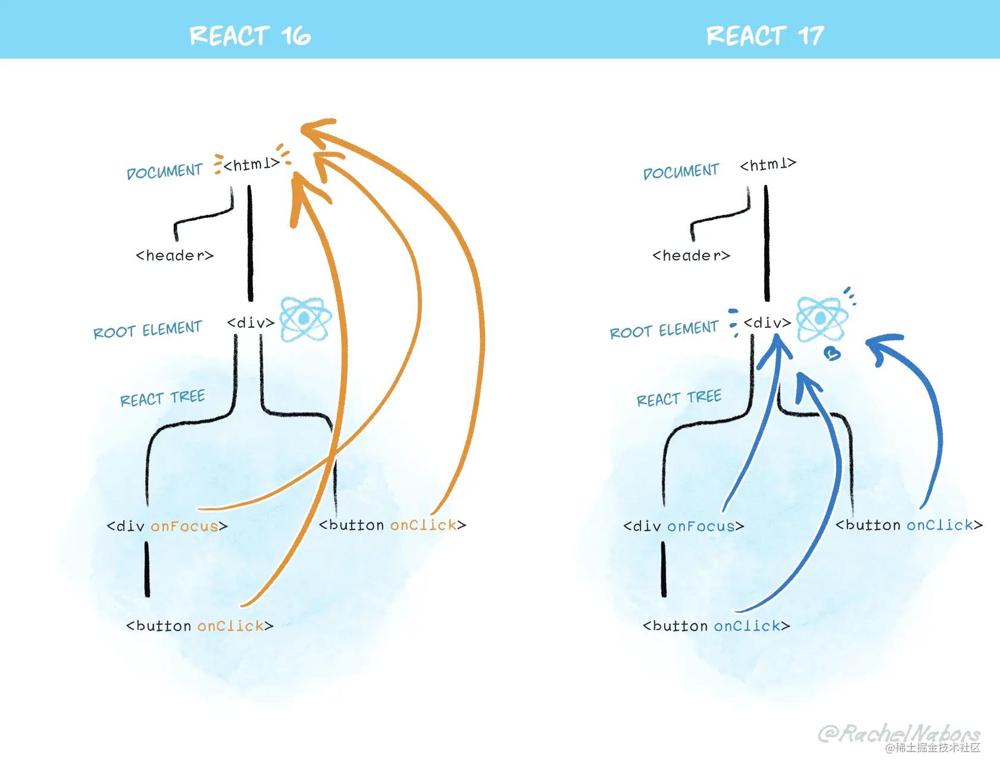

组件基础

## 1、React 事件

==todo==

所谓“顶层注册”，其实是在root元素上绑定一个统一的事件处理函数。

“事件收集”指的是事件触发时（实际上是root上的事件处理函数被执行），

构造合成事件对象，按照冒泡或捕获的路径去组件中收集真正的事件处理函数。

“统一触发”发生在收集过程之后，对所收集的事件逐一执行，并共享同一个合成事件对象。这里有一个重点是绑定到root上的事件监听并非我们写在组件中的事件处理函数

参考：

[「react进阶」一文吃透react事件系统原理](https://juejin.cn/post/6955636911214067720?searchId=2023072420425497B8B45C32F441E8ABD4)

https://metaatem.cn/react/React%E6%9C%80%E6%96%B0%E4%BA%8B%E4%BB%B6%E6%9C%BA%E5%88%B6.html#%E5%8E%9F%E7%90%86%E7%AE%80%E8%BF%B0

https://segmentfault.com/a/1190000039108951

2、React 高阶组件、Render props、hooks 有什么区别，为什么要不断迭代

