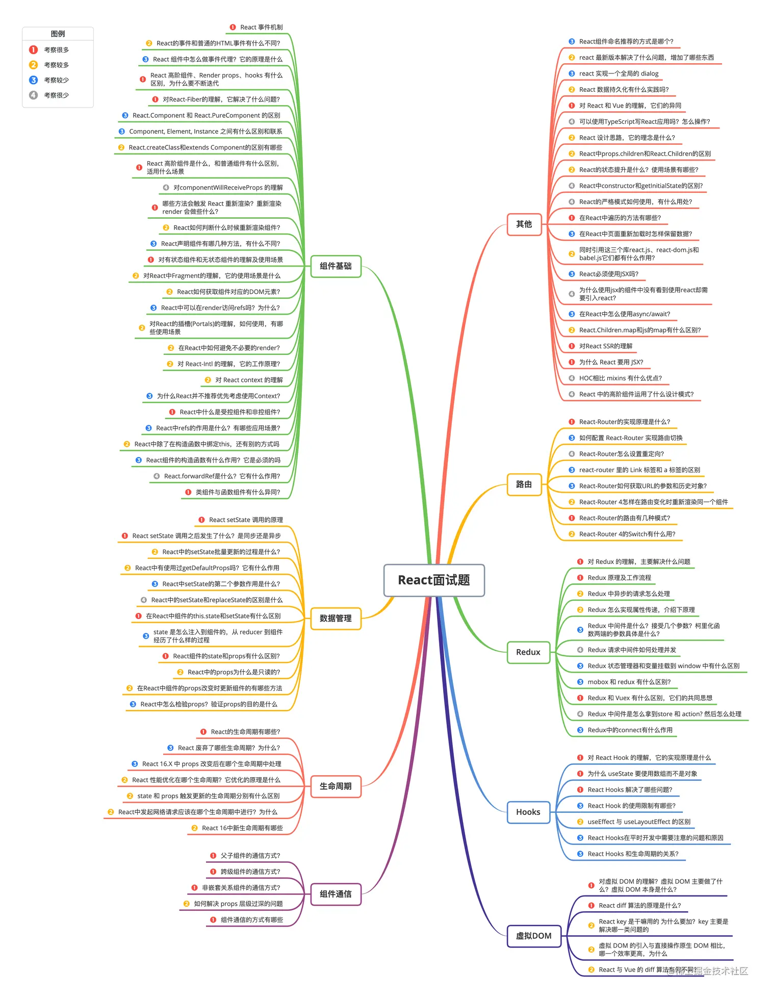

说说对React的理解？有哪些特性？

说说 Real DOM和 Virtual DOM 的区别？优缺点？

说说 React 生命周期有哪些不同阶段？每个阶段对应的方法是？

state 和 props有什么区别？

super()和super(props)有什么区别？

说说React中的setState执行机制

说说React的事件机制？

React事件绑定的方式有哪些？区别？

React构建组件的方式有哪些？区别？

React中组件之间如何通信？

React中的key有什么作用？

说说对React refs 的理解？应用场景？

说说对React中类组件和函数组件的理解？有什么区别？

说说对受控组件和非受控组件的理解？应用场景？

说说对高阶组件的理解？应用场景?

说说对React Hooks的理解？解决了什么问题？

说说react中引入css的方式有哪几种？区别？

在react中组件间过渡动画如何实现？

说说你对Redux的理解？其工作原理？

说说对Redux中间件的理解？常用的中间件有哪些？实现原理？

你在React项目中是如何使用Redux的? 项目结构是如何划分的？

说说你对React Router的理解？常用的Router组件有哪些？

说说React Router有几种模式？实现原理？

说说你对immutable的理解？如何应用在react项目中？

说说React render方法的原理？在什么时候会被触发？

说说你是如何提高组件的渲染效率的？在React中如何避免不必要的render？

说说React diff的原理是什么？

说说对Fiber架构的理解？解决了什么问题？

说说React Jsx转换成真实DOM过程？

说说 React 性能优化的手段有哪些？

说说你在React项目是如何捕获错误的？

说说React服务端渲染怎么做？原理是什么？

说说你在使用React 过程中遇到的常见问题？如何解决?

