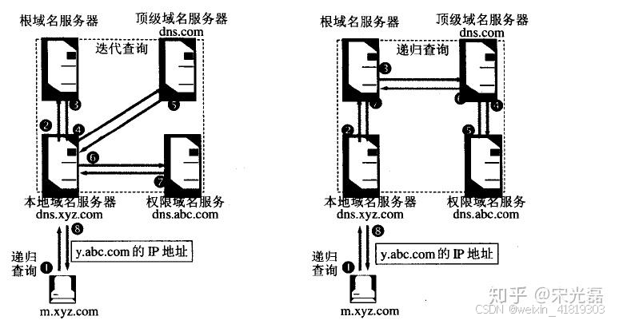
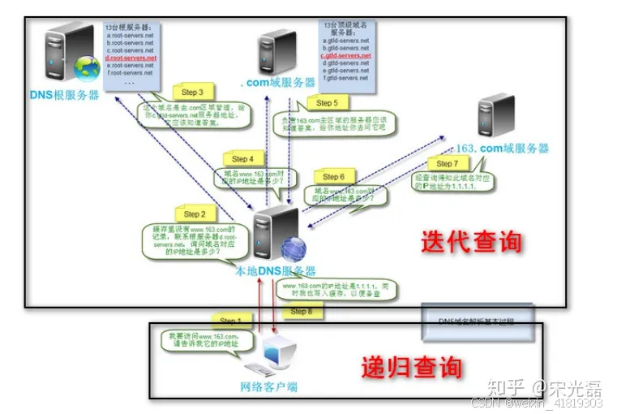
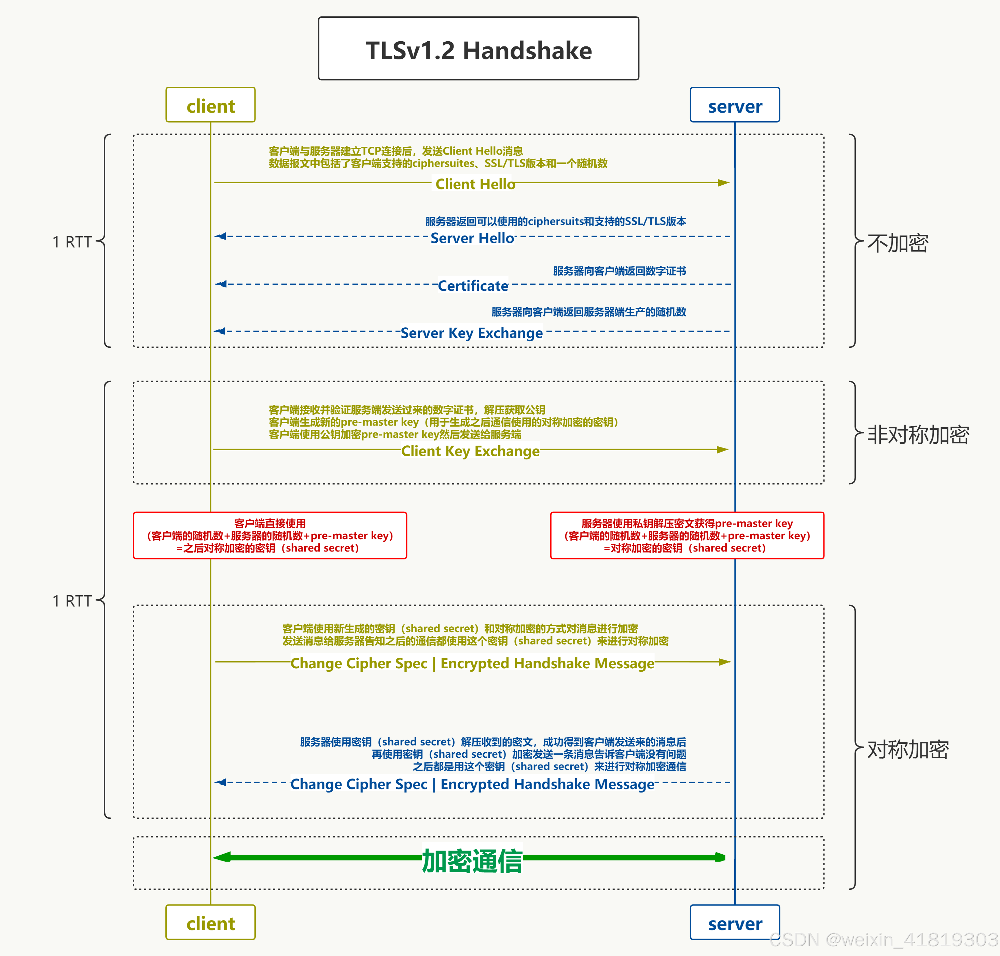
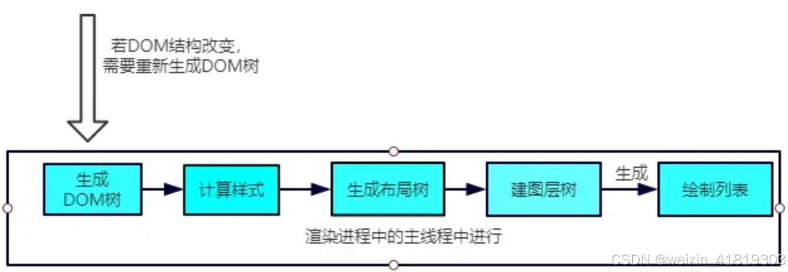
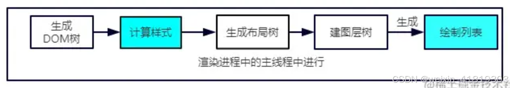

# 1、浏览器缓存

浏览器缓存（Browser Cache）是指浏览器将**网络资源**（例如 HTML、CSS、JavaScript、图片等）存储在本地，以便在下次请求相同资源时可以**直接从本地获取**。

 - **强缓存**是指浏览器直接从本地缓存中获取资源，而**无需向服务器发送任何请求**。
 - **协商缓存**是指浏览器先**向服务器发送一个请求**，询问服务器缓存是否过期。如果缓存未过期，服务器返回 304 Not Modified 状态码，浏览器使用本地缓存；如果缓存已过期，服务器返回 200 OK 状态码和新的资源。

## 1.1 强缓存

HTTP/1.0时期，使用的是Expires（被 Cache-Control 中的 max-age 指令取代），而HTTP/1.1使用的是Cache-Control。
当Expires和Cache-Control同时存在的时候，Cache-Control会优先考虑。
Cache-Control 头可以使用多个指令，指令之间用逗号分隔。以下是一些常用的指令：

 - public: 表示响应可以被任何对象（浏览器和代理服务器等）缓存。 
 - private:表示响应只能被浏览器缓存，不能被代理服务器缓存。 
 - max-age: 指定资源可以被缓存的最大时间，单位为秒。 
 - no-cache: 不管本地副本是否过期，使用资源副本前，一定要到源服务器进行副本有效性校验。 
 - no-store: 不缓存。
 - must-revalidate，一旦资源过期（比如已经超过max-age），在成功向原始服务器验证之前，缓存不能用该资源响应后续请求。

```js
// http-date过期时间，存在于服务端返回的响应头中
Expires: <http-date>
// GMT 格林威治标准时间 (Greenwich Mean Time) 被协调世界时 (Coordinated Universal Time, UTC) 所取代，UTC 基于原子钟计时，更加精确和稳定
Expires: Wed, 22 Nov 2019 08:41:00 GMT

// Cache-Control 可以根据需要组合使用不同的指令
app.get('/some-resource', (req, res) => {
  // ...
  // 设置 Cache-Control 头，资源可以被缓存 1 小时，并且缓存必须在使用之前向服务器验证是否过期
  res.setHeader('Cache-Control', 'public, max-age=3600, no-cache'); 
  // 发送资源
  res.sendFile('path/to/some-resource.js');
});
```

**1.2 协商缓存**
强缓存失效之后，浏览器在请求头中携带相应的缓存tag（Last-Modified 或 ETag）来向服务器发请求，由服务器根据这个tag，来决定是否使用缓存，这就是协商缓存。
Last-Modified/If-Modified-Since:

 - Last-Modified： 服务器在响应头中返回资源的最后修改时间。 
 - If-Modified-Since：浏览器在请求头中发送上次获取资源的最后修改时间。
   ETag/If-None-Match:
 - ETag： 服务器在响应头中返回资源的唯一标识符。 
 - If-None-Match： 浏览器在请求头中发送上次获取资源的唯一标识符。

```js
Last-Modified: <day-name>, <day> <month> <year> <hour>:<minute>:<second> GMT
If-Modified-Since: <day-name>, <day> <month> <year> <hour>:<minute>:<second> GMT

// 服务器根据当前文件的内容，给文件生成的唯一标识
ETag: "33a64df551425fcc55e4d42a148795d9f25f89d4"
// 弱验证器很容易生成，但不利于比较
ETag: W/"0815"
If-None-Match: <etag_value>, <etag_value>, …
// 星号是一个特殊值，可以代表任意资源。它只用在进行资源上传时，通常是采用 PUT 方法，来检测拥有相同识别 ID 的资源是否已经上传过了。
If-None-Match: *
```

**1.3 Cache API**
Cache API 是 HTML5 提供的一种用于缓存网络资源（例如 HTML、CSS、JavaScript、图片等）的机制。它可以提高页面加载速度，减少网络流量消耗，并实现离线访问。

```js
fetch(url).then((response) => {
  if (!response.ok) {
    throw new TypeError("bad response status");
  }
  return cache.put(url, response);
});

// Cache API 通常与 Service Worker 配合使用，以便在后台控制缓存行为。
// service-worker.js
// respondWith() 方法阻止浏览器默认的 fetch 操作，并且允许由你自己为 Response 提供一个 promise
self.addEventListener('fetch', event => {
  event.respondWith(
    caches.match(event.request)
      .then(response => {
        return response || fetch(event.request); // 缓存优先策略
      })
  );
});
```

缓存策略:

 - 缓存优先: 优先使用缓存中的资源，如果缓存中没有，则发送网络请求。
 - 网络优先: 优先发送网络请求，如果网络请求失败，则使用缓存中的资源。
 - 仅缓存: 只使用缓存中的资源，不发送网络请求。
 - 仅网络: 只发送网络请求，不使用缓存中的资源。
 - 缓存更新: 先使用缓存中的资源，然后在后台发送网络请求更新缓存。

注意事项:

 - Cache API 只能在 HTTPS 或 localhost 环境下使用。
 - Cache API 的存储容量有限，具体限制取决于浏览器。
 - Cache API 只能缓存同源 (相同协议、域名和端口) 的资源。

**1.4 缓存位置**
Memory Cache指的是内存缓存，从效率上讲它是最快的。但是从存活时间来讲又是最短的，当渲染进程结束后，内存缓存也就不存在了。
Disk Cache就是存储在磁盘中的缓存，从存取效率上讲是比内存缓存慢的，但是他的优势在于存储容量和存储时长。
策略如下：

 - 比较大的JS、CSS文件会直接被丢进磁盘，反之丢进内存 
 - 内存使用率比较高的时候，文件优先进入磁盘

ps：Service Worker/Cache API
Web Worker
Push Cache

# 2、浏览器的本地存储

浏览器本地存储 (Browser Local Storage)，为 Web 应用程序提供一种在用户计算机上存储数据的方式，以便在用户下次访问网站时可以访问这些数据。
浏览器本地存储和浏览器缓存都是 Web 应用程序性能优化中重要的环节。

 - 浏览器缓存用于缓存网络资源，可以提高页面加载速度和减少网络流量消耗。
 - 浏览器本地存储用于存储应用程序数据，可以提高用户体验和应用程序效率。

**2.1 Cookie**
特点:

- 存储容量较小，通常限制在 4KB 左右。
- 会随着每个 HTTP 请求发送到服务器，增加网络负载。
- 可以设置过期时间，过期后自动删除。可以设置作用域，例如只在特定域名或路径下有效。
- 安全缺陷。由于 Cookie 以纯文本的形式在浏览器和服务器中传递，很容易被非法用户截获，然后进行一系列的篡改。
  用途:
- 会话管理 (例如用户登录状态)。
- 个性化设置 (例如网站主题、语言)。
- 跟踪用户行为 (例如广告跟踪)。

```js
// 创建 / 表示在整个网站都有效，/users 表示只在 /users 路径下有效
// secure: 如果设置为 true，Cookie 将只在 HTTPS 连接下传输。
// HttpOnly: 如果设置为 true，Cookie 将无法通过 JavaScript 访问，可以提高安全性。
// SameSite: 用于防止跨站请求伪造 (CSRF) 攻击，可以设置为 Strict、Lax 或 None。
document.cookie = "username=John Doe; expires=Thu, 18 Dec 2024 12:00:00 UTC; path=/";
// 读取
const cookies = document.cookie.split(';');
const output = document.getElementById("cookie-value");
// 更新 Cookie 的方法是重新设置 Cookie，新的 Cookie 会覆盖旧的 Cookie
document.cookie = "username=Jane Doe; expires=Thu, 18 Dec 2024 12:00:00 UTC; path=/";
// 删除 Cookie 的方法是将 Cookie 的过期时间设置为过去的时间
document.cookie = "username=; expires=Thu, 01 Jan 1970 00:00:00 UTC; path=/";
```

**2.2 Web Storage (localStorage 和 sessionStorage):**
特点:

- 存储容量较大，通常为 5MB 或 10MB。
- 不会随着每个 HTTP 请求发送到服务器，减少网络负载。
- localStorage 存储的数据永久保存，除非手动删除。
- sessionStorage 存储的数据只在当前会话 (浏览器窗口或标签页) 有效，关闭会话后自动删除。
- Web Storage 存储的数据只能是字符串，如果需要存储其他类型的数据，需要先将其转换为字符串，例如使用 JSON.stringify() 方法。
- Web Storage 只能在同源 (相同协议、域名和端口) 的页面之间共享数据。
- Web Storage 可以被用户禁用，因此不能依赖 Web Storage 来存储关键数据。
  用途:
- 存储用户偏好设置。
- 存储应用程序状态。
- 存储离线数据。

```js
// 存储数据:
localStorage.setItem('username', 'John Doe');
// 读取数据:
const username = localStorage.getItem('username');
// 删除数据:
localStorage.removeItem('username');
// 清空所有数据:
localStorage.clear();
```

**2.3 IndexedDB**
IndexedDB 是一种在浏览器中存储大量结构化数据的数据库，它提供了高性能、事务性、异步的操作方式，非常适合构建离线 Web 应用程序。
特点:

- 存储容量更大，没有明确的限制。
- 支持事务处理，保证数据一致性。
- 支持索引，可以快速查询数据。
- 使用 JavaScript API 进行操作，更加灵活。
  用途:
- 存储大量结构化数据。
- 构建离线 Web 应用程序。

```js
// 打开数据库
let db;
const request = indexedDB.open("MyTestDatabase");
request.onerror = (event) => {
  console.error("为什么不允许我的 web 应用使用 IndexedDB！");
};
request.onsuccess = (event) => {
  db = event.target.result;
};
```

**2.4 File System API**
File System API 允许 Web 应用程序访问用户计算机上的文件系统。它提供了一种安全的方式来读取、写入和管理本地文件。
特点:

- 允许 Web 应用程序访问用户计算机上的文件系统。
- 需要用户授权才能访问。
  用途:
- 读取和写入本地文件。
- 构建本地文件管理器。

```js
// 请求读取权限
const [fileHandle] = await window.showOpenFilePicker();
// 读取文件
const file = await fileHandle.getFile();
const contents = await file.text();
```

# 3、从输入 URL 到页面呈现发生了什么？

**网络篇**

1. 解析 URL
   浏览器首先会解析 URL，提取出协议 (例如 HTTP 或 HTTPS)、域名 (例如 www.example.com)、端口号 (例如 80 或 443)、路径 (例如 /index.html)、查询参数 (例如 ?name=john&age=30) 等信息。
2. 查找强缓存
   先检查强缓存，如果命中直接使用，否则进入下一步。
3. DNS解析

- 浏览器会将域名转换为 IP 地址。
- 浏览器会先检查本地 DNS 缓存，如果缓存中存在该域名的 IP 地址，则直接使用缓存中的地址。
- 如果本地 DNS 缓存中不存在该域名的 IP 地址，浏览器会向 DNS 服务器发送查询请求，进行递归查询。
- 本地名称服务器向 其他DNS服务器采用迭代查询。
  
  
  DNS优化
  （1）使用 DNS 预解析 (DNS Prefetching)
  原理: 在页面加载过程中，提前解析页面中可能用到的域名，例如链接、图片、脚本等资源的域名。
  方法: 在 HTML 页面中添加 `<link rel="dns-prefetch" href="//example.com">` 标签。
  效果: 当用户点击链接或加载资源时，DNS 解析已经完成，可以减少页面加载时间。
  （2）使用 DNS 预连接 (DNS Preconnect):
  原理: 在页面加载过程中，提前与可能用到的域名建立 TCP 连接。
  方法: 在 HTML 页面中添加 `<link rel="preconnect" href="//example.com">` 标签。
  效果: 当用户点击链接或加载资源时，TCP 连接已经建立，可以减少页面加载时间。
  （3）减少 DNS 查询次数:
  合并域名: 将多个资源 (例如图片、脚本) 放到同一个域名下，可以减少 DNS 查询次数。
  使用 CDN: CDN 可以将资源缓存到距离用户更近的服务器上，可以减少 DNS 查询次数和网络延迟。

```html
<!-- 不推荐：多个域名 -->


<script src="https://cdn3.example.com/script1.js"></script>
<!-- 推荐：合并域名 -->


<script src="https://scripts.example.com/script1.js"></script>

<!-- 不推荐：直接引用源站资源 -->

<!-- 推荐：使用 CDN -->

```

4. 建立 TCP 连接
   TCP (Transmission Control Protocol) 是一种**面向连接的、可靠的（三次握手）**传输层协议，它通过三次握手 (Three-way Handshake) 来建立客户端和服务器之间的连接。

- 三次握手可以确认客户端和服务器都能够发送和接收数据，确保连接的可靠性。
- 四次挥手可以确保客户端和服务器都完成了数据的发送，避免数据丢失。

```
客户端                                     服务器
  | SYN (seq=x)                          |
  |--------------------------------------->|
  | SYN-ACK (seq=y, ack=x+1)    |
  |<--------------------------------------|
  | ACK (ack=y+1)                        |
  |--------------------------------------->|
  | 连接已建立                             |

  | FIN (seq=x)                            |
  |--------------------------------------->|
  | ACK (ack=x+1)                        |
  |<--------------------------------------|
  | FIN (seq=y)                          |
  |<--------------------------------------|
  | ACK (ack=y+1)                        |
  |--------------------------------------->|
  | 连接已关闭                            |
```

TCP优化

- 优化资源文件大小: 通过压缩文件、使用 WebP 格式图片、移除不必要的代码和资源、使用矢量图形等方式，减少需要传输的数据量，从而减少 TCP 协议的传输时间。
- 使用 WebSocket: 对于需要实时通信的应用，可以使用 WebSocket 协议，它建立在 TCP 协议之上，但可以实现全双工通信，减少延迟。

5. 发送 HTTP 请求
   HTTPS 连接的建立过程，即 TLS 握手，通过非对称加密和对称加密的结合，确保了通信双方的身份验证和数据传输的安全性。
   浏览器发 HTTP 请求要携带三样东西:请求行（请求方法、请求URI和HTTP版本协议）、请求头和请求体（POST方法下存在）。
   
   HTTP 优化

- 减少 HTTP 请求次数: 
  - 通过合并文件
  - 使用 Icon Font：使用字体图标代替图片图标
  - 懒加载图片：延迟加载页面上的图片
  - 使用 Data URI：将小图片或文件编码成 Base64 字符串
- 使用HTTP/2: HTTP/2 支持多路复用、头部压缩、服务器推送等特性，可以有效提高 HTTP 连接的效率，减少页面加载时间。
- 使用HTTP/3: HTTP/3 基于 QUIC 协议，提供更快的连接建立速度、更低的延迟和更高的安全性，进一步提升 Web 性能。
- 使用 Cookie-free 域名: 将静态资源 (例如图片、脚本、样式表) 放到不使用 Cookie 的域名下，可以减少 Cookie 传输的开销。
- 启用 Keep-Alive: Keep-Alive 可以保持 HTTP 连接一段时间，避免每次请求都需要重新建立连接，减少连接建立的开销。

6. 网络响应

- HTTP 请求到达服务器，服务器进行对应的处理。最后要把数据传给浏览器，也就是返回网络响应。
- 跟请求部分类似，网络响应具有三个部分:响应行（HTTP协议版本、状态码和状态描述）、响应头和响应体。
- 判断请求头或响应头中包含Connection: Keep-Alive，表示建立了持久连接，这样TCP连接会一直保持，之后请求统一站点的资源会复用这个连接。

**解析算法篇**

7. 构建 DOM 树

8. 样式计算

9. 生成布局树


**渲染过程篇**

10. 建图层树

11. 生成绘制列表

12. 生成图块和生成位图

13. 显示器显示内容

# 4、重绘和回流

**4.1 回流 Reflow**
当渲染树中的一部分或全部元素的尺寸、布局或结构发生变化时，浏览器需要重新计算元素的几何属性，并重新构建渲染树。这个过程称为回流。
**触发条件:**

- 添加、删除或修改 DOM 元素。
- 修改元素的尺寸或位置 (例如 width、height、margin、padding)。
- 修改元素的内容 (例如文本内容、图片)。
- 修改浏览器窗口大小或字体大小。
- 获取元素的尺寸或位置信息 (例如 offsetWidth、offsetHeight)。
  
  **4.2 重绘 Repaint**
  当元素的样式发生变化，但不会影响其布局时，浏览器只需要重新绘制元素的外观。这个过程称为重绘。
  触发条件:
- 修改元素的颜色、背景色、边框等样式。
- 修改元素的 visibility 属性。
- 修改元素的 outline 样式。
  
  **4.3 如何减少重绘和回流**
- 避免频繁操作 DOM: 尽量减少 DOM 操作的次数，例如使用 DocumentFragment 批量更新 DOM。
- 使用 CSS 类名: 使用 CSS 类名来修改样式，而不是直接修改元素的 style 属性。
- 使用离线渲染: 使用 createDocumentFragment 或 display: none 创建一个脱离文档流的节点进行操作，最后一次性添加到文档中。
- 避免频繁读取布局信息: 尽量避免频繁读取元素的尺寸和位置信息，例如 offsetWidth、offsetHeight 等。
- 使用 GPU 加速: 使用 CSS3 动画和 transform 属性，可以利用 GPU 加速渲染，减少 CPU 负载。