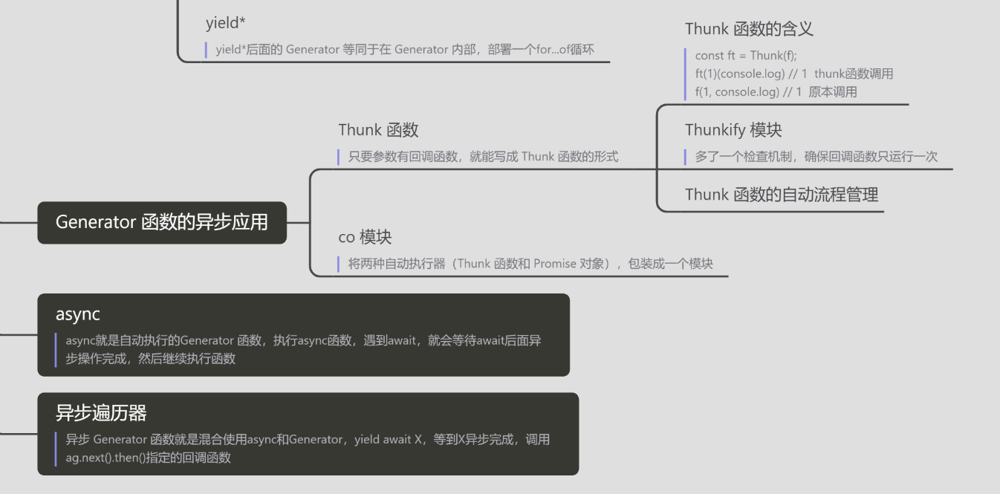
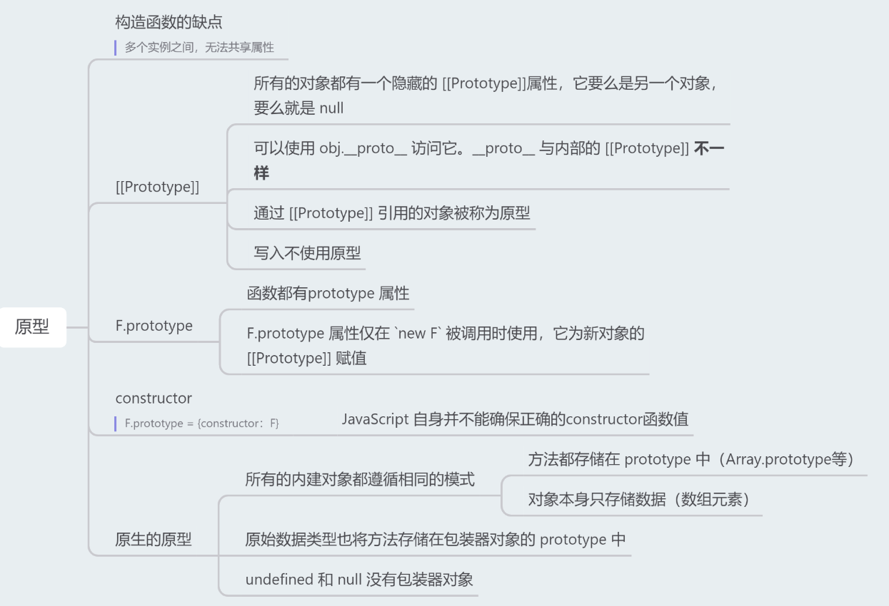

## `ECMAScript`
### 1、数组的遍历方法有哪些


### 2、为什么普通 for 循环的性能远远高于 forEach 的性能，请解释其中的原因

- for 循环没有任何额外的函数调用栈和上下文；
- forEach函数签名实际上是

```
array.forEach(function(currentValue, index, arr), thisValue)
```

它不是普通的 for 循环的语法糖，还有诸多参数和上下文需要在执行的时候考虑进来，这里可能拖慢性能；

### 3、介绍下 Set、Map、`WeakSet` 和 `WeakMap` 的区别

Set

1.成员不能重复
2.只有健值，没有健名，有点类似数组。
3.可以遍历，方法有add, delete,has

weakSet

1.成员都是对象
2.成员都是弱引用，随时可以消失。 可以用来保存DOM节点，不容易造成内存泄漏
3.不能遍历，方法有add, delete,has

Map

1.本质上是健值对的集合，类似集合
2.可以遍历，方法很多，可以干跟各种数据格式转换

`weakMap`

1.直接受对象作为健名（null除外），不接受其他类型的值作为健名
2.健名所指向的对象，不计入垃圾回收机制
3.不能遍历，方法同get,set,has,delete

### 4、`Promise.all` 和 `Promise.race` 的区别的使用场景

（1）`Promise.all`可以将多个`Promise`实例包装成一个新的Promise实例。同时，成功和失败的返回值是不同的，成功的时候返回的是**一个结果数组**，而失败的时候则返回**最先被reject失败状态的值**。

`Promise.all` 中传入的是数组，返回的也是是数组，并且会将进行映射，传入的promise对象返回的值是按照顺序在数组中排列的，但是注意的是他们执行的顺序并不是按照顺序的，除非可迭代对象为空。

需要注意，`Promise.all` 获得的成功结果的数组里面的数据顺序和 `Promise.all`接收到的数组顺序是一致的，这样当遇到发送多个请求并根据请求顺序获取和使用数据的场景，就可以使用 `Promise.all` 来解决。

（2）`Promse.race` 就是赛跑的意思，意思就是说，Promise.race([p1, p2, p3])里面哪个结果获得的快，就返回那个结果，不管结果本身是成功状态还是失败状态。当要做一件事，超过多长时间就不做了，可以用这个方法来解决：

```javascript
Promise.race([promise1,timeOutPromise(5000)]).then(res=>{})
```
### 5、`Async/Await` 实现方式

Async/Await就是一个**自执行**的generate函数。利用generate函数的特性把异步的代码写成“同步”的形式。

```javascript
var fetch = require('node-fetch');

function* gen(){  // 这里的*可以看成 async
  var url = 'https://api.github.com/users/github';
  var result = yield fetch(url);  // 这里的yield可以看成 await
  console.log(result.bio);
}

var g = gen();
var result = g.next();

result.value.then(function(data){
  return data.json();
}).then(function(data){
  g.next(data);
});
```




### 6、`setTimeout`、Promise、`Async/Await` 的区别

主要是考察这三者在事件循环中的区别，事件循环中分为宏任务队列和微任务队列。

其中`settimeout`的回调函数放到**宏任务**队列里，等到执行栈清空以后执行；

`promise.then`里的回调函数会放到相应宏任务的**微任务队列里，等宏任务里面的同步代码执行完再执行**；

`async`函数表示函数里面可能会有异步方法，await后面跟一个表达式，async方法执行时，遇到await会立即执行表达式，然后把表达式后面的代码**放到微任务队列里，让出执行栈让同步代码先执行**。

### 可以介绍下 `JavaScript` 中的事件循环机制

微任务 `new Promise()` `new MutaionObserver()`

### 7、对闭包的理解

**闭包是指有权访问另一个函数作用域中变量的函数**，创建闭包的最常见的方式就是在一个函数内创建另一个函数，创建的函数可以访问到当前函数的局部变量。

闭包有两个常用的用途；

- 闭包的第一个用途是使我们在函数外部能够访问到函数内部的变量。通过使用闭包，可以通过在外部调用闭包函数，从而在外部访问到函数内部的变量，可以使用这种方法来创建私有变量。
- 闭包的另一个用途是使已经运行结束的函数上下文中的变量对象继续留在内存中，因为闭包函数保留了这个变量对象的引用，所以这个变量对象不会被回收。

### 8、可以介绍下原型和原型链



### 9、对象继承的方式有哪些

（1）第一种是以原型链的方式来实现继承，但是这种实现方式存在的缺点是，在包含有引用类型的数据时，会被所有的实例对象所共享，容易造成修改的混乱。还有就是在创建子类型的时候不能向超类型传递参数。

（2）第二种方式是使用借用构造函数的方式，这种方式是通过在子类型的函数中调用超类型的构造函数来实现的，这一种方法解决了不能向超类型传递参数的缺点，但是它存在的一个问题就是无法实现函数方法的复用，并且超类型原型定义的方法子类型也没有办法访问到。

（3）第三种方式是组合继承，组合继承是将原型链和借用构造函数组合起来使用的一种方式。通过借用构造函数的方式来实现类型的属性的继承，通过将子类型的原型设置为超类型的实例来实现方法的继承。这种方式解决了上面的两种模式单独使用时的问题，但是由于我们是以超类型的实例来作为子类型的原型，所以调用了两次超类的构造函数，造成了子类型的原型中多了很多不必要的属性。

（4）第四种方式是原型式继承，原型式继承的主要思路就是基于已有的对象来创建新的对象，实现的原理是，向函数中传入一个对象，然后返回一个以这个对象为原型的对象。这种继承的思路主要不是为了实现创造一种新的类型，只是对某个对象实现一种简单继承，ES5 中定义的 Object.create() 方法就是原型式继承的实现。缺点与原型链方式相同。

（5）第五种方式是寄生式继承，寄生式继承的思路是创建一个用于封装继承过程的函数，通过传入一个对象，然后复制一个对象的副本，然后对象进行扩展，最后返回这个对象。这个扩展的过程就可以理解是一种继承。这种继承的优点就是对一个简单对象实现继承，如果这个对象不是自定义类型时。缺点是没有办法实现函数的复用。

（6）第六种方式是寄生式组合继承，组合继承的缺点就是使用超类型的实例做为子类型的原型，导致添加了不必要的原型属性。寄生式组合继承的方式是使用超类型的原型的副本来作为子类型的原型，这样就避免了创建不必要的属性。

### 3、ES5/ES6 的继承除了写法以外还有什么区别

ES5的继承机制，是先创造一个独立的子类的实例对象，然后再将父类的方法添加到这个对象上面，即"实例在前,继承在后"。

ES6的继承机制，则是先将父类的属性和方法加到一个空对象上面，然后再将该对象作为子类的实例，即"继承在前，实例在后"。

这也是为什么ES6的继承必须先调用super方法，因为这一步会生成一个继承父类的this的对象，没有这一步就无法继承父类。

## `TypeScript`

### 1、TS中的interface和type有什么区别

相同点：

- 都可以描述一个对象或者函数；
- 都允许拓展，interface可以extends type，type也可以extends interface

不同点：

- type可以声明基本类型别名，联合类型，元组等类型；
- type语句中还可以使用typeof获取实例的类型进行赋值；
- interface能够声明合并。
- `interface` 可以通过 `extends` 关键字来扩展其他接口或类，实现接口的继承。而 `type` 可以使用交叉类型（`&`）来实现类型的合并。

### 2、Object object {}

 `Object`

- 大写的`Object`类型代表 JavaScript 语言里面的广义对象。所有可以**转成对象的值**，都是`Object`类型，这囊括了几乎所有的值（除了`undefined`和`null`）

- **空对象`{}`是`Object`类型的简写形式**

`object`

- 小写的`object`类型代表 JavaScript 里面的狭义对象，即可以用字面量表示的对象，只包含**对象、数组和函数**，不包括原始类型的值

无论是大写的`Object`类型，还是小写的`object`类型，都只包含 JavaScript 内置对象原生的属性和方法，**用户自定义的属性和方法都不存在于这两个类型之中。**

## 框架

### 1、React中可以在render访问refs吗？为什么？

###   `ueEffect` 与 `ueLayoutEffect` 区别在哪里

不可以，render 阶段 DOM 还没有生成，无法获取 DOM。DOM 的获取需要在 pre-commit 阶段和 commit 阶段：


### 2、哪些方法会触发 React 重新渲染？重新渲染 render 会做些什么


### 3、对React-Fiber的理解，它解决了什么问题？

React V15 在渲染时，会递归比对 VirtualDOM 树，找出需要变动的节点，然后同步更新它们， 一气呵成。这个过程期间， React 会占据浏览器资源，这会导致用户触发的事件得不到响应，并且会导致掉帧，**导致用户感觉到卡顿**。

为了给用户制造一种应用很快的“假象”，不能让一个任务长期霸占着资源。 可以将浏览器的渲染、布局、绘制、资源加载(例如 HTML 解析)、事件响应、脚本执行视作操作系统的“进程”，需要通过某些调度策略合理地分配 CPU 资源，从而提高浏览器的用户响应速率, 同时兼顾任务执行效率。

所以 React 通过Fiber 架构，让这个执行过程变成可被中断。“适时”地让出 CPU 执行权，除了可以让浏览器及时地响应用户的交互，还有其他好处:

- 分批延时对DOM进行操作，避免一次性操作大量 DOM 节点，可以得到更好的用户体验；
- 给浏览器一点喘息的机会，它会对代码进行编译优化（JIT）及进行热代码优化，或者对 reflow 进行修正。

**核心思想:** Fiber 也称协程或者纤程。它和线程并不一样，协程本身是没有并发或者并行能力的（需要配合线程），它只是一种控制流程的让出机制。让出 CPU 的执行权，让 CPU 能在这段时间执行其他的操作。渲染的过程可以被中断，可以将控制权交回浏览器，让位给高优先级的任务，浏览器空闲后再恢复渲染。

### 3、Virtual DOM 真的比操作原生 DOM 快吗

比较一下 innerHTML vs. Virtual DOM 的重绘性能消耗：

- innerHTML: render html string O(template size) + 重新创建所有 DOM 元素 O(DOM size)
- Virtual DOM: render Virtual DOM + diff O(template size) + 必要的 DOM 更新 O(DOM change)

### 5、React.memo React.useMemo React.useCallback

### 在React中如何避免不必要的render

### 5、React 事件机制原理

## 性能优化

### 1、重排和重绘是什么，有什么区别

重排，重新排列，一般发生在布局变化或者元素大小发生变化时
重绘，重新绘制，一般发生在布局不变，视觉上变化的时候譬如阴影颜色啥的

区别

- **重排一定引起重绘**，重绘不一定引起重排
- 重绘比重排省去了布局和分层阶段，直接进入了绘制

### 2、什么是防抖和节流？有什么区别？如何实现？

####  定义

- 节流: n 秒内只运行一次，若在 n 秒内重复触发，只有一次生效
- 防抖: n 秒后在执行该事件，若在 n 秒内被重复触发，则重新计时

防抖在连续的事件，只需触发一次回调的场景有：

- 搜索框搜索输入。只需用户最后一次输入完，再发送请求
- 手机号、邮箱验证输入检测
- 窗口大小`resize`。只需窗口调整完成后，计算窗口大小。防止重复渲染。

节流在间隔一段时间执行一次回调的场景有：

- 滚动加载，加载更多或滚到底部监听
- 搜索框，搜索联想功能

3、是否遇到过页面卡顿的情况，怎么分析性能瓶颈，然后做优化

4、是否遇到过页面卡顿的情况，怎么分析性能瓶颈，然后做优化

## 工程化

简历有提到 稳定性治理 ，请问具体治理什么内容

看到简历有提到，公共库逻辑封装，可以介绍下具体封装了什么嘛


看到简历有提到，angular转react，请问下重构的手段有哪些

简历有提到 From组件封装，主要做了什么工作

表单拆分


