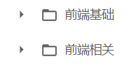
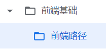

# `todo`

收集资料——整体了解——重点细节深入——实践

## 1 底层基础

- 计算机组成原理
- 编译原理

  - [字符编码](http://www.imkevinyang.com/2010/06/%E5%85%B3%E4%BA%8E%E5%AD%97%E7%AC%A6%E7%BC%96%E7%A0%81%EF%BC%8C%E4%BD%A0%E6%89%80%E9%9C%80%E8%A6%81%E7%9F%A5%E9%81%93%E7%9A%84.html)
- 操作系统
  - 鸟哥的Linux私房菜
- [Web 网络](https://developer.mozilla.org/zh-CN/docs/Web/HTTP)

  - https://www.keycdn.com/blog/http-security-headers
- 数据库
  - MySQL必知必会
  - **80 |** **程序员练级攻略：数据库**
- 浏览器架构
- 事件循环机制 
- `V8` 的内存管理 
- 浏览器的渲染流程

  - [超完整的Chrome浏览器客户端调试大全](http://www.igeekbar.com/igeekbar/post/156.htm)
- Web 安全

  - OWASP - Open Web Application Security Project
  - https://medium.com/@vcarl/overly-defensive-programming-e7a1b3d234c2
- 实践
- 用这些系统知识操作一下文件系统，实现一个可以拷贝目录树的小程序。
- 用 fork / wait / waitpid 写一个多进程的程序，用 pthread 写一个多线程带同步或互斥的程序。比如，多进程购票的程序。
- 用 signal / kill / raise / alarm / pause / sigprocmask 实现一个多进程间的信号量通信的程序。
- 学会使用 gcc 和 gdb 来编程和调试程序（参看我的[《**用 gdb 调试程序**》](https://blog.csdn.net/haoel/article/details/2879)）。
- 学会使用 makefile 来编译程序（参看我的[《**跟我一起写 makefile**》](https://blog.csdn.net/haoel/article/details/2886)）。
- Socket 的进程间通信。用 C 语言写一个 1 对 1 的聊天小程序，或是一个简单的 HTTP服务器。

87 | 程序员练级攻略：前端基础和底层原理
88 | 程序员练级攻略：前端性能优化和框架

## 2 三件套

- JavaScript 核心 1 2/6-2/19
- 设计模式 1 2/20-2/26
  - **76 |** **程序员练级攻略：软件设计**

- 函数式编程 1 2/27-3/5

- `CSS`/HTML 2 3/6-3/19

 Canvas（位图）、SVG（矢量图） 和 WebGL（3D 图）

## 3 常用框架

- React 2 3/20-4/2

- `Vue `1 4/3-416

- Node 4/17-4/30
  - [Node.js 最佳实践](https://github.com/goldbergyoni/nodebestpractices/blob/master/README.chinese.md)
  

## 4 构建工具链

**5/6做项目（多端 后管）过程中把4、5看完**

[带你入门前端工程](https://woai3c.github.io/introduction-to-front-end-engineering/)

[系统设计入门](https://github.com/xitu/system-design-primer/blob/translation/README-zh-Hans.md)

- 项目构建
- `nginx`
- 开发提速
- 版本控制
- 持续集成
- 测试
  - [JUnit User Guide](https://junit.org/junit5/docs/current/user-guide/)
  - [You Still Don’t Know How to Do Unit Testing](https://stackify.com/unit-testing-basics-best-practices/)
  - [Unit Testing Best Practices: JUnit Reference Guide](https://dzone.com/articles/unit-testing-best-practices)
  - [JUnit Best Practices](http://www.kyleblaney.com/junit-best-practices/)

- 性能优化
  - 骨架屏（按需）、图片懒加载、图片预加载、防抖节流、长列表*滚动*到可视区域动态加载

  - 小程序代码瘦身

  - 图片、字体等静态资源压缩

- 添加埋点：曝光上报、点击上报、呼吸上报
- 监控上报、测试上报、badjs上报
- 容灾演习
- Git 版本管理
  - https://backlog.com/git-tutorial/cn/
  - https://www.jianshu.com/p/1b65ed31da97

- 代码规范
- 包管理
- 编译构建
- 小程序工程化
  - https://mp.weixin.qq.com/s/tJN3Yz6usSt9LG37_pN7dw
  - https://mp.weixin.qq.com/s/_NSJTQ-4-8gTnwTVK-tn0A

- Code Review 
  - [Code Review Best Practices](https://blog.palantir.com/code-review-best-practices-19e02780015f?gi=cfb2fccae145)
  - [How Google Does Code Review](https://dzone.com/articles/how-google-does-code-review)
  - [LinkedIn’s Tips for Highly Effective Code Review](https://thenewstack.io/linkedin-code-review/)

## 5 框架和类库

- `TypeScript`
- 多端开发  多端自适应布局 屏幕适配
- 数据流管理
- 实用库
- 开发和调试
- Web Components
- SPA单页应用
- Progressive Web `Apps`
- Server-side rendering
- Static Site Generators
- `Graphql`
- Mobile applications
- Desktop Applications in JavaScript

1、页面开发框架：

（1）多端页面：（小程序原生页面、H5）

- [Taro 框架](https://taro-docs.jd.com/)（基于 React技术栈）

注2：有些业务，一开始只做H5，后来迭代时，要求做小程序原生页面。这一点也要纳入需求评估。

（2）H5页面：[Vue.js](https://v3.cn.vuejs.org/guide/introduction.html) 框架、React 框架

（3）App端：

- Android端开发语言：Kotlin（新）、Java（老）
- iOS端开发语言：Swift（新）、Objective-C（老）

（4）B端开发，UI框架：

- React 技术栈：[Ant Design](https://ant.design/index-cn)（简称Antd）
- Vue 技术栈：[Element](https://element.eleme.cn/#/zh-CN)、[Ant Design Vue](https://antdv.com/components/overview-cn)
- 较简单的CSS响应式框架：[Bootstrap](https://www.bootcss.com/)

（5）Node.js后端开发框架：

- Koa：新一代 Node.js 框架。
- [Egg.js](https://eggjs.github.io/zh/)：Egg 是在Koa基础上进一步封装的企业级Web开发框架。
- Express：比较老的Node.js 框架。

2、CSS预处理器：SASS

3、复杂图形、动画的实现难度和实现方式，技术评估：

- gif 动图：尽量不用。因为文件太大，且效果模糊。
- CSS3 动画：适合简单的、有规律的动画。举例：[摆动的鱼](https://www.cnblogs.com/qianguyihao/p/8435182.html)、[京喜工厂](https://mp.weixin.qq.com/s/u5GHsA0vHz8A_MmGslRw2g)
- [Canvas](https://www.liaoxuefeng.com/wiki/1022910821149312/1023022423592576)：Canvas 动画、小程序分享图采用 Canvas 绘制
- 3D动画：[WebGL](https://www.zoo.team/article/webglabout)（[Three.js](http://www.webgl3d.cn/Three.js/) 是 WebGL 的综合库）常见案例：太阳系
- 游戏框架：Cocos 引擎

## 6 综合

**七月份综合复习**

- 业务-项目和代发知识

- 面试技巧

- 个人项目

**系统底层相关**。 主要是以 Linux 系统为主，其中有大量的文章可以让你学习到 Linux 内核，以及内存、网络、异步 I/O 模型、Lock-free 的无锁编程，还有其它和系统底层相关的东西。注意，系统底层要是深下去是可以完全不见底的。而且内存方面的知识也是比较多的，所以，这里还是主要给出一些非常有价值的基础性的知识和技术。学好这些东西，你会对系统有很深的理解，而且可以把这些知识反哺到架构设计上来。

**数据库相关**。数据库方面主要是 MySQL 和各种开源 NoSQL 的一些相关的有价值的文章和导读，主要是让你对这些数据库的内在有一定的了解，但又不会太深。真正的深入是需要扎入到源代码中的。需要说明的是，这块技术不是我的长项，但又是每个架构师需要知道的，所以，我在这里给的学习资源可能会比较浅，这点还希望你来补充和指正。

**分布式架构**。这一部分是最长最多的。其中有架构入门、分布式理论中各种非常有价值的经典论文，然后是一些分布式工程设计方面的文章，其中包括设计模式和工程应用，最后还有各大公司的架构供参考。

**微服务**。有了分布式架构理论和工程的基础，接下来是对微服务的学习。在这部分内容中，我会罗列几个介绍微服务架构非常系统的文章，然后比较一下微服务和 SOA 的差别，最后则是一些工程实践和最佳实践。

**容器化和自动化运维**。在容器化和自动化运维中，主要是学习 Docker 和 Kubernetes 这两个自动化运维的杀手型技术。而不是 Salt、Puppet、Chef 和 Ansible 这样比较传统的工具。原因很简单，因为自动化部署根本不够，还需要对环境和运行时的管理和运维才

够，而只有 Docker 和 Kubernetes 才是未来。所以，这里重点让你学习这两个技术，其中有很多文章需要一些系统底层的知识。

**机器学习和人工智能**。机器学习和人工智能，也不是我的长项，我也只是一个入门者。这里，我主要给了一些基础性的知识，其中包括基本原理、图书、课程、文章和相关的算法。你顺着我画的这路走，不能说能成为一个人工智能专家，但成为一个机器学习的高级工程师甚至准专家还是可能的。

**前端开发**。这里的前端主要是 HTML 5 的前端了，这一节会带你学习一下前端开发所需要知道的基础知识，尤其是对前端开发语言 JavaScript 的学习，我花费了相当的篇幅列出了很多很经典的学习资料，必定会让你成为一个 JavaScript 高手。然后你还需要了解浏览器是怎样工作的，还有相关的网络协议和一些性能优化的技巧。最后则是JavaScript 框架的学习，这里我只给了 React.js 和 Vue.js，并通过 React.js 带出来**函数式编程**的学习。

**信息源**。最后，则是一些信息源，其中包括各大公司的技术 Blog，还有相关的论文集散地。

**JavaScript 的核心原理**。这里我会给出好些网上很不错的讲 JavaScript 的原理的文章或图书，你一定要学好语言的特性，并且详细了解其中的各种坑。

**浏览器的工作原理**。这也是一块硬骨头，我觉得这是前端程序员需要了解和明白的关键知识点，不然，你将无法深入下去。

**网络协议 HTTP**。也是要着重了解的，尤其是 HTTP/2，还有 HTTP 的几种请求方式：短连接、长连接、Stream 连接、WebSocket 连接。

**前端性能调优**。有了以上的这些基础后，你就可以进入前端性能调优的主题了，我相信你可以很容易上手各种性能调优技术的。

**框架学习**。我只给了 React 和 Vue 两个框架。就这两个框架来说，Virtual DOM 技术是其底层技术，组件化是其思想，管理组件的状态是其重点。而对于 React 来说，函数式编程又是其编程思想，所以，这些基础技术都是你需要好好研究和学习的。

**UI 设计**。设计也是前端需要做的一个事，比如像 Google 的 Material UI，或是比较流行的 Atomic Design 等应该是前端工程师需要学习的。

5：30-10：00 吃饭、算法、项目、运动、回去、洗澡

​	周一

​	5：30-6：30 算法  6：30-8：00 回去、做饭、吃饭  8：00-10：00 项目、运动、洗澡

​	周二、四

​	5：30-7：00 吃饭、算法  7：00-9：00 项目、运动  9：00-10：00 回去、洗澡

​	周三

​	5：30-7：00 回去、做饭、吃饭  7：00-10：00 算法、运动、项目、洗澡

10：00-12：00 画画、看书、手账

平时吃饭：学英语

