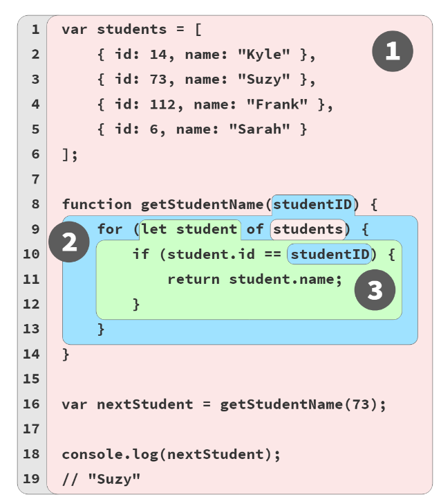
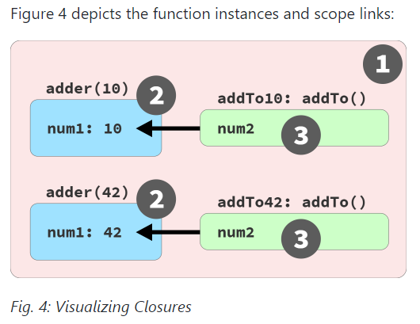

## Chapter 1: What's the Scope?

作用域（lexical scope--编译时确定，运行时创建）是存储和查找变量（reference-- *target* or *source* role，在作用域内查找变量）的规则。在函数里面声明的变量（作用域和函数关联），在块里面声明的`let` / `const`变量（作用域和块关联）。

compilation doesn't actually *do anything* in terms of **reserving memory** for scopes and variables. **None of the program has been executed yet**. Instead, **compilation creates a map of all the lexical scopes** that lays out what the program will need while it executes. You can think of this plan as inserted code for use at runtime, which defines all the scopes (aka, "lexical environments") and registers all the identifiers (variables) for each scope.

### 1.1 compiler theory: Tokenizing/Lexing,Parsing,Code Generation

```js
var a = 2;
```

- 分词/词法分析（**`Tokenizing`/`Lexing`**）：将由字符组成的字符串分解成有意义的代码块（token）

  分解成为下面这些词法单元：`var`、`a`、`=`、`2`、;。分词（`tokenizing`）和词法分析（`Lexing`）之间的区别在于词法单元的识别是通过有状态还是无状态的方式进行的。如果词法单元生成器在判断`a`是一个独立的词法单元还是其他词法单元的一部分时，调用的是有状态的解析规则，那么这个过程就被称为词法分析。

- 解析/语法分析（**Parsing**）：将分词/词法分析得到的tokens（数组）转换成由“抽象语法树”（Abstract Syntax Tree，`AST`）

  抽象语法树中可能会有一个叫作`VariableDeclaration`的顶级节点，接下来是一个叫作`Identifier`（它的值是a）的子节点，以及一个叫作`AssignmentExpression`的子节点。`AssignmentExpression`节点有一个叫作`NumericLiteral`（它的值是2）的子节点。

- 代码生成（**Code Generation**）：将`AST`转换为可执行代码的过程称被称为代码生成

  将`AST`转化为一组机器指令，用来创建一个叫作`a`的变量（包括分配内存等），并将一个值储存在`a`中。

真正`js`编译会比上面更为复杂，`js`引擎会对代码做优化（去除冗余代码），但是不会像`Js`并不会做过多优化，因为编译时间很短。为了确保性能，`js`引擎会使用各种技巧（like `JITs`, which lazy compile and even hot re-compile）。

### 1.2 `LHS` (target) and `RHS` (source)

Check if there is a value that is being assigned to it; if so, it's a *target*. If not, then the variable is a *source*.

target--赋值  source--取值

```js
// id, name, and log are all properties, not variable references.
var students = [
    { id: 14, name: "Kyle" },
    { id: 73, name: "Suzy" },
    { id: 112, name: "Frank" },
    { id: 6, name: "Sarah" }
]; // target--students

function getStudentName(studentID) { // target--getStudentName、studentID
    for (let student of students) { // target--student  ||  source--students
        if (student.id == studentID) { // source--student  ||  source--studentID 
            return student.name;
        }
    }
}

var nextStudent = getStudentName(73); // target--nextStudent  ||  source--getStudentName 

console.log(nextStudent); // source--nextStudent 
// Suzy
```

### 1.3 modifying scopes during runtime: `eval`,`with`

```js
// eval
function foo(str, a) {
	eval(str); // 代码执行到这里时，产生新变量b = 3到函数作用域，覆盖全局作用域的b = 2
	console.log(a, b);
}
var b = 2;
foo("var b = 3;", 1); // 1， 3

// with
function foo(obj) {
	// with创建作用域，作用域内var声明被添加到with所处的函数作用域
    with(obj) {
    	a = 2; 
    }
}
var o1 = {a: 3};
var o2 = {b: 3};
foo(o1);
console.log(o1.a); // 2
foo(o2); // o2没有a属性，a = 2被泄漏到全局作用域上
console.log(o2.a); // undefined
console.log(a); // 2
```

## Chapter 2: Illustrating Lexical Scope

### 2.1 understanding scope

变量都会有一个作用域，作用域的确定在编译时就确定，作用域方便代码执行时查找变量



1. **Bubble 1** (RED) encompasses the global scope, which holds three identifiers/variables: ==students(line 1), getStudentName (line 8), and nextStudent (line 16)==.
2. **Bubble 2** (BLUE) encompasses the scope of the function `getStudentName(..)` (line 8), which holds just one identifier/variable: the parameter ==studentID (line 8)==.
3. **Bubble 3** (GREEN) encompasses the scope of the `for`-loop (line 9), which holds just one identifier/variable: ==student (line 9)==.

PS:`id`, `name`, and `log` are all properties(对象方法), not variables

### 2.2 how JavaScript works

- **Engine**: responsible for start-to-finish **compilation and execution** of our JavaScript program.
- **Compiler**: one of *Engine*'s friends; handles all the dirty work of parsing and code-generation (see previous section).
- **Scope Manager**: another friend of *Engine*; collects and maintains a lookup list of all the declared variables/identifiers, and enforces a set of rules as to how these are accessible to currently executing code.

`var students = [ .. ]`的执行过程

- 经过分词/词法分析和解析/语法分析得到AST；生成代码：处理 `var students`，*Compiler* 将询问Scope Manager，看是否有一个名为students的变量已经存在于Scope中，如果有的话，编译器将忽略这个声明并继续前进。否则，编译器将产生代码，代码（在执行时）要求范围管理器在该scope bucket中创建一个名为 students 的新变量。Compiler生成处理 `students = []` 的代码给Engine使用。
- 执行代码：Engine将询问Scope Manager，在当前的Scope中是否有一个叫做students的变量可以访问，如果没有，Engine就根据**作用域链**查找下一个作用域。一旦Engine找到students，将其**初始化为undefined**，这样它就可以使用了，然后将数组[ .. ]赋值给students。

PS:作用域链与位置有关，就比如for循环嵌套在函数（getStudentName）里面，函数在全局作用域，作用域链就是for--getStudentName--globe

## Chapter 3: The Scope Chain

当一个函数（声明或表达式）被定义时，一个新的作用域被创建。作用域相互嵌套的形成作用域链。当一个变量的名字在作用域链的不同层次上重复出现时，就会出现Shadowing，阻止了对外部变量的访问。

### 3.1 Shadowing

```js
var studentName = "Suzy";  // RED(1) 
function printStudent(studentName) {
    studentName = studentName.toUpperCase(); //  BLUE(2) 
    console.log(studentName);
    // console.log(window.studentName); // Suzy;
}

printStudent("Frank"); // FRANK
printStudent(studentName); // SUZY
console.log(studentName); // Suzy

// var function会被添加到全局变量里
var one = 1;
let notOne = 2;
const notTwo = 3;
class notThree {}
console.log(window.one);       // 1
console.log(window.notOne);    // undefined
console.log(window.notTwo);    // undefined
console.log(window.notThree);  // undefined
// 函数执行时创建two和hello1，函数中执行结束这两个变量随着函数一起销毁
function hello () {
    var two = 1;
    function hello1 () {
    }
}
console.log(window.two); // ƒ hello () {...}
console.log(window.hello); // undefined
console.log(window.hello1); // undefined
// var function不识别块作用域
if (one === 1) {
    function hello3 () {
    }
    var three = 1;
}
console.log(window.hello3); // ƒ hello3 () {}
console.log(window.three);  // 1
```

 `let` (in an inner scope) can always shadow an outer scope's `var`. `var` (in an inner scope) can only shadow an outer scope's `let` if there is a function boundary in between

```js
function something() {
    var special = "JavaScript";
    {
        let special = 42;   // totally fine shadowing
    }
}

function another() {
    {
        let special = "JavaScript";
        {
            var special = "JavaScript"; // ^^^ Syntax Error

        }
    }
}

function another() {
    {
        let special = "JavaScript";
        ajax("https://some.url",function callback(){
            // totally fine shadowing
            var special = "JavaScript";
        });
    }
}
```

### 3.2 Function Name Scope

```js
// 函数整体会被提升
function askQuestion() {
    // ..
}

// 只有askQuestion会被提升
var askQuestion = function(){
    // ..
};

// ofTheTeacher在函数内部而不是外部声明，而且还定义为只读
var askQuestion = function ofTheTeacher() {
    console.log(ofTheTeacher);
    "use strict";
    ofTheTeacher = 42;   // TypeError 在非严格模式下，无声无息地失败
};
askQuestion(); // function ofTheTeacher()...
console.log(ofTheTeacher); // ReferenceError: ofTheTeacher is not defined

// 箭头函数
var askQuestion = () => {
    // ..
};
```

## Chapter 4: Around the Global Scope

With respect to browser-executed applications, there are three main ways.

- First, if you're directly using ES modules

- Second, if you're using a **bundler** in your build process

```js
(function wrappingOuterScope(){
    var moduleOne = (function one(){
        // ..
    })();

    var moduleTwo = (function two(){
        // ..

        function callModuleOne() {
            moduleOne.someMethod();
        }

        // ..
    })();
})();
```

- finally, whether a bundler tool is used for an application, or whether the (non-ES module) files are simply loaded in the browser individually (via `<script>` tags or other dynamic JS resource loading)

```js
//  defining a function expression that's then immediately invoked
var moduleOne = (function one(){
    // ..
})();

var moduleTwo = (function two(){
    // ..

    function callModuleOne() {
        moduleOne.someMethod();
    }

    // ..
})();
```

the global scope is also where:

- JS exposes its built-ins:（JS内置）
  - primitives: `undefined`, `null`, `Infinity`, `NaN`
  - natives: `Date()`, `Object()`, `String()`, etc.
  - global functions: `eval()`, `parseInt()`, etc.
  - namespaces: `Math`, `Atomics`, `JSON`
  - friends of JS: `Intl`, `WebAssembly`
- The environment hosting the JS engine exposes its own built-ins:（浏览器提供）
  - `console` (and its methods)
  - the DOM (`window`, `document`, etc)
  - timers (`setTimeout(..)`, etc)
  - web platform APIs: `navigator`, `history`, geolocation, WebRTC, etc
  -  `require()`, `__dirname`, `module`, `URL`, and so on

获取当前全局对象

```js
const theGlobalScopeObject = (new Function("return this"))();
```

### 4.1 Browser "Window"

```js
window.something = 42;
let something = "Kyle"; // let声明变量不储存在全局变量里面
console.log(something); // Kyle
console.log(window.something); // 42

// the weirdness is because name is actually a pre-defined getter/setter on the window object, which insists on its value being a string value.
window.name = '42';
var name = 42;
console.log(name, typeof name); // "42" string

var name = '42';
var name = 42;
console.log(name, typeof name); // 42 number
```

### 4.2 Web Workers

使JS运行在另一个线程，不能访问DOM

Web Workers are a web platform extension on top of browser-JS behavior, which allows a JS file to run in a completely separate thread (operating system wise) from the thread that's running the main JS program.

```js
// In a Web Worker, the global object reference is typically made using `self`
var studentName = "Kyle";
let studentID = 42;

function hello() {
    console.log(`Hello, ${ self.studentName }!`);
}

self.hello(); // Hello, Kyle!
self.studentID; // undefined
```

### 4.3 Developer Tools Console/REPL

### 4.4 ES Modules (ESM)

```js
//  studentName and hello are not global variables. Instead, they are module-wide, or if you prefer, "module-global."
var studentName = "Kyle";

function hello() {
    console.log(`Hello, ${ studentName }!`);
}

hello();
// Hello, Kyle!

export hello;
```

### 4.5 Node

Node programs **is never actually the global scope**, the way it is when loading a non-module file in the browser.

```js
var studentName = "Kyle";
function hello() {
    console.log(`Hello, ${ studentName }!`);
}
hello();// Hello, Kyle!
module.exports.hello = hello;

// 等同于
function Module(module,require,__dirname,...) {
    var studentName = "Kyle";
    function hello() {
        console.log(`Hello, ${ studentName }!`);
    }
    hello();  // Hello, Kyle!
    module.exports.hello = hello;
}

// global is a reference to the real global scope object
// the identifier global is not defined by JS; it's specifically defined by Node
global.studentName = "Kyle";
```

## Chapter 5: The (Not So) Secret Lifecycle of Variables

### 5.1 Hoisting

var和function声明变量会被提升

```js
studentName = "Suzy";
greeting();// Hello Suzy!
function greeting() {
    console.log(`Hello ${ studentName }!`);
}
var studentName;
// 等同于
function greeting() {
    console.log(`Hello ${ studentName }!`);
}
var studentName;
studentName = "Suzy";
greeting(); // Hello Suzy!
```

### 5.2 Re-declaration

后声明的var会被忽略，赋值会被执行

```js
var greeting;
function greeting() {
    console.log("Hello!");
}
var greeting; // basically, a no-op
typeof greeting; // "function"
var greeting = "Hello!";
typeof greeting; // "string"
```

let const

```js
// let/const不允许被重复声明，以下三种情况都会报错
let studentName = "Frank";
let studentName = "Suzy"; // 报错

var studentName = "Frank";
let studentName = "Suzy"; // 报错

let studentName = "Frank";
var studentName = "Suzy"; // 报错

// const声明必须初始化
const empty;   // SyntaxError
// const的值不能改变
const studentName = "Frank";
studentName = "Suzy";   // TypeError
```

循环

```js
// value没有被重复声明，因为块级作用域，每次进入都会被重置
// each time a scope is entered during execution, everything resets.
// 如果var value = Math.random(); value不会被重新声明
var keepGoing = true;
while (keepGoing) {
    let value = Math.random();
    if (value > 0.5) {
        keepGoing = false;
    }
}

for (let i = 0; i < 3; i++) {
    let value = i * 10; // 
    console.log(`${ i }: ${ value }`);
}
// for循环里面的i可以看作是在更高层次作用域
{
    // a fictional variable for illustration
    let $$i = 0;
    for ( /* nothing */; $$i < 3; $$i++) {
        // here's our actual loop `i`!
        let i = $$i;
        let value = i * 10; // 每次循环i和value都会被重新声明
        console.log(`${ i }: ${ value }`);
    }
} // for..of for..in 也是同理

// 对于const
for (const index in students) {
    // this is fine
}

for (const student of students) {
    // this is also fine
}

for (const i = 0; i < 3; i++) { // i会增加对const声明变量重新赋值
    // oops, this is going to fail with a Type Error after the first iteration
}
var keepGoing = true;
for (const i = 0; keepGoing; /* nothing here */ ) {
    keepGoing = (Math.random() > 0.5);
    // ..
}
```

### 5.3 TDZ

临时性死区：进入作用域但是没有被初始化的这段时间，处于这个阶段的变量没有办法访问；var没有临时性死区。

 this *period of time* from the entering of a scope to where the auto-initialization of the variable occurs is: Temporal Dead Zone (TDZ).

```js
askQuestion(); // ReferenceError
let studentName = "Suzy";
function askQuestion() {
    console.log(`${ studentName }, do you know?`);
}
```

`let` and `const`声明也会被提升，只是不像`var`会被初始化，所以`let` and `const`声明的变量在初始化前还不能访问

There's a common misconception that TDZ means `let` and `const` do not hoist. The actual difference is that `let`/`const` declarations do not automatically initialize at the beginning of the scope, the way `var` does. 

```js
var studentName = "Kyle";
{
    console.log(studentName); // throws a TDZ error
    let studentName = "Suzy";
    console.log(studentName); // Suzy
}
```

## Chapter 6: Limiting Scope Exposure

 "The Principle of Least Privilege" (POLP) 最小权限原则：编程语言中的Scope规则的意义在于，可以适当地组织程序的变量，确保变量没有被过度暴露在不必要的作用域中

### 6.1 Scoping with Function

隐藏var声明的变量

```js
var cache = {};
function factorial(x) {
    if (x < 2) return 1;
    if (!(x in cache)) {
        cache[x] = x * factorial(x - 1);
    }
    return cache[x];
}
factorial(6); // 720

// outer/global scope
function hideTheCache() {
    var cache = {}; // "middle scope", where we hide `cache`
    return factorial;
    function factorial(x) {
        // inner scope
        if (x < 2) return 1;
        if (!(x in cache)) {
            cache[x] = x * factorial(x - 1);
        }
        return cache[x];
    }
}

var factorial = hideTheCache();
factorial(6); // 720
```

### 6.2 Scoping with Blocks

只有在块里面使用`let` or `const`，块才会变成作用域

A block only becomes a scope if necessary, to contain its block-scoped declarations (i.e., `let` or `const`). 

Not all `{ .. }` curly-brace pairs create blocks (and thus are eligible to become scopes): 不是所有{}都是块

- **Object** literals use `{ .. }` curly-brace pairs to delimit their key-value lists, but such object values are **not** scopes.
- **`class`** uses `{ .. }` curly-braces around its body definition, but this is not a block or scope.
- A **`function`** uses `{ .. } `around its body, but this is not technically a block—it's a single statement for the function body. It *is*, however, a (function) scope.
- The `{ .. }` curly-brace pair on a `switch` statement (around the set of `case` clauses) does not define a block/scope.

My advice to reserve `var` for (mostly) only a top-level function scope means that most other declarations should use `let`. 

```JS
// `lastI` is needed across this whole scope, so it's declared with `var`. `i` is only needed in (each) loop iteration, so it's declared with `let`.
var lastI;

for (let i = 0; i < 5; i++) {
    lastI = i;
    if (checkValue(i)) {
        break;
    }
}

if (lastI < 5) {
    console.log("The loop stopped early!");
}
```

Catch

```js
try {
    doesntExist();
}
catch (err) {
    console.log(err);
    // ReferenceError: 'doesntExist' is not defined
    // ^^^^ message printed from the caught exception

    let onlyHere = true;
    var outerVariable = true;
}

console.log(outerVariable);     // true
console.log(onlyHere); // 报错
console.log(err); // 报错
// ReferenceError: 'err' is not defined
// ^^^^ this is another thrown (uncaught) exception
```

### 6.3 Function Declarations in Blocks (FiB)

FiB：函数在块里面声明，应该被避免

```JS
if (false) {
    function ask() {
        console.log("Does this run?");
    }
}
ask();
```

1. The `ask()` call might fail with a `ReferenceError` exception, because the `ask` identifier is block-scoped to the `if` block scope and thus isn't available in the outer/global scope.
2. The `ask()` call might fail with a `TypeError` exception, because the `ask` identifier exists, but it's `undefined` (since the `if` statement doesn't run) and thus not a callable function.
3. The `ask()` call might run correctly, printing out the "Does it run?" message.

规范认为是错误1，浏览器环境报错误2

**The JS specification says that `function` declarations inside of blocks are block-scoped**, so the answer should be (1). However, most browser-based JS engines (including v8, which comes from Chrome but is also used in Node) will behave as (2), meaning the identifier is scoped outside the `if` block but the function value is not automatically initialized, so it remains `undefined`.

避免

```js
if (typeof Array.isArray != "undefined") {
    function isArray(a) {
        return Array.isArray(a);
    }
}
else {
    function isArray(a) {
        return Object.prototype.toString.call(a)
            == "[object Array]";
    }
}
// 替换成--方案1
function isArray(a) {
    if (typeof Array.isArray != "undefined") {
        return Array.isArray(a);
    }
    else {
        return Object.prototype.toString.call(a)
            == "[object Array]";
    }
}
// 方案2
var isArray = function isArray(a) {
    return Array.isArray(a);
};
// override the definition, if you must
if (typeof Array.isArray == "undefined") {
    isArray = function isArray(a) {
        return Object.prototype.toString.call(a)
            == "[object Array]";
    };
}
```

## Chapter 7: Using Closures

Closure is observed when a function uses variable(s) from outer scope(s) even while running in a scope where those variable(s) wouldn't be accessible.

The key parts of this definition are:

- Must be a function involved
- Must reference at least one variable from an outer scope
- Must be invoked in a different branch of the scope chain from the variable(s)

each of those references from the inner function to the variable in an outer scope is called a *closure*.

```js
// outer/global scope: RED(1)
function lookupStudent(studentID) {
    // function scope: BLUE(2)

    var students = [
        { id: 14, name: "Kyle" },
        { id: 73, name: "Suzy" },
        { id: 112, name: "Frank" },
        { id: 6, name: "Sarah" }
    ];

    return function greetStudent(greeting){
        // function scope: GREEN(3)
        // The consequence here is that this arrow function passed as a callback to the array's find(..) method has to hold the closure over studentID, rather than greetStudent(..) holding that closure. 
        var student = students.find(
            // function scope: ORANGE(4)
            student => student.id == studentID
        );

        return `${ greeting }, ${ student.name }!`;
    };
}
// 每次运行lookupStudent都会产生新的函数实例greetStudent，同时产生新的闭包
// closure is associated with an instance of a function, rather than its single lexical definition. Even though closure is based on lexical scope, which is handled at compile time, closure is observed as a runtime characteristic of function instances.
var chosenStudents = [
    lookupStudent(6),
    lookupStudent(112)
];

chosenStudents[0].name; // greetStudent
chosenStudents[0]("Hello"); // Hello, Sarah!
chosenStudents[1]("Howdy"); // Howdy, Frank!
```

**Live Link, Not a Snapshot**

```js
function adder(num1) {
    return function addTo(num2){
        return num1 + num2;
    };
}

var add10To = adder(10);
var add42To = adder(42);

add10To(15);    // 25
add42To(9);     // 51
```



num1作用域是adder，num2作用域是addTo，addTo作用域是全局

each call to `adder(..)` creates a new BLUE(2) scope containing a `num1` variable, as well as a new instance of `addTo(..)` function as a GREEN(3) scope. Notice that the function instances (`addTo10(..)` and `addTo42(..)`) are present in and invoked from the RED(1) scope.

除了函数作用域可以产生闭包，块作用域也可以。count是由let声明，在块级作用域内可以访问，函数和var变量不会被

Though the enclosing scope of a closure is typically from a function, that's not actually required; there only needs to be an inner function present inside an outer scope. I deliberately defined getCurrent() as a **function expression instead of a function declaration**. This isn't about closure, but with the dangerous quirks of FiB (Chapter 6).

```js
var hits;
var hello = '11'
{
    let count = 0;
    let hello = '22
    hits = function getCurrent(){
        console.log(this.hello) // 11 在全局作用域
        count = count + 1;
        return count;
    };
}
hits();     // 1
hits();     // 2
hits();     // 3
```

 **closure as value-oriented rather than variable-oriented**

```javascript
var keeps = [];
// 如果换成let，输出1 2 3，每一次循环会产生基于块作用域的闭包，产生新的实例，并保存i的值
for (var i = 0; i < 3; i++) {
    keeps[i] = function keepI(){
        // closure over `i`
        return i;
    };
}
keeps[0]();   // 3 -- WHY!?
keeps[1]();   // 3
keeps[2]();   // 3

// closure as value-oriented rather than variable-oriented
var keeps = [];
for (var i = 0; i < 3; i++) {
    // new `j` created each iteration, which gets
    // a copy of the value of `i` at this moment
    let j = i;

    // the `i` here isn't being closed over, so
    // it's fine to immediately use its current
    // value in each loop iteration
    keeps[i] = function keepEachJ(){
        // close over `j`, not `i`!
        return j;
    };
}
keeps[0]();   // 0
keeps[1]();   // 1
keeps[2]();   // 2

// a let declaration in a for loop actually creates not just one variable for the loop, but actually creates a new variable for each iteration of the loop. That trick/quirk is exactly what we need for our loop closures:
var keeps = [];

for (let i = 0; i < 3; i++) {
    // the `let i` gives us a new `i` for
    // each iteration, automatically!
    keeps[i] = function keepEachI(){
        return i;
    };
}
keeps[0]();   // 0
keeps[1]();   // 1
keeps[2]();   // 2
```

**closure is per variable rather than *per scope***

```js
// getGrade and studentRecords不一定会被会被清除，主要看浏览器优化
function manageStudentGrades(studentRecords) {
    var grades = studentRecords.map(getGrade);
    
    // 主动清除
	// unset `studentRecords` to prevent unwanted memory retention in the closure
    studentRecords = null;
    
    return addGrade;

    // ************************

    function getGrade(record){
        return record.grade;
    }

    function sortAndTrimGradesList() {
        // sort by grades, descending
        grades.sort(function desc(g1,g2){
            return g2 - g1;
        });

        // only keep the top 10 grades
        grades = grades.slice(0,10);
    }

    function addGrade(newGrade) {
        grades.push(newGrade);
        sortAndTrimGradesList();
        return grades;
    }
}

var addNextGrade = manageStudentGrades([
    { id: 14, name: "Kyle", grade: 86 },
    { id: 73, name: "Suzy", grade: 87 },
    { id: 112, name: "Frank", grade: 75 },
    // ..many more records..
    { id: 6, name: "Sarah", grade: 91 }
]);

// later

addNextGrade(81);
addNextGrade(68);
// [ .., .., ... ]
```

## Chapter 8: The Module Pattern


## Appendix A: Exploring Further

### Implied Scopes

- Parameter scope

  ```js
  // outer/global scope: RED(1)
  
  function getStudentName(/*BLUE(2)*/ studentID = 0) {
      // function scope: GREEN(3)
  
      // ..
  }
  ```

- Function name scope

  ```js
  var askQuestion = function ofTheTeacher(){
      // the two ofTheTeacher identifiers are in separate scopes.
      let ofTheTeacher = "Confused, yet?";
  };
  ```
