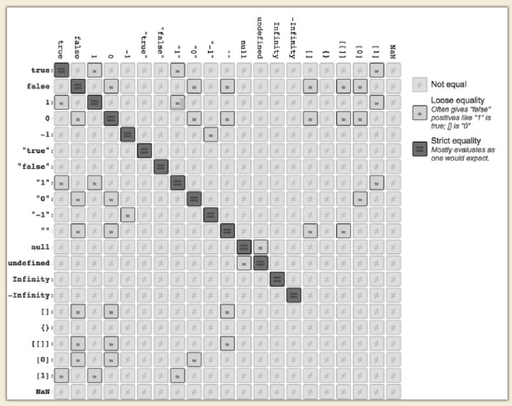

## Chapter 1: Types

JavaScript 有七种内置类型：y


null、undefined、boolean、number、string、object、symbol

```js
// 错误识别null
var a = null;
(!a && typeof a === "object"); // true

// 可以识别函数
typeof function b(){ /* .. */ } === "function"; // true

// 对于重未声明过（undeclared）
typeof c; // "undefined"
```

## Chapter 2: Values

### 2.1 Arrays

```js
var a = [ 1, "2", [3] ];
delete a[2]
a.hello = "hello"
console.log(a) // [ 1, '2', <1 empty item>, hello: 'hello' ]
console.log(a.length) // 3
```

**Array-Likes**

**`Array.from(arrayLike, mapFn, thisArg)`** 方法对一个类似数组或可迭代对象创建一个新的，浅拷贝的数组实例。

- arrayLike：想要转换成数组的伪数组对象或可迭代对象。

- mapFn：如果指定了该参数，新数组中的每个元素会执行该回调函数。

- thisArg ：可选参数，执行回调函数 mapFn 时 this 对象

**`slice(start, end)`** 方法返回一个新的数组对象，这一对象是一个由 `begin` 和 `end` 决定的原数组的**浅拷贝**（包括 `begin`，不包括`end`）。原始数组不会被改变。两个参数都是可选。

- `begin` ：为负数，则表示从原数组中的倒数第几个元素开始提取；如省略则从索引 `0` 开始；如果超出原数组的索引范围，则会返回空数组。

- `end` ：为负数，则表示在原数组中的倒数第几个元素结束抽取；如果省略则 `slice` 会一直提取到原数组末尾；如果 大于数组的长度，`slice` 也会一直提取到原数组末尾。

```js
console.log(Array.from('foo')); // expected output: Array ["f", "o", "o"]
console.log(Array.from([1, 2, 3], x => x + x)); // expected output: Array [2, 4, 6]

// 类数组转为数组
arr = Array.prototype.slice.call( arguments );
arr = Array.prototype.from.call( arguments );
```

### 2.2 Strings

字符串是类数组，和字符数组不一样

**字符串和数组同名的方法**

indexOf

- **`Obj.indexOf(searchElement, fromIndex)`** 方法返回在数组中可以找到给定元素的第一个索引，如果不存在，则返回 -1。fromIndex 可选
  开始查找的位置。
- **`Sting.indexOf(searchString, position)`** 方法，给定一个参数：要搜索的子字符串，搜索整个调用字符串，并返回指定子字符串第一次出现的索引。给定第二个参数：一个数字，该方法将返回指定子字符串在大于或等于指定数字的索引处的第一次出现。

concat

- **`Obj.concat(value0, value1, /* … ,*/ valueN)`** 方法用于合并两个或多个数组。此方法不会更改现有数组，而是返回一个新数组。参数可以是数组/值。
- **`Sting.concat(str2, [, ...strN])`** 方法将一个或多个字符串与原字符串连接合并，形成一个新的字符串并返回。

```js
['ant', 'bison', 'camel', 'duck', 'bison'].indexOf('bison') // 返回  1
'Blue Whale'.indexOf('Blue') // 返回  0

const array = ['a', 'b', 'c'].concat(['d', 'e', 'f']); // ["a", "b", "c", "d", "e", "f"]
const stringNew = "".concat(...['Hello', ' ', 'Venkat', '!'])  // "Hello Venkat!"
```

**sting调用数组方法**

- **`Obj.join(separator)`** 方法将一个数组（或一个[类数组对象](https://developer.mozilla.org/zh-CN/docs/Web/JavaScript/Guide/Indexed_collections#使用类数组对象_array-like_objects)）的所有元素连接成一个字符串并返回这个字符串，用逗号或指定的分隔符字符串分隔。如果数组只有一个元素，那么将返回该元素而不使用分隔符。

  ```js
  function fakeJoin(arr,connector) {
  	var str = "";
  	for (var i = 0; i < arr.length; i++) {
  		if (i > 0) {
  			str += connector;
  		}
  		if (arr[i] !== undefined) {
  			str += arr[i];
  		}
  	}
  	return str;
  }
  
  var a = new Array( 3 );
  fakeJoin( a, "-" ); // "--"
  ```

- **`Sting.split([separator[, limit]])`** 方法使用指定的分隔符字符串将一个[`String`](https://developer.mozilla.org/zh-CN/docs/Web/JavaScript/Reference/Global_Objects/String)对象分割成子字符串数组，以一个指定的分割字串来决定每个拆分的位置。limit返回数量

- **`map((element, index, array) => { /* … */ },thisArg)`** 方法创建一个新数组，这个新数组由原数组中的每个元素都调用一次提供的函数后的返回值组成。`element` 数组中正在处理的当前元素。`index` 数组中正在处理的当前元素的索引。`array` 方法调用的数组。

```js
var splits = "Hello World. How are you doing?".split(" ", 2); // ["Hello", "World."]

var c = Array.prototype.join.call( "foo", "-" ); // "f-o-o"
// The map() method reads the length property of this and then accesses each integer index.
var d = Array.prototype.map.call( "foo", function(v){
	return v.toUpperCase() + ".";
} ).join( "" );// "F.O.O."

var e = "foo"
	// split `a` into an array of characters
	.split( "" )
	// reverse the array of characters
	.reverse()
	// join the array of characters back to a string
	.join( "" ); // "oof"
```

对复杂字符可能不起作用，如果一个字符串经常用到数组方法，一开始就应该创建字符数组

This approach **doesn't work** for `string`s with complex (unicode) characters in them (astral symbols, multibyte characters, etc.)(https://github.com/mathiasbynens/esrever)

**length**

字符串不可变单个字符，长度也不可以改变

```js
str = 'hello'
str.length = 10;
str.length = 4;
console.log(str.length) // 5
console.log(str) // hello
```

### 2.3 Numbers

**Numeric Syntax**

**`NumObj.toFixed(digits)`** 方法使用定点表示法来格式化一个数值。digits介于 0 到 20（包括）之间。

**`numObj.toPrecision(precision)`** 方法以指定的精度返回该数值对象的字符串表示。

```js
var a = 42.59;
a.toFixed( 3 ); // "42.590" 字符串
a.toPrecision( 5 ); // "42.590" 字符串
```

因为`.`是一个有效的数字字符，它将首先被解释为数字的一部分，而不是被解释为一个属性访问器。

```js
// invalid syntax:
42.toFixed( 3 );	// SyntaxError

// these are all valid:
(42).toFixed( 3 );	// "42.000"
0.42.toFixed( 3 );	// "0.420"
42..toFixed( 3 );	// "42.000"
```

指数形式

```js
var onethousand = 1E3; // means 1 * 10^3
var onemilliononehundredthousand = 1.1E6; // means 1.1 * 10^6
```

**Small Decimal Values**

“机器精度”（machine epsilon），对 JavaScript 的数字来说，这个值通常是 2^-52 (2.220446049250313e-16)

```js
if (!Number.EPSILON) {
	Number.EPSILON = Math.pow(2,-52);
}
function numbersCloseEnoughToEqual(n1,n2) {
	return Math.abs( n1 - n2 ) < Number.EPSILON;
}
var a = 0.1 + 0.2;
var b = 0.3;

numbersCloseEnoughToEqual( a, b ); // true
numbersCloseEnoughToEqual( 0.0000001, 0.0000002 ); // false
```

**Safe Integer Ranges**

最大整数是 2^53 - 1，即 9007199254740991，在 ES6 中被定义为 Number.MAX_SAFE_INTEGER。

最小整数是 -9007199254740991，在 ES6 中被定义为 Number.MIN_SAFE_INTEGER

```js
if (!Number.isInteger) {
	Number.isInteger = function(num) {
		return typeof num == "number" && num % 1 == 0;
	};
}
Number.isInteger( 42.000 );	// true
Number.isInteger( 42.3 );	// false

if (!Number.isSafeInteger) {
	Number.isSafeInteger = function(num) {
		return Number.isInteger( num ) &&
			Math.abs( num ) <= Number.MAX_SAFE_INTEGER;
	};
}
Number.isSafeInteger( Number.MAX_SAFE_INTEGER ); // true
Number.isSafeInteger( Math.pow( 2, 53 ) ); // false
Number.isSafeInteger( Math.pow( 2, 53 ) - 1 ); // true
```

**属性**

Number.EPSILON

Number.MAX_SAFE_INTEGER

Number.MAX_VALUE

Number.MIN_SAFE_INTEGER

Number.MIN_VALUE

Number.NaN

Number.NEGATIVE_INFINITY

Number.POSITIVE_INFINITY

**方法**

Number.isFinite()

Number.isInteger()

Number.isNaN()

Number.isSafeInteger()

Number.parseFloat()

Number.parseInt()

Number.prototype.toExponential()

Number.prototype.toFixed()

Number.prototype.toLocaleString()

Number.prototype.toPrecision()

Number.prototype.toString()

Number.prototype.valueOf()

### 2.4 Special Values

**The Non-value Values**

- `null` is an empty value，`null` had a value and doesn't anymore
- `undefined` is a missing value，`undefined` hasn't had a value yet

```js
var a = 42;
console.log( void a, a ); // undefined 42
```

**Special Numbers**

- NaN

  ```JS
  var a = 2 / "foo";		// NaN
  typeof a === "number";	// true 类型是数字
  
  NaN !== NaN // true 自反
  
  if (!Number.isNaN) {
  	Number.isNaN = function(n) {
  		return (
  			typeof n === "number" &&
  			window.isNaN( n )
  		);
  	};
  }
  Number.isNaN( a ); // true
  ```

- Infinities

  ```js
  var a = 1 / 0;	// Infinity
  var b = -1 / 0;	// -Infinity
  ```

- Zeros

  ```js
  // 加法和减法运算不会得到负零（negative zero）
  // 对负零进行字符串化会返回 "0"
  var a = 0 / -3; // -0
  var b = 0 * -3; // -0
  
  a.toString(); // "0" 对负零进行字符串化会返回 "0"
  +"-0"; // -0 将负零从字符串转换为数字是正确的
  
  -0 === 0;	// true
  function isNegZero(n) {
  	n = Number( n );
  	return (n === 0) && (1 / n === -Infinity);
  }
  isNegZero( -0 );		// true
  isNegZero( 0 );			// false
  ```

能使用 `==`和 `===`时就尽量不要使用`Object.is(..)`，前者效率更高、更为通用。后者主要用来处理那些特殊的相等比较。

```js
if (!Object.is) {
	Object.is = function(v1, v2) {
		// test for `-0`
		if (v1 === 0 && v2 === 0) {
			return 1 / v1 === 1 / v2;
		}
		// test for `NaN`
		if (v1 !== v1) {
			return v2 !== v2;
		}
		// everything else
		return v1 === v2;
	};
}

var a = 2 / "foo";
var b = -3 * 0;

Object.is( a, NaN );	// true
Object.is( b, -0 );		// true
Object.is( b, 0 );		// false
```

### 2.5 Value vs. Reference

```js
function foo(x) {
	x.push( 4 );
	x; // [1,2,3,4]
	// later
	x = [4,5,6]; // 更换指向地址
    // x.length = 0; // empty existing array in-place
	// x.push( 4, 5, 6, 7 );
	x.push( 7 );
	x; // [4,5,6,7]
}

var a = [1,2,3];
foo( a );
a; // [1,2,3,4]  not  [4,5,6,7]
// a; // [4,5,6,7]  not  [1,2,3,4]
```

基本类型需要副作用，可以包装成对象

```js
function foo(wrapper) {wrapper.a = 42;}
var obj = {a: 2};
foo( obj );
obj.a; // 42

function foo(x) {
    x = x + 1; // x = 2 把引用b对象变成了数字值2
    x; // 3
}
var a = 2;
var b = new Number( a ); // or equivalently `Object(a)`
foo( b );
console.log( b ); // 2, not 3
```

### 2.6 Boolean & Function & RegExp

```js
// 方法
Boolean.prototype.toString()
Boolean.prototype.valueOf()

Function.prototype.length
Function.prototype.name
Function.prototype.prototype:A Function object's prototype property is used when the function is used as a constructor with the new operator. It will become the new object's prototype
// 方法
Function.prototype.apply()
Function.prototype.bind()
Function.prototype.call()
Function.prototype.toString()

get RegExp[@@species]
RegExp.prototype.dotAll
RegExp.prototype.flags
RegExp.prototype.global
RegExp.prototype.hasIndices
RegExp.prototype.ignoreCase
RegExp: lastIndex
RegExp.prototype.multiline
RegExp.1-9
RegExp.prototype.source
RegExp.prototype.sticky
RegExp.prototype.unicode
// 方法
RegExp.prototype[@@match]()
RegExp.prototype[@@matchAll]()
RegExp.prototype[@@replace]()
RegExp.prototype[@@search]()
RegExp.prototype[@@split]()
RegExp.prototype.exec()
RegExp.prototype.test()
RegExp.prototype.toString()
```

## Chapter 3: Natives

String()、Number()、Boolean()、Array()、Object()、Function()、RegExp()、Date()、Error()、Symbol() 

`new String("abc")` creates a string wrapper object around `"abc"`, not just the primitive `"abc"` value itself

### 3.1 Internal `[[Class]]`

```js
Object.prototype.toString.call( [1,2,3] ); // "[object Array]"
Object.prototype.toString.call( /regex-literal/i );	// "[object RegExp]"

// 虽然 Null()和 Undefined() 这样的原生构造函数并不存在
Object.prototype.toString.call( null ); // "[object Null]"
Object.prototype.toString.call( undefined ); // "[object Undefined]"
```

### 3.2 Boxing Wrappers & Unboxing

```js
var a = "abc";
// 访问属性是Sting对象能力，JS会自动将a包装成Sting对象
a.length; // 3
a.toUpperCase(); // "ABC"

var a = new Boolean( false );
if (!a) { // a是对象，对象返回true
	console.log( "Oops" ); // never runs
}

// 主动封装，使用 Object(..) 函数（不带 new 关键字），不推荐
var a = "abc";
var b = Object(a);
// 等同于
var c = new String(a);
var d = new String("abc");
```

得到封装对象中的基本类型值，可以使用 valueOf() 函数

```js
var a = new String( "abc" );
var b = new Number( 42 );
var c = new Boolean( true );

a.valueOf(); // "abc"
b.valueOf(); // 42
c.valueOf(); // true
```

### 3.3 Natives as Constructors

使用常量和使用构造函数的效果是一样的，应该尽量避免使用构造函数。

Symbol(..)、Date(..)和 Error(..) 的用处要大很多，因为没有对应的常量形式来作为它们的替代。

**Native Prototypes**

原生构造函数有自己的 .prototype 对象，如 Array.prototype、String.prototype 等。这些对象包含其对应子类型所特有的行为特征。

**Prototypes As Defaults**

```js
function isThisCool(vals,fn,rx) {
	vals = vals || Array.prototype;
	fn = fn || Function.prototype;
	rx = rx || RegExp.prototype;
	// 保证后续不会修改原型
	return rx.test(
		vals.map( fn ).join( "" )
	);
}
isThisCool(); // true 不会创建空数组函数正则浪费资源
isThisCool(["a","b","c"],function(v){ return v.toUpperCase(); },/D/); // false
```

```js
Error.prototype.cause
Error.prototype.message
Error.prototype.name
// 方法
Error.prototype.toString()

Symbol.asyncIterator
Symbol.prototype.description
Symbol.hasInstance
Symbol.isConcatSpreadable
Symbol.iterator
Symbol.match
Symbol.matchAll
Symbol.replace
Symbol.search
Symbol.species
Symbol.split
Symbol.toPrimitive
Symbol.toStringTag
Symbol.unscopables
// 方法
Symbol.prototype[@@toPrimitive]
Symbol.for()
Symbol.keyFor()
Symbol.prototype.toString()
Symbol.prototype.valueOf()
```

## Chapter 4: Coercion

显式和隐式强制类型转换结果是一样的，它们之间的差异仅仅体现在代码可读性方面

```js
var a = 42;
// js没有implicit/explicit（相对），如果你知道a + ""对你来说就是explicit
var b = a + "";	 // implicit coercion 隐式强制类型转换
var c = String( a ); // explicit coercion 显式强制类型转换
```

### 4.1 Abstract Value Operations

**ToString**

- null becomes "null"

- undefined becomes "undefined" 

- true/falsebecomes "true"/"false"
- 对象除非自定义否则返回内部属性 [[Class]]

```js
// multiplying `1.07` by `1000`, seven times over
var a = 1.07 * 1000 * 1000 * 1000 * 1000 * 1000 * 1000 * 1000;
// seven times three digits => 21 digits
a.toString(); // "1.07e21"

// 数组的默认 toString() 方法经过了重新定义，将所有单元字符串化以后再用 "," 连接起来
[1,2,3].toString(); // "1,2,3"
```

**ToNumber**

- null becomes 0

- undefined becomes NaN

- true/false becomes 1/0
- 对象（包括数组）会首先被转换为相应的基本类型值，如果返回的是非数字的基本类型值，则再遵循以上规则将其强制转换为数字。如果 valueOf()和 toString() 均不返回基本类型值，会产生 TypeError 错误。

```js
var c = [4,2];
c.toString = function(){
	return this.join( "" );	// "42"
};
Number( c );			// 42
Number( "" );			// 0
Number( [] );			// 0
Number( [ "abc" ] );	// NaN
```

**ToBoolean**

- undefined
- null
- false
- +0、-0和 NaN
- ""

其他都为true

### 4.3 Explicit Coercion

**Strings <--> Numbers**

String(..)和 Number(..) 前面没有 new 关键字，并不创建封装对象

String(..) 遵循前面讲过的 ToString 规则，将值转换为字符串基本类型

Number(..) 遵循前面讲过的 ToNumber 规则，将值转换为数字基本类型

```js
var a = 42;
var a1 = String( a ); // '42'
var a2 = a.toString(); // '42'

var b = "3.14";
var b1 = Number( b ); // 3.14
var b2 = +b; // 3.14
// 传入参数是字符串
var b3 = parseInt( b );　// 3
var b4 = parseInt( b );　// 3.14
```

parseInt(1/0, 19) 实际上是 parseInt("Infinity", 19)。第一个字符是 "I"，以 19 为基数时值为 18。第二个字符 "n" 不是一个有效的数字字符，解析到此为止，和 "42px" 中的 "p" 一样。

```js
parseInt( 0.000008 );		// 0   ("0" from "0.000008")
parseInt( 0.0000008 );		// 8   ("8" from "8e-7")
parseInt( false, 16 );		// 250 ("fa" from "false")
parseInt( parseInt, 16 );	// 15  ("f" from "function..")
parseInt( "0x10" );			// 16
parseInt( "103", 2 );		// 2
```

**Explicitly: * --> Boolean**

```js
var a = "0";
Boolean( a ); // true
!!a;	// true
```

### 4.4 implicit coercion

隐式强制类型转换的作用是减少冗余，让代码更简洁。

**strings <--> Numbers**

如果 + 的其中一个操作数是字符串（可通过valueOf()，没有则调用toString()得到字符串），则执行字符串拼接；否则执行数字加法。

```js
var a = 42;
var b = a + ""; // "42"

// a + "" 会对a调用valueOf()，没有则调用toString()将返回值转换为字符串。而 String(a) 则是直接调用 ToString()
var a = {
	valueOf: function() { return 42; },
	toString: function() { return 4; }
};
a + "";			// "42"
String( a );	// "4"
```

**Booleans --> Numbers**

```js
function onlyOne(a,b,c) {
	return !!((a && !b && !c) ||
		(!a && b && !c) || (!a && !b && c));
}

// 等同于
function onlyOne() {
	var sum = 0;
	for (var i=0; i < arguments.length; i++) {
		// skip falsy values. same as treating them as 0's, but avoids NaN's.
		if (arguments[i]) {
			sum += arguments[i];
		}
	}
	return sum == 1;
}

var a = true;
var b = false;
onlyOne( b, a );		// true
onlyOne( b, a, b, b, b );	// true
onlyOne( b, b );		// false
onlyOne( b, a, b, b, b, a );	// false
```

*** --> Boolean**

1. The test expression in an `if (..)` statement.
2. The test expression (second clause) in a `for ( .. ; .. ; .. )` header.
3. The test expression in `while (..)` and `do..while(..)` loops.
4. The test expression (first clause) in `? :` ternary expressions.
5. The left-hand operand (which serves as a test expression -- see below!) to the `||` ("logical or") and `&&` ("logical and") operators.

```js
// &&和 || 运算符的返回值并不一定是布尔类型，而是两个操作数其中一个的值
var a = 42;
var b = "abc";
var c = null;

a || b;		// 42 a 对了就返回 大致相当a ? a：b;
c || b;		// "abc" b 错了继续

a && b;		// "abc" b 对了继续 大致相当a ? b：a;
c && b;		// null c 错了直接返回

function foo(a,b) {
	a = a || "hello";
	b = b || "world";
	console.log( a + " " + b );
}
foo();					// "hello world"
foo( "yeah", "yeah!" );	// "yeah yeah!"

function foo() {
	console.log( a );
}
var a = 42;
a && foo(); // 42 等价于if (a) { foo(); }
```

**Symbol Coercion**

ES6 允许从符号到字符串的显式强制类型转换，然而隐式强制类型转换会产生错误

不能够被强制类型转换为数字（显式和隐式都会产生错误），但可以被强制类型转换为布尔值（显式和隐式结果都是 true）

```js
var s1 = Symbol( "cool" );
String( s1 );					// "Symbol(cool)"
s1 + "";						// TypeError
```

### 4.5 Loose Equals vs. Strict Equals

== 允许在相等比较中进行强制类型转换，而 === 不允许

**abstract equality**

“抽象相等”（abstract equality）的这些规则正是隐式强制类型转换被诟病的原因

- 如果两个值的类型相同，就仅比较它们的值是否相等。

- 对象（包括函数和数组）的宽松相等 ==。两个对象指向同一个值时即视为相等，不发生强制类型转换。

- == 在比较两个不同类型的值时会发生隐式强制类型转换，会将其中之一或两者都转换为相同的类型后再进行比较。

1．字符串和数字之间的相等比较，字符串转为数字

(1) 如果 Type(x) 是数字，Type(y) 是字符串，则返回 x == ToNumber(y) 的结果。

(2) 如果 Type(x) 是字符串，Type(y) 是数字，则返回 ToNumber(x) == y 的结果。

2．其他类型和布尔类型之间的相等比较，其他类型转为布尔类型

(1) 如果 Type(x) 是布尔类型，则返回 ToNumber(x) == y 的结果；

(2) 如果 Type(y) 是布尔类型，则返回 x == ToNumber(y) 的结果。

3．null和 undefined 之间的相等比较，null和undefined相等

(1) 如果 x 为 null，y 为 undefined，则结果为 true。

(2) 如果 x 为 undefined，y 为 null，则结果为 true。

4．对象和非对象（字符串或数字）之间的相等比较，对象转为基本类型

(1) 如果 Type(x) 是字符串或数字，Type(y) 是对象，则返回 x == ToPrimitive(y) 的结果；

(2) 如果 Type(x) 是对象，Type(y) 是字符串或数字，则返回 ToPromitive(x) == y 的结果。

如果两边的值中有 true 或者 false，千万不要使用 ==。

如果两边的值中有 []、"" 或者 0，尽量不要使用 ==。



### 4.6 抽象关系比较

比较双方都是字符串：按字母顺序来进行比较

其他情况：比较双方首先调用 ToPrimitive，如果结果出现非字符串，就根据 ToNumber 规则将双方强制类型转换为数字来进行比较。

```js
[ 42 ] < [ "43" ];	// true 42<43
[ 42 ] < [ "043" ];	// false 42<043
{b: 42} < {b: 42};	// false [object Object]<[object Object]
```

## Chapter 5: Grammar

**语句和表达式**

```js
// 表达式和语句都会返回结果值
var a = 3 * 6; // 语句  a = 3 * 6表达式
var b = a; // 语句，结果值是 undefined，在控制台输入会得到结果值
// 表达式b = a，其结果值是赋给 b 的值（18）
b; // 是表达式也是语句

// 代码块 { .．} 的结果值是其最后一个语句 / 表达式的结果
// 正常在代码中无法获取语句的值
var a, b;
a = do {
	if (true) {
		b = 4 + 38;
	}
};
a;	// 42
```

**表达式的副作用**

```js
a = 42;
b = a++;
//b = ++a;
console.log(a); // 42
//console.log(a); // 43
console.log(b); // 43

var a = 42, b;
b = ( a++, a ); // 先执行a++，然后把a副本赋值给b
b = a++, a; // 42, 运算符的优先级比 = 低，可以理解为(b = a++),a
a;　// 43
b;　// 43
```

**Blocks**

[] 会被强制类型转换为 ""，而 {} 会被强制类型转换为 "[object Object]"

```js
[] + {}; // "[object Object]"
{} + []; // 0 {}会被当成代码块，+[]将[]显式强制类型转换为0
```

**switch**

```js
var a = "hello world";
var b = 10;

switch (true) {
	case (a || b == 10): // 表达式返回"hello world"
		// never gets here
		break;
	default:
		console.log( "Oops" );
}
// Oops
```
