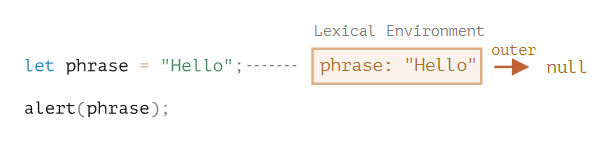
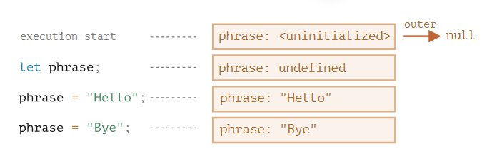
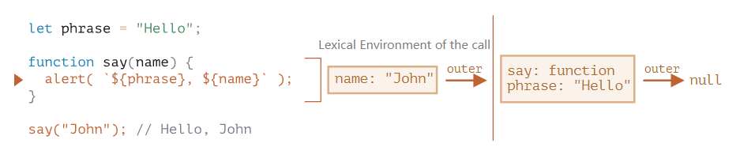
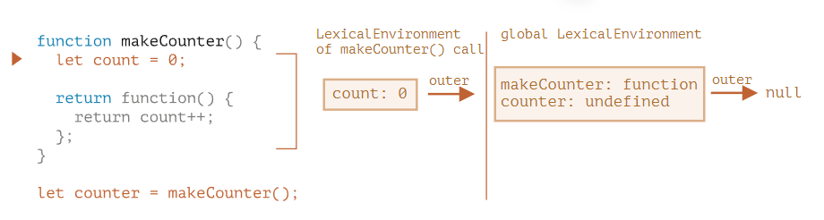
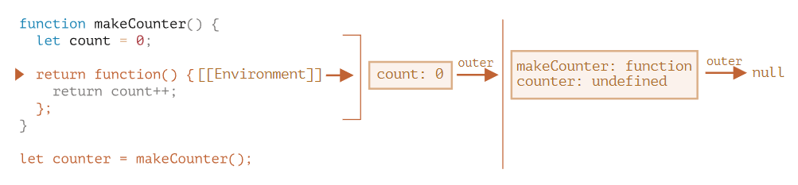
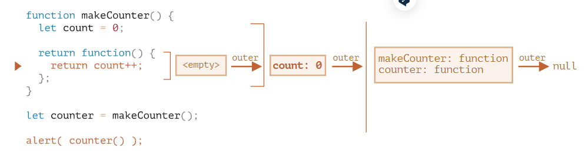
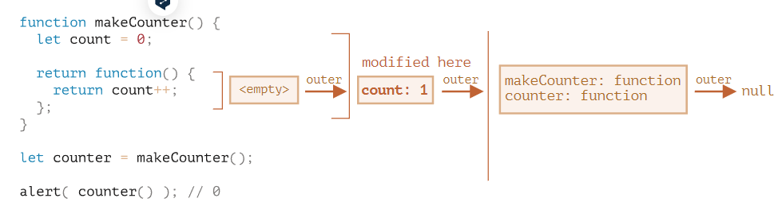

## 1、变量的解构赋值

`ES6` 允许按照一定模式，从数组和对象中提取值，对变量进行赋值

### 1.1 数组的解构赋值

```js
let [foo, [[bar], baz]] = [1, [[2], 3]];
// foo = 1 bar = 2 baz = 3

let [ , , third] = ["foo", "bar", "baz"];
// third = "baz"

let [x, , y] = [1, 2, 3];
// x = 1 y = 3

let [head, ...tail] = [1, 2, 3, 4];
// head = 1 tail = [2, 3, 4]

// 如果解构不成功，变量的值就等于undefined
let [x, y, ...z] = ['a'];
// x = "a" y = undefined z = []
```

事实上，只要某种数据结构具有 Iterator 接口，都可以采用数组形式的解构赋值。如果等号的右边不是数组（或者严格地说，不是可遍历的结构，参见《Iterator》一章），那么将会报错。

```js
let [foo] = 1; // 报错

function* fibs() {
  let a = 0;
  let b = 1;
  while (true) {
    yield a;
    [a, b] = [b, a + b];
  }
}
let [first, second, third, fourth, fifth, sixth] = fibs();
sixth // 5
```

**默认值** 

`ES6` 内部使用严格相等运算符（`===`），判断一个位置是否有值。所以，只有当一个数组成员严格等于`undefined`，默认值才会生效。

```js
let [x = 1] = [undefined]; // x = 1
let [x = 1] = [null]; // x = null null不严格等于undefined

// 表达式是惰性求值，x能取到值，所以函数f根本不会执行
function f() {
  console.log('aaa');
}
let [x = f()] = [1];
```

**`Array.from`**

`Array.from(obj)` 和 `[...obj]` 存在一个细微的差别：

- `Array.from` 适用于类数组对象也适用于可迭代对象。
- Spread 语法只适用于可迭代对象。

### 1.2 对象的解构赋值

数组的元素是按次序排列的，变量的取值由它的位置决定；而对象的属性没有次序，变量必须与属性同名，才能取到正确的值。

```js
let { foo, bar, baz } = { foo: 'aaa', bar: 'bbb' }; // foo = "aaa"  bar = "bbb"  baz = undefined

// 方便地将现有对象的方法，赋值到某个变量
const { log } = console;
log('hello') // hello

// 变量名与属性名，真正被赋值的是后者，而不是前者
let { foo: baz } = { foo: 'aaa', bar: 'bbb' }; // baz = "aaa"
// 对象的解构赋值是下面形式的简写
let { foo: foo, bar: bar } = { foo: 'aaa', bar: 'bbb' };

// 用于嵌套结构的对象
let obj = {
  p: [
    'Hello',
    { y: 'World' }
  ]
};
let { p, p: [x, { y }] } = obj;
// x = "Hello" y = "World" p = ["Hello", {y: "World"}]

// 对象的解构赋值可以取到继承的属性
const obj1 = {};
const obj2 = { foo: 'bar' };
Object.setPrototypeOf(obj1, obj2);
const { foo } = obj1;
foo // "bar"
```

注意点
（1）如果要将一个已经声明的变量用于解构赋值，必须非常小心。

（2）由于数组本质是特殊的对象，因此可以对数组进行对象属性的解构。

```js
// 错误的写法
let x;
{x} = {x: 1}; // SyntaxError: syntax error JavaScript引擎将{x}理解成一个代码块
// 正确的写法
let x;
({x} = {x: 1});

let arr = [1, 2, 3];
let {0 : first, [arr.length - 1] : last} = arr; // first = 1 last = 3
```

### 1.3 基本类型的解构赋值

**字符串的解构赋值**

字符串也可以解构赋值。这是因为此时，字符串被转换成了一个类似数组的对象。

```js
const [a, b, c, d, e] = 'hello';
// a = "h" b = "e" c = "l" d = "l" e = "o"

let {length : len} = 'hello'; // len = 5 类似数组的对象都有一个length属性
```

**数值和布尔值的解构赋值**

等号右边是数值和布尔值，则会先转为对象。

```js
let {toString: s} = 123;
s === Number.prototype.toString // true

let {toString: s} = true;
s === Boolean.prototype.toString // true
```

**undefined和null**

只要等号右边的值不是对象或数组，就先将其转为对象。由于`undefined`和`null`无法转为对象，所以对它们进行解构赋值，都会报错。

```js
let { prop: x } = undefined; // TypeError
let { prop: y } = null; // TypeError
```

### 1.4 函数参数的解构赋值

```js
function move({x = 0, y = 0} = {}) {
  return [x, y];
}

move({x: 3, y: 8}); // [3, 8]
move({x: 3}); // [3, 0]
move({}); // [0, 0]
move(); // [0, 0]
```

**圆括号问题**

以下三种解构赋值不得使用圆括号

（1）变量声明语句

（2）函数参数

（3）赋值语句的模式

```js
let [(a)] = [1];

function f([(z)]) { return z; }

({ p: a }) = { p: 42 };
```

可以使用圆括号的情况只有一种：赋值语句的圆括号都不属于模式的一部分

```js
[(b)] = [3]; // 正确
({ p: (d) } = {}); // 正确
[(parseInt.prop)] = [3]; // 正确
```

**用途**

（1）交换变量的值

```js
let x = 1;
let y = 2;
[x, y] = [y, x];
```

（2）从函数返回多个值

```js
function example() {
  return [1, 2, 3];
}
let [a, b, c] = example();
```

（3）函数参数的定义

```js
function f([x, y, z]) { ... }
f([1, 2, 3]);
```

（4）提取 `JSON` 数据

```js
let jsonData = {
  id: 42,
  status: "OK",
  data: [867, 5309]
};
let { id, status, data: number } = jsonData;
```

（5）函数参数的默认值

```js
jQuery.ajax = function (url, {
  async = true,
  beforeSend = function () {},
  cache = true,
  // ... more config
} = {}) {
  // ... do stuff
};
```

（6）遍历 Map 结构

```js
const map = new Map();
map.set('first', 'hello');
map.set('second', 'world');
for (let [key, value] of map) {
  console.log(key + " is " + value);
}
for (let [key] of map) {} // 获取键名
for (let [,value] of map) {} // 获取键值
```

（7）输入模块的指定方法

```js
const { SourceMapConsumer, SourceNode } = require("source-map");
```

## 2、函数的扩展

### 2.1 函数参数的默认值

```js
function Point(x = 0, y = 0) {
  this.x = x;
  this.y = y;
}
const p = new Point();
p // { x: 0, y: 0 }

// 参数变量是默认声明的，所以不能用let或const再次声明
function foo(x = 5) {
  let x = 1; // error
  const x = 2; // error
}

// 每次调用函数foo()，都会重新计算x + 1
let x = 99;
function foo(p = x + 1) {
  console.log(p);
}
foo() // 100
x = 100;
foo() // 101
```

**与解构赋值默认值结合使用**

```js
function foo({x, y = 5}) {
  console.log(x, y);
}
foo() // TypeError: Cannot read property 'x' of undefined

function foo({x, y = 5} = {}) {
  console.log(x, y);
}
foo() // undefined 5

// 写法一
function m1({x = 0, y = 0} = {}) {
  return [x, y];
}
// 写法二
function m2({x, y} = { x: 0, y: 0 }) {
  return [x, y];
}
// x 有值，y 无值的情况
m1({x: 3}) // [3, 0]
m2({x: 3}) // [3, undefined]
// x 和 y 都无值的情况
m1({}) // [0, 0];
m2({}) // [undefined, undefined]
```

**参数默认值的位置**

有默认值的参数都不是尾参数。这时，无法只省略该参数，而不省略它后面的参数，除非显式输入undefined。

```js
function f(x = 1, y) {
  return [x, y];
}
f(, 1) // 报错
f(undefined, 1) // [1, 1]

// x参数对应undefined，触发了默认值，y参数等于null，没有触发默认值
function foo(x = 5, y = 6) {
  console.log(x, y);
}
foo(undefined, null)// 5 null
```

**作用域**

查找路径：函数作用域-->参数作用域-->全局作用域

```js
/*全局作用域*/
function f(/*参数作用域*/) {
  /*函数作用域*/
}
```

实例

```js
// y = x，x指向参数作用域中的x，调用函数时给参数作用域中的x赋值为2
var x = 1;
function f(x, y = x) {
  console.log(y);
}
f(2) // 2

// y = x，参数作用域中没有定义x，查找作用域链指向全局作用域的x，如果全局变量x不存在，就会报错
let x = 1;
function f(y = x) {
  let x = 2;
  console.log(y);
}
f() // 1

// 参数x = x形成一个单独作用域。实际执行的是let x = x，暂时性死区
var x = 1;
function foo(x = x) { 
  // ...
}
foo() // ReferenceError: Cannot access 'x' before initialization

// 参数作用域定义func
let foo = 'outer';
function bar(func = () => foo) {
  let foo = 'inner';
  // 函数作用域没有func，查找作用域链，在参数作用域找到func
  // 执行func，没有定义foo，查找全局作用域
  console.log(func()); 
}
bar(); // outer

// 三个作用域都有各自的x，所以在自己作用域内修改x，不会影响其他作用域
var x = 1;
function foo(x, y = function() { x = 2; }) {
  var x = 3;
  y();
  console.log(x);
}
foo() // 3
x // 1

// 函数作用域没有指定x，指向参数作用域中的x
var x = 1;
function foo(x, y = function() { x = 2; }) {
  x = 3;
  y();
  console.log(x);
}
foo() // 2
x // 1
```

**应用**

指定某一个参数不得省略，如果省略就抛出一个错误

````js
function throwIfMissing() {
  throw new Error('Missing parameter');
}
// 参数的默认值不是在定义时执行，而是在运行时执行。如果参数已经赋值，默认值中的函数就不会运行
// optional可以省略
function foo(mustBeProvided = throwIfMissing(), optional = undefined) {
  return mustBeProvided;
}
foo() // Error: Missing parameter
````

### 2.2 rest 参数

rest 参数（形式为...变量名），用于**获取函数的多余参数**，这样就不需要使用arguments对象了。rest 参数搭配的变量是一个**数组**，该变量将多余的参数放入数组中。

rest 参数之后不能再有其他参数（即只能是最后一个参数），否则会报错。

```js
// arguments变量的写法
function sortNumbers() {
  return Array.from(arguments).sort();
}

// rest参数的写法
const sortNumbers = (...numbers) => numbers.sort();wo
```

当我们在代码中看到 `"..."` 时，它要么是 rest 参数，要么是 spread 语法

- 若 `...` 出现在函数参数列表的最后，那么它就是 rest 参数，它会把参数列表中剩余的参数收集到一个数组中。
- 若 `...` 出现在函数调用或类似的表达式中，那它就是 spread 语法，它会把一个数组展开为列表。

**函数的 length 属性**

函数的length属性，将返回没有指定默认值的参数个数。也就是说，指定了默认值后，length属性将失真。

```js
(function (a) {}).length // 1
(function (a = 5) {}).length // 0

// rest 参数也不会计入length属性
(function(...args) {}).length // 0

// 默认值的参数不是尾参数，length属性不再计入后面的参数
(function (a = 0, b, c) {}).length // 0
(function (a, b = 1, c) {}).length // 1
```

**name 属性**

函数的`name`属性，返回该函数的函数名。

`ES6` 对这个属性的行为做出了一些修改。如果将一个匿名函数赋值给一个变量，`ES5` 的`name`属性，会返回空字符串，而 `ES6` 的`name`属性会返回实际的函数名。

```js
var f = function () {};
// ES5
f.name // ""
// ES6
f.name // "f"

// 回这个具名函数原本的名字 baz命名作用 1. 它允许函数在内部引用自己。 2. 它在函数外是不可见的。
const bar = function baz() {};
// ES5
bar.name // "baz"
// ES6
bar.name // "baz"

// Function构造函数返回的函数实例，name属性的值为anonymous
(new Function).name // "anonymous"

// bind返回的函数，name属性值会加上bound前缀
function foo() {};
foo.bind({}).name // "bound foo"
(function(){}).bind({}).name // "bound "
```

**严格模式**

从 `ES5` 开始，函数内部可以设定为严格模式。

`ES2016` 做了一点修改，规定只要函数参数使用了默认值、解构赋值、或者扩展运算符，那么函数内部就不能显式设定为严格模式，否则会报错。

**函数执行的时候，先执行函数参数，然后再执行函数体。**这样就有一个不合理的地方，只有从函数体之中，才能知道参数是否应该以严格模式执行，但是参数却应该先于函数体执行。

```js
// 第一种是设定全局性的严格模式，这是合法的。
'use strict';
function doSomething(a, b = a) {
  // code
}

// 第二种是把函数包在一个无参数的立即执行函数里面。
const doSomething = (function () {
  'use strict';
  return function(value = 42) {
    return value;
  };
}());
```

### 2.3 箭头函数

```js
// 报错
let getTempItem = id => { id: id, name: "Temp" };
// 不报错
let getTempItem = id => ({ id: id, name: "Temp" });

// 如果箭头函数只有一行语句，且不需要返回值
let fn = () => void doesNotReturn();
```

**注意点**

（1）箭头函数没有自己的`this`对象 shide。

（2）不可以当作构造函数，也就是说，不可以对箭头函数使用`new`命令，否则会抛出一个错误。

（3）不可以使用`arguments`对象，该对象在函数体内不存在。如果要用，可以用 rest 参数代替。

（4）不可以使用`yield`命令，因此箭头函数不能用作 Generator 函数。

**this**

对于普通函数来说，内部的`this`指向函数运行时所在的对象，但是这一点对箭头函数不成立。它没有自己的`this`对象，内部的`this`就是定义时上层作用域中的`this`。也就是说，箭头函数内部的`this`指向是固定的，相比之下，普通函数的`this`指向是可变的。

```js
// ES6
function foo() {
  setTimeout(() => {
    console.log('id:', this.id);
  }, 100);
}
 
// ES5 Babel 转箭头函数
function foo() {
  var _this = this;

  setTimeout(function () {
    console.log('id:', _this.id);
  }, 100);
}
```

`setTimeout()`的参数是一个箭头函数，这个箭头函数的定义生效是在`foo`函数生成时，而它的真正执行要等到 100 毫秒后。如果是普通函数，执行时`this`应该指向全局对象`window`，这时应该输出`21`。但是，箭头函数导致`this`总是指向函数定义生效时所在的对象（本例是`{id: 42}`），所以打印出来的是`42`。

```js
function foo() {
  setTimeout(() => {
    console.log('id:', this.id);
  }, 100);
}
var id = 21;
foo.call({ id: 42 }); // id: 42
```

`this`的指向只有一个，就是函数`foo`的`this`，这是因为所有的内层函数都是箭头函数，都没有自己的`this`，它们的`this`其实都是最外层`foo`函数的`this`。所以不管怎么嵌套，`t1`、`t2`、`t3`都输出同样的结果。

```js
function foo() {
  return () => {
    return () => {
      return () => {
        console.log('id:', this.id);
      };
    };
  };
}

var f = foo.call({id: 1});

var t1 = f.call({id: 2})()(); // id: 1
var t2 = f().call({id: 3})(); // id: 1
var t3 = f()().call({id: 4}); // id: 1
```

除了`this`，以下三个变量在箭头函数之中也是不存在的，指向外层函数的对应变量：`arguments`、`super`、`new.target`。

```js
// 箭头函数内部的变量arguments，其实是函数foo的arguments变量
function foo() {
  setTimeout(() => {
    console.log('args:', arguments);
  }, 100);
}
foo(2, 4, 6, 8) // args: [2, 4, 6, 8]
```

由于箭头函数没有自己的`this`，所以当然也就不能用`call()`、`apply()`、`bind()`这些方法去改变`this`的指向。

```js
(function() {
  return [
    (() => this.x).bind({ x: 'inner' })()
  ];
}).call({ x: 'outer' });
// ['outer']
```

**不适用场合**

第一个场合是定义对象的方法，且该方法内部包括`this`。

```javascript
const cat = {
  lives: 9,
  jumps: () => {
    this.lives--; // this指向全局对象
  }
}
```

第二个场合是需要动态`this`的时候，也不应使用箭头函数。

```javascript
var button = document.getElementById('press');
button.addEventListener('click', () => {
  this.classList.toggle('on');
});
```

### 2.4 尾调用优化

尾调用（Tail Call）是函数式编程的一个重要概念，指某个函数的最后一步是调用另一个函数。

调用`g`之后，函数`f`就结束了，所以执行到最后一步，完全可以删除`f()`的调用帧，只保留`g(x)`的调用帧。

```js
// 尾调用
function f(x){
  return g(x);
}

// 以下三种情况，都不属于尾调用。
// 情况一
function f(x){
  let y = g(x);
  return y;
}
// 情况二
function f(x){
  return g(x) + 1;
}
// 情况三
function f(x){
  g(x);
}
```

**尾递归**

函数调用自身，称为递归。如果尾调用自身，就称为尾递归。

`ES6` 中只要使用尾递归，就不会发生栈溢出。

`ES6` 的尾调用优化只在严格模式下开启，正常模式是无效的。在正常模式下，函数内部有两个变量，可以跟踪函数的调用栈。

- `func.arguments`：返回调用时函数的参数。
- `func.caller`：返回调用当前函数的那个函数。

```js
// 非尾递归的 Fibonacci 数列实现如下。
function Fibonacci (n) {
  if ( n <= 1 ) {return 1};
  return Fibonacci(n - 1) + Fibonacci(n - 2);
}
Fibonacci(10) // 89
Fibonacci(100) // 超时

// 尾递归优化过的 Fibonacci 数列实现如下。
function Fibonacci2 (n , ac1 = 1 , ac2 = 1) {
  if( n <= 1 ) {return ac2};
  return Fibonacci2 (n - 1, ac2, ac1 + ac2);
}
Fibonacci2(100) // 573147844013817200000
Fibonacci2(1000) // 7.0330367711422765e+208
Fibonacci2(10000) // Infinity
```

**尾递归优化的实现**

尾递归之所以需要优化，原因是调用栈太多，造成溢出，那么只要减少调用栈，就不会溢出。采用“循环”换掉“递归”。

蹦床函数（trampoline）可以将递归执行转为循环执行。

```js
function sum(x, y) {
  if (y > 0) {
    return sum(x + 1, y - 1);
  } else {
    return x;
  }
}
sum(1, 100000) // Uncaught RangeError: Maximum call stack size exceeded(…)

function trampoline(f) {
  // 只要f执行后返回一个函数，就继续执行
  while (f && f instanceof Function) {
    f = f();
  }
  return f; // 返回一个函数，然后执行该函数
}
function sum(x, y) {
  if (y > 0) {
    return sum.bind(null, x + 1, y - 1);
  } else {
    return x;
  }
}
trampoline(sum(1, 100000)) // 100001
```

蹦床函数并不是真正的尾递归优化，下面的实现才是。

```javascript
function tco(f) {
    var value;
    var active = false;
    var accumulated = [];

    return function accumulator() {
        accumulated.push(arguments);
        console.log(arguments)
        if (!active) {
            active = true;
            console.log(active)
            while (accumulated.length) {
                value = f.apply(this, accumulated.shift());
            }
            active = false;
            console.log(active)
            return value; // return sum(x + 1, y - 1) --> accumulator(x + 1, y - 1)
        }
    };
}

var sum = tco(function(x, y) {
    if (y > 0) {
        return sum(x + 1, y - 1)
    }
    else {
        return x
    }
});

const hello = sum(1, 3) // 100001
console.log(hello)

/*[Arguments] { '0': 1, '1': 3 }
true                          
[Arguments] { '0': 2, '1': 2 }
[Arguments] { '0': 3, '1': 1 }
[Arguments] { '0': 4, '1': 0 }
false                         
4   */
```

## 3、闭包

在 JavaScript 中，每个运行的函数，代码块 `{...}` 以及整个脚本，都有一个被称为 **词法环境（Lexical Environment）** 的内部（隐藏）的关联对象。词法环境对象由两部分组成：

1. **环境记录（Environment Record）** —— 一个存储所有局部变量作为其属性（包括一些其他信息，例如 `this` 的值）的对象。
2. 对 **外部词法环境** 的引用，与外部代码相关联。

### Step 1. 变量

一个“变量”只是 **环境记录** 这个特殊的内部对象的一个属性。“获取或修改变量”意味着“获取或修改词法环境的一个属性”。

矩形表示环境记录（变量存储），箭头表示外部引用。全局词法环境没有外部引用，所以箭头指向了 `null`。



随着代码开始并继续运行，词法环境发生了变化。



### Step 2. 函数声明

一个函数其实也是一个值，就像变量一样。不同之处在于函数声明的初始化会被立即完成。


### Step 3. 内部和外部的词法环境

在一个函数运行时，**在调用刚开始时**，会自动创建一个新的词法环境以存储这个调用的局部变量和参数。

例如，对于 `say("John")`，它看起来像这样（当前执行位置在箭头标记的那一行上）：




### Step 4. 返回函数

每次 `makeCounter()` 调用的开始，都会创建一个新的词法环境对象，以存储该 `makeCounter` 运行时的变量。



在执行 `makeCounter()` 的过程中创建了一个仅占一行的嵌套函数：`return count++`。我们尚未运行它，仅创建了它。**所有的函数在“诞生”时都会记住创建它们的词法环境。**从技术上讲，所有函数都有名为 **`[[Environment]]`** 的隐藏属性，该属性保存了对创建该函数的词法环境的引用。

因此，`counter.[[Environment]]` 有对 `{count: 0}` 词法环境的引用。这就是函数记住它创建于何处的方式，与函数被在哪儿调用无关。`[[Environment]]` 引用在函数创建时被设置并永久保存。



当调用 `counter()` 时，会为该调用创建一个新的词法环境，并且其外部词法环境引用获取于 `counter.[[Environment]]`



在变量所在的词法环境中更新变量，执行后的状态



### 应用

可以为任何函数调用 `cachingDecorator`，它将返回缓存包装器

```js
let worker = {
  slow(min, max) {
    alert(`Called with ${min},${max}`);
    return min + max;
  }
};

function cachingDecorator(func, hash) {
  let cache = new Map();
  return function() {
    let key = hash(arguments); // (*)
    if (cache.has(key)) {
      return cache.get(key);
    }

    let result = func.call(this, ...arguments); // (**)

    cache.set(key, result);
    return result;
  };
}

function hash() {
  alert( [].join.call(arguments) ); // 1,2  方法借用（method borrowing）
}

worker.slow = cachingDecorator(worker.slow, hash);

alert( worker.slow(3, 5) ); // works
alert( "Again " + worker.slow(3, 5) ); // same (cached)
```

这两个调用几乎是等效的：

```javascript
func.call(context, ...args);
func.apply(context, args);
```

只有一个关于 `args` 的细微的差别：

- Spread 语法 `...` 允许将 **可迭代对象** `args` 作为列表传递给 `call`。
- `apply` 只接受 **类数组** `args`。

## 4、`new Function` 语法

```js
let func = new Function ([arg1, arg2, ...argN], functionBody);

new Function('a', 'b', 'return a + b'); // 基础语法
new Function('a,b', 'return a + b'); // 逗号分隔
new Function('a , b', 'return a + b'); // 逗号和空格分隔
```

允许将任意字符串变为函数

```javascript
let str = ... 动态地接收来自服务器的代码 ...
let func = new Function(str);
func();
```

使用 `new Function` 创建一个函数，函数的 `[[Environment]]` 并不指向当前的词法环境，而是指向全局环境

```javascript
function getFunc() {
  let value = "test";

  let func = new Function('alert(value)');

  return func;
}

getFunc()(); // error: value is not defined
```

### 4.1 函数绑定

**丢失 “this”**

```js
let user = {
  firstName: "John",
  sayHi() {
    alert(`Hello, ${this.firstName}!`);
  }
};

setTimeout(user.sayHi, 1000); // Hello, undefined!
```

解决方案 1：包装器

```js
// 一秒后执行函数a，函数里user.sayHi()，绑定了sayHi的执行环境
setTimeout(function a () {
  user.sayHi(); // Hello, John!
}, 1000);

setTimeout(() => user.sayHi(), 1000); // Hello, John! 
```

解决方案 2：`bind`

```js
let user = {
  firstName: "John",
  sayHi() {
    alert(`Hello, ${this.firstName}!`);
  }
};

setTimeout(() => user.sayHi(), 1000);

// ……user 的值在不到 1 秒的时间内发生了改变
user = {
  sayHi() { alert("Another user in setTimeout!"); }
};

// Another user in setTimeout!
// 1秒后去取user.sayHi

let sayHi = user.sayHi.bind(user); // (*)
setTimeout(sayHi, 1000); // Hello, John!
// sayHi绑定旧user.sayHi地址
```

**部分（应用）函数（Partial functions）**

```js
function mul(a, b) {
  return a * b;
}

let double = mul.bind(null, 2);
alert( double(3) ); // = mul(2, 3) = 6
alert( double(4) ); // = mul(2, 4) = 8

let triple = mul.bind(null, 3);
alert( triple(3) ); // = mul(3, 3) = 9
alert( triple(4) ); // = mul(3, 4) = 12
```

### 4.2 深入理解箭头函数

JavaScript 的精髓在于创建一个函数并将其传递到某个地方。

在这样的函数中，我们通常不想离开当前上下文。这就是箭头函数的主战场啦。

## 5 函数式编程

函数式编程中的**函数**这个术语不是指计算机中的函数（实际上是**Subroutine**），而是指数学中的函数，即自变量的映射。

函数式程序非常简练，描述做什么，而不是怎么做。

函数式编程具有五个鲜明的**特点**：

1. 函数是"第一等公民"

   函数可以作为变量

2. 只用"表达式"，不用"语句"

   "表达式"（expression）是一个单纯的运算过程，总是有返回值；"语句"（statement）是执行某种操作，没有返回值

3. 没有"副作用"

   只是返回新的值，不修改系统变量

4. 不修改状态

   不使用循环，使用递归

5. 引用透明

   只要参数相同，引用函数所得到的返回值总是相同的

**高阶函数**就是参数为函数或返回值为函数的函数。

如果说函数式编程中有两种操作是必不可少的那无疑就是**柯里化（Currying）\**和\**函数组合（Compose）**，柯里化其实就是流水线上的**加工站**，函数组合就是我们的**流水线**，它由多个加工站组成。

**柯里化**强调的是**生成单元函数**，**部分函数应用**的强调的**固定任意元参数**

```js
// 柯里化
f(a,b,c) → f(a)(b)(c)
// 部分函数调用
f(a,b,c) → f(a)(b,c) / f(a,b)(c)

// 假设一个通用的请求 API
const request = (type, url, options) => ...
// GET 请求
request('GET', 'http://....')
// POST 请求
request('POST', 'http://....')

// 但是通过部分调用后，我们可以抽出特定 type 的 request
const get = request('GET');
get('http://', {..})
```

一、JavaScript基础 51 1月

Authentication==编译原理 设计模式

四、运行环境 24 2月

浏览器

Node

二、HTML和`CSS` 21 2月

五、框架和类库 38 3 4 5月

`TypeScript`
React
`Vue`
多端开发
数据流管理
实用库
开发和调试

Web Components

Progressive Web Apps

Server-side rendering

Static Site Generators

Graphql

Mobile applications

Desktop Applications in JavaScript

六、前端工程 20  3 4 5月

项目构建
`nginx`==网络协议
开发提速
版本控制
持续集成

三、计算机基础 18  6月

编译原理
网络协议
设计模式

七、项目和业务 15 6月

后端技能
性能优化
前端安全
业务相关


