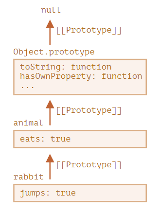
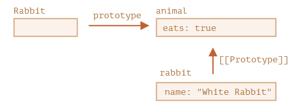
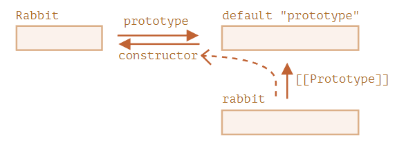

## 1、this 关键字

JavaScript 语言之中，一切皆对象，运行环境也是对象，所以函数都是在某个对象之中运行，**`this`就是函数运行时所在的对象（环境）**

```js
var obj = { foo:  5 }; // obj是一个地址（reference）
// 如果要读取obj.foo，引擎先从obj拿到内存地址，然后再从该地址读出原始的对象，返回它的foo属性
{
  foo: {
    [[value]]: 5
    [[writable]]: true
    [[enumerable]]: true
    [[configurable]]: true
  }
}

// foo属性是函数，将函数的地址赋值给foo属性的value属性
var obj = { foo: function () {} };
{
  foo: {
    [[value]]: 函数的地址
    ...
  }
}
    
// 函数是一个单独的值，所以它可以在不同的环境（上下文）执行
f() // 顶层对象环境中执行
obj.f() // obj 环境执行

// JavaScript 允许在函数体内部，引用当前环境的其他变量，利用 this指向函数运行时所在的对象（环境）
var f = function () {
  console.log(this.x);
}

// 示例
var f = function () {
  console.log(this.x);
}
var x = 1;
var obj = {
  f: f,
  x: 2,
};
f() // 1
obj.f() // 2
```

**使用场合**

（1）全局环境：函数在全局环境下运行

（2）构造函数：指向实例对象

（3）对象的方法

```js
var obj ={
  foo: function () {
    console.log(this);
  }
};

// obj和obj.foo储存在两个内存地址，称为地址一和地址二
// obj.foo()这样调用时，是从地址一调用地址二，因此地址二的运行环境是地址一，this指向obj
obj.foo() // obj
// 直接取出地址二进行调用
(obj.foo = obj.foo)() // window
(false || obj.foo)() // window
(1, obj.foo)() // window
```

如果`this`所在的方法不在对象的第一层，这时`this`只是指向当前一层的对象，而不会继承更上面的层

```js
var a = {
  p: 'Hello',
  b: {
    m: function() {
      console.log(this.p);
    }
  }
};
a.b.m() // undefined   此时m运行的环境是a.b，没有属性p，a才有

// 要达到预期效果
var a = {
  b: {
    m: function() {
      console.log(this.p);
    },
    p: 'Hello' // a.b添加属性p
  }
};
```

**使用注意点**

- 避免**多层 this**

  ```js
  var o = {
    f1: function () {
      console.log(this); // Object
      var f2 = function () {
        console.log(this); // 内层的this不指向外部，而指向顶层对象Window
      }();
      // 使用一个变量固定this的值，然后内层函数调用这个变量
      /*var that = this;
      var f2 = function() {
        console.log(that); // Object
      }();*/
    }
  }
  
  o.f1()
  ```

- 避免**数组处理方法**中的 this

  ```js
  var o = {
    v: 'hello',
    p: [ 'a1', 'a2' ],
    f: function f() {
      this.p.forEach(function (item) {
        console.log(this.v + ' ' + item); // window
      });
      // 可以给方法指定this参数
      /*this.p.forEach(function (item) {
        console.log(this.v + ' ' + item);
      }, this);*/
      /*this.p.forEach(function (item) {
        console.log(this.v + ' ' + item);
      }).bind(this));*/
    }
  }
  
  o.f()
  ```

- 避免**回调函数**中的 this

**绑定 this 的方法**

切换/固定this的指向

`thisArg`是一个对象，如果参数为空、`null`和`undefined`，则默认传入全局对象

`Function.prototype.call(thisArg, arg1, arg2, ...)`

```js
function f(x, y){
  console.log(x + y);
}
f.call(null, 1, 1) // 2
f.apply(null, [1, 1]) // 2

// 保证调用对象的原生方法
var obj = {};
obj.hasOwnProperty('toString') // false
obj.hasOwnProperty = function () { // 覆盖掉继承的 hasOwnProperty 方法
  return true;
};
obj.hasOwnProperty('toString') // true
Object.prototype.hasOwnProperty.call(obj, 'toString') // false
```

`Function.prototype.apply(thisArg, argsArray)`

```js
// 找出数组最大元素
Math.max(1, 3, 2)
var a = [10, 2, 4, 15, 9];
Math.max.apply(null, a) // 15

// 将数组的空元素变为undefinedy
// 空元素与undefined的差别在于，数组的forEach方法会跳过空元素，但是不会跳过undefined
var a = ['a', , 'b'];
function print(i) {
  console.log(i);
}
a.forEach(print) // a b
Array.apply(null, a).forEach(print) // a undefined b

// 转换类似数组的对象  有length属性，以及相对应的数字键属性名
// slice(start, end) start默认为0 end默认末尾
['Banana', 'Orange', 'Lemon', 'Apple'].slice(1, 3); // ['Orange','Lemon']
Array.prototype.slice.apply({0: 1, length: 2}) // [1, undefined]
```

`Function.prototype.bind(thisArg[, arg1[, arg2[, ...]]])`

```js
var d = new Date();
d.getTime() // 1481869925657 getTime()方法内部的this，绑定Date对象的实例
var print = d.getTime;
// var print = d.getTime.bind(d); // 将getTime()方法内部的this绑定到d对象
print() // Uncaught TypeError: this is not a Date object.

// 接受更多的参数
var add = function (x, y) {
  return x * this.m + y * this.n;
}
var obj = {
  m: 2,
  n: 2
};
var newAdd = add.bind(obj, 5);
newAdd(5) // 20

// 每一次返回一个新函数
element.addEventListener('click', o.m.bind(o)); // click事件绑定bind()方法生成的一个匿名函数，导致无法取消绑定
element.removeEventListener('click', o.m.bind(o));

var listener = o.m.bind(o);
element.addEventListener('click', listener);
element.removeEventListener('click', listener);

// 结合回调函数使用
var counter = {
  count: 0,
  inc: function () {
    'use strict';
    this.count++;
  }
};
function callIt(callback) {
  callback();
}
callIt(counter.inc.bind(counter)); // 不指定指向全局对象
counter.count // 1

// 改写一些 JavaScript 原生方法的使用形式
[1, 2, 3].slice(0, 1) // [1]
// 等同于
Array.prototype.slice.call([1, 2, 3], 0, 1) // [1]
// 将Array.prototype.slice变成Function.prototype.call方法所在的对象，调用时就变成了Array.prototype.slice.call
var slice = Function.prototype.call.bind(Array.prototype.slice);
slice([1, 2, 3], 0, 1) // [1]
// 将Function.prototype.bind方法绑定在Function.prototype.call上面，所以bind方法就可以直接使用，不需要在函数实例上使用
function f() {
  console.log(this.v);
}
var o = { v: 123 };
var bind = Function.prototype.call.bind(Function.prototype.bind);
bind(f, o)() // 123
```

## 2、面向对象编程 

### 2.1 实例对象与 new 命令

对象是一个容器，封装了属性（property）和方法（method）

JavaScript 语言的对象体系，不是基于“类”的，而是基于构造函数（constructor）和原型链（prototype）

**构造函数**

JavaScript 语言使用构造函数（constructor）作为对象的模板。一个构造函数，可以生成多个实例对象，这些实例对象都有相同的结构。

特点：

- 函数体内部使用了`this`关键字，代表了所要生成的对象实例
- 生成对象的时候，必须使用`new`命令

**new 命令**

使用`new`命令时，它后面的函数依次执行下面的步骤：

1. 创建一个**空对象**，作为将要返回的对象实例。
2. 将这个空对象的原型，指向构造函数的**`prototype`属性**。（函数都有`prototype`属性）90
3. 将这个空对象赋值给函数内部的**`this`**关键字。
4. 开始执行构造函数内部的代码。如果构造函数内部有`return`语句，而且`return`后面跟着一个对象，`new`命令会返回`return`语句指定的对象；否则，就会不管`return`语句，返回`this`对象。

```js
var Vehicle = function (p) {
  // 没有使用new命令，直接调用Vehicle就会报错，因为严格模式中，函数内部的this不能指向全局对象，默认等于undefined
  'use strict'; 
  // 另一种方式判断构造函数是否使用new
  // if (!(this instanceof Fubar)) { // new.target === Vehicle
    // return new Fubar(foo, bar);
  // }
  this.price = p; // this指向新生成的实例对象，给对象添加price属性
};

var v = new Vehicle(1000); // 通过new命令，让构造函数Vehicle生成一个实例对象，保存在变量v中
v.price // 1000

// 没有使用new命令，构造函数就变成了普通函数
var v = Vehicle();
v // undefined
price // 1000  此时this指向全局对象

// new命令简化的内部流程，可以用下面的代码表示
function _new(/* 构造函数 */ constructor, /* 构造函数参数 */ params) {
  // 将 arguments 对象转为数组
  var args = [].slice.call(arguments);
  // 取出构造函数
  var constructor = args.shift();
  // 创建一个空对象，继承构造函数的 prototype 属性
  var context = Object.create(constructor.prototype);
  // 执行构造函数
  var result = constructor.apply(context, args);
  // 如果返回结果是对象，就直接返回，否则返回 context 对象
  return (typeof result === 'object' && result != null) ? result : context;
}

// 实例
var actor = _new(Person, '张三', 28);
```

**`Object.create()`**

以现有的对象作为模板，生成新的实例对象

```js
var person1 = {
  name: '张三',
  age: 38,
  greeting: function() {
    console.log('Hi! I\'m ' + this.name + '.');
  }
};

var person2 = Object.create(person1);

person2.name // 张三
person2.greeting() // Hi! I'm 张三.
```

### 2.2 原型

#### 2.2.1 构造函数的缺点

多个实例之间，无法共享属性

```js
function Cat(name, color) {
  this.name = name;
  this.color = color;
  this.meow = function () {
    console.log('喵喵');
  };
}

var cat1 = new Cat('大毛', '白色');
var cat2 = new Cat('二毛', '黑色');

cat1.meow === cat2.meow
// false
```

#### 2.2.2 [[Prototype]]

- 在 JavaScript 中，所有的对象都有一个隐藏的 `[[Prototype]]` 属性，它要么是另一个对象，要么就是 `null`。
- 可以使用 `obj.__proto__` 访问它。`__proto__` 与内部的 `[[Prototype]]` **不一样**。`__proto__` 是 `[[Prototype]]` 的 getter/setter。
- 通过 `[[Prototype]]` 引用的对象被称为“原型”。

```js
let animal = {
  eats: true
};

let rabbit = {
  jumps: true,
  __proto__: animal // 设置rabbit原型为animal
};
```



**写入不使用原型**

- 如果我们想要读取 `obj` 的一个属性或者调用一个方法，并且它不存在，那么 JavaScript 就会尝试在原型中查找它。
- 写/删除操作直接在对象上进行，它们不使用原型（假设它是数据属性，不是 setter）。
- 如果我们调用 `obj.method()`，而且 `method` 是从原型中获取的，`this` 仍然会引用 `obj`。因此，方法始终与当前对象一起使用，即使方法是继承的。

```js
let user = {
  name: "John",
  surname: "Smith",
  set fullName(value) {
    [this.name, this.surname] = value.split(" ");
  },
  get fullName() {
    return `${this.name} ${this.surname}`;
  }
};

let admin = {
  __proto__: user,
  isAdmin: true
};

// admin调用set/get fullName内部this指向admin
alert(admin.fullName); // John Smith 
admin.fullName = "Alice Cooper"; // 在admin创建name和surname属性
alert(admin.fullName); // Alice Cooper，admin 的内容被修改了

// user调用set/get fullName内部this指向user
alert(user.fullName);  // John Smith，user 的内容被保护了
```

#### 2.2.3 `F.prototype`

- 函数都有`prototype` 属性（不要把它与 `[[Prototype]]` 弄混了，`F.prototype` 的值要么是一个对象，要么就是 `null`：其他值都不起作用。
- `F.prototype` 属性仅在 `new F` 被调用时使用，它为新对象的 `[[Prototype]]` 赋值。

```js
let animal = {
  eats: true
};

function Rabbit(name) {
  this.name = name;
}

Rabbit.prototype = animal;

let rabbit = new Rabbit("White Rabbit"); //  rabbit.__proto__ == animal

alert( rabbit.eats ); // true
```



`"prototype"` 是一个水平箭头，表示一个常规属性，`[[Prototype]]` 是垂直的，表示 `rabbit` 继承自 `animal`。

- 在常规对象上，`prototype` 没什么特别的：

```javascript
let user = {
  name: "John",
  prototype: "Bla-bla" // 这里只是普通的属性
};
```

**constructor** 

默认情况下，所有函数都有 `F.prototype = {constructor：F}`，所以我们可以通过访问它的 `"constructor"` 属性来获取一个对象的构造器。

```js
function Rabbit() {}
// 默认：
// Rabbit.prototype = { constructor: Rabbit }

let rabbit = new Rabbit(); // 继承自 {constructor: Rabbit}
alert(rabbit.constructor == Rabbit); // true (from prototype)

// 使用 constructor 属性来创建一个新对象
let rabbit2 = new rabbit.constructor("Black Rabbit");
```



JavaScript 自身并不能确保正确的 "constructor" 函数值。

```js
function Rabbit() {}
Rabbit.prototype = {
  jumps: true
};

let rabbit = new Rabbit();
alert(rabbit.constructor === Rabbit); // false

// 不要将 Rabbit.prototype 整个覆盖，可以向其中添加内容
Rabbit.prototype.jumps = true
// 也可以手动重新创建 constructor 属性
Rabbit.prototype = {
  jumps: true,
  constructor: Rabbit
}
```

#### 2.2.4 原生的原型

`"prototype"` 属性在 JavaScript 自身的核心部分中被广泛地应用。所有的内建构造函数都用到了它。

- 所有的内建对象都遵循相同的模式（pattern）：
  - 方法都存储在 prototype 中（`Array.prototype`、`Object.prototype`、`Date.prototype` 等）。
  - 对象本身只存储数据（数组元素、对象属性、日期）。
- 原始数据类型也将方法存储在包装器对象的 prototype 中：`Number.prototype`、`String.prototype` 和 `Boolean.prototype`。只有 `undefined` 和 `null` 没有包装器对象。
- 内建原型可以被修改或被用新的方法填充。但是不建议更改它们。唯一允许的情况可能是，当我们添加一个还没有被 JavaScript 引擎支持，但已经被加入 JavaScript 规范的新标准时，才可能允许这样做。

#### 2.2.5 原型方法，没有`_proto_`的对象

- 要使用给定的原型创建对象，使用：

  - 字面量语法：`{ __proto__: ... }`，允许指定多个属性
  - 或 [Object.create(proto, [descriptors\])](https://developer.mozilla.org/zh/docs/Web/JavaScript/Reference/Global_Objects/Object/create)，允许指定属性描述符。

  `Object.create` 提供了一种简单的方式来浅拷贝对象及其所有属性描述符（descriptors）。

  ```javascript
  let clone = Object.create(Object.getPrototypeOf(obj), Object.getOwnPropertyDescriptors(obj));
  ```

- 设置和访问原型的现代方法有：

  - [Object.getPrototypeOf(obj)](https://developer.mozilla.org/zh/docs/Web/JavaScript/Reference/Global_Objects/Object/getPrototypeOf) —— 返回对象 `obj` 的 `[[Prototype]]`（与 `__proto__` 的 getter 相同）。
  - [Object.setPrototypeOf(obj, proto)](https://developer.mozilla.org/zh/docs/Web/JavaScript/Reference/Global_Objects/Object/setPrototypeOf) —— 将对象 `obj` 的 `[[Prototype]]` 设置为 `proto`（与 `__proto__` 的 setter 相同）。

- 不推荐使用内建的的 `__proto__` getter/setter 获取/设置原型，它现在在 ECMA 规范的附录 B 中。

- 我们还介绍了使用 `Object.create(null)` 或 `{__proto__: null}` 创建的无原型的对象。

  这些对象被用作字典，以存储任意（可能是用户生成的）键。

  通常，对象会从 `Object.prototype` 继承内建的方法和 `__proto__` getter/setter，会占用相应的键，且可能会导致副作用。原型为 `null` 时，对象才真正是空的。

### 2.3 对象的继承

**通过“原型对象”（prototype）实现继承**

#### 2.3.1 `instanceof` 运算符

返回一个布尔值，表示对象是否为某个构造函数的实例

`instanceof`的原理是检查右边构造函数的`prototype`属性，是否在左边对象的原型链上

```js
var v = new Vehicle();
v instanceof Vehicle
// 等同于
Vehicle.prototype.isPrototypeOf(v) // isPrototypeOf是Object.prototype的方法

// instanceof检查整个原型链
v instanceof Object // true

// 失真
null instanceof Object // false
var obj = Object.create(null);
typeof obj // "object"
obj instanceof Object // false
```

#### 2.3.2 构造函数的继承

让一个构造函数继承另一个构造函数

- 在子类的构造函数中，调用父类的构造函数
- 让子类的原型指向父类的原型，这样子类就可以继承父类原型

```js
function Sub(value) {
  Super.call(this);
  this.prop = value;
}

Sub.prototype = Object.create(Super.prototype); // Sub.prototype = Super.prototype 后面两行对Sub.prototype的操作，会连父类的原型Super.prototype一起修改掉
Sub.prototype.constructor = Sub;
Sub.prototype.method = '...';
```

**实例**

```js
function Shape() {
  this.x = 0;
  this.y = 0;
}

Shape.prototype.move = function (x, y) {
  this.x += x;
  this.y += y;
  console.info('Shape moved.');
};

// 第一步，子类继承父类的实例
function Rectangle() {
  Shape.call(this); // 调用父类构造函数
}
// 另一种写法
function Rectangle() {
  this.base = Shape;
  this.base();
}

// 第二步，子类继承父类的原型
Rectangle.prototype = Object.create(Shape.prototype);
Rectangle.prototype.constructor = Rectangle;

var rect = new Rectangle();
rect instanceof Rectangle  // true
rect instanceof Shape  // true
```

**只需要单个方法的继承**

```js
ClassB.prototype.print = function() {
  ClassA.prototype.print.call(this);
  // some code
}
```

**多重继承**

JavaScript 不提供多重继承功能，即不允许一个对象同时继承多个对象。但是，可以通过变通方法，实现这个功能。

```js
// 子类S同时继承了父类M1和M2。这种模式又称为 Mixin（混入）
function M1() {
  this.hello = 'hello';
}

function M2() {
  this.world = 'world';
}

function S() {
  M1.call(this);
  M2.call(this);
}

// 继承 M1
S.prototype = Object.create(M1.prototype);
// 继承链上加入 M2
Object.assign(S.prototype, M2.prototype);
/* const target = { a: 1, b: 2 };
const source = { b: 4, c: 5 };
Object.assign(target, source); // { a: 1, b: 4, c: 5 }*/

// 指定构造函数
S.prototype.constructor = S;

var s = new S();
s.hello // 'hello'
s.world // 'world'
```

#### 2.3.3 模块

**基本的实现方法**

所有的模块成员都放到这个对象里面

缺点：会暴露所有模块成员，内部状态可以被外部改写

```js
var module1 = new Object({
　_count : 0,
　m1 : function (){
　　//...
　},
　m2 : function (){
  　//...
　}
});
```

**封装私有变量：构造函数的写法**

利用构造函数，封装私有变量

缺点：构造函数有双重作用，既用来塑造实例对象，又用来保存实例对象的数据，违背了构造函数与实例对象在数据上相分离的原则（即实例对象的数据，不应该保存在实例对象以外）

```js
function StringBuilder() {
  var buffer = []; // 私有变量，实例对象无法直接访问

  this.add = function (str) {
     buffer.push(str);
  };

  this.toString = function () {
    return buffer.join('');
  };

}
```

**封装私有变量：立即执行函数的写法**

```js
var module1 = (function () {
　var _count = 0; // 外部代码无法读取内部的_count变量
　var m1 = function () {
　  //...
　};
　var m2 = function () {
　　//...
　};
　return {
　　m1 : m1,
　　m2 : m2
　};
})();

// 如果一个模块很大，必须分成几个部分，或者一个模块需要继承另一个模块，这时就有必要采用“放大模式”（augmentation）
var module1 = (function (mod){
　mod.m3 = function () {
　　//...
　};
　return mod;
})(module1);
```

### 2.4 Object 对象的相关方法

`Object.getPrototypeOf()`

返回参数对象的原型

```js
var F = function () {};
var f = new F();
Object.getPrototypeOf(f) === F.prototype // true

// 函数的原型是 Function.prototype
function f() {}
Object.getPrototypeOf(f) === Function.prototype // true
```


`Object.setPrototypeOf()`

`Object.create()`

`Object.prototype.isPrototypeOf()`

`Object.prototype.__proto__`

获取原型对象方法的比较

`Object.getOwnPropertyNames()`

`Object.prototype.hasOwnProperty()`

in 运算符和 `for...in` 循环


对象的拷贝

2.4 严格模式


Class 的基本语法

类的由来

constructor() 方法

类的实例

实例属性的新写法

取值函数（getter）和存值函数（setter）

属性表达式

Class 表达式

静态方法

静态属性

私有方法和私有属性

静态块

类的注意点

new.target 属性


Class 的继承

简介

私有属性和私有方法的继承

静态属性和静态方法的继承

Object.getPrototypeOf()

super 关键字

类的 prototype 属性和__proto__属性

原生构造函数的继承

Mixin 模式的实现

