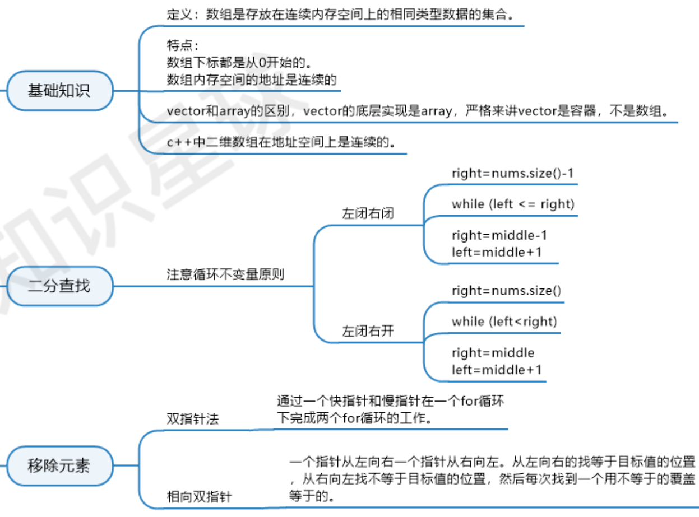
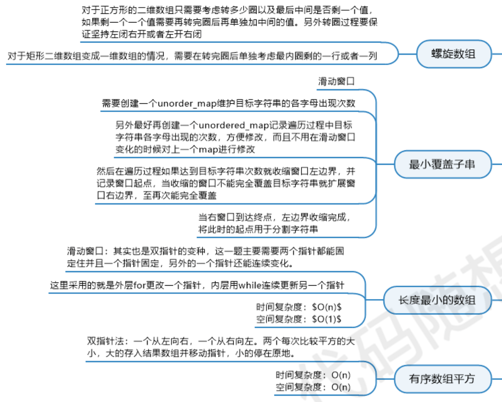

1、Array

- `LeetCode` 26、删除有序数组中的重复项  

- `LeetCode` 283、移动零 

- `LeetCode` 485、最大连续 1 的个数   

  

- 27. 移除元素

- 977.有序数组的平方

- 209.长度最小的子数组

- 59.螺旋矩阵II

1.1 二分法

- 有序数组
- 数组中无重复元素
- **循环不变量原则**，只有在循环中坚持对**区间的定义**，才能清楚的把握循环中的各种细节

**相关题目推荐**

- 704.二分查找
- [35.搜索插入位置(opens new window)](https://programmercarl.com/0035.搜索插入位置.html)
- [34.在排序数组中查找元素的第一个和最后一个位置(opens new window)](https://programmercarl.com/0034.在排序数组中查找元素的第一个和最后一个位置.html)
- [69.x 的平方根(opens new window)](https://leetcode.cn/problems/sqrtx/)
- [367.有效的完全平方数](https://leetcode.cn/problems/valid-perfect-square/)

1.2 双指针法

- [数组：就移除个元素很难么？(opens new window)](https://programmercarl.com/0027.移除元素.html)

双指针法（快慢指针法）：**通过一个快指针和慢指针在一个for循环下完成两个for循环的工作。**

- 暴力解法时间复杂度：O(n^2)
- 双指针时间复杂度：O(n)

这道题目迷惑了不少同学，纠结于数组中的元素为什么不能删除，主要是因为以下两点：

- 数组在内存中是连续的地址空间，不能释放单一元素，如果要释放，就是全释放（程序运行结束，回收内存栈空间）。
- C++中vector和array的区别一定要弄清楚，vector的底层实现是array，封装后使用更友好。

双指针法（快慢指针法）在数组和链表的操作中是非常常见的，很多考察数组和链表操作的面试题，都使用双指针法。

1.3 滑动窗口

- [数组：滑动窗口拯救了你(opens new window)](https://programmercarl.com/0209.长度最小的子数组.html)

本题介绍了数组操作中的另一个重要思想：滑动窗口。

- 暴力解法时间复杂度：O(n^2)
- 滑动窗口时间复杂度：O(n)

本题中，主要要理解滑动窗口如何移动 窗口起始位置，达到动态更新窗口大小的，从而得出长度最小的符合条件的长度。

**滑动窗口的精妙之处在于根据当前子序列和大小的情况，不断调节子序列的起始位置。从而将O(n^2)的暴力解法降为O(n)。**

如果没有接触过这一类的方法，很难想到类似的解题思路，滑动窗口方法还是很巧妙的。

1.4 模拟行为

- [数组：这个循环可以转懵很多人！(opens new window)](https://programmercarl.com/0059.螺旋矩阵II.html)

模拟类的题目在数组中很常见，不涉及到什么算法，就是单纯的模拟，十分考察大家对代码的掌控能力。

在这道题目中，我们再一次介绍到了**循环不变量原则**，其实这也是写程序中的重要原则。

相信大家有遇到过这种情况： 感觉题目的边界调节超多，一波接着一波的判断，找边界，拆了东墙补西墙，好不容易运行通过了，代码写的十分冗余，毫无章法，其实**真正解决题目的代码都是简洁的，或者有原则性的**，大家可以在这道题目中体会到这一点。

