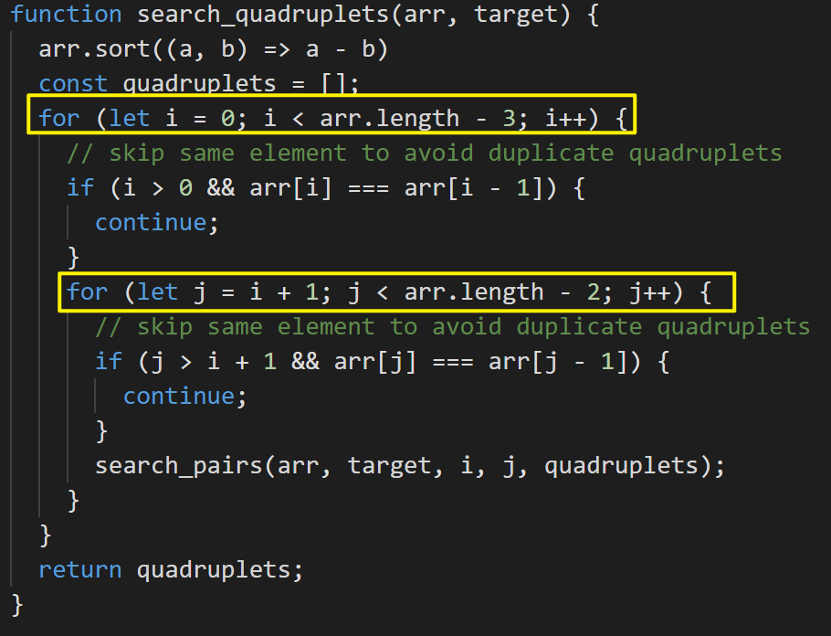

## 基础

deal with sorted arrays (or `LinkedLists`) and need to find a set of elements that fulfill certain constraints

有序数组or链表中找到符合条件的子序列

### 快慢指针

数组问题中比较常见的快慢指针技巧，是让你**原地修改数组**。

数组中另一大类快慢指针的题目就是「滑动窗口算法」

#### 27 移除元素

给你一个数组 `nums` 和一个值 val，你需要 原地 移除所有数值等于 val 的元素，并返回移除后数组的新长度。

**Example 1:**

```
Input: [3, 2, 3, 6, 3, 10, 9, 3], Key=3
Output: 4
Explanation: The first four elements after removing every 'Key' will be [2, 6, 10, 9].
```

**Example 2:**

```
Input: [2, 11, 2, 2, 1], Key=2
Output: 2
Explanation: The first two elements after removing every 'Key' will be [11, 1].
```

定义快慢指针

- 快指针：寻找新数组的元素 ，新数组就是不含有目标元素的数组
- 慢指针：指向更新 新数组下标的位置


```js
//时间复杂度：O(n)
//空间复杂度：O(1)
var removeElement = (nums, val) => {
    let k = 0; // 慢指针
    for(let i = 0;i < nums.length;i++){ // i快指针
        if(nums[i] != val){
            nums[k++] = nums[i] // 当不等于val更新快慢指针，等于只更新快指针
        }
    }
    return k;
};
```

#### 283 移动零

给定一个数组 `nums`，编写一个函数将所有 `0` 移动到数组的末尾，同时保持非零元素的相对顺序。**请注意** ，必须在不复制数组的情况下原地对数组进行操作。

**示例 1:**

```
输入: nums = [0,1,0,3,12]
输出: [1,3,12,0,0]
```

**示例 2:**

```
输入: nums = [0]
输出: [0]
```
**解法**

```js
// 和27类似，只是移除元素是0，然后后面补零
var moveZeroes = function(nums) {
    // 去除 nums 中的所有 0，返回不含 0 的数组长度
    var p = removeElement(nums, 0);
    // 将 nums[p..] 的元素赋值为 0
    for (; p < nums.length; p++) {
        nums[p] = 0;
    }
};

// 方案2，27是不在意后面的元素，可以理解为原地删除，283是讲究后面的顺序，可以理解为原地修改
let slow = 0;
for (let fast = 0; fast < nums.length; fast++) {
    if(nums[fast] !== 0) {
        // 因为要要移动0到末尾，fast和slow交换位置
        let item = nums[fast];
        nums[slow] = nums[fast];
        nums[fast] = item;
        slow++;
    }
} 
return nums;
```

#### 26 删除排序数组中的重复项

给你一个 **升序排列** 的数组 `nums` ，请你**[ 原地](http://baike.baidu.com/item/原地算法)** 删除重复出现的元素，使每个元素 **只出现一次** ，返回删除后数组的新长度。元素的 **相对顺序** 应该保持 **一致** 。然后返回 `nums` 中唯一元素的个数。

**Example 1:**

```
Input: [2, 3, 3, 3, 6, 9, 9]
Output: 4
Explanation: The first four elements after removing the duplicates will be [2, 3, 6, 9].
```

**Example 2:**

```
Input: [2, 2, 2, 11]
Output: 2
Explanation: The first two elements after removing the duplicates will be [2, 11].
```

**解法**

- 27 传入value在原数组中删除和value相同元素，fast和value比较

- 26 在原数组中删除重复项，fast和fast-1比较，或者理解成slow和fast比较


```js
// 方案1 理解成slow和fast比较
var removeDuplicates = function(nums) {
	let slow = 0;
    for (let fast = 0; fast < nums.length; fast++) {
        if (nums[fast] !== nums[slow]) {
            nums[++slow] = nums[fast];
        }
    }
    // slow是index下标，真实长度要+1
    return slow + 1; 
};

// 方案2 为了fast可以和fast-1比较，fast从1开始，slow和fast统一，也是从1开始
var removeDuplicates = function(nums) {
    let slow = 1;
    for (let fast = 1; fast < nums.length; fast++) {
        if(nums[fast - 1] !== nums[fast]) {
            nums[slow++] = nums[fast];
        }
    }
    return slow;
}
```

**复杂度**

- Time Complexity ：*O*(*N*)
- Space Complexity ：*O*(*1*)

#### 844 比较含退格的字符串

给定 `s` 和 `t` 两个字符串，当它们分别被输入到空白的文本编辑器后，如果两者相等，返回 `true` 。`#` 代表退格字符。**注意：**如果对空文本输入退格字符，文本继续为空。

**示例 1：**

```
输入：s = "ab#c", t = "ad#c"
输出：true
解释：s 和 t 都会变成 "ac"。
```

**示例 2：**

```
输入：s = "ab##", t = "c#d#"
输出：true
解释：s 和 t 都会变成 ""。
```

**示例 3：**

```
输入：s = "a#c", t = "b"
输出：false
解释：s 会变成 "c"，但 t 仍然是 "b"。
```

**解法：**

- **从后面开始遍历**，因为字母是否删除和后面的#相关，只有直到后面有多少#才知道前面有多少字母要删除

```js
var backspaceCompare = function(S, T) {
	let i = S.length - 1,
    j = T.length - 1,
    skipS = 0, // 保存跳过#数量
    skipT = 0;
    while(j >= 0 || i >= 0) {
        // S 循环
        while(i >= 0){
            if(S[i] === '#'){
                skipS++;
                i--;
            } else if (skipS > 0){
                skipS--;
                i--;
            } else break;
        }

        // T 循环
        while(j >= 0) {
            if(T[j] === '#') {
                skipT++;
                j--;
            } else if(skipS > 0) {
                skipT--;
                i--;
            } else break;
        }

        // 如果S和T相同，那么字串也是相同的
        if(S[i] !== T[j]) return false;
        i--;
        j--;
    }
    return true; 
}
```

#### 713 乘积小于 K 的子数组

给你一个整数数组 `nums` 和一个整数 `k` ，请你返回子数组内所有元素的乘积严格小于 `k` 的连续子数组的数目。

**Example 1:**

```
Input: [2, 5, 3, 10], target=30 
Output: [2], [5], [2, 5], [3], [5, 3], [10]
Explanation: There are six contiguous subarrays whose product is less than the target.
```

**Example 2:**

```
Input: [8, 2, 6, 5], target=50 
Output: [8], [2], [8, 2], [6], [2, 6], [5], [6, 5] 
Explanation: There are seven contiguous subarrays whose product is less than the target.
```

**解法**

- 和259 较小的三数之和类似
- 二分查找


- 滑动窗口

  数组是降序排列，left/right开始下标为0，right随着循环不断增加，直到`num[left]*num[right]`乘积大于target，此时移动left


**复杂度**

- Time Complexity ：

  

- Space Complexity ：*O*(*N*)

### 左右指针

#### 344 反转字符串

编写一个函数，其作用是将输入的字符串反转过来。输入字符串以字符数组 `s` 的形式给出。不要给另外的数组分配额外的空间，你必须**[原地](https://baike.baidu.com/item/原地算法)修改输入数组**、使用 O(1) 的额外空间解决这一问题。

**示例 1：**

```
输入：s = ["h","e","l","l","o"]
输出：["o","l","l","e","h"]
```

**示例 2：**

```
输入：s = ["H","a","n","n","a","h"]
输出：["h","a","n","n","a","H"]
```

**解法**

```js
var reverseString = function(s) {
    let left = 0, right = s.length - 1;
    while (left < right) {
        [s[left], s[right]] = [s[right], s[left]];
        left++;
        right--;
    }
    return s;
};
```

#### 977 有序数组的平方

给你一个按 **非递减顺序** 排序的整数数组 `nums`，返回 **每个数字的平方** 组成的新数组，要求也按 **非递减顺序** 排序。

**Example 1:**

```
Input: [-2, -1, 0, 2, 3]
Output: [0, 1, 4, 4, 9]
```

**Example 2:**

```
Input: [-3, -1, 0, 1, 2]
Output: [0 1 1 4 9]
```

**解法**

```js
var sortedSquares = function(nums) {
// 两头中肯定有最大的，所以新数组从尾部开始 倒叙存放到新数组 // i-- left++ right--
    let newArray = new Array(nums.length),
    left = 0, right = nums.length - 1;
    for (let i = nums.length - 1; i >= 0; i--) {
        if(nums[left] * nums[left] >= nums[right] * nums[right]) {
            newArray[i] = nums[left] * nums[left];
            left++;
        } else {
            newArray[i] = nums[right] * nums[right];
            right--;
        }
    }
    return newArray;
};
```

**复杂度**

- Time Complexity ：*O*(*N*)
- Space Complexity ：*O*(*N*)

#### 167. 两数之和 II 

给你一个下标从 **1** 开始的整数数组 `numbers` ，该数组已按 **非递减顺序排列** ，请你从数组中找出满足相加之和等于目标数 `target` 的两个数。如果设这两个数分别是 `numbers[index1]` 和 `numbers[index2]` ，则 `1 <= index1 < index2 <= numbers.length` 。

**Example 1:**

```
Input: [1, 2, 3, 4, 6], target=6
Output: [1, 3]
Explanation: The numbers at index 1 and 3 add up to 6: 2+4=6
```

**Example 2:**

```
Input: [2, 5, 9, 11], target=11
Output: [0, 2]
Explanation: The numbers at index 0 and 2 add up to 11: 2+9=11
```

**解法**

- **暴力法**：从左到右遍历，选定左边，因为数组排序，可以通过二分查找右边，`O(N∗logN)`

- **双指针**
  - 如果两个指针的和大于`taget`，右边指针--
  - 如果两个指针的和小于`taget`，左边边指针++


- **Hash**

  - key为数组的值，value为数组下标
  - 遍历数组，查找hash中是否有符合，没有把当前值放进hash，有的话返回结果

**复杂度**

- Time Complexity ：*O*(*N*)
- Space Complexity ：*O*(*N*)

#### 15. 三数之和

**Example 1:**

```
Input: [-3, 0, 1, 2, -1, 1, -2]
Output: [-3, 1, 2], [-2, 0, 2], [-2, 1, 1], [-1, 0, 1]
Explanation: There are four unique triplets whose sum is equal to zero.
```

**Example 2:**

```
Input: [-5, 2, -1, -2, 3]
Output: [[-5, 2, 3], [-2, -1, 3]]
Explanation: There are two unique triplets whose sum is equal to zero.
```

**解法**

- 数组排序后，可以转换成两数之和，`X+Y+Z=0 --> Y+Z=−X`，target就是`−X`
- 注意跳过相同值的数

**复杂度**

- Time Complexity 

  

- Space Complexity ：*O*(*N*)

#### 16 最接近的三数之和

**Example 1:**

```
Input: [-2, 0, 1, 2], target=2
Output: 1
Explanation: The triplet [-2, 1, 2] has the closest sum to the target.
```

**Example 2:**

```
Input: [-3, -1, 1, 2], target=1
Output: 0
Explanation: The triplet [-3, 1, 2] has the closest sum to the target.
```

**Example 3:**

```
Input: [1, 0, 1, 1], target=100
Output: 3
Explanation: The triplet [1, 1, 1] has the closest sum to the target.
```

**解法**

- 三数之和的变形，需要额外参数记录最小差值


**复杂度**

- Time Complexity ：*O*(*N*<sup>2</sup>)
- Space Complexity ：*O*(*N*)

#### 259 较小的三数之和

**Example 1:**

```
Input: [-1, 0, 2, 3], target=3 
Output: 2
Explanation: There are two triplets whose sum is less than the target: [-1, 0, 3], [-1, 0, 2]
```

**Example 2:**

```
Input: [-1, 4, 2, 1, 3], target=5 
Output: 4
Explanation: There are four triplets whose sum is less than the target: 
   [-1, 1, 4], [-1, 1, 3], [-1, 1, 2], [-1, 2, 3]
```

**解法**

- 和三数之和类似，但是相同的值不用去重
- 而且小于的值都是正确的，二分查找时，`arr[left] + arr[right] < target`，left++，但是right可以取`[left, right]`，所以`count +=right - left`


**复杂度**

- Time Complexity ：

  

- Space Complexity ：*O*(*N*)

#### 75 颜色分类

给定一个包含红色、白色和蓝色、共 `n` 个元素的数组 `nums` ，**[原地](https://baike.baidu.com/item/原地算法)**对它们进行排序，使得相同颜色的元素相邻，并按照红色、白色、蓝色顺序排列。

我们使用整数 `0`、 `1` 和 `2` 分别表示红色、白色和蓝色。

必须在不使用库内置的 sort 函数的情况下解决这个问题。

**Example 1:**

```
Input: [1, 0, 2, 1, 0]
Output: [0 0 1 1 2]
```

**Example 2:**

```
Input: [2, 2, 0, 1, 2, 0]
Output: [0 0 1 2 2 2 ]
```

**解法**

- [`Heapsort`](https://en.wikipedia.org/wiki/Heapsort) *O*(*N*∗*l*o*g*N)
- 把0放在left指针左边，把2放在right指针右边

**复杂度**

- Time Complexity ：*O*(*N*)
- Space Complexity ：*O*(*1*)

#### 18 四数之和

给你一个由 `n` 个整数组成的数组 `nums` ，和一个目标值 `target` 。请你找出并返回满足下述全部条件且**不重复**的四元组 `[nums[a], nums[b], nums[c], nums[d]]` （若两个四元组元素一一对应，则认为两个四元组重复）

**Example 1:**

```
Input: [4, 1, 2, -1, 1, -3], target=1
Output: [-3, -1, 1, 4], [-3, 1, 1, 2]
Explanation: Both the quadruplets add up to the target.
```

**Example 2:**

```
Input: [2, 0, -1, 1, -2, 2], target=2
Output: [-2, 0, 2, 2], [-1, 0, 1, 2]
Explanation: Both the quadruplets add up to the target.
```

**解法**

- 两重循环固定第一和第二位




- 双指针找到合适的数，需要传入第一和第二下标

  

#### 581 最短无序连续子数组

给你一个整数数组 `nums` ，你需要找出一个 **连续子数组** ，如果对这个子数组进行升序排序，那么整个数组都会变为升序排序。请你找出符合题意的 **最短** 子数组，并输出它的长度。

**示例 1：**

```
输入：nums = [2,6,4,8,10,9,15]
输出：5
解释：你只需要对 [6, 4, 8, 10, 9] 进行升序排序，那么整个表都会变为升序排序。
```

**示例 2：**

```
输入：nums = [1,2,3,4]
输出：0
```

**示例 3：**

```
输入：nums = [1]
输出：0
```

**解法**

- 找后一个比前一个小数，这个是要排序的数， [1, 3, 2, 0, -1, 7, 10]    2<3   3,2都要排序
- 找最小的数，最小的数的位置到开始都要排序， [1, 3, 2, 0, -1, 7, 10]    -1最小，-1前面的数都要排序 
- 找最大的数，最大的数到最后的位置都要排序
- left和right分别标注要排序的区间，首先分别从前和从后找到不排序的下标，然后根据最小值/最大值扩展左右边界

**复杂度**

- Time Complexity ：*O*(*N*)
- Space Complexity ：*O*(*1*)

#### 125 验证回文串

如果在将所有大写字符转换为小写字符、并移除所有非字母数字字符之后，短语正着读和反着读都一样。则可以认为该短语是一个 **回文串** 。字母和数字都属于字母数字字符。给你一个字符串 `s`，如果它是 **回文串** ，返回 `true` ；否则，返回 `false` 。

**示例 1：**

```
输入: s = "A man, a plan, a canal: Panama"
输出：true
解释："amanaplanacanalpanama" 是回文串。
```

**示例 2：**

```
输入：s = "race a car"
输出：false
解释："raceacar" 不是回文串。
```

**示例 3：**

```
输入：s = " "
输出：true
解释：在移除非字母数字字符之后，s 是一个空字符串 "" 。
由于空字符串正着反着读都一样，所以是回文串。
```

**解法**

先都转成大写（不然会出现 a A 判定为不相同）
设置头尾双指针，开启循环

- 如果指向的元素是不是有效的（不是字母和数字），则跳过
- 如果指向的元素有效，但不相同，则不是回文，返回false
- 如果有效，且相同，收缩指针，继续循环

直至指针相遇，循环结束，始终没有返回false，返回true。

**复杂度**

- Time Complexity ：*O*(*N*)
- Space Complexity ：*O*(*1*)

#### 680 验证回文串 II

给你一个字符串 `s`，**最多** 可以从中删除一个字符。

请你判断 `s` 是否能成为回文字符串：如果能，返回 `true` ；否则，返回 `false` 。

**示例 1：**

```
输入：s = "aba"
输出：true
```

**示例 2：**

```
输入：s = "abca"
输出：true
解释：你可以删除字符 'c' 。
```

**示例 3：**

```
输入：s = "abc"
输出：false
```

**解法**

- **判断是否是回文串，用「双指针」肯定没错**：

  - 设置头尾指针，如果指向的字符相同，则指针内移，继续检查。

  - 如果指向的字符不同，还不能判死刑，看看能否通过删一个字符(要么删左指针字符，要么删右指针字符)，使得剩下的字串是回文串

- 写一个判断回文串的辅助函数 `isPali`，去判断「删去一个字符后」的子串，是否是回文串。

**复杂度**

- Time Complexity ：*O*(*N*)
- Space Complexity ：*O*(*1*)

#### 151 反转字符串中的单词

给你一个字符串 `s` ，请你反转字符串中 **单词** 的顺序。**单词** 是由非空格字符组成的字符串。`s` 中使用至少一个空格将字符串中的 **单词** 分隔开。返回 **单词** 顺序颠倒且 **单词** 之间用单个空格连接的结果字符串。

**注意：**输入字符串 `s`中可能会存在前导空格、尾随空格或者单词间的多个空格。返回的结果字符串中，单词间应当仅用单个空格分隔，且不包含任何额外的空格。

**示例 1：**

```
输入：s = "the sky is blue"
输出："blue is sky the"
```

**示例 2：**

```
输入：s = "  hello world  "
输出："world hello"
解释：反转后的字符串中不能存在前导空格和尾随空格。
```

**示例 3：**

```
输入：s = "a good   example"
输出："example good a"
解释：如果两个单词间有多余的空格，反转后的字符串需要将单词间的空格减少到仅有一个。
```

**解法**

源字符串为："the sky is blue "

- 移除多余空格 : "the sky is blue"
- 字符串反转："eulb si yks eht"
- 单词反转："blue is sky the"

#### 5  最长回文子串

给你一个字符串 `s`，找到 `s` 中最长的回文子串。如果字符串的反序与原始字符串相同，则该字符串称为回文字符串。

**示例 1：**

```
输入：s = "babad"
输出："bab"
解释："aba" 同样是符合题意的答案。
```

**示例 2：**

```
输入：s = "cbbd"
输出："bb"
```

**解法**

两种情况 一种是回文子串长度为奇数（如aba，中心是b） 另一种回文子串长度为偶数（如abba，中心是b，b）

循环遍历字符串 对取到的每个值 都假设它可能成为最后的中心向两边进行扩散


剑指 Offer 57. 和为s的两个数字	

剑指 Offer II 006. 排序数组中两个数字之和


