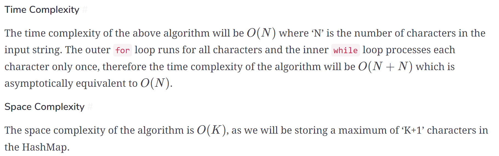

## 基础

找出数组中符合条件的子数组。

暴力解法，是一个for循环滑动窗口的起始位置，一个for循环为滑动窗口的终止位置，用两个for循环 完成了一个不断搜索区间的过程。

滑动窗口用一个for循环来完成这个操作，不断的调节子序列的起始位置和终止位置，从而得出我们要想的结果。

- 窗口是什么
- 如何移动窗口的起始位置
- 如何移动窗口的结束位置

## 题目

### 643 子数组最大平均数 I

给你一个由 `n` 个元素组成的整数数组 `nums` 和一个整数 `k` 。请你找出平均数最大且 **长度为 `k`** 的连续子数组，并输出该最大平均数。

示例 1：

```
输入：nums = [1,12,-5,-6,50,3], k = 4
输出：12.75
解释：最大平均数 (12-5-6+50)/4 = 51/4 = 12.75
```

示例 2：

```
输入：nums = [5], k = 1
输出：5.00000
```

**解法**：

窗口是长度为k的子数组

```js
var findMaxAverage = function(nums, k) {
    // 开始位置，累计值，返回结果
    let start = 0, sum = 0, maxAverage = Number.MIN_SAFE_INTEGER;
    for (let end = 0; end < nums.length; end++) { // 右边不断往前移动
        sum += nums[end];
        if (end >= k - 1) { // 当窗口等于k移动左侧
            // 计算结果
            maxAverage = Math.max(maxAverage, sum / k);
            // 移动窗口
            sum -= nums[start];
            start++;
        }
    }
    return maxAverage;
};
```

**复杂度：**

时间：*O*(*N*)

时间：*O*(*1*)

### 209 长度最小的子数组

给定一个含有 `n` 个正整数的数组和一个正整数 `target` **。**找出该数组中满足其总和大于等于 `target` 的长度最小的 **连续子数组** `[numsl, numsl+1, ..., numsr-1, numsr]` ，并返回其长度**。**如果不存在符合条件的子数组，返回 `0` 。

示例 1：

```
输入：target = 7, nums = [2,3,1,2,4,3]
输出：2
解释：子数组 [4,3] 是该条件下的长度最小的子数组。
```

示例 2：

```
输入：target = 4, nums = [1,4,4]
输出：1
```

**解法**：

窗口是和大于target子数组。窗口长度不确定，基本模板和 643 子数组最大平均数 I 类似，但是因为窗口长度不确定，子数组的和达到target时，start不一定减少一格，还有可能减少多格，所以循环一格格减少start，直到sum结果小于target，子数组不符合目标


```js
var minSubArrayLen = function(target, nums) {
    let start = 0, sum = 0, minSubLen = Number.MAX_SAFE_INTEGER;
    for (let end = 0; end < nums.length; end++) {
        sum += nums[end];
        // 子数组不定长，找到start结束移动位置，sum小于target
        while (sum >= target) {
            // 处理结果
            minSubLen = Math.min(minSubLen, end - start + 1);
            // 移动窗口
            sum -= nums[start];
            start++;
        }
    }
    return minSubLen === Number.MAX_SAFE_INTEGER ? 0 : minSubLen;
};
```

**复杂度：**

时间：*O*(*N*)


时间：*O*(*1*)

### 340 至多包含 K 个不同字符的最长子串

Given a string, find the length of the **longest substring** in it **with no more than K distinct characters**.

Example 1:

```
Input: String="araaci", K=2
Output: 4
Explanation: The longest substring with no more than '2' distinct characters is "araa".
```

Example 2:

```
Input: String="araaci", K=1
Output: 2
Explanation: The longest substring with no more than '1' distinct characters is "aa".
```

Example 3:

```
Input: String="cbbebi", K=3
Output: 5
Explanation: The longest substrings with no more than '3' distinct characters are "cbbeb" & "bbebi".
```

**解法：**

窗口是不能超过K个不同单词的子数组，和 209 长度最小的子数组 类似，当超过窗口超过K开始缩小，但是计算结果在缩小窗口循环之外，窗口之内不符合条件，使用对象（Map）记录窗口中每个单词数量

```js
var minSubArrayLen = function (str, k) {
    let start = 0, maxLength = 0, charFrequency = {};
    for (let end = 0; end < str.length; end++) {
        if (!(str[end] in charFrequency)) {
            charFrequency[str[end]] = 0;
        }
        charFrequency[str[end]]++;
        while (Object.keys(charFrequency).length > k) {
            charFrequency[str[start]]--;
            if (charFrequency[str[start]] === 0) {
                delete charFrequency[str[start]];
            }
            start++;
        }
        maxLength = Math.max(maxLength, end - start + 1);
    }
    return maxLength;
};
```

对象属性

- in 自身和继承
- `hasOwnPropert` 自身

枚举对象属性

- [for...in](https://developer.mozilla.org/zh-CN/docs/Web/JavaScript/Reference/Statements/for...in) 循环 该方法依次访问一个对象及其**原型链**中所有可枚举的属性。
- [Object.keys(o)](https://developer.mozilla.org/zh-CN/docs/Web/JavaScript/Reference/Global_Objects/Object/keys) 该方法返回对象 `o` 自身包含（不包括原型中）的所有**可枚举**属性的名称的**数组**。
- [Object.getOwnPropertyNames(o)](https://developer.mozilla.org/zh-CN/docs/Web/JavaScript/Reference/Global_Objects/Object/getOwnPropertyNames) 该方法返回对象 `o` 自身包含（不包括原型中）的**所有属性** (无论是否可枚举) 的名称的数组。

**复杂度：**

时间：*O*(*N*)

时间：*O*(*K*)



**相似题目：**

904 水果成篮 （K固定为2）

你正在探访一家农场，农场从左到右种植了一排果树。这些树用一个整数数组 `fruits` 表示，其中 `fruits[i]` 是第 `i` 棵树上的水果 **种类** 。

你想要尽可能多地收集水果。然而，农场的主人设定了一些严格的规矩，你必须按照要求采摘水果：

- 你只有 **两个** 篮子，并且每个篮子只能装 **单一类型** 的水果。每个篮子能够装的水果总量没有限制。
- 你可以选择任意一棵树开始采摘，你必须从 **每棵** 树（包括开始采摘的树）上 **恰好摘一个水果** 。采摘的水果应当符合篮子中的水果类型。每采摘一次，你将会向右移动到下一棵树，并继续采摘。
- 一旦你走到某棵树前，但水果不符合篮子的水果类型，那么就必须停止采摘。

给你一个整数数组 `fruits` ，返回你可以收集的水果的 **最大** 数目。

示例 1：

```
输入：fruits = [1,2,1]
输出：3
解释：可以采摘全部 3 棵树。
```

示例 2：

```
输入：fruits = [0,1,2,2]
输出：3
解释：可以采摘 [1,2,2] 这三棵树。
如果从第一棵树开始采摘，则只能采摘 [0,1] 这两棵树。
```

示例 3：

```
输入：fruits = [1,2,3,2,2]
输出：4
解释：可以采摘 [2,3,2,2] 这四棵树。
如果从第一棵树开始采摘，则只能采摘 [1,2] 这两棵树。
```

**复杂度：**

时间：*O*(*N*)

时间：*O*(*1*)

### 3 无重复字符的最长子串

给定一个字符串 `s` ，请你找出其中不含有重复字符的 **最长子串** 的长度。

示例 1:

```
输入: s = "abcabcbb"
输出: 3 
解释: 因为无重复字符的最长子串是 "abc"，所以其长度为 3。
```

示例 2:

```
输入: s = "bbbbb"
输出: 1
解释: 因为无重复字符的最长子串是 "b"，所以其长度为 1。
```

示例 3:

```
输入: s = "pwwkew"
输出: 3
解释: 因为无重复字符的最长子串是 "wke"，所以其长度为 3。
     请注意，你的答案必须是 子串 的长度，"pwke" 是一个子序列，不是子串。
```

**解法：**

窗口是没有重复的字串，end循环记录每个字母出现的位置，start在重复字母前面需要更新位置，如果重复字母小于start，说明当前子数组中没有包含该字母，start位置不变，此时更新字母位置（end所在位置），所以下次再出现同样字母，该字母位置就会在start前面，就需要更新start位置

```js
var lengthOfLongestSubstring = function(s) {
    let start = 0, maxLength = 0, chatIndexMap = {};
    for (let end = 0; end < s.length; end++) {
        const currentStr = s[end];
        if (currentStr in chatIndexMap) {
            start = Math.max(start, chatIndexMap[currentStr] + 1);
        }
        chatIndexMap[currentStr] = end;
        maxLength = Math.max(maxLength, end - start + 1);
    }
    return maxLength;
};
```

**复杂度：**

时间：*O*(*N*)

空间：*O*(*K*)


### 424 替换后的最长重复字符

给你一个字符串 `s` 和一个整数 `k` 。你可以选择字符串中的任一字符，并将其更改为任何其他大写英文字符。该操作最多可执行 `k` 次。

在执行上述操作后，返回 *包含相同字母的最长子字符串的长度。*

示例 1：

```
输入：s = "ABAB", k = 2
输出：4
解释：用两个'A'替换为两个'B',反之亦然。
```

示例 2：

```
输入：s = "AABABBA", k = 1
输出：4
解释：
将中间的一个'A'替换为'B',字符串变为 "AABBBBA"。
子串 "BBBB" 有最长重复字母, 答案为 4。
可能存在其他的方法来得到同样的结果。
```

**解法：**

和 3 无重复字符的最长子串 类似，但是map记录当前窗口字母重复次数，窗口会随着`maxRepeatLetters`变大而变大，窗口大小等于`maxRepeatLetters+k`，`aabca k=1`，

end=0，窗口为1；end=1，窗口为2；

end=2，窗口为3，此后窗口长度固定为3，除非后面出现相同字母数量超过3，窗口就会更新到4；

end=3，窗口为3，进入移动窗口的循环，start加1，`maxLen`结果不变（窗口宽度没有变结果就不会变）

end=4，窗口为3，`maxRepeatLetters`还是2（`frequencyMap[rightChar]`统计的是窗口中字母数量）

```js
var characterReplacement = function(s, k) {
    let start = 0, maxLen = 0, maxRepeatLetters = 0, frequencyMap = {};
    for (let end = 0; end < s.length ; end++) {
        // 前置处理判断条件
        const rightChar = s[end];
        if (!(rightChar in frequencyMap)) {
            frequencyMap[rightChar] = 0;
        }
        frequencyMap[rightChar]++;
        maxRepeatLetters = Math.max(maxRepeatLetters, frequencyMap[rightChar]);
        // 移动窗口
        if (end - start + 1 - maxRepeatLetters > k) {
            const leftChar = s[start];
            frequencyMap[leftChar]--;
            start++;
        }
        // 处理返回结果
        maxLen = Math.max(maxLen, end - start + 1)
    }
    return maxLen;
};
```

**复杂度：**

时间：*O*(*N*)

空间：*O*(*1*)


### 1004 最大连续1的个数 III

给定一个二进制数组 `nums` 和一个整数 `k`，如果可以翻转最多 `k` 个 `0` ，则返回 *数组中连续 `1` 的最大个数* 。

示例 1：

```
输入：nums = [1,1,1,0,0,0,1,1,1,1,0], K = 2
输出：6
解释：[1,1,1,0,0,1,1,1,1,1,1]
粗体数字从 0 翻转到 1，最长的子数组长度为 6。
```

示例 2：

```
输入：nums = [0,0,1,1,0,0,1,1,1,0,1,1,0,0,0,1,1,1,1], K = 3
输出：10
解释：[0,0,1,1,1,1,1,1,1,1,1,1,0,0,0,1,1,1,1]
粗体数字从 0 翻转到 1，最长的子数组长度为 10。
```

**解法：**

424 替换后的最长重复字符 的简单版本，`maxRepeatLetters`只需要记录1的数量，在移动窗口时需要更新

```js
var longestOnes = function (nums, k) {
  let start = 0, maxLen = 0, maxOnesCount = 0;
  for (let end = 0; end < nums.length; end++) {
    if (nums[end] === 1) {
      maxOnesCount++;
    }
    if (end - start + 1 - maxOnesCount > k) {
      if (nums[start] === 1) {
        maxOnesCount--;
      }
      start++;
    }
    maxLen = Math.max(maxLen, end - start + 1);
  }
  return maxLen;
};
```

**复杂度：**

时间：*O(M+N)*

空间：*O*(*1*)

### 567 字符串的排列

给你两个字符串 `s1` 和 `s2` ，写一个函数来判断 `s2` 是否包含 `s1` 的排列。如果是，返回 `true` ；否则，返回 `false` 。

换句话说，`s1` 的排列之一是 `s2` 的 **子串** 。

示例 1：

```
输入：s1 = "ab" s2 = "eidbaooo"
输出：true
解释：s2 包含 s1 的排列之一 ("ba").
```

示例 2：

```
输入：s1= "ab" s2 = "eidboaoo"
输出：false
```

**解法：**

与 340 至多包含 K 个不同字符的最长子串 一样需要处理map， 窗口就是s1字串，当窗口大于s1字串长度就要缩小

```js
var checkInclusion = function (s1, s2) {
    let start = 0, matched = 0, charFrequency = {};
    // 构建s1的map
    for (let i = 0; i < s1.length; i++) {
        const chr = s1[i];
        if (!(chr in charFrequency)) {
            charFrequency[chr] = 0;
        }
        charFrequency[chr]++;
    }
    for (let end = 0; end < s2.length; end++) {
        const rightChar = s2[end];
        if (rightChar in charFrequency) {
            charFrequency[rightChar]--;
            if (charFrequency[rightChar] === 0) {
                matched++;
            }
            // matched++;
        }
        // end - start + 1 > s1.length 可以简化，因为end > s1.length - 1时start和end会同时加1
        if (end > s1.length - 1) {
            const leftChar = s2[start];
            if (leftChar in charFrequency) {
                if (charFrequency[leftChar] === 0) {
                    matched--;
                }
                charFrequency[leftChar]++;
            }
            start++;
        }
        if (matched === Object.keys(charFrequency).length) {
            return true;
        }
        /*if (matched === s1.length) {
            return true;
        }*/
    }
    return false;
};

checkInclusion('hello', 'ooolleoooleh');
```

**复杂度：**

时间：*O(M+N)*

空间：*O*(*M*)


### 438 找到字符串中所有字母异位词

给定两个字符串 `s` 和 `p`，找到 `s` 中所有 `p` 的 **异位词** 的子串，返回这些子串的起始索引。不考虑答案输出的顺序。

**异位词** 指由相同字母重排列形成的字符串（包括相同的字符串）。

示例 1:

```
输入: s = "cbaebabacd", p = "abc"
输出: [0,6]
解释:
起始索引等于 0 的子串是 "cba", 它是 "abc" 的异位词。
起始索引等于 6 的子串是 "bac", 它是 "abc" 的异位词。
```

示例 2:

```
输入: s = "abab", p = "ab"
输出: [0,1,2]
解释:
起始索引等于 0 的子串是 "ab", 它是 "ab" 的异位词。
起始索引等于 1 的子串是 "ba", 它是 "ab" 的异位词。
起始索引等于 2 的子串是 "ab", 它是 "ab" 的异位词。
```

**解法：**

和 567 字符串的排列 类似，不是找到就返回，循环会一直遍历到结尾，不断收集符合的结果


**复杂度：**

时间：*O(M+N)*

空间：*O*(*M*)

### 76 最小覆盖子串

给你一个字符串 `s` 、一个字符串 `t` 。返回 `s` 中涵盖 `t` 所有字符的最小子串。如果 `s` 中不存在涵盖 `t` 所有字符的子串，则返回空字符串 `""` 。

注意：

- 对于 `t` 中重复字符，我们寻找的子字符串中该字符数量必须不少于 `t` 中该字符数量。
- 如果 `s` 中存在这样的子串，我们保证它是唯一的答案。

示例 1：

```
输入：s = "ADOBECODEBANC", t = "ABC"
输出："BANC"
解释：最小覆盖子串 "BANC" 包含来自字符串 t 的 'A'、'B' 和 'C'。
```

示例 2：

```
输入：s = "a", t = "a"
输出："a"
解释：整个字符串 s 是最小覆盖子串。
```

示例 3:

```
输入: s = "a", t = "aa"
输出: ""
解释: t 中两个字符 'a' 均应包含在 s 的子串中，
因此没有符合条件的子字符串，返回空字符串。
```

**解法：**

整体和 567 字符串的排列 类似，都是找符合条件的字串

**复杂度：**

时间：*O(M+N)*
空间：*O*(*M*)

### 30 串联所有单词的子串


**复杂度：**

时间：`O(M*N*Len)`

空间：*O*(*M*)

## 题目

OLD

-  https://leetcode.com/problems/maximum-subarray/ 
-  https://leetcode.com/problems/minimum-size-subarray-sum/
-  https://leetcode.com/problems/longest-substring-with-at-most-k-distinct-characters/
-  https://leetcode.com/problems/fruit-into-baskets/
-  https://leetcode.com/problems/longest-substring-without-repeating-characters/ 
-  https://leetcode.com/problems/longest-repeating-character-replacement/ 
-  https://leetcode.com/problems/max-consecutive-ones-iii/
-  https://leetcode.com/problems/permutation-in-string/
-  https://leetcode.com/problems/find-all-anagrams-in-a-string/
-  https://leetcode.com/problems/minimum-window-substring/ 
-  https://leetcode.com/problems/substring-with-concatenation-of-all-words/
-  53 最大子数组和

- 209 长度最小的子数组
- 340 至多包含 K 个不同字符的最长子串
- 904 水果成篮
- 3 无重复字符的最长子串
- 424 替换后的最长重复字符
- 1004 最大连续1的个数 III
- 567 字符串的排列
- 438 找到字符串中所有字母异位词
- 76 最小覆盖子串
- 30 串联所有单词的子串

NEW

-  [Find Maximum in Sliding Window](https://leetcode.com/problems/sliding-window-maximum/)
-  [Minimum Window Subsequence](https://leetcode.com/problems/minimum-window-substring/)
-  [Repeated DNA Sequences](https://leetcode.com/problems/repeated-dna-sequences/)
-  [Minimum Window Substring](https://leetcode.com/problems/minimum-window-substring/)
-  [Longest Substring without Repeating Characters](https://leetcode.com/problems/longest-substring-without-repeating-characters/)
-  [Minimum Size Subarray Sum](https://leetcode.com/problems/minimum-size-subarray-sum/)
-  [Best Time to Buy and Sell Stock](https://leetcode.com/problems/best-time-to-buy-and-sell-stock/)
-  239 滑动窗口最大值
-  480 滑动窗口中位数
-  727 Minimum Window Subsequence
-  187 重复的DNA序列
-  76 最小覆盖子串
-  121 买卖股票的最佳时机
- 567字符串的排列

