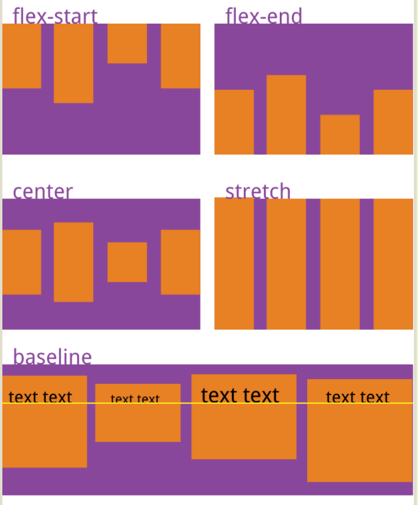

**注意事项**

任何一个容器都可以指定为 Flex 布局。行内元素也可以使用 Flex 布局。

容器里面的行内元素项目`display:block`

设为 Flex 布局以后，子元素的`float`、`clear`和`vertical-align`属性将失效。

**容器的属性**

- flex-direction：决定主轴的方向（即项目的排列方向）。

  - `row`（默认值）：主轴为水平方向，起点在左端。
  - `row-reverse`：主轴为水平方向，起点在右端。
  - `column`：主轴为垂直方向，起点在上沿。
  - `column-reverse`：主轴为垂直方向，起点在下沿。

- flex-wrap：如果一条轴线排不下，如何换行。

  - `nowrap`（默认）：不换行。
  - `wrap`：换行，第一行在上方。
  - `wrap-reverse`：换行，第一行在下方。

- flex-flow：`flex-direction`属性和`flex-wrap`属性的简写形式。

- justify-content：项目在主轴上的对齐方式

  - `flex-start`（默认值）：左对齐

  - `flex-end`：右对齐

  - `center`： 居中

  - `space-between`：两端对齐，项目之间的间隔都相等。

  - `space-around`：每个项目两侧的间隔相等。所以，项目之间的间隔比项目与边框的间隔大一倍。

    

- align-items：项目在交叉轴上的对齐方式。**一行项目在行内的交叉轴上的摆放。**

  - `flex-start`：交叉轴的起点对齐。

  - `flex-end`：交叉轴的终点对齐。

  - `center`：交叉轴的中点对齐。

  - `baseline`: 项目的第一行文字的基线对齐。

  - `stretch`（默认值）：如果项目未设置高度或设为auto，将占满整个容器的高度。

    

- align-content：多根轴线的对齐方式。如果项目只有一根轴线，该属性不起作用。**行与行之间的摆放。**

  - `flex-start`：与交叉轴的起点对齐。

  - `flex-end`：与交叉轴的终点对齐。

  - `center`：与交叉轴的中点对齐。

  - `space-between`：与交叉轴两端对齐，轴线之间的间隔平均分布。

  - `space-around`：每根轴线两侧的间隔都相等。所以，轴线之间的间隔比轴线与边框的间隔大一倍。

  - `stretch`（默认值）：轴线占满整个交叉轴。

    

**项目的属性**

- order：定义项目的排列顺序。数值越小，排列越靠前，默认为0。

- flex-grow：项目的放大比例，默认为`0`，**即如果存在剩余空间，也不放大**。

  如果所有项目的`flex-grow`属性都为1，则它们将等分剩余空间（如果有的话）。如果一个项目的`flex-grow`属性为2，其他项目都为1，则前者占据的剩余空间将比其他项多一倍。

- flex-shrink：定义了项目的缩小比例，默认为1，**即如果空间不足，该项目将缩小**。

  如果所有项目的`flex-shrink`属性都为1，当空间不足时，都将等比例缩小。如果一个项目的`flex-shrink`属性为0，其他项目都为1，则空间不足时，前者不缩小。

- flex-basis：定义了在分配多余空间之前，项目占据的主轴空间（main size）。

  浏览器根据这个属性，计算主轴是否有多余空间。它的默认值为`auto`，即项目的本来大小。

  可以设为跟`width`或`height`属性一样的值（比如350px），则项目将占据固定空间。

- flex：`flex-grow`, `flex-shrink` 和 `flex-basis`的简写，默认值为`0 1 auto`。后两个属性可选。

  该属性有两个快捷值：`auto` (`1 1 auto`) 和 none (`0 0 auto`)。

- align-self：允许单个项目有与其他项目不一样的对齐方式，可覆盖`align-items`属性。

  默认值为`auto`，表示继承父元素的`align-items`属性，如果没有父元素，则等同于`stretch`。