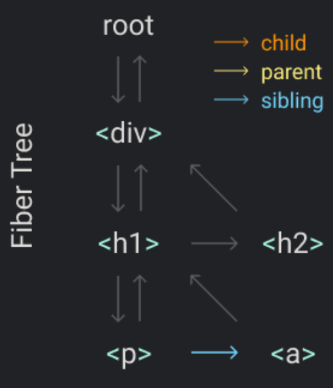
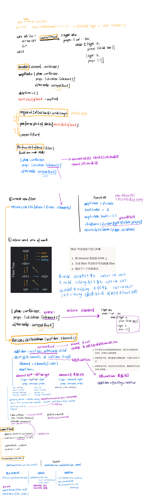

## 零: 概览

不使用 React 的情况下，渲染JSX 通过构建工具 Babel 转换成 JS，将标签中的代码替换成 createElement，并把标签名、参数和子节点作

为参数传入React.createElement 验证入参并生成了一个对象

用 “element” 来代指 React Element， 用 “node” 来代指 DOM Element

```jsx
const element = <h1 title="foo">Hello</h1>
const container = document.getElementById("root")
ReactDOM.render(element, container)

const element = React.createElement(
  "h1",
  { title: "foo" },
  "Hello"
)
const element = {
  type: "h1",
  props: {
    title: "foo",
    children: "Hello", // 一般情况下，是一个由元素组成的数组。由此 element 的结构形成了一个树
  },
}

const container = document.getElementById("root")

const node = document.createElement(element.type)
node["title"] = element.props.title

const text = document.createTextNode("")
text["nodeValue"] = element.props.children

node.appendChild(text)
container.appendChild(node)
```

## Step I: The `createElement` Function

```jsx
// 这样注释一下，babel 会将 JSX 编译成我们需要的函数
/** @jsx Didact.createElement */
const element = (
  <div id="foo">
    <a>bar</a>
    <b />
  </div>
)
const container = document.getElementById("root")
ReactDOM.render(element, container)

const element = React.createElement(
  "div",
  { id: "foo" },
  React.createElement("a", null, "bar"),
  React.createElement("b")
)

function createElement(type, props, ...children) {
  return {
    type,
    props: {
      ...props,
      // children 数组中也可能有像 strings、numbers 这样的基本值
      children: children.map(child =>
        typeof child === "object"
          ? child
          : createTextElement(child)
      ),
    },
  }
}

function createTextElement(text) {
  return {
    type: "TEXT_ELEMENT",
    props: {
      nodeValue: text,
      children: [],
    },
  }
}
// Didact 作为我们自己写的库名.
const Didact = {
  createElement,
}

const element = Didact.createElement(
  "div",
  { id: "foo" },
  Didact.createElement("a", null, "bar"),
  Didact.createElement("b")
)
```

## Step II: The render Function

在页面上渲染内容

暂时只关心如何在 DOM 上添加东西，之后再考虑 更新 和 删除

```jsx
/** @jsx Didact.createElement */
const element = (
  <div id="foo">
    <a>bar</a>
    <b />
  </div>
)
const container = document.getElementById("root")
ReactDOM.render(element, container)

function render(element, container) {
  // 当 element 类型是 TEXT_ELEMENT 的时候我们创建一个 text 节点而不是普通的节点
  const dom =
    element.type == "TEXT_ELEMENT"
      ? document.createTextNode("")
      : document.createElement(element.type)
  // 把 element 的属性赋值给 node
  const isProperty = key => key !== "children"
  Object.keys(element.props)
    .filter(isProperty)
    .forEach(name => {
      dom[name] = element.props[name]
    })
  // 对每一个子节点递归地做相同的处理
  element.props.children.forEach(child =>
    render(child, dom)
  )
  container.appendChild(dom)
}

const Didact = {
  createElement,
  render,
}
```

## Step III: Concurrent Mode

递归改成requestIdleCallback浏览器空闲调用

```js
function render(element, container) {
  // 递归不能停止
  element.props.children.forEach(child =>
    render(child, dom)
  )
}

// 通过fiber改造递归——fiber保存dom节点信息和操作信息
function render(element, container) {
  nextUnitOfWork = {
    dom: container,
    props: {
      children: [element],
    },
  }
}
// requestIdleCallback可以类比成 setTimeout，浏览器来决定什么时候运行回调函数，而不是 settimeout 里通过我们指定的一个时间
requestIdleCallback(workLoop);
function workLoop(deadline) {
  let shouldYield = false
  while (nextUnitOfWork && !shouldYield) { // 当前帧还有剩余时间
    // 完成传入的任务并返回下一个任务，下一个任务在下一次执行，这样就可以不断遍历任务 
    nextUnitOfWork = performUnitOfWork(
      nextUnitOfWork
    )
    // timeRemaining获取到当前帧剩余时间
    shouldYield = deadline.timeRemaining() < 1
  }
  requestIdleCallback(workLoop)
}
```

创建根`fiber`，将其设为`nextUnitOfWork`作为第一个任务单元，剩下的任务单元会通过`performUnitOfWork`函数完成并返回

`performUnitOfWork`函数根据浏览器是否空闲`deadline.timeRemaining`，有时间遍历任务，没有时间则终止

`performUnitOfWork`在`workLoop`内，`requestIdleCallback(workLoop)`，当浏览器有空闲时，会调用`workLoop`

## Step IV: Fibers

```jsx
Didact.render(
  <div>
    <h1>
      <p />
      <a />
    </h1>
    <h2 />
  </div>,
  container
)
```



```js
function performUnitOfWork(fiber) {
  /*element（通过 createElement创建的 react element）
  DOM node（最终生成对应的 DOM 节点）
  fiber node（从element 到 DOM 节点的中间产物，用于时间切片）*/
  // 1 add dom node
  if (!fiber.dom) {
    fiber.dom = createDom(fiber);
  }
  if (fiber.parent) {
    fiber.parent.dom.appendChild(fiber.dom);
  }

  // 2 create new fibers
  const elements = fiber.props.children
  let index = 0
  let prevSibling = null

  while (index < elements.length) {
    const element = elements[index]

    const newFiber = {
      type: element.type,
      props: element.props,
      parent: fiber,
      dom: null,
    }
    // 根据是否是第一个子节点，来设置父节点的 child 属性的指向，或者上一个节点的 sibling 属性的指向
    if (index === 0) {
      fiber.child = newFiber
    } else {
      prevSibling.sibling = newFiber
    }

    prevSibling = newFiber
    index++
  }

  // 3 return next unit of work
  // 找到下一个工作单元。 先试试 child 节点，再试试 sibling 节点，再试试 “uncle” 节点
  if (fiber.child) {
    return fiber.child
  }
  let nextFiber = fiber
  while (nextFiber) {
    if (nextFiber.sibling) {
      return nextFiber.sibling
    }
    nextFiber = nextFiber.parent
  }
}
```

## Step V: Render and Commit Phases

增加删除和修改，diff

```js
// 在完成整棵树的渲染前，浏览器还要中途阻断这个过程。 那么用户就有可能看到渲染未完全的 UI
function performUnitOfWork(fiber) {
  if (fiber.parent) {
    fiber.parent.dom.appendChild(fiber.dom)
  }
}
```

我们把修改 DOM 这部分内容记录在 fiber tree 上，通过追踪这颗树来收集所有 DOM 节点的修改，这棵树叫做 `wipRoot`（work in progress root）

```js
function render(element, container) {
  wipRoot = {
    dom: container,
    props: {
      children: [element],
    },
  }
  nextUnitOfWork = wipRoot
}

let nextUnitOfWork = null
let wipRoot = null

function workLoop(deadline) {
 // next unit of work 为 undefined，把整颗树的变更提交（commit）到实际的 DOM 上
  if (!nextUnitOfWork && wipRoot) {
    commitRoot()
  }
}

function commitRoot() {
  commitWork(wipRoot.child)
  wipRoot = null
}

function commitWork(fiber) {
  if (!fiber) {
    return
  }
  const domParent = fiber.parent.dom
  domParent.appendChild(fiber.dom)
  commitWork(fiber.child)
  commitWork(fiber.sibling)
}
```

## Step VI: Reconciliation

更新和删除 node 节点

currentRoot：当前页面渲染的fiber树

```js
let currentRoot = null

function commitRoot() {
  commitWork(wipRoot.child)
  currentRoot = wipRoot // 渲染染完，渲染树变成当下页面展示的树
  wipRoot = null
}

function render(element, container) {
  wipRoot = {
    dom: container,
    props: {
      children: [element],
    },
    alternate: currentRoot, // 用于记录旧 fiber 节点（上一个 commit 阶段使用的 fiber 节点）的引用
  }
  nextUnitOfWork = wipRoot
}

```

requestIdleCallback --> workLoop --> performUnitOfWork

## Step VII: Function Components

支持函数组件，函数组件的不同点在于：

- 函数组件的 fiber 没有 DOM 节点
- 并且子节点由函数运行得来而不是直接从 `props` 属性中获取

```jsx
/** @jsx Didact.createElement */
function App(props) {
  return <h1>Hi {props.name}</h1>
}
const element = <App name="foo" />
const container = document.getElementById("root")
Didact.render(element, container)

function App(props) {
  return Didact.createElement(
    "h1",
    null,
    "Hi ",
    props.name
  )
}
const element = Didact.createElement(App, {
  name: "foo",
})
```

当 fiber 类型为函数时，我们使用不同的函数来进行 diff

```js
function performUnitOfWork(fiber) {
  const isFunctionComponent =
    fiber.type instanceof Function
  if (isFunctionComponent) {
    updateFunctionComponent(fiber)
  } else {
    updateHostComponent(fiber)
  }
}

function updateFunctionComponent(fiber) {
  const children = [fiber.type(fiber.props)]
  reconcileChildren(fiber, children)
}
```

需要修改 `commitWork` 函数， fiber 没有 DOM 

```js
function commitWork(fiber) {
  let domParentFiber = fiber.parent
  while (!domParentFiber.dom) {
    domParentFiber = domParentFiber.parent
  }
  const domParent = domParentFiber.dom
}
```

移除节点也同样需要找到该 fiber 下第一个有 DOM 节点的 fiber 节点

```js
function commitDeletion(fiber, domParent) {
  if (fiber.dom) {
    domParent.removeChild(fiber.dom)
  } else {
    commitDeletion(fiber.child, domParent)
  }
}
```

## Step VIII: Hooks

```jsx
/** @jsx Didact.createElement */
function Counter() {
  const [state, setState] = Didact.useState(1)
  return (
    <h1 onClick={() => setState(c => c + 1)}>
      Count: {state}
    </h1>
  )
}
const element = <Counter />
const container = document.getElementById("root")
Didact.render(element, container)
```

在对应的 fiber 上加上 `hooks` 数组以支持我们在同一个函数组件中多次调用 `useState`

```js
let wipFiber = null
let hookIndex = null

function updateFunctionComponent(fiber) {
  wipFiber = fiber
  hookIndex = 0 // 重置hookIndex
  wipFiber.hooks = []
  const children = [fiber.type(fiber.props)]
  reconcileChildren(fiber, children)
}

function useState(initial) {
  const oldHook = wipFiber.alternate && wipFiber.alternate.hooks && wipFiber.alternate.hooks[hookIndex];

  const hook = {
    state: oldHook ? oldHook.state : initial,
    queue: [],
  };
  const actions = oldHook ? oldHook.queue : [];
  actions.forEach(action => {
    hook.state = action(hook.state)
  });
  const setState = action => {
    hook.queue.push(action)
    wipRoot = {
      dom: currentRoot.dom,
      props: currentRoot.props,
      alternate: currentRoot,
    }
    nextUnitOfWork = wipRoot;
    deletions = [];
  };

  wipFiber.hooks.push(hook);
  hookIndex++;
  return [hook.state, setState];
}
```


