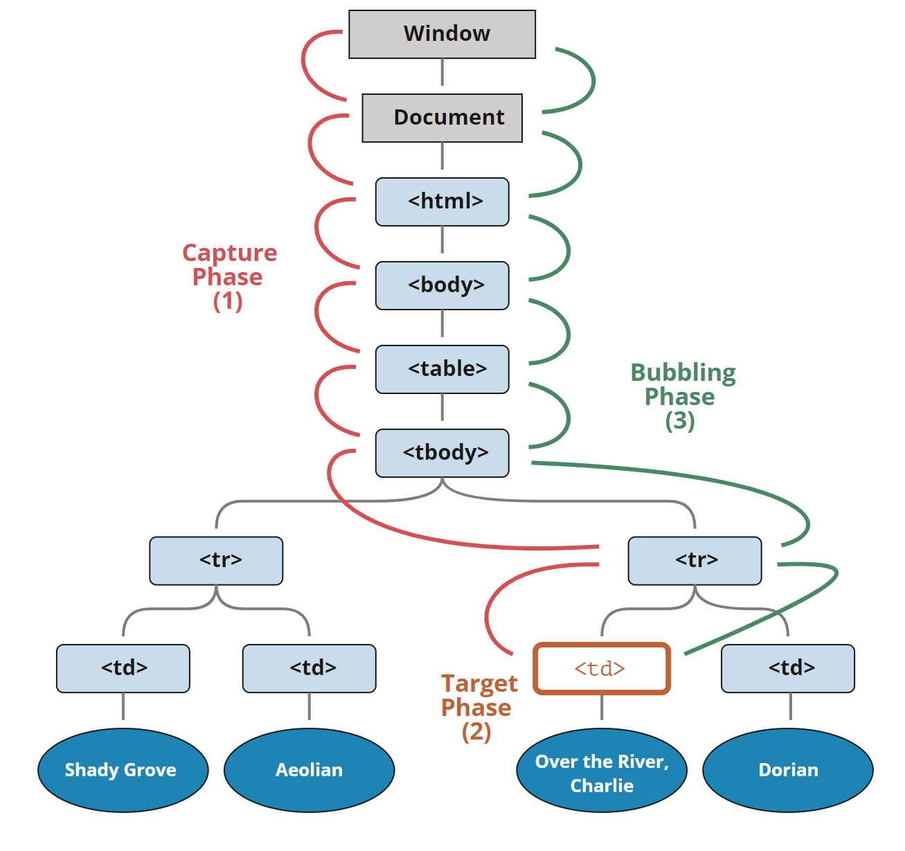

### Host Tree

React want to represent some UI with different Host Tree, such as a [DOM tree](https://www.npmjs.com/package/react-dom), an [iOS hierarchy](https://developer.apple.com/library/archive/documentation/General/Conceptual/Devpedia-CocoaApp/View Hierarchy.html).

React useful for helps you write a program that predictably manipulates a complex host tree in response to external events like interactions, network responses, timers, and so on.

Host Tree 宿主树，在宿主环境{例如浏览器}渲染界面，会借助宿主树

### Host Instances

The host tree consists of nodes. We’ll call them(nodes) “host instances”. In the DOM environment, host instances are regular DOM nodes.

Host instances have their own properties (e.g. `domNode.className` or `view.tintColor`). They may also contain other host instances as children.

Host Instances 宿主实例(节点)，数组树由数组实例构成

### `Renderers`

A renderer teaches React to talk to a specific host environment and manage its host instances. 

`Renderers`和宿主实例、宿主环境打交道

React DOM, React Native, and even [Ink](https://mobile.twitter.com/vadimdemedes/status/1089344289102942211) are React `renderers`. You can also [create your own React renderer](https://github.com/facebook/react/tree/master/packages/react-reconciler).

web端就是React DOM

### React Elements

In the host environment, a host instance (like a DOM node) is the smallest building block. In React, the smallest building block is a React element.

在宿主环境中，一个宿主实例（例如 DOM 节点）是最小的构建单元。而在 React 中，最小的构建单元是 React 元素。

```jsx
// JSX 是用来描述这些对象的语法糖。
// <button className="blue" />
{
  type: 'button',
  props: { className: 'blue' }
}
```

### Entry Point

Each React renderer has an “entry point”. It’s the `API` that lets us tell React to render a particular React element tree inside a container host instance. For example, **React DOM entry point is `ReactDOM.render`**, make the `domContainer` host tree match  `reactElement`

```jsx
ReactDOM.render(
  // { type: 'button', props: { className: 'blue' } }
  <button className="blue" />,
  document.getElementById('container')
);

// 在 ReactDOM 渲染器内部（简化版）
function createHostInstance(reactElement) {
  let domNode = document.createElement(reactElement.type);
  domNode.className = reactElement.props.className;
  return domNode;
}
```

`ReactDOM.render`是React DOM(`Renderers`)的入口，调用`ReactDOM.render`就是让`Renderers`把`reactElement`和宿主实例联系起来，改变宿主树

### Reconciliation

`React’s` job is to *make the host tree match the provided React element tree*

React 的工作是将 React 元素树映射到宿主树上去

The process of figuring out *what* to do to the host instance tree in response to new information is sometimes called [reconciliation](https://reactjs.org/docs/reconciliation.html).

reconciliation根据新信息对宿主实例树进行调整的过程

If an element type in the same place in the tree “matches up” between the previous and the next renders, React reuses the existing host instance

如果树中同一位置的元素类型在上一次渲染和下一次渲染是一样的，React会重用现有的宿主实例

### Conditions

```jsx
function Form({ showMessage }) {
  let message = null;
  if (showMessage) {
    message = <p>I was just added here!</p>;
  }
  return (
    <dialog>
      {message}
      <input /> {/*会重复使用实例*/}
    </dialog>
    <dialog>
      {/*不会重复使用实例*/}zhe
      {showMessage 
          ? <><p>I was just added here!</p><input /></>
          : <><input /></>
      }
    </dialog>
  );
}
```

### Lists

Comparing the element type at the same position in the tree is usually enough to decide whether to reuse or re-create the corresponding host instance.

列表可以重排，选中3，3和5位置互换，选中状态要一起互换

This is why React nags you to specify a special property called key every time you include an array of elements in your output

防止上述情况造成bug，react要求列表必须有key属性

the `key` is only relevant within a particular parent React element

key的唯一性只和父组件有关

when would you say an item is the “same” even if the order changed

最好赋key的值是，即使item位置变了，key依旧是不变的

### Components

Components take one argument — an object hash. It contains “props” (short for “properties”)

组件只接收props对象

```jsx
function Form({ showMessage }) {
  let message = null;
  if (showMessage) {
    message = <p>I was just added here!</p>;
  }
  return (
    <dialog>
      {message}
      <input />
    </dialog>
  );
}
```

### Purity

React components are assumed to be pure with respect to their props

不要改变props

React doesn’t care if it’s 100% pure in the strict FP sense of the word. [Idempotence](https://stackoverflow.com/questions/1077412/what-is-an-idempotent-operation) is more important to React than purity.

That said, side effects that are directly visible to the user are not allowed in React components. In other words, merely *calling* a 

component function shouldn’t by itself produce a change on the screen.

相比于纯函数组件，react更在意幂等性，即传入相同参数，返回相同的`JXS`，如果副作用不影响返回的`JSX`，这个副作用react是不会管的

### Recursion

当然可以直接调用函数组件，但是更常见用法是使用React elements

```jsx
let reactElement = Form({ showMessage: true });
ReactDOM.render(reactElement, domContainer);

// { type: Form, props: { showMessage: true } }
let reactElement = <Form showMessage={true} />;
ReactDOM.render(reactElement, domContainer);
// React 内部的某个地方
let type = reactElement.type; // Form
let props = reactElement.props; // { showMessage: true }
let result = type(props); // 无论 Form 会返回什么
console.log(<form />.type); // 'form' 字符串
console.log(<Form />.type); // Form 函数
```

when an element type is a function, React calls your component, and asks what element that component wants to render.

如果函数组件内部还是一个函数组件，react会递归调用

This is why we say reconciliation is recursive. When React walks the element tree, it might meet an element whose `type` is a component. It will call it and keep descending down the tree of returned React elements. Eventually, we’ll run out of components, and React will know what to change in the host tree.

### Inversion of Control

React can do its job better if it “knows” about your components rather than if it only sees the React element tree after recursively calling them.

- Components become more than functions

- Component types participate in the reconciliation

- React can delay the reconciliation

- A better debugging story

- Lazy Evaluation

  ```js
  // (2) 它会作为第二个计算
  eat(
    // (1) 它会首先计算
    prepareMeal()
  );
  ```

### State

保持组件的状态，例如输入框中的内容在渲染中保持不变

### Consistency

Even if we want to split the reconciliation process itself into [non-blocking](https://www.youtube.com/watch?v=mDdgfyRB5kg) chunks of work, we should still perform the actual host tree operations in a single synchronous swoop. 

This is why React splits all work into the **“render phase”** and the **“commit phase”**. *Render phase* is when React **calls your components and performs reconciliation**. It is safe to interrupt and [in the future](https://reactjs.org/blog/2018/03/01/sneak-peek-beyond-react-16.html) will be **asynchronous**. *Commit phase* is when React **touches the host tree**. It is always **synchronous**.

reconciliation 可以异步，但是更新到宿主树必须是同步的，不然用户就会看到渲染到一半的界面

### `Memoization`

When a parent schedules an update by calling `setState`, by default React reconciles its whole child subtree. 

can tell React to [memoize](https://en.wikipedia.org/wiki/Memoization) a subtree and reuse previous render results during shallow equal prop changes

父组件改变时，子组件也会重新渲染，如果想重复利用子组件可以使用memo `useMemo`

```jsx
function Row({ item }) {
  // ...
}

export default React.memo(Row);
```

### Raw Models

[Time to interactive](https://calibreapp.com/blog/time-to-interactive/) is a crucial metric in consumer web applications, and traversing models to set up fine-grained listeners spends that precious time. Additionally, in many apps, interactions tend to result either in small (button hover) or large (page transition) updates, in which case fine-grained subscriptions are a waste of memory resources.

界面的响应时间是一个关键指标，遍历整颗节点数来设置细粒度监听器会耗费宝贵的时间。许多应用程序中，交互往往会导致较小的更新（按钮悬停）或较大的更新（页面转换），在这种情况下，细粒度订阅会浪费内存资源。

React rendering is O(*view size*) rather than O(*model size*), and you can significantly cut the *view size* with [windowing](https://react-window.now.sh/#/examples/list/fixed-size).

React的渲染是O(视图大小)而不是O(模型大小)，您可以通过视窗化大幅削减视图大小。

Note that there are common performance issues that even fine-grained subscriptions and “reactivity” systems can’t solve.

请注意，即使是细粒度订阅和 "反应性 "系统也无法解决一些常见的性能问题。例如，在不阻塞浏览器的情况下渲染新的**深层树**（在每次页面转换时都会发生）。变更跟踪并不能使其更快，反而会使其更慢，因为我们必须做更多的工作来设置订阅。另一个问题是，在开始渲染视图之前，我们必须**等待数据**。在React中，我们使用[并发渲染](https://reactjs.org/blog/2018/03/01/sneak-peek-beyond-react-16.html)（Concurrent Rendering）来解决这两个问题。

### Batching

[DOM 事件](http://www.w3.org/TR/DOM-Level-3-Events/)标准描述了事件传播的 3 个阶段：

1. 捕获阶段（Capturing phase）—— 事件（从 Window）向下走近元素。
2. 目标阶段（Target phase）—— 事件到达目标元素。
3. 冒泡阶段（Bubbling phase）—— 事件从元素上开始冒泡。

虽然形式上有 3 个阶段，但第 2 阶段（“目标阶段”：事件到达元素）没有被单独处理：捕获阶段和冒泡阶段的处理程序都在该阶段被触发

`td`会在第一和第三阶段被触发



冒泡事件从目标元素开始向上冒泡。通常，它会一直上升到 `<html>`，然后再到 `document` 对象，有些事件甚至会到达 `window`，它们会调用路径上所有的处理程序。

- `event.stopPropagation()` 停止向上移动，但是当前元素上的其他处理程序都会继续运行
- `event.stopImmediatePropagation()` 方法，可以用于停止传播，并阻止当前元素上的处理程序运行
- 捕获阶段也可以通过`event.stopPropagation()`来阻止事件继续传播

为了在捕获阶段捕获事件，我们需要将处理程序的 `capture` 选项设置为 `true`：

```javascript
elem.addEventListener(..., {capture: true})
// 或者，用 {capture: true} 的别名 "true"
elem.addEventListener(..., true)
```

React batches updates inside event handlers

```jsx
function Parent() {
  let [count, setCount] = useState(0);
  return (
    <div onClick={() => setCount(count + 1)}>
      Parent clicked {count} times
      <Child />
    </div>
  );
}

function Child() {
  let [count, setCount] = useState(0);
  return (
    <button onClick={() => setCount(count + 1)}>
      Child clicked {count} times
    </button>
  );
}

// 如果react立即处理子组件的setState，会触发两次子组件的更新
*** Entering React's browser click event handler ***
Child (onClick)
  - setState
  - re-render Child // 😞 unnecessary
Parent (onClick)
  - setState
  - re-render Parent
  - re-render Child
*** Exiting React's browser click event handler ***

// react会把setState收集起来，先处理完全部事件处理函数，然后触发一次重新渲染，将所有更新在一起批处理
*** Entering React's browser click event handler ***
Child (onClick)
  - setState
Parent (onClick)
  - setState
*** Processing state updates                     ***
  - re-render Parent
  - re-render Child
*** Exiting React's browser click event handler  ***
```

`setState` provides an overload that accepts an “updater” function: React would put the updater functions in a queue, and later run them in sequence, resulting in a re-render with `count` set to `3`.

```js
function handleClick() {
    increment();
    increment();
}

function increment() {
	setCount(count + 1); // 调用两次setCount(1)
}

function increment() {
	setCount(c => c + 1); // reaact会把函数放到更新队列中
}
```

### Call Tree

React itself runs in JavaScript and obeys JavaScript rules. But we can imagine that internally React has some kind of its own call stack to remember which component we are currently rendering, e.g. `[App, Page, Layout, Article /* we're here */]`.

js调用函数内部的函数会用到调用栈，组件是函数，react管理组件也会用到调用栈

React is different from a general purpose language runtime because it’s aimed at rendering UI trees. These trees need to “stay alive” for us to interact with them. The DOM doesn’t disappear after our first `ReactDOM.render()` call.

react的目标是渲染宿主树，界面上的`UI`必须是可以交互的（例如点击按钮，组件函数要处理，触发事件处理函数），所以组件函数不能在调用 `ReactDOM.render()` 后就被销毁

This may be stretching the metaphor but I like to think of React components as being in a “call tree” rather than just a “call stack”. When we go “out” of the `Article` component, its React “call tree” frame doesn’t get destroyed. We need to keep the local state and references to the host instances [somewhere](https://medium.com/react-in-depth/the-how-and-why-on-reacts-usage-of-linked-list-in-fiber-67f1014d0eb7).

对于react调用函数组件其实与js调用函数有不同点的，react调用函数组件可以称为call tree。react在调用完组件后，会把组建的state和宿主实例的引用保存起来

These “call tree” frames *are* destroyed along with their local state and host instances, but only when the [reconciliation](https://overreacted.io/react-as-a-ui-runtime/#reconciliation) rules say it’s necessary. If you ever read React source, you might have seen these frames being referred to as [Fibers](https://en.wikipedia.org/wiki/Fiber_(computer_science)).

Fibers are where the local state actually lives. When the state is updated, React marks the Fibers below as needing reconciliation, and calls those components.

 “call tree” frames 是Fibers，保存着state，当state更新时，子组件会重新渲染

### Context

Context is essentially like [dynamic scoping](http://wiki.c2.com/?DynamicScoping) for components. It’s like a wormhole that lets you put something on the top, and have every child at the bottom be able to read it and re-render when it changes.

Context就像组件的动态范围 ，能从顶层传递数据，并让每个子组件在底部能够读取该值

In practice, React maintains a **context stack** while it renders

```JSX
const ThemeContext = React.createContext(
  'light' // 如果没有 ThemeContext.Provider 存在就会使用默认值
);

function DarkApp() {
  return (
    <ThemeContext.Provider value="dark">
      <MyComponents />
    </ThemeContext.Provider>
  );
}

function SomeDeeplyNestedChild() {
  // 寻找树中最近的 <ThemeContext.Provider> ，并且使用它的 value 
  const theme = useContext(ThemeContext);
}
```

### Effects

React defers executing effects until after the browser re-paints the screen.

直到浏览器重新绘制屏幕，react才会执行`useEffect`

### Custom Hooks

Note that the *state itself* is not shared. Each call to a Hook declares its own isolated state.

状态本身是不共享的。每次调用 Hook 都只声明了其自身的独立状态。

### Static Use Order

Hooks are implemented as [linked lists](https://dev.to/aspittel/thank-u-next-an-introduction-to-linked-lists-4pph). When you call `useState`, we move the pointer to the next item. When we exit the component’s [“call tree” frame](https://overreacted.io/react-as-a-ui-runtime/#call-tree), we save the resulting list there until the next render.

```js
// 伪代码
let hooks, i;
function useState() {
  i++;
  if (hooks[i]) {
    // 再次渲染时
    return hooks[i];
  }
  // 第一次渲染
  hooks.push(...);
}

// 准备渲染
i = -1;
hooks = fiber.hooks || [];
// 调用组件
YourComponent();
// 缓存 Hooks 的状态
fiber.hooks = hooks;
```

