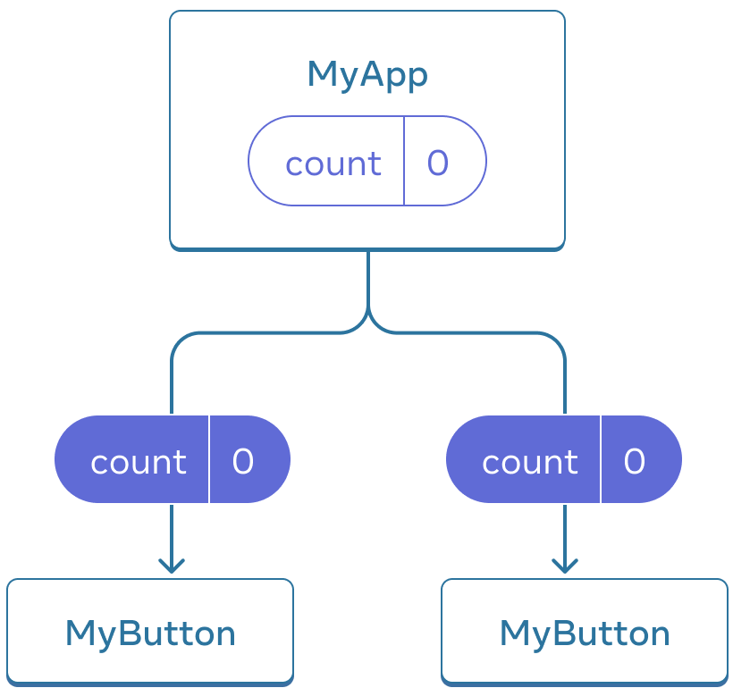

React does not prescribe how you add CSS files. 

```jsx
// index.js
import React, { StrictMode } from "react";
import { createRoot } from "react-dom/client";
import "./styles.css";

import App from "./App";

const root = createRoot(document.getElementById("root"));
root.render(
  <StrictMode>
    <App />
  </StrictMode>
);

// App.js
const products = [
  { title: "Cabbage", isFruit: false, id: 1 },
  { title: "Garlic", isFruit: false, id: 2 },
  { title: "Apple", isFruit: true, id: 3 }
];

export default function ShoppingList() {
  const listItems = products.map((product) => (
    <li
      key={product.id}
      style={{
        color: product.isFruit ? "magenta" : "darkgreen"
      }}
    >
      {product.title}
    </li>
  ));
  console.log("listItems", listItems);

  return <ul>{listItems}</ul>;
}
```

If you want to use `useState` in a condition or a loop, extract a new component and put it there.

If you render the same component multiple times, each will get its own state. 


```jsx
import { useState } from 'react';

export default function MyApp() {
  return (
    <div>
      <h1>Counters that update separately</h1>
      <MyButton />
      <MyButton />
    </div>
  );
}

function MyButton() {
  const [count, setCount] = useState(0);

  function handleClick() {
    setCount(count + 1);
  }

  return (
    <button onClick={handleClick}>
      Clicked {count} times
    </button>
  );
}
```


The information you pass down like this is called *props*. This is called “lifting state up”. By moving state up, you’ve shared it between components.



```jsx
import { useState } from 'react';

export default function MyApp() {
  const [count, setCount] = useState(0);

  function handleClick() {
    setCount(count + 1);
  }

  return (
    <div>
      <h1>Counters that update together</h1>
      <MyButton count={count} onClick={handleClick} />
      <MyButton count={count} onClick={handleClick} />
    </div>
  );
}

function MyButton({ count, onClick }) {
  return (
    <button onClick={onClick}>
      Clicked {count} times
    </button>
  );
}
```

State is not tied to a particular function call or a place in the code, but it’s “local” to the specific place on the screen. 

state is fully private to the component declaring it.

Built-in React Hooks

State Hooks 

- [`useState`](https://react.dev/reference/react/useState) declares a state variable that you can update directly.

  The [`useState`](https://react.dev/reference/react/useState) Hook provides those two things:

  1. A **state variable** to retain the data between renders.
  2. A **state setter function** to update the variable and trigger React to render the component again.

  happens in action

  1. **Your component renders the first time.** Because you passed `0` to `useState` as the initial value for `index`, it will return `[0, setIndex]`. React remembers `0` is the latest state value.
  2. **You update the state.** When a user clicks the button, it calls `setIndex(index + 1)`. `index` is `0`, so it’s `setIndex(1)`. This tells React to remember `index` is `1` now and ==triggers== another render.
  3. **Your component’s second render.** React still sees `useState(0)`, but because React *remembers* that you set `index` to `1`, it returns `[1, setIndex]` instead.
  4. And so on!

- [`useReducer`](https://react.dev/reference/react/useReducer) declares a state variable with the update logic inside a [reducer function.](https://react.dev/learn/extracting-state-logic-into-a-reducer)

Context Hooks 


Ref Hooks 


Effect Hooks 


Performance Hooks 


Other Hooks 


Your own Hooks 