## 1 Quick Start

A component can be as small as a button, or as large as an entire page

组件可以很小到按钮，也可以很大到整个页面

React does not prescribe how you add `CSS` files

react没有规定怎么导入`css`文件，所以不是一个组件就得配置一个样式文件

```jsx
// index.js 可以在index导入App的样式文件
import React, { StrictMode } from "react";
import { createRoot } from "react-dom/client";
import "./styles.css";

import App from "./App";

const root = createRoot(document.getElementById("root"));
root.render(
  <StrictMode>
    <App />
  </StrictMode>
);

// App.js
const products = [
  { title: "Cabbage", isFruit: false, id: 1 },
  { title: "Garlic", isFruit: false, id: 2 },
  { title: "Apple", isFruit: true, id: 3 }
];

export default function ShoppingList() {
  const listItems = products.map((product) => (
    <li
      key={product.id}
      style={{
        color: product.isFruit ? "magenta" : "darkgreen"
      }}
    >
      {product.title}
    </li>
  ));
  console.log("listItems", listItems);

  return <ul>{listItems}</ul>;
}
```

If you want to use `useState` in a condition or a loop, extract a new component and put it there

如果想要在循环或者条件语句中使用hook，把hook逻辑抽象成子组件，父组件使用循环或者条件加载子组件

If you render the same component multiple times, each will get its own state

在父组件中使用两次子组件，每个子组件状态state是独立的

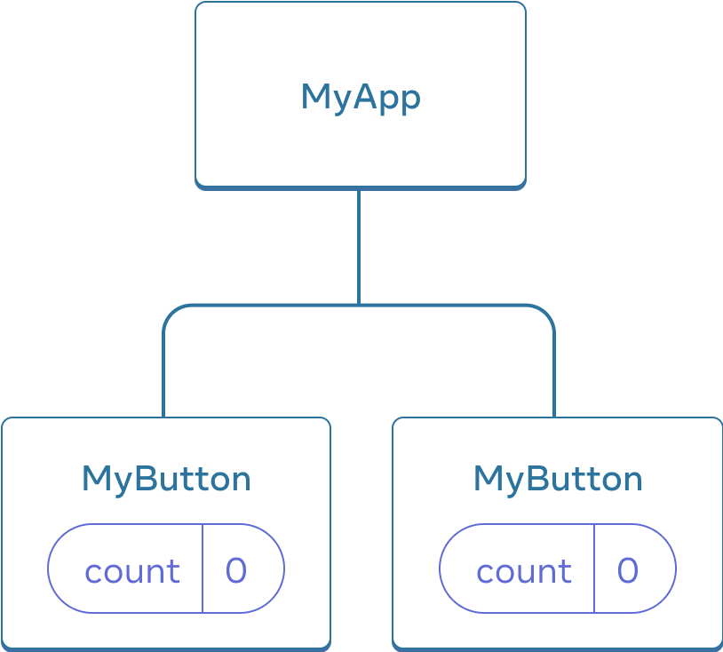

```jsx
import { useState } from 'react';

export default function MyApp() {
  return (
    <div>
      <h1>Counters that update separately</h1>
      <MyButton />
      <MyButton />
    </div>
  );
}

function MyButton() {
  const [count, setCount] = useState(0);

  function handleClick() {
    setCount(count + 1);
  }

  return (
    <button onClick={handleClick}>
      Clicked {count} times
    </button>
  );
}
```

The information you pass down like this is called *props*. This is called “lifting state up”. By moving state up, you’ve shared it between components

如果想要两个子组件状态state是同步的，需要把状态提升到父组件

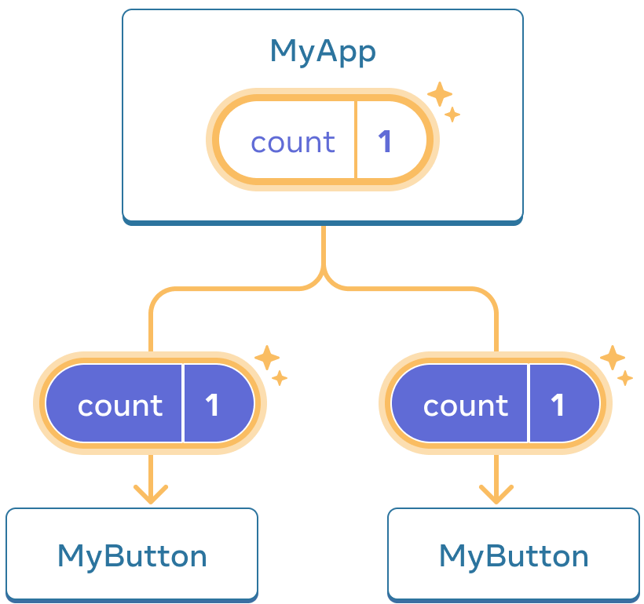

```jsx
import { useState } from 'react';

export default function MyApp() {
  const [count, setCount] = useState(0);

  function handleClick() {
    setCount(count + 1);
  }

  return (
    <div>
      <h1>Counters that update together</h1>
      <MyButton count={count} onClick={handleClick} />
      <MyButton count={count} onClick={handleClick} />
    </div>
  );
}

function MyButton({ count, onClick }) {
  return (
    <button onClick={onClick}>
      Clicked {count} times
    </button>
  );
}
```

## 2 Describing the `UI`

### 2.1 Your First Component

your markup isn’t all on the same line as the `return` keyword, you must wrap it in a pair of parentheses

函数组件一行不能返回，需要包在小括号里面

tatements are affected by the automatic semicolon insertion (also known as ASI for brevity):

受自动分号影响的语法

- empty statement
- `var` statement
- expression statement
- `do-while` statement
- `continue` statement
- `break` statement
- `return` statement
- `throw` statement

browser sees

```jsx
function Profile() {
  return (
    
  );
}

export default function Gallery() {
  return (
    <section>
      <h1>Amazing scientists</h1>
      <Profile />
      <Profile />
      <Profile />
    </section>
  );
}

<section>
  <h1>Amazing scientists</h1>
  
  
  
</section>
```

The `Profile` components are rendered inside `Gallery`—even several times

### 2.2 Importing and Exporting Components

A file can have no more than one default export, but it can have as many named exports as you like

一个文件中只能由一个default export，可以有多个export

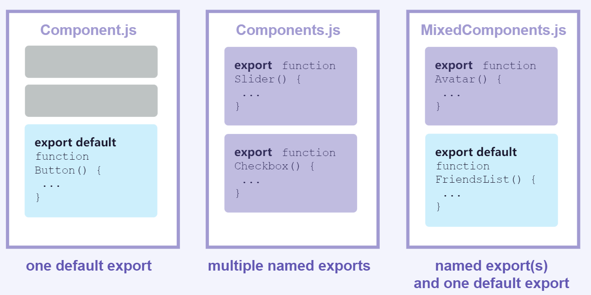

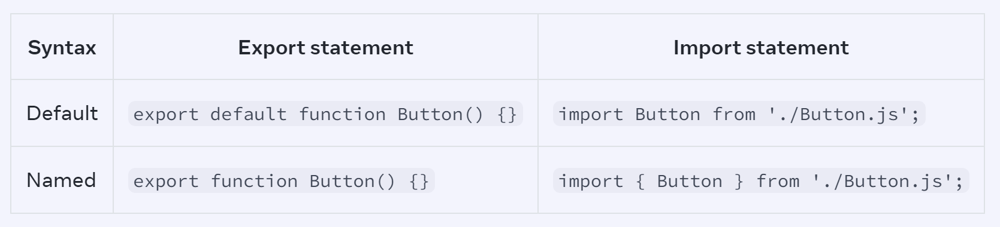

People often use default exports if the file exports only one component, and use named exports if it exports multiple components and values

To reduce the potential confusion between default and named exports, some teams choose to only stick to one style (default or named), or avoid mixing them in a single file

避免在一个文件中使用两种风格

### 2.3 Writing Markup with JSX

But as the Web became more interactive, logic increasingly determined content. JavaScript was in charge of the HTML! This is why **in React, rendering logic and markup live together in the same place—components**

现代web应用有更多的交互，js会负责html的展示

The Rules of JSX
1. Return a single root element 

   This empty tag `<></>` is called a Fragment. Fragments let you group things without leaving any trace in the browser HTML tree

   空标只是帮助组织代码，不会在浏览器中增加dom

   JSX looks like HTML, but under the hood it is transformed into plain JavaScript objects. You can’t return two objects from a function without wrapping them into an array

   函数组件必须返回一个根元素，就像函数不能返回两个对象，需要把两个对象放在数组里面

2. Close all the tags 

3. has limitations on variable names

   can’t contain dashes or be reserved words like `class`

   JSX turns into JavaScript and attributes written in JSX become keys of JavaScript objects. 

   ```js
   const el = document.getElementById("item");
   el.className = el.className === "active" ? "inactive" : "active";
   ```

   jsx最终被转换成js，html上的一些属性名，有破折号（stroke-width换成strokeWidth）或关键字是不可以使用的，需要别的字段替换

### 2.4 JavaScript in JSX with Curly Braces

JavaScript expression will work between curly braces, including **function** calls like `formatDate()`

jsx中使用动态属性或者在标签之间使用js逻辑，需要用大括号包裹，大括号里面还可以调用函数

```JSX
const baseUrl = 'https://i.imgur.com/';
const person = {
  name: 'Gregorio Y. Zara',
  imageId: '7vQD0fP',
  imageSize: 's',
  theme: {
    backgroundColor: 'black',
    color: 'pink'
  }
};

export default function TodoList() {
  return (
    <div style={person.theme}>
      {/* 在标签之间使用 */}
      <h1>{person.name}'s Todos</h1> 
      {/* 属性值使用引号或者大括号，``模板字符串不允许使用 */}
      
      <ul>
        <li>Improve the videophone</li>
        <li>Prepare aeronautics lectures</li>
        <li>Work on the alcohol-fuelled engine</li>
      </ul>
    </div>
  );
}
```

### 2.5 Passing Props to a Component

To pass props, add them to the JSX, just like you would with HTML attributes

传递props给子组件就像属性一样

Specifying a default value for a prop，the default value is only used if the `size` prop is missing or if you pass `size={undefined}`

```jsx
function Avatar({ person, size = 100 }) {
  // ...
}
```

Forwarding props with the JSX spread syntax 

如果父组件的所有props都要传递下去，可以使用扩展语法让代码更加整洁

```jsx
function Profile({ person, size, isSepia, thickBorder }) {
  return (
    <div className="card">
      <Avatar
        person={person}
        size={size}
        isSepia={isSepia}
        thickBorder={thickBorder}
      />
    </div>
  );
}

function Profile(props) {
  return (
    <div className="card">
      <Avatar {...props} />
    </div>
  );
}
```

Passing JSX as children 

the `Card` component below will receive a `children` prop set to `<Avatar />` and render it in a wrapper div

```jsx
function Avatar({ person, size }) {
  return (
    
  );
}

function Card({ children }) {
  return (
    <div className="card">
      {children}
    </div>
  );
}

export default function Profile() {
  return (
    <Card>
      <Avatar
        size={100}
        person={{ 
          name: 'Katsuko Saruhashi',
          imageId: 'YfeOqp2'
        }}
      />
    </Card>
    <Card>
      <h1>About</h1>
        <p>Aklilu Lemma was a distinguished Ethiopian scientist.
        </p>
    </Card>
  );
}
```

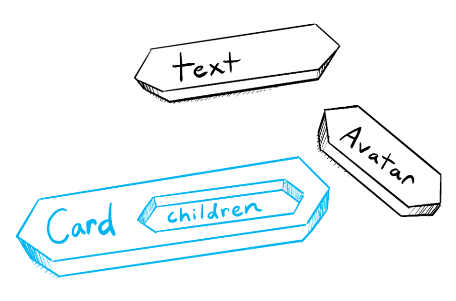


**Don’t try to “change props”.** When you need to respond to the user input (like changing the selected color), you will need to “set state”

子组件不要改变传递的props，如果要改变组件状态使用state

### 2.6 Conditional Rendering

JSX elements aren’t “instances” because they don’t hold any internal state and aren’t real DOM nodes. They’re lightweight descriptions, like blueprints. So these two examples, in fact, *are* completely equivalent

按照面向对象编程思想，下面两个返回是不一样的，但是JSX只是一种描述，不是对象实例不是真实dom，对于react两者是一样的

```jsx
function Item({ name, isPacked }) {
  if (isPacked) {
    return null;
  }
  return <li className="item">{name}</li>;
}

function Item({ name, isPacked }) {
    return (
      <li className="item">
        {isPacked ? name + ' ✔' : name}
      </li>
    );
}

function Item({ name, isPacked }) {
    return (
      <li className="item">
        {name} {isPacked && '✔'}
      </li>
    );
}
```

Conditionally returning nothing with null

如果不渲染任何内容，函数组件可以返回null，或者使用&&

**Don’t put numbers on the left side of `&&`**

```jsx
// messageCount===0，render 0
messageCount && <p>New messages</p>

// better
messageCount > 0 && <p>New messages</p>
```

Conditionally assigning JSX to a variable

```jsx
const drinks = {
  tea: {
    part: 'leaf',
    caffeine: '15–70 mg/cup',
  },
  coffee: {
    part: 'bean',
    caffeine: '80–185 mg/cup',
  }
};

function Drink({ name }) {
  const info = drinks[name];
  return (
    <section>
      <h1>{name}</h1>
      <dl>
        <dt>Part of plant</dt>
        <dd>{info.part}</dd>
        <dt>Caffeine content</dt>
        <dd>{info.caffeine}</dd>
      </dl>
    </section>
  );
}

// 另一种实现
function Drink({ name }) {
  let part, caffeine, age;
  if (name === 'tea') {
    part = 'leaf';
    caffeine = '15–70 mg/cup';
  } else if (name === 'coffee') {
    part = 'bean';
    caffeine = '80–185 mg/cup';
  }
  return (
    <section>
      <h1>{name}</h1>
      <dl>
        <dt>Part of plant</dt>
        <dd>{part}</dd>
        <dt>Caffeine content</dt>
        <dd>{caffeine}</dd>
      </dl>
    </section>
  );
}
```

### 2.7 Rendering Lists

use [`filter()`](https://developer.mozilla.org/docs/Web/JavaScript/Reference/Global_Objects/Array/filter) and [`map()`](https://developer.mozilla.org/docs/Web/JavaScript/Reference/Global_Objects/Array/map) with React to filter and transform your array of data into **an array of components**

set `key` on each component in a collection so React can keep track of each of them even if their position or data changes.

key可以用来表示组件

your components won’t receive `key` as a prop

key不是传递的props，只是react标识用

The short `<>...</>` Fragment syntax won’t let you pass a key, so you need to either group them into a single <div>, or use the slightly longer and more explicit `<Fragment>` syntax

 `<>...</>` 不能添加内容，使用`<Fragment>` 添加key

Different sources of data provide different sources of keys:

- **Data from a database:** If your data is coming from a database, you can use the database keys/IDs, which are unique by nature
- **Locally generated data:** If your data is generated and persisted locally (e.g. notes in a note-taking app), use an incrementing counter, [`crypto.randomUUID()`](https://developer.mozilla.org/en-US/docs/Web/API/Crypto/randomUUID) or a package like [`uuid`](https://www.npmjs.com/package/uuid) when creating items  使用叠加器，不要用Math.random()，不然每次render都是不一样的值

Rules of keys 

- **Keys must be unique among siblings.** However, it’s okay to use the same keys for JSX nodes in *different* arrays
- **Keys must not change** or that defeats their purpose! Don’t generate them while rendering

在`{}`中使用，箭头函数没有`{}`不用`return`

```jsx
import { recipes } from './data.js';

export default function RecipeList() {
  return (
    <div>
      <h1>Recipes</h1>
      {recipes.map(recipe =>
        <div key={recipe.id}>
          <h2>{recipe.name}</h2>
          <ul>
            {recipe.ingredients.map(ingredient =>
              <li key={ingredient}>
                {ingredient}
              </li>
            )}
          </ul>
        </div>
      )}
    </div>
  );
}
```

数组组件兄弟之间可以不一样

```jsx
const poem = {
  lines: [
    'I write, erase, rewrite',
    'Erase again, and then',
    'A poppy blooms.'
  ]
};

export default function Poem() {
  let output = [];
  // Fill the output array
  poem.lines.forEach((line, i) => {
    output.push(
      <hr key={i + '-separator'} />
    );
    output.push(
      <p key={i + '-text'}>
        {line}
      </p>
    );
  });
  // Remove the first <hr />
  output.shift();
  return (
    <article>
      {output}
    </article>
  );
}

// 另一种实现
export default function Poem() {
  return (
    <article>
      {poem.lines.map((line, i) =>
        <Fragment key={i}>
          {i > 0 && <hr />}
          <p>{line}</p>
        </Fragment>
      )}
    </article>
  );
}
```

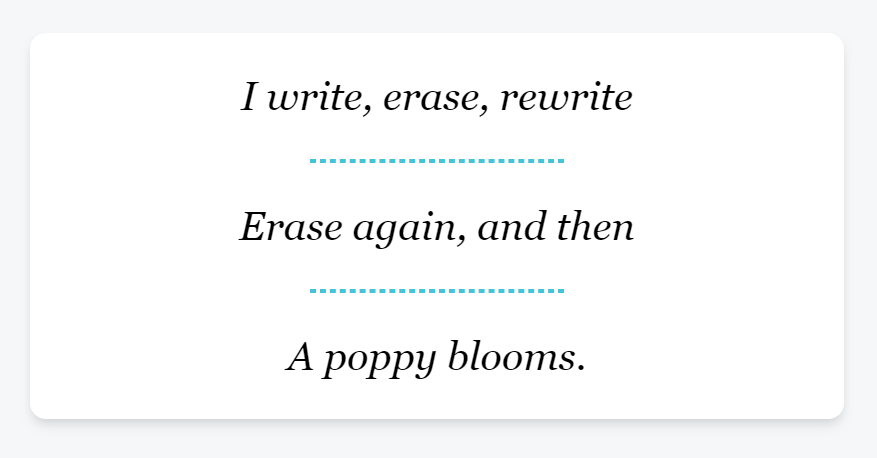

### 2.8 Keeping Components Pure

a function with the following characteristics:

- **It minds its own business.** It does not change any objects or variables that existed before it was called. 没有副作用
- **Same inputs, same output.** Given the same inputs, a pure function should always return the same result. 同一输入同一输出

**React assumes that every component you write is a pure function**

each component should only “think for itself”, and not attempt to coordinate with or depend upon others during rendering

组件要对自己负责，不要依赖组件之外的数据进行渲染

Rendering can happen at any time, so components should not depend on each others’ rendering sequence

React并不保证组件函数会以任何特定的顺序执行，所以不能通过设置变量在组件之间进行交流

```jsx
let guest = 0;
function Cup() {
  // Bad: changing a preexisting variable!
  guest = guest + 1;
  return <h2>Tea cup for guest #{guest}</h2>;
}
export default function TeaSet() {
  return (
    <>
      <Cup />
      <Cup />
    </>
  );
}

// good
function Cup({ guest }) {
  return <h2>Tea cup for guest #{guest}</h2>;
}

export default function TeaSet() {
  return (
    <>
      <Cup guest={1} />
      <Cup guest={2} />
    </>
  );
}
```

You should not mutate any of the **inputs** that your components use for rendering. That includes props, state, and context. To update the screen, [“set” state](https://react.dev/learn/state-a-components-memory) instead of mutating preexisting objects.

不要改变传入子组件的props

```jsx
export default function StoryTray({ stories }) {
  stories.push({
    id: 'create',
    label: 'Create Story'
  });

  return (
    <ul>
      {stories.map(story => (
        <li key={story.id}>
          {story.label}
        </li>
      ))}
    </ul>
  );
}

// solution 1
export default function StoryTray({ stories }) {
  return (
    <ul>
      {stories.map(story => (
        <li key={story.id}>
          {story.label}
        </li>
      ))}
      <li>Create Story</li>
    </ul>
  );
}

// solution 2
export default function StoryTray({ stories }) {
  stories.push({
    id: 'create',
    label: 'Create Story'
  });

  return (
    <ul>
      {stories.map(story => (
        <li key={story.id}>
          {story.label}
        </li>
      ))}
    </ul>
  );
}
```

In React, **side effects usually belong inside [event handlers.](https://react.dev/learn/responding-to-events)** Event handlers are functions that React runs when you perform some action—for example, when you click a button. Even though event handlers are defined *inside* your component, they don’t run *during* rendering! **So event handlers don’t need to be pure.**

事件处理函数不在render时候运行，不是纯函数不影响

If you’ve exhausted all other options and can’t find the right event handler for your side effect, you can still attach it to your returned JSX with a [`useEffect`](https://react.dev/reference/react/useEffect) call in your component. This tells React to execute it later, after rendering, when side effects are allowed. **However, this approach should be your last resort.**

可以在useEffect写副作用

纯函数优点

- This is safe because pure functions always return the same results, so they are safe to cache 可以放心使用缓存
- Purity makes it safe to stop calculating at any time 可以随时终止

## 3 Adding Interactivity

### 3.1 Responding to Events

```jsx
export default function Button() {
  function handleClick() {
    alert('You clicked me!');
  }

  return (
    <button onClick={handleClick}>
      Click me
    </button>
  );
}

<button onClick={function handleClick() {
  alert('You clicked me!');
}}>

<button onClick={() => {
  alert('You clicked me!');
}}>
```

All events propagate in React except `onScroll`, which only works on the JSX tag you attach it to

点击按钮会触发`div`的`onClick`方法

```jsx
export default function Toolbar() {
  return (
    <div className="Toolbar" onClick={() => {
      alert('You clicked on the toolbar!');
    }}>
      <button onClick={() => alert('Playing!')}>
        Play Movie
      </button>
      <button onClick={() => alert('Uploading!')}>
        Upload Image
      </button>
    </div>
  );
}

// 阻止冒泡
// Event handlers receive an event object as their only argument 事件处理函数接受event object作为参数
function Button({ onClick, children }) {
  return (
    <button onClick={e => {
      e.stopPropagation();
      onClick();
    }}>
      {children}
    </button>
  );
}

export default function Toolbar() {
  return (
    <div className="Toolbar" onClick={() => {
      alert('You clicked on the toolbar!');
    }}>
      <Button onClick={() => alert('Playing!')}>
        Play Movie
      </Button>
      <Button onClick={() => alert('Uploading!')}>
        Upload Image
      </Button>
    </div>
  );
}

```

捕捉调用

Each event propagates in three phases:

1. It travels down, calling all `onClickCapture` handlers.
2. It runs the clicked element’s `onClick` handler.
3. It travels upwards, calling all `onClick` handlers.

```jsx
<div onClickCapture={() => { /* this runs first */ }}>
  <button onClick={e => e.stopPropagation()} />
  <button onClick={e => e.stopPropagation()} />
</div>
```

- [`e.stopPropagation()`](https://developer.mozilla.org/docs/Web/API/Event/stopPropagation) stops the event handlers attached to the tags above from firing. 阻止冒泡
- [`e.preventDefault()` ](https://developer.mozilla.org/docs/Web/API/Event/preventDefault)prevents the default browser behavior for the few events that have it. 阻止浏览器默认行为

Unlike rendering functions, event handlers don’t need to be [pure](https://react.dev/learn/keeping-components-pure), so it’s a great place to *change* something

### 3.2 State: A Component's Memory

The [`useState`](https://react.dev/reference/react/useState) Hook provides those two things:

1. A **state variable** to retain the data between renders.
2. A **state setter function** to update the variable and trigger React to render the component again.

happens in action

1. **Your component renders the first time.** Because you passed `0` to `useState` as the initial value for `index`, it will return `[0, setIndex]`. React remembers `0` is the latest state value.
2. **You update the state.** When a user clicks the button, it calls `setIndex(index + 1)`. `index` is `0`, so it’s `setIndex(1)`. This tells React to remember `index` is `1` now and ==triggers== another render.
3. **Your component’s second render.** React still sees `useState(0)`, but because React *remembers* that you set `index` to `1`, it returns `[1, setIndex]` instead.
4. And so on!

State is isolated and private 

- State is not tied to a particular function call or a place in the code, but it’s “local” to the specific place on the screen. 

- state is fully private to the component declaring it. state是私有的，父组件不能影响

**Hooks—functions starting with `use`—can only be called at the top level of your components or [your own Hooks.](https://react.dev/learn/reusing-logic-with-custom-hooks)**

在顶层调用hook

### 3.3 Render and Commit

This process of requesting and serving UI has three steps:

1. **Triggering** a render (delivering the guest’s order to the kitchen)
2. **Rendering** the component (preparing the order in the kitchen)
3. **Committing** to the DOM (placing the order on the table)

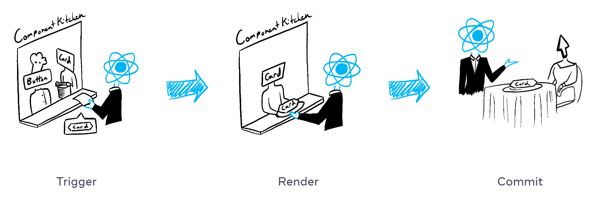

**Step 1: ReactTrigger a render**

There are two reasons for a component to render:

1. It’s the component’s **initial render.**
2. The component’s (or one of its ancestors’) **state has been updated.** Updating your component’s state automatically queues a render.

**Step 2: React renders your components**

**“Rendering” is React calling your components.** This process is ==recursive==: if the updated component returns some other component, React will render *that* component next.

- **On initial render,** React will call the root component.
- **For subsequent renders,** React will call the function component whose state update triggered the render.

Rendering就是react调用触发更新的组件，然后渲染到屏幕。这个过程是递归的，触发更新的组件返回子组件，子组件也会被调用。

**Step 3: Committing**

React will modify the DOM.

- **For the initial render,** React will use the [`appendChild()`](https://developer.mozilla.org/docs/Web/API/Node/appendChild) DOM API to put all the DOM nodes it has created on screen.
- **For re-renders,** React will apply the minimal necessary operations (calculated while rendering!) to make the DOM match the latest rendering output.

**React does not touch the DOM if the rendering result is the same as last time**

React only updates the content of `<h1>` with the new `time`. It sees that the `<input>` appears in the JSX in the same place as last time, so React doesn’t touch the `<input>`—or its `value`!

如果节点没有改变，react不会改变真实dom

```jsx
export default function Clock({ time }) {
  return (
    <>
      <h1>{time}</h1>
      <input />
    </>
  );
}
```

**Step 4: Browser paint** 


### 3.4 State as a Snapshot

Setting state requests a new render

改变state会触发渲染

When you call `useState`, React gives you a snapshot of the state *for that render*

使用useState，react返回state快照，即setState(state+ 1)，state就是一个快照，state不会立刻改变

Setting it does not change the state variable you already have, but instead triggers a re-render

改变state不是立刻起效的，在页面重新渲染后起效

When React re-renders a component:

1. React calls your function again
2. Your function returns a new JSX snapshot （调用函数组件，此时state使用setState后更新的值）
3. React then updates the screen to match the snapshot you’ve returned

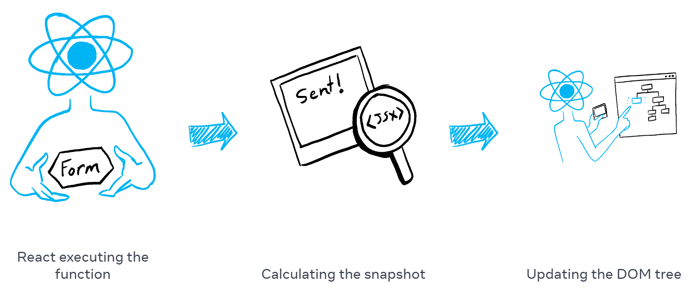

State actually “lives” in React itself—as if on a shelf—**outside of your function**

state独立于函数式组件，由react负责更新，更新完之后传递给函数式组件

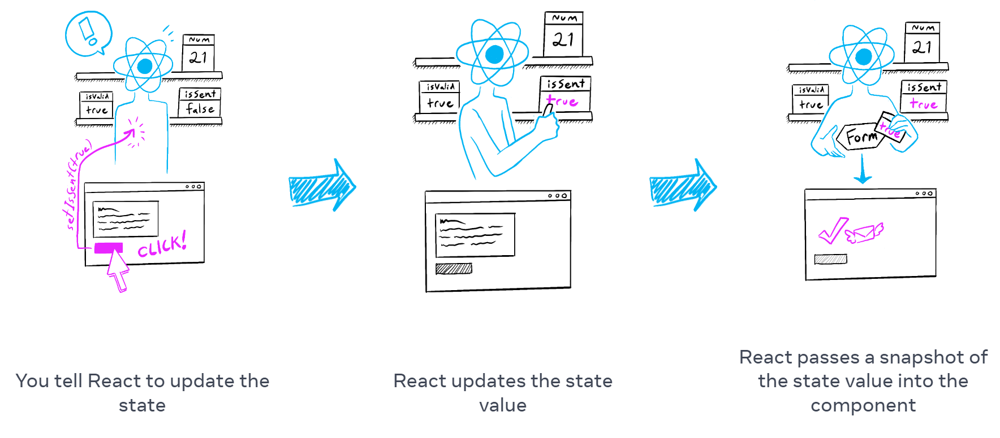

Setting state only changes it for the next render

```jsx
<button onClick={() => {
  // in this render’s event handler number is always 0
  setNumber(number + 1); // number is 0 so setNumber(0 + 1)
  setNumber(number + 1); // number is 0 so setNumber(0 + 1)
  setNumber(number + 1);b // number is 0 so setNumber(0 + 1)
}}>+3</button>
```

The state stored in React may have changed by the time the alert runs, but it was scheduled using a snapshot of the state at the time the user interacted with it

setTimeout等异步调用中使用旧的state

Variables and event handlers don’t “survive” re-renders. Every render has its own event handlers. Every render (and functions inside it) will always “see” the snapshot of the state that React gave to *that* render. Event handlers created in the past have the state values from the render in which they were created

state改变触发更新，调用事件处理函数，setTimeout放入事件循环队列，使用旧state，直到事件处理函数调用完毕，进行render，**render过程中更新state**，react将更新后的值渲染到页面，函数组件才可以拿到最新的state

```jsx
export default function Counter() {
  const [number, setNumber] = useState(0);
  return (
    <>
      <h1>{number}</h1>
      <button onClick={() => {
        setNumber(number + 5); // setNumber(0 + 5);
        setTimeout(() => {
          alert(number); // alert(0);
        }, 3000);
      }}>+5</button>
    </>
  )
}
```

### 3.5 Queueing a Series of State Updates

This lets you update multiple state variables—even from multiple components—without triggering too many [re-renders](https://react.dev/learn/render-and-commit#re-renders-when-state-updates)

在一次事件处理函数中调用多次setState，react最终会更新最后一次setState

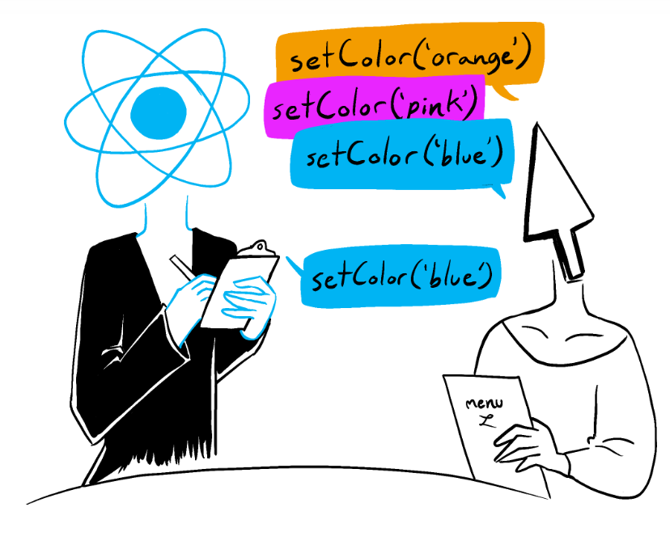

**React does not batch across *multiple* intentional events like clicks**—each click is handled separately

点击两次按钮，react会依次处理，如果第一次提交禁用表单后，第二次就不会再提交了

instead of passing the *next state value* like `setNumber(number + 1)`, you can pass a *function* that calculates the next state based on the previous one in the queue, like `setNumber(n => n + 1)`. It is a way to tell React to “do something with the state value” instead of just replacing it

如果想在处理函数中多次更新state，可以传递函数而不是值，这样可以告诉react处理，而不仅仅是替换

```jsx
<button onClick={() => {
    setNumber(n => n + 1); // n => n + 1 is called an updater function
    setNumber(n => n + 1);
    setNumber(n => n + 1);
}}>+3</button>

export function getFinalState(baseState, queue) {
  let finalState = baseState;
  for (let update of queue) {
    if (typeof update === 'function') {
      // Apply the updater function.
      finalState = update(finalState);
    } else {
      // Replace the next state.
      finalState = update;
    }
  }
  return finalState;
}
```

passing to the `setNumber` state setter:

- **An updater function** (e.g. `n => n + 1`) gets added to the queue.
- **Any other value** (e.g. number `5`) adds “replace with `5`” to the queue, **ignoring what’s already queued.**

```jsx
<button onClick={() => {
    setNumber(number + 5);
    setNumber(n => n + 1);
    setNumber(42);
  }}>Increase the number</button>
</>
```

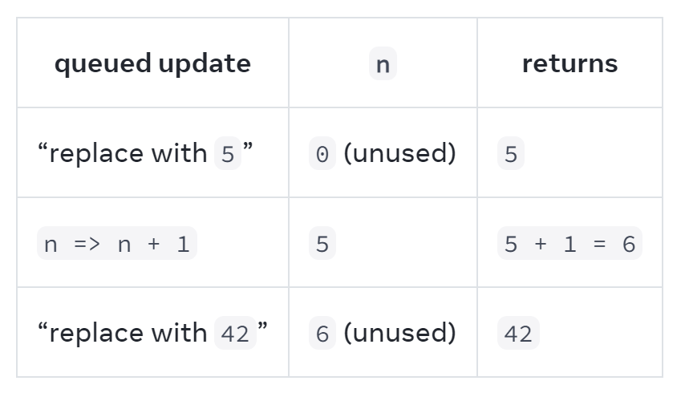

After the event handler completes, React will trigger a re-render. During the re-render, React will process the queue. **Updater functions run during rendering**, so **updater functions must be [pure](https://react.dev/learn/keeping-components-pure)** and only *return* the result

传递给setState的函数必须是纯函数

```js
 async function handleClick() {
    setPending(p => p + 1); // 会触发更新页面
    await delay(3000);
    setPending(p => p - 1); // 第二次更新页面
    setCompleted(c => c + 1);
}
```

### 3.6 Updating Objects in State

Treat state as read-only 

Copying objects with the spread syntax

```js
setPerson({
  ...person, // Copy the old fields
  firstName: e.target.value // But override this one
});
```

Updating a nested object 

```js
const [person, setPerson] = useState({
  name: 'Niki de Saint Phalle',
  artwork: {
    title: 'Blue Nana',
    city: 'Hamburg',
    image: 'https://i.imgur.com/Sd1AgUOm.jpg',
  }
});

setPerson({
  ...person, // Copy other fields
  artwork: { // but replace the artwork
    ...person.artwork, // with the same one
    city: 'New Delhi' // but in New Delhi!
  }
});

const nextArtwork = { ...person.artwork, city: 'New Delhi' };
const nextPerson = { ...person, artwork: nextArtwork };
setPerson(nextPerson);
```

there is no such thing as a “nested” object. You are really looking at two different objects

```js
let obj = {
  name: 'Niki de Saint Phalle',
  artwork: {
    title: 'Blue Nana',
    city: 'Hamburg',
    image: 'https://i.imgur.com/Sd1AgUOm.jpg',
  }
};

// 其实是两个对象
let obj1 = {
  title: 'Blue Nana',
  city: 'Hamburg',
  image: 'https://i.imgur.com/Sd1AgUOm.jpg',
};

let obj2 = {
  name: 'Niki de Saint Phalle',
  artwork: obj1
};

// If you were to mutate obj3.artwork.city, it would affect both obj2.artwork.city and obj1.city. This is because obj3.artwork, obj2.artwork, and obj1 are the same object
let obj3 = {
  name: 'Copycat',
  artwork: obj1
};
```

Write concise update logic with Immer 

```jsx
import { useImmer } from 'use-immer';

export default function Form() {
  const [person, updatePerson] = useImmer({
    name: 'Niki de Saint Phalle',
    artwork: {
      title: 'Blue Nana',
      city: 'Hamburg',
      image: 'https://i.imgur.com/Sd1AgUOm.jpg',
    }
  });

  function handleNameChange(e) {
    updatePerson(draft => {
      draft.name = e.target.value;
    });
  }

  return (<label>
    Name:
    <input
      value={person.name}
      onChange={handleNameChange}
    />
  </label>);
}
```

### 3.7 Updating Arrays in State

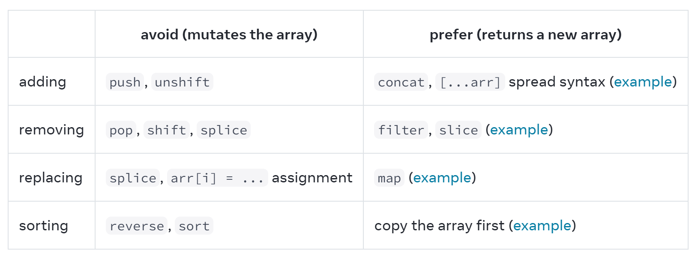

Updating objects inside arrays 

```jsx
const initialList = [
  { id: 0, title: 'Big Bellies', seen: false },
  { id: 1, title: 'Lunar Landscape', seen: false },
];
const [myList, setMyList] = useState(initialList);
function handleToggleMyList(artworkId, nextSeen) {
    const myNextList = [...myList];
    const artwork = myNextList.find(
      a => a.id === artworkId
    );
    artwork.seen = nextSeen; // Problem: mutates an existing item
    setMyList(myNextList);
}

//使用map新建数组
setMyList(myList.map(artwork => {
  if (artwork.id === artworkId) {
    // Create a *new* object with changes
    return { ...artwork, seen: nextSeen };
  } else {
    // No changes
    return artwork;
  }
}));

// 使用Immer
const [myList, updateMyList] = useImmer(initialList);
function handleToggleMyList(id, nextSeen) {
    updateMyList(draft => {
      const artwork = draft.find(a =>
        a.id === id
      );
      artwork.seen = nextSeen;
    });
}
```

## 4 Managing State

### 4.1 Reacting to Input with State

describe the different states that your component can be in, and switch between them in response to the user input

不是在不同情况下直接操控dom，用state描述不同情况下的表现

Declarative programming means describing the UI for each visual state rather than micromanaging the UI (imperative).

1. **Identify** your component’s different visual states

   you need to visualize all the different “states” of the UI the user might see:

   - **Empty**: Form has a disabled “Submit” button.
   - **Typing**: Form has an enabled “Submit” button.
   - **Submitting**: Form is completely disabled. Spinner is shown.
   - **Success**: “Thank you” message is shown instead of a form.
   - **Error**: Same as Typing state, but with an extra error message.

   ```jsx
   export default function Form({ status }) {
     if (status === 'success') {
       return <h1>That's right!</h1>
     }
     return (
       <form>
         <textarea disabled={
           status === 'submitting'
         } />
         <br />
         <button disabled={
           status === 'empty' ||
           status === 'submitting'
         }>
           Submit
         </button>
         {status === 'error' &&
           <p className="Error">
             Good guess but a wrong answer. Try again!
           </p>
         }
       </form>
     );
   }
   ```

   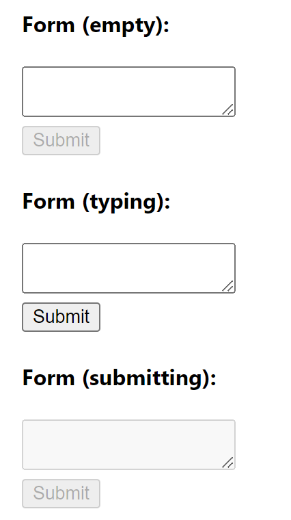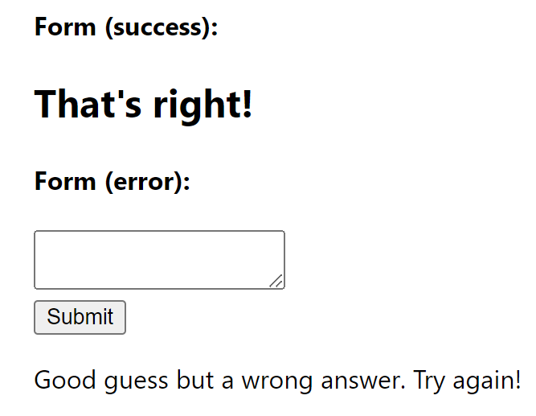

2. **Determine** what triggers those state changes

   You can trigger state updates in response to two kinds of inputs:

   - **Human inputs,** like clicking a button, typing in a field, navigating a link. human inputs often require [event handlers](https://react.dev/learn/responding-to-events)!
   - **Computer inputs,** like a network response arriving, a timeout completing, an image loading.

   In both cases, **you must set [state variables](https://react.dev/learn/state-a-components-memory#anatomy-of-usestate) to update the UI.** For the form you’re developing, you will need to change state in response to a few different inputs:

   - **Changing the text input** (human) should switch it from the *Empty* state to the *Typing* state or back, depending on whether the text box is empty or not.
   - **Clicking the Submit button** (human) should switch it to the *Submitting* state.
   - **Successful network response** (computer) should switch it to the *Success* state.
   - **Failed network response** (computer) should switch it to the *Error* state with the matching error message.

   To help visualize this flow, try drawing each state on paper as a labeled circle, and each change between two states as an arrow. 

   箭头是触发事件，圆圈是state

   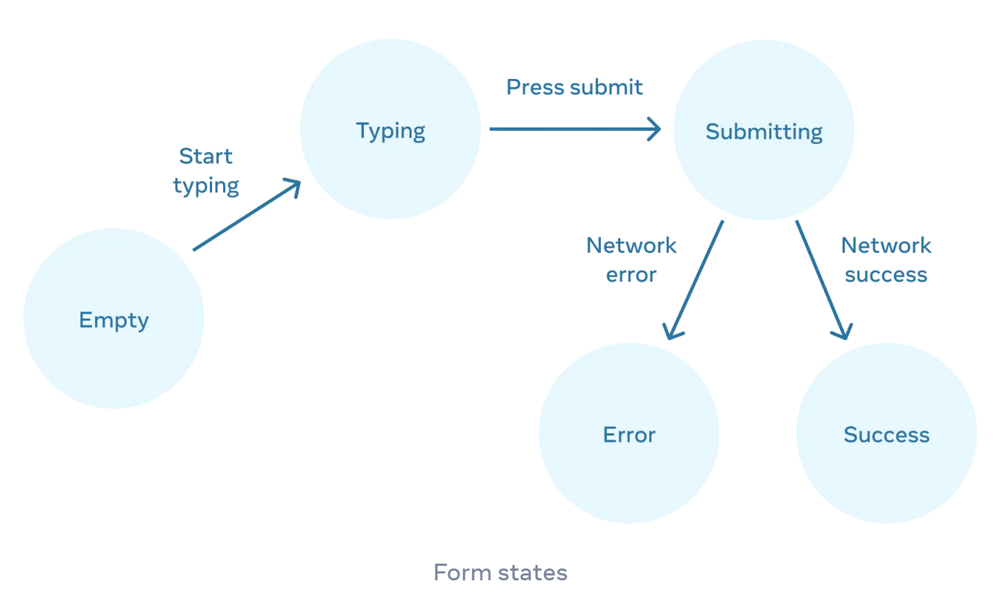

3. **Represent** the state in memory using `useState`

   ```js
   // absolutely must
   const [answer, setAnswer] = useState(''); // input
   const [error, setError] = useState(null); // last error
   
   const [isEmpty, setIsEmpty] = useState(true);``
   const [isTyping, setIsTyping] = useState(false);
   const [isSubmitting, setIsSubmitting] = useState(false);
   const [isSuccess, setIsSuccess] = useState(false);
   const [isError, setIsError] = useState(false);
   ```

4. **Remove** any non-essential state variables

   Here are some questions you can ask about your state variables:

   - **Does this state cause a paradox** 

      `isTyping` and `isSubmitting` can’t both be `true`. A paradox usually means that **the state is not constrained enough**. There are four possible combinations of two booleans, but only three correspond to valid states. To remove the “impossible” state, you **can combine these into a `status`** that must be one of three values: `'typing'`, `'submitting'`, or `'success'`.

   - **Is the same information available in another state variable already** 

     `isEmpty` and `isTyping` can’t be `true` at the same time. By making them separate state variables, you risk them going out of sync and causing bugs. Fortunately, you can remove `isEmpty` and instead check `answer.length === 0`.

   - **Can you get the same information from the inverse of another state variable** 

     `isError` is not needed because you can check `error !== null` instead.

   ```js
   const [answer, setAnswer] = useState('');
   const [error, setError] = useState(null);
   const [status, setStatus] = useState('typing'); // 'typing', 'submitting', or 'success'
   ```

5. **Connect** the event handlers to set the state

   ```jsx
   function handleTextareaChange(e) {
   	setAnswer(e.target.value);
   }
   
   async function handleSubmit(e) {
       e.preventDefault();
       setStatus('submitting');
       try {
         await submitForm(answer);
         setStatus('success');
       } catch (err) {
         setStatus('typing');
         setError(err);
       }
   }
   
   function submitForm(answer) {
     // Pretend it's hitting the network.
     return new Promise((resolve, reject) => {
       setTimeout(() => {
         let shouldError = answer.toLowerCase() !== 'lima'
         if (shouldError) {
           reject(new Error('Good guess but a wrong answer. Try again!'));
         } else {
           resolve();
         }
       }, 1500);
     });
   }
   ```

好处

Expressing all interactions as state changes lets you later introduce new visual states without breaking existing ones. It also lets you change what should be displayed in each state without changing the logic of the interaction itself.

### 4.2 Reacting to Input with State

**“Make your state as simple as it can be—but no simpler.”**

1. **Group related state.** If you always update two or more state variables at the same time, consider merging them into a single state variable.

   ```jsx
   const [x, setX] = useState(0);
   const [y, setY] = useState(0);
   
   // x和y是同时变化的，可以合并两个状态
   const [position, setPosition] = useState({ x: 0, y: 0 });
   ```

2. **Avoid contradictions in state.** When the state is structured in a way that several pieces of state may contradict and “disagree” with each other, you leave room for mistakes. Try to avoid this.

   ```js
   const [isSending, setIsSending] = useState(false);
   const [isSent, setIsSent] = useState(false);
   
   // isSent和isSending不可能同时为true，可以合并
   const [status, setStatus] = useState('typing');
   const isSending = status === 'sending';
   const isSent = status === 'sent';
   ```

3. **Avoid redundant state.** If you can calculate some information from the component’s props or its existing state variables during rendering, you should not put that information into that component’s state.

   ```js
   const [firstName, setFirstName] = useState('');
   const [lastName, setLastName] = useState('');
   const [fullName, setFullName] = useState('');
   
   // 不需要fullNamestate，可以使用已有内容推算出
   //  the change handlers don’t need to do anything special to update it. When you call setFirstName or setLastName, you trigger a re-render, and then the next fullName will be calculated from the fresh data.
   const fullName = firstName + ' ' + lastName;
   ```

4. **Avoid duplication in state.** When the same data is duplicated between multiple state variables, or within nested objects, it is difficult to keep them in sync. Reduce duplication when you can.

   ```js
   const [items, setItems] = useState(initialItems);
   const [selectedItem, setSelectedItem] = useState(items[0]);
   
   // selectedItem数据已经保存在items
   const [selectedId, setSelectedId] = useState(0);
   const selectedItem = items.find(item =>
   	item.id === selectedId
   );
   ```

5. **Avoid deeply nested state.** Deeply hierarchical state is not very convenient to update. When possible, prefer to structure state in a flat way.

   ```js
   
   ```

### 4.3 Choosing the State Structure


### 4.4 Sharing State Between Components


### 4.5 Preserving and Resetting State


### 4.6 Extracting State Logic into a Reducer


### 4.7 Passing Data Deeply with Context


### 4.8 Scaling Up with Reducer and Context


## 5 Escape Hatches

### 5.1 Referencing Values with Refs


### 5.2 Manipulating the DOM with Refs


### 5.3 Synchronizing with Effects


### 5.4 You Might Not Need an Effect


### 5.5 Lifecycle of Reactive Effects


### 5.6 Separating Events from Effects


### 5.7 Removing Effect Dependencies


### 5.8 Reusing Logic with Custom Hooks

