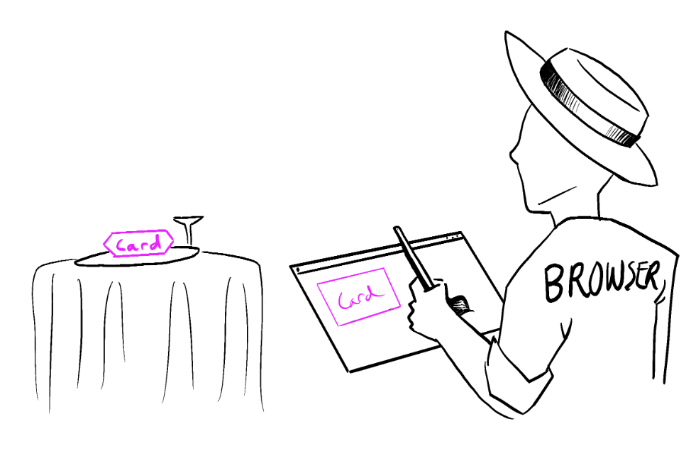

## 1 Quick Start

A component can be as small as a button, or as large as an entire page

组件可以很小到按钮，也可以很大到整个页面

React does not prescribe how you add `CSS` files

react没有规定怎么导入`css`文件，所以不是一个组件就得配置一个样式文件

```jsx
// index.js 可以在index导入App的样式文件
import React, { StrictMode } from "react";
import { createRoot } from "react-dom/client";
import "./styles.css";

import App from "./App";

const root = createRoot(document.getElementById("root"));
root.render(
  <StrictMode>
    <App />
  </StrictMode>
);

// App.js
const products = [
  { title: "Cabbage", isFruit: false, id: 1 },
  { title: "Garlic", isFruit: false, id: 2 },
  { title: "Apple", isFruit: true, id: 3 }
];

export default function ShoppingList() {
  const listItems = products.map((product) => (
    <li
      key={product.id}
      style={{
        color: product.isFruit ? "magenta" : "darkgreen"
      }}
    >
      {product.title}
    </li>
  ));
  console.log("listItems", listItems);

  return <ul>{listItems}</ul>;
}
```

If you want to use `useState` in a condition or a loop, extract a new component and put it there

如果想要在循环或者条件语句中使用hook，把hook逻辑抽象成子组件，父组件使用循环或者条件加载子组件

If you render the same component multiple times, each will get its own state

在父组件中使用两次子组件，每个子组件状态state是独立的


```jsx
import { useState } from 'react';

export default function MyApp() {
  return (
    <div>
      <h1>Counters that update separately</h1>
      <MyButton />
      <MyButton />
    </div>
  );
}

function MyButton() {
  const [count, setCount] = useState(0);

  function handleClick() {
    setCount(count + 1);
  }

  return (
    <button onClick={handleClick}>
      Clicked {count} times
    </button>
  );
}
```

The information you pass down like this is called *props*. This is called “lifting state up”. By moving state up, you’ve shared it between components

如果想要两个子组件状态state是同步的，需要把状态提升到父组件


```jsx
import { useState } from 'react';

export default function MyApp() {
  const [count, setCount] = useState(0);

  function handleClick() {
    setCount(count + 1);
  }

  return (
    <div>
      <h1>Counters that update together</h1>
      <MyButton count={count} onClick={handleClick} />
      <MyButton count={count} onClick={handleClick} />
    </div>
  );
}

function MyButton({ count, onClick }) {
  return (
    <button onClick={onClick}>
      Clicked {count} times
    </button>
  );
}
```

## 2 Describing the `UI`

### 2.1 Your First Component

your markup isn’t all on the same line as the `return` keyword, you must wrap it in a pair of parentheses

函数组件一行不能返回，需要包在小括号里面

tatements are affected by the automatic semicolon insertion (also known as ASI for brevity):

受自动分号影响的语法

- empty statement
- `var` statement
- expression statement
- `do-while` statement
- `continue` statement
- `break` statement
- `return` statement
- `throw` statement

browser sees

```jsx
function Profile() {
  return (
    
  );
}

export default function Gallery() {
  return (
    <section>
      <h1>Amazing scientists</h1>
      <Profile />
      <Profile />
      <Profile />
    </section>
  );
}

<section>
  <h1>Amazing scientists</h1>
  
  
  
</section>
```

The `Profile` components are rendered inside `Gallery`—even several times

### 2.2 Importing and Exporting Components

A file can have no more than one default export, but it can have as many named exports as you like

一个文件中只能由一个default export，可以有多个export


People often use default exports if the file exports only one component, and use named exports if it exports multiple components and values

To reduce the potential confusion between default and named exports, some teams choose to only stick to one style (default or named), or avoid mixing them in a single file

避免在一个文件中使用两种风格

### 2.3 Writing Markup with JSX

But as the Web became more interactive, logic increasingly determined content. JavaScript was in charge of the HTML! This is why **in React, rendering logic and markup live together in the same place—components**

现代web应用有更多的交互，js会负责html的展示

The Rules of JSX
1. Return a single root element 

   This empty tag `<></>` is called a Fragment. Fragments let you group things without leaving any trace in the browser HTML tree

   空标只是帮助组织代码，不会在浏览器中增加dom

   JSX looks like HTML, but under the hood it is transformed into plain JavaScript objects. You can’t return two objects from a function without wrapping them into an array

   函数组件必须返回一个根元素，就像函数不能返回两个对象，需要把两个对象放在数组里面

2. Close all the tags 

3. has limitations on variable names

   can’t contain dashes or be reserved words like `class`

   JSX turns into JavaScript and attributes written in JSX become keys of JavaScript objects. 

   ```js
   const el = document.getElementById("item");
   el.className = el.className === "active" ? "inactive" : "active";
   ```

   jsx最终被转换成js，html上的一些属性名，有破折号（stroke-width换成strokeWidth）或关键字是不可以使用的，需要别的字段替换

### 2.4 JavaScript in JSX with Curly Braces

JavaScript expression will work between curly braces, including **function** calls like `formatDate()`

jsx中使用动态属性或者在标签之间使用js逻辑，需要用大括号包裹，大括号里面还可以调用函数

```JSX
const baseUrl = 'https://i.imgur.com/';
const person = {
  name: 'Gregorio Y. Zara',
  imageId: '7vQD0fP',
  imageSize: 's',
  theme: {
    backgroundColor: 'black',
    color: 'pink'
  }
};

export default function TodoList() {
  return (
    <div style={person.theme}>
      {/* 在标签之间使用 */}
      <h1>{person.name}'s Todos</h1> 
      {/* 属性值使用引号或者大括号，``模板字符串不允许使用 */}
      
      <ul>
        <li>Improve the videophone</li>
        <li>Prepare aeronautics lectures</li>
        <li>Work on the alcohol-fuelled engine</li>
      </ul>
    </div>
  );
}
```

### 2.5 Passing Props to a Component

To pass props, add them to the JSX, just like you would with HTML attributes

传递props给子组件就像属性一样

Specifying a default value for a prop，the default value is only used if the `size` prop is missing or if you pass `size={undefined}`

```jsx
function Avatar({ person, size = 100 }) {
  // ...
}
```

Forwarding props with the JSX spread syntax 

如果父组件的所有props都要传递下去，可以使用扩展语法让代码更加整洁

```jsx
function Profile({ person, size, isSepia, thickBorder }) {
  return (
    <div className="card">
      <Avatar
        person={person}
        size={size}
        isSepia={isSepia}
        thickBorder={thickBorder}
      />
    </div>
  );
}

function Profile(props) {
  return (
    <div className="card">
      <Avatar {...props} />
    </div>
  );
}
```

Passing JSX as children 

the `Card` component below will receive a `children` prop set to `<Avatar />` and render it in a wrapper div

```jsx
function Avatar({ person, size }) {
  return (
    
  );
}

function Card({ children }) {
  return (
    <div className="card">
      {children}
    </div>
  );
}

export default function Profile() {
  return (
    <Card>
      <Avatar
        size={100}
        person={{ 
          name: 'Katsuko Saruhashi',
          imageId: 'YfeOqp2'
        }}
      />
    </Card>
    <Card>
      <h1>About</h1>
        <p>Aklilu Lemma was a distinguished Ethiopian scientist.
        </p>
    </Card>
  );
}
```


**Don’t try to “change props”.** When you need to respond to the user input (like changing the selected color), you will need to “set state”

子组件不要改变传递的props，如果要改变组件状态使用state

### 2.6 Conditional Rendering

JSX elements aren’t “instances” because they don’t hold any internal state and aren’t real DOM nodes. They’re lightweight descriptions, like blueprints. So these two examples, in fact, *are* completely equivalent

按照面向对象编程思想，下面两个返回是不一样的，但是JSX只是一种描述，不是对象实例不是真实dom，对于react两者是一样的

```jsx
function Item({ name, isPacked }) {
  if (isPacked) {
    return null;
  }
  return <li className="item">{name}</li>;
}

function Item({ name, isPacked }) {
    return (
      <li className="item">
        {isPacked ? name + ' ✔' : name}
      </li>
    );
}

function Item({ name, isPacked }) {
    return (
      <li className="item">
        {name} {isPacked && '✔'}
      </li>
    );
}
```

Conditionally returning nothing with null

如果不渲染任何内容，函数组件可以返回null，或者使用&&

**Don’t put numbers on the left side of `&&`**

```jsx
// messageCount===0，render 0
messageCount && <p>New messages</p>

// better
messageCount > 0 && <p>New messages</p>
```

Conditionally assigning JSX to a variable

```jsx
const drinks = {
  tea: {
    part: 'leaf',
    caffeine: '15–70 mg/cup',
  },
  coffee: {
    part: 'bean',
    caffeine: '80–185 mg/cup',
  }
};

function Drink({ name }) {
  const info = drinks[name];
  return (
    <section>
      <h1>{name}</h1>
      <dl>
        <dt>Part of plant</dt>
        <dd>{info.part}</dd>
        <dt>Caffeine content</dt>
        <dd>{info.caffeine}</dd>
      </dl>
    </section>
  );
}

// 另一种实现
function Drink({ name }) {
  let part, caffeine, age;
  if (name === 'tea') {
    part = 'leaf';
    caffeine = '15–70 mg/cup';
  } else if (name === 'coffee') {
    part = 'bean';
    caffeine = '80–185 mg/cup';
  }
  return (
    <section>
      <h1>{name}</h1>
      <dl>
        <dt>Part of plant</dt>
        <dd>{part}</dd>
        <dt>Caffeine content</dt>
        <dd>{caffeine}</dd>
      </dl>
    </section>
  );
}
```

### 2.7 Rendering Lists

use [`filter()`](https://developer.mozilla.org/docs/Web/JavaScript/Reference/Global_Objects/Array/filter) and [`map()`](https://developer.mozilla.org/docs/Web/JavaScript/Reference/Global_Objects/Array/map) with React to filter and transform your array of data into **an array of components**

set `key` on each component in a collection so React can keep track of each of them even if their position or data changes.

key可以用来表示组件

your components won’t receive `key` as a prop

key不是传递的props，只是react标识用

The short `<>...</>` Fragment syntax won’t let you pass a key, so you need to either group them into a single <div>, or use the slightly longer and more explicit `<Fragment>` syntax

 `<>...</>` 不能添加内容，使用`<Fragment>` 添加key

Different sources of data provide different sources of keys:

- **Data from a database:** If your data is coming from a database, you can use the database keys/IDs, which are unique by nature
- **Locally generated data:** If your data is generated and persisted locally (e.g. notes in a note-taking app), use an incrementing counter, [`crypto.randomUUID()`](https://developer.mozilla.org/en-US/docs/Web/API/Crypto/randomUUID) or a package like [`uuid`](https://www.npmjs.com/package/uuid) when creating items  使用叠加器，不要用Math.random()，不然每次render都是不一样的值

Rules of keys 

- **Keys must be unique among siblings.** However, it’s okay to use the same keys for JSX nodes in *different* arrays
- **Keys must not change** or that defeats their purpose! Don’t generate them while rendering

在`{}`中使用，箭头函数没有`{}`不用`return`

```jsx
import { recipes } from './data.js';

export default function RecipeList() {
  return (
    <div>
      <h1>Recipes</h1>
      {recipes.map(recipe =>
        <div key={recipe.id}>
          <h2>{recipe.name}</h2>
          <ul>
            {recipe.ingredients.map(ingredient =>
              <li key={ingredient}>
                {ingredient}
              </li>
            )}
          </ul>
        </div>
      )}
    </div>
  );
}
```

数组组件兄弟之间可以不一样

```jsx
const poem = {
  lines: [
    'I write, erase, rewrite',
    'Erase again, and then',
    'A poppy blooms.'
  ]
};

export default function Poem() {
  let output = [];
  // Fill the output array
  poem.lines.forEach((line, i) => {
    output.push(
      <hr key={i + '-separator'} />
    );
    output.push(
      <p key={i + '-text'}>
        {line}
      </p>
    );
  });
  // Remove the first <hr />
  output.shift();
  return (
    <article>
      {output}
    </article>
  );
}

// 另一种实现
export default function Poem() {
  return (
    <article>
      {poem.lines.map((line, i) =>
        <Fragment key={i}>
          {i > 0 && <hr />}
          <p>{line}</p>
        </Fragment>
      )}
    </article>
  );
}
```


### 2.8 Keeping Components Pure

a function with the following characteristics:

- **It minds its own business.** It does not change any objects or variables that existed before it was called. 没有副作用
- **Same inputs, same output.** Given the same inputs, a pure function should always return the same result. 同一输入同一输出

**React assumes that every component you write is a pure function**

each component should only “think for itself”, and not attempt to coordinate with or depend upon others during rendering

组件要对自己负责，不要依赖组件之外的数据进行渲染

Rendering can happen at any time, so components should not depend on each others’ rendering sequence

React并不保证组件函数会以任何特定的顺序执行，所以不能通过设置变量在组件之间进行交流

```jsx
let guest = 0;
function Cup() {
  // Bad: changing a preexisting variable!
  guest = guest + 1;
  return <h2>Tea cup for guest #{guest}</h2>;
}
export default function TeaSet() {
  return (
    <>
      <Cup />
      <Cup />
    </>
  );
}

// good
function Cup({ guest }) {
  return <h2>Tea cup for guest #{guest}</h2>;
}

export default function TeaSet() {
  return (
    <>
      <Cup guest={1} />
      <Cup guest={2} />
    </>
  );
}
```

You should not mutate any of the **inputs** that your components use for rendering. That includes props, state, and context. To update the screen, [“set” state](https://react.dev/learn/state-a-components-memory) instead of mutating preexisting objects.

不要改变传入子组件的props

```jsx
export default function StoryTray({ stories }) {
  stories.push({
    id: 'create',
    label: 'Create Story'
  });

  return (
    <ul>
      {stories.map(story => (
        <li key={story.id}>
          {story.label}
        </li>
      ))}
    </ul>
  );
}

// solution 1
export default function StoryTray({ stories }) {
  return (
    <ul>
      {stories.map(story => (
        <li key={story.id}>
          {story.label}
        </li>
      ))}
      <li>Create Story</li>
    </ul>
  );
}

// solution 2
export default function StoryTray({ stories }) {
  stories.push({
    id: 'create',
    label: 'Create Story'
  });

  return (
    <ul>
      {stories.map(story => (
        <li key={story.id}>
          {story.label}
        </li>
      ))}
    </ul>
  );
}
```

In React, **side effects usually belong inside [event handlers.](https://react.dev/learn/responding-to-events)** Event handlers are functions that React runs when you perform some action—for example, when you click a button. Even though event handlers are defined *inside* your component, they don’t run *during* rendering! **So event handlers don’t need to be pure.**

事件处理函数不在render时候运行，不是纯函数不影响

If you’ve exhausted all other options and can’t find the right event handler for your side effect, you can still attach it to your returned JSX with a [`useEffect`](https://react.dev/reference/react/useEffect) call in your component. This tells React to execute it later, after rendering, when side effects are allowed. **However, this approach should be your last resort.**

可以在useEffect写副作用

纯函数优点

- This is safe because pure functions always return the same results, so they are safe to cache 可以放心使用缓存
- Purity makes it safe to stop calculating at any time 可以随时终止

## 3 Adding Interactivity

### 3.1 Responding to Events

```jsx
export default function Button() {
  function handleClick() {
    alert('You clicked me!');
  }

  return (
    <button onClick={handleClick}>
      Click me
    </button>
  );
}

<button onClick={function handleClick() {
  alert('You clicked me!');
}}>

<button onClick={() => {
  alert('You clicked me!');
}}>
```

All events propagate in React except `onScroll`, which only works on the JSX tag you attach it to

点击按钮会触发`div`的`onClick`方法

```jsx
export default function Toolbar() {
  return (
    <div className="Toolbar" onClick={() => {
      alert('You clicked on the toolbar!');
    }}>
      <button onClick={() => alert('Playing!')}>
        Play Movie
      </button>
      <button onClick={() => alert('Uploading!')}>
        Upload Image
      </button>
    </div>
  );
}

// 阻止冒泡
// Event handlers receive an event object as their only argument 事件处理函数接受event object作为参数
function Button({ onClick, children }) {
  return (
    <button onClick={e => {
      e.stopPropagation();
      onClick();
    }}>
      {children}
    </button>
  );
}

export default function Toolbar() {
  return (
    <div className="Toolbar" onClick={() => {
      alert('You clicked on the toolbar!');
    }}>
      <Button onClick={() => alert('Playing!')}>
        Play Movie
      </Button>
      <Button onClick={() => alert('Uploading!')}>
        Upload Image
      </Button>
    </div>
  );
}

```

捕捉调用

Each event propagates in three phases:

1. It travels down, calling all `onClickCapture` handlers.
2. It runs the clicked element’s `onClick` handler.
3. It travels upwards, calling all `onClick` handlers.

```jsx
<div onClickCapture={() => { /* this runs first */ }}>
  <button onClick={e => e.stopPropagation()} />
  <button onClick={e => e.stopPropagation()} />
</div>
```

- [`e.stopPropagation()`](https://developer.mozilla.org/docs/Web/API/Event/stopPropagation) stops the event handlers attached to the tags above from firing. 阻止冒泡
- [`e.preventDefault()` ](https://developer.mozilla.org/docs/Web/API/Event/preventDefault)prevents the default browser behavior for the few events that have it. 阻止浏览器默认行为

Unlike rendering functions, event handlers don’t need to be [pure](https://react.dev/learn/keeping-components-pure), so it’s a great place to *change* something

### 3.2 State: A Component's Memory

The [`useState`](https://react.dev/reference/react/useState) Hook provides those two things:

1. A **state variable** to retain the data between renders.
2. A **state setter function** to update the variable and trigger React to render the component again.

happens in action

1. **Your component renders the first time.** Because you passed `0` to `useState` as the initial value for `index`, it will return `[0, setIndex]`. React remembers `0` is the latest state value.
2. **You update the state.** When a user clicks the button, it calls `setIndex(index + 1)`. `index` is `0`, so it’s `setIndex(1)`. This tells React to remember `index` is `1` now and ==triggers== another render.
3. **Your component’s second render.** React still sees `useState(0)`, but because React *remembers* that you set `index` to `1`, it returns `[1, setIndex]` instead.
4. And so on!

State is isolated and private 

- State is not tied to a particular function call or a place in the code, but it’s “local” to the specific place on the screen. 

- state is fully private to the component declaring it. state是私有的，父组件不能影响

**Hooks—functions starting with `use`—can only be called at the top level of your components or [your own Hooks.](https://react.dev/learn/reusing-logic-with-custom-hooks)**

在顶层调用hook

### 3.3 Render and Commit

This process of requesting and serving UI has three steps:

1. **Triggering** a render (delivering the guest’s order to the kitchen)
2. **Rendering** the component (preparing the order in the kitchen)
3. **Committing** to the DOM (placing the order on the table)


**Step 1: ReactTrigger a render**

There are two reasons for a component to render:

1. It’s the component’s **initial render.**
2. The component’s (or one of its ancestors’) **state has been updated.** Updating your component’s state automatically queues a render.

**Step 2: React renders your components**

**“Rendering” is React calling your components.** This process is ==recursive==: if the updated component returns some other component, React will render *that* component next.

- **On initial render,** React will call the root component.
- **For subsequent renders,** React will call the function component whose state update triggered the render.

Rendering就是react调用触发更新的组件，然后渲染到屏幕。这个过程是递归的，触发更新的组件返回子组件，子组件也会被调用。

**Step 3: Committing**

React will modify the DOM.

- **For the initial render,** React will use the [`appendChild()`](https://developer.mozilla.org/docs/Web/API/Node/appendChild) DOM API to put all the DOM nodes it has created on screen.
- **For re-renders,** React will apply the minimal necessary operations (calculated while rendering!) to make the DOM match the latest rendering output.

**React does not touch the DOM if the rendering result is the same as last time**

React only updates the content of `<h1>` with the new `time`. It sees that the `<input>` appears in the JSX in the same place as last time, so React doesn’t touch the `<input>`—or its `value`!

如果节点没有改变，react不会改变真实dom

```jsx
export default function Clock({ time }) {
  return (
    <>
      <h1>{time}</h1>
      <input />
    </>
  );
}
```

**Step 4: Browser paint** 



### 3.4 State as a Snapshot

Setting it does not change the state variable you already have, but instead triggers a re-render.

改变state不是立刻起效的，在页面重新渲染后起效

When React re-renders a component:

1. React calls your function again.
2. Your function returns a new JSX snapshot.
3. React then updates the screen to match the snapshot you’ve returned.


State actually “lives” in React itself—as if on a shelf!—outside of your function.


### 3.5 Queueing a Series of State Updates


### 3.6 Updating Objects in State


### 3.7 Updating Arrays in State


## 4 Managing State


## 5 Escape Hatches


## 6 Built-in React Hooks

State Hooks 

- [`useState`](https://react.dev/reference/react/useState) declares a state variable that you can update directly.

- [`useReducer`](https://react.dev/reference/react/useReducer) declares a state variable with the update logic inside a [reducer function.](https://react.dev/learn/extracting-state-logic-into-a-reducer)

Context Hooks 


Ref Hooks 


Effect Hooks 


Performance Hooks 


Other Hooks 


Your own Hooks 