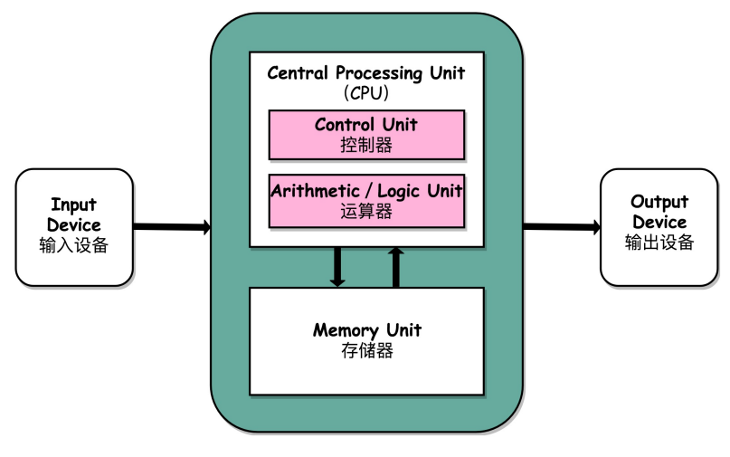
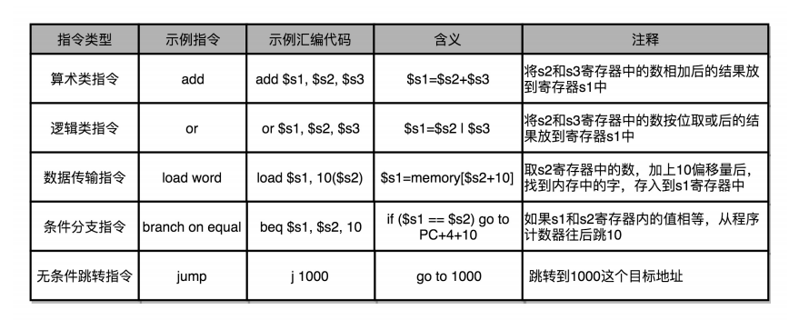
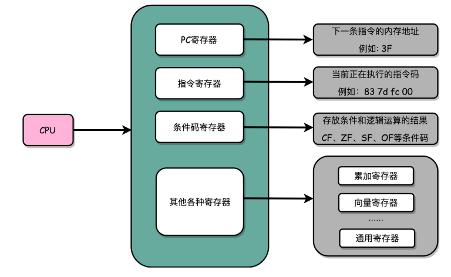

**计算机体系结构**是指那些能够被程序员所见到的计算机系统的属性，即概念性的结构与功能特性。 计算机系统的属性通常是指用机器语言编程的程序员所看到的传统机器的属性，包括指令集、数据类型、存储器寻址技术、I/O机理等，大都属于抽象的属性。由于计算机系统具有多级层次结构，因此，站在不同层次上编程的程序员所看到的计算机属性页是各不相同的。

**计算机组成**是指如何实现计算机体系结构所体现的属性，它包含了许多对程序员来说是透明的硬件细节。 例如，指令系统体现了机器的属性，这是属于计算机结构的问题。但指令的实现，即如何取指令、分析指令、取操作数、运算、送结果等，这些属于计算机组成的问题。例如，一台机器是否具备乘法指令的功能，这是一个结构的问题，可是，实现乘法指令采用什么方式，则是一个组成问题。 简单来说，计算机体系结构讲的是计算机有哪些功能，是抽象的; 计算机组成原理讲的是计算机功能是如何实现的，是具体的。

**学习组成原理**

- 学习控制器、运算器的工作原理，也就是 CPU 是怎么工作的，以及为何这样设计；
- 学习内存的工作原理，从最基本的电路，到上层抽象给到CPU 乃至应用程序的接口是怎样的；
- 学习 CPU 是怎么和输入设备、输出设备打交道的。
- 在理解从控制器、运算器、存储器、输入设备以及输出设备，从电路这样的硬件，到最终开放给软件的接口，是怎么运作的，为什么要设计成这样，以及在软件开发层面怎么尽可能用好它。

计算机的基本组成

- 学习计算机是由哪些硬件组成的。这些硬件，又是怎么对应到经典的冯·诺依曼体系结构中的，也就是运算器、控制器、存储器、输入设备和输出设备这五大基本组件。
- 还需要了解计算机的两个核心指标，性能和功耗。性能和功耗也是我们在应用和设计五大基本组件中需要重点考虑的因素。

计算机的指令和计算：

- 在计算机指令部分，需要搞明白 C、Java、PHP 程序，是怎么在计算机里面跑起来的。这里面，你既需要了解我们的程序是怎么通过编译器和汇编器，变成一条条机器指令这样的编译过程（如果把编译过程展开的话，可以变成一门完整的**编译原理**课程），还需要知道我们的操作系统是怎么链接、装载、执行这些程序的（这部分知识如果再深入学习，又可以变成一门**操作系统**课程）。而这一条条指令执行的控制过程，就是由计算机五大组件之一的控制器来控制的。
- 在计算机的计算部分，你要从二进制和编码开始，理解我们的数据在计算机里的表示，以及我们是怎么从数字电路层面，实现加法、乘法这些基本的运算功能的。实现这些运算功能的ALU（Arithmetic Logic Unit/ALU），也就是算术逻辑单元，其实就是我们计算机五大组件之一的运算器。

处理器设计：

- 明白为什么需要 CPU 时钟（CPU Clock），以及寄存器和内存是用什么样的硬件组成的之后，我们可以再来看看，整个计算机的数据通路是如何构造出来的。
- 数据通路，其实就是连接了整个运算器和控制器，并最终组成了 CPU。而出于对于性能和功耗的考虑，你要进一步理解和掌握面向流水线设计的 CPU、数据和控制冒险，以及分支预测的相关技术。
- 既然 CPU 作为控制器要和输入输出设备通信，那么我们就要知道异常和中断发生的机制。在 CPU 设计部分的最后，我会讲一讲指令的并行执行，看看如何直接在 CPU 层面，通过SIMD 来支持并行计算。

存储器和 I/O 设备：

- 通过存储器的层次结构作为基础的框架引导，需要掌握从上到下的 CPU 高速缓存、内存、SSD 硬盘和机械硬盘的工作原理，它们之间的性能差异，以及实际应用中利用这些设备会遇到的挑战。存储器其实很多时候又扮演了输入输出设备的角色，所以你需要进一步了解，CPU 和这些存储器之间是如何进行通信的，以及我们最重视的性能问题是怎么一回事；理解什么是 IO_WAIT，如何通过 DMA 来提升程序性能。
- 对于存储器，不仅需要它们能够正常工作，还要确保里面的数据不能丢失。于是要掌握我们是如何通过 RAID、Erasure Code、ECC 以及分布式 HDFS，这些不同的技术，来确保数据的完整性和访问性能。

计算实现背后则是**“数字电路”**；如果要深入 CPU 和存储器系统的优化，必然要深入了解**“计算机体系结构”**。

**学习办法**

首先，**学会提问自己来串联知识点**。学完一个知识点之后，你可以从下面两个方面，问一下自己。

- 我写的程序，是怎样从输入的代码，变成运行的程序，并得到最终结果的？
- 整个过程中，计算器层面到底经历了哪些步骤，有哪些地方是可以优化的？

无论是程序的编译、链接、装载和执行，以及计算时需要用到的逻辑电路、ALU，乃至CPU 自发为你做的流水线、指令级并行和分支预测，还有对应访问到的硬盘、内存，以及加载到高速缓存中的数据，这些都对应着我们学习中的一个个知识点。建议你自己脑子里过一遍，最好时口头表述一遍或者写下来，这样对你彻底掌握这些知识点都会非常有帮助。

其次，写一些示例程序来验证知识点。

最后，通过和计算机硬件发展的历史做对照。

**冯·诺依曼体系结构**

任何一台计算机的任何一个部件都可以归到运算器、控制器、存储器、输入设备和输出设备中，而所有的现代计算机也都是基于这个基础架构来设计开发的。

而所有的计算机程序，也都可以抽象为从**输入设备**读取输入信息，通过**运算器**和**控制器**来执行存储在**存储器**里的程序，最终把结果输出到**输出设备**中。而我们所有撰写的无论高级还是低级语言的程序，也都是基于这样一个抽象框架来进行运作的。

- 图灵机是一个很有意思的抽象问题，背后对应着一门<可计算性理论>的课程，其实就是告诉我们什么样的问题是计算机解决得了的，什么样的问题是解决不了的。
- lambda算子是构造图灵机表示的一个数学的形式化系统。<**计算机程序的构造与解释**>。

第一类是**算术类指令**。我们的加减乘除，在 CPU 层面，都会变成一条条算术类指令。

第二类是**数据传输类指令**。给变量赋值、在内存里读写数据，用的都是数据传输类指令。

第三类是**逻辑类指令**。逻辑上的与或非，都是这一类指令。

第四类是**条件分支类指令**。日常我们写的“if/else”，其实都是条件分支类指令。

最后一类是**无条件跳转指令**。写一些大一点的程序，我们常常需要写一些函数或者方法。在调用函数的时候，其实就是发起了一个无条件跳转指令。

CPU 其实就是由一堆寄存器组成的。而寄存器就是 CPU 内部，由多个触发器（FlipFlop）或者锁存器（Latches）组成的简单电路。

触发器和锁存器，其实就是两种不同原理的数字电路组成的逻辑门。

