### 1、执行上下文

### 1.1 变量提升

```js
showName()
console.log(myname)
var myname = 'hello'
function showName() {
    console.log('函数 showName 被执行');
}
// 因为有变量提升，不会报错
// 函数 showName 被执行
// undefined

// 等价于
// 变量提升部分
var myname = undefined
function showName() {
    console.log('showName 被调用');
}
// 可执行代码部分
showName()
console.log(myname)
myname = 'hello'
```

从概念的字面意义上来看，“变量提升”意味着变量和函数的声明会在物理层面移动到代码的最前面。

**但实际上变量和函数声明在代码里的位置是不会改变的，而且是在编译阶段被 JavaScript 引擎放入内存中**。

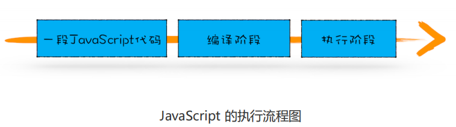

**编译阶段会产生执行上下文（Execution context）和可执行代码**。

执行上下文是 JavaScript 执行一段代码时的运行环境。

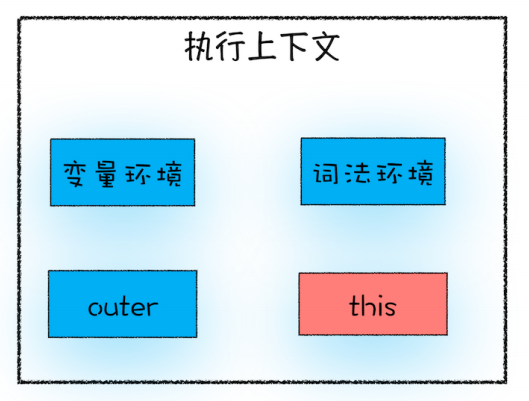

### 1.2 代码执行流程

```js
showName()
console.log(myname)
var myname = 'hello'
function showName() {
    console.log('函数 showName 被执行');
}
```

**编译阶段**

- 第 1 行和第 2 行，由于这两行代码不是声明操作，所以 JavaScript 引擎不会做任何处理。
- 第 3 行，由于这行是经过 var 声明的，因此 JavaScript 引擎将在环境对象中创建一个名为 `myname `的属性，并使用 undefined 对其初始化。
- 第 4 行，JavaScript 引擎发现了一个通过 function 定义的函数，所以它将函数定义存储到堆 (HEAP）中，并在环境对象中创建一个 `showName` 的属性，然后将该属性值指向堆中函数的位置。

```
VariableEnvironment:
     myname -> undefined, 
     showName ->function : {console.log(myname)
```

**执行阶段**

- 当执行到 showName 函数时，JavaScript 引擎便开始在变量环境对象中查找该函数，由于变量环境对象中存在该函数的引用，所以 JavaScript 引擎便开始执行该函数，并输出“函数 showName 被执行”结果。
- 接下来打印myname信息，JavaScript 引擎继续在变量环境对象中查找该对象，由于变量环境存在 myname 变量，并且其值为 undefined，所以这时候就输出 undefined。
- 接下来执行第 3 行，把hello赋给 myname 变量，赋值后变量环境中的 myname 属性值改变为hello，变量环境如下所示：

```
VariableEnvironment:
     myname -> "hello", 
     showName ->function : {console.log(myname)
```

**总结**

- **编译阶段**，var声明变量和function声明函数会被存放到**变量环境**中，变量的默认值会被设置为undefined。
- **执行阶段**，JavaScript 引擎会从变量环境中去查找自定义的变量和函数。

```js
// 后面函数名会覆盖前面函数名
function showName() {
    console.log('1');
}
showName();
function showName() {
    console.log('2');
}
showName(); 
// 2
// 2 

// 函数定义优先于变量定义
showName()
var showName = function() {
    console.log(2)
}
function showName() {
    console.log(1)
}
// 1
```

### 1.3 创建执行上下文

- 当 JavaScript 执行全局代码的时候，会编译全局代码并创建全局执行上下文，而且在整个页面的生存周期内，**全局执行上下文**只有一份。
- 当调用一个函数的时候，函数体内的代码会被编译，并创建函数执行上下文，一般情况下，函数执行结束之后，创建的**函数执行上下文**会被销毁。
- 当使用 `eval `函数的时候，`eval` 的代码也会被编译，并创建执行上下文。
- 箭头函数并不会创建其自身的执行上下文。

### 2、调用栈

调用栈是用来管理函数调用关系的一种**数据结构**。

**函数调用**：运行一个函数

```js
var a = 2
function add(){
  var b = 10
  return  a+b
}
add() // 有两个执行上下文了，全局执行上下文 和 add函数的执行上下文
```

<center class="half">
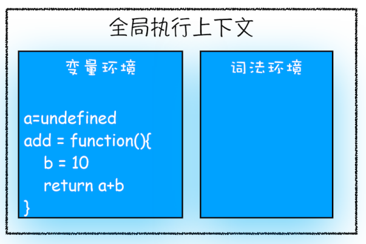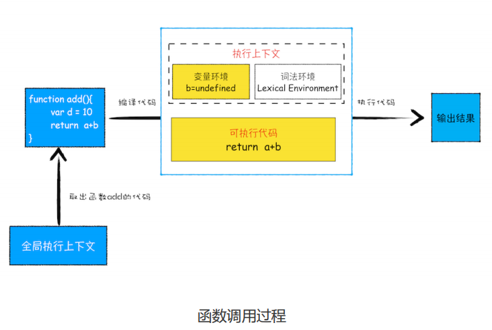
</center>
- 首先，从**全局执行上下文**中，取出 add 函数代码。
- 其次，对 add 函数的这段代码进行编译，并创建**该函数的执行上下文**和**可执行代码**。
- 最后，执行代码，输出结果。

**稍微复杂点的示例**

```js
var a = 2
function add(b,c){
  return b+c
}
function addAll(b,c){
    var d = 10
    result = add(b,c) // 此时对应下面调用栈
    return  a+result+d
}
addAll(3,6)
```

**第一步**，编译后创建全局上下文，并将其压入栈底。变量 a、函数 add 和 `addAll` 都保存到了全局上下文的变量环境对象中。

全局执行上下文压入到调用栈后，JavaScript 引擎便开始执行全局代码了，修改a的值。

<center class="half">
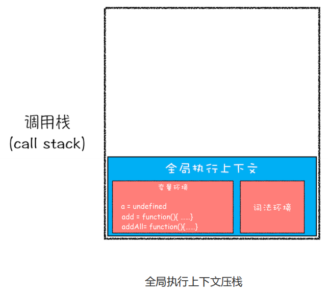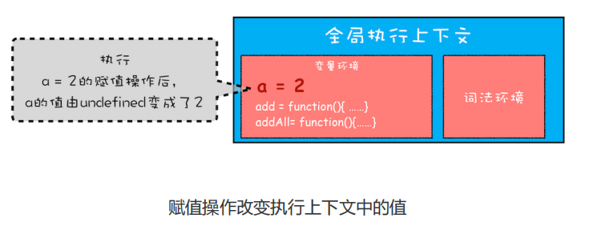
</center>


**第二步**，调用`addAll `函数，JavaScript 引擎会编译该函数，并为其创建一个执行上下文，最后还将该函数的执行上下文压入栈中。

`addAll `函数的执行上下文创建好之后，进入了函数代码的执行阶段，先执行的是 d=10 的赋值操作，执行语句会将 `addAll` 函数执行上下文中的 d 由 undefined 变成了 10。

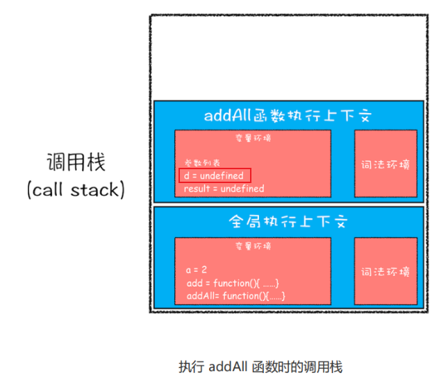

**第三步**，当执行到 add 函数调用语句，同样会为其创建执行上下文，并将其压入调用栈。

当 add 函数返回时，该函数的执行上下文就会从栈顶弹出，并将 result 的值设置为 add 函数的返回值 9。

紧接着 `addAll` 执行最后一个相加操作后并返回，`addAll` 的执行上下文也会从栈顶部弹出，此时调用栈中就只剩下全局上下文了。

<center class="half">
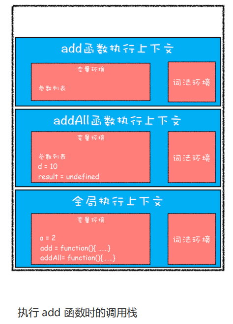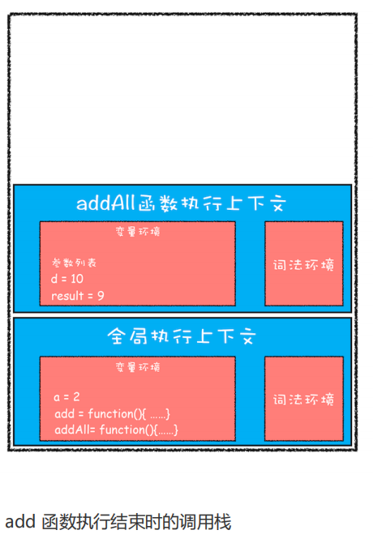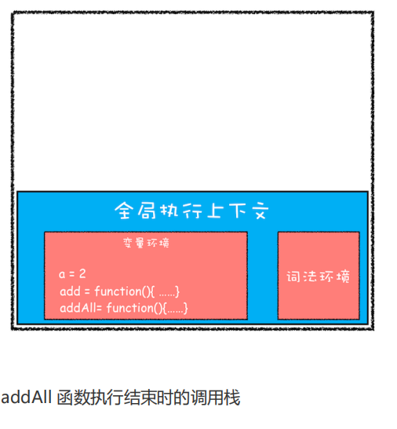
</center>
**在浏览器查看调用栈的信息**

<center class="half">
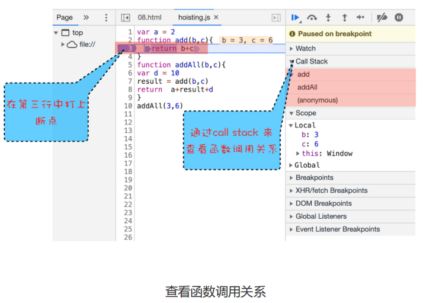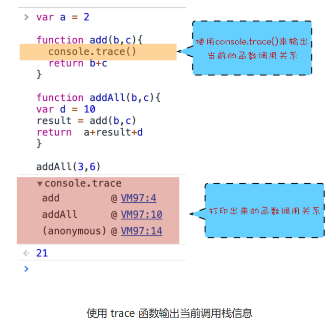
</center>

**优化递归防止栈溢出**

```js
function runStack (n) {
  if (n === 0) return 100;
  return runStack( n- 2);
}
runStack(50000)
```

### 3、作用域链和闭包

### 3.1 作用域

作用域就是变量与函数的可访问范围，作用域控制着变量和函数的可见性和生命周期。

`ES6` 之前是不支持块级作用域

- **全局作用域**中的对象在代码中的任何地方都能访问，其生命周期伴随着页面的生命周期。
- **函数作用域**就是在函数内部定义的变量或者函数，并且定义的变量或者函数只能在函数内部被访问。函数执行结束之后，函数内部定义的变量会被销毁。

`ES6` 引入了 let 和 `const` 关键字，从而使 JavaScript 也能像其他语言一样拥有了**块级作用域**

- function的**创建、初始化、赋值**均会被提升，编译阶段全都被存放到**变量环境**里面
- var的**创建、初始化**被提升，赋值不会被提升，编译阶段全都被存放到**变量环境**里面
- let、`const`的**创建**被提升，初始化、赋值不会被提升，编译阶段会被存放到**词法环境**（Lexical Environment）

```js
// 临时性死区：进入作用域但是没有被初始化的这段时间，处于这个阶段的变量没有办法访问
askQuestion(); // ReferenceError
let studentName = "Suzy";
function askQuestion() {
    console.log(`${ studentName }, do you know?`);
}
```

**示例**

```js
function foo(){
    var a = 1
    let b = 2
    {
      let b = 3
      var c = 4
      let d = 5
      console.log(a)
      console.log(b)
    }
    console.log(b) 
    console.log(c)
    console.log(d)
}   
foo()
```

**第一步**，编译并创建`foo`函数执行上下文

- 函数内部通过 `var` 声明的变量，在编译阶段**全都**被存放到**变量环境**里面了。

- 通过 `let` 声明的变量，在编译阶段会被存放到**词法环境（Lexical Environment）**中。

- 在函数的**块作用域**内部，通过 `let` 声明的变量并没有被存放到词法环境中。

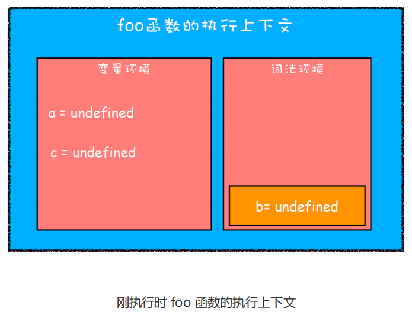

**第二步**，继续执行代码进入函数内部作用域块

- 作用域块中通过 let 声明的变量，会被存放在词法环境的一个**单独的区域**中，这个区域中的变量并不影响作用域块外面的变量。

- 在词法环境内部，维护了一个小型栈结构，栈底是函数最外层的变量，进入一个作用域块后，就会把该作用域块内部的变量压到栈顶；当作用域执行完成之后，该作用域的信息就会从栈顶弹出。

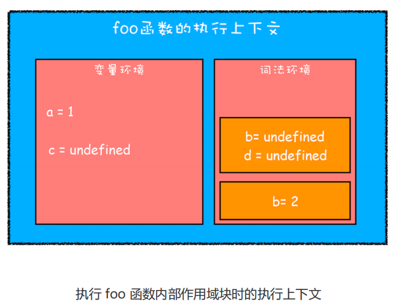

- 当执行到作用域块中的`console.log(a)`这行代码时，就需要在词法环境和变量环境中查找变量 a 的值了，具体查找方式是：沿着词法环境的栈顶向下查询，如果在词法环境中的某个块中查找到了，就直接返回给 JavaScript 引擎，如果没有查找到，那么继续在变量环境中查找。

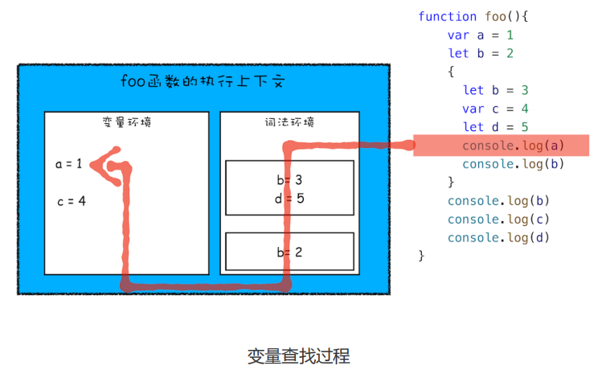

**第三步**，当块作用域执行完成之后，该词法环境块作用域的信息就会弹出

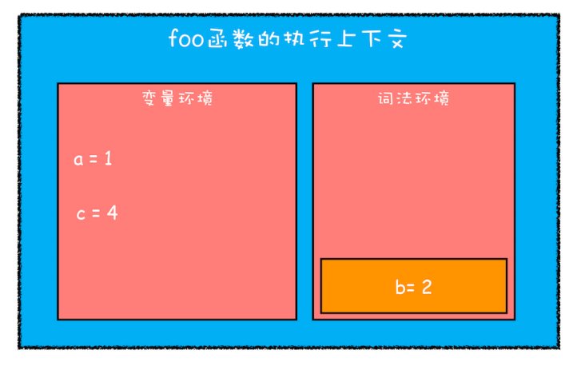

**块级作用域是通过词法环境的栈结构来实现的。**函数在执行的时候被编译，编译时变量环境和词法环境最顶层数据已经确定了。当执行到块级作用域的时候，块级作用域中通过let和`const`申明的变量会被追加到词法环境中，当这个块执行结束之后，追加到词法作用域的内容又会销毁掉。  

### 3.2 词法作用域

词法作用域就是指**作用域是由代码中函数声明的位置来决定**，所以词法作用域是静态的作用域，通过它就能够预测代码在执行过程中如何查找标识符。**词法作用域是代码阶段就决定好的，和函数是怎么调用的没有关系**。

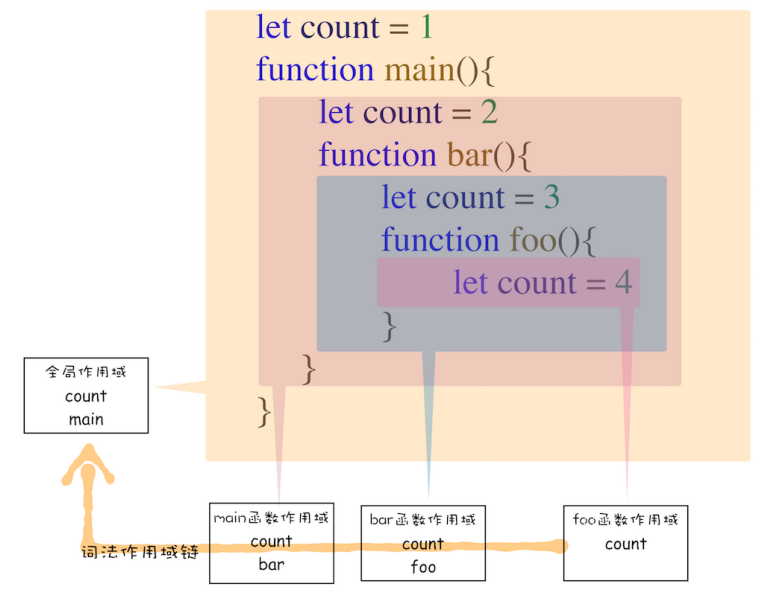

### 3.3 作用域链

在每个执行上下文的变量环境中，都包含了一个外部引用，用来指向外部的执行上下文，这个外部引用称为outer，和**词法作用域**有关

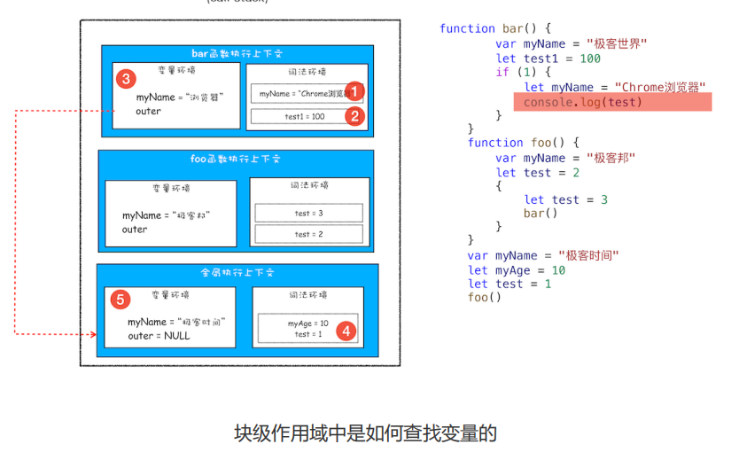

### 3.4 闭包

### 3.4.1 闭包的产生

在 JavaScript 中，根据词法作用域的规则，内部函数总是可以访问其外部函数中声明的变量，当通过调用一个外部函数返回一个内部函数后，即使该外部函数已经执行结束了，但是内部函数引用外部函数的变量依然保存在内存中，我们就把这些变量的集合称为闭包。比如外部函数是 `foo`，那么这些变量的集合就称为 `foo`函数的闭包。

```js
function foo() {
    var myName = "hello"
    let test1 = 1
    const test2 = 2
    var innerBar = {
        getName:function(){ // 编译阶段会扫面函数的定义，并把函数内部用到的变量保存到函数环境变量对象，函数可以引用这个对象
            console.log(test1)
            return myName
        },
        setName:function(newName){
            myName = newName
        }
    }
    return innerBar
}
var bar = foo()
// var bar1 = foo() // bar1中也保存了环境变量，和bar指向对象不一样，每运行一次foo就会生成一次新的备份
bar.setName("world")
console.log(bar.getName())
```

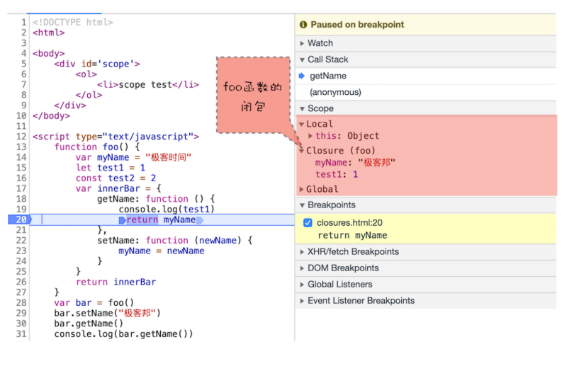

### 3.4.2 闭包定义

Closure is observed when a function uses variable(s) from outer scope(s) even while running in a scope where those variable(s) wouldn't be accessible.

A函数内部有B函数，B对A的变量有引用，在A函数外部调用A

关键点:

-  Must be **a function** involved 
-  Must **reference at least one variable** from an outer scope 

```js
var students = [       
    { id: 14, name: "Kyle" },       
    { id: 73, name: "Suzy" },   
];   
function getFirstStudent() {       
    return function firstStudent(){           
        return students[0].name;       
    };   
}   
var student = getFirstStudent();   
student(); // Kyle

function lookupStudent(studentID) {       
    return function nobody(){           
        var msg = "Nobody's here yet.";           
        console.log(msg);       
    };   
}   
var student = lookupStudent(112);   
student(); // Nobody's here yet.   
```

- Must be invoked in a different branch of the scope chain from the variable(s)

```js
function say(myName) {       
    var greeting = "Hello";       
    output();       
    function output() {           
        console.log(`${ greeting }, ${ myName }!`);       
    }   
}   

say("Kyle"); // Hello, Kyle!
```

**闭包和函数实例有关**

```js
function lookupStudent(studentID) {
    var students = [
        { id: 14, name: "Kyle" },
        { id: 73, name: "Suzy" },
        { id: 112, name: "Frank" },
        { id: 6, name: "Sarah" }
    ];
    return function greetStudent(greeting){
        var student = students.find(
            student => student.id == studentID
        );
        return `${ greeting }, ${ student.name }!`;
    };
}

// 每次运行lookupStudent都会产生新的函数实例greetStudent，同时产生新的闭包
var chosenStudents = [
    lookupStudent(6),
    lookupStudent(112)
];
chosenStudents[0].name; // greetStudent
chosenStudents[0]("Hello"); // Hello, Sarah!
chosenStudents[1]("Howdy"); // Howdy, Frank!
```

**除了函数作用域可以产生闭包，块作用域也可以**

```js
var hits;
var hello = '11'
{
    let count = 0;
    let hello = '22
    hits = function getCurrent(){
        count = count + 1;
        return count;
    };
}
// count可以被改变
hits();     // 1
hits();     // 2
hits();     // 3
```

### 4、this

**在对象内部的方法中使用对象内部的属性是一个非常普遍的需求**。但是 JavaScript 的作用域机制并不支持这一点，基于这个需求，JavaScript 又搞出来另外一套this 机制。

```js
var bar = {
    myName:"time.geekbang.com",
    printName: function () {
        console.log(myName) //  极客邦 ,不是输出对象内部属性time.geekbang.com
        // console.log(this.myName) // time.geekbang.com
    }    
}
function foo() {
    let myName = " 极客时间 "
    return bar.printName
}
let myName = " 极客邦 "
let _printName = foo()
_printName()
bar.printName()
//  极客邦 
//  极客邦
```

this就是函数运行时所在的对象（环境），**this 是和执行上下文绑定的**，也就是说每个执行上下文中都有一个 this。

执行上下文主要分为三种——全局执行上下文、函数执行上下文和 `eval` 执行上下文，所以对应的 this 也只有这三种——全局执行上下文中的 this、函数中的 this 和 `eval` 中的 this。

```js
var obj = { foo:  5 }; // obj是一个地址（reference）
// 如果要读取obj.foo，引擎先从obj拿到内存地址，然后再从该地址读出原始的对象，返回它的foo属性
{
  foo: {
    [[value]]: 5
    [[writable]]: true
    [[enumerable]]: true
    [[configurable]]: true
  }
}

// foo属性是函数，将函数的地址赋值给foo属性的value属性
var obj = { foo: function () {} };
{
  foo: {
    [[value]]: 函数的地址
    ...
  }
}

// 函数是一个单独的值，所以它可以在不同的环境（上下文）执行
f() // 顶层对象环境中执行
obj.f() // obj 环境执行

// JavaScript 允许在函数体内部，引用当前环境的其他变量，利用 this指向函数运行时所在的对象（环境）
var f = function () {
  console.log(this.x);
}

// 示例
var f = function () {
  console.log(this.x);
}
var x = 1;
var obj = {
  f: f,
  x: 2,
};
f() // 1
obj.f() // 2
```

### 4.1 分类

- 全局执行上下文中的 this指向了全局window 对象 

  -  在全局环境中调用一个函数，函数内部的 this 指向的是全局变量 window 

- 函数执行上下文中的 this 

  -  call、bind和apply，this指向方法传入参数 

  -  使用对象来调用其内部的一个方法，该方法的 this 是指向对象本身的 

     如果被setTimeout推迟执行的回调函数是某个对象的方法，那么该方法中的this关键字将指向全局环境，而不是定义时所在的那个对象 

  -  构造函数，this 指向新对象本身 


```js
let bar = {
  myName : "hello",
  test1 : 1
}
function foo(){
  this.myName = "world"
}
foo.call(bar) // hello this指bar

var myObj = {
  name : "hello", 
  showThis: function(){
    console.log(this)
  }
}
myObj.showThis() // myObj 

// setTimeout
var name= 1;
var MyObj = {
  name: 2,
  showName: function(){
    console.log(this.name); 
  }
}
setTimeout(MyObj.showName,1000) // this指向window
//使用 bind 方法
setTimeout(MyObj.showName.bind(MyObj), 1000)
```

### 4.2 this 的设计缺陷以及应对方案

- 嵌套函数中的 this 不会从外层函数中继承

  - 声明一个变量 self 用来保存 this 

  - 使用 `ES6` 中的箭头函数箭头函数并不会创建其自身的执行上下文，所以箭头函数中的 this 取决于它的外部函数 


  ```js
  var myObj = {     
      name : "hello",      
      showThis: function(){ 
          //this 指向的是 myObj 对象       
          console.log(this)       
          function bar(){console.log(this)} // this 指向的是全局 window 对象       
          bar()     
      }   
  }  
  myObj.showThis() // 返回一个函数，只有全局上下文   
  console.log(myObj.name) // 运行函数，由showThis内容生成函数上下文，词法环境只有bar，没有对象调用，this是window   
  console.log(window.name)
  
  // 解决方案1  
  var myObj = {     
      name : "hello",      
      showThis: function(){       
          console.log(this)       
          var self = this       
          function bar(){         
              self.name = "world "       
          }       
          bar()     
      }   
  }
  
  // 解决方案2 
  var myObj = {     
      name : "hello",      
      showThis: function(){       
          console.log(this)       
          var bar = ()=>{         
              this.name = "world"         
              console.log(this)      
          }       
          bar()     
      }   
  } 
  ```

- 普通函数中的 this 默认指向全局对象 window 
   -  通过 call 方法来显示调用 
   -  设置 JavaScript 的“严格模式”，在严格模式下，默认执行一个函数，其函数的执行上下文中的 this 值是 undefined


### 5、总结

`JS`执行分为**编译阶段和执行阶段**，编译阶段会产生执行上下文，执行阶段会在执行上下文查找相关变量

**执行上下文**有三种：全局、函数、`eval`

**作用域**有三种：全局、函数、块级

**作用域链**：词法环境-->变量环境-->outer-->词法环境-->变量环境-->outer...

**调用栈**就是用来管理这些执行上下文，编译只执行一次，所以执行上下文一开始就确定了

**变量环境**存放var生成的变量，var变量和function会变量提升

**词法环境**存放let、`const`生成的变量，当进入块级作用域时，会把块级作用域内let、`const`生成的变量压入词法环境中，块环境结束，相关变量会弹出栈

**outer**和函数位置有关，在全局就指向全局，在A函数内就指向A函数

**this**和执行上下文一样有三种，全局this指向window，函数this在通过object调用时指向object（setTimeout指向window），new指向新生成对象，apply、call指向方法传入参数，指数函数不生成执行上下文没有this

**A函数返回B函数**，B使用A里面的变量，B是A的闭包，A运行结束，执行上下文清除，B形成的**闭包**存在