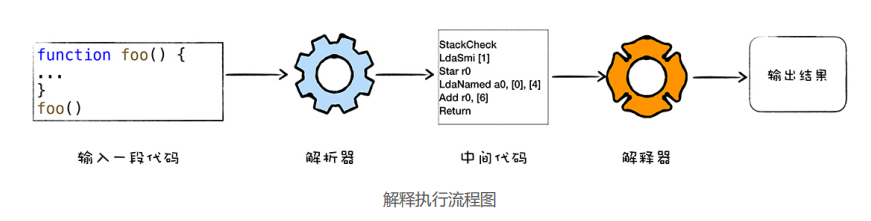
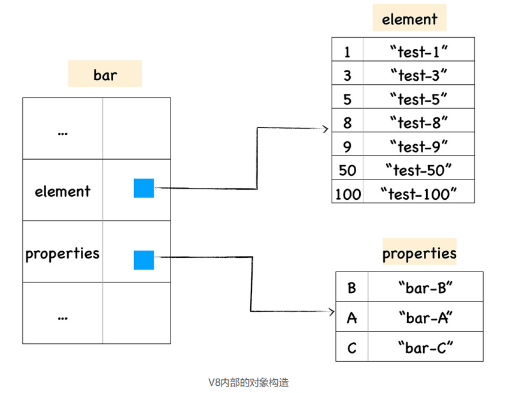
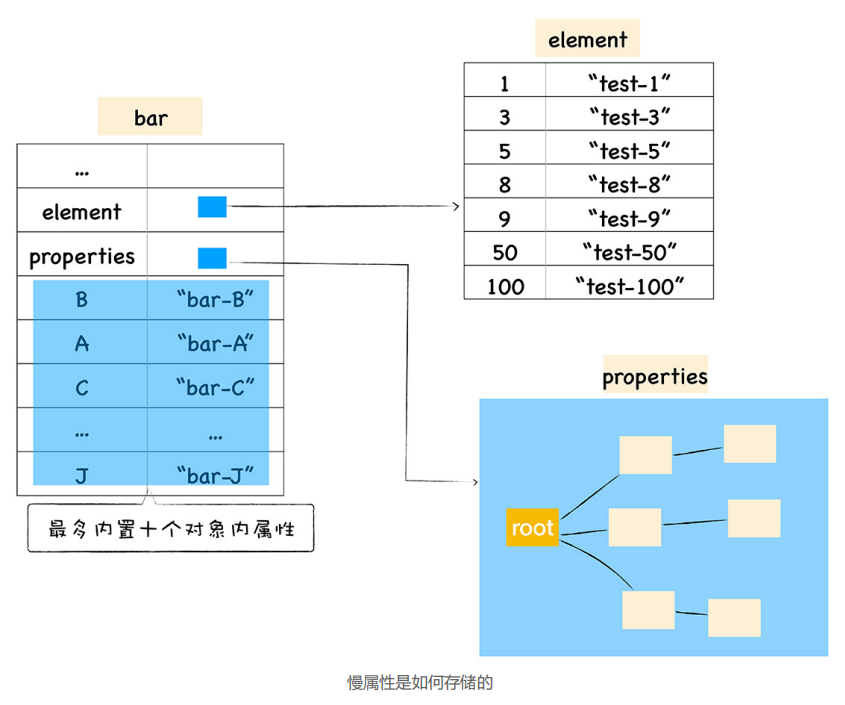
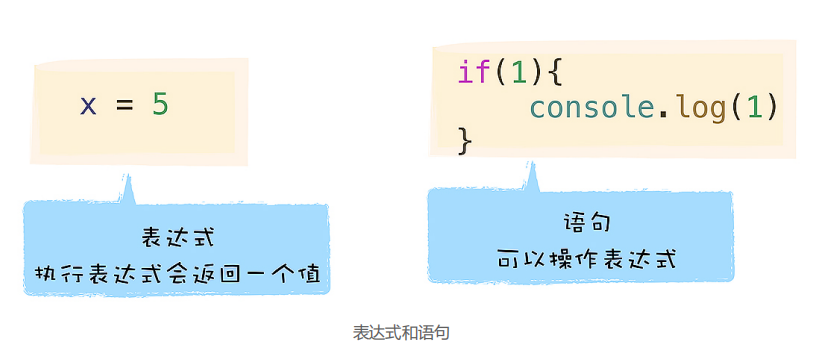
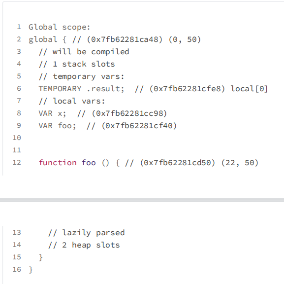

## 1、`V8`执行`JS`

计算机执行高级语言的两种基本的方式：**解释执行和编译执行**




执行 JavaScript 需要经过 JavaScript 虚拟机的转换，模拟计算机的这个编译执行流程， JavaScript 虚拟机比如苹果公司在 Safari 中就是用 `JavaScriptCore` 虚拟机，Firefox 使用了`TraceMonkey` 虚拟机，而 Chrome 则使用了 `V8` 虚拟机。

`V8` 是一个由 Google 开发的开源 JavaScript 引擎。 `V8`执行 JavaScript 代码：

- 首先需要将 JavaScript 代码转换为低级中间代码或者机器能够理解的机器代码

- 然后再执行转换后的代码并输出执行结果


## 2、JavaScript的函数

对象核心本质都就是由一组组属性和值组成的集合


函数是一种特殊的对象

默认的 name 属性值就是 anonymous，表示该函数对象没有被设置名称。

code 属性值表示函数代码，以字符串的形式存储在内存中。当执行到一个函数调用语句时，`V8` 便会从函数对象中取出 code 属性值，也就是函数代码，然后再解释执行这段函数代码。


闭包

如果要返回函数 bar 给外部，那么即便 foo 函数执行结束了，其内部定义的 number 变量也不能被销毁，因为 bar 函数依然引用了该变量。把这种将外部变量和和函数绑定起来的技术称为闭包。

```js
function foo(){
    var number = 1
    function bar(){
        number++
        console.log(number)
    }
    return bar
}
var mybar = foo()
mybar()
```

## 3、对象存储

非线性的数据结构，查询效率会低于线性的数据结构，`V8` 为了提升存储和查找效率，采用了一套复杂的存储策略

- 数字属性称为排序属性elements，`a[1]`
- 字符串属性被称为常规属性properties，`a[str]`

例子

- 10 个排序属性、10 个常规属性

  - 10 个常规属性作为对象内属性，存放在 bar 函数内部；

  - 10 个排序属性存放在 elements 中。


- 10 个排序属性、20个常规属性

  - 10 属性直接存放在 bar 的对象内 ;

  -  10 个常规属性以线性数据结构的方式存放在 properties 属性里面 ;

  - 10 个数字属性存放在 elements 属性里面。



- 10 个排序属性、100个常规属性

  - 10 属性直接存放在 bar 的对象内 ;

  - 90 个常规属性以非线性字典的这种数据结构方式存放在 properties 属性里面 ;

  - 10 个数字属性存放在 elements 属性里面。



## 4、函数表达式




### 4.1 `V8` 处理函数声明

```js
var x = 5
function foo(){
	console.log('Foo')
}
```


**编译阶段**

- `V8`解析到函数声明，会将这个函数声明转换为内存中的函数对象，并将其放到作用域中。

- `V8`解析到了变量声明，会将其放到作用域中，但是会将其值设置为 undefined，表示该变量还未被使用。

  将代码保存到 `test.js` 中，使用`d8 --print-scopes test.js`命令即可查看作用域的状态，打印出如下信息：



**执行阶段**

- 如果使用了某个变量，或者调用了某个函数，那么 `V8` 便会去作用域查找相关内容。

### 4.2 `V8` 处理函数表达式
