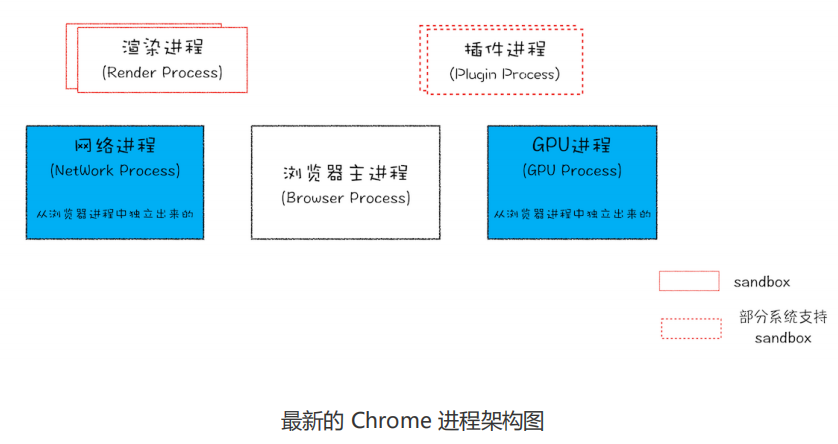
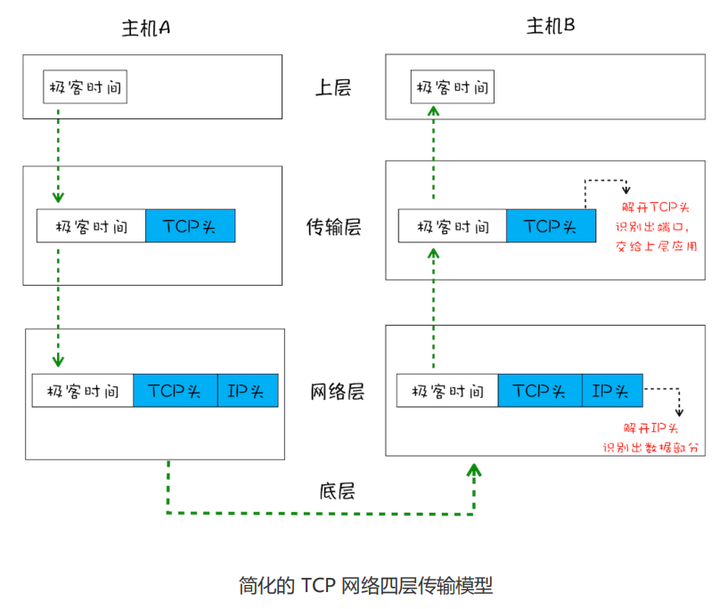
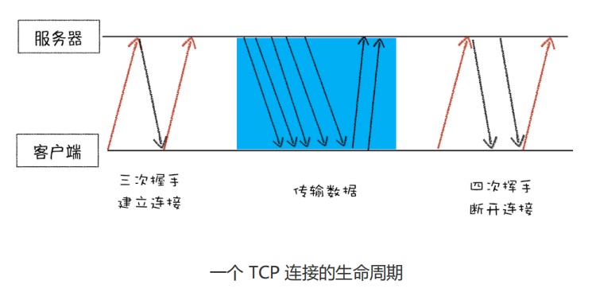
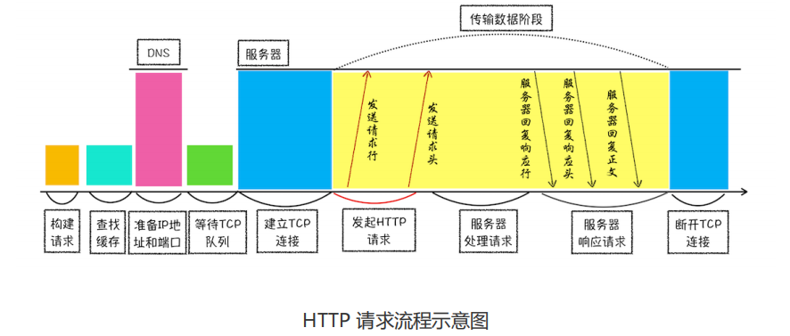
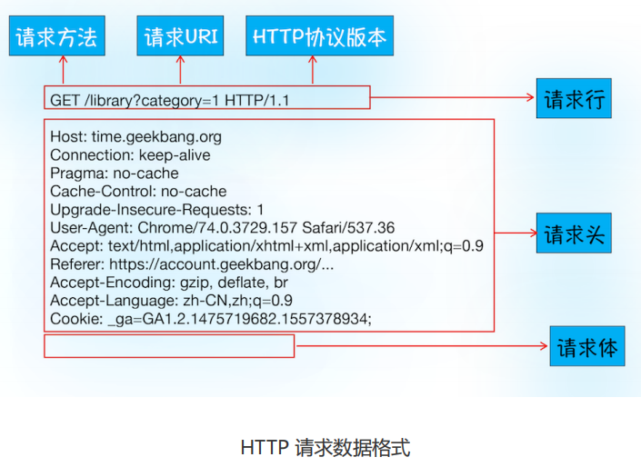
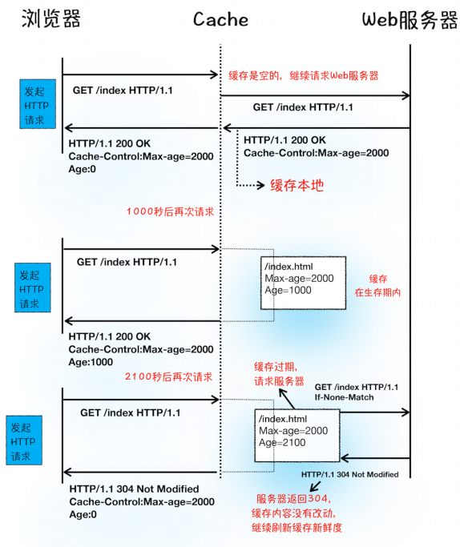
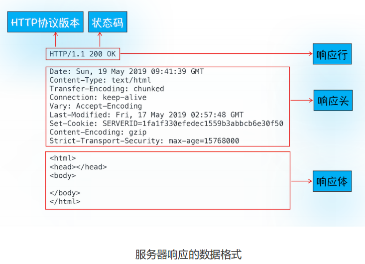
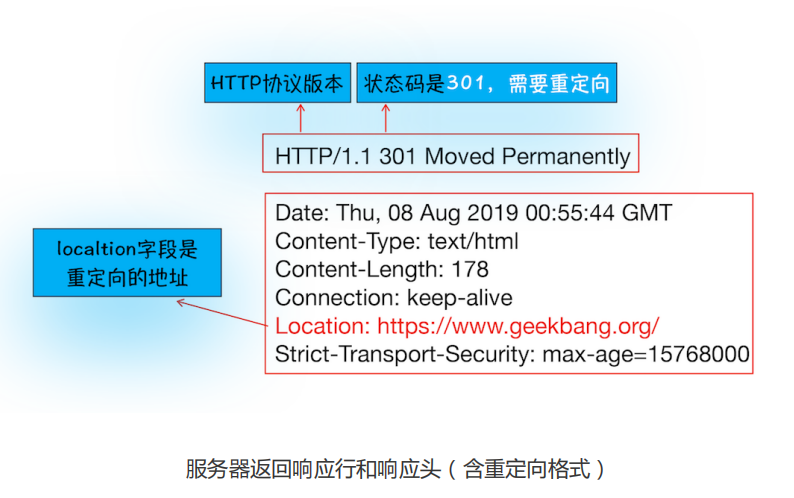
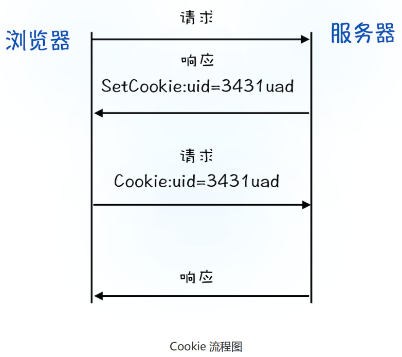
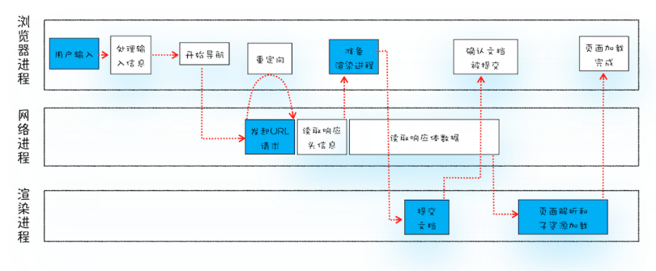

## 1、宏观视角下的浏览器

### 1.1 Chrome 进程架构

- **浏览器进程**：主要负责界面显示、用户交互、子进程管理，同时提供存储等功能。

- **渲染进程**：核心任务是将 HTML、`CSS `和 JavaScript 转换为用户可以与之交互的网页，排版引擎 Blink 和 JavaScript 引擎 `V8` 都是运行在该进程中，默认情况下，**Chrome 会为每个 Tab 标签创建一个渲染进程**。出于安全考虑，渲染进程都是运行在沙箱模式下。

- **`GPU` 进程**：其实，Chrome 刚开始发布的时候是没有 `GPU` 进程的。而 `GPU` 的使用初衷是为了实现 `3D CSS` 的效果，只是随后网页、Chrome 的 `UI` 界面都选择采用 `GPU` 来绘制，这使得 `GPU` 成为浏览器普遍的需求。最后，Chrome 在其多进程架构上也引入了`GPU` 进程。

- **网络进程**：主要负责页面的网络资源加载，之前是作为一个模块运行在浏览器进程里面的，直至最近才独立出来，成为一个单独的进程。

- **插件进程**：主要是负责插件的运行，因插件易崩溃，所以需要通过插件进程来隔离，以保证插件进程崩溃不会对浏览器和页面造成影响。

### 1.2 TCP协议

通过 `IP` 地址信息把数据包发送给指定的电脑，而 `UDP` 通过端口号把数据包分发给正确的程序。

`UDP` 不能保证数据可靠性，但是传输速度却非常快。

`TCP`（Transmission Control Protocol，传输控制协议）是一种面向连接的、可靠的、基于字节流的传输层通信协议。相对于 `UDP`，`TCP` 有下面两个特点:

- 对于数据包丢失的情况，TCP 提供重传机制；

- TCP 引入了数据包排序机制，用来保证把乱序的数据包组合成一个完整的文件。

- **首先，建立连接阶段**。这个阶段是通过“三次握手”来建立客户端和服务器之间的连接。TCP 提供面向连接的通信传输。**面向连接**是指在数据通信开始之前先做好两端之间的准备工作。所谓**三次握手**，是指在建立一个 TCP 连接时，客户端和服务器总共要发送三个数据包以确认连接的建立。

- **其次，传输数据阶段**。在该阶段，**接收端需要对每个数据包进行确认操作**，也就是接收端在接收到数据包之后，需要发送确认数据包给发送端。所以当发送端发送了一个数据包之后，在规定时间内没有接收到接收端反馈的确认消息，则判断为数据包丢失，并触发发送端的重发机制。同样，一个大的文件在传输过程中会被拆分成很多小的数据包，这些数据包到达接收端后，接收端会按照 TCP 头中的序号为其排序，从而保证组成完整的数据。

- **最后，断开连接阶段**。数据传输完毕之后，就要终止连接了，涉及到最后一个阶段“四次挥手”来保证双方都能断开连接。

### 1.3 HTTP请求流程

**浏览器端发起 HTTP 请求流程**

1. 构建请求

   

2. 查找缓存

   浏览器是通过响应头中的 `Cache-Control` 字段来设置是否缓存该资源。

   

3. 准备 `IP` 地址和端口

   HTTP 的内容是通过 TCP 的传输数据阶段来实现。

   浏览器会请求 `DNS` 返回域名对应的 `IP`。如果某个域名已经解析过了，那么浏览器会缓存解析的结果，以供下次查询时直接使用。
   
4. 等待 TCP 队列

   同一个域名同时最多只能建立 6 个 TCP 连接

5. 建立 TCP 连接

6. 发送 HTTP 请求

**服务器端处理 HTTP 请求流程**

1. 返回请求

   

2. 断开连接

   通常情况下，一旦服务器向客户端返回了请求数据，它就要关闭 TCP 连接。

   请求头设置`Connection:Keep-Alive` ，**保持 TCP 连接可以省去下次请求时需要建立连接的时间，提升资源加载速度**。

**重定向**

**登录状态保持**

1.4 URL 到页面展示流程

首先，用户从浏览器进程里**输入请求信息**；

然后，网络进程**发起 URL 请求**；

服务器响应 URL 请求之后，浏览器进程就又要开始**准备渲染进程**了；

渲染进程准备好之后，需要先向渲染进程提交页面数据，我们称之为**提交文档**阶段；渲染进程接收完文档信息之后，便开始**解析页面和加载子资源**，完成页面的渲染。
