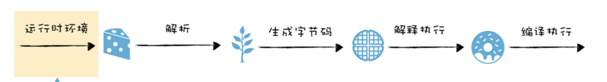
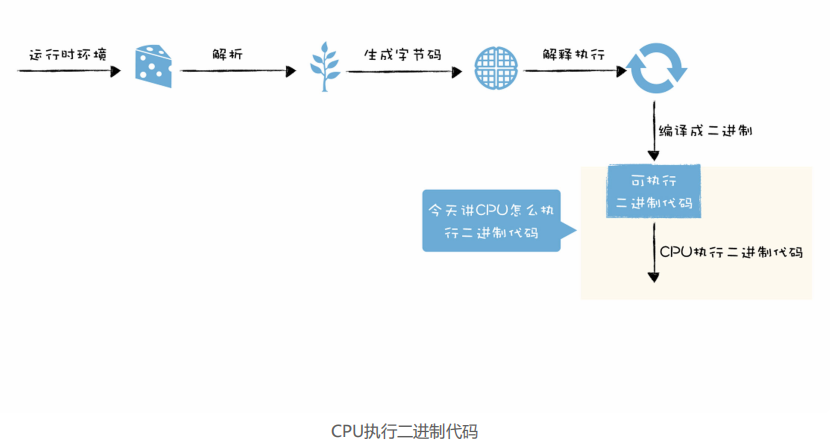
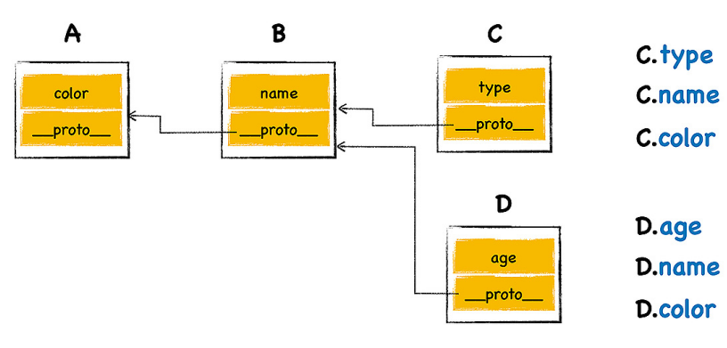
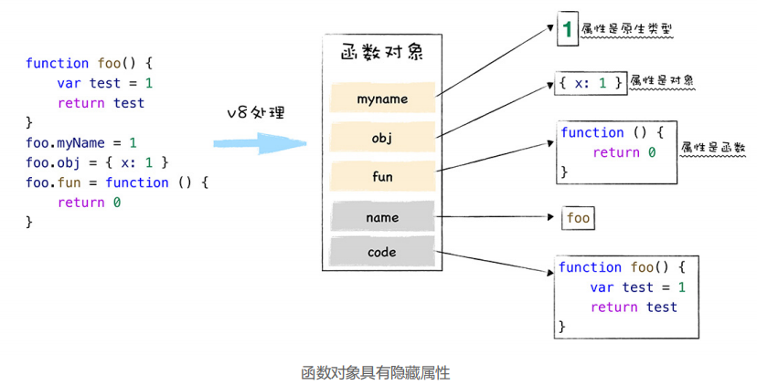

## 1、`V8`执行`JS`

计算机执行高级语言的两种基本的方式：**解释执行和编译执行**，JS是解释执行


执行 JavaScript 需要经过 JavaScript 虚拟机（解析器和解释器）的转换，虚拟机模拟计算机的这个编译执行流程， JavaScript 虚拟机有，比如苹果公司在 Safari 中就是用 `JavaScriptCore` 虚拟机，Firefox 使用了`TraceMonkey` 虚拟机，而 Chrome 则使用了 `V8` 虚拟机。

### 1.1 `V8` 的执行流程




- 准备代码的运行时环境：堆空间和栈空间、全局执行上下文、全局作用域、内置的内建函数、宿主环境提供的扩展函数和对象，消息循环系统。

- 执行 JavaScript 代码：解析源码、生成字节码、解释执行或者编译执行。

  - 首先需要将 JavaScript 代码转换为低级中间代码或者机器能够理解的机器代码


  - 然后再执行转换后的代码并输出执行结果


### 1.2 运行时环境


**宿主环境**

可以把 `V8` 和浏览器的渲染进程的关系看成病毒和细胞的关系，浏览器为 `V8` 提供基础的消息循环系统、全局变量、`Web API`，而 `V8` 的核心是实现了 `ECMAScript` 标准，还提供了垃圾回收器、协程等基础内容，不过这些功能依然需要宿主环境的配合才能完整执行。

如果 `V8` 使用不当，比如不规范的代码触发了频繁的垃圾回收，或者某个函数执行时间过久，这些都会占用宿主环境的主线程，从而影响到程序的执行效率，甚至导致宿主环境的卡死。

除了浏览器可以作为 `V8` 的宿主环境，`Node.js` 也是 `V8` 的另外一种宿主环境。

**构造数据存储空间：堆空间和栈空间**

宿主在启动 `V8` 的过程中，会同时创建堆空间和栈空间，再继续往下执行，产生的新数据都会存放在这两个空间中。

- 栈空间在内存中是连续的一块空间，主要是用来管理 JavaScript 函数调用的。查找效率非常高，内存中连续空间有限，如果函数调用层过深，会抛出栈溢出的错误。
- 堆空间是一种树形的存储结构，用来存储对象类型的离散的数据。

**全局执行上下文和全局作用域**

当` V8` 开始执行一段可执行代码时，会生成一个执行上下文。`V8 `用执行上下文来维护执行当前代码所需要的变量声明、this 指向等。

全局执行上下文在 `V8` 的生存周期内是不会被销毁。不经常使用的变量或者数据，最好不要放到全局执行上下文中。函数执行上下文在函数执行结束之后，就会被销毁。

作用域是静态的，函数定义的时候就已经确定了。执行上下文是动态的，调用函数时候创建，结束后还会释放。在 `ES6` 中，同一个全局执行上下文中，都能存在多个作用域。

```js
var x = 5
{
	let y = 2
	const z = 3
}
```

**构造事件循环系统**

`V8` 是寄生在宿主环境中的，它并没有自己的主线程，而是使用宿主所提供的主线程，`V8` 所执行的代码都是在宿主的主线程上执行的。

当执行完一个任务之后，事件循环系统会从消息队列中取出并执行下个任务，然后不断重复。

```JS
while(1){
	Task task = GetNewTask()；
	RunTask(task)；
}
```

在浏览器的页面中，`V8` 会和页面共用主线程，共用消息队列，所以如果 `V8` 执行一个函数过久，会影响到浏览器页面的交互性能。

### 1.3 CPU执行二进制机器码

**字节码的执行模式和 CPU 直接执行二进制代码的模式是类似的**




内存（快递柜）、内存地址（递柜中的每个单元格的编号）、CPU（操作快递柜的人）、通用寄存器（口袋）CPU 中用来存放数据的设备

`cpu`执行机器码流程：

- 首先，在程序执行之前，程序需要被装进内存

- CPU 从内存中**取出**一条指令，将下一条指令的地址更新到 PC 寄存器中，然后**分析**该指令，最后**执行**该指令（一个 CPU 时钟周期）。

常用的指令类型

- 加载的指令：从内存中复制指定长度的内容到通用寄存器中，并覆盖寄存器中原来的内容

  

- 存储的指令：将寄存器中的内容复制内存某个位置

  

- 更新指令：是复制两个寄存器中的内容到 ALU 中，也可以是一块寄存器和一块内存中的内容到 ALU 中，ALU 将两个字相加，并将结果存放在其中的一个寄存器中，并覆盖该寄存器中的内容

  

- 跳转指令：从指令本身抽取出一个字，这个字是下一条要执行的指令的地址，并将该字复制到 PC 寄存器中，并覆盖掉 PC 寄存器原来的值

  

 **V8 执行 JavaScript**

```js
function add(x, y) {
    var z = x+y
    return z
}
console.log(add(1, 2))
```


- 使用内存中的一块区域来存放字节码；

- 使用了通用寄存器 r0，r1，r2，…… 这些寄存器用来存放一些中间数据；

- PC 寄存器用来指向下一条要执行的字节码；

- 栈顶寄存器用来指向当前的栈顶的位置。

### 1.4 函数调用的内存布局


**函数有两个主要的特性：**

1. 第一个特点是函数可以被调用；
2. 第二个特点是函数具有作用域机制，所谓作用域机制，是指函数在执行的时候可以将定义在函数内部的变量和外部环境隔离，在函数内部定义的变量我们也称为临时变量，临时变量只能在该函数中被访问，外部函数通常无权访问，当函数执行结束之后，存放在内存中的临时变量也随之被销毁。

```c
int getZ() { return 4; }
int add(int x, int y) {
	int z = getZ();
	return x + y + z;
}
int main(){
	int x = 5;
	int y = 6;
	int ret = add(x, y);
}
```


函数调用者的生命周期总是长于被调用者（后进），并且被调用者的生命周期总是先于调用者的生命周期结束 (先出)。


站在函数资源分配和回收角度来看，被调用函数的资源分配总是晚于调用函数 (后进)，而函数资源的释放则总是先于调用函数 (先出)。


通过观察函数的生命周期和函数的资源分配情况，我们发现，它们都符合后进先出 (LIFO)的策略，而栈结构正好满足这种后进先出 (LIFO) 的需求，所以我们选择栈来管理函数调用关系是一种很自然的选择。

**栈管理函数调用**

函数在执行过程中，其内部的临时变量会按照执行顺序被压入到栈中

```c
int add(num1,num2){
    int x = num1;
    int y = num2;
    int ret = x + y;
    return ret;
}

int main(){
    int x = 5;
    int y = 6;
    x = 100;
    int z = add(x+y);
    return z;
}
```


`esp` 寄存器：保存一个永远指向当前栈顶指针，告诉添加新元素位置

`ebp` 寄存器：保存当前函数的起始位置（栈帧指针）

在 main 函数调用 add 函数的时候，**main 函数的栈顶指针就变成了 add 函数的栈帧指针**，所以需要将 main 函数的栈顶指针保存到 `ebp` 中，CPU 会将当前 main 函数的栈帧指针保存在栈中。

当函数调用结束之后，就需要恢复 main 函数的执行现场了，首先取出 `ebp` 中的指针，写入 `esp` 中，然后从栈中取出之前保留的 main 的栈帧地址，将其写入 `ebp` 中，到了这里`ebp` 和 `esp` 就都恢复了，可以继续执行 main 函数了。、

```js
// 栈溢出的错误
function foo() {
	foo() 
}
foo()

// 程序就可以正确执行
// 使用 setTimeout 将要执行的函数放到其他的任务中去执行
function foo() {
    setTimeout(foo, 0) 
}

// 在浏览器中执行这段代码，并没有报告栈溢出的错误，但是你会发现，执行这段代码会让整个页面卡住了
// 主线程在当前任务快要执行结束之前，检查微任务队列中是否存在微任务，如果有，那么那么那么当前任务会依次取出微任务队列中的微任务，并一一执行。微任务队列是属于当前宏任务的，所以一个宏任务中产生的微任务，只会放到它自己的微任务队列中。
// 相当于在当前这一轮任务里不停地创建微任务，执行，创建，执行，创建……虽然不会爆栈，但也无法去执行下一个任务，主线程被卡在这里了，所以页面会卡死
function foo() {
	return Promise.resolve().then(foo)
}
foo()
```


### 1.5 `V8`实现闭包

`V8`不会一次性将所有的 JavaScript 解析为中间代码，函数内部代码不会解析。

主流的 JavaScript 虚拟机都实现了**惰性解析**。所谓惰性解析是指解析器在解析的过程中，如果遇到函数声明，那么会跳过函数内部的代码，并不会为其生成`AST` 和字节码，而仅仅生成顶层代码的 `AST` 和字节码。

JavaScript 闭包相关的三个重要特性：

- 可以在 JavaScript 函数内部定义新的函数；

- 内部函数中访问父函数中定义的变量；

-  JavaScript 中的函数是一等公民，所以函数可以作为另外一个函数的返回值。

```js
function foo() {
    var d = 20
    return function inner(a, b) {
        const c = a + b + d
        return c
    }
}
const f = foo() // 此时
```


本来`foo`函数执行完，上下文也会被清理，但是内部函数`inner`引用了`foo`函数中变量`d`，变量`d`不能随着执行上下文被销毁掉。

`V8`采取惰性解析，不会解析 `inner`函数，但是 `V8` 还是需要判断 `inner` 函数是否引用了 `foo` 函数中的变量，负责处理这个任务的模块叫着预解析器。

**预解析器**：当解析顶层代码的时候，遇到了一个函数，不会直接跳过该函数，而是对该函数做一次快速的预解析

- 第一，是判断当前函数是不是存在一些语法上的错误

- 第二，除了检查语法错误之外，预解析器另外的一个重要的功能就是检查函数内部是否引用了外部变量，如果引用了外部的变量，预**解析器会将栈中的变量复制到堆中**，在下次执行到该函数的时候，直接使用堆中的引用，即便当前函数执行结束之后，也不会释放该变量。

**防止内存泄漏**

内存泄漏可以定义为：当进程不再需要某些内存的时候，这些不再被需要的内存依然没有被进程回收。例如在函数中`this.temp_array = new Array(200000)`，保存到全局变量中，即使函数销毁，变量依旧存在。


## 2、对象存储

### 2.1 对象存储

非线性的数据结构，查询效率会低于线性的数据结构，`V8` 为了提升存储和查找效率，采用了一套复杂的存储策略

- 数字属性称为排序属性elements，`a[1]`
- 字符串属性被称为常规属性properties，`a[str]`

例子

- 10 个排序属性、10 个常规属性

  - 10 个常规属性作为对象内属性，存放在 bar 函数内部；

  - 10 个排序属性存放在 elements 中。


- 10 个排序属性、20个常规属性

  - 10 属性直接存放在 bar 的对象内 ;

  - 10 个常规属性以线性数据结构的方式存放在 properties 属性里面 ;

  - 10 个数字属性存放在 elements 属性里面。


- 10 个排序属性、100个常规属性

  - 10 属性直接存放在 bar 的对象内 ;

  - 90 个常规属性以非线性字典的这种数据结构方式存放在 properties 属性里面 ;

  - 10 个数字属性存放在 elements 属性里面。


### 2.2 对象继承

继承就是一个对象可以访问另外一个对象中的属性和方法，在JavaScript 中，通过原型和原型链的方式来实现了继承特性。 ES2015/ES6 中引入了 class 关键字，但那只是语法糖。

每个对象都有一个**原型属性**（` __proto__ `），该属性指向了**原型对象**，查找属性的时候，JavaScript 虚拟机会沿着原型一层一层向上查找，直至找到正确的属性。这个查找属性的路径称为**原型链**。



不应该直接通过` _proto_ `来访问或者修改该属性，其主要原因有两个：

- 首先，这是隐藏属性，并不是标准定义的 ;

- 其次，使用该属性会造成严重的性能问题。

使用构造函数来创建对象，设置对象的原型对象

**构造函数创建对象**

```js
function DogFactory(type,color){
    this.type = type
    this.color = color
}
var dog = new DogFactory('Dog','Black')

// V8 模拟代码
var dog = {}
dog.__proto__ = DogFactory.prototype
DogFactory.call(dog,'Dog','Black')
```


**构造函数实现继承**

```js
function DogFactory(type,color){
    this.type = type
    this.color = color
}
DogFactory. prototype.constant_temperature = 1
var dog1 = new DogFactory('Dog','Black')
var dog2 = new DogFactory('Dog','Black')
var dog3 = new DogFactory('Dog','Black')
```

每个函数对象中都有一个公开的 prototype 属性，当将这个函数作为构造函数来创建一个新的对象时，新创建对象的原型对象就指向了该函数的 prototype 属性。prototype 属性指向一个对象。

每个对象都有原型，函数是对象（原型指向`Function.prototype`），函数prototype属性也是对象（原型指向`Object.prototype`）。`Function.prototype`也是对象（原型指向`Object.prototype`）。`Object.prototype`指向`nll`，原型链的尽头。


### 2.3 类型系统

类型系统type system：用于定义如何将编程语言中的数值和表达式归类为许多不同的类型，如何操作这些类型，这些类型如何互相作用。在 JavaScript 中，类型系统是依据 `ECMAScript` 标准来实现的，所以 `V8 `会严格根据 `ECMAScript` 标准来执行。

`V8` 会提供了一个 `ToPrimitve` 方法，其作用是变量转换为原生数据类型，其转换流程如下：

- 先检测该对象中是否存在 `valueOf` 方法，如果有并返回了原始类型，那么就使用该值进行强制类型转换；

- 如果 `valueOf` 没有返回原始类型，那么就使用 `toString` 方法的返回值；

- 如果 `vauleOf` 和 `toString` 两个方法都不返回基本类型值，便会触发一个 `TypeError` 的错误

**将对象转换为原生类型的流程图**


在执行加法操作的时候，`V8` 会通过 `ToPrimitve` 方法将对象类型转换为原生类型，最后就是两个原生类型相加，如果其中一个值的类型是字符串时，则另一个值也需要强制转换为字符串，然后做字符串的连接运算。在其他情况时，所有的值都会转换为数字类型值，然后做数字的相加。

### 2.4 内存中查找对象属性

**静态语言**

C++ 代码在执行之前需要先被编译，编译的时候，每个对象的形状都是固定的，也就是说，在代码的执行过程中，Point 的形状是无法被改变的。静态语言中，可以直接通过偏移量查询来查询对象的属性值，执行效率高。


**隐藏类**

C++中的对象是固定的，但是JS中对象是可变的， 为了提高对象执行效率，参考静态语言V8 在运行 JavaScript的过程中，会假设 JavaScript 中的对象是静态的，具体地讲，V8 对每个对象做如下两点假设：

- 对象创建好了之后就不会添加新的属性；

- 对象创建好了之后也不会删除属性。

符合这两个假设之后，V8 会为每个对象创建一个隐藏类（map属性），记录了该对象一些基础的布局信息：

- 对象中所包含的所有的属性；

- 每种类型相对于对象的偏移量。


**多个对象共用一个隐藏类**

如果两个对象的形状是相同的，V8 就会为其复用同一个隐藏类，这样有两个好处：

1. 减少隐藏类的创建次数，也间接加速了代码的执行速度；

2. 减少了隐藏类的存储空间。

两个对象的形状是相同的，要满足以下两点：

- 相同的属性名称；

- 相等的属性个数。


**重新构建隐藏类**

- 如果对象的形状没有发生改变，那么该对象就会一直使用该隐藏类；

- 如果对象的形状发生了改变，那么 V8 会重建一个新的隐藏类给该对象，这对于 V8 的执行效率来说，是一笔大的开销。

**最佳实践**

- 使用字面量初始化对象时，要保证属性的顺序是一致的。

- 尽量使用字面量一次性初始化完整对象属性。

- 尽量避免使用 delete 方法。

## 3、函数

### 3.1 函数是对象

**对象**核心本质都就是由一组组属性和值组成的集合


**函数是一种特殊的对象**，函数有两个内置属性

- 默认的 name 属性值就是 anonymous，表示该函数对象没有被设置名称。

- code 属性值表示函数代码，以字符串的形式存储在内存中。当执行到一个函数调用语句时，`V8` 便会从函数对象中取出 code 属性值，也就是函数代码，然后再解释执行这段函数代码。



### 3.2 作用域

- 作用域就是**存放变量和函数**的地方。

- **作用域链**是沿着函数的作用域一级一级来查找变量的，而原型链是沿着对象的原型一级一级来查找属性的。

- 全局作用域是在 `V8` 启动过程中就创建了，且一直保存在内存中不会被销毁的，直至 `V8` 退出。 而函数作用域是在执行该函数时创建的，当函数执行结束之后，函数作用域就随之被销毁掉了。

- `V8` 还会默认将隐藏变量 **this** 存放到作用域中。

### 3.3 函数声明和函数表达式

函数声明的本质是语句，而函数表达式的本质则是表达式


**`V8` 处理函数和变量声明**

```js
var x = 5
function foo(){
	console.log('Foo')
}
```


**编译阶段**

- `V8`解析到函数声明，会将这个函数声明转换为内存中的函数对象，并将其放到作用域中。

- `V8`解析到了变量声明，会将其放到作用域中，但是会将其值设置为 `undefined`，表示该变量还未被使用。

  在变量提升阶段，`V8` 并不会执行赋值的表达式，该阶段只会分析基础的语句，比如变量的定义，函数的声明。`var x = 5`会被分解成`var x; x == 5`，`var x `是在编译阶段完成的，也可以说是在变量提升阶段完成的，而`x = 5`是表达式，所有的表达式都是在执行阶段完成的。

  将代码保存到 `test.js` 中，使用`d8 --print-scopes test.js`命令即可查看作用域的状态，打印出如下信息：


**执行阶段**

- 如果使用了某个变量，或者调用了某个函数，那么 `V8` 便会去作用域查找相关内容。

### 3.4`IIFE`

括号里面是一个表达式，整个语句也是一个表达式。

因为括号之间存放的必须是表达式，所以如果在小阔号里面定义一个函数，那么 V8 就会把这个函数看成是函数表达式。

```js
var n = 1;
(function foo(){
     n = 100;
    console.log(n);
}())
console.log(n); // 100 100
```

